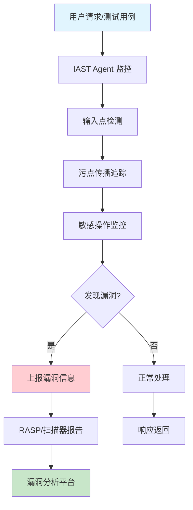
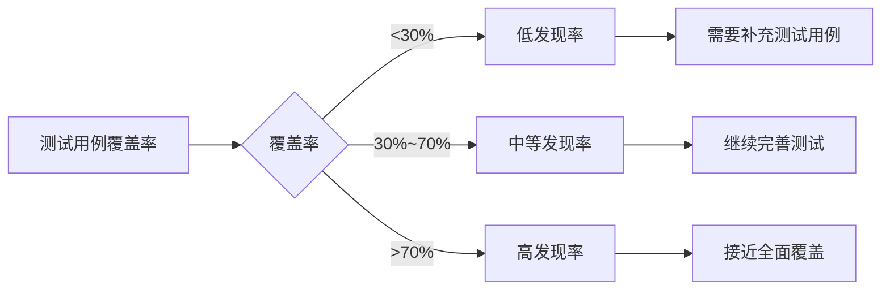
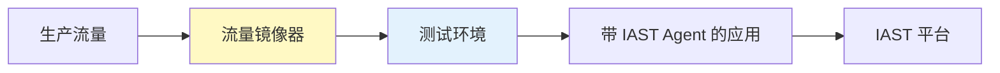

2019年，某电商公司在「双十一」大促前进行了全面安全测试，使用了当时最先进的黑盒扫描工具。测试报告显示系统「安全可靠」。

然而大促当天，黑客利用一个业务逻辑漏洞盗取了大量用户数据。事后复盘发现：黑盒扫描无法发现这个隐藏在业务逻辑中的漏洞，因为它既不是 SQL 注入，也不是 XSS，而是「同一用户重复领取优惠券」的逻辑缺陷。

这个案例揭示了一个根本问题：**黑盒测试（DAST）和白盒测试（SAST）都有盲区**。IAST（交互式应用安全测试）正是为了弥补这个 Gap 而诞生。

## 一、IAST 的定义

### 1.1 什么是 IAST

IAST（Interactive Application Security Testing，交互式应用安全测试）是一种结合了 SAST 和 DAST 特点的运行时安全测试技术：

| 特性 | 说明 |
|------|------|
| 分析时机 | 测试运行时 |
| 分析方式 | 插桩 + 动态分析 |
| 代码依赖 | 需要访问源代码或字节码 |
| 覆盖范围 | 数据流、控制流、配置 |

IAST 的核心思想是：**在真实运行环境中，通过插桩技术追踪用户输入在应用内部的传播路径，从而精确发现漏洞**。

### 1.2 IAST 的工作原理



IAST 的工作流程可以分解为以下步骤：

1. **插桩阶段**：在应用启动时加载 Agent，修改目标代码或字节码
2. **输入捕获**：Hook 用户输入入口（如 HTTP 参数、Header、Cookie）
3. **传播追踪**：跟踪污点数据从输入到敏感操作的传播路径
4. **漏洞判定**：基于预定义规则判断是否存在安全漏洞
5. **结果上报**：将发现的问题上报到管理平台

### 1.3 插桩技术详解

IAST 的核心技术是插桩（Instrumentation）。Java 平台主要使用 Java Agent 技术：

```java title="IAST Java Agent 核心结构"
import java.lang.instrument.Instrumentation;
import java.lang.instrument.ClassFileTransformer;
import java.security.ProtectionDomain;

public class IASTAgent {
    
    private static Instrumentation instrumentation;
    
    // Agent 入口点
    public static void premain(String agentArgs, Instrumentation inst) {
        instrumentation = inst;
        
        // 注册类转换器
        instrumentation.addTransformer(new SecurityClassFileTransformer(), true);
        
        System.out.println("IAST Agent 已加载，开始监控应用安全...");
    }
    
    // 类转换器：修改目标类的字节码
    static class SecurityClassFileTransformer implements ClassFileTransformer {
        
        @Override
        public byte[] transform(
            ClassLoader loader,
            String className,
            Class<?> classBeingRedefined,
            ProtectionDomain protectionDomain,
            byte[] classfileBuffer
        ) {
            // 只处理业务类
            if (!isTargetClass(className)) {
                return null;
            }
            
            // 分析字节码，添加安全监控逻辑
            return instrumentClass(classfileBuffer);
        }
        
        private boolean isTargetClass(String className) {
            // 过滤框架类，只关注业务代码
            return className.startsWith("com/myapp/")
                && !className.contains("$");
        }
    }
}
```

插桩的核心是在关键位置植入 Hook 代码：

| Hook 点类型 | 示例 | 监控内容 |
|------------|------|---------|
| 输入源 | `HttpServletRequest.getParameter()` | 用户输入 |
| 数据库操作 | `PreparedStatement.executeQuery()` | SQL 语句 |
| 文件操作 | `FileInputStream.read()` | 文件路径 |
| 命令执行 | `Runtime.exec()` | 系统命令 |
| 反射调用 | `Class.forName()` | 动态加载 |

## 二、IAST 工具对比

### 2.1 主流工具概览

| 工具 | 厂商 | 语言支持 | 部署方式 | 特点 |
|------|------|----------|----------|------|
| Contrast Community | Contrast Security | Java、.NET、Node.js、Python | Agent | 免费社区版 |
| Hdiv | Hdiv Security | Java | Agent | 专注 Web 安全 |
| Risp | NSFOCUS | Java | Agent | 国产工具 |
| Veracode IAST | Veracode | 多语言 | SaaS/本地 | 企业级 |
| Seeker | Synopsys | Java、.NET、Node.js | Agent | 精准定位 |

### 2.2 Contrast Security

Contrast 是 IAST 领域的领导者，其社区版是免费的：

```yaml title="Contrast Java Agent 配置"
# contrast_security.yaml
api:
  url: https://ct.contrastsecurity.com/Contrast
  api_key: YOUR_API_KEY
  service_key: YOUR_SERVICE_KEY
  user_name: agent@company.com

agent:
  java:
    standalone: true
    app_name: my-application
    server_name: production-server-1
    
    # 监控规则配置
    security:
      enabled: true
      rules:
        sql-injection: log
        xss: block
        path-traversal: log
        command-injection: block
```

```bash title="启动带 IAST Agent 的应用"
# 通过 -javaagent 参数加载 Agent
java -javaagent:contrast-agent.jar \
     -Dcontrast.config=contrast_security.yaml \
     -jar my-application.jar
```

### 2.3 Hdiv

Hdiv 专注于 Web 应用安全，特别擅长检测业务逻辑漏洞：

| 功能 | 说明 |
|------|------|
| 数据流追踪 | 从输入到输出的完整路径 |
| CSRF 防护 | 自动验证 CSRF Token |
| SQL 注入防护 | 参数化查询验证 |
| 业务逻辑监控 | 检测异常业务行为 |

### 2.4 国产工具：Risp

Risp（瑞星安全产品）是国内较早的 IAST 工具：

```properties title="Risp Agent 配置 risp.properties"
# 应用信息
app.name=payment-service
app.version=2.1.0
app.group=finance

# 服务器信息
server.name=prod-server-01
server.env=production

# 漏洞检测开关
risp.enabled=true
risp.rules.sql-injection.enabled=true
risp.rules.xss.enabled=true
risp.rules.command-injection.enabled=true
risp.rules.path-traversal.enabled=true

# 性能阈值
risp.perf.slow-request.threshold=5000
risp.perf.max-trace-length=10000
```

## 三、IAST 的优势

### 3.1 高准确性

IAST 最大的优势是**极低的误报率**：

| 对比维度 | SAST | DAST | IAST |
|----------|------|------|------|
| 误报率 | 30%~50% | 10%~20% | `<5%` |
| 漏报率 | 低 | 中 | 低 |
| 定位精度 | 文件级别 | URL 级别 | 代码行级别 |

IAST 能够在运行时观察数据的实际流向，只有当「用户输入 → 未经净化 → 到达敏感操作」这条完整链路被确认时，才会报告漏洞。

### 3.2 完整覆盖

IAST 可以覆盖多种漏洞类型：

- SQL 注入、NoSQL 注入
- XSS（反射型、存储型、DOM 型）
- 命令注入、代码注入
- 文件操作漏洞（路径遍历、任意文件读取）
- 反序列化漏洞
- 业务逻辑漏洞（水平越权、垂直越权）
- 敏感信息泄露

### 3.3 实时检测

IAST Agent 实时运行，可以：

1. **发现新漏洞**：代码变更后立即检测
2. **追踪修复**：漏洞修复后立即验证
3. **性能监控**：发现安全漏洞同时记录性能问题

## 四、IAST 的局限性

### 4.1 依赖测试用例

IAST 无法自动生成测试用例，**必须有真实的请求才能触发检测逻辑**：

| 场景 | IAST 表现 |
|------|----------|
| 有完整测试用例 | 发现率高 |
| 只有基础冒烟测试 | 中等覆盖 |
| 没有测试用例 | 无法发现漏洞 |

### 4.2 性能开销

IAST Agent 会带来一定的运行时开销：

| 开销类型 | 影响 | 典型数值 |
|----------|------|----------|
| 启动时间 | 略微增加 | +2~5 秒 |
| 响应延迟 | 轻微增加 | 1%~3% |
| 内存占用 | 需要额外内存 | +50~200MB |
| CPU 开销 | 持续监控 | 5%~10% |

### 4.3 覆盖率依赖

IAST 的漏洞发现率直接取决于测试覆盖率：



### 4.4 无法发现的漏洞

即使覆盖率 100%，IAST 也有盲区：

| 漏洞类型 | 无法发现的原因 |
|----------|----------------|
| 纯前端漏洞 | 不经过后端 |
| 加密算法缺陷 | 需要密码学分析 |
| 第三方服务漏洞 | Agent 无法监控 |
| 部署配置问题 | 非代码层面 |

## 五、IAST vs SAST vs DAST 对比

| 维度 | SAST | DAST | IAST |
|------|------|------|------|
| 测试时机 | 构建阶段 | 运行阶段 | 测试阶段 |
| 代码访问 | 必须 | 不需要 | 需要 |
| 误报率 | 高 | 中 | 低 |
| 覆盖率 | 高 | 中 | 高 |
| 性能影响 | 无 | 中 | 轻微 |
| 漏洞定位 | 精确 | 模糊 | 精确 |
| 业务逻辑漏洞 | 部分 | 全部 | 大部分 |
| 部署复杂度 | 低 | 中 | 中高 |

:::tip 最佳实践
IAST 不是替代 SAST 或 DAST，而是互补关系。**推荐组合策略**：

1. **开发阶段**：SAST（代码编写时发现问题）
2. **测试阶段**：IAST（功能测试时发现问题）
3. **预发布阶段**：DAST（模拟黑客攻击）

三者结合可以实现 90% 以上的漏洞覆盖率。
:::

## 六、CI/CD 集成实践

### 6.1 Maven 集成

```xml title="pom.xml 配置 IAST Agent"
<plugins>
    <plugin>
        <groupId>org.apache.maven.plugins</groupId>
        <artifactId>maven-surefire-plugin</artifactId>
        <version>3.2.2</version>
        <configuration>
            <argLine>
                -javaagent:${agent.path}/contrast-agent.jar
                -Dcontrast.config=${agent.path}/contrast_security.yaml
                -Dcontrast.application.name=${project.artifactId}
            </argLine>
        </configuration>
    </plugin>
</plugins>
```

### 6.2 GitLab CI 集成

```yaml title=".gitlab-ci.yml"
iast_scan:
  stage: security-test
  image: maven:3.9-eclipse-temurin-17
  script:
    - mvn test
  artifacts:
    reports:
      junit: target/surefire-reports/TEST-*.xml
    paths:
      - contrast-reports/
  coverage: '/Total: \d+\.\d+%/'
  rules:
    - if: '$CI_MERGE_REQUEST_ID'
    - if: '$CI_COMMIT_BRANCH == "main"'

iast_gate:
  stage: security-gate
  script:
    - |
      # 检查漏洞数量
      CRITICAL=$(cat contrast-report.json | jq '.vulnerabilities[] | select(.severity == "CRITICAL") | .id' | wc -l)
      HIGH=$(cat contrast-report.json | jq '.vulnerabilities[] | select(.severity == "HIGH") | .id' | wc -l)
      
      echo "发现 CRITICAL 漏洞: $CRITICAL"
      echo "发现 HIGH 漏洞: $HIGH"
      
      if [ "$CRITICAL" -gt 0 ]; then
        echo "不允许存在 CRITICAL 漏洞"
        exit 1
      fi
      
      if [ "$HIGH" -gt 10 ]; then
        echo "HIGH 漏洞数量超过阈值"
        exit 1
      fi
  needs:
    - iast_scan
```

### 6.3 自动化测试增强

IAST 的效果直接取决于测试覆盖率。推荐使用自动化 API 测试生成工具：

```java title="基于 OpenAPI 的测试生成示例"
public class IASTTestEnhancer {
    
    public void enhanceWithApiTests(String openApiSpec) {
        // 解析 OpenAPI 规范
        OpenAPIV3Parser parser = new OpenAPIV3Parser();
        ParseResult result = parser.readLocation(openApiSpec, null, null);
        
        // 生成测试用例
        new OpenAPIGenerator().generateTests(
            result.getOpenAPI(),
            TestGenerationConfig.builder()
                .strategy(TestStrategy.SWAGGER)
                .build()
        );
        
        System.out.println("已生成覆盖所有 API 端点的测试用例");
        System.out.println("运行这些测试时，IAST 将能检测到更多漏洞");
    }
}
```

## 思考题

**问题 1**：某公司计划引入 IAST 工具，但开发团队担心 Agent 会对生产环境造成性能影响。请分析 IAST Agent 的性能开销来源，并提出在生产环境中部署 IAST 的可行方案。

<details>
<summary>参考答案</summary>

**性能开销来源分析**：

1. **类加载阶段**：Agent 需要在类加载时进行字节码转换
2. **方法调用 Hook**：每个被监控的方法调用都增加间接层
3. **数据流追踪**：污点数据传播需要额外的内存和计算
4. **日志上报**：漏洞信息上报到服务端

**生产环境部署方案**：

**方案 1：流量镜像（推荐）**



```yaml
# 流量镜像配置
traffic_mirror:
  source: production-traffic
  target: iast-test-env
  sampling_rate: 1%  # 生产环境采样 1%
  retention: 24h
```

**方案 2：灰度流量分离**

```yaml
# 将 IAST Agent 只部署在非核心服务
deployment:
  services:
    - name: api-gateway
      iast_enabled: false  # 核心服务不开启
    - name: user-service
      iast_enabled: true
    - name: product-service
      iast_enabled: true
```

**方案 3：环境隔离**

| 环境 | IAST 状态 | 流量来源 |
|------|----------|----------|
| 生产环境 | 关闭 | 用户真实流量 |
| 预发布环境 | 开启 | 生产流量镜像 |
| 测试环境 | 开启 | 自动化测试 |
| 开发环境 | 可选 | 手动测试 |

**性能优化建议**：

1. **分级监控**：只监控关键类和方法
2. **采样策略**：生产环境使用流量采样
3. **异步上报**：漏洞信息异步发送到服务端
4. **资源隔离**：IAST Agent 使用独立线程池
</details>

**问题 2**：IAST 工具报告了一个 SQL 注入漏洞，但该代码使用了 MyBatis 的 `#{}` 语法（预编译）。请分析为什么 IAST 会报告这个漏洞，以及如何处理。

<details>
<summary>参考答案</summary>

**为什么 IAST 会报告预编译的 SQL**：

**场景 1：MyBatis 误报**

```xml
<select id="findUser" resultType="User">
    SELECT * FROM users WHERE name = #{name}
</select>
```

IAST 可能误报的原因：
- Agent 没有正确识别 MyBatis 的 `#{}` 语法
- MyBatis 版本与 Agent 兼容性问题
- 配置了过于严格的检测规则

**场景 2：真正的漏洞**

```xml
<!-- IAST 正确识别了真正的漏洞 -->
<select id="findUser" resultType="User">
    SELECT * FROM users WHERE name = ${name}  <!-- 危险的 ${} 语法 -->
</select>
```

**排查步骤**：

1. **确认使用的是 `#{}` 还是 `${}`**
   - `#{}`：参数化查询，安全
   - `${}`：字符串拼接，可能存在 SQL 注入

2. **检查 IAST Agent 版本**
   ```bash
   java -javaagent:contrast-agent.jar -version
   ```

3. **查看漏洞详情**
   - 漏洞发生在哪一行
   - 输入来源是什么
   - 数据是否经过净化

**处理方式**：

**如果是误报**：

```yaml
# 配置 IAST 规则，排除已确认安全的代码
contrast_security.yaml:
  rules:
    sql-injection:
      exclude:
        - method: "com.myapp.dao.UserDao.findUser"
          reason: "使用 MyBatis #{} 参数化查询"
```

**如果是真正的漏洞**：

```java
// 修复方案：将 ${} 改为 #{}
@Select("SELECT * FROM users WHERE name = #{name}")
User findByName(@Param("name") String name);
```

**最佳实践**：

1. **不要盲目忽略 IAST 报告**：即使是预编译，也需要人工确认
2. **维护排除列表**：对于确认安全的代码，添加到排除列表
3. **定期审查**：定期审查排除列表，确保没有遗漏真正漏洞
4. **规则调优**：与 IAST 厂商沟通，优化检测规则
</details>
