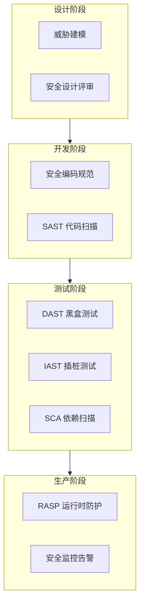

大多数安全漏洞不是攻击者的技术有多高明，而是开发者的疏忽。OWASP Top 10 中列举的漏洞，有超过 80% 可以在编码阶段避免。然而现实中，安全往往被视为「事后检测」的工作，而非「从设计开始」的内生能力。

本专题覆盖应用安全的完整知识体系：从安全开发生命周期（SDL）和威胁建模方法论，到 SQL 注入、XSS、CSRF、SSRF 等常见漏洞的原理与防护，再到 SAST、DAST、IAST、RASP 等安全测试技术的深度对比，帮助你在开发过程的每个阶段构建防御能力。

## 核心内容

### 安全开发

- [应用安全概述](/security/application/overview) — 应用安全的威胁格局与防御策略
- [SDL 安全开发生命周期](/security/application/sdl) — 从需求到发布的全流程安全
- [威胁建模](/security/application/threat-modeling) — DFD 绘制与风险识别
- [STRIDE 威胁模型](/security/application/stride) — 六类威胁与防护措施对照

### 常见漏洞

- [SQL 注入原理与防护](/security/application/sql-injection) — Union 注入、盲注、ORM 安全
- [XSS 跨站脚本攻击](/security/application/xss) — 反射型、存储型、DOM 型
- [XSS 防护](/security/application/xss-protection) — CSP、输出编码、HttpOnly
- [CSRF 跨站请求伪造](/security/application/csrf) — 攻击原理与利用条件
- [CSRF 防护](/security/application/csrf-protection) — Token、SameSite Cookie
- [SSRF 服务端请求伪造](/security/application/ssrf) — 元数据攻击与 URL 白名单
- [文件上传漏洞](/security/application/file-upload) — WebShell 与防护措施
- [XXE 外部实体注入](/security/application/xxe) — XML 解析器安全配置
- [反序列化漏洞](/security/application/deserialization) — Java 反序列化 Gadget 链

### 日志与敏感信息

- [日志注入与敏感信息泄露](/security/application/log-injection) — 结构化日志与脱敏

### 安全测试

- [依赖扫描](/security/application/sca) — OWASP Dependency-Check、Snyk、Log4Shell 教训
- [SAST 静态应用安全测试](/security/application/sast) — 数据流分析与 CI/CD 集成
- [DAST 动态应用安全测试](/security/application/dast) — 黑盒测试与 ZAP/Burp
- [IAST 交互式应用安全测试](/security/application/iast) — 插桩技术与高准确性检测
- [RASP 运行时应用自我保护](/security/application/rasp) — WAF 的补充与实时防护

### 审计与响应

- [安全代码审计指南](/security/application/code-audit) — 检查清单与报告撰写
- [漏洞修复优先级排序](/security/application/vulnerability-prioritization) — CVSS 与 EPSS
- [OWASP Top 10 详解](/security/application/owasp-top10) — A01-A10 风险全景

## 防御层次

## 思考题

**问题 1**：XSS 的三种类型（反射型、存储型、DOM 型）中，哪一种危害最大？为什么 CSP 能够有效缓解 XSS 攻击？

参考答案

存储型 XSS 危害最大，因为它将恶意脚本永久存储在服务器端，所有访问该数据的用户都会受到攻击，无需诱导用户点击特定链接。反射型 XSS 需要用户主动触发链接，DOM 型 XSS 纯前端执行，危害范围相对有限。

CSP（Content Security Policy）通过声明允许执行的脚本来源，阻止未经授权的脚本执行。例如 `script-src 'self'` 只允许加载同源脚本，即使攻击者注入了 `<script>` 标签，浏览器也不会执行。但 CSP 不是万能的——如果业务本身就需要内联脚本，CSP 需要精细配置，否则容易被绕过。

**问题 2**：SAST 和 RASP 都能检测 SQL 注入，它们有什么本质区别？在实际项目中应该如何组合使用？

参考答案

SAST 是静态分析（不运行代码），在编码阶段发现漏洞，降低修复成本；RASP 是运行时检测（需要运行代码），在攻击发生时阻断，无法修复代码本身但能防护未知漏洞。

最佳组合策略：CI/CD 阶段集成 SAST（拦截低垂果实）、QA 阶段集成 DAST（验证运行时行为）、生产环境部署 RASP（最后防线）。SAST 发现漏洞后需要修复代码，RASP 发现攻击后是实时阻断。两者互补而不是替代关系——SAST 解决「漏洞从哪里来」，RASP 解决「攻击来了怎么办」。

