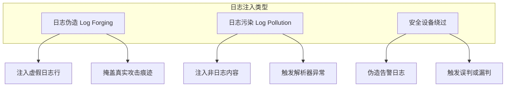
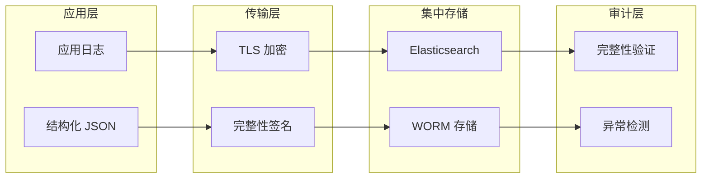

日志是安全事件的第一现场，也是攻击者的终极目标。2017 年，某著名科技公司的 SIEM 系统突然报警：Web 防火墙检测到大量「可疑请求」。安全团队紧急排查后发现，攻击者根本不是从防火墙绕过，而是通过在 URL 参数中注入恶意字符，将伪造的日志行写入了应用日志文件——当安全分析工具解析这些日志时，攻击者成功实现了日志伪造，掩盖了真实的攻击痕迹。

这不是小说，而是 Log4Shell 之前最流行的日志攻击手法：**日志注入（Log Injection）**。

## 一、日志注入的原理

### 1.1 核心问题：用户输入被当作日志内容

日志注入的本质，是应用程序将用户可控的数据直接写入日志文件，而没有对特殊字符进行转义或验证。当日志分析工具后续解析这些日志时，注入的恶意内容可能被当作合法的日志指令执行。

**一个典型的漏洞场景**：

```java title="存在日志注入风险的代码"
@Service
public class UserService {

    private static final Logger logger = LoggerFactory.getLogger(UserService.class);

    public void processLogin(String username, String ip) {
        // 直接将用户输入写入日志，未做任何转义
        logger.info("User {} logged in from IP: {}", username, ip);
    }
}
```

**当攻击者构造如下请求**：

```
username=admin&ip=127.0.0.1\n2024-01-15 10:00:00 ERROR System - Malicious log entry
```

**写入的日志变成**：

```
2024-01-15 09:59:59 INFO  UserService - User admin logged in from IP: 127.0.0.1
2024-01-15 10:00:00 ERROR System - Malicious log entry
```

攻击者通过注入换行符，成功在日志文件中插入了一条伪造的 ERROR 日志。

### 1.2 日志注入的三种形态



**日志伪造（Log Forging）**：最常见的形态。通过注入换行符，在日志中插入虚假信息，掩盖真实攻击或嫁祸他人。

**日志污染（Log Pollution）**：注入大量无用日志，消耗存储空间、拖慢日志分析效率，或注入特殊字符触发解析器漏洞。

**安全设备绕过**：当组织使用日志分析工具做安全监控时，伪造的日志可以触发误报或掩盖真实攻击，使安全团队无法发现真正的威胁。

## 二、日志注入的攻击场景

### 2.1 认证日志伪造

```java title="认证日志注入场景"
public class AuthenticationService {

    private static final Logger authLogger = LoggerFactory.getLogger("AUTH");

    public boolean login(String username, String password) {
        boolean success = verifyCredentials(username, password);

        if (success) {
            // 攻击者可以将 username 设为：admin\n2024-01-15 INFO AUTH - User admin failed login attempt
            authLogger.info("User {} login SUCCESS from IP {}", username, getClientIP());
        } else {
            authLogger.warn("User {} login FAILED from IP {}", username, getClientIP());
        }

        return success;
    }
}
```

**攻击效果**：如果日志分析工具根据登录失败次数触发告警，攻击者通过注入虚假「登录成功」日志，可以掩盖真实的暴力破解行为。

### 2.2 审计日志注入

```java title="审计日志注入场景"
@Service
public class AuditService {

    private static final Logger auditLogger = LoggerFactory.getLogger("AUDIT");

    public void recordAction(String userId, String action, String resource) {
        // 审计日志记录操作：用户ID、操作类型、操作资源
        auditLogger.info("USER={} ACTION={} RESOURCE={}", userId, action, resource);
    }
}
```

**攻击载荷**：

```
userId=attacker&action=DELETE&resource=/etc/passwd
```

**生成的日志**：

```
USER=attacker ACTION=DELETE RESOURCE=/etc/passwd
```

审计人员查看日志时，无法区分这是正常的 DELETE 操作记录，还是注入的伪造记录。

### 2.3 日志解析器攻击

```java title="Logstash 配置示例（存在风险）"
filter {
    grok {
        match => { "message" => "%{TIMESTAMP_ISO8601:timestamp} %{LOGLEVEL:level} %{GREEDYDATA:message}" }
    }
}
```

如果日志内容包含特殊字符，可能导致 Grok 解析失败，甚至可能触发正则表达式拒绝服务（ReDoS）。

## 三、敏感信息泄露的风险

日志是双刃剑：它既是安全的第一道防线，也是敏感信息泄露的主要渠道。

### 3.1 日志中常见敏感信息

| 敏感数据类型 | 风险描述 | 典型场景 |
|-------------|---------|---------|
| 用户密码 | 登录日志明文记录密码 | `password=123456` |
| API 密钥 | 请求参数中包含密钥 | `api_key=sk-xxxxxx` |
| JWT Token | 授权日志中记录完整 Token | 攻击者可提取 Token |
| 个人身份信息 | 姓名、身份证、手机号 | 调试日志打印用户对象 |
| 信用卡信息 | 交易日志记录卡号 | PCI DSS 合规风险 |
| Session ID | 会话日志记录会话标识 | 会话劫持风险 |

### 3.2 敏感信息泄露的典型案例

**案例：某金融 App 密码明文日志**

```java title="错误的日志记录方式"
@RestController
public class PaymentController {

    @PostMapping("/api/pay")
    public Response pay(@RequestParam String cardNumber,
                        @RequestParam String password,
                        @RequestParam BigDecimal amount) {
        logger.info("Payment request: card={}, pwd={}, amount={}",
                    cardNumber, password, amount);  // 密码明文记录

        // 业务逻辑...
    }
}
```

**日志输出**：

```
2024-01-15 10:00:00 INFO PaymentController - Payment request: card=6222021234567890, pwd=123456, amount=1000.00
```

任何有日志访问权限的人都能看到用户的支付密码。

## 四、日志注入的防护

### 4.1 输入验证与净化

```java title="安全的日志记录实现"
@Service
public class UserService {

    private static final Logger logger = LoggerFactory.getLogger(UserService.class);

    /**
     * 日志字段净化：移除换行符和不可见字符
     */
    private String sanitizeForLog(String input) {
        if (input == null) {
            return "[null]";
        }
        return input
            .replace("\r", "")
            .replace("\n", "_")
            .replace("\t", "_")
            .replace("\u0000", "");  // 移除 null 字符
    }

    public void processLogin(String username, String ip) {
        // 所有用户输入经过净化后再记录
        logger.info("User {} logged in from IP: {}",
                    sanitizeForLog(username),
                    sanitizeForLog(ip));
    }
}
```

:::warning 净化不是万能的
日志净化只能处理已知的攻击模式。更好的做法是从根本上避免将用户输入写入日志，或者使用结构化日志格式。
:::

### 4.2 日志框架安全配置

```java title="Logback 安全配置"
<?xml version="1.0" encoding="UTF-8"?>
<configuration>
    <appender name="CONSOLE" class="ch.qos.logback.core.ConsoleAppender">
        <encoder>
            <!-- 设置 pattern 时，避免使用 %ex 输出完整异常堆栈 -->
            <pattern>%d{yyyy-MM-dd HH:mm:ss} %-5level [%thread] %msg%n</pattern>
        </encoder>
    </appender>

    <!-- 限制日志文件大小，防止日志注入耗尽磁盘 -->
    <appender name="FILE" class="ch.qos.logback.core.rolling.RollingFileAppender">
        <file>/var/log/app/application.log</file>
        <rollingPolicy class="ch.qos.logback.core.rolling.TimeBasedRollingPolicy">
            <fileNamePattern>/var/log/app/application.%d{yyyy-MM-dd}.log</fileNamePattern>
            <maxHistory>30</maxHistory>
            <totalSizeCap>10GB</totalSizeCap>
        </rollingPolicy>
    </appender>
</configuration>
```

### 4.3 日志轮转策略

```java title="日志轮转配置（Log4j2）"
<?xml version="1.0" encoding="UTF-8"?>
<Configuration status="WARN">
    <Appenders>
        <RollingFile name="RollingFile" fileName="logs/app.log"
                     filePattern="logs/app-%d{yyyy-MM-dd}-%i.log.gz">
            <PatternLayout>
                <Pattern>%d{yyyy-MM-dd HH:mm:ss} %-5p [%t] %m%n</Pattern>
            </PatternLayout>
            <Policies>
                <TimeBasedTriggeringPolicy interval="1" modulate="true"/>
                <SizeBasedTriggeringPolicy size="100 MB"/>
            </Policies>
            <DefaultRolloverStrategy max="30" fileIndex="min"/>
        </RollingFile>
    </Appenders>
    <Loggers>
        <Root level="info">
            <AppenderRef ref="RollingFile"/>
        </Root>
    </Loggers>
</Configuration>
```

## 五、敏感信息脱敏

### 5.1 敏感字段识别与脱敏

```java title="敏感信息脱敏工具类"
public class DataMasker {

    /**
     * 信用卡号脱敏：只显示后4位
     */
    public static String maskCardNumber(String cardNumber) {
        if (cardNumber == null || cardNumber.length() < 8) {
            return "****";
        }
        return "**** **** **** " + cardNumber.substring(cardNumber.length() - 4);
    }

    /**
     * 手机号脱敏：只显示前3后4位
     */
    public static String maskPhone(String phone) {
        if (phone == null || phone.length() < 7) {
            return "****";
        }
        return phone.substring(0, 3) + "****" + phone.substring(phone.length() - 4);
    }

    /**
     * 身份证号脱敏：只显示前3后4位
     */
    public static String maskIdCard(String idCard) {
        if (idCard == null || idCard.length() < 7) {
            return "****";
        }
        return idCard.substring(0, 3) + "***********" + idCard.substring(idCard.length() - 4);
    }

    /**
     * 邮箱脱敏
     */
    public static String maskEmail(String email) {
        if (email == null || !email.contains("@")) {
            return "****";
        }
        String[] parts = email.split("@");
        String name = parts[0];
        if (name.length() <= 2) {
            return "**@" + parts[1];
        }
        return name.substring(0, 2) + "***@" + parts[1];
    }

    /**
     * JWT Token 脱敏：只显示前10后10位
     */
    public static String maskToken(String token) {
        if (token == null || token.length() < 20) {
            return "****";
        }
        return token.substring(0, 10) + "..." + token.substring(token.length() - 10);
    }

    /**
     * 通用脱敏：根据字段名智能脱敏
     */
    public static String maskByFieldName(String fieldName, String value) {
        if (value == null) {
            return null;
        }

        String lowerField = fieldName.toLowerCase();

        if (lowerField.contains("password") || lowerField.contains("pwd")) {
            return "******";
        } else if (lowerField.contains("card") || lowerField.contains("credit")) {
            return maskCardNumber(value);
        } else if (lowerField.contains("phone") || lowerField.contains("mobile")) {
            return maskPhone(value);
        } else if (lowerField.contains("email")) {
            return maskEmail(value);
        } else if (lowerField.contains("idcard") || lowerField.contains("id_no")) {
            return maskIdCard(value);
        } else if (lowerField.contains("token") || lowerField.contains("jwt")) {
            return maskToken(value);
        } else if (lowerField.contains("ssn") || lowerField.contains("social")) {
            return maskIdCard(value);
        }

        return value;
    }
}
```

### 5.2 日志脱敏中间件

```java title="日志脱敏拦截器"
@Component
public class LogSanitizerInterceptor implements HandlerInterceptor {

    private static final Logger logger = LoggerFactory.getLogger(LogSanitizerInterceptor.class);

    @Override
    public void afterCompletion(HttpServletRequest request,
                                HttpServletResponse response,
                                Object handler,
                                Exception ex) {
        // 记录脱敏后的请求信息
        Map<String, String> sanitizedParams = new HashMap<>();
        request.getParameterMap().forEach((key, values) -> {
            String value = values.length > 0 ? values[0] : "";
            sanitizedParams.put(key, DataMasker.maskByFieldName(key, value));
        });

        // 避免在日志中记录原始参数
        if (logger.isDebugEnabled()) {
            logger.debug("Request completed: uri={}, status={}",
                         request.getRequestURI(),
                         response.getStatus());
        }
    }
}
```

### 5.3 日志脱敏注解

```java title="日志脱敏注解实现"
@Retention(RetentionPolicy.RUNTIME)
@Target({ElementType.FIELD, ElementType.PARAMETER})
public @interface LogSensitive {
    SensitiveType type() default SensitiveType.AUTO;
}

public enum SensitiveType {
    PASSWORD,
    CARD_NUMBER,
    PHONE,
    EMAIL,
    ID_CARD,
    TOKEN,
    CUSTOM
}

public class User {
    @LogSensitive(type = SensitiveType.EMAIL)
    private String email;

    @LogSensitive(type = SensitiveType.PHONE)
    private String phone;

    @LogSensitive(type = SensitiveType.PASSWORD)
    private String password;

    @LogSensitive(type = SensitiveType.CARD_NUMBER)
    private String cardNumber;

    // getter/setter
}
```

## 六、结构化日志

### 6.1 JSON 格式日志的优势

结构化日志（尤其是 JSON 格式）可以从根本上解决日志注入问题：

1. **字段隔离**：每个字段有明确的边界，注入的换行符不会破坏日志结构
2. **类型安全**：字段有类型定义，解析器可以验证数据类型
3. **易于分析**：可以直接导入 ELK、Splunk 等日志分析系统
4. **自动脱敏**：可以在序列化层统一处理敏感字段

```java title="JSON 格式日志记录"
@Service
public class StructuredLogService {

    private static final ObjectMapper objectMapper = new ObjectMapper();

    private void logJson(String level, String event, Map<String, Object> data) {
        try {
            Map<String, Object> logEntry = new HashMap<>();
            logEntry.put("timestamp", Instant.now().toString());
            logEntry.put("level", level);
            logEntry.put("event", event);
            logEntry.put("data", data);

            // JSON 序列化会自动处理特殊字符
            System.out.println(objectMapper.writeValueAsString(logEntry));
        } catch (JsonProcessingException e) {
            // 处理序列化失败
        }
    }

    public void logLogin(String username, String ip, boolean success) {
        Map<String, Object> data = new HashMap<>();
        data.put("username", username);  // 即使 username 包含 \n 也不会有问题
        data.put("ip", ip);
        data.put("success", success);

        logJson("INFO", "USER_LOGIN", data);
    }
}
```

**生成的日志**：

```json
{"timestamp":"2024-01-15T10:00:00Z","level":"INFO","event":"USER_LOGIN","data":{"username":"admin\nmalicious entry","ip":"127.0.0.1","success":true}}
```

### 6.2 Logstash JSON 解析配置

```java title="Logback JSON 布局配置"
<?xml version="1.0" encoding="UTF-8"?>
<configuration>
    <appender name="JSON_CONSOLE" class="ch.qos.logback.core.ConsoleAppender">
        <encoder class="net.logstash.logback.encoder.LogstashEncoder">
            <includeMdc>true</includeMdc>
            <includeContext>true</includeContext>
            <customFields>{"application":"payment-service","version":"1.0.0"}</customFields>
            <fieldNames>
                <timestamp>@timestamp</timestamp>
                <message>message</message>
                <logger>logger</logger>
                <thread>thread</thread>
                <level>level</level>
                <stackTrace>stack_trace</stackTrace>
            </fieldNames>
        </encoder>
    </appender>

    <root level="INFO">
        <appender-ref ref="JSON_CONSOLE"/>
    </root>
</configuration>
```

**输出示例**：

```json
{
  "@timestamp": "2024-01-15T10:00:00.123Z",
  "level": "INFO",
  "logger": "com.example.payment.PaymentController",
  "message": "Payment processed",
  "thread": "http-nio-8080-exec-1",
  "application": "payment-service",
  "user_id": "user123",
  "trace_id": "abc123def456"
}
```

## 七、日志完整性保护

### 7.1 日志完整性校验

```java title="日志完整性保护实现"
@Service
public class LogIntegrityService {

    private static final Logger logger = LoggerFactory.getLogger(LogIntegrityService.class);

    /**
     * 计算日志条目的 HMAC 签名
     */
    public String computeLogSignature(String timestamp, String level, String message) {
        try {
            String data = timestamp + "|" + level + "|" + message;
            Mac mac = Mac.getInstance("HmacSHA256");
            SecretKeySpec secretKey = new SecretKeySpec(
                getSigningKey().getBytes(StandardCharsets.UTF_8),
                "HmacSHA256"
            );
            mac.init(secretKey);
            byte[] hmacBytes = mac.doFinal(data.getBytes(StandardCharsets.UTF_8));
            return Base64.getEncoder().encodeToString(hmacBytes);
        } catch (NoSuchAlgorithmException | InvalidKeyException e) {
            logger.error("Failed to compute log signature", e);
            return "";
        }
    }

    /**
     * 验证日志条目完整性
     */
    public boolean verifyLogIntegrity(String timestamp, String level,
                                       String message, String signature) {
        String expectedSignature = computeLogSignature(timestamp, level, message);
        return expectedSignature.equals(signature);
    }
}
```

### 7.2 写入前日志审计

```java title="日志写入前审计"
@Component
public class LogAuditAspect {

    private static final Logger logger = LoggerFactory.getLogger(LogAuditAspect.class);

    @Around("execution(* org.slf4j.Logger.*(..))")
    public Object auditLog(ProceedingJoinPoint joinPoint) throws Throwable {
        Logger logger = (Logger) joinPoint.getTarget();
        String loggerName = logger.getName();
        Object[] args = joinPoint.getArgs();

        // 检查是否包含敏感信息
        if (containsSensitiveData(args)) {
            logger.warn("Potential sensitive data in log: logger={}, args={}",
                        loggerName, sanitizeForAudit(args));
        }

        return joinPoint.proceed();
    }

    private boolean containsSensitiveData(Object[] args) {
        for (Object arg : args) {
            if (arg instanceof String) {
                String str = (String) arg;
                if (str.toLowerCase().contains("password") ||
                    str.toLowerCase().contains("secret") ||
                    str.toLowerCase().contains("token")) {
                    return true;
                }
            }
        }
        return false;
    }

    private Object[] sanitizeForAudit(Object[] args) {
        // 返回脱敏后的参数
        return args;
    }
}
```

### 7.3 日志集中管理与审计



## 八、权衡矩阵

| 方案 | 防护效果 | 实施成本 | 性能影响 | 适用场景 |
|------|---------|---------|---------|---------|
| 输入净化 | 中 | 低 | 低 | 遗留系统快速修复 |
| 结构化日志 | 高 | 中 | 低 | 新建系统优先选择 |
| 日志签名 | 高 | 高 | 中 | 金融、政务等高安全场景 |
| 集中日志审计 | 高 | 高 | 低 | 大型企业合规要求 |

:::tip 推荐实践
对于大多数应用，推荐采用「结构化日志 + 集中管理」的组合方案：
1. 使用 JSON 格式日志从根本上防止注入
2. 在日志框架层统一处理敏感信息脱敏
3. 日志通过 TLS 加密传输到集中日志平台
4. 日志平台开启 WORM 存储，防止篡改
:::

## 思考题

**问题 1**：某系统使用 Log4j 2.x 记录日志，配置如下。请分析这段配置是否存在安全风险？如果存在，请指出问题并给出修复方案。

```java title="Log4j2 配置"
<?xml version="1.0" encoding="UTF-8"?>
<Loggers>
    <Logger name="com.example" level="debug" additivity="false">
        <AppenderRef ref="Console"/>
        <AppenderRef ref="File"/>
    </Logger>
</Loggers>

// 代码中使用
logger.info("User {} logged in with IP {}", username, request.getHeader("X-Forwarded-For"));
```

<details>
<summary>参考答案</summary>

**安全风险分析**：

1. **日志注入风险**：如果 `username` 或 `X-Forwarded-For` 包含换行符，攻击者可以伪造日志条目

2. **敏感信息泄露**：
   - 日志级别设为 `debug`，可能记录过多敏感信息
   - `X-Forwarded-For` 头部可能被伪造

3. **Log4j RCE 风险**：如果使用了 `${jndi:...}` 等变量引用，可能触发 Log4Shell 漏洞

**修复方案**：

```java title="安全的日志实现"
// 1. 输入净化
private String sanitizeForLog(String input) {
    if (input == null) return "[unknown]";
    return input.replace("\r", "").replace("\n", "_");
}

// 2. 敏感头部脱敏
String clientIp = sanitizeForLog(request.getHeader("X-Forwarded-For"));
logger.info("User {} logged in with IP {}", sanitizeForLog(username), clientIp);

// 3. Log4j 配置限制
// 添加 jvm.options
// -Dlog4j2.formatMsgNoLookups=true
```

</details>

**问题 2**：某公司需要满足 PCI DSS 合规要求，需要对日志系统进行改造。请设计一个完整的日志安全改造方案，包括日志格式、脱敏规则、存储要求和审计机制。

<details>
<summary>参考答案</summary>

**PCI DSS 日志合规改造方案**：

**1. 日志格式设计**

```json
{
  "timestamp": "ISO8601 格式",
  "event_type": "事件类型编码",
  "user_id": "脱敏后的用户标识",
  "cardholder_data_present": true/false,
  "action": "操作描述",
  "result": "success/failure",
  "source_ip": "来源 IP",
  "session_id": "会话标识（脱敏）",
  "integrity_hash": "HMAC 签名"
}
```

**2. 敏感数据脱敏规则**

| 字段类型 | 脱敏规则 | 示例 |
|---------|---------|------|
| 完整卡号 | 只保留前6后4位 | `411111******1111` |
| CVV | 完全脱敏 | `***` |
| 密码/密钥 | 完全脱敏 | `******` |
| 完整姓名 | 脱敏首字母 | `J*** D**` |
| 手机号 | 中间脱敏 | `138****5678` |

**3. 存储要求**

- WORM（一次写入，多次读取）存储，防止篡改
- 保留周期：至少 1 年
- 加密存储：AES-256
- 传输加密：TLS 1.3

**4. 审计机制**

- 所有日志访问需要记录审计日志
- 实施最小权限原则
- 定期完整性验证
- 年度第三方审计

**5. 关键技术措施**

```java
// 日志完整性签名
public String signLogEntry(String entry) {
    return HMAC-SHA256(entry, secretKey);
}

// 定期完整性验证任务
@Scheduled(cron = "0 0 2 * * ?")
public void verifyLogIntegrity() {
    // 读取历史日志，验证签名完整性
}
```

</details>
