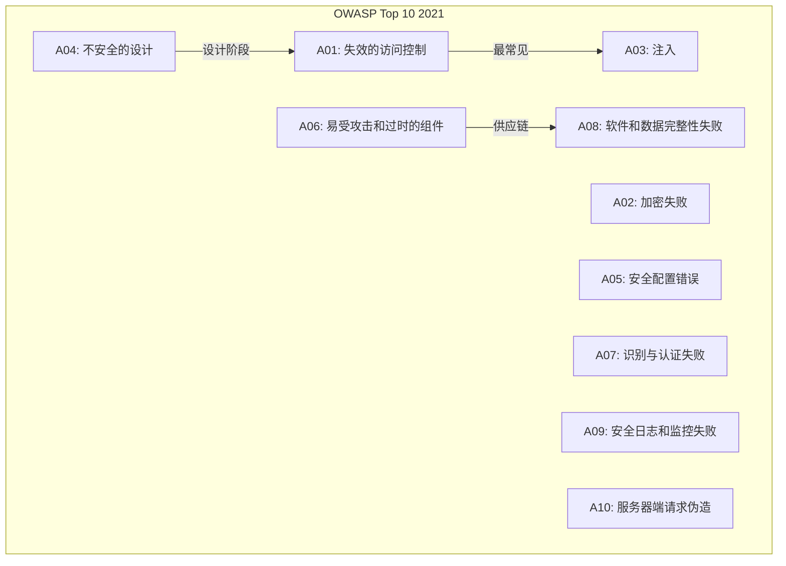
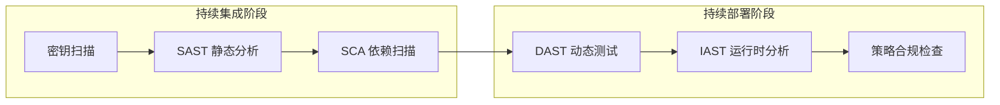
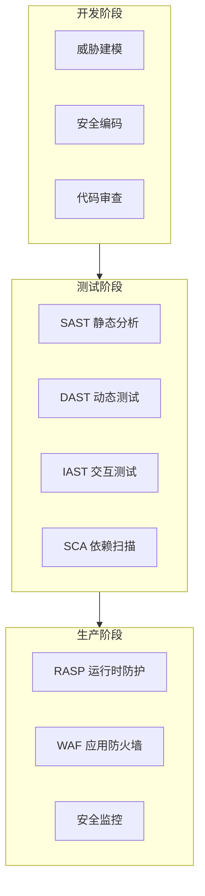

2017 年，Equifax 数据泄露事件导致 1.47 亿用户的敏感信息外泄，根源是一个未修复的 Apache Struts 漏洞。直接损失超过 18 亿美元，CEO、CIO、CISO 全部下课。这个案例告诉我们一个残酷的事实：**应用安全失败的成本，远比预防成本高出几个数量级**。

然而，在大多数团队中，安全依然是「事后补救」的角色。代码写完了，测试做完了，上线前才想起安全审计——此时改一行代码可能需要重构整个模块。这种被动防御的代价，是无数企业用真金白银买来的教训。

## 一、应用层：攻击的主战场

提到网络攻击，很多人首先想到的是 DDoS、端口扫描、漏洞利用这些「高大上」的手段。但真正造成大规模数据泄露的，往往是最朴素的 Web 漏洞：SQL 注入、XSS、CSRF——这些 OWASP Top 10 的老面孔，在 2026 年的今天依然占据着大多数安全事件的根因列表。

| 攻击面 | 占比（行业统计） | 典型后果 |
|--------|------------------|----------|
| 应用层漏洞 | 65% ~ 70% | 数据泄露、账户接管、业务欺诈 |
| 配置错误 | 15% ~ 20% | 未授权访问、信息泄露 |
| 第三方组件 | 10% ~ 15% | 供应链攻击、大规模漏洞 |
| 基础设施 | 5% ~ 10% | 服务中断、横向移动 |

Gartner 的研究表明，**超过 90% 的攻击目标集中在应用层**，而这一层恰恰是传统网络防火墙（WAF）的盲区。应用层攻击之所以难以防范，是因为它们深度嵌入业务逻辑——一个看似正常的查询请求，可能同时是一条恶意 SQL；一个普通的表单提交，可能是一次精心设计的 CSRF。

## 二、OWASP Top 10：应用安全的基准线

如果说应用安全有一本「圣经」，那一定是 OWASP Top 10。每隔几年，OWASP 基金会会根据全球安全数据更新这份列表，代表了 Web 应用最常见、最危险的安全风险。



**值得注意的演进**：

- 2013 年的 A1「注入」，在 2021 年依然存在，只是被重新定义为更广泛的「注入」类
- 2013 年的 A4「不安全的直接对象引用」和 A7「功能级访问控制缺失」，合并为 2021 年的 A01「失效的访问控制」——这说明**访问控制问题正在变得越来越普遍和严重**
- 2021 年新增的 A10「服务器端请求伪造（SSRF）」，反映了现代云原生架构中的新型攻击面

:::tip 关键认知
OWASP Top 10 不是一份「检查清单」，而是一份「优先级指南」。解决这些问题需要理解其背后的攻击原理和防御逻辑，而不是机械地对照条目打勾。
:::

## 三、应用安全的整体防御策略

应用安全不是单点技术的堆砌，而是一套覆盖全生命周期的防御体系。

### 3.1 纵深防御：多层保护原则

```mermaid
flowchart TB
    subgraph L1["边界层"]
        WAF[WAF Web应用防火墙]
        CDN[CDN 防护]
    end
    
    subgraph L2["认证层"]
        MFA[多因素认证]
        SSO[单点登录]
    end
    
    subgraph L3["应用层"]
        AUTH[访问控制]
        INPUT[输入验证]
        OUTPUT[输出编码]
    end
    
    subgraph L4["数据层"
        ENCRYPT[数据加密]
        MASK[敏感信息脱敏]
    end]
    
    L1 --> L2 --> L3 --> L4
```

单一的安全措施永远无法提供完整保护。WAF 可以阻止已知攻击模式，但无法防范业务逻辑漏洞；输入验证可以过滤恶意数据，但无法阻止侧信道攻击。**真正的安全来自于多层防御的叠加效应**。

### 3.2 安全左移：从开发阶段抓起

传统的安全工作集中在测试和运维阶段，但修复一个在设计阶段引入的漏洞，代价是开发阶段引入的 6~10 倍。研究表明：

- 在设计阶段发现并修复安全问题，成本约为 1x
- 在编码阶段修复，成本约为 6x
- 在测试阶段修复，成本约为 15x
- 在生产环境修复，成本约为 100x

这就是「安全左移（Shift Left Security）」理念的核心：**把安全工作的重心从右边（运维/生产）移到左边（设计/开发）**。

### 3.3 威胁建模：未雨绸缪的设计阶段

在系统设计阶段进行威胁建模，是成本效益最高的安全活动之一。通过分析系统的数据流、信任边界、潜在攻击面，安全团队可以在设计层面规避高风险决策，而不是在代码写完后打补丁。

STRIDE 模型是威胁建模中最常用的方法论，它将威胁分为六类：**伪装（Spoofing）、篡改（Tampering）、否认（Repudiation）、信息泄露（Information Disclosure）、拒绝服务（Denial of Service）、权限提升（Elevation of Privilege）**。

## 四、安全与开发速度的平衡

安全工程师和开发团队之间最常见的矛盾，来自于「安全拖慢速度」这个认知。确实，额外的安全检查、审批流程、合规要求都会消耗时间和精力。但这个矛盾的本质，不是「安全 vs 速度」，而是**「被动安全 vs 主动安全」**。

### 4.1 被动安全的成本

- 上线后发现漏洞，紧急修复 → 影响业务迭代
- 数据泄露后公关危机 → 品牌损失难以估量
- 合规审计未通过 → 产品延迟发布，收入损失
- 安全事件后诉讼 → 律师费、赔偿金、监管罚款

### 4.2 主动安全的投资

- 开发阶段嵌入安全检测（SAST/DAST/IAST）→ 自动化、低摩擦
- 安全编码规范培训 → 减少事后返工
- 安全设计评审 → 避免架构层面的高风险决策
- 自动化合规检查 → 消除人工审计的瓶颈

:::tip 核心洞察
安全不是开发的刹车片，而是开发的加速器。当安全成为开发流程的自然组成部分，而非额外的审查环节，开发团队反而会因为减少事后修复而提速。
:::

## 五、DevSecOps：从理念到实践

DevSecOps 是 DevOps 运动的安全延伸，核心理念是**将安全自动化地嵌入到持续集成/持续部署（CI/CD）流水线中**，而不是作为独立的安全审查环节。



**DevSecOps 的三个核心要素**：

1. **自动化**：安全检查必须自动化，否则无法融入高速迭代的 CI/CD 流程
2. **一致性**：每个代码变更都经过相同的安全检查，消除人为遗漏
3. **反馈闭环**：安全工具的发现必须及时反馈给开发者，并提供修复建议

成功的 DevSecOps 实践，可以让安全检查的误报率降低到可接受范围，同时将平均修复时间（MTTR）从数周缩短到数天。

## 六、应用安全的全景图

应用安全涵盖的领域非常广泛，从开发阶段的安全编码，到测试阶段的漏洞扫描，再到生产环境的运行时防护。每个领域都有其特定的方法论和工具。



这个知识库的应用安全部分，将系统性地覆盖这些主题：从 SDL（安全开发生命周期）和威胁建模开始，深入讲解各类常见漏洞（SQL 注入、XSS、CSRF、SSRF 等），然后介绍覆盖开发到生产的完整安全测试体系（SAST/DAST/IAST/RASP），最后提供安全代码审计和漏洞优先级排序的实践指南。

## 思考题

**问题 1**：一家电商公司在双十一期间遭受了一次大规模攻击，攻击者通过 SQL 注入获取了大量用户订单数据。从纵深防御的角度，应该在哪些层次设置防护措施才能有效阻止这类攻击？

<details>
<summary>参考答案</summary>

从纵深防御的角度，各层防护措施如下：

- **边界层**：WAF 配置 SQL 注入检测规则，拦截恶意请求
- **应用层**：使用预编译语句（PreparedStatement）防止 SQL 注入；实施严格的输入验证
- **数据层**：数据库账号遵循最小权限原则，应用账号不应有 DBA 权限；敏感数据加密存储
- **认证层**：用户密码加盐哈希存储；实施多因素认证
- **监控层**：数据库查询审计日志；异常查询模式检测；数据导出行为告警
- **响应层**：数据泄露应急响应预案；用户通知机制

关键点：即使某一层被突破，其他层仍能提供保护。WAF 可能被绕过，但应用层的预编译语句能阻止 SQL 注入；即使数据被窃取，加密存储能降低泄露影响。
</details>

**问题 2**：在敏捷开发模式下，如何平衡安全左移与快速迭代的需求？有哪些具体实践可以减少安全检查对开发速度的影响？

<details>
<summary>参考答案</summary>

核心思路是**将安全检查自动化并融入开发流程**，具体实践包括：

1. **工具链集成**：
   - SAST 工具集成到 IDE 和 PR 环节，开发者即时看到问题
   - SCA 工具集成到 CI/CD，发现高危依赖漏洞自动阻断构建
   - Git hooks 在代码提交时检查密钥泄露

2. **增量扫描**：
   - 只扫描变更代码，而非全量扫描，减少等待时间
   - PR 级别安全审查，而非全代码库审查

3. **安全门禁分级**：
   - Critical/High 级别问题：阻断构建
   - Medium/Low 级别问题：仅警告，不阻断

4. **开发者赋能**：
   - 安全编码培训，让开发者减少引入漏洞
   - 安全问题附带修复建议，降低排查成本
   - 常见漏洞模式内置到框架中（如 ORM 框架默认防注入）

5. **架构层面**：
   - 使用安全组件库，避免重复实现
   - 安全设计模式（如零信任架构）减少运行时检查依赖
</details>
