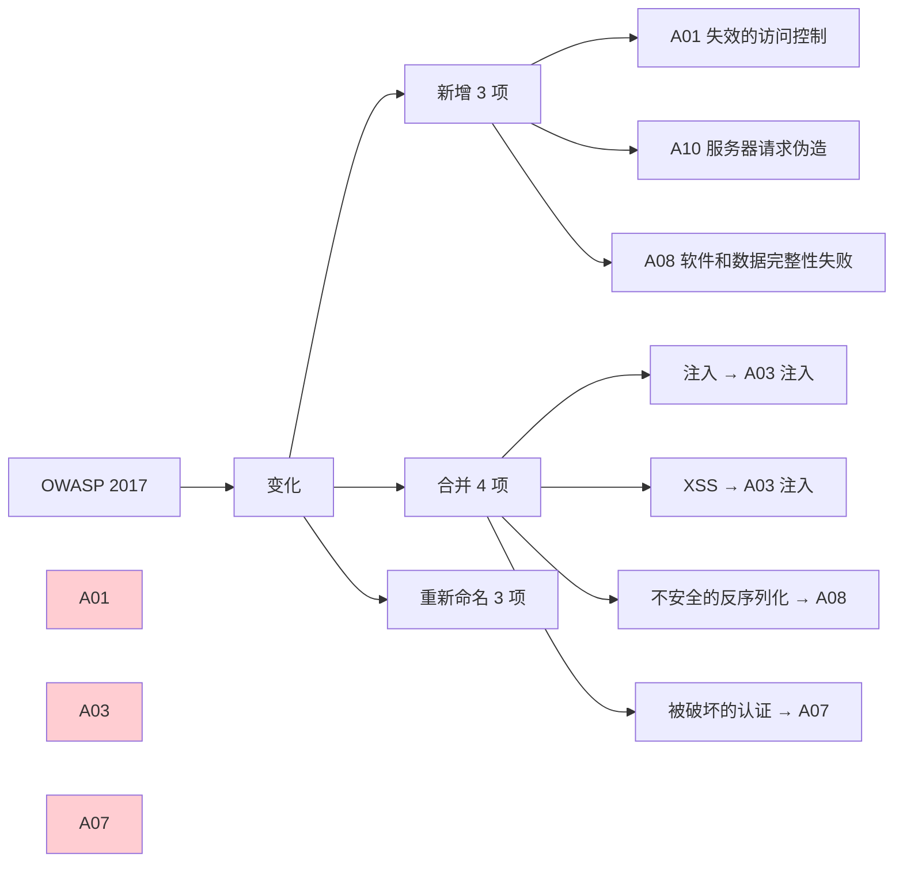
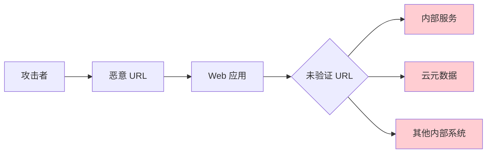

2014 年，一个名为「Shellshock」的 Bash 漏洞席卷互联网。这个存在了数十年的漏洞，可以让攻击者通过 HTTP 请求在服务器上执行任意命令。全球数百万台服务器在几小时内被攻击。

事后分析发现：这个漏洞早就存在于代码中，但从未被发现。不是因为没有安全测试，而是因为**当时的测试方法无法有效发现这类漏洞**。

同样的故事在 2017 年重演：Equifax 数据泄露事件的根源是 Apache Struts 2 的一个已知漏洞，但公司没能及时修补。

这些案例揭示了一个残酷的现实：**大多数安全漏洞都不是什么新鲜玩意儿，而是我们已经知道但没有正确防御的旧问题**。

OWASP Top 10 就是这样一份清单：它不是发明新漏洞，而是**告诉我们哪些已知问题造成了最多的真实伤害**。

## 一、OWASP Top 10 概述

### 1.1 什么是 OWASP Top 10

OWASP（Open Web Application Security Project）是一个非营利组织，致力于提高软件安全性。OWASP Top 10 是他们发布的十大最关键的 Web 应用安全风险列表：

| 版本 | 发布年份 | 新增风险 |
|------|----------|----------|
| OWASP 2004 | 2004 | 首个版本 |
| OWASP 2007 | 2007 | A6 安全配置错误 |
| OWASP 2010 | 2010 | A10 未验证重定向 |
| OWASP 2013 | 2013 | A10 功能级访问控制缺失 |
| OWASP 2017 | 2017 | A10 不足的日志记录 |
| **OWASP 2021** | **2021** | **A01 失效的访问控制** |

### 1.2 OWASP 2021 更新要点



## 二、A01:2021 — 失效的访问控制

### 2.1 风险描述

访问控制确保用户只能执行被授权的操作。失效的访问控制是最常见也最严重的安全问题之一：

| 风险指标 | 说明 |
|----------|------|
| 利用容易度 | 高 |
| 普遍性 | 广泛 |
| 可检测性 | 中等 |
| 影响 | 严重 |

### 2.2 典型案例

```java title="水平越权漏洞"
// 漏洞代码：用户可以查看其他用户的订单
public Order getOrder(Long orderId) {
    // 错误：没有验证订单是否属于当前用户
    return orderRepository.findById(orderId);
}

// 攻击：用户 A 通过修改 orderId 参数访问用户 B 的订单
// GET /api/orders/12345  (用户 A 原本访问自己的订单 12344)
// GET /api/orders/12345  (用户 A 修改参数访问用户 B 的订单 12345)
```

```java title="垂直越权漏洞"
// 漏洞代码：普通用户可以访问管理员功能
@RequestMapping("/admin")
public class AdminController {
    
    @GetMapping("/users")
    // 错误：没有检查用户角色
    public List<User> getAllUsers() {
        return userService.findAll();
    }
    
    @PostMapping("/users")
    // 错误：没有检查用户权限
    public User createUser(@RequestBody User user) {
        return userService.create(user);
    }
}
```

### 2.3 防御措施

```java title="正确的访问控制实现"
public class SecureOrderController {
    
    private final OrderService orderService;
    private final AuthorizationService authService;
    
    // 正确的水平越权防护
    @GetMapping("/orders/{orderId}")
    public Order getOrder(@PathVariable Long orderId) {
        // 1. 从安全上下文获取当前用户
        User currentUser = authService.getCurrentUser();
        
        // 2. 验证订单归属
        Order order = orderService.findById(orderId);
        
        // 3. 明确检查所有权
        if (!order.getUserId().equals(currentUser.getId())) {
            throw new AccessDeniedException("无权访问此订单");
        }
        
        return order;
    }
}

// 使用 Spring Security 注解
public class SecureAdminController {
    
    @PreAuthorize("hasRole('ADMIN')")
    @GetMapping("/users")
    public List<User> getAllUsers() {
        return userService.findAll();
    }
    
    @PreAuthorize("hasAuthority('USER_CREATE')")
    @PostMapping("/users")
    public User createUser(@RequestBody User user) {
        return userService.create(user);
    }
}
```

### 2.4 检查清单

- [ ] 每个接口都有权限验证
- [ ] 所有权检查在数据访问层之前执行
- [ ] 权限检查使用白名单（默认拒绝）
- [ ] 配置和部署文件中的访问控制规则已审查
- [ ] API 访问控制防止批量操作（如批量导出）
- [ ] 敏感操作需要额外验证（如修改密码需要原密码）

## 三、A02:2021 — 加密失败

### 3.1 风险描述

以前称为「敏感数据泄露」，问题核心是加密失败导致敏感数据被暴露：

| 敏感数据类型 | 示例 |
|-------------|------|
| 身份凭证 | 密码、API Key、Token |
| 个人数据 | 身份证号、电话、地址 |
| 金融数据 | 信用卡号、银行账号 |
| 健康数据 | 病历、保险信息 |
| 商业数据 | 商业机密、客户列表 |

### 3.2 典型案例

```java title="不安全的密码传输"
// 漏洞：不使用 HTTPS 或使用了过时的 TLS 版本
@Configuration
public class SecurityConfig {
    @Bean
    public SecurityFilterChain filterChain(HttpSecurity http) throws Exception {
        // 漏洞：允许不安全的 TLS 版本
        http.requiresChannel(channels -> channels
            .anyRequest().requiresSecure()
        );
        
        // 漏洞：未配置 HSTS
        return http.build();
    }
}

// 漏洞：在 HTTP 响应头中泄露敏感信息
@Controller
public class UserController {
    @GetMapping("/users")
    public User getUser(HttpServletResponse response) {
        // 漏洞：设置了不必要的敏感 cookie
        response.addHeader("Set-Cookie", 
            "sessionId=xxx; Domain=example.com; Secure; HttpOnly");
        
        // 漏洞：泄露服务器版本信息
        response.addHeader("X-Powered-By", "Apache/2.4.1");
        response.addHeader("Server", "Apache");
        
        return currentUser;
    }
}
```

```java title="不安全的密码存储"
// 漏洞：使用 MD5 存储密码
public class UnsafePasswordStorage {
    public String hashPassword(String password) {
        // 危险：MD5 不安全，可被彩虹表破解
        return MD5(password);
    }
}

// 漏洞：使用没有盐值的哈希
public class UnsafeSaltStorage {
    public String hashPassword(String password) {
        // 危险：没有盐值，容易被彩虹表攻击
        return SHA256(password);
    }
}

// 正确：使用 BCrypt
public class SafePasswordStorage {
    public String hashPassword(String password) {
        // 好：BCrypt 自动处理盐值，且有自适应成本因子
        return BCrypt.hashpw(password, BCrypt.gensalt(12));
    }
    
    public boolean verifyPassword(String password, String hash) {
        return BCrypt.checkpw(password, hash);
    }
}
```

### 3.3 防御措施

```java title="加密配置最佳实践"
@Configuration
public class CryptoConfig {
    
    // 1. TLS 配置
    @Bean
    public SSLContext sslContext() throws NoSuchAlgorithmException {
        SSLContext sslContext = SSLContext.getInstance("TLSv1.3");
        sslContext.init(
            getKeyManagerFactory().getKeyManagers(),
            getTrustManagerFactory().getTrustManagers(),
            new SecureRandom()
        );
        return sslContext;
    }
    
    // 2. HTTPS 强制配置
    @Bean
    public TomcatServletWebServerFactory tomcatServletWebServerFactory() {
        TomcatServletWebServerFactory factory = 
            new TomcatServletWebServerFactory();
        factory.addConnectorCustomizers(connector -> {
            Connector configured = connector;
            configured.setScheme("https");
            configured.setSecure(true);
        });
        return factory;
    }
    
    // 3. 安全响应头
    @Bean
    public FilterRegistrationBean<SecurityHeadersFilter> 
            securityHeadersFilter() {
        return new FilterRegistrationBean<>(new SecurityHeadersFilter());
    }
}

public class SecurityHeadersFilter implements Filter {
    @Override
    public void doFilter(ServletRequest req, ServletResponse res, 
                         FilterChain chain) {
        HttpServletResponse response = (HttpServletResponse) res;
        
        // 严格传输安全
        response.setHeader("Strict-Transport-Security", 
            "max-age=31536000; includeSubDomains; preload");
        
        // 内容安全策略
        response.setHeader("Content-Security-Policy", 
            "default-src 'self'; script-src 'self'");
        
        // 防止点击劫持
        response.setHeader("X-Frame-Options", "DENY");
        
        // XSS 保护
        response.setHeader("X-XSS-Protection", "1; mode=block");
        
        // 内容类型嗅探保护
        response.setHeader("X-Content-Type-Options", "nosniff");
    }
}
```

## 四、A03:2021 — 注入

### 4.1 风险描述

注入漏洞发生在不可信数据被发送给解释器时，包括 SQL、NoSQL、OS 命令、ORM 等：

| 注入类型 | 常见位置 |
|----------|----------|
| SQL 注入 | 数据库查询 |
| NoSQL 注入 | MongoDB、CouchDB |
| LDAP 注入 | 目录服务查询 |
| OS 命令注入 | 系统命令执行 |
| XPath 注入 | XML 文档查询 |
| 模板注入 | 服务器端模板 |

### 4.2 SQL 注入详解

```java title="SQL 注入攻击示例"
// 漏洞代码
public User findByUsername(String username) {
    String sql = "SELECT * FROM users WHERE username = '" + username + "'";
    return jdbcTemplate.queryForObject(sql);
}

// 攻击：输入 username = "admin' OR '1'='1"
// 实际执行：SELECT * FROM users WHERE username = 'admin' OR '1'='1'
// 结果：返回所有用户

// 攻击：输入 username = "'; DROP TABLE users; --"
// 实际执行：SELECT * FROM users WHERE username = ''; DROP TABLE users; --
// 结果：users 表被删除

// 攻击：输入 username = "1' UNION SELECT * FROM passwords; --"
// 结果：可能泄露密码表
```

### 4.3 防御措施

```java title="安全的数据库操作"
public class SecureUserRepository {
    
    private final JdbcTemplate jdbcTemplate;
    
    // 正确：使用参数化查询
    public User findByUsername(String username) {
        String sql = "SELECT * FROM users WHERE username = ?";
        return jdbcTemplate.queryForObject(sql, 
            (rs, rowNum) -> mapToUser(rs), 
            username);
    }
    
    // 正确：使用 MyBatis #{} 语法
    // Mapper 接口
    public interface UserMapper {
        @Select("SELECT * FROM users WHERE username = #{username}")
        User findByUsername(@Param("username") String username);
    }
    
    // 正确：使用 JPA 参数化查询
    public interface UserRepository extends JpaRepository<User, Long> {
        @Query("SELECT u FROM User u WHERE u.username = :username")
        User findByUsername(@Param("username") String username);
    }
}
```

```java title="防止命令注入"
public class SecureCommandExecutor {
    
    // 危险：不使用用户输入执行命令
    public String executePredefinedCommand(String commandName) {
        // 好：只允许预定义的命令
        Map<String, String[]> allowedCommands = Map.of(
            "list", new String[]{"ls", "-la"},
            "status", new String[]{"systemctl", "status", "myapp"}
        );
        
        String[] command = allowedCommands.get(commandName);
        if (command == null) {
            throw new IllegalArgumentException("不允许的命令");
        }
        
        return executeCommand(command);
    }
    
    // 好：使用 ProcessBuilder 且参数被严格验证
    private String executeCommand(String[] command) {
        ProcessBuilder pb = new ProcessBuilder(command);
        pb.redirectErrorStream(true);
        
        try {
            Process process = pb.start();
            return new String(process.getInputStream().readAllBytes());
        } catch (IOException e) {
            throw new RuntimeException("命令执行失败", e);
        }
    }
}
```

### 4.4 检查清单

- [ ] 使用参数化查询或 ORM
- [ ] 验证、净化所有用户输入
- [ ] 使用 LIMIT 等 SQL 限制防止批量泄露
- [ ] 错误信息不泄露数据库结构
- [ ] 不使用字符串拼接构建 SQL

## 五、A04:2021 — 不安全的设计

### 5.1 风险描述

这是 2021 年新增的类别，专注于设计和架构层面的安全缺陷：

| 设计缺陷类型 | 示例 |
|-------------|------|
| 缺失身份验证 | 无 MFA、无账号锁定 |
| 缺失授权 | 无权限分级、无审计 |
| 业务逻辑漏洞 | 绕过验证步骤 |
| 加密失败 | 使用不安全算法 |

### 5.2 业务逻辑漏洞示例

```java title="电商促销漏洞"
// 漏洞：未验证促销规则
public class PromotionService {
    
    public Order applyPromotion(Order order, String promoCode) {
        Promotion promo = promoRepository.findByCode(promoCode);
        
        // 漏洞：未检查用户是否已使用过该促销码
        // 攻击：同一用户多次使用促销码
        order.setDiscount(promo.getDiscount());
        return order;
    }
}

// 漏洞：并发导致超卖
public class InventoryService {
    
    public boolean decreaseStock(Long productId, int quantity) {
        // 危险：在检查和更新之间没有原子性保证
        Product product = productRepository.findById(productId);
        if (product.getStock() >= quantity) {
            product.setStock(product.getStock() - quantity);
            productRepository.save(product);
            return true;
        }
        return false;
    }
}

// 正确：使用乐观锁或悲观锁
public class SecureInventoryService {
    
    @Transactional
    public boolean decreaseStock(Long productId, int quantity) {
        // 方法 1：乐观锁
        int updated = productRepository.decreaseStockWithVersion(
            productId, quantity);
        return updated > 0;
    }
    
    // 方法 2：悲观锁
    @Transactional
    public boolean decreaseStockWithLock(Long productId, int quantity) {
        Product product = productRepository.findByIdWithLock(productId);
        if (product.getStock() >= quantity) {
            product.setStock(product.getStock() - quantity);
            productRepository.save(product);
            return true;
        }
        return false;
    }
}
```

### 5.3 防御措施

```java title="安全设计模式"
public class SecureDesignPatterns {
    
    // 1. 防御式编程：验证所有输入
    public void processOrder(OrderRequest request) {
        // 前置条件验证
        validateOrderRequest(request);
        
        // 业务规则验证
        validateBusinessRules(request);
        
        // 幂等性验证
        if (!isIdempotent(request.getId())) {
            throw new DuplicateOrderException();
        }
        
        // 执行订单处理
        doProcessOrder(request);
    }
    
    // 2. 事务边界：确保原子性
    @Transactional(isolation = Isolation.SERIALIZABLE)
    public void criticalOperation() {
        // 所有相关操作在同一个事务中
    }
    
    // 3. 审计日志：记录所有敏感操作
    @Audited
    public void sensitiveOperation() {
        // 记录操作人、时间、操作内容、结果
    }
}
```

## 六、A05:2021 — 安全配置错误

### 6.1 风险描述

安全配置错误包括不安全的默认配置、不完整配置、错误配置的云服务等：

| 配置错误类型 | 风险 |
|-------------|------|
| 不安全默认配置 | 使用默认密码/密钥 |
| 缺失安全强化 | 未禁用不必要的功能 |
| 错误配置 | 权限过于宽松 |
| 错误处理 | 详细错误信息泄露 |

### 6.2 典型案例

```yaml title="不安全的 Spring Boot 配置"
# 漏洞：暴露 Actuator 端点
management:
  endpoints:
    web:
      exposure:
        include: "*"  # 危险：暴露所有端点
        
# 漏洞：使用默认 management 端口
server:
  port: 8080
management:
  server:
    port: 8080  # 与应用同端口，更容易被发现

# 正确配置
management:
  endpoints:
    web:
      exposure:
        include: "health,info,metrics"  # 只暴露必要端点
      base-path: /actuator
  endpoint:
    health:
      show-details: when_authorized  # 只对授权用户显示详情
  server:
    port: 8090  # 使用独立端口
  ssl:
    enabled: true  # HTTPS
```

```java title="不安全的 CORS 配置"
// 漏洞：允许所有来源
@Configuration
public class UnsafeCorsConfig implements WebMvcConfigurer {
    
    @Override
    public void addCorsMappings(CorsRegistry registry) {
        registry.addMapping("/api/**")
            .allowedOrigins("*")  // 危险：允许所有来源
            .allowedMethods("*")
            .allowedHeaders("*")
            .allowCredentials(true);  // 危险：credentials 需要具体 origin
    }
}

// 正确：明确允许的来源
@Configuration
public class SecureCorsConfig implements WebMvcConfigurer {
    
    @Override
    public void addCorsMappings(CorsRegistry registry) {
        registry.addMapping("/api/**")
            .allowedOrigins(
                "https://www.example.com",
                "https://admin.example.com"
            )
            .allowedMethods("GET", "POST", "PUT", "DELETE")
            .allowedHeaders("Content-Type", "Authorization")
            .exposedHeaders("X-Request-Id")
            .allowCredentials(true)
            .maxAge(3600);
    }
}
```

### 6.3 安全配置检查清单

- [ ] 移除不必要的功能和框架
- [ ] 审查云存储（S3 bucket）权限
- [ ] 配置错误处理页面
- [ ] 禁用详细错误信息
- [ ] 配置安全的 HTTP 头
- [ ] 使用 TLS
- [ ] 管理口令/密钥，定期轮换

## 七、A06:2021 — 易受攻击和过时的组件

### 7.1 风险描述

使用有已知漏洞的组件是 Web 应用最常见的问题之一：

| 数据 | 说明 |
|------|------|
| 平均应用依赖 | 148 个开源组件 |
| 平均漏洞数 | 69 个已知漏洞 |
| 平均修复时间 | 21 天 |

### 7.2 依赖管理

```xml title="Maven 依赖检查配置"
<build>
    <plugins>
        <!-- OWASP 依赖检查插件 -->
        <plugin>
            <groupId>org.owasp</groupId>
            <artifactId>dependency-check-maven</artifactId>
            <version>8.4.0</version>
            <configuration>
                <!-- 失败构建如果有严重漏洞 -->
                <failBuildOnCVSS>7</failBuildOnCVSS>
                
                <!-- 排除特定依赖 -->
                <excludes>
                    <exclude>log4j:log4j</exclude>
                </excludes>
                
                <!-- 漏洞数据库更新间隔 -->
                <autoupdate>true</autoupdate>
            </configuration>
            <executions>
                <execution>
                    <goals>
                        <goal>check</goal>
                    </goals>
                </execution>
            </executions>
        </plugin>
    </plugins>
</build>
```

```yaml title="GitHub 依赖审查"
# .github/workflows/dependency-review.yml
name: Dependency Review
on: [pull_request]

jobs:
  dependency-review:
    runs-on: ubuntu-latest
    steps:
      - name: 'Checkout Repository'
        uses: actions/checkout@v3
        
      - name: 'Dependency Review'
        uses: actions/dependency-review-action@v3
        with:
          # 失败条件
          fail-on-severity: high
          deny-packages: |
            GPL-3.0
          deny-licenses: |
            LGPL
```

### 7.3 组件管理策略

```java title="依赖管理策略"
public class DependencyManagement {
    
    // 依赖版本策略
    public static final DependencyStrategy STRATEGY = 
        new DependencyStrategy()
        // 优先使用最新稳定版
        .preferLatestStable(true)
        // 定期更新依赖
        .updateFrequency(Duration.ofDays(7))
        // 记录所有依赖变更
        .trackChanges(true)
        // 自动更新补丁版本
        .autoUpdatePatch(true)
        // 人工审核次版本和主版本更新
        .autoUpdateMinor(false)
        .autoUpdateMajor(false);
}
```

## 八、A07:2021 — 识别与认证失败

### 8.1 风险描述

认证和会话管理的缺陷可能导致完全绕过认证或 compromise 会话：

| 漏洞类型 | 说明 |
|----------|------|
| 弱密码 | 简单密码被暴力破解 |
| 凭证泄露 | 密码明文传输/存储 |
| 会话管理 | 会话 fixation/hijacking |
| MFA 缺失 | 无多因素认证 |

### 8.2 会话管理安全

```java title="安全会话配置"
@Configuration
public class SessionSecurityConfig {
    
    @Bean
    public SessionRegistry sessionRegistry() {
        return new SpringSessionRegistry();
    }
    
    @Bean
    public CookieSerializer cookieSerializer() {
        DefaultCookieSerializer serializer = new DefaultCookieSerializer();
        
        // 安全 Cookie 配置
        serializer.setUseHttpOnlyCookie(true);    // 防止 XSS
        serializer.setUseSecureCookie(true);      // 仅 HTTPS
        serializer.setCookieSameSite("Strict");  // CSRF 防护
        serializer.setCookieName("SESSION");
        serializer.setCookiePath("/");
        serializer.setDomainName("example.com");
        serializer.setCookieMaxAge(Duration.ofHours(2));
        
        return serializer;
    }
}

@Component
public class SessionManagementService {
    
    // 会话 fixation 防护
    public void login(HttpServletRequest request, HttpSession session) {
        // 登录成功后创建新会话
        session.invalidate();
        HttpSession newSession = request.getSession(true);
        newSession.setAttribute("USER_ID", user.getId());
        
        // 生成新的会话 ID
        String newSessionId = newSession.getId();
        
        // 将会话 ID 存储在安全 Cookie 中
        response.setHeader("Set-Cookie", 
            "SESSION=" + newSessionId + 
            "; HttpOnly; Secure; SameSite=Strict");
    }
}
```

### 8.3 密码策略

```java title="安全的密码验证"
public class PasswordValidator {
    
    private static final int MIN_LENGTH = 12;
    private static final int MAX_LENGTH = 128;
    
    // OWASP 密码规则
    public ValidationResult validate(String password) {
        ValidationResult result = new ValidationResult();
        List<String> errors = new ArrayList<>();
        
        // 长度检查
        if (password.length() < MIN_LENGTH) {
            errors.add("密码长度至少 " + MIN_LENGTH + " 位");
        }
        if (password.length() > MAX_LENGTH) {
            errors.add("密码长度不能超过 " + MAX_LENGTH + " 位");
        }
        
        // 复杂度检查
        if (!password.matches(".*[a-z].*")) {
            errors.add("必须包含小写字母");
        }
        if (!password.matches(".*[A-Z].*")) {
            errors.add("必须包含大写字母");
        }
        if (!password.matches(".*\\d.*")) {
            errors.add("必须包含数字");
        }
        if (!password.matches(".*[!@#$%^&*()_+\\-=\\[\\]{};':\"\\\\|,.<>/?].*")) {
            errors.add("必须包含特殊字符");
        }
        
        // 常见密码检查
        if (isCommonPassword(password)) {
            errors.add("密码过于简单，请使用更复杂的密码");
        }
        
        // 用户信息关联检查
        if (containsUserInfo(password)) {
            errors.add("密码不能包含用户名或个人信息");
        }
        
        result.setValid(errors.isEmpty());
        result.setErrors(errors);
        return result;
    }
}
```

## 九、A08:2021 — 软件和数据完整性失败

### 9.1 风险描述

软件和数据的完整性不能得到保证，包括不安全的 CI/CD、未经验证的更新、不安全的反序列化：

| 风险类型 | 示例 |
|----------|------|
| 不安全的 CI/CD | 未验证的构建步骤 |
| 不安全反序列化 | 恶意对象注入 |
| 依赖混淆 | 恶意包伪装 |
| 更新劫持 | 未签名更新包 |

### 9.2 安全反序列化

```java title="防止反序列化攻击"
public class SecureDeserialization {
    
    // 危险：使用不安全的反序列化
    public Object unsafeDeserialize(byte[] data) 
            throws IOException, ClassNotFoundException {
        ObjectInputStream ois = new ObjectInputStream(
            new ByteArrayInputStream(data));
        return ois.readObject();  // 危险：可以执行任意代码
    }
    
    // 正确：使用白名单
    public Object safeDeserialize(byte[] data, 
                                  Set<Class<?>> allowedClasses) 
            throws IOException, ClassNotFoundException {
        ByteArrayInputStream bais = new ByteArrayInputStream(data);
        
        // 使用自定义 ObjectInputStream
        ValidatingObjectInputStream vois = 
            new ValidatingObjectInputStream(bais);
        vois.accept(allowedClasses.toArray(new Class[0]));
        
        return vois.readObject();
    }
    
    // 最佳实践：使用 JSON 代替 Java 序列化
    public String serializeToJson(Object obj) {
        ObjectMapper mapper = new ObjectMapper();
        mapper.registerModule(new JavaTimeModule());
        return mapper.writeValueAsString(obj);
    }
    
    public <T> T deserializeFromJson(String json, Class<T> clazz) {
        ObjectMapper mapper = new ObjectMapper();
        mapper.registerModule(new JavaTimeModule());
        return mapper.readValue(json, clazz);
    }
}
```

### 9.3 依赖完整性验证

```yaml title="GitHub 依赖签名验证"
# .github/workflows/signed-builds.yml
name: Signed Builds

on:
  push:
    branches: [main]
  pull_request:
    branches: [main]

jobs:
  build:
    runs-on: ubuntu-latest
    steps:
      - uses: actions/checkout@v3
        
      - name: Verify Commit Signatures
        run: |
          git verify-commit HEAD
          
      - name: Verify GitHub Actions
        uses: actions/verify-signed-actions@v1
        
      - name: Build and Sign
        run: |
          ./gradlew build
          cosign sign-blob --yes --output-signature build.sig app.jar
          
      - name: Verify Artifacts
        uses: actions/verify-artifacts@v1
        with:
          signatures: build.sig
```

## 十、A09:2021 — 安全日志和监控失败

### 10.1 风险描述

没有充分的日志记录和监控会导致漏洞利用发生时无法察觉：

| 日志缺失 | 后果 |
|----------|------|
| 无登录失败日志 | 无法检测暴力破解 |
| 无访问控制日志 | 无法检测越权访问 |
| 无错误日志 | 无法发现系统问题 |
| 无审计日志 | 无法进行事后分析 |

### 10.2 安全日志规范

```java title="安全审计日志实现"
@Slf4j
@Component
public class SecurityAuditLogger {
    
    // 用户登录审计
    public void logLoginAttempt(String username, String ip, 
                                 boolean success, String reason) {
        log.info("AUTH_LOGIN - user: {}, ip: {}, success: {}, reason: {}, " +
                 "timestamp: {}, sessionId: {}",
            username, ip, success, reason, 
            Instant.now(), SecurityContext.getSessionId());
    }
    
    // 访问控制审计
    public void logAccessDenied(String username, String resource, 
                                 String action, String reason) {
        log.warn("ACCESS_DENIED - user: {}, resource: {}, action: {}, " +
                 "reason: {}, timestamp: {}, requestId: {}",
            username, resource, action, reason,
            Instant.now(), RequestContext.getRequestId());
    }
    
    // 敏感操作审计
    public void logSensitiveAction(String username, String action, 
                                    Map<String, Object> details) {
        log.info("SENSITIVE_ACTION - user: {}, action: {}, details: {}, " +
                 "timestamp: {}, ip: {}",
            username, action, JsonUtils.toJson(details),
            Instant.now(), RequestContext.getClientIp());
    }
    
    // 异常审计（不泄露敏感信息）
    public void logSecurityException(Exception e, HttpRequest request) {
        // 不记录堆栈信息
        log.error("SECURITY_EXCEPTION - type: {}, message: {}, " +
                  "timestamp: {}, requestId: {}, uri: {}",
            e.getClass().getSimpleName(),
            sanitizeMessage(e.getMessage()),  // 净化消息
            Instant.now(),
            RequestContext.getRequestId(),
            request.getRequestURI());
    }
}
```

### 10.3 监控告警规则

```yaml title="Prometheus 告警规则"
groups:
  - name: security-alerts
    rules:
      # 暴力破解检测
      - alert: BruteForceAttack
        expr: |
          sum by (ip) (rate(login_failed_total[5m])) > 10
        for: 2m
        labels:
          severity: warning
        annotations:
          summary: "检测到暴力破解攻击"
          description: "IP {{ $labels.ip }} 在 5 分钟内有 {{ $value }} 次登录失败"
          
      # 异常访问模式
      - alert: AbnormalAccessPattern
        expr: |
          sum by (user_id) (rate(access_denied_total[5m])) > 50
        for: 3m
        labels:
          severity: warning
        annotations:
          summary: "异常访问模式"
          description: "用户 {{ $labels.user_id }} 访问被拒绝次数异常"
          
      # SQL 注入尝试
      - alert: PotentialSqlInjection
        expr: |
          sum by (ip) (rate(suspicious_sql_detected_total[1m])) > 0
        for: 1m
        labels:
          severity: critical
        annotations:
          summary: "疑似 SQL 注入攻击"
          description: "检测到来自 {{ $labels.ip }} 的 SQL 注入尝试"
```

## 十一、A10:2021 — 服务器端请求伪造

### 11.1 风险描述

SSRF 发生在 Web 应用获取 URL 参数时未验证用户输入，导致攻击者可以强制应用向非预期地址发起请求：



### 11.2 SSRF 攻击示例

```java title="SSRF 漏洞"
// 漏洞：用户可以指定要获取的 URL
@RestController
public class UnsafeUrlController {
    
    @GetMapping("/fetch")
    public String fetchUrl(@RequestParam String url) {
        // 漏洞：直接使用用户输入的 URL
        return restTemplate.getForObject(url, String.class);
    }
    
    // 攻击示例
    // GET /fetch?url=http://169.254.169.254/latest/meta-data/
    // 攻击者可能获取云服务器的 IAM 凭证
    
    // GET /fetch?url=file:///etc/passwd
    // 攻击者可能读取本地文件
    
    // GET /fetch?url=http://internal-server/admin
    // 攻击者可能访问内部管理系统
}
```

### 11.3 防御措施

```java title="安全的 URL 获取"
public class SecureUrlFetcher {
    
    private final RestTemplate restTemplate;
    private final Set<String> allowedHosts;
    private final Set<String> blockedHosts;
    
    public SecureUrlFetcher() {
        this.allowedHosts = Set.of(
            "api.example.com",
            "cdn.example.com"
        );
        this.blockedHosts = Set.of(
            "localhost",
            "127.0.0.1",
            "169.254.169.254",  // 云元数据端点
            "0.0.0.0",
            "metadata.google.internal"
        );
    }
    
    public String fetchUrl(String userUrl) {
        // 1. 解析 URL
        URL parsedUrl = parseUrl(userUrl);
        
        // 2. 验证协议
        if (!"http".equals(parsedUrl.getProtocol()) && 
            !"https".equals(parsedUrl.getProtocol())) {
            throw new IllegalArgumentException("不允许的协议");
        }
        
        // 3. 验证主机
        String host = parsedUrl.getHost().toLowerCase();
        if (isBlockedHost(host)) {
            throw new SecurityException("不允许访问该主机");
        }
        
        if (!allowedHosts.isEmpty() && !allowedHosts.contains(host)) {
            throw new SecurityException("主机不在白名单中");
        }
        
        // 4. 解析 DNS 防止 DNS 重绑定
        String resolvedIp = dnsResolver.resolve(host);
        if (isPrivateIp(resolvedIp)) {
            throw new SecurityException("解析到内网 IP");
        }
        
        // 5. 执行请求（带超时）
        return restTemplate.getForObject(userUrl, String.class);
    }
    
    private boolean isPrivateIp(String ip) {
        InetAddress address;
        try {
            address = InetAddress.getByName(ip);
        } catch (UnknownHostException e) {
            return true;
        }
        
        // 检查私有 IP 范围
        return address.isSiteLocalAddress() ||
               address.isLinkLocalAddress() ||
               address.isLoopbackAddress() ||
               address.isAnyLocalAddress();
    }
}
```

## 十二、OWASP Top 10 权衡矩阵

### 12.1 风险-防御措施矩阵

| 风险 | 关键防御 | 优先级 | 防御难度 |
|------|----------|--------|----------|
| A01 失效的访问控制 | 权限验证框架、零信任 | 高 | 中 |
| A02 加密失败 | TLS、密码哈希 | 高 | 低 |
| A03 注入 | 参数化查询、输入验证 | 高 | 低 |
| A04 不安全设计 | 安全设计模式、威胁建模 | 中 | 高 |
| A05 安全配置错误 | 配置基线、强化脚本 | 高 | 低 |
| A06 易受攻击组件 | 依赖扫描、版本管理 | 高 | 中 |
| A07 认证失败 | MFA、会话管理 | 高 | 中 |
| A08 软件完整性失败 | 签名验证、白名单 | 中 | 高 |
| A09 日志监控失败 | SIEM、告警规则 | 中 | 中 |
| A10 SSRF | URL 白名单、DNS 验证 | 中 | 中 |

### 12.2 团队能力-防御选择

| 团队成熟度 | 推荐优先关注 | 工具/实践 |
|-------------|-------------|----------|
| 初创/小团队 | A03、A02 | 参数化查询、TLS |
| 成长型团队 | A01、A05、A06 | 权限框架、配置管理、依赖扫描 |
| 成熟团队 | A04、A08、A09 | 安全设计、CI/CD 安全、日志监控 |
| 企业级团队 | 全部 | 全套安全实践 |

## 思考题

**问题 1**：在某代码审查中，你发现一个 API 接口存在「失效的访问控制」漏洞：用户可以通过修改 URL 参数访问其他用户的资源。开发团队认为这是「前端问题」，因为前端界面不会显示其他用户的数据，所以普通用户不会发现这个问题。请分析为什么这种认知是错误的，以及如何在审计报告中呈现这个问题。

<details>
<summary>参考答案</summary>

**为什么「前端不显示就安全」是错误的**：

**1. 攻击者不会使用前端界面**

攻击者使用：
- Burp Suite、Postman 等工具直接构造请求
- curl、Python 脚本自动化测试
- 恶意网页诱导用户点击（CSRF + 越权）

**2. 攻击示例**

```bash
# 正常用户访问自己的订单
curl -b "session=USER_A_COOKIE" \
     https://api.example.com/orders/12345
# 返回：订单 12345 属于用户 A

# 攻击者通过修改参数访问其他用户订单
curl -b "session=USER_A_COOKIE" \
     https://api.example.com/orders/12346
# 返回：订单 12346 属于用户 B（越权成功）
```

**3. 真实案例**

2019 年，Facebook 被曝光「查看其他用户指定朋友」功能存在越权漏洞。用户可以通过修改请求参数看到非好友的帖子。攻击者使用自动化工具，在 24 小时内爬取了数百万用户的帖子。

**4. 合规影响**

- GDPR：未经授权访问用户数据需要报告监管机构
- CCPA：可能面临集体诉讼
- 行业标准：PCI-DSS、HIPAA 等都有明确的访问控制要求

**审计报告呈现方式**：

```markdown
## 漏洞报告：A01 - 失效的访问控制

### 漏洞 ID
VULN-2024-001

### 严重程度
**高危** (CVSS 8.1)

### 漏洞描述
用户可以通过修改 URL 参数访问其他用户的订单数据。

### 漏洞位置
`GET /api/orders/{orderId}`

### 漏洞代码
```java
@GetMapping("/orders/{orderId}")
public Order getOrder(@PathVariable Long orderId) {
    // 漏洞：未验证订单归属
    return orderRepository.findById(orderId);
}
```

### 攻击场景
1. 用户 A 登录系统，查看自己的订单 12345
2. 用户 A 使用 Burp Suite 修改请求，将 orderId 改为 12346
3. 系统返回用户 B 的订单信息
4. 用户 A 编写脚本，遍历 orderId 获取大量用户数据

### 业务影响
- 泄露用户订单信息（收货地址、购买商品）
- 可能违反 GDPR/CCPA
- 声誉损失风险

### 修复建议
```java
@GetMapping("/orders/{orderId}")
public Order getOrder(@PathVariable Long orderId) {
    User currentUser = authService.getCurrentUser();
    Order order = orderRepository.findById(orderId);
    
    // 验证订单归属
    if (!order.getUserId().equals(currentUser.getId())) {
        throw new AccessDeniedException("无权访问此订单");
    }
    
    return order;
}
```

### 测试验证方法
1. 使用两个测试账号 A 和 B
2. 用账号 A 的会话访问账号 B 的订单
3. 预期：返回 403 Forbidden
4. 实际：返回了账号 B 的订单（漏洞确认）

### 参考资料
- OWASP A01:2021
- CWE-639: Authorization Bypass Through User-Controlled Key
- CVSS 3.1 Vector: AV:N/AC:L/PR:L/UI:N/S:U/C:H/I:N/A:N
```
</details>

**问题 2**：OWASP Top 10 主要针对 Web 应用安全，但现代系统越来越多地使用微服务架构、API-first 设计、无服务器函数等。请分析 OWASP Top 10 在这些新架构中的应用，以及有哪些额外的安全考量。

<details>
<summary>参考答案</summary>

**OWASP Top 10 在现代架构中的适用性**：

**1. 微服务架构**

| 传统 Web 应用 | 微服务架构 |
|--------------|------------|
| 单体访问控制 | 服务间认证 |
| Session 管理 | Token 验证 |
| 集中式日志 | 分布式追踪 |
| 统一防火墙 | 服务网格安全 |

**额外安全考量**：

```java title="服务间认证"
@Configuration
public class ServiceMeshSecurity {
    
    // 服务网格（如 Istio）提供 mTLS
    // 但也需要应用层验证
    
    @Bean
    public SecurityFilterChain filterChain(HttpSecurity http) {
        http
            // 验证传入请求的 JWT
            .oauth2ResourceServer(oauth2 -> oauth2
                .jwt(jwt -> jwt
                    .jwtAuthenticationConverter(jwtAuthConverter())
                )
            )
            // 服务间调用验证
            .addFilterBefore(serviceAuthFilter(), 
                UsernamePasswordAuthenticationFilter.class);
    }
    
    // 服务 A 调用服务 B
    public String callServiceB(String endpoint) {
        // 1. 获取当前请求的 JWT
        String currentToken = SecurityContext.getToken();
        
        // 2. 将令牌转发给下游服务
        HttpHeaders headers = new HttpHeaders();
        headers.setBearerAuth(currentToken);
        headers.set("X-Forwarded-For", getOriginalClientIp());
        
        // 3. 添加服务身份
        headers.set("X-Service-Identity", 
            environment.getProperty("spring.application.name"));
        
        return restTemplate.exchange(
            "http://service-b" + endpoint,
            HttpMethod.GET,
            new HttpEntity<>(headers),
            String.class
        ).getBody();
    }
}
```

**2. API-first 设计**

API 面临的安全挑战：

| 场景 | 安全考量 |
|------|----------|
| GraphQL | 查询复杂度限制、深度限制 |
| REST API | 批量操作越权、字段级别访问控制 |
| gRPC | 协议层安全、负载均衡 |
| WebSocket | 连接认证、消息级授权 |

```java title="GraphQL 安全配置"
@Configuration
public class GraphQLSecurityConfig {
    
    @Bean
    public RuntimeWiringConfigurer wiringConfigurer(
            DataFetcherInterceptor authInterceptor) {
        return wiringBuilder -> wiringBuilder
            // 字段级安全控制
            .type("User", builder -> builder
                // 普通用户只能看到公开字段
                .dataFetcher("email", env -> {
                    User user = env.getSource();
                    Authentication auth = SecurityContext.getAuth();
                    
                    // 只有自己或管理员可以查看邮箱
                    if (auth.isAdmin() || 
                        auth.getUserId().equals(user.getId())) {
                        return user.getEmail();
                    }
                    return null;  // 隐藏字段
                })
            )
            // 查询复杂度限制
            .build();
    }
    
    @Bean
    public GraphQLSchemaAnalyzer schemaAnalyzer() {
        return new GraphQLSchemaAnalyzer(schema);
    }
    
    // 防止深度嵌套查询攻击
    @Bean
    public DataFetcherExceptionHandler timeoutExceptionHandler() {
        return (DataFetcherExceptionHandlerArgs args) -> {
            if (args.getException() instanceof 
                    MaxQueryDepthExceededException) {
                return FieldVisibilityUtils.EMPTY;
            }
            return null;
        };
    }
}
```

**3. 无服务器函数（Serverless）**

| 安全考量 | 风险 |
|----------|------|
| 函数权限过大 | 攻击者利用函数访问其他云资源 |
| 环境变量泄露 | 密钥、令牌被日志记录 |
| 并发限制 | 函数被恶意调用耗尽配额 |
| 冷启动延迟 | 安全检查超时被绕过 |

```java title="Serverless 安全最佳实践"
public class SecureLambdaHandler {
    
    // 1. 最小权限原则：函数只应有必要的权限
    // IAM Policy
    {
        "Version": "2012-10-17",
        "Statement": [{
            "Effect": "Allow",
            "Action": [
                "dynamodb:Query",
                "dynamodb:GetItem"
            ],
            "Resource": "arn:aws:dynamodb:region:account:table/UserTable",
            "Condition": {
                "ForAllValues:StringEquals": {
                    "dynamodb:PartitionKey": [
                        "${aws:userId}"
                    ]
                }
            }
        }]
    }
    
    // 2. 安全处理输入
    public String handleRequest(S3Event event, Context context) {
        // 验证事件来源
        if (!verifyEventSource(event)) {
            throw new SecurityException("Invalid event source");
        }
        
        // 验证调用者身份
        String sourceIp = event.getRecords().get(0)
            .getS3().getObject().getKey();
        
        // 防止路径遍历
        if (containsPathTraversal(sourceIp)) {
            throw new IllegalArgumentException("Invalid path");
        }
        
        // 业务逻辑
        return processEvent(event);
    }
    
    // 3. 安全处理敏感数据
    private String processEvent(S3Event event) {
        // 不在日志中记录敏感信息
        log.info("Processing event for bucket: {}", 
            event.getRecords().get(0).getS3().getBucket().getName());
        
        // 敏感操作后清理
        try {
            return doSensitiveOperation();
        } finally {
            clearSensitiveData();
        }
    }
}
```

**4. 现代架构安全清单**

```markdown
## 微服务/API/Serverless 额外安全检查

### 服务间通信
- [ ] 所有服务间调用使用 mTLS
- [ ] 使用 JWT/opaquetoken 进行身份验证
- [ ] 实现零信任网络模型
- [ ] 服务网格配置网络策略

### API 安全
- [ ] 实施 API 网关认证和授权
- [ ] 配置速率限制防止滥用
- [ ] 验证 GraphQL 查询深度和复杂度
- [ ] 实施字段级别访问控制

### Serverless 安全
- [ ] 函数使用最小权限 IAM 角色
- [ ] 敏感配置使用密钥管理服务
- [ ] 实施函数并发限制
- [ ] 配置 VPC 访问控制

### 日志与监控
- [ ] 分布式追踪跨服务请求
- [ ] 统一安全事件日志格式
- [ ] 服务间调用审计
- [ ] 异常行为检测

### OWASP API Top 10
OWASP 还发布了专门的 API 安全 Top 10，建议一并参考：
- API1:2019 Broken Object Level Authorization
- API2:2019 Broken User Authentication
- API3:2019 Excessive Data Exposure
- API4:2019 Lack of Resources & Rate Limiting
- API5:2019 Broken Function Level Authorization
- API6:2019 Mass Assignment
- API7:2019 Security Misconfiguration
- API8:2019 Injection
- API9:2019 Improper Assets Management
- API10:2019 Insufficient Logging & Monitoring
```
</details>
