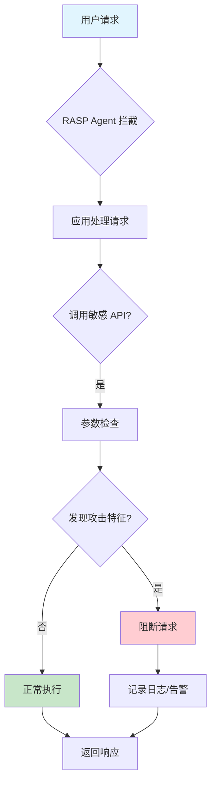
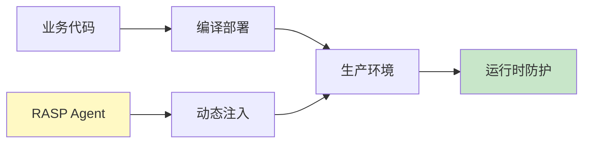
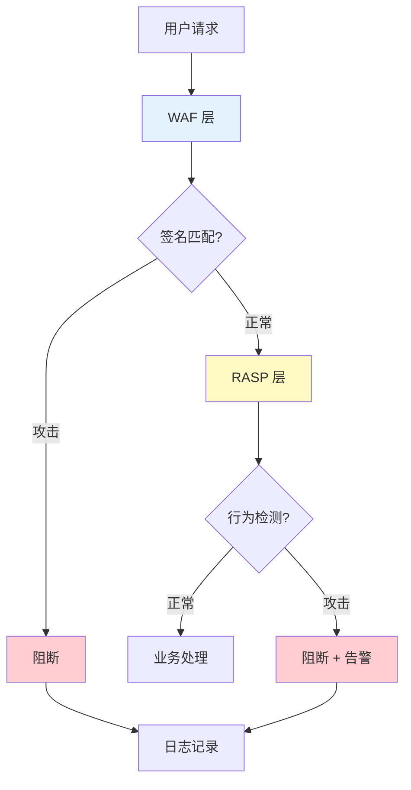
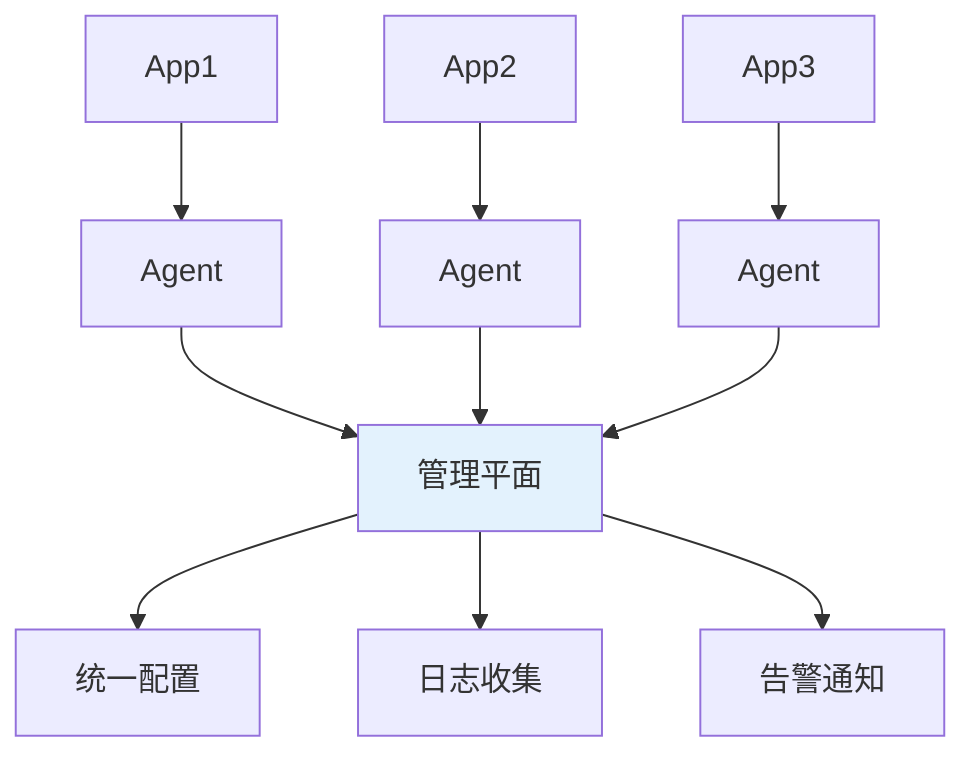
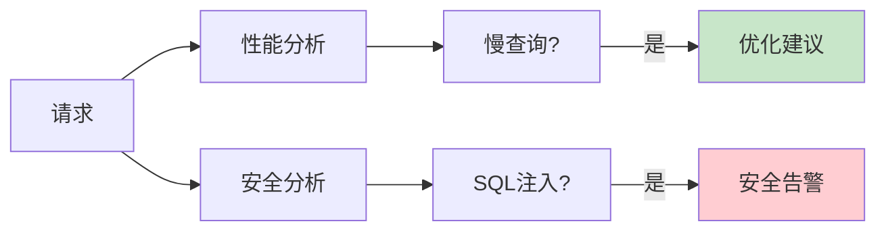
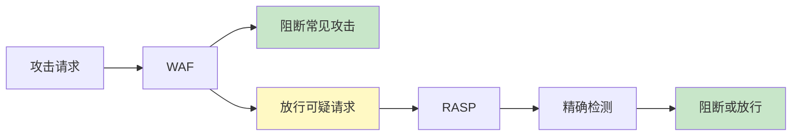

2017年，Equifax 数据泄露事件震惊全球。1.47 亿美国消费者的敏感信息被窃取，直接经济损失超过 10 亿美元。

事后调查发现：攻击者利用的是 Apache Struts 2 的一个已知漏洞（CVE-2017-5638）。Equifax 当时虽然已经部署了 WAF（Web 应用防火墙），但 WAF 没有能够阻止这次攻击。

问题出在哪里？WAF 是基于签名的防御，只能识别已知的攻击模式。而那个漏洞是 0-day——一个厂商还没有发布补丁、攻击签名还不存在的漏洞。

Equifax 的 CISO 在国会听证会上说了一句发人深省的话：「如果我们部署了 RASP，攻击者即使利用 0-day 漏洞，也无法从数据库中提取数据。」

## 一、RASP 的定义

### 1.1 什么是 RASP

RASP（Runtime Application Self-Protection，运行时应用自我保护）是一种将安全防护能力嵌入到应用程序内部的技术：

| 特性 | 说明 |
|------|------|
| 部署位置 | 应用内部（Agent/库） |
| 工作时机 | 运行时实时防护 |
| 攻击检测 | 基于应用上下文 |
| 防护能力 | 检测 + 阻断 |

RASP 的核心思想是：**安全防护不应该只在边界（防火墙），更应该在应用内部**。即使攻击者突破了防火墙，只要进入应用，RASP 就能发现并阻止恶意行为。

### 1.2 RASP 的工作原理



RASP 的工作原理可以分解为以下几个核心步骤：

1. **插桩**：在应用启动时加载 Agent，Hook 关键的敏感 API
2. **拦截**：当应用调用敏感操作时，Agent 拦截该调用
3. **检测**：基于污点分析、上下文信息、规则匹配判断是否为攻击
4. **响应**：阻断攻击、记录日志、发送告警

### 1.3 Hook 技术详解

RASP 通过 Hook 系统 API 来监控应用行为：

```java title="RASP Hook 实现示例"
public class SqlInjectionHook {
    
    // Hook JDBC 的 executeQuery 方法
    @Hook(pointcut = "java.sql.Statement.executeQuery(java.lang.String)")
    public static void beforeExecuteQuery(HookContext ctx) {
        // 获取即将执行的 SQL
        String sql = ctx.getArgument(0);
        
        // 获取请求上下文
        HttpServletRequest request = ctx.getHttpRequest();
        String userInput = extractUserInput(sql);
        
        // 检测 SQL 注入
        if (containsSqlInjection(userInput)) {
            // 阻断请求
            ctx.block("SQL 注入攻击被阻断");
            ctx.getLogger().warn("SQL 注入检测: SQL={}, URI={}", 
                sql, request.getRequestURI());
        }
    }
    
    // Hook System.exec 方法
    @Hook(pointcut = "java.lang.Runtime.exec(java.lang.String)")
    public static void beforeExec(HookContext ctx) {
        String command = ctx.getArgument(0);
        
        // 检测命令注入
        if (containsCommandInjection(command)) {
            ctx.block("命令注入攻击被阻断");
            ctx.getLogger().error("命令注入检测: cmd={}, user={}", 
                command, getCurrentUser());
        }
    }
}
```

RASP 主要 Hook 的敏感 API：

| 类别 | Hook 点 | 检测威胁 |
|------|---------|----------|
| 数据库 | `Statement.executeQuery()` | SQL 注入 |
| 文件系统 | `FileInputStream.read()` | 路径遍历 |
| 命令执行 | `Runtime.exec()` | 命令注入 |
| 反射 | `Class.forName()` | 反序列化 |
| 网络 | `HttpURLConnection` | SSRF |
| 脚本 | `ScriptEngine.eval()` | 代码注入 |

## 二、RASP 工具对比

### 2.1 主流工具概览

| 工具 | 厂商 | 语言支持 | 部署方式 | 特点 |
|------|------|----------|----------|------|
| Imperva RASP | Imperva | Java、.NET、PHP、Node.js | Agent | 企业级，精确检测 |
| Prevoty | Imperva（收购） | 多语言 | Agent | 被 Imperva 收购 |
| OpenRASP | 百度安全 | Java、PHP、Node.js | 开源 | 免费，国产化 |
| Contrast Protect | Contrast Security | Java、.NET、Node.js | Agent | 与 IAST 集成 |
| Signal Sciences | Fastly | 多语言 | Agent | 云原生 |
| Appknox RASP | Appknox | Android | Agent | 移动安全 |

### 2.2 OpenRASP

OpenRASP 是百度安全开源的 RASP 项目，在国内企业中有广泛应用：

```yaml title="openrasp.yml 配置"
# 应用配置
app:
  id: payment-service
  env: production
  locale: zh-CN

# 服务器配置
server:
  host: 0.0.0.0
  port: 1992

# 攻击检测配置
attack:
  sql-injection:
    enabled: true
    action: block  # block 或 log
    rules:
      - id: mysql-error-based
        name: MySQL 错误注入
      - id: mysql-union
        name: MySQL UNION 注入
      - id: postgres-blind
        name: PostgreSQL 盲注

  xss:
    enabled: true
    action: block
    rules:
      - id: reflected-xss
        name: 反射型 XSS
      - id: stored-xss
        name: 存储型 XSS

  command-injection:
    enabled: true
    action: block

  file-access:
    enabled: true
    action: log
    paths:
      - /etc/passwd
      - /etc/shadow

# 日志配置
logger:
  level: info
  format: json
  output: file
  file:
    path: /var/log/openrasp/rasp.log
    max_size: 100MB
    max_backups: 10
```

```bash title="OpenRASP Java Agent 启动"
# 通过 -javaagent 参数加载
java -javaagent:openrasp-agent.jar \
     -Dopenrasp.config=openrasp.yml \
     -jar my-application.jar
```

### 2.3 Imperva RASP

Imperva 是企业级 RASP 的领导者：

| 功能 | 说明 |
|------|------|
| 攻击检测 | 0-day 漏洞防护 |
| 虚拟补丁 | 无需修改代码修复漏洞 |
| 威胁情报 | 集成全球威胁情报 |
| 合规报告 | SOC 2、PCI-DSS 合规 |

### 2.4 工具选型对比

| 维度 | OpenRASP | Imperva | Contrast |
|------|----------|---------|----------|
| 成本 | 免费开源 | 企业付费 | 企业付费 |
| 支持语言 | Java、PHP、Node | 多语言 | Java、.NET、Node |
| 社区活跃度 | 活跃 | 一般 | 一般 |
| 中文支持 | 良好 | 一般 | 一般 |
| 威胁情报 | 基础 | 高级 | 中等 |
| 与 WAF 集成 | 支持 | 原生集成 | 支持 |

## 三、RASP 的优势

### 3.1 精确检测

RASP 相比 WAF 具有更高的检测准确性：

| 维度 | WAF | RASP |
|------|-----|------|
| 攻击判定 | 基于网络请求特征 | 基于应用执行上下文 |
| 误报率 | 较高 | 极低 |
| 绕过难度 | 中等 | 极高 |
| 0-day 防护 | 弱 | 强 |

RASP 可以看到攻击进入应用后的实际行为，即使攻击者伪装了请求特征，也逃不过 RASP 的检测。

### 3.2 无需修改代码

RASP 的防护能力是注入到应用中的，**不需要修改业务代码**：



### 3.3 虚拟补丁

当发现 0-day 漏洞或来不及修复时，RASP 可以快速部署「虚拟补丁」：

```yaml title="虚拟补丁配置"
# OpenRASP 虚拟补丁示例
attack:
  custom-rules:
    - id: struts2-cve-2017-5638
      name: Apache Struts 2 远程代码执行
      action: block
      conditions:
        - type: url
          pattern: ".*struts2.*"
        - type: header
          name: "Content-Type"
          pattern: ".*#.*"
      response:
        status: 403
        body: "Access Denied - Suspicious Request"
```

### 3.4 覆盖未知漏洞

RASP 的防护不依赖已知漏洞签名，而是基于行为分析：

| 攻击类型 | WAF | RASP |
|----------|-----|------|
| 已知漏洞 | 能检测 | 能检测 |
| 变形攻击 | 部分检测 | 能检测 |
| 0-day 攻击 | 无法检测 | 能检测 |
| 业务逻辑攻击 | 无法检测 | 能检测 |

## 四、RASP 的局限性

### 4.1 性能开销

RASP Agent 会带来一定的运行时开销：

| 开销类型 | 影响程度 | 典型数值 |
|----------|----------|----------|
| 启动时间 | 轻微 | +1~3 秒 |
| 响应延迟 | 中等 | 3%~8% |
| 内存占用 | 中等 | +100~300MB |
| CPU 开销 | 中等 | 5%~15% |

:::warning 性能影响评估
在引入 RASP 之前，务必进行性能测试。对于延迟敏感的业务（如高频交易），需要评估是否可以接受 5% 以上的延迟增加。
:::

### 4.2 兼容性问题

RASP Agent 与某些库和框架可能存在兼容性问题：

| 问题类型 | 示例 | 影响 |
|----------|------|------|
| 类加载冲突 | 自定义类加载器 | Agent 无法 Hook |
| 字节码问题 | 代码混淆 | Hook 失效 |
| 框架不兼容 | 自研框架 | 需要额外配置 |
| 版本依赖 | JDK 版本差异 | 需要特定 Agent 版本 |

### 4.3 误报处理

RASP 可能对某些合法业务行为产生误报：

```java
// 误报场景：用户昵称包含 SQL 关键字
String nickname = "admin' OR '1'='1";
// RASP 可能误判为 SQL 注入

// 解决方案：配置上下文白名单
whitelist:
  - type: parameter
    name: nickname
    pattern: "^[a-zA-Z0-9_]+$"
    action: ignore
```

## 五、RASP vs WAF：互补关系

### 5.1 对比分析

| 维度 | WAF | RASP |
|------|-----|------|
| 部署位置 | 网络边界 | 应用内部 |
| 检测依据 | 请求特征 | 应用行为 |
| 部署复杂度 | 低 | 中 |
| 性能影响 | 极低 | 中等 |
| 0-day 防护 | 弱 | 强 |
| 维护成本 | 签名更新 | 规则调优 |
| 覆盖范围 | HTTP/HTTPS | 全协议 |

### 5.2 互补架构



**推荐部署架构**：WAF + RASP 组合使用

- **WAF**：第一道防线，过滤常见攻击
- **RASP**：第二道防线，检测绕过 WAF 的攻击

## 六、RASP 的防护场景

### 6.1 SQL 注入防护

```java title="SQL 注入防护示例"
// RASP 自动拦截危险的 SQL 操作
// 注入场景 1：用户输入直接拼接
String sql = "SELECT * FROM users WHERE id = " + userId;
// RASP 检测到：userId 来自用户输入，未净化

// 注入场景 2：MyBatis ${} 拼接
// <select>SELECT * FROM ${tableName}</select>
// RASP 检测到：tableName 来自用户输入

// RASP 防护行为
// 1. 阻断请求
// 2. 记录攻击详情（SQL、时间、IP、用户）
// 3. 发送告警到 SIEM
```

### 6.2 XSS 防护

```java title="XSS 防护示例"
// 反射型 XSS
// http://example.com/search?q=<script>alert(1)</script>
// RASP 检测到：恶意脚本标签出现在响应中

// 存储型 XSS
// 用户提交的个人简介包含 
// 当其他用户查看时，RASP 检测到恶意代码执行

// RASP 防护行为
// 1. 过滤或转义恶意内容
// 2. 阻断脚本执行
// 3. 记录攻击者信息
```

### 6.3 命令注入防护

```java title="命令注入防护示例"
// 危险代码
String host = request.getParameter("host");
String cmd = "ping -c 3 " + host;
Runtime.getRuntime().exec(cmd);

// 攻击示例
// host = "127.0.0.1; rm -rf /"
// 实际执行：ping -c 3 127.0.0.1; rm -rf /

// RASP 防护行为
// 1. 检测命令中的特殊字符（;、|、&、$）
// 2. 阻断命令执行
// 3. 记录完整攻击链
```

### 6.4 文件操作防护

```java title="文件操作防护示例"
// 路径遍历攻击
String filename = request.getParameter("file");
FileInputStream fis = new FileInputStream(filename);
// 攻击示例：file = ../../../etc/passwd

// RASP 防护行为
// 1. 检测路径中的 ../
// 2. 验证最终路径是否在允许目录内
// 3. 阻断非法文件访问
```

## 七、RASP 部署模式

### 7.1 独立部署


适用于中小规模部署，每个 Agent 直接与管理平台通信。

### 7.2 集中管理



适用于大规模分布式系统，所有 Agent 统一管理。

### 7.3 容器化部署

```yaml title="Kubernetes 部署配置"
apiVersion: apps/v1
kind: Deployment
metadata:
  name: myapp-with-rasp
spec:
  template:
    spec:
      containers:
        - name: myapp
          image: myapp:1.0
          env:
            - name: JAVA_OPTS
              value: "-javaagent:/rasp/openrasp-agent.jar"
          volumeMounts:
            - name: rasp-config
              mountPath: /rasp
              readOnly: true
      volumes:
        - name: rasp-config
          configMap:
            name: openrasp-config
```

## 八、RASP 与 APM 的结合

### 8.1 集成价值

RASP 与 APM（应用性能监控）结合可以实现**安全与性能的统一监控**：

| 能力 | RASP | APM |
|------|------|-----|
| 数据收集 | 安全事件 | 性能指标 |
| 分析视角 | 攻击行为 | 性能问题 |
| 告警触发 | 攻击检测 | 阈值超限 |

### 8.2 联合分析场景



**场景示例**：当发现异常慢查询时，同时检查是否存在 SQL 注入：

1. APM 检测到某个查询耗时异常
2. 触发安全分析
3. RASP 检查该查询是否有注入风险
4. 如果确认是注入，进行阻断和告警

## 思考题

**问题 1**：某公司计划在生产环境部署 RASP，但运维团队担心性能影响。请分析 RASP 的性能开销来源，并提出一个详细的性能评估方案。

<details>
<summary>参考答案</summary>

**性能开销来源**：

1. **Agent 加载开销**：应用启动时加载 Agent，解析配置
2. **Hook 调用开销**：每个敏感 API 调用增加间接层
3. **规则匹配开销**：每次调用需要进行规则匹配
4. **日志写入开销**：记录日志到磁盘或发送到服务端
5. **上下文传递开销**：需要维护请求上下文信息

**性能评估方案**：

**第一步：基准测试**

```bash
# 在测试环境中，分别在有/无 RASP 的情况下运行压测

# 无 RASP
wrk -t4 -c100 -d60s http://test-app/api/users

# 有 RASP
wrk -t4 -c100 -d60s http://test-app/api/users
```

**第二步：性能指标对比**

| 指标 | 无 RASP | 有 RASP | 影响 |
|------|---------|---------|------|
| QPS | 10000 | 9500 | -5% |
| 平均延迟 | 10ms | 10.5ms | +5% |
| P99 延迟 | 50ms | 55ms | +10% |
| CPU 使用率 | 60% | 65% | +8% |
| 内存使用 | 2GB | 2.15GB | +150MB |

**第三步：分场景评估**

| 场景 | 性能敏感度 | RASP 影响可接受性 |
|------|----------|------------------|
| 用户查询接口 | 低 | 可接受 |
| 核心交易接口 | 高 | 需详细评估 |
| 高频交易 | 极高 | 不建议使用 |
| 后台管理接口 | 低 | 可接受 |

**第四步：优化措施**

```yaml
# 1. 采样策略：只监控部分请求
rasp:
  sampling:
    enabled: true
    rate: 0.1  # 10% 采样

# 2. 异步日志
rasp:
  logger:
    async: true
    queue_size: 10000

# 3. 规则优化：禁用低价值规则
rasp:
  rules:
    disabled:
      - low-value-rule-1
      - low-value-rule-2
```

**决策建议**：

1. 如果性能影响 `<5%`：可以直接部署
2. 如果性能影响 `5%~10%`：选择性部署，非核心服务优先
3. 如果性能影响 `>10%`：考虑采样策略或寻找替代方案
</details>

**问题 2**：RASP 和 WAF 都能防护 SQL 注入，请分析它们在检测 SQL 注入时的技术差异，以及为什么两者需要组合使用。

<details>
<summary>参考答案</summary>

**检测技术差异**：

**WAF 的 SQL 注入检测**：

```yaml
# WAF 基于规则和签名检测
rules:
  - pattern: "(?i)(union.*select|select.*from)"
    action: block
  - pattern: "(?i)(or.*1.*=.*1|and.*1.*=.*1)"
    action: block
  - pattern: "(--|#|/\*.*\*/)"
    action: block
```

WAF 检测特点：
- 基于 HTTP 请求特征
- 无法理解 SQL 上下文
- 容易被编码绕过（URL 编码、双重编码）
- 误报率高（合法输入可能包含 SQL 关键字）

**RASP 的 SQL 注入检测**：

```java
// RASP 在 JDBC 层检测
@Hook("java.sql.Statement.executeQuery")
public void sqlCheck(HookContext ctx) {
    String sql = ctx.getArgument(0);
    
    // 获取数据来源
    String source = ctx.getSource();  // HttpServletRequest
    Map<String, String[]> params = source.getParameterMap();
    
    // 分析 SQL 是否来自用户输入且未净化
    if (containsUserInput(sql, params) && !isPrepared(sql)) {
        ctx.block("SQL 注入攻击");
    }
}
```

RASP 检测特点：
- 基于实际执行的 SQL 语句
- 理解 SQL 上下文和参数绑定
- 绕过难度极高
- 误报率极低

**绕过示例对比**：

| 攻击手法 | WAF 表现 | RASP 表现 |
|----------|----------|-----------|
| URL 编码 | 可能绕过 | 无法绕过 |
| 大小写混合 | 可能绕过 | 无法绕过 |
| 注释混淆 | 可能绕过 | 无法绕过 |
| 存储型注入 | 可能绕过 | 无法绕过 |
| 逻辑注入 | 难以检测 | 精确检测 |

**组合使用价值**：



**防御深度**：

1. **WAF 层**：过滤已知的攻击模式（高召回率）
2. **RASP 层**：检测绕过 WAF 的攻击（高精度）
3. **组合效果**：既能防御 0-day，又能保持低误报

**最佳实践**：

1. **WAF 负责边界防护**：过滤明显的攻击流量
2. **RASP 负责深度防护**：检测绕过 WAF 的攻击
3. **日志关联分析**：当 RASP 检测到攻击时，检查 WAF 是否漏过
4. **持续优化**：根据 RASP 检测结果调整 WAF 规则
</details>
