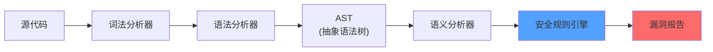
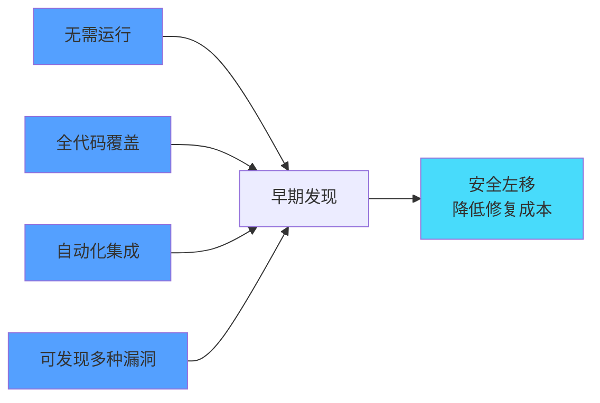
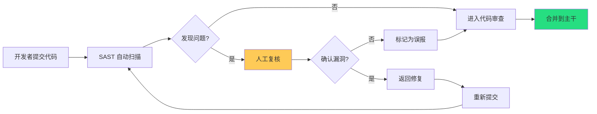

某大型电商公司在发布前进行了一次安全大检查。安全团队使用了 SAST 工具扫描了全部 200 万行代码，结果令人震惊：工具在 30 分钟内发现了 3,847 个潜在的安全问题。

人工复核后发现，其中 1,293 个是真实漏洞，84 个是高危漏洞。更关键的是，这些漏洞分布在 23 个不同的微服务中，如果在上线后被发现，后果不堪设想。

这次扫描让公司意识到：光靠代码审查和渗透测试，远远不够。你需要一种能够自动化、规模化发现代码安全问题的技术。

这就是 SAST。

## SAST 的定义

SAST（Static Application Security Testing，静态应用安全测试）是一种在不运行代码的情况下，通过分析源代码的语法、结构和控制流等信息来发现安全漏洞的技术。



## 工作原理

### 数据流分析

追踪数据从输入源到敏感操作的流向，检测是否存在不安全的传播：

```java title="DataFlowExample.java"
public void processRequest(HttpServletRequest request) {
    // Source：用户输入（污点源）
    String userInput = request.getParameter("username");
    
    // 中间传播
    String query = "SELECT * FROM users WHERE name = '" + userInput + "'";
    
    // Sink：敏感操作（污点槽）
    statement.execute(query);  // SQL 注入！
}
```

SAST 工具会追踪 `userInput` 的数据流，检测它是否被直接拼接到 SQL 语句中。

### 控制流分析

分析代码的执行路径，识别条件分支和循环中的安全问题：

```java title="ControlFlowExample.java"
public void withdraw(HttpServletRequest request) {
    boolean isVIP = checkVIP(request.getParameter("userId"));
    
    if (isVIP) {
        // VIP 可以提取更多，但这个检查可能被绕过
        amount = Long.MAX_VALUE;  // 未校验
    } else {
        amount = Long.parseLong(request.getParameter("amount"));
        if (amount > balance) {
            throw new InsufficientFundsException();
        }
    }
    
    // 存在绕过普通用户限制的代码路径
    account.withdraw(amount);
}
```

### 抽象解释

通过模拟程序执行状态，在不实际运行代码的情况下验证安全属性：

```java title="AbstractInterpretation.java"
public class PasswordChecker {
    
    // 工具会分析：password 是否可能被设为 null 或空字符串
    public boolean isValid(String password) {
        if (password == null || password.isEmpty()) {
            return false;
        }
        
        // 如果到这里，password 一定非空
        return password.length() >= 8;
    }
    
    public void setUserPassword(String password) {
        // 工具会分析：password 是否经过 isValid 检查
        // 如果没有，报告漏洞
        this.password = password;
    }
}
```

## 工具对比

### 企业级工具

| 工具 | 开发商 | 支持语言 | 部署方式 | 特点 |
|---|---|---|---|---|
| Checkmarx | Checkmarx | 25+ 语言 | SaaS / 私有化 | 扫描精度高，误报率低 |
| Veracode | Veracode | 17+ 语言 | SaaS | 易集成，完整 SDLC 支持 |
| Fortify | Micro Focus | 20+ 语言 | 本地 / SaaS | 规则库丰富，企业级 |
| SonarQube | SonarSource | 20+ 语言 | 自部署 / SaaS | 代码质量 + 安全 |
| Snyk Code | Snyk | 10+ 语言 | SaaS | 基于深度代码分析 |

### 开源工具

| 工具 | 支持语言 | 特点 |
|---|---|---|
| Semgrep | 20+ 语言 | 规则编写简单，社区活跃 |
| CodeQL | 10+ 语言 | GitHub 原生，查询语言强大 |
| SpotBugs | Java / Kotlin | 查找 Java 字节码中的 bug |
| Brakeman | Ruby | Rails 安全分析专家 |
| Bandit | Python | Python 代码安全检查 |

### Semgrep 规则示例

Semgrep 是一个轻量级但功能强大的静态分析工具，支持用 YAML 编写规则：

```yaml title="sql-injection-rule.yaml"
rules:
  # SQL 注入检测规则
  - id: java-sql-injection
    pattern: |
      $STMT.executeQuery($QUERY)
    message: |
      SQL 注入漏洞：用户输入直接拼接到 SQL 查询中。
      攻击者可以通过构造恶意输入来执行任意 SQL 语句。
    severity: ERROR
    languages:
      - java
    metadata:
      cwe: CWE-89
      owasp: A03:2021
    paths:
      include:
        - "*.java"
    patterns:
      - pattern-not: |
          PreparedStatement $PS = ...;
          $PS.setString(...);
          $PS.executeQuery(...);
      - pattern: |
          $QUERY = "...SELECT... " + $INPUT + "...";
          $STMT.executeQuery($QUERY);
```

```java title="VulnerableCode.java"
// Semgrep 会检测到 SQL 注入
String query = "SELECT * FROM users WHERE name = '" + username + "'";
stmt.executeQuery(query);
```

```yaml title="path-traversal-rule.yaml"
rules:
  # 路径遍历检测规则
  - id: path-traversal
    pattern: |
      new File($PATH + $INPUT)
    message: |
      潜在路径遍历漏洞：用户输入被拼接到文件路径中。
      攻击者可能使用 "../" 来访问敏感文件。
    severity: ERROR
    languages:
      - java
    metadata:
      cwe: CWE-22
```

### CodeQL 查询示例

```sql title="SqlInjection.ql"
/**
 * @name SQL Injection
 * @description Constructing SQL queries by concatenating user input can lead to SQL injection.
 * @kind path-problem
 * @problem.severity error
 * @precision high
 */

import java
import semmle.code.java.security.SqlInjection
import DataFlow::PathGraph

from DataFlow::PathNode source, DataFlow::PathNode sink
where sqlInjection(source, sink)
select sink.getNode(), source, sink,
  "SQL injection from $@.", source.getNode()
```

## 优势与局限性

### SAST 的优势



| 优势 | 说明 |
|---|---|
| 早期发现 | 开发阶段即可发现漏洞，修复成本低 |
| 全面覆盖 | 可分析所有代码路径，包括未测试的代码 |
| 自动化 | 可集成到 CI/CD，自动化执行 |
| 无运行依赖 | 不需要完整的环境配置 |
| 完整路径分析 | 可分析即使触发条件复杂的漏洞 |

### SAST 的局限性

:::warning 重要认知
SAST 不是银弹，了解其局限性才能正确使用：

1. **误报率高**：SAST 工具会产生大量误报，需要人工复核
2. **无法发现运行时漏洞**：配置错误、环境相关问题无法检测
3. **无法检测业务逻辑漏洞**：越权、认证绕过等业务逻辑问题难以发现
4. **语言和框架限制**：对某些语言或框架的支持不够完善
5. **规则覆盖度**：依赖规则库，新型漏洞可能检测不到
6. **性能问题**：大型项目的扫描可能耗时较长
:::

## SDLC 集成

### IDE 集成（Shift Left）

在开发者编写代码时即时发现问题：

```json title=".vscode/extensions.json"
{
  "recommendations": [
    "semgrep.semgrep",
    "sonarsource.sonarlint-vs-code"
  ]
}
```

```yaml title="sonarlint.properties"
# SonarLint 配置
sonar.java.source=17
# 规则质量配置
sonar.java.file.symlinks.enabled=true
# 忽略的规则（需评估后确认）
sonar.issue.ignore.all=squid:S1234
```

### Git Hooks 集成

```yaml title=".githooks/pre-commit"
#!/bin/sh
# pre-commit hook - 增量代码扫描

echo "Running pre-commit security scan..."

# 只扫描暂存的 Java 文件
STAGED_FILES=$(git diff --cached --name-only --diff-filter=ACM | grep '\.java$')

if [ -n "$STAGED_FILES" ]; then
  semgrep --config=p/java --quiet $STAGED_FILES
  
  if [ $? -ne 0 ]; then
    echo "Security issues found in staged files. Please fix before committing."
    exit 1
  fi
fi

echo "Pre-commit security scan passed."
```

### CI/CD 集成

```yaml title="GitHub Actions CI"
name: SAST Security Scan

on:
  push:
    branches: [main, develop]
  pull_request:
    branches: [main]

jobs:
  semgrep:
    runs-on: ubuntu-latest
    steps:
      - uses: actions/checkout@v4
      
      - name: Run Semgrep
        uses: returntocorp/semgrep-action@v1
        with:
          config: >
            p/java-secrets
            p/java-best practices
            p/owasp-top-ten
          # CI 模式下只报告新问题
          baselineCommit: ${{ github.event.pull_request.base.sha }}
      
      - name: Upload SARIF
        uses: github/codeql-action/upload-sarif@v2
        with:
          sarif_file: semgrep.sarif
```

```yaml title="GitLab CI"
sast:
  stage: security
  image: returntocorp/semgrep
  script:
    - semgrep --config=p/java --json --output=semgrep-report.json .
  artifacts:
    reports:
      sast: semgrep-report.json
    when: always
```

## 规则调优

### 降低误报率

```yaml title="semgrepignore"
# 忽略特定目录
src/test/
src/docs/

# 忽略特定文件
**/*Test.java
**/*Mock*.java

# 忽略特定规则
rules:
  - id: java-hardcoded-credential
    severity: WARNING  # 降级为警告
    mode: false
```

### 定制业务规则

```yaml title="custom-rules/business-logic.yaml"
rules:
  # 检测内部 API 直接暴露
  - id: internal-api-exposed
    pattern: |
      @GetMapping("/api/internal/...")
    message: |
      内部 API 不应直接暴露到公网。请使用 @Security annotation 或配置网络访问控制。
    severity: WARNING
    languages:
      - java
    metadata:
      category: business-logic
      
  # 检测敏感数据日志记录
  - id: sensitive-data-logged
    pattern: |
      logger.$METHOD("$LOGMSG", $ARG)
    message: |
      日志中可能包含敏感信息。请使用 DataMasker 进行脱敏。
    severity: ERROR
    languages:
      - java
    metadata:
      category: data-protection
    filters:
      - metavariable-regex:
          variable: LOGMSG
          regex: "(password|token|secret|key|card|cvv)"
```

## SAST 与代码审查

SAST 不能替代代码审查，但可以增强代码审查：

| 场景 | SAST | 代码审查 |
|---|---|---|
| 代码风格 | 能检查 | 能检查 |
| 已知漏洞模式 | 强项 | 依赖审查者经验 |
| 业务逻辑漏洞 | 弱项 | 强项 |
| 配置错误 | 弱项 | 能检查 |
| 新发现的漏洞模式 | 需更新规则 | 依赖审查者知识 |
| 执行速度 | 快 | 慢 |



## 思考题

**问题 1**：SAST 工具报告了 500 个安全问题，其中 80% 被人工复核认定为误报。作为安全团队负责人，你会如何降低误报率，同时保持对真实漏洞的检测能力？

<details>
<summary>参考答案</summary>

**降低误报率的策略**：

1. **规则精细化**
```yaml
# 原来的宽泛规则
- pattern: $OBJ.$METHOD($ARG)

# 精细化后的规则
- pattern: |
    @Autowired
    $SVC $SVC_NAME;
    ...
    $SVC_NAME.$METHOD($ARG)
# 添加更多前置条件，减少误报
```

2. **使用数据流分析减少误报**
- 追踪污点从 source 到 sink 的完整路径
- 如果中间经过安全处理（如转义、校验），则不报告

3. **配置路径过滤**
- 排除测试代码
- 排除第三方代码
- 只检查核心业务代码

4. **分层报告**
```yaml
# 高置信度规则 - 强制执行
p/command-injection
p/sql-injection

# 中置信度规则 - 警告
p/xxe
p/path-traversal

# 低置信度规则 - 仅记录
p/crypto-weak
```

5. **持续优化**
- 每次误报后，分析原因，更新规则或添加排除
- 建立误报白名单，记录经过人工确认的安全代码

6. **与代码审查结合**
- 将 SAST 报告作为代码审查的辅助输入
- 审查者评估每个发现是否真实漏洞

**平衡策略**：保持高召回率（不漏报），通过精细化和人工复核控制误报率。
</details>

**问题 2**：某公司决定将 SAST 集成到 CI/CD 流程中，但开发团队抱怨 SAST 扫描时间太长（每次提交需要 45 分钟），影响开发效率。作为 DevSecOps 工程师，你会如何优化？

<details>
<summary>参考答案</summary>

**优化方案**：

1. **增量扫描**
```yaml
# 只扫描变更的文件
git diff --cached --name-only --diff-filter=ACM > changed_files.txt
semgrep --targets changed_files.txt

# 定时执行全量扫描（如每日一次）
cron: "0 2 * * *" # 凌晨 2 点
```

2. **并行化扫描**
```yaml
jobs:
  semgrep:
    runs-on: ubuntu-latest
    strategy:
      matrix:
        chunk: [1, 2, 3, 4]
    script:
      # 将文件列表分成 4 份，并行扫描
      semgrep --targets chunk-${{ matrix.chunk }}.txt
```

3. **缓存机制**
```yaml
- name: Cache Semgrep rules
  uses: actions/cache@v3
  with:
    path: ~/.cache/semgrep
    key: semgrep-rules-${{ hashFiles('.semgrep/**') }}
```

4. **分层策略**
```yaml
# PR 阶段：只扫描变更 + 关键规则（快速）
- semgrep --config=p/owasp-top-ten --fast

# 合主干时：完整扫描（中速）
- semgrep --config=p/all

# 定时任务：完整深度扫描（慢速，可接受）
- semgrep --config=p/all --deep
```

5. **结果复用**
```yaml
# 对比当前扫描与上次扫描，只报告新增问题
semgrep --baseline-commit=<previous-commit>
```

6. **异步报告**
```yaml
# PR 时快速返回，深度报告异步发送
script:
  - semgrep --config=p/owasp-top-ten --json --output=quick.json --fast
  # 异步任务
  - semgrep --config=p/all --json --output=deep.json &
```

7. **架构优化**
- 使用 SaaS 版本，利用云端算力
- 将扫描结果存储在数据库中，支持增量对比
</details>