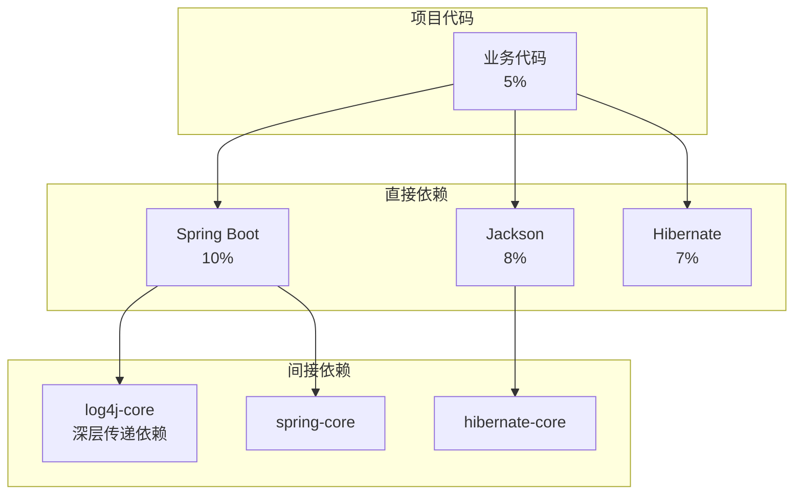
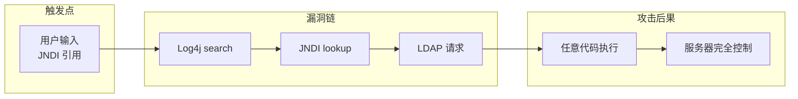
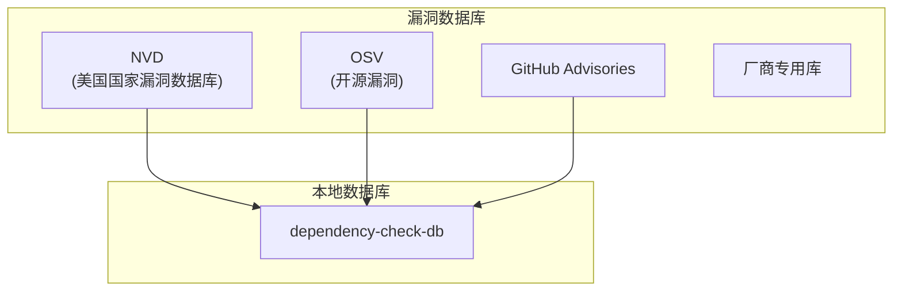

2021 年 11 月 9 日，一个名为「Log4Shell」的秘密被公开。这个存在于 Apache Log4j 中的漏洞，CVSS 评分高达 10.0（满分），影响范围覆盖了全球超过 35 亿台设备。从 Minecraft 游戏到苹果 iCloud，从 Twitter 到亚马逊 AWS，数以万计的企业在圣诞前夜紧急打补丁。

然而，真正令人震惊的不是漏洞本身，而是**大多数受影响的系统根本不知道自己使用了 Log4j**。他们的代码里没有一行 Log4j 代码，但数百个间接依赖把它们悄悄拖入了深渊。

这就是 Software Composition Analysis（SCA，依赖扫描）的价值所在：**不是你自己写的代码，才是最大的攻击面**。

## 一、SCA 的定义与价值

### 1.1 SCA 是什么

SCA 是一种自动化分析技术，用于识别应用程序中使用的第三方组件和开源库，并检测这些组件是否存在已知的安全漏洞和许可证合规问题。

**现代应用依赖结构**：



平均一个 Java 项目有 150+ 个直接依赖，而传递依赖（依赖的依赖）可能超过 500 个。没有人能手动追踪所有这些依赖的安全性。

### 1.2 SCA 的核心能力

| 能力 | 说明 |
|------|------|
| **依赖清单生成** | 列出项目中使用的所有组件及版本 |
| **漏洞检测** | 对比漏洞数据库，检测已知漏洞 |
| **许可证合规** | 检查许可证类型，识别法律风险 |
| **修复建议** | 提供安全版本升级路径 |
| **策略执行** | 在 CI/CD 中阻止有漏洞的构建 |

## 二、依赖漏洞的严重性

### 2.1 Log4Shell 漏洞的教训

Log4Shell 漏洞（CVE-2021-44228）是一个典型案例：

**漏洞影响范围**：

- 直接影响：Apache Log4j 2.x < 2.15.0
- 间接影响：任何间接依赖 Log4j 的组件
- JNDI 注入：远程代码执行（RCE）

**传播链分析**：



**为什么这么多项目受影响**：

```
Spring Boot Starter
    └── spring-boot-starter-logging
        └── logback-classic (默认)
            └── 但很多项目同时引入其他依赖
                └── apache-log4j-extras
                    └── log4j-core 漏洞版本
```

### 2.2 其他著名依赖漏洞

| 漏洞 | 年份 | 评分 | 影响 |
|------|------|------|------|
| Log4Shell (CVE-2021-44228) | 2021 | 10.0 | RCE，影响数十亿设备 |
| Spring4Shell (CVE-2022-22965) | 2022 | 9.8 | RCE，Spring Framework |
| POI CVE-2022-26336 | 2022 | 9.8 | XXE，Apache POI |
| Jackson-databind | 2017-2023 | 8.1 | 反序列化，数百个 CVE |
| OpenSSL Heartbleed | 2014 | 9.1 | 内存泄漏，影响数十亿网站 |

:::warning 传递依赖是隐形炸弹
大多数开发者只知道自己的直接依赖，不会主动查看传递依赖。SCA 工具通过构建完整的依赖树，才能发现这些隐藏的安全风险。
:::

## 三、SCA 工具对比

### 3.1 开源工具

#### OWASP Dependency-Check

```xml title="Maven 配置"
<plugin>
    <groupId>org.owasp</groupId>
    <artifactId>dependency-check-maven</artifactId>
    <version>8.4.0</version>
    <configuration>
        <skipTestScope>false</skipTestScope>
        <failBuildOnCVSS>7</failBuildOnCVSS>
        <assemblyAnalyzerEnabled>false</assemblyAnalyzerEnabled>
    </configuration>
    <executions>
        <execution>
            <goals>
                <goal>check</goal>
            </goals>
        </execution>
    </executions>
</plugin>
```

**执行命令**：

```bash
mvn org.owasp:dependency-check-maven:check
```

**输出示例**：

```
[INFO] Checking for updates...
[INFO] vulnerability found: 3
[WARNING] CVE-2023-44487 - Http/2 DoS (Severity: HIGH, CVSS: 7.5)
         spring-core@5.3.31
[WARNING] CVE-2023-51074 - Improper Neutralization (Severity: MEDIUM, CVSS: 6.1)
         jackson-databind@2.15.2
```

#### npm audit

```bash title="Node.js 依赖审计"
npm audit
# 或
npm audit --audit-level=high
```

**输出示例**：

```
found 5 vulnerabilities (2 moderate, 2 high, 1 critical)
  moderate   prototype pollution
  high       arbitrary code execution
  critical   arbitrary code execution
```

#### Maven Enforcer Plugin

```xml title="依赖规则强制执行"
<plugin>
    <groupId>org.apache.maven.plugins</groupId>
    <artifactId>maven-enforcer-plugin</artifactId>
    <version>3.4.1</version>
    <executions>
        <execution>
            <id>enforce-banned-dependencies</id>
            <goals>
                <goal>enforce</goal>
            </goals>
            <configuration>
                <rules>
                    <bannedDependencies>
                        <excludes>
                            <!-- 禁止使用有已知漏洞的版本 -->
                            <exclude>log4j:log4j:[,2.15.0)</exclude>
                            <exclude>org.apache.struts:struts2-core:[,2.5.30)</exclude>
                        </excludes>
                        <severity>error</severity>
                    </bannedDependencies>
                </rules>
            </configuration>
        </execution>
    </executions>
</plugin>
```

### 3.2 商业工具

| 工具 | 开发商 | 特点 | 定价 |
|------|--------|------|------|
| **Snyk** | Snyk | 深度集成 IDE，实时检测 | 免费有限/商业版 |
| **Dependabot** | GitHub | 与 GitHub 原生集成 | 免费（公开仓库） |
| **Retire.js** | OWASP | 专注 JavaScript/TypeScript | 开源免费 |
| **JFrog Xray** | JFrog | 容器+依赖双扫描 | 企业版 |
| **Sonatype Nexus** | Sonatype | 仓库管理+安全 | 企业版 |

### 3.3 工具对比矩阵

| 维度 | OWASP DC | npm audit | Snyk | Dependabot |
|------|----------|-----------|------|------------|
| 语言支持 | 多语言 | Node.js | 多语言 | 多语言 |
| 更新频率 | 每日 | 实时 | 实时 | 实时 |
| CI/CD 集成 | 原生 | 原生 | 原生 | 原生 |
| 自动修复 | 有限 | 有限 | 是 | PR 自动提 |
| IDE 插件 | 无 | 无 | 是 | 无 |
| 误报率 | 中 | 低 | 低 | 低 |
| 漏洞库覆盖 | NVD+多源 | npm advisories | 独有库 | GitHub Advisory |

## 四、漏洞数据库

### 4.1 主要漏洞数据源



**NVD（National Vulnerability Database）**：

- NIST 维护的官方漏洞数据库
- 使用 CVE 编号体系
- CVSS 评分标准化
- 更新延迟：漏洞公开后数小时到数天

**OSV（Open Source Vulnerabilities）**：

- Google 主导的开源项目漏洞数据库
- 覆盖 Go、PyPI、npm、crates.io 等生态系统
- 提供机器友好的 API

```bash title="OSV 查询示例"
curl -X POST https://api.osv.dev/v1/query \
  -d '{
    "package": {"name": "log4j", "ecosystem": "Maven"},
    "version": "2.14.1"
  }'
```

### 4.2 漏洞唯一标识

| 标识符 | 说明 | 示例 |
|--------|------|------|
| CVE | 通用漏洞披露 | CVE-2021-44228 |
| GHSA | GitHub 安全公告 | GHSA-7rjr-3q55-vv33 |
| OSV | 开源项目特定 ID | OSV-2021-581 |
| CNVD | 中国国家漏洞库 | CNVD-2021-12345 |

## 五、漏洞严重性评级

### 5.1 CVSS 评分系统

CVSS（Common Vulnerability Scoring System）是最广泛使用的漏洞严重性评分标准：

```java title="CVSS 计算维度"
/**
 * CVSS 评分组成
 */
public class CVSSScore {
    // 基本评分（不随时间变化）
    double baseScore;

    // 时间评分（随时间推移可修复性变化）
    double temporalScore;

    // 环境评分（根据组织环境调整）
    double environmentalScore;

    // 攻击向量
    enum AttackVector { NETWORK, ADJACENT, LOCAL, PHYSICAL }

    // 攻击复杂度
    enum AttackComplexity { LOW, HIGH }

    // 影响类型
    enum Impact { NONE, LOW, HIGH }
}
```

**CVSS 3.1 基本评分向量**：

```
CVSS:3.1/AV:N/AC:L/PR:N/UI:N/S:U/C:H/I:H/A:H
     │    │  │    │  │  │  │  │  │  │  │
     │    │  │    │  │  │  │  │  │  │  └── Availability: High
     │    │  │    │  │  │  │  │  │  └───── Integrity: High
     │    │  │    │  │  │  │  │  └──────── Confidentiality: High
     │    │  │    │  │  │  │  └──────────── Scope: Unchanged
     │    │  │    │  │  │  └──────────────── User Interaction: None
     │    │  │    │  │  └─────────────────── Privileges Required: None
     │    │  │    │  └─────────────────────── Attack Complexity: Low
     │    │  │    └───────────────────────── Privileges Required: None
     │    │  └─────────────────────────────── Attack Vector: Network
     └─────────────────────────────────────── Version: 3.1
```

**CVSS 评分等级**：

| 评分范围 | 等级 | 处理建议 |
|----------|------|----------|
| 0.0 | 无 | 无需处理 |
| 0.1 - 3.9 | 低 | 计划内修复 |
| 4.0 - 6.9 | 中 | 近期修复 |
| 7.0 - 8.9 | 高 | 紧急修复 |
| 9.0 - 10.0 | 严重 | 立即修复 |

### 5.2 CVSS 的局限性

:::warning CVSS 不是万能的
CVSS 评分基于漏洞的技术特性，不考虑：
1. 漏洞在具体应用中的可利用性
2. 攻击者的技能门槛
3. 业务上下文和资产价值
4. 现有安全措施的缓解作用
:::

**CVSS 局限性示例**：

| 漏洞 | CVSS | 实际风险 | 原因 |
|------|------|---------|------|
| Log4Shell | 10.0 | 极高 | RCE，无前置条件 |
| 内网服务漏洞 | 8.5 | 低 | 需要内网访问权限 |
| 需要认证的漏洞 | 9.1 | 中 | 需绕过认证才能利用 |

## 六、许可证合规检查

### 6.1 常见开源许可证风险

| 许可证类型 | 传染性 | 商业使用 | 典型许可证 |
|------------|--------|----------|------------|
| ** permissive** | 无 | 可自由使用 | MIT, Apache 2.0, BSD |
| **Weak Copyleft** | 有条件 | 可自由使用 | MPL 2.0, LGPL |
| **Strong Copyleft** | 完全传染 | 需开源 | GPL 2.0/3.0, AGPL |
| **商业限制** | 多种 | 受限 | BSL, SSPL |

### 6.2 许可证扫描配置

```xml title="OWASP Dependency-Check 许可证扫描"
<plugin>
    <groupId>org.owasp</groupId>
    <artifactId>dependency-check-maven</artifactId>
    <configuration>
        <!-- 启用许可证检查 -->
        <licenseUrlGroups>
            <licenseUrlGroup>
                <name>Copyleft Licenses</name>
                <licenseUrls>
                    <licenseUrl>https://www.gnu.org/licenses/gpl-2.0.html</licenseUrl>
                    <licenseUrl>https://www.gnu.org/licenses/agpl-3.0.html</licenseUrl>
                </licenseUrls>
                <includeRange>[,)</includeRange>
                <excludeRange>[3.0,)</excludeRange>
            </licenseUrlGroup>
        </licenseUrlGroups>
    </configuration>
</plugin>
```

### 6.3 许可证合规策略

```java title="许可证合规策略实现"
public class LicenseComplianceService {

    private static final Set<String> APPROVED_LICENSES = Set.of(
        "Apache-2.0",
        "MIT",
        "BSD-2-Clause",
        "BSD-3-Clause",
        "ISC"
    );

    private static final Set<String> COPYLEFT_LICENSES = Set.of(
        "GPL-2.0-only",
        "GPL-3.0-only",
        "AGPL-3.0-only"
    );

    /**
     * 检查许可证合规性
     */
    public ComplianceResult checkLicense(Dependency dep) {
        String license = dep.getLicense();

        if (APPROVED_LICENSES.contains(license)) {
            return ComplianceResult.APPROVED;
        }

        if (COPYLEFT_LICENSES.contains(license)) {
            return ComplianceResult.NEEDS_REVIEW;  // 需要法律团队审核
        }

        return ComplianceResult.BLOCKED;  // 阻止使用
    }
}
```

## 七、依赖锁文件

### 7.1 锁文件的作用

锁文件（Lock File）记录了依赖树的精确版本快照：

**Maven 的 pom.xml**（只声明范围）：

```xml
<dependency>
    <groupId>com.fasterxml.jackson.core</groupId>
    <artifactId>jackson-databind</artifactId>
    <version>[2.15.0,2.16.0)</version>  <!-- 版本范围 -->
</dependency>
```

**Gradle 的 gradle.lockfile**（精确版本）：

```text title="gradle.lockfile"
jackson-databind:jackson-databind:2.15.2
jackson-core:jackson-core:2.15.2
jackson-annotations:jackson-annotations:2.15.2
```

### 7.2 锁定依赖版本

```groovy title="Gradle 依赖锁定"
plugins {
    id 'org.gradle.dependency-lock' version '1.0.0'
}

dependencyLocking {
    lockAllConfigurations()
}
```

**常用锁文件格式**：

| 包管理器 | 锁文件 |
|----------|--------|
| Maven | `pom-lock.xml`, `mvnw.lock` |
| Gradle | `gradle.lockfile` |
| npm | `package-lock.json` |
| pip | `requirements-lock.txt`, `Pipfile.lock` |
| Go | `go.sum` |

:::tip 最佳实践
1. **提交锁文件到版本控制**：确保所有环境的依赖一致
2. **CI 中验证锁文件**：确保锁文件与 pom.xml/requirements.txt 一致
3. **定期更新锁文件**：使用 `npm update` / `mvn dependency:resolve` 更新
4. **审查锁文件变更**：每次更新都是潜在的安全风险
:::

## 八、CI/CD 中的 SCA 集成

### 8.1 GitHub Actions 集成

```yaml title=".github/workflows/sca.yml"
name: Dependency Security Scan

on:
  push:
    branches: [main, develop]
  pull_request:
    branches: [main]

jobs:
  security-scan:
    runs-on: ubuntu-latest
    steps:
      - uses: actions/checkout@v4

      - name: Set up JDK
        uses: actions/setup-java@v4
        with:
          java-version: '17'

      - name: OWASP Dependency Check
        run: mvn org.owasp:dependency-check-maven:check
        continue-on-error: true  # 不阻塞构建，但生成报告

      - name: Upload dependency report
        uses: actions/upload-artifact@v4
        with:
          name: dependency-check-report
          path: target/dependency-check-report.html

      - name: Snyk Security Scan
        uses: snyk/actions/maven@master
        env:
          SNYK_TOKEN: ${{ secrets.SNYK_TOKEN }}

      - name: Check vulnerable dependencies
        run: |
          if grep -q "HIGH\|CRITICAL" dependency-check-report.html; then
            echo "::error::High or Critical vulnerabilities found"
            exit 1
          fi
```

### 8.2 GitLab CI 集成

```yaml title=".gitlab-ci.yml"
stages:
  - security

dependency_scan:
  stage: security
  image: maven:3.9-eclipse-temurin-17
  script:
    - mvn org.owasp:dependency-check-maven:check -DfailBuildOnCVSS=7
    - mvn dependency:list
  artifacts:
    reports:
      dependency_scanning: dependency-check-report.xml
    paths:
      - dependency-check-report.html
  allow_failure: true  # 可配置为不允许失败

snyk_scan:
  stage: security
  image: snyk/snyk:docker
  script:
    - snyk test --all-projects --fail-on=all
  variables:
    SNYK_TOKEN: $SNYK_TOKEN
  allow_failure: true
```

### 8.3 自动修复 PR

```java title="依赖更新策略服务"
@Service
public class DependencyUpdateService {

    /**
     * 生成依赖更新 PR
     */
    public PullRequest createUpdatePR(String dependency, String currentVersion,
                                       String fixedVersion, String cveId) {
        String title = String.format("fix: upgrade %s to %s (CVE-%s)",
                                     dependency, fixedVersion, cveId);

        String body = String.format("""
            ## Security Update Required

            **CVE**: %s
            **CVSS**: %s
            **Current Version**: %s
            **Fixed Version**: %s

            ### Impact
            [漏洞影响描述]

            ### Verification
            [ ] 单元测试通过
            [ ] 集成测试通过
            [ ] 手动验证
            """, cveId, "9.8", currentVersion, fixedVersion);

        // 创建 PR
        return githubClient.createPullRequest(title, body);
    }
}
```

## 九、SCA 的局限性

### 9.1 检测能力边界

| 局限 | 说明 | 缓解措施 |
|------|------|----------|
| **仅限已知漏洞** | 0-day 无法检测 | RASP、运行时保护 |
| **版本匹配依赖** | 漏洞库不完整 | 多源漏洞库 |
| **PoC 利用性** | 不评估实际可利用性 | EPSS 结合 |
| **运行时漏洞** | 检测不到运行时动态加载 | IAST 补充 |
| **配置缺陷** | 不检测错误配置 | 安全基线扫描 |

### 9.2 误报与漏报

**误报场景**：

- 漏洞影响旧版本，但项目实际使用方式不受影响
- 漏洞需要特定配置才可利用
- 传递依赖版本覆盖了有漏洞的版本

**漏报场景**：

- 自研代码复制了开源代码（有漏洞的部分）
- 容器镜像中的系统级依赖未扫描
- 私有仓库中的组件未纳入扫描范围

```java title="多维度验证漏洞"
@Service
public class VulnerabilityValidator {

    /**
     * 验证漏洞是否真正影响项目
     */
    public VulnerabilityImpact assessImpact(CVEDetail cve, ProjectContext context) {
        // 1. 检查传递依赖是否已覆盖
        boolean transitiveOverride = hasTransitiveVersionOverride(cve, context);

        // 2. 检查代码是否实际调用了漏洞代码路径
        boolean codePathUsed = isVulnerableCodePathUsed(cve, context);

        // 3. 检查是否有缓解措施
        boolean mitigated = hasMitigatingControls(cve, context);

        if (transitiveOverride || !codePathUsed || mitigated) {
            return VulnerabilityImpact.LOW;  // 降低严重性
        }

        return VulnerabilityImpact.fromCVSS(cve.getCVSSScore());
    }
}
```

## 十、权衡矩阵

| 维度 | OWASP DC | Snyk | Dependabot |
|------|----------|------|------------|
| **部署方式** | 自托管 | SaaS/自托管 | SaaS（GitHub 集成） |
| **扫描深度** | 深（支持多种语言） | 深（专有数据库） | 中 |
| **更新及时性** | 每日更新 | 实时 | 实时 |
| **自动修复** | 手动 | 自动 PR | 自动 PR |
| **IDE 集成** | 无 | 是 | 无 |
| **适合团队** | 需要完全控制 | 追求效率 | GitHub 用户 |
| **成本** | 免费 | 免费/付费 | 免费（公开仓库） |

:::tip 选型建议
- **小型团队**：从 GitHub Dependabot 开始，免费且零配置
- **中型团队**：Snyk + GitHub Actions，全面覆盖
- **大型企业**：自托管 OWASP DC + 自建漏洞库，满足合规要求
:::

## 思考题

**问题 1**：某公司的 Maven 项目使用了 `spring-boot-starter-web:2.7.14`，SCA 工具报告发现 `CVE-2023-20883`（Spring Framework 拒绝服务漏洞，影响 6.0.0-6.0.12 版本）。请分析这个报告是否需要处理，以及如果需要处理，应该采取什么行动。

<details>
<summary>参考答案</summary>

**分析步骤**：

1. **版本对比**：
   - 项目版本：2.7.14
   - 漏洞影响范围：6.0.0-6.0.12
   - 结论：**不受影响**（2.7.x 不在范围内）

2. **依赖链确认**：
   ```
   spring-boot-starter-web:2.7.14
       └── spring-webmvc:5.3.31  （不是 6.x）
   ```

3. **但需要注意**：
   - Spring Boot 2.7.x 官方已停止维护（2023年11月）
   - 可能存在其他漏洞风险
   - 建议升级到 3.x 系列

**建议行动**：

| 优先级 | 行动 | 说明 |
|--------|------|------|
| 无需处理 | 此 CVE | 跳过 |
| 高优先级 | 评估 Spring Boot 2.7 停止维护风险 | 制定升级计划 |
| 中优先级 | 扫描其他漏洞 | 可能有其他风险 |

**注意**：SCA 工具报告需要人工分析，不能机械地全部处理。

</details>

**问题 2**：某公司计划将 SCA 集成到 CI/CD 流程中，但担心扫描时间过长影响交付效率。请设计一个兼顾安全与效率的 SCA 集成方案。

<details>
<summary>参考答案</summary>

**效率与安全平衡方案**：

**1. 分层扫描策略**

```yaml
# 快速扫描（每次构建）
- 检查 pom.xml 变更
- 仅扫描直接依赖
- 目标时间：< 1 分钟

# 深度扫描（每日/每版本）
- 完整传递依赖分析
- 漏洞库全量比对
- 目标时间：5-10 分钟
```

**2. 增量扫描优化**

```java title="增量扫描实现"
public class IncrementalScanService {

    /**
     * 判断是否需要全量扫描
     */
    public boolean needsFullScan(BuildContext context) {
        // 条件：首次构建、pom.xml 变更、超过24小时未全量扫描
        return context.isFirstBuild() ||
               pomChanged(context) ||
               lastFullScanTooOld(context);
    }

    /**
     * 缓存漏洞数据
     */
    public CVEDatabase getCachedDatabase() {
        // 本地缓存 + NVD API 增量更新
    }
}
```

**3. 并行扫描策略**

```groovy title="Gradle 并行扫描"
dependencyUpdates {
    // 使用后台线程更新漏洞数据库
    runAfter {
        dependencyUpdatesTask.execute()
    }
}

// 扫描结果异步处理，不阻塞构建
```

**4. 失败策略配置**

```yaml
# 不阻止正常构建，但阻止发布
build: continue-on-error: true
publish: fail-on-error: true
```

**5. 预期效果**

| 策略 | 构建时间增加 | 安全覆盖率 |
|------|-------------|-----------|
| 无 SCA | 基准 | 0% |
| 仅快速扫描 | +30秒 | 60% |
| 快速+深度分离 | +1分钟 | 95% |
| 全量同步扫描 | +5分钟 | 100% |

**推荐配置**：快速扫描 + 每日深度扫描 + 发布前强制检查

</details>
