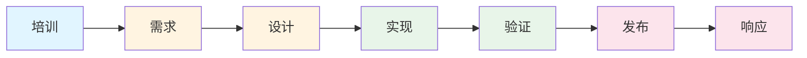
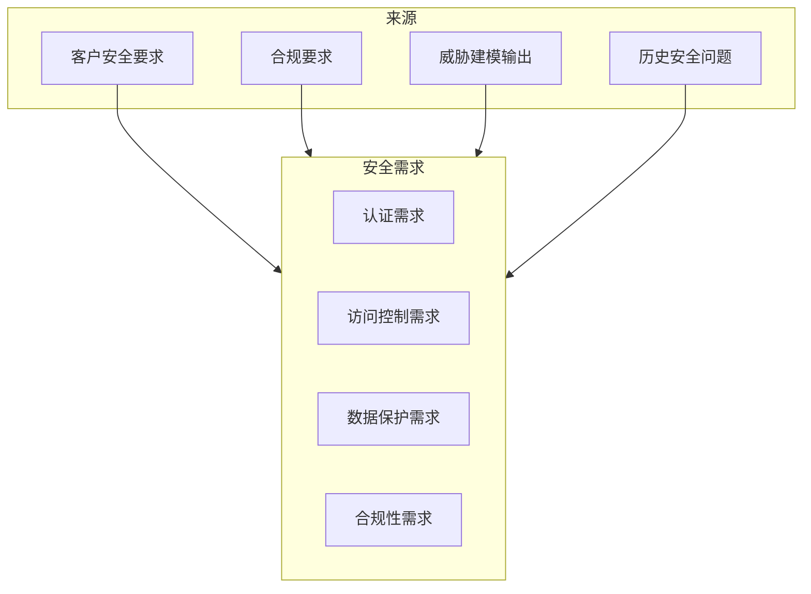
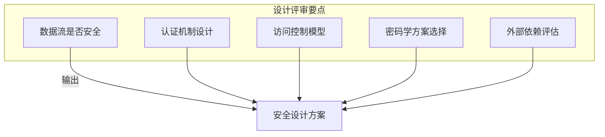
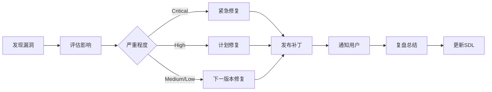
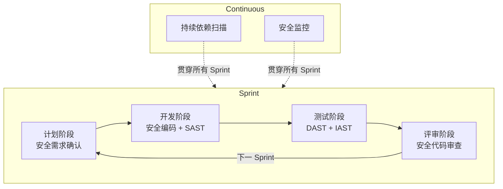

2004 年，微软在「可信计算」战略中首次系统性地提出了 SDL（Security Development Lifecycle）的概念。此前，微软产品的安全问题层出不穷：Windows XP 的 RPC DCOM 漏洞、IE 浏览器的无数安全补丁——这些事件促使微软重新审视软件开发流程中的安全问题。

如今，SDL 已经成为企业级软件安全的事实标准。从金融系统的合规要求，到云服务的 SOC 2 认证，实施 SDL 已成为获取客户信任的必要条件。但 SDL 不是什么神秘的黑科技，它的本质是**把安全意识和方法系统性地嵌入到软件开发的每一个阶段**。

## 一、SDL 的演进与核心价值

SDL 并非一成不变的教条，它随着软件工程实践和威胁态势的变化而不断演进。

### 1.1 SDL 的发展脉络

- **2004 年**：微软内部推行 SDL v1.0，主要针对 Windows 部门
- **2008 年**：SDL v5.0，向外部合作伙伴开放
- **2010 年**：SDL 简化版本（SDL Core Practices）发布，降低实施门槛
- **2016 年**：微软将 SDL 与 DevOps 结合，推出 SDL in DevOps 实践
- **2020 年**：SDL 全面拥抱云原生场景，强调自动化和持续安全

### 1.2 SDL 的核心价值

| 价值维度 | 具体表现 |
|----------|----------|
| 降低漏洞密度 | 研究表明，SDL 可以将漏洞发现率降低 50% 以上 |
| 减少修复成本 | 安全问题在开发早期发现，修复成本显著低于生产环境 |
| 合规支撑 | 满足 ISO 27001、SOC 2、PCI DSS 等安全合规要求 |
| 品牌信任 | 客户和合作伙伴更愿意选择有安全开发流程的供应商 |
| 知识积累 | 安全问题和解决方案形成组织资产，而非每次重复踩坑 |

## 二、SDL 的七个核心阶段

SDL 将软件开发分为七个阶段，每个阶段都有明确的安全目标和关键活动。

### 2.1 阶段一：培训（Training）

安全知识是 SDL 成功的基础。如果开发人员不知道什么是 SQL 注入，怎么可能写出防注入的代码？

**核心培训内容**：

| 培训主题 | 覆盖人群 | 培训频率 |
|----------|----------|----------|
| 安全编码基础 | 所有开发人员 | 入职 + 年度 |
| 威胁建模方法 | 架构师、技术负责人 | 年度 |
| 特定安全领域（如密码学） | 相关模块开发者 | 按需 |
| 安全工具使用 | 所有开发人员 | 持续 |

:::warning 常见误区
培训不是一次性活动。安全威胁和最佳实践都在不断演进，培训内容需要定期更新。仅仅在入职时培训一次，远远不够。
:::

### 2.2 阶段二：需求（Requirements）

在编写第一行代码之前，需要明确系统的安全需求。这一阶段回答的问题是：**这个系统需要达到什么样的安全目标？**

**安全需求的来源**：

**典型安全需求示例**：

- 用户密码必须满足复杂度要求（8 位以上，包含大小写字母和数字）
- 敏感数据在传输和存储时必须加密
- 所有操作必须记录审计日志
- API 必须防止暴力破解（限流、锁定机制）

### 2.3 阶段三：设计（Design）

设计阶段是 SDL 中最重要的阶段之一，因为架构层面的安全决策往往难以在后期改变。

**设计阶段的安全活动**：

1. **威胁建模**：识别系统面临的威胁和攻击面
2. **安全架构评审**：检查设计方案是否满足安全需求
3. **攻击面分析**：确定系统暴露的攻击点数量
4. **信任边界定义**：明确系统内外的信任边界

### 2.4 阶段四：实现（Implementation）

编码阶段是将安全设计转化为实际代码的过程。这一阶段的核心是**遵循安全编码规范**，避免引入常见的安全漏洞。

**安全编码关键实践**：

- 输入验证：所有外部输入必须验证
- 输出编码：根据输出上下文选择合适的编码方式
- 认证与会话管理：使用安全框架，避免自实现认证
- 加密操作：使用成熟的加密库，不自创加密算法
- 错误处理：避免敏感信息泄露到错误消息中

### 2.5 阶段五：验证（Verification）

验证阶段通过各种测试手段确保代码满足安全要求。这一阶段的工具化和自动化程度，直接影响 SDL 的落地效率。

**验证手段对比**：

| 手段 | 检测时机 | 优点 | 缺点 |
|------|----------|------|------|
| SAST | 编码时/构建时 | 全面、自动化 | 误报率高 |
| DAST | 运行测试时 | 真实攻击模拟 | 无法测试认证后功能 |
| IAST | 运行时 | 高准确性 | 性能开销 |
| SCA | 依赖引入时 | 发现第三方漏洞 | 覆盖范围有限 |
| 渗透测试 | 发布前 | 发现复杂逻辑漏洞 | 成本高、耗时长 |

### 2.6 阶段六：发布（Release）

发布阶段是产品上线前的最后一道安全关卡。这一阶段需要进行全面的安全评审，确认所有已知安全问题已得到妥善处理。

**发布前安全检查清单**：

- 所有高危和严重漏洞已修复或接受风险
- 安全配置已验证（环境配置、部署配置）
- 密钥和凭证已妥善管理，无硬编码问题
- 安全文档和应急响应计划已准备就绪
- 安全监控和日志系统已上线

### 2.7 阶段七：响应（Response）

SDL 的最后一个阶段是响应，即产品上线后如何应对安全事件。

**安全响应流程**：

## 三、SDL 与敏捷开发的结合

传统的 SDL 强调严格的阶段门禁（Stage Gates），每个阶段完成后必须经过评审才能进入下一阶段。这种模式在瀑布式开发中运行良好，但在敏捷开发中却显得过于笨重。

### 3.1 敏捷 SDL 的核心原则

**嵌入式安全**：安全活动不是独立的阶段，而是融入到每个 Sprint 中。

**持续安全验证**：安全测试不是一次性的发布前检查，而是持续集成的一部分。

**风险驱动的优先级**：不是所有功能都需要同等程度的安全投入，风险评估决定安全工作的优先级。

### 3.2 敏捷 SDL 的实践

**具体实践**：

1. **安全 User Story**：将安全需求转化为用户故事，如「作为用户，我希望密码传输加密，以防被窃听」
2. **安全 Definition of Done**：定义什么是「完成」，如「代码通过 SAST 扫描无高危问题」「通过安全代码审查」
3. **安全回顾**：每个 Sprint 结束后进行安全回顾，总结问题和改进点

## 四、SDL 成熟度模型

SDL 的实施不是一蹴而就的，它是一个渐进的过程。组织可以根据自身情况，从基础级逐步向高级演进。

| 成熟度级别 | 特征 | 典型组织 |
|------------|------|----------|
| Level 1：基础 | 有安全意识，但无系统流程 | 初创公司、小团队 |
| Level 2：标准化 | 建立安全编码规范，有基本流程 | 成长期企业 |
| Level 3：自动化 | 安全工具集成到 CI/CD，自动化扫描 | 中大型企业 |
| Level 4：优化 | 基于度量持续改进，安全与开发深度融合 | 行业领先企业 |

### 4.1 各成熟度级别的差距

| 活动 | Level 1 | Level 2 | Level 3 | Level 4 |
|------|---------|---------|---------|---------|
| 安全培训 | 无 | 入职培训 | 持续培训 | 个性化学习 |
| 威胁建模 | 无 | 项目级别 | 每个架构变更 | 持续更新 |
| 安全测试 | 手动渗透测试 | SAST + DAST | 全工具链自动化 | 智能扫描 |
| 漏洞管理 | Excel 跟踪 | 专用工具 | 自动化工作流 | 预测性分析 |

## 五、SDL 的工具支持

SDL 的落地离不开工具的支持。以下是各阶段常用的工具类别：

### 5.1 设计与威胁建模工具

- Microsoft Threat Modeling Tool：免费的威胁建模工具
- OWASP Threat Dragon：开源威胁建模工具
- IriusRisk：商业威胁建模平台

### 5.2 代码分析工具

- SonarQube：代码质量管理平台，含安全规则
- Checkmarx：SAST 领域领导者
- Snyk Code：专注于开源和安全的 SAST

### 5.3 依赖扫描工具

- OWASP Dependency-Check：开源 SCA 工具
- Snyk：商业 SCA 平台，支持多种语言
- Dependabot：GitHub 内置的依赖更新工具

### 5.4 动态测试工具

- OWASP ZAP：开源 DAST 工具
- Burp Suite：行业标准的渗透测试工具
- Acunetix：商业 DAST 平台

:::tip 工具选择的考量
不要追求「大而全」的工具链，而要根据团队规模、技术栈、预算选择合适的工具组合。对于大多数团队，建议从 SAST（SonarQube）和 SCA（Snyk/Dependabot）开始，这两者覆盖了最高频的安全问题来源。
:::

## 思考题

**问题 1**：一家互联网金融公司正在从瀑布式开发向敏捷开发转型，SDL 的哪些实践可以直接迁移，哪些需要调整？

参考答案

**可以直接迁移的实践**：

- 安全编码规范和培训体系
- 安全代码审查流程
- 安全工具（SAST、DAST、SCA）
- 漏洞管理和响应流程

**需要调整的实践**：

- 阶段门禁模式 → 改为持续的安全检查门禁（如 PR 必须通过安全扫描）
- 大型威胁建模 → 改为每个 Epic/Feature 的轻量级威胁分析
- 发布前的全面安全评审 → 改为持续安全监控和定期深度安全审查

**新增的实践**：

- 安全 User Story 和 Definition of Done
- Sprint 级别的安全回顾
- 持续集成中的安全自动化检查

**关键原则**：敏捷 SDL 不是「删减版」SDL，而是「持续版」SDL。安全的检查和验证不是一次性活动，而是融入每个迭代。

**问题 2**：如何衡量 SDL 的有效性？有哪些关键指标可以帮助组织评估 SDL 的成熟度？

参考答案

**衡量 SDL 有效性的关键指标**：

1. **漏洞密度**：每千行代码的漏洞数量（漏洞数/KLOC）
   - 目标：逐年下降
   - 基准：行业平均约为 0.1-1.0 个高危漏洞/KLOC

2. **漏洞发现阶段分布**：
   - 理想状态：开发阶段发现占比 > 70%
   - 如果生产环境发现占比高，说明安全左移不够

3. **平均修复时间（MTTR）**：
   - Critical 漏洞：从发现到修复的平均时间
   - 目标：Critical < 24 小时，High < 1 周

4. **安全扫描覆盖率**：
   - 代码覆盖率：多少比例的代码通过了 SAST 扫描
   - 依赖覆盖率：多少比例的依赖经过了 SCA 检查

5. **培训覆盖率**：
   - 安全培训参与率
   - 培训后安全编码违规率变化

6. **安全事件数量与影响**：
   - 上线后安全事件数量
   - 数据泄露事件的次数和影响范围

7. **合规通过率**：
   - 安全审计一次通过率
   - 漏洞修复的 SLA 达成率

**成熟度评估建议**：每季度进行一次 SDL 成熟度评估，对照上一节的四级别模型，识别当前短板，制定改进计划。

