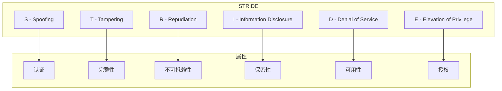
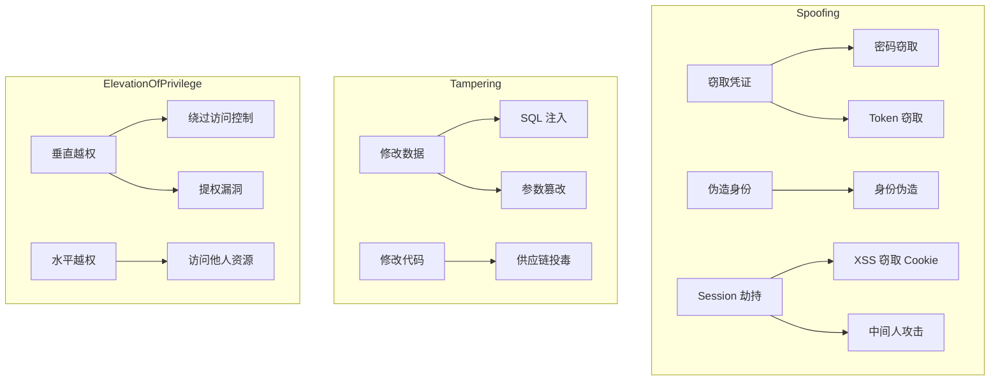

STRIDE 这个名字本身就是一个巧妙的缩写：每个字母代表一类威胁的开头。这六类威胁覆盖了大多数应用层攻击的典型模式。

理解 STRIDE，不仅仅是记住六种威胁类型，更重要的是理解**每类威胁背后的攻击原理、常见场景，以及对应的防护措施**。本文将深入剖析 STRIDE 模型，帮助你建立系统的威胁分析能力。

## 一、STRIDE 模型概述

STRIDE 由微软于 1999 年提出，最初是作为内部安全开发生命周期（SDL）的一部分，后来逐渐成为业界最广泛使用的威胁分类框架之一。

| 字母 | 威胁类型 | 英文全称 | 违反的安全属性 |
|------|----------|----------|---------------|
| S | 伪装 | Spoofing | 认证（Authentication） |
| T | 篡改 | Tampering | 完整性（Integrity） |
| R | 否认 | Repudiation | 不可抵赖性（Non-repudiation） |
| I | 信息泄露 | Information Disclosure | 保密性（Confidentiality） |
| D | 拒绝服务 | Denial of Service | 可用性（Availability） |
| E | 权限提升 | Elevation of Privilege | 授权（Authorization） |



## 二、Spoofing（伪装）

### 2.1 威胁原理

伪装类威胁的核心是**攻击者冒充他人身份**。在 Web 应用中，这通常意味着获取或伪造他人的认证凭证，从而以受害者身份执行操作。

### 2.2 常见场景

- 盗取他人账号密码登录
- 窃取或伪造 Session Cookie
- 冒充他人 API 请求
- 伪造服务端响应（如 DNS 欺骗）
- 证书伪造（HTTPS 中间人攻击）

### 2.3 防护措施

| 防护措施 | 说明 | 优先级 |
|----------|------|--------|
| 强身份认证 | 多因素认证（MFA）、生物识别 | 高 |
| Session 管理 | 安全的 Cookie 生成、Session 过期、Session 绑定 | 高 |
| 证书 pinning | 防止 HTTPS 中间人攻击 | 中 |
| 防止暴力破解 | 账号锁定、验证码、限流 | 高 |
| 设备指纹 | 识别异常登录设备 | 中 |

### 2.4 Java 代码示例

```java title="Spring Security Session 配置"
@Configuration
public class SecurityConfig {
    
    @Bean
    public SecurityFilterChain filterChain(HttpSecurity http) throws Exception {
        http
            // 启用 HTTPS
            .requiresChannel(channels -> channels
                .anyRequest().requiresSecure())
            // Session 管理
            .sessionManagement(session -> session
                .sessionCreationPolicy(SessionCreationPolicy.IF_REQUIRED)
                .sessionFixation().migrateSession()  // 防止 Session  fixation
                .maximumSessions(1)  // 防止同一账号多处登录
                .maxSessionsPreventsLogin(false))  // 新登录使旧 Session 失效
            // Cookie 安全配置
            .cookie(cookie -> cookie
                .httpOnly(true)  // 防止 JavaScript 访问
                .secure(true)  // 仅 HTTPS 传输
                .sameSite("Strict"));  // CSRF 防护
        
        return http.build();
    }
}
```

## 三、Tampering（篡改）

### 3.1 威胁原理

篡改类威胁的核心是**攻击者恶意修改数据**。这可能是修改传输中的数据、数据库中的数据，或者服务器上的文件。

### 3.2 常见场景

- SQL 注入：修改数据库查询逻辑
- XSS：修改网页内容，注入恶意脚本
- CSRF：强制用户执行非自愿的操作
- 修改 Cookie/Token：绕过认证或授权
- API 参数篡改：修改请求参数获取未授权数据
- 文件上传：覆盖系统文件或上传恶意文件

### 3.3 防护措施

| 防护措施 | 说明 | 优先级 |
|----------|------|--------|
| 输入验证 | 严格验证所有外部输入 | 高 |
| 输出编码 | 根据输出上下文正确编码 | 高 |
| 参数签名 | 对敏感参数进行 HMAC 签名 | 中 |
| 数据完整性校验 | 使用 MAC 或签名确保数据不被篡改 | 高 |
| 完整性检查 | 文件校验和、二进制签名 | 中 |

### 3.4 Java 代码示例

```java title="请求参数完整性校验"
import javax.crypto.Mac;
import javax.crypto.spec.SecretKeySpec;
import java.nio.charset.StandardCharsets;
import java.util.Base64;

public class ParameterValidator {
    
    private static final String SECRET_KEY = "your-secret-key";
    
    /**
     * 对敏感参数进行 HMAC 签名，防止参数篡改
     */
    public static String sign(String... params) throws Exception {
        Mac mac = Mac.getInstance("HmacSHA256");
        SecretKeySpec keySpec = new SecretKeySpec(
            SECRET_KEY.getBytes(StandardCharsets.UTF_8), "HmacSHA256");
        mac.init(keySpec);
        
        String data = String.join("|", params);
        byte[] hmacBytes = mac.doFinal(data.getBytes(StandardCharsets.UTF_8));
        return Base64.getEncoder().encodeToString(hmacBytes);
    }
    
    /**
     * 验证参数签名，防止篡改
     */
    public static boolean verify(String expectedSign, String... params) throws Exception {
        String actualSign = sign(params);
        return constantTimeEquals(expectedSign, actualSign);
    }
    
    /**
     * 使用常量时间比较，防止时序攻击
     */
    private static boolean constantTimeEquals(String a, String b) {
        if (a.length() != b.length()) {
            return false;
        }
        int result = 0;
        for (int i = 0; i < a.length(); i++) {
            result |= a.charAt(i) ^ b.charAt(i);
        }
        return result == 0;
    }
}
```

## 四、Repudiation（否认）

### 4.1 威胁原理

否认类威胁的核心是**攻击者或用户否认自己执行过的操作**。典型的场景是：「我没有转过这笔钱」「我没有修改过这份文档」。没有充分的审计日志，这类否认几乎无法反驳。

### 4.2 常见场景

- 用户否认自己提交了某笔订单
- 员工否认自己删除了重要文件
- 攻击者入侵后无法追溯来源
- 管理员否认自己修改了配置

### 4.3 防护措施

| 防护措施 | 说明 | 优先级 |
|----------|------|--------|
| 审计日志 | 记录所有重要操作的详细信息 | 高 |
| 日志完整性保护 | 日志防篡改、日志签名 | 高 |
| 操作人标识 | 记录操作者身份、IP、时间 | 高 |
| 不可抵赖协议 | 数字签名确认操作 | 中 |
| 安全 SIEM | 集中收集和分析安全日志 | 中 |

### 4.4 日志设计示例

```java title="审计日志实现"
import org.slf4j.Logger;
import org.slf4j.LoggerFactory;
import java.time.Instant;

public class AuditLogger {
    
    private static final Logger auditLog = LoggerFactory.getLogger("AUDIT");
    
    /**
     * 记录业务操作审计日志
     * 包含：操作人、操作类型、操作对象、操作结果、客户端信息、时间戳
     */
    public static void log(String userId, String action, String resource, 
                          String result, String clientIp) {
        AuditEntry entry = new AuditEntry();
        entry.userId = userId;
        entry.action = action;
        entry.resource = resource;
        entry.result = result;
        entry.clientIp = clientIp;
        entry.timestamp = Instant.now().toString();
        entry.sessionId = SessionContext.getCurrentSessionId();
        
        // 序列化为 JSON，便于后续分析
        auditLog.info("AUDIT|{}|{}|{}|{}|{}|{}|{}", 
            entry.timestamp, entry.userId, entry.action, 
            entry.resource, entry.result, entry.clientIp, entry.sessionId);
    }
    
    static class AuditEntry {
        String timestamp;
        String userId;
        String action;
        String resource;
        String result;
        String clientIp;
        String sessionId;
    }
}
```

:::warning 关键提醒
审计日志必须写到独立的日志系统，而不是与业务日志混在一起。如果日志与业务系统共享存储，攻击者可能在入侵后清除日志掩盖痕迹。建议使用 append-only 的日志存储（如云日志服务或写保护的文件系统）。
:::

## 五、Information Disclosure（信息泄露）

### 5.1 威胁原理

信息泄露类威胁的核心是**敏感数据被未授权方获取**。这包括用户个人数据、商业机密、认证凭证、系统配置信息等。

### 5.2 常见场景

- SQL 注入读取数据库内容
- XSS 窃取 Cookie 或用户数据
- 错误信息泄露敏感细节
- 备份文件泄露
- API 返回过多数据（过度暴露）
- 日志泄露敏感信息
- Git 仓库泄露密钥

### 5.3 防护措施

| 防护措施 | 说明 | 优先级 |
|----------|------|--------|
| 数据加密 | 敏感数据加密存储和传输 | 高 |
| 访问控制 | 严格限制数据访问权限 | 高 |
| 输出过滤 | 错误信息泛化、API 数据脱敏 | 高 |
| 密钥管理 | 密钥不硬编码、不提交到仓库 | 高 |
| 敏感词过滤 | 日志、响应中过滤敏感信息 | 中 |

### 5.4 Java 代码示例

```java title="统一错误响应包装"
import com.fasterxml.jackson.annotation.JsonInclude;

public class ApiResponse<T> {
    
    private int code;
    private String message;
    private T data;
    private String requestId;  // 用于问题追踪，但不泄露系统细节
    
    public static <T> ApiResponse<T> success(T data) {
        ApiResponse<T> response = new ApiResponse<>();
        response.code = 200;
        response.message = "success";
        response.data = data;
        response.requestId = generateRequestId();
        return response;
    }
    
    /**
     * 错误响应：对外展示统一格式，不泄露具体错误细节
     * 详细错误信息只记录到日志
     */
    public static ApiResponse<Void> error(int code, String message, 
                                           Exception e, Logger logger) {
        ApiResponse<Void> response = new ApiResponse<>();
        response.code = code;
        response.message = message;  // 对用户友好的错误信息
        response.requestId = generateRequestId();
        
        // 详细错误信息写入日志，不返回给客户端
        logger.error("Request {} failed: {}", response.requestId, 
            ExceptionUtils.getStackTrace(e));
        
        return response;
    }
    
    /**
     * 用户可见的错误信息应该是泛化的
     * 而非：ORA-00942: table or view does not exist
     */
    public static String sanitizeErrorMessage(String rawMessage) {
        // 移除 SQL 错误
        if (rawMessage.contains("ORA-") || 
            rawMessage.contains("SQL") ||
            rawMessage.contains("Exception")) {
            return "系统繁忙，请稍后重试";
        }
        return rawMessage;
    }
}
```

## 六、Denial of Service（拒绝服务）

### 6.1 威胁原理

拒绝服务类威胁的核心是**使系统或服务对合法用户不可用**。攻击者通过消耗系统资源、耗尽网络带宽、或触发系统崩溃来实现这一目标。

### 6.2 常见场景

- DDoS 攻击：流量型、资源消耗型
- 应用层 DoS：慢连接、巨额请求
- 数据库 DoS：大查询、全表扫描
- API 限流绕过
- 资源泄露：文件句柄、内存泄漏
- 逻辑 DoS：删除关键数据、修改关键配置

### 6.3 防护措施

| 防护措施 | 说明 | 优先级 |
|----------|------|--------|
| 限流 | API 限流、用户限流 | 高 |
| 容量规划 | 充足的资源储备、弹性扩容 | 高 |
| CDN/DDoS 防护 | 专业 DDoS 防护服务 | 高 |
| 资源隔离 | 核心服务与边缘服务隔离 | 中 |
| 优雅降级 | 服务不可用时提供降级方案 | 中 |
| 监控告警 | 异常流量实时告警 | 高 |

### 6.4 Java 代码示例

```java title="API 限流实现"
import io.github.bucket4j.Bandwidth;
import io.github.bucket4j.Bucket;
import io.github.bucket4j.Refill;
import java.time.Duration;
import java.util.Map;
import java.util.concurrent.ConcurrentHashMap;

public class RateLimiter {
    
    // 每个用户一个 Bucket
    private final Map<String, Bucket> userBuckets = new ConcurrentHashMap<>();
    
    // 每个 IP 一个 Bucket（防止 IP 耗尽攻击）
    private final Map<String, Bucket> ipBuckets = new ConcurrentHashMap<>();
    
    /**
     * 创建用户级限流桶：每分钟 100 个请求
     */
    private Bucket createUserBucket(String userId) {
        Bandwidth limit = Bandwidth.classic(100, 
            Refill.greedy(100, Duration.ofMinutes(1)));
        return Bucket.builder().addLimit(limit).build();
    }
    
    /**
     * 创建 IP 级限流桶：每分钟 500 个请求
     */
    private Bucket createIpBucket(String clientIp) {
        Bandwidth limit = Bandwidth.classic(500,
            Refill.greedy(500, Duration.ofMinutes(1)));
        return Bucket.builder().addLimit(limit).build();
    }
    
    public boolean tryConsume(String userId, String clientIp) {
        Bucket userBucket = userBuckets.computeIfAbsent(userId, this::createUserBucket);
        Bucket ipBucket = ipBuckets.computeIfAbsent(clientIp, this::createIpBucket);
        
        // 两个桶都必须有剩余配额
        return userBucket.tryConsume(1) && ipBucket.tryConsume(1);
    }
    
    /**
     * 从网关层获取客户端 IP（考虑代理场景）
     */
    public String extractClientIp(HttpServletRequest request) {
        String xForwardedFor = request.getHeader("X-Forwarded-For");
        if (xForwardedFor != null && !xForwardedFor.isEmpty()) {
            return xForwardedFor.split(",")[0].trim();
        }
        return request.getRemoteAddr();
    }
}
```

## 七、Elevation of Privilege（权限提升）

### 7.1 威胁原理

权限提升类威胁的核心是**获取超出其正常角色应有的权限**。这可能是普通用户获取管理员权限，或者是低权限服务获取系统级权限。

### 7.2 常见场景

- SQL 注入获取 DBA 权限
- 文件上传获取 WebShell，进而系统权限
- 水平越权：访问他人数据
- 垂直越权：普通用户获取管理员功能
- 提权漏洞：利用系统漏洞获取 root/system 权限
- 委托滥用：利用合法功能执行未授权操作

### 7.3 防护措施

| 防护措施 | 说明 | 优先级 |
|----------|------|--------|
| 最小权限原则 | 仅授予完成任务所需的最小权限 | 高 |
| 访问控制检查 | 每次访问敏感资源都验证权限 | 高 |
| 输入验证 | 防止注入类攻击导致权限绕过 | 高 |
| 纵深防御 | 边界检查 + 应用检查 + 数据库检查 | 中 |
| 特权分离 | 关键操作需要额外认证 | 中 |
| 安全沙箱 | 限制代码和进程的可执行操作 | 高 |

### 7.4 Java 代码示例

```java title="权限检查注解与拦截器"
import java.lang.annotation.*;

@Target({ElementType.METHOD})
@Retention(RetentionPolicy.RUNTIME)
@Documented
public @interface RequirePermission {
    String value();  // 权限标识，如 "user:delete", "admin:view"
}

/**
 * 权限检查拦截器
 */
@Component
public class PermissionInterceptor implements HandlerInterceptor {
    
    @Autowired
    private PermissionService permissionService;
    
    @Override
    public boolean preHandle(HttpServletRequest request, 
                             HttpServletResponse response, Object handler) {
        
        if (handler instanceof HandlerMethod handlerMethod) {
            RequirePermission annotation = handlerMethod
                .getMethodAnnotation(RequirePermission.class);
            
            if (annotation != null) {
                String currentUserId = SecurityContext.getCurrentUserId();
                String requiredPermission = annotation.value();
                
                // 每次都检查权限，不依赖缓存
                if (!permissionService.hasPermission(currentUserId, requiredPermission)) {
                    throw new AccessDeniedException(
                        "User " + currentUserId + " lacks permission: " + requiredPermission);
                }
            }
        }
        return true;
    }
}

// 使用示例
@RestController
public class UserController {
    
    @RequirePermission("user:read")
    public ApiResponse<User> getUser(@PathVariable String userId) {
        // 只有拥有 user:read 权限的用户才能访问
        return ApiResponse.success(userService.getById(userId));
    }
    
    @RequirePermission("user:delete")
    public ApiResponse<Void> deleteUser(@PathVariable String userId) {
        // 只有拥有 user:delete 权限的管理员才能访问
        userService.delete(userId);
        return ApiResponse.success(null);
    }
}
```

## 八、STRIDE 威胁树

STRIDE 威胁树是将每类威胁进一步分解为更具体的攻击模式，帮助更系统地识别威胁。



## 九、STRIDE 的局限性

STRIDE 作为一个经典的威胁建模框架，并非完美无缺。理解其局限性，有助于更合理地使用它。

| 局限性 | 说明 | 应对策略 |
|--------|------|----------|
| 不覆盖业务逻辑漏洞 | STRIDE 主要关注技术层面的威胁，对业务逻辑漏洞覆盖不足 | 结合业务场景分析，引入业务威胁建模 |
| 不考虑攻击者能力 | STRIDE 描述威胁类型，但不评估攻击者的技术和资源 | 结合威胁情报，分析真实攻击者画像 |
| 不评估防护措施有效性 | STRIDE 识别威胁和防护，但不评估防护的实际效果 | 定期渗透测试验证 |
| 过度依赖 DFD | 如果 DFD 绘制不准确，威胁分析也会遗漏 | 提高 DFD 质量，多人评审 |

:::tip 最佳实践
STRIDE 最好与其他威胁建模方法结合使用：
- 与 PASTA 结合：PASTA 强调风险分析和攻击模拟
- 与 CVSS 结合：对识别的威胁进行严重性评分
- 与 ATT&CK 结合：利用 MITRE 的攻击者视角完善威胁库
:::

## 十、STRIDE vs 其他威胁建模方法

| 维度 | STRIDE | PASTA | LINDDUN | ATT&CK |
|------|--------|-------|---------|--------|
| 关注点 | 安全属性违反 | 风险导向 | 隐私威胁 | 攻击技术 |
| 方法论 | 威胁分类 | 流程驱动 | 威胁树 | 攻击知识库 |
| 适用场景 | 应用安全 | 业务系统 | 隐私敏感系统 | 红蓝对抗 |
| 学习曲线 | 低 | 中 | 中 | 中 |

## 思考题

**问题 1**：为一个在线支付系统进行威胁建模时，使用 STRIDE 模型分析「用户完成一笔转账」这个场景会产生哪些威胁？请列出每类威胁的具体表现。

<details>
<summary>参考答案</summary>

**Spoofing（伪装）**：
- 攻击者窃取用户账号密码，冒充用户转账
- 攻击者劫持用户 Session，绕过登录状态
- 钓鱼网站收集用户凭证

**Tampering（篡改）**：
- 攻击者篡改转账金额或收款账户
- 中间人攻击修改收款人信息
- 利用 XSS 篡改页面显示的转账信息
- SQL 注入修改交易记录

**Repudiation（否认）**：
- 用户否认自己发起的转账（声称被盗）
- 支付平台无法证明交易经过用户授权
- 缺乏足够的操作日志证明交易真实性

**Information Disclosure（信息泄露）**：
- 攻击者通过 SQL 注入获取交易明细
- 敏感信息在日志中泄露
- API 过度暴露账户余额
- 错误信息泄露账户关联的手机号

**Denial of Service（拒绝服务）**：
- 攻击者发起大量小额转账消耗系统资源
- 攻击者在转账关键时刻发起 DoS
- 耗尽数据库连接池导致转账失败

**Elevation of Privilege（权限提升）**：
- 普通用户通过漏洞获取管理员权限，修改转账限额
- 水平越权：用户 A 查看用户 B 的交易记录
- 垂直越权：普通用户访问商户后台
- 攻击者利用支付接口权限漏洞进行无限额转账

**针对上述威胁的防护措施建议**：
- MFA 认证 + 人脸识别
- 全链路数据加密 + HMAC 签名
- 数字签名 + 不可篡改日志
- 敏感数据脱敏 + 隐私计算
- 限流 + 熔断 + 弹性扩容
- RBAC + ABAC 权限模型 + 审计
</details>

**问题 2**：在审查一个遗留系统时，你发现系统完全没有进行过威胁建模，且存在大量安全漏洞。作为安全工程师，你会如何系统地开展威胁建模工作？有哪些优先级建议？

<details>
<summary>参考答案</summary>

**阶段一：系统分解与文档化（1-2 周）**

优先级最高的工作是理解系统现状：
- 与核心开发人员访谈，绘制 DFD 初稿
- 识别信任边界和数据流
- 收集现有安全问题和历史事件

**阶段二：高风险场景优先建模（2-4 周）**

优先对以下场景进行 STRIDE 分析：
- 认证与会话管理（涉及 Spoofing、Elevation of Privilege）
- 敏感数据访问（涉及 Information Disclosure、Tampering）
- 资金/交易操作（涉及 Tampering、Repudiation）
- 外部接口/API（涉及所有威胁类型）

**阶段三：系统性威胁分析（持续）**

- 覆盖所有核心功能模块
- 建立威胁模式库
- 将威胁建模融入开发流程

**优先级矩阵建议**：

| 优先级 | 威胁类型 | 原因 |
|--------|----------|------|
| P0 | Elevation of Privilege | 直接影响系统控制权 |
| P0 | Tampering（交易相关） | 直接影响资金安全 |
| P1 | Information Disclosure（敏感数据） | 合规要求、用户信任 |
| P1 | Denial of Service | 影响业务可用性 |
| P2 | Spoofing（非核心场景） | 可通过 MFA 缓解 |
| P2 | Repudiation | 逐步完善日志 |

**关键原则**：
1. 不要试图一次性完成所有建模
2. 从最关键、风险最高的场景开始
3. 每次发布前更新威胁模型
4. 建立持续改进的机制
</details>
