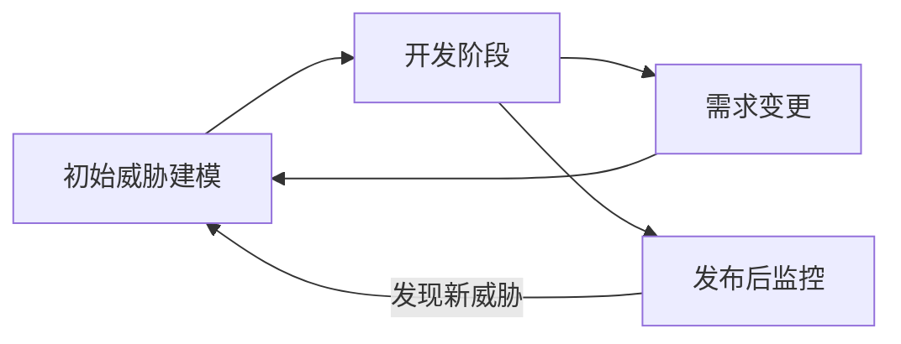
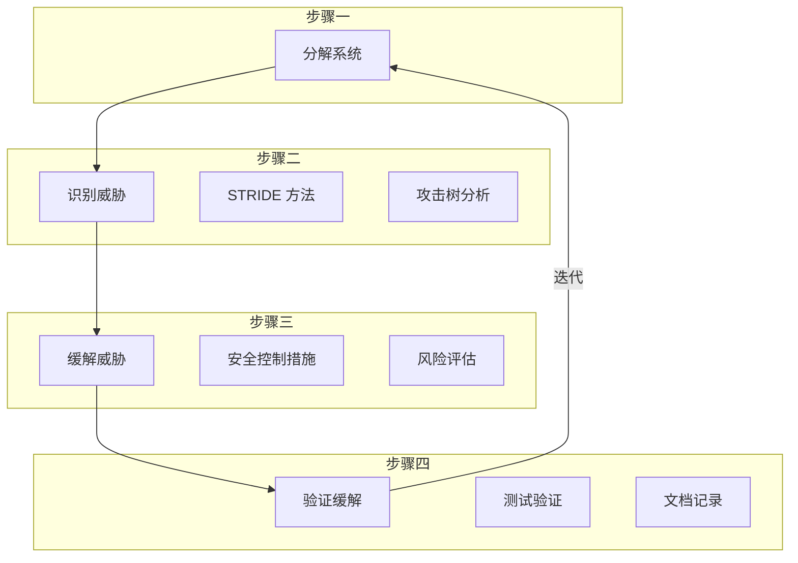
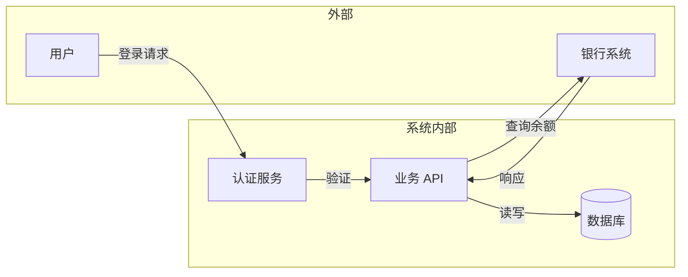
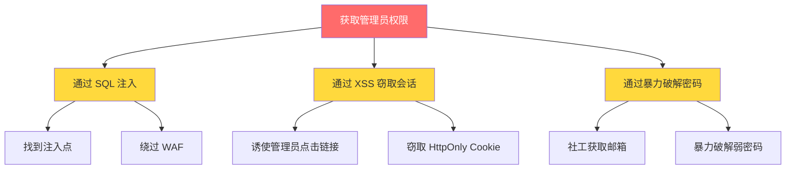
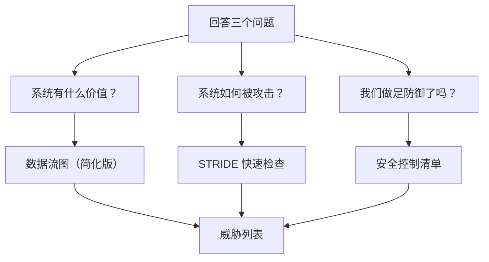

2017 年，Twitter 发生了一起严重的数据泄露事件：超过 3000 万用户账号被黑客获取。事后调查发现，问题根源在于系统设计阶段**从未进行过系统的威胁分析**。如果 Twitter 在设计双因素认证时，能够系统性地分析「攻击者如何绕过认证流程」「session token 泄露的场景有哪些」，这场灾难或许可以避免。

威胁建模（Threat Modeling）正是这样一种系统性方法：它帮助我们在设计阶段识别系统的潜在威胁，评估风险优先级，并在架构层面做出更安全的设计决策。这不是一项可选的「锦上添花」工作，而是安全软件开发的必要环节。

## 一、威胁建模的本质

威胁建模的核心回答三个问题：

1. **系统面临什么威胁？** —— 我们在防御什么
2. **这些威胁的严重程度如何？** —— 我们应该优先关注什么
3. **如何应对这些威胁？** —— 我们应该做什么

### 1.1 威胁建模不是一次性活动

很多团队犯的错误是：项目开始时做一次威胁建模，然后把它当作「已完成」的任务归档。实际上，**威胁建模应该是持续的活动**，随着系统演进、新的攻击手法出现、新的业务场景上线，威胁模型需要不断更新。

### 1.2 威胁建模的时机

- 系统设计初期：确定信任边界和安全架构
- 功能重大变更：评估新功能带来的新威胁
- 技术架构升级：评估新技术的安全影响
- 安全事件后：复盘并更新威胁模型
- 定期安全评审：至少每年一次

## 二、威胁建模的核心步骤

威胁建模是一个迭代的过程，业界最常用的框架是微软提出的「STRIDE 建模方法」，包含四个核心步骤：

### 2.1 步骤一：分解系统

分解系统的目的是理解系统的组成、数据流和处理逻辑。这一步的核心产出是**数据流图（Data Flow Diagram, DFD）**。

**DFD 的四个核心元素**：

| 元素 | 符号 | 说明 |
|------|------|------|
| 外部实体（External Entity） | 方形 | 系统外部的参与者，如用户、其他系统 |
| 进程（Process） | 圆形 | 系统内部的数据处理逻辑 |
| 数据存储（Data Store） | 双线矩形 | 数据存储位置，如数据库、文件 |
| 数据流（Data Flow） | 箭头 | 数据在系统中的流动路径 |

**DFD 绘制示例**：

**信任边界的识别**：

信任边界（Trust Boundary）是数据流跨越不同信任级别的位置。在信任边界处，数据需要特别保护。

常见的信任边界：
- 用户输入到系统内部
- 系统内部到外部系统
- 不同安全域之间（如 DMZ 到内网）
- 应用程序到数据库

:::warning 关键提醒
信任边界是威胁建模中最重要的概念之一。跨越信任边界的数据流，是攻击者最容易突破的点，也是安全控制最需要关注的位置。
:::

### 2.2 步骤二：识别威胁

识别威胁是威胁建模的核心环节。常用的方法包括：

#### 2.2.1 STRIDE 方法

STRIDE 是微软提出的威胁分类框架，将威胁分为六类：

| 威胁类型 | 说明 | 示例 |
|----------|------|------|
| **S**poofing（伪装） | 冒充他人身份 | 盗用他人账号、伪造请求 |
| **T**ampering（篡改） | 修改数据或代码 | SQL 注入、修改 Cookie |
| **R**epudiation（否认） | 否认已执行的操作 | 删除日志、否认转账 |
| **I**nformation Disclosure（信息泄露） | 暴露敏感信息 | 读取数据库、窃取 Cookie |
| **D**enial of Service（拒绝服务） | 使服务不可用 | DDoS、资源耗尽 |
| **E**levation of Privilege（权限提升） | 获取超出应有的权限 | SQL 注入获取管理员权限 |

#### 2.2.2 攻击树（Attack Tree）

攻击树是一种自顶向下的威胁分析方法，从攻击者的目标出发，逐层分解达成目标所需的步骤。

攻击树的价值在于**从攻击者视角思考问题**，帮助团队理解攻击者可能的路径，从而在关键节点设置防御。

### 2.3 步骤三：缓解威胁

识别威胁后，需要评估每个威胁的风险，并决定如何应对。

**风险评估矩阵**：

| | 影响：高 | 影响：低 |
|---|----------|----------|
| **可能性：高** | **高风险（立即处理）** | 中风险（尽快处理） |
| **可能性：低** | 中风险（计划处理） | 低风险（可接受或监控） |

**威胁缓解策略**：

| 策略 | 说明 | 适用场景 |
|------|------|----------|
| 消除（Eliminate） | 完全移除产生威胁的功能 | 该功能非必需 |
| 替换（Replace） | 使用更安全的替代方案 | 无法完全消除 |
| 缓解（Mitigate） | 添加安全控制降低风险 | 风险无法消除但需要接受 |
| 接受（Accept） | 确认风险可接受，不做额外处理 | 风险极低或成本过高 |
| 转移（Transfer） | 将风险转移给第三方 | 如购买网络安全保险 |

### 2.4 步骤四：验证缓解

缓解措施实施后，需要验证其有效性。

**验证方法**：

1. **代码审查**：检查安全控制是否正确实现
2. **渗透测试**：模拟攻击验证防御是否有效
3. **自动化测试**：将安全测试集成到 CI/CD
4. **文档更新**：记录威胁模型变更

## 三、威胁建模工具

### 3.1 Microsoft Threat Modeling Tool

微软提供的免费威胁建模工具，适合 Windows 开发环境。

**优点**：
- 免费、易上手
- 内置 STRIDE 分类
- 自动生成威胁报告
- 支持导出标准格式

**缺点**：
- 仅支持 Windows
- 协作功能有限

### 3.2 OWASP Threat Dragon

OWASP 维护的开源威胁建模工具，支持跨平台使用。

**优点**：
- 开源免费
- Web 版本可用
- 支持团队协作
- 活跃社区支持

### 3.3 IriusRisk

商业威胁建模平台，提供完整的威胁管理和跟踪功能。

**优点**：
- 丰富的威胁库
- 自动生成安全需求
- 与 Jira 等工具集成
- 完整的风险管理流程

### 3.4 工具对比

| 工具 | 成本 | 平台 | 协作 | 推荐场景 |
|------|------|------|------|----------|
| MS Threat Modeling Tool | 免费 | Windows | 弱 | 小团队快速建模 |
| OWASP Threat Dragon | 免费 | 跨平台 | 中 | 开源项目、中小团队 |
| IriusRisk | 商业 | Web | 强 | 中大型企业 |
| draw.io + 手动 | 免费 | 跨平台 | 强 | 有现成绘图工具的团队 |

:::tip 选择建议
对于大多数团队，建议从 OWASP Threat Dragon 开始。如果团队已经在使用 Confluence 或 Miro 等协作白板工具，也可以直接在白板上绘制 DFD，然后在文档中记录威胁分析结果。工具不是最重要的，**关键是建立威胁建模的流程和意识**。
:::

## 四、威胁建模的输出物

威胁建模的产出应该包括以下文档：

### 4.1 数据流图（DFD）

系统的技术架构图，标注所有外部实体、数据流、数据存储和进程。

### 4.2 信任边界图

在 DFD 基础上标注所有信任边界，明确哪些数据流需要特别保护。

### 4.3 威胁列表

| 威胁 ID | 威胁描述 | 威胁类型 | 影响 | 可能性 | 风险等级 | 缓解措施 | 状态 |
|---------|----------|----------|------|--------|----------|----------|------|
| T-001 | SQL 注入攻击 | Tampering | 高 | 高 | 高 | 使用预编译语句 | 待修复 |
| T-002 | XSS 攻击 | Tampering | 中 | 高 | 中 | 输出编码 | 待修复 |

### 4.4 安全需求

从威胁分析中推导出的安全需求，应该纳入产品需求管理。

### 4.5 缓解措施跟踪

记录每个威胁的缓解状态，确保所有高风险威胁都得到妥善处理。

## 五、威胁建模的常见误区

### 5.1 误区一：一次建模，终身受用

系统是活的，威胁也在演进。威胁模型必须随着系统变化而更新。

### 5.2 误区二：追求完美，迟迟不动

威胁建模不可能穷尽所有威胁，关键是建立流程并持续改进。不要因为担心遗漏而迟迟不开始。

### 5.3 误区三：只关注技术威胁

业务逻辑漏洞、社会工程攻击、物理安全等非技术威胁同样重要。

### 5.4 误区四：建模与开发脱节

威胁建模的输出必须转化为具体的开发任务，否则就是空中楼阁。

## 六、轻量级威胁建模实践

对于小型项目或时间紧迫的情况，可以采用轻量级威胁建模方法：

**简化版 STRIDE 检查表**：

| 类型 | 检查问题 |
|------|----------|
| Spoofing | 身份验证是否可靠？会话管理是否安全？ |
| Tampering | 输入验证是否严格？数据完整性如何保证？ |
| Repudiation | 操作审计日志是否完整？日志是否防篡改？ |
| Information Disclosure | 敏感数据是否加密？错误信息是否泄露细节？ |
| Denial of Service | 系统资源是否有保护？限流措施是否到位？ |
| Elevation of Privilege | 访问控制是否严格？最小权限原则是否遵循？ |

## 思考题

**问题 1**：在为一家电商平台进行威胁建模时，你发现系统需要处理大量用户上传的图片。作为安全架构师，你会关注哪些威胁？如何在 DFD 中标注这些风险？

参考答案

**主要威胁**：

1. **文件上传攻击**：
   - 文件名注入（路径遍历 `../`）
   - 文件类型绕过（伪 MIME、双重扩展名）
   - WebShell 上传
   - 大文件 DoS

2. **文件处理漏洞**：
   - 图片解析漏洞（ImageMagick 命令注入）
   - SVG XSS
   - PDF 恶意代码

3. **存储安全**：
   - 未授权访问文件
   - 文件权限配置错误
   - CDN/对象存储安全

**DFD 标注方式**：

在数据流图中，应在以下位置标注信任边界：
- 用户上传点：标注需要严格验证
- 文件存储位置：标注存储隔离需求
- 文件访问点：标注访问控制需求
- 图片处理服务：标注处理安全性

**缓解措施**：

- 上传前：文件类型白名单、MIME 验证、文件大小限制
- 存储时：文件名随机化、隔离存储目录
- 访问时：权限验证、URL 签名
- 处理时：沙箱环境、禁用危险功能

**问题 2**：在敏捷开发模式下，Sprint 周期通常只有 1-2 周。如何在快速迭代中有效实施威胁建模，避免成为开发瓶颈？

参考答案

**策略一：分层建模**

- **架构层面**：每个重大架构变更进行一次全面威胁建模（每个季度或每个重大版本）
- **功能层面**：对于常规功能，只需进行简化版 STRIDE 检查（15-30 分钟）
- **故事层面**：将安全 User Story 融入到功能开发中，不需要单独建模

**策略二：复用与积累**

- 建立威胁模式库（Threat Pattern Library），类似设计模式
- 新功能可以直接套用已有的威胁模式，只需根据实际情况调整
- 每次迭代结束后，更新威胁模式库

**策略三：异步执行**

- 架构师在 Sprint 规划时完成威胁分析
- 开发人员无需参与威胁建模，只需理解安全需求
- 安全问题以「验收标准」或「Definition of Done」形式嵌入开发任务

**策略四：工具自动化**

- 使用 SAST/DAST 工具自动检测常见漏洞
- 将安全检查集成到 CI/CD，减少人工审查时间
- 配置项安全检查可以自动化（如 WAF 规则、密钥管理）

**具体实践**：

- 架构评审时：威胁建模（1-2 小时）
- Sprint 规划时：快速安全评估（15 分钟/功能）
- 代码审查时：安全代码审查（10-15 分钟/PR）
- 发布前：安全测试（自动化 + 必要时人工渗透测试）

