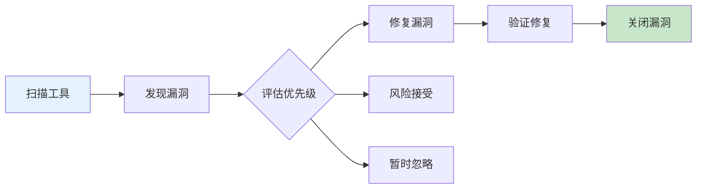
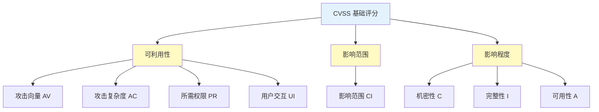
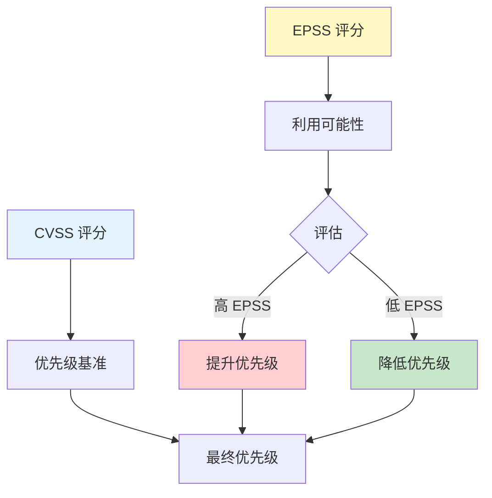
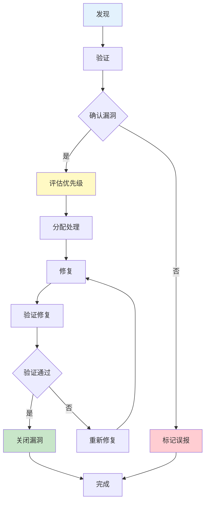
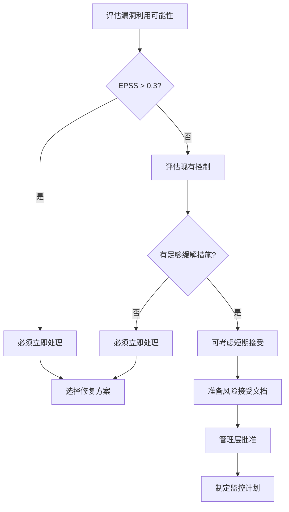

2023年，某云服务提供商收到了安全团队的漏洞报告：一个身份验证模块存在高危漏洞，CVSS 评分 9.8。

安全团队建议：「立即修复，这是最紧急的任务。」

开发团队的回复是：「这个模块正在重构中，新版本两周后上线。如果现在修复，需要单独发布一个版本，影响其他功能的发布时间表。」

于是，这个漏洞在两周内没有被修复。

第三天，漏洞被公开披露。一天后，PoC（概念验证代码）出现在 GitHub 上。又过了 12 小时，第一个利用该漏洞的攻击开始了。

这个故事揭示了一个核心问题：**漏洞的严重程度不等于修复优先级**。漏洞管理是一个复杂的决策过程，需要综合考虑风险、业务影响、修复成本和可用资源。

## 一、漏洞优先级排序的必要性

### 1.1 资源永远有限

| 资源类型 | 现实情况 |
|----------|----------|
| 安全工程师 | 平均每个企业只有 2-5 名应用安全工程师 |
| 开发工程师 | 需要修复漏洞的同时，还要完成业务功能 |
| 发布窗口 | 生产环境发布有固定窗口，不能随时发布 |
| 测试资源 | 漏洞修复后需要完整的回归测试 |

### 1.2 漏洞数量爆炸



大多数中型互联网公司每天可能发现数十个漏洞，大型组织可能有数百甚至数千个开放漏洞。没有系统化的优先级排序，团队将无法有效处理这些漏洞。

### 1.3 避免「低级漏洞」占用资源

| 现象 | 问题 |
|------|------|
| 高危漏洞没人修 | 团队被低危漏洞淹没 |
| 真正风险被忽视 | 注意力在噪音上 |
| 漏洞积压 | 团队对漏洞管理失去信心 |
| 修复疲劳 | 开发人员对无休止的漏洞修复感到厌烦 |

## 二、CVSS 评分系统详解

### 2.1 CVSS 概述

CVSS（Common Vulnerability Scoring System，通用漏洞评分系统）是漏洞严重程度的标准化评分方法：

| 版本 | 说明 |
|------|------|
| CVSS 2.0 | 2007 年发布，基础指标 + 环境指标 |
| CVSS 3.0 | 2015 年发布，增加了利用指标组件 |
| CVSS 3.1 | 2020 年发布，3.0 的小幅修订 |
| CVSS 4.0 | 2023 年发布，增加了补充指标组件 |

### 2.2 CVSS 3.1 基础评分

CVSS 3.1 基础评分包含三个指标组：



#### 可利用性指标

| 指标 | 选项 | 权重 |
|------|------|------|
| Attack Vector (AV) | Network (N) / Adjacent (A) / Local (L) / Physical (P) | N=0.85 |
| Attack Complexity (AC) | Low (L) / High (H) | L=0.77 |
| Privileges Required (PR) | None (N) / Low (L) / High (H) | N=0.85 |
| User Interaction (UI) | None (N) / Required (R) | N=0.85 |

#### 影响指标

| 指标 | 选项 | 权重 |
|------|------|------|
| Confidentiality (C) | High (H) / Low (L) / None (N) | H=0.56 |
| Integrity (I) | High (H) / Low (L) / None (N) | H=0.56 |
| Availability (A) | High (H) / Low (L) / None (N) | H=0.56 |
| Scope (S) | Unchanged (U) / Changed (C) | U=1.0 |

### 2.3 CVSS 评分计算示例

```java title="CVSS 3.1 评分计算"
public class CVSSCalculator {
    
    // 典型 SQL 注入漏洞的评分
    public CVSSScore calculateSqlInjectionScore() {
        // 攻击向量：网络
        // 攻击复杂度：低
        // 所需权限：无
        // 用户交互：无
        // 影响：机密性高、完整性高、可用性高
        // 范围：未改变
        
        return new CVSSScore()
            .av(CVSSVector.N)
            .ac(CVSSVector.L)
            .pr(CVSSVector.N)
            .ui(CVSSVector.N)
            .c(CVSSVector.H)
            .i(CVSSVector.H)
            .a(CVSSVector.H)
            .scope(CVSSVector.U);
        
        // 计算结果：9.8（严重）
    }
    
    // 存储型 XSS 漏洞的评分
    public CVSSScore calculateStoredXssScore() {
        return new CVSSScore()
            .av(CVSSVector.N)
            .ac(CVSSVector.L)
            .pr(CVSSVector.L)  // 需要低权限（发布内容）
            .ui(CVSSVector.R)  // 需要用户交互（浏览页面）
            .c(CVSSVector.L)
            .i(CVSSVector.L)
            .a(CVSSVector.N)
            .scope(CVSSVector.U);
        
        // 计算结果：6.1（中）
    }
    
    // 信息泄露漏洞的评分
    public CVSSScore calculateInfoDisclosureScore() {
        return new CVSSScore()
            .av(CVSSVector.N)
            .ac(CVSSVector.L)
            .pr(CVSSVector.N)
            .ui(CVSSVector.N)
            .c(CVSSVector.L)  // 低机密性影响
            .i(CVSSVector.N)
            .a(CVSSVector.N)
            .scope(CVSSVector.U);
        
        // 计算结果：5.3（中等）
    }
}
```

### 2.4 CVSS 评分等级

| 评分范围 | 等级 | 说明 | 建议处理时间 |
|----------|------|------|--------------|
| 0.0 | 无 | 不存在漏洞 | - |
| 0.1 - 3.9 | 低 | 低风险 | 90 天内 |
| 4.0 - 6.9 | 中 | 中风险 | 30 天内 |
| 7.0 - 8.9 | 高 | 高风险 | 7 天内 |
| 9.0 - 10.0 | 严重 | 严重风险 | 24-48 小时内 |

## 三、CVSS 的局限性

### 3.1 无法反映业务上下文

| 问题 | 示例 |
|------|------|
| 相同漏洞，不同影响 | 登录页面的 XSS vs 管理员面板的 XSS |
| 相同漏洞，不同曝光 | 内部系统 vs 面向公网的系统 |
| 相同漏洞，不同用户 | 普通用户 vs 管理员用户 |

### 3.2 无法反映利用可能性

CVSS 不考虑漏洞是否容易被利用。一个高危漏洞如果需要复杂的条件才能利用，其实际风险可能低于中危但容易被利用的漏洞。

### 3.3 无法反映修复复杂性

| 漏洞类型 | CVSS 可能相同 | 修复复杂性差异 |
|----------|--------------|----------------|
| SQL 注入 | 9.8 | 修复一行代码 vs 重构整个模块 |
| 认证绕过 | 8.1 | 添加 Token 校验 vs 修改 SSO 配置 |

## 四、EPSS（漏洞利用预测评分系统）

### 4.1 EPSS 概述

EPSS（Exploit Prediction Scoring System）是 FIRST（全球应急响应与安全论坛）开发的漏洞利用预测系统：

| 指标 | 说明 |
|------|------|
| 预测目标 | 未来 30 天内被利用的概率 |
| 数据来源 | CVE 特征、威胁情报、漏洞市场数据 |
| 评分范围 | 0.00 - 1.00 |
| 更新频率 | 每日更新 |

### 4.2 EPSS 计算原理

```java title="EPSS 评分查询"
public class EPSSIntegration {
    
    // EPSS API 端点
    private static final String EPSS_API = 
        "https://epss.first.org/data/current/epss_scores.csv";
    
    // 查询漏洞的 EPSS 评分
    public double queryEPSS(String cveId) {
        // 从 EPSS API 获取评分
        EPSSResponse response = httpClient.get(EPSS_API, 
            Map.of("cve", cveId));
        
        return response.epss;
    }
    
    // 综合评分计算
    public PriorityScore calculatePriority(
            double cvssScore, 
            double epssScore,
            boolean isExploited) {
        
        // 调整因子
        double adjustedScore = cvssScore;
        
        // 如果已经被利用，增加优先级
        if (isExploited) {
            adjustedScore = Math.min(10.0, cvssScore * 1.2);
        }
        
        // EPSS > 0.5 表示高利用可能性
        if (epssScore > 0.5) {
            adjustedScore = Math.min(10.0, adjustedScore * 1.3);
        }
        
        // EPSS > 0.1 表示中等利用可能性
        if (epssScore > 0.1) {
            adjustedScore = Math.min(10.0, adjustedScore * 1.1);
        }
        
        return new PriorityScore(adjustedScore);
    }
}
```

### 4.3 CVSS + EPSS 组合模型

| EPSS 区间 | 利用可能性 | 与 CVSS 组合效果 |
|-----------|-----------|-----------------|
| `<0.1` | 低 | 降低整体优先级 |
| `0.1 - 0.5` | 中 | 维持原优先级 |
| `0.5 - 0.9` | 高 | 提高优先级 |
| `>0.9` | 极高 | 立即处理 |



## 五、OWASP 风险评级方法论

### 5.1 OWASP 风险评估模型

OWASP 提供了基于上下文的漏洞风险评估方法：

```java title="OWASP 风险评估"
public class OWASPRiskRating {
    
    public RiskLevel calculateRisk(
            String threatAgent,    // 威胁代理
            String vulnerability, // 漏洞类型
            String impact,         // 影响
            String likelihood      // 利用可能性
    ) {
        // 威胁代理因素
        Factor skillLevel = assessSkillLevel(threatAgent);      // 低/中/高
        Factor motivation = assessMotivation(threatAgent);        // 低/高
        Factor opportunity = assessOpportunity(threatAgent);      // 无/低/中/高
        
        // 漏洞因素
        Factor easeOfDiscovery = assessDiscovery(vulnerability); // 低/中/高
        Factor easeOfExploit = assessExploit(vulnerability);      // 低/中/高
        Factor awareness = assessAwareness(threatAgent);          // 低/高
        
        // 影响因素
        Factor technicalImpact = assessTechImpact(impact);        // 低/中/高
        Factor businessImpact = assessBusinessImpact(impact);     // 低/中/高
        
        // 计算总体风险
        double overallLikelihood = calculateLikelihood(
            easeOfDiscovery, easeOfExploit, awareness, 
            skillLevel, motivation, opportunity);
        
        double overallImpact = calculateImpact(
            technicalImpact, businessImpact);
        
        return mapToRiskLevel(overallLikelihood, overallImpact);
    }
}
```

### 5.2 风险等级矩阵

| 可能性 \ 影响 | 影响低 | 影响中 | 影响高 |
|--------------|--------|--------|--------|
| **可能性高** | 中 | 高 | 严重 |
| **可能性中** | 低 | 中 | 高 |
| **可能性低** | 低 | 低 | 中 |

### 5.3 OWASP 评估因素详解

```java title="评估因素详解"
public class RiskFactors {
    
    // 威胁代理评估
    public enum ThreatAgent {
        SKILL_LEVEL_LOW("脚本小子，无技术背景", 1.0),
        SKILL_LEVEL_MEDIUM("熟悉漏洞利用工具的开发者", 5.0),
        SKILL_LEVEL_HIGH("安全专家，能发现新漏洞", 9.0);
        
        // 动机评估
        MOTIVATION_LOW("可能没有动机", 1.0),
        MOTIVATION_HIGH("有强烈动机（金钱/政治/报复）", 9.0);
        
        // 机会评估
        OPPORTUNITY_NONE("完全无机会", 0.0),
        OPPORTUNITY_LOW("有一些限制", 4.0),
        OPPORTUNITY_MEDIUM("有一些资源", 7.0),
        OPPORTUNITY_HIGH("无限制访问", 9.0);
    }
    
    // 漏洞评估
    public enum Vulnerability {
        EASE_OF_DISCOVERY_IMPOSSIBLE("难以发现", 1.0),
        EASE_OF_DISCOVERY_DIFFICULT("需要大量资源", 3.0),
        EASE_OF_DISCOVERY_EASY("常见工具可发现", 6.0),
        EASE_OF_DISCOVERY_OBVIOUS("公开暴露", 9.0);
        
        EASE_OF_EXPLOIT_DIFFICULT("需要罕见的条件", 1.0),
        EASE_OF_EXPLOIT_EASY("常见工具可利用", 6.0),
        EASE_OF_EXPLOIT_TRIVIAL("一键利用", 9.0);
    }
}
```

## 六、基于业务上下文的优先级排序

### 6.1 业务影响评估

```java title="业务影响评估模型"
public class BusinessImpactAssessment {
    
    public BusinessImpact evaluate(String assetType, 
                                   String vulnerabilityType) {
        BusinessImpact impact = new BusinessImpact();
        
        // 资产重要性
        impact.assetValue = assessAssetValue(assetType);
        
        // 数据敏感性
        impact.dataSensitivity = assessDataSensitivity(
            assetType, vulnerabilityType);
        
        // 业务连续性影响
        impact.availabilityImpact = assessAvailabilityImpact(
            assetType, vulnerabilityType);
        
        // 声誉影响
        impact.reputationalImpact = assessReputationImpact(
            assetType, vulnerabilityType);
        
        // 合规影响
        impact.complianceImpact = assessComplianceImpact(
            assetType, vulnerabilityType);
        
        return impact;
    }
    
    private double assessAssetValue(String assetType) {
        // 用户认证系统：价值最高
        if (assetType.contains("auth") || assetType.contains("login")) {
            return 10.0;
        }
        // 支付系统
        if (assetType.contains("payment") || assetType.contains("transaction")) {
            return 10.0;
        }
        // 客户数据
        if (assetType.contains("customer") || assetType.contains("user")) {
            return 8.0;
        }
        // 内部系统
        if (assetType.contains("internal") || assetType.contains("admin")) {
            return 5.0;
        }
        // 公开内容
        return 2.0;
    }
    
    private DataSensitivity assessDataSensitivity(
            String assetType, String vulnType) {
        
        // 涉及个人信息的漏洞
        if (vulnType.contains("PII") || vulnType.contains("privacy")) {
            return DataSensitivity.VERY_HIGH;
        }
        // 涉及金融信息的漏洞
        if (vulnType.contains("payment") || vulnType.contains("credit")) {
            return DataSensitivity.VERY_HIGH;
        }
        // 涉及医疗信息的漏洞
        if (vulnType.contains("health") || vulnType.contains("medical")) {
            return DataSensitivity.VERY_HIGH;
        }
        // 一般业务数据
        return DataSensitivity.MEDIUM;
    }
}
```

### 6.2 多维度优先级计算

```java title="综合优先级计算"
public class VulnerabilityPriorityCalculator {
    
    public Priority calculatePriority(Vulnerability vuln, 
                                       Context context) {
        // 各维度权重配置
        Weights weights = new Weights()
            .cvss(0.25)        // CVSS 权重
            .epss(0.20)        // EPSS 权重
            .assetValue(0.25)  // 资产价值权重
            .exposure(0.15)   // 暴露面权重
            .remediation(0.15);// 修复难度权重
        
        // 基础评分（CVSS）
        double cvssScore = vuln.getCvssScore();
        
        // 利用可能性（EPSS）
        double epssScore = context.getEPSS(vuln.getCveId());
        
        // 业务影响
        double businessImpact = calculateBusinessImpact(vuln, context);
        
        // 暴露程度
        double exposure = calculateExposure(vuln, context);
        
        // 修复难度
        double remediationEffort = calculateRemediationEffort(vuln);
        
        // 综合评分
        double finalScore = 
            cvssScore * weights.cvss +
            epssScore * 10 * weights.epss +  // EPSS 归一化
            businessImpact * weights.assetValue +
            exposure * weights.exposure +
            (10 - remediationEffort) * weights.remediation;  // 修复难度取反
        
        return new Priority(finalScore, calculateTier(finalScore));
    }
}
```

## 七、漏洞修复 SLA 设计

### 7.1 SLA 矩阵

| 严重程度 | CVSS 范围 | EPSS 范围 | 修复时间 | 验证时间 | 负责人 |
|----------|-----------|-----------|----------|----------|--------|
| P0 紧急 | 9.0-10.0 | `>=0.5` | 24 小时 | 4 小时 | 安全负责人 |
| P1 高 | 7.0-8.9 | `>=0.2` 或已被利用 | 7 天 | 1 天 | 开发负责人 |
| P2 中 | 4.0-6.9 | `<0.2` | 30 天 | 3 天 | 团队负责人 |
| P3 低 | 0.1-3.9 | - | 90 天 | 1 周 | 开发者 |

### 7.2 SLA 触发条件

```java title="SLA 触发逻辑"
public class SLATrigger {
    
    public SLALevel determineSLA(Vulnerability vuln, Context ctx) {
        // P0：紧急
        if (vuln.getCvss() >= 9.0 || ctx.isExploited()) {
            return SLALevel.P0;
        }
        
        // P0：严重 + 高利用可能
        if (vuln.getCvss() >= 9.0 && ctx.getEPSS() >= 0.5) {
            return SLALevel.P0;
        }
        
        // P1：高危
        if (vuln.getCvss() >= 7.0) {
            if (ctx.getEPSS() >= 0.2) {
                return SLALevel.P1;
            }
            if (ctx.isInternetFacing()) {
                return SLALevel.P1;
            }
        }
        
        // P2：中危
        if (vuln.getCvss() >= 4.0) {
            return SLALevel.P2;
        }
        
        // P3：低危
        return SLALevel.P3;
    }
}
```

### 7.3 SLA 例外管理

```yaml title="SLA 例外处理流程"
sla_exceptions:
  # 允许延迟的条件
  - condition: "业务关键发布窗口"
    max_delay: "7天"
    approval: "CTO"
    
  - condition: "需要架构重构"
    max_delay: "30天"
    approval: "VP Engineering"
    
  - condition: "第三方依赖无补丁"
    max_delay: "90天"
    approval: "安全委员会"
    mitigation: "必须部署临时控制措施"

  # 必须立即处理的条件
  immediate_action:
    - condition: "漏洞已被公开利用"
      action: "立即处理，48小时内完成"
    - condition: "涉及敏感数据泄露"
      action: "立即处理，24小时内完成"
    - condition: "监管合规要求"
      action: "按照监管要求时间处理"
```

## 八、漏洞管理流程

### 8.1 漏洞生命周期



### 8.2 漏洞管理看板

```java title="漏洞管理看板"
public class VulnerabilityKanban {
    
    // 漏洞状态
    public enum Status {
        NEW("新增", Color.RED),
        CONFIRMED("已确认", Color.ORANGE),
        ASSIGNED("已分配", Color.YELLOW),
        IN_PROGRESS("修复中", Color.BLUE),
        CODE_REVIEW("代码审查", Color.PURPLE),
        TESTING("测试中", Color.CYAN),
        DEPLOYED("已部署", Color.GREEN),
        VERIFIED("已验证", Color.GREEN),
        CLOSED("已关闭", Color.GRAY),
        FALSE_POSITIVE("误报", Color.GRAY),
        RISK_ACCEPTED("风险接受", Color.GRAY);
        
        // 状态转移规则
        public Set<Status> canTransitionTo() {
            return switch (this) {
                case NEW -> Set.of(CONFIRMED, FALSE_POSITIVE);
                case CONFIRMED -> Set.of(ASSIGNED, RISK_ACCEPTED);
                case ASSIGNED -> Set.of(IN_PROGRESS);
                case IN_PROGRESS -> Set.of(CODE_REVIEW);
                case CODE_REVIEW -> Set.of(TESTING);
                case TESTING -> Set.of(DEPLOYED);
                case DEPLOYED -> Set.of(VERIFIED);
                case VERIFIED -> Set.of(CLOSED);
                default -> Set.of();
            };
        }
    }
    
    // 升级规则
    public void checkEscalation(Vulnerability vuln) {
        // 检查 SLA 违反
        if (vuln.isSLAViolated()) {
            escalate(vuln, EscalationReason.SLA_VIOLATION);
        }
        
        // 检查漏洞被利用
        if (vuln.isExploitedInWild()) {
            escalate(vuln, EscalationReason.ACTIVE_EXPLOITATION);
        }
        
        // 检查公开披露
        if (vuln.isPubliclyDisclosed() && vuln.getStatus() != DEPLOYED) {
            escalate(vuln, EscalationReason.PUBLIC_DISCLOSURE);
        }
    }
}
```

## 九、漏洞与威胁情报的结合

### 9.1 威胁情报源

| 情报类型 | 来源 | 用途 |
|----------|------|------|
| CVE 数据库 | MITRE | 漏洞基础信息 |
| EPSS | FIRST | 利用可能性预测 |
| CISA KEV | CISA | 已知的已利用漏洞 |
| 威胁情报订阅 | 商业/开源 | APT 活动信息 |
| 漏洞赏金 | HackerOne/Bugcrowd | 真实攻击信息 |
| Dark Web 监控 | 商业服务 | 泄露数据检测 |

### 9.2 CISA KEV 集成

```java title="KEV 漏洞优先级提升"
public class KEVIntegration {
    
    private static final String CISA_KEV_URL = 
        "https://www.cisa.gov/sites/default/files/feeds/known_exploited_vulnerabilities.json";
    
    // KEV 中的漏洞必须优先处理
    public Priority recalculatePriority(Vulnerability vuln) {
        boolean isInKEV = checkKEV(vuln.getCveId());
        
        if (isInKEV) {
            // KEV 漏洞：至少提升到 P0
            Priority priority = vuln.getCurrentPriority();
            if (priority.getTier() > 0) {  // 不是 P0
                return new Priority(
                    10.0,  // 强制设为最高
                    SLALevel.P0,
                    "KEV 漏洞：已被 CISA 确认在野利用"
                );
            }
        }
        
        return vuln.getCurrentPriority();
    }
    
    // 定期同步 KEV 数据
    public void syncKEVData() {
        String kevJson = httpClient.get(KEV_URL);
        KEVData kevData = parseJSON(kevJson);
        
        for (KEVEntry entry : kevData.vulnerabilities) {
            String cveId = entry.cveID;
            LocalDate dateAdded = entry.dateAdded;
            String shortDescription = entry.shortDescription;
            String requiredAction = entry.requiredAction;
            
            // 更新本地漏洞数据库
            updateLocalKEVRecord(cveId, entry);
        }
    }
}
```

### 9.3 综合情报分析

```java title="漏洞情报聚合"
public class VulnerabilityIntelligence {
    
    public IntelligenceReport gatherIntelligence(String cveId) {
        IntelligenceReport report = new IntelligenceReport();
        report.cveId = cveId;
        
        // 1. NVD 数据
        NVDData nvd = nvdClient.get(cveId);
        report.cvss = nvd.cvssScore;
        report.cvssVector = nvd.cvssVector;
        report.cwe = nvd.cweIds;
        report.references = nvd.references;
        
        // 2. EPSS 数据
        EPSSData epss = epssClient.get(cveId);
        report.epss = epss.score;
        report.epssPercentile = epss.percentile;
        
        // 3. CISA KEV
        boolean inKEV = cisaKEV.contains(cveId);
        report.isKEV = inKEV;
        if (inKEV) {
            report.kevDetails = cisaKEV.getDetails(cveId);
        }
        
        // 4. 威胁情报
        List<ThreatIntel> intel = threatIntelClient.query(cveId);
        report.threatIntel = intel;
        
        // 5. 漏洞利用工具
        List<Exploit> exploits = exploitDB.query(cveId);
        report.exploits = exploits;
        
        // 6. 计算综合风险
        report.combinedRisk = calculateCombinedRisk(report);
        
        return report;
    }
}
```

## 十、权衡矩阵表

### 10.1 优先级排序方法对比

| 方法 | 优点 | 缺点 | 适用场景 |
|------|------|------|----------|
| 纯 CVSS | 标准化、易比较 | 无业务上下文 | 合规报告 |
| CVSS + EPSS | 考虑利用可能性 | 预测可能有偏差 | 日常漏洞管理 |
| OWASP | 全面、考虑业务 | 主观性较强 | 深度风险评估 |
| 业务影响法 | 贴近业务价值 | 需要业务知识 | 战略级排序 |
| 自动化编排 | 高效、一致 | 可能忽略特殊情况 | 大规模漏洞 |

### 10.2 修复策略权衡

| 策略 | 优点 | 缺点 | 适用情况 |
|------|------|------|----------|
| 先高危后低危 | 降低最大风险 | 低危漏洞积压 | 资源有限 |
| 按系统分组 | 系统一致性 | 风险不均匀 | 系统重构时 |
| 按修复难度 | 快速出成果 | 风险分散 | 提升团队信心 |
| 按业务周期 | 配合发布时间 | 灵活性低 | 稳定性优先 |
| 混合策略 | 综合平衡 | 复杂度高 | 大型组织 |

### 10.3 风险接受决策权衡

| 因素 | 倾向于接受 | 倾向于拒绝 |
|------|------------|------------|
| 修复成本 | 极高 | 低 |
| 利用可能性 | 低 | 高 |
| 影响范围 | 有限 | 广泛 |
| 现有控制 | 有多层 | 单一或无 |
| 业务必要性 | 不可绕过 | 可绕过的 |
| 暴露面 | 内网 | 公网 |

## 思考题

**问题 1**：某公司有 1000 个开放漏洞，其中 50 个是严重（CVSS 9.0+），200 个是高危（CVSS 7.0-8.9），750 个是中危（CVSS 4.0-6.9）。安全团队有 5 名工程师，每名工程师每周能修复约 10 个漏洞。请设计一个合理的漏洞修复计划，并说明你的优先级排序逻辑。

<details>
<summary>参考答案</summary>

**基础数据**：

| 严重程度 | 数量 | 工程师产能（周） | 预计完成时间 |
|----------|------|------------------|--------------|
| 严重（9.0+） | 50 | 50 个/周 | 1 周 |
| 高危（7.0-8.9） | 200 | 50 个/周 | 4 周 |
| 中危（4.0-6.9） | 750 | 50 个/周 | 15 周 |

**优先级排序逻辑**：

**第一步：建立多层筛选标准**

```java title="优先级筛选逻辑"
public class PriorityFilter {
    
    public PriorityTier calculateTier(Vulnerability vuln) {
        double cvss = vuln.getCvssScore();
        double epss = vuln.getEPSS();
        boolean inKEV = vuln.isInKEV();
        boolean exploited = vuln.isExploitedInWild();
        boolean internetFacing = vuln.isInternetFacing();
        
        // 第一层：绝对优先（必须立即处理）
        if (exploited || inKEV || (cvss >= 9.0 && epss >= 0.5)) {
            return PriorityTier.P0;  // 立即处理
        }
        
        // 第二层：高优先级
        if (cvss >= 9.0) {
            return PriorityTier.P1;  // 24-48 小时
        }
        
        if (cvss >= 8.0 && internetFacing) {
            return PriorityTier.P1;  // 7 天内
        }
        
        // 第三层：正常优先级
        if (cvss >= 7.0) {
            return PriorityTier.P2;  // 30 天内
        }
        
        if (cvss >= 4.0) {
            return PriorityTier.P3;  // 90 天内
        }
        
        // 第四层：低优先级
        return PriorityTier.P4;  // 可以推迟
    }
}
```

**第二步：修复计划设计**

**推荐策略：分阶段处理**

| 阶段 | 时间 | 目标 | 说明 |
|------|------|------|------|
| 第一阶段 | 第 1-2 周 | 清除 P0/P1 | 聚焦严重漏洞 |
| 第二阶段 | 第 3-6 周 | 完成高危 | 按 EPSS 排序 |
| 第三阶段 | 第 7-10 周 | 中危 50% | 持续推进 |
| 第四阶段 | 第 11-15 周 | 完成中危 | 按资产价值排序 |

**第三阶段：资源分配建议**

```yaml
# 资源分配方案
resource_allocation:
  phase_1:  # 第 1-2 周
    engineers: 5  # 全部投入
    target: P0 + P1
    expected: "~60个/周"
    
  phase_2:  # 第 3-6 周
    engineers: 4  # 保留 1 人跟进
    target: 高危
    expected: "~40个/周"
    backlog: 持续处理新发现漏洞
    
  phase_3:  # 第 7-10 周
    engineers: 3  # 逐步恢复正常开发
    target: 中危 50%
    expected: "~30个/周"
    
  phase_4:  # 第 11+ 周
    engineers: 2  # 漏洞管理常态化
    target: 清除积压
    expected: "~20个/周"
```

**配套措施**：

1. **预防新漏洞**：
   - 加强 CI/CD 中的安全扫描
   - 代码提交前的安全审查
   - 开发者安全培训

2. **防止漏洞积压**：
   - 每周统计开放漏洞数
   - 如果积压增加，立即调整资源
   - 新漏洞必须在 SLA 内完成

3. **沟通机制**：
   - 每周向管理层报告进展
   - 风险升级机制（超期漏洞自动告警）
   - 与开发团队保持同步
</details>

**问题 2**：某金融公司在漏洞管理过程中遇到了一个问题：CVSS 评分 9.8 的 SQL 注入漏洞存在于一个正在重构的核心系统中，该系统预计 3 个月后上线新版本。新版本会彻底解决这个问题，但旧版本在这 3 个月内是生产环境。开发团队建议「等新版本上线再修复」，而安全团队认为「必须立即修复」。请分析如何处理这种情况，以及需要考虑哪些因素。

<details>
<summary>参考答案</summary>

**问题分析**：

这是一个典型的**安全 vs 业务**冲突场景。需要系统性地评估所有因素。

**因素 1：漏洞利用可能性**

| 评估项 | 问题 | 影响 |
|--------|------|------|
| 系统是否公网暴露 | 金融系统通常内网，但可能有 VPN/远程访问 | 降低风险 |
| 历史漏洞利用情况 | 该类漏洞是否经常被利用 | 提高风险 |
| EPSS 评分 | 利用可能性有多高 | 关键指标 |
| KEV 是否收录 | CISA 是否确认在野利用 | 关键指标 |

**因素 2：现有安全控制**

```yaml title="纵深防御评估"
existing_controls:
  network_layer:
    - "DMZ 隔离"
    - "WAF 防护规则"
    - "网络分区"
    score: 0.7  # 有一定防护
    
  application_layer:
    - "无 RASP"
    - "无应用层监控"
    score: 0.2  # 几乎没有
    
  detection_layer:
    - "有基础日志"
    - "无实时告警"
    score: 0.3  # 检测能力有限
    
overall_reduction: 0.4  # 整体风险降低 40%
```

**因素 3：修复方案选项**

| 方案 | 描述 | 优点 | 缺点 |
|------|------|------|------|
| A. 立即修复 | 单独发布补丁 | 消除风险 | 需要紧急发布，影响计划 |
| B. 临时缓解 | 部署 WAF 规则 + 监控 | 快速实施 | 不是根本解决 |
| C. 加速重构 | 压缩重构时间表 | 减少风险暴露 | 影响其他功能 |
| D. 隔离部署 | 限制访问范围 | 减少暴露面 | 可能影响业务 |
| E. 风险接受 | 书面接受风险 | 业务优先 | 合规风险 |

**因素 4：合规与监管要求**

| 法规/标准 | 要求 | 影响 |
|-----------|------|------|
| PCI-DSS | 高危漏洞必须在 1 个月内修复 | 不能等待 3 个月 |
| SOX | 内部控制缺陷必须记录和跟踪 | 需要风险接受文档 |
| 银保监会规定 | 金融系统安全要求 | 可能要求立即修复 |
| 等级保护 | 漏洞修复有明确时间要求 | 取决于定级 |

**推荐决策流程**：



**具体建议**：

**短期（立即采取）**：

1. **部署 WAF 规则**：针对该 SQL 注入特征添加防护规则
2. **增强监控**：对该系统的数据库操作添加实时监控
3. **限制访问**：审查并限制对该系统的访问范围
4. **渗透测试**：验证缓解措施的有效性

**中期（1-2 周内）**：

5. **评估重构可行性**：是否可以在 2 周内完成相关模块重构
6. **准备 Hotfix**：如果必须修复，准备好紧急发布流程
7. **沟通管理层**：将风险上报，获取决策支持

**长期（3 个月内）**：

8. **加速重构**：优先完成 SQL 注入相关模块的重构
9. **验证测试**：新版本上线前进行完整安全测试
10. **经验总结**：评估为什么在重构过程中遗漏了该漏洞

**最终建议**：

```
不建议「等新版本上线再修复」，原因如下：

1. SQL 注入 CVSS 9.8 是最严重的漏洞类型之一
2. 3 个月的风险暴露窗口太长
3. 金融系统是攻击者的主要目标
4. 可能违反 PCI-DSS 等合规要求

建议采取以下方案：

1. 紧急修复：2 周内完成 Hotfix 修复该漏洞
2. 同时加速重构：优先完成新版本的该模块
3. 部署缓解措施：WAF 规则 + 监控，作为过渡期保护
4. 经验复盘：分析为什么重构过程中没有发现该漏洞
```

**风险接受条件**（如果最终决定接受）：

1. 必须有高管的书面批准
2. 必须有 WAF 规则 + 实时监控作为缓解措施
3. 必须将暴露时间控制在 4 周以内
4. 必须每周向安全委员会报告状态
5. 新版本上线后必须立即部署
</details>
