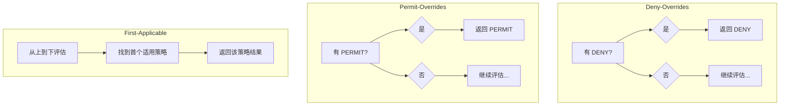
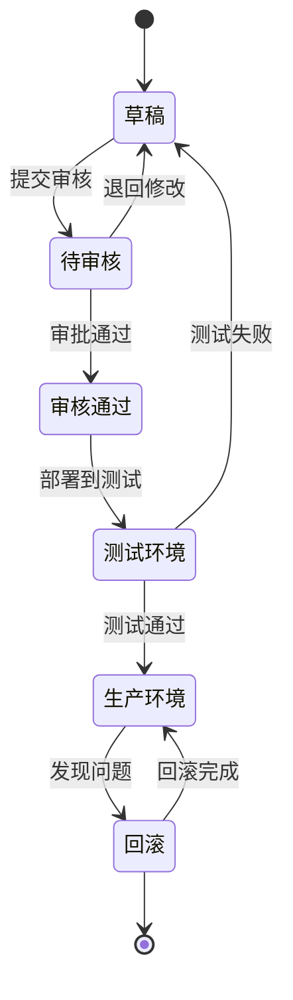

某云服务商的安全团队在季度审计时发现：过去三个月内，策略配置发生了 47 次变更，其中有 3 次变更导致了意外的服务中断。更糟糕的是，当他们试图回溯问题时，发现没有任何变更记录能够回答「这个策略最初为什么这样设计」。

策略设计不是一次性工作，它需要像代码一样被版本管理、测试、审查和监控。

## 一、策略的组成要素

### 1.1 基本结构

一个完整的 ABAC 策略包含四个核心部分：

| 组成部分 | 说明 | 示例 |
|---------|------|------|
| 目标（Target） | 策略作用于哪些资源 | `resource.classification == "confidential"` |
| 条件（Condition） | 触发策略的判断条件 | `subject.department == resource.owner` |
| 效果（Effect） | 条件满足时的结果 | `permit` 或 `deny` |
| 优先级（Priority） | 冲突时的裁决顺序 | `100` |

```json title="策略基本结构"
{
  "policy": {
    "id": "policy-001",
    "name": "机密文档访问控制",
    "description": "只有文档所有者或直属上级可以访问机密文档",
    
    "target": {
      "resource": {
        "classification": ["confidential", "secret"]
      }
    },
    
    "condition": {
      "any": [
        { "subject.id": { "eq": "${resource.owner.id}" } },
        { "subject.id": { "eq": "${resource.owner.supervisor.id}" } },
        { "subject.clearance_level": { "gte": 4 } }
      ]
    },
    
    "effect": "permit",
    "priority": 100
  }
}
```

### 1.2 条件表达式

条件是策略的核心，决定了何时触发策略。

```java title="条件表达式定义"
public class Condition {
    // 等于
    public static Condition eq(String field, Object value);
    
    // 不等于
    public static Condition neq(String field, Object value);
    
    // 大于/小于
    public static Condition gt(String field, Comparable value);
    public static Condition lt(String field, Comparable value);
    
    // 范围
    public static Condition in(String field, Collection values);
    public static Condition between(String field, Object min, Object max);
    
    // 模式匹配
    public static Condition matches(String field, String pattern);
    
    // 日期时间
    public static Condition during(String field, TimeRange range);
    
    // IP 地址
    public static Condition inCidr(String field, String cidr);
    
    // 组合条件
    public static Condition and(Condition... conditions);
    public static Condition or(Condition... conditions);
    public static Condition not(Condition condition);
}
```

### 1.3 效果类型

```java title="效果枚举定义"
public enum Effect {
    /**
     * 允许访问
     */
    PERMIT,
    
    /**
     * 拒绝访问
     */
    DENY,
    
    /**
     * 不适用该策略，继续评估其他策略
     */
    NOT_APPLICABLE,
    
    /**
     * 策略评估出错，返回错误
     */
    INDETERMINATE
}
```

## 二、策略语言设计

### 2.1 结构化策略 vs 自然语言策略

**结构化策略**：机器友好，易于解析和执行

```json title="结构化策略示例"
{
  "policy": "employee-document-access",
  "version": "1.0",
  "target": {
    "resource.type": "document"
  },
  "condition": {
    "and": [
      { "subject.department": { "eq": "${resource.owner.department}" } },
      { "action": { "in": ["read", "write"] } },
      { "environment.time": { "between": ["09:00", "18:00"] } }
    ]
  },
  "effect": "permit"
}
```

**自然语言策略**：人类友好，便于业务人员理解

```
当员工的部门与文档所属部门相匹配，
且访问时间是工作时间内，
且操作类型为阅读或编辑时，
允许访问。
```

### 2.2 策略 DSL 设计

```java title="策略 DSL 示例"
public class PolicyDsl {
    
    // 定义策略
    public static Policy employeeDocumentAccess() {
        return PolicyBuilder.create("employee-document-access")
            .description("员工访问同部门文档的策略")
            
            // 目标定义
            .target(resource -> resource
                .type("document")
            )
            
            // 条件定义
            .condition(
                Subject.department().eq(Resource.owner().department()),
                Action.in("read", "write"),
                Environment.time().between("09:00", "18:00")
            )
            
            .effect(Effect.PERMIT)
            .priority(100)
            .build();
    }
}
```

### 2.3 属性引用

策略中可以使用属性引用来表达动态值：

```json title="属性引用类型"
{
  "conditions": [
    // 直接值
    { "subject.level": { "gte": 3 } },
    
    // 静态引用
    { "subject.department": "engineering" },
    
    // 动态引用：引用资源的属性
    { "subject.department": { "eq": "${resource.owner.department}" } },
    
    // 动态引用：引用函数返回值
    { "environment.current_time": { "in_hours": "work_hours" } },
    
    // 动态引用：引用外部数据
    { "subject.ip_address": { "in_trusted_ranges": "${tenant.id}" } }
  ]
}
```

## 三、策略冲突处理

### 3.1 冲突类型

| 冲突类型 | 示例 | 处理策略 |
|---------|------|---------|
| 正向冲突 | 两条策略同时 PERMIT 和 DENY | 使用组合算法 |
| 优先级冲突 | 相同优先级的策略给出不同决策 | 显式优先级 |
| 覆盖冲突 | 宽泛策略与精细策略矛盾 | 精细优先 |

### 3.2 组合算法

当多条策略同时适用于一个请求时，需要组合算法来决定最终结果：



| 算法 | 说明 | 适用场景 |
|------|------|---------|
| `deny-overrides` | 任一策略 DENY，则 DENY | 高安全要求 |
| `permit-overrides` | 任一策略 PERMIT，则 PERMIT | 高可用要求 |
| `first-applicable` | 第一条适用的策略生效 | 确定性要求 |
| `only-one-applicable` | 只能有一条策略适用 | 互斥场景 |

```java title="组合算法实现"
public class PolicyCombiningAlg {
    
    /**
     * Deny-Overrides 算法
     * 优先级：DENY > NOT_APPLICABLE > PERMIT
     */
    public Effect denyOverrides(List<Policy> applicablePolicies) {
        for (Policy policy : applicablePolicies) {
            if (policy.evaluate() == Effect.DENY) {
                return Effect.DENY;
            }
        }
        
        // 检查是否有 PERMIT
        boolean hasPermit = applicablePolicies.stream()
            .anyMatch(p -> p.evaluate() == Effect.PERMIT);
        
        return hasPermit ? Effect.PERMIT : Effect.NOT_APPLICABLE;
    }
    
    /**
     * Permit-Overrides 算法
     * 优先级：PERMIT > NOT_APPLICABLE > DENY
     */
    public Effect permitOverrides(List<Policy> applicablePolicies) {
        for (Policy policy : applicablePolicies) {
            if (policy.evaluate() == Effect.PERMIT) {
                return Effect.PERMIT;
            }
        }
        
        // 检查是否有 DENY
        boolean hasDeny = applicablePolicies.stream()
            .anyMatch(p -> p.evaluate() == Effect.DENY);
        
        return hasDeny ? Effect.DENY : Effect.NOT_APPLICABLE;
    }
}
```

### 3.3 优先级机制

```java title="优先级策略配置"
public class PriorityConfig {
    
    /**
     * 优先级说明：
     * - 数值越小，优先级越高
     * - 相同优先级按组合算法处理
     */
    private static final Map<String, Integer> POLICY_PRIORITIES = Map.of(
        "security-critical", 1,      // 安全关键策略，最优先
        "compliance", 50,            // 合规相关策略
        "business-operational", 100, // 业务运营策略
        "default", 500                // 默认策略
    );
    
    public int getPriority(String policyId) {
        return POLICY_PRIORITIES.getOrDefault(policyId, 500);
    }
}
```

## 四、策略版本管理

### 4.1 版本控制策略

```sql title="策略版本表结构"
CREATE TABLE policy_versions (
    id BIGINT PRIMARY KEY AUTO_INCREMENT,
    policy_id VARCHAR(100) NOT NULL,
    version INT NOT NULL,
    content JSON NOT NULL,
    created_by VARCHAR(100) NOT NULL,
    created_at TIMESTAMP DEFAULT CURRENT_TIMESTAMP,
    change_reason VARCHAR(500),
    change_type ENUM('create', 'update', 'delete') NOT NULL,
    
    UNIQUE KEY uk_policy_version (policy_id, version)
);

CREATE TABLE policy_change_history (
    id BIGINT PRIMARY KEY AUTO_INCREMENT,
    policy_id VARCHAR(100) NOT NULL,
    old_version INT,
    new_version INT NOT NULL,
    changed_by VARCHAR(100) NOT NULL,
    changed_at TIMESTAMP DEFAULT CURRENT_TIMESTAMP,
    change_reason VARCHAR(500),
    affected_roles JSON,
    affected_users JSON
);
```

### 4.2 策略变更流程



### 4.3 回滚机制

```java title="策略回滚实现"
@Service
public class PolicyRollbackService {
    
    @Autowired
    private PolicyVersionRepository versionRepository;
    
    @Autowired
    private PolicyCacheManager cacheManager;
    
    /**
     * 回滚到指定版本
     */
    @Transactional
    public PolicyRollbackResult rollback(String policyId, int targetVersion) {
        // 1. 获取当前版本
        PolicyVersion current = versionRepository
            .findLatestByPolicyId(policyId);
        
        // 2. 获取目标版本
        PolicyVersion target = versionRepository
            .findByPolicyIdAndVersion(policyId, targetVersion);
        
        if (target == null) {
            return RollbackResult.failure("目标版本不存在");
        }
        
        // 3. 创建回滚记录
        PolicyVersion rollback = PolicyVersion.builder()
            .policyId(policyId)
            .version(current.getVersion() + 1)
            .content(target.getContent())
            .createdBy(getCurrentUser())
            .changeReason("Rollback to version " + targetVersion)
            .changeType(ChangeType.ROLLBACK)
            .build();
        
        versionRepository.save(rollback);
        
        // 4. 清除缓存
        cacheManager.evictPolicy(policyId);
        
        // 5. 通知相关方
        notificationService.notifyPolicyChange(policyId, 
            current.getVersion(), 
            rollback.getVersion());
        
        return RollbackResult.success(rollback);
    }
}
```

## 五、策略测试与验证

### 5.1 测试用例设计

```java title="策略测试框架"
@SpringBootTest
public class PolicyTest {
    
    @Autowired
    private PolicyEvaluator evaluator;
    
    @Test
    public void testEmployeeDocumentAccess() {
        // 场景 1：同部门员工在工作时间内访问
        AccessRequest request1 = AccessRequest.builder()
            .subject(Subject.builder()
                .id("user-001")
                .department("engineering")
                .build())
            .resource(Resource.builder()
                .id("doc-001")
                .type("document")
                .ownerDepartment("engineering")
                .build())
            .action(Action.READ)
            .environment(Environment.builder()
                .currentTime(LocalTime.of(10, 0))
                .build())
            .build();
        
        assertThat(evaluator.evaluate(request1)).isEqualTo(Decision.PERMIT);
        
        // 场景 2：跨部门员工访问
        AccessRequest request2 = AccessRequest.builder()
            .subject(Subject.builder()
                .id("user-002")
                .department("sales")
                .build())
            .resource(Resource.builder()
                .id("doc-001")
                .type("document")
                .ownerDepartment("engineering")
                .build())
            .action(Action.READ)
            .environment(Environment.builder()
                .currentTime(LocalTime.of(10, 0))
                .build())
            .build();
        
        assertThat(evaluator.evaluate(request2)).isEqualTo(Decision.DENY);
    }
}
```

### 5.2 策略覆盖率测试

```java title="覆盖率测试工具"
public class PolicyCoverageAnalyzer {
    
    /**
     * 分析策略的测试覆盖率
     */
    public CoverageReport analyzeCoverage(Set<String> testCaseIds) {
        Set<String> coveredPolicies = new HashSet<>();
        Set<String> uncoveredPolicies = new HashSet<>();
        
        for (Policy policy : allPolicies) {
            Set<TestCase> relevantTests = findRelevantTests(policy);
            
            if (relevantTests.isEmpty()) {
                uncoveredPolicies.add(policy.getId());
            } else {
                coveredPolicies.add(policy.getId());
            }
        }
        
        return CoverageReport.builder()
            .totalPolicies(allPolicies.size())
            .coveredPolicies(coveredPolicies.size())
            .coverageRate((double) coveredPolicies.size() / allPolicies.size())
            .uncoveredPolicies(uncoveredPolicies)
            .build();
    }
}
```

### 5.3 回归测试

```java title="策略回归测试")
@RunWith(Parameterized.class)
public class PolicyRegressionTest {
    
    @Parameters
    public static Collection<TestScenario> scenarios() {
        return Arrays.asList(
            // 高风险策略必须保持 PERMIT
            new TestScenario("security-admin-always-permit",
                buildRequest(role: "security-admin"),
                Decision.PERMIT),
            
            // 离职员工必须 DENY
            new TestScenario("inactive-user-always-deny",
                buildRequest(status: "inactive"),
                Decision.DENY),
            
            // 恶意 IP 必须 DENY
            new TestScenario("blocked-ip-always-deny",
                buildRequest(ip: "192.168.1.100"), // 已知的攻击 IP
                Decision.DENY)
        );
    }
}
```

## 六、策略监控与告警

### 6.1 策略执行监控

```java title="策略执行监控")
@Service
public class PolicyMonitoringService {
    
    private final MeterRegistry meterRegistry;
    
    public void recordEvaluation(PolicyEvaluation evaluation) {
        // 记录决策结果
        meterRegistry.counter("policy.decisions",
            "policy_id", evaluation.getPolicyId(),
            "decision", evaluation.getDecision().name())
            .increment();
        
        // 记录评估耗时
        meterRegistry.timer("policy.evaluation.duration",
            "policy_id", evaluation.getPolicyId())
            .record(evaluation.getDuration());
        
        // 记录异常
        if (evaluation.getError() != null) {
            meterRegistry.counter("policy.errors",
                "policy_id", evaluation.getPolicyId(),
                "error_type", evaluation.getError().getClass().getSimpleName())
                .increment();
        }
    }
}
```

### 6.2 异常检测

```java title="异常行为检测")
@Service
public class AnomalyDetectionService {
    
    /**
     * 检测异常的授权尝试模式
     */
    public List<AnomalyAlert> detectAnomalies(
            List<AccessRequest> requests) {
        
        List<AnomalyAlert> alerts = new ArrayList<>();
        
        // 1. 检测暴力破解模式
        alerts.addAll(detectBruteForceAttempts(requests));
        
        // 2. 检测权限滥用模式
        alerts.addAll(detectPrivilegeEscalation(requests));
        
        // 3. 检测异常时间访问
        alerts.addAll(detectUnusualTimeAccess(requests));
        
        // 4. 检测横向移动
        alerts.addAll(detectLateralMovement(requests));
        
        return alerts;
    }
    
    private List<AnomalyAlert> detectBruteForceAttempts(
            List<AccessRequest> requests) {
        
        // 按用户分组，统计失败次数
        Map<String, Long> failureCount = requests.stream()
            .filter(r -> r.getDecision() == Decision.DENY)
            .collect(Collectors.groupingBy(
                r -> r.getSubject().getId(),
                Collectors.counting()));
        
        return failureCount.entrySet().stream()
            .filter(e -> e.getValue() > 10) // 超过 10 次失败
            .map(e -> AnomalyAlert.builder()
                .type(AnomalyType.BRUTE_FORCE)
                .userId(e.getKey())
                .metric("failure_count")
                .value(e.getValue())
                .threshold(10)
                .build())
            .collect(Collectors.toList());
    }
}
```

### 6.3 策略有效性报告

```java title="策略有效性报告")
@Service
public class PolicyEffectivenessReporter {
    
    /**
     * 生成策略有效性报告
     */
    public PolicyEffectivenessReport generateReport(
            Instant startTime, Instant endTime) {
        
        List<PolicyMetrics> metrics = calculateMetrics(startTime, endTime);
        
        return PolicyEffectivenessReport.builder()
            .period(startTime, endTime)
            .totalDecisions(getTotalDecisions())
            .permitRate(calculatePermitRate())
            .denyRate(calculateDenyRate())
            .policyMetrics(metrics)
            .anomalies(getRecentAnomalies())
            .recommendations(generateRecommendations(metrics))
            .build();
    }
}
```

:::tip 核心原则
策略即代码：策略应该像代码一样被管理——版本控制、代码审查、自动化测试、CI/CD 部署。这是确保策略质量的唯一途径。
:::

## 思考题

**问题 1**：在策略管理中，「策略爆炸」是一个常见问题。当策略数量增长到数千条时，如何保证策略的可维护性和可理解性？

<details>
<summary>参考答案</summary>

解决策略爆炸的方案：

1. **策略分层**
   - 全局策略：适用于所有资源的通用规则
   - 领域策略：特定业务领域的规则
   - 资源策略：特定资源的特殊规则
   - 按优先级排序，高层策略优先

2. **策略模板化**
   - 提取通用模式为模板
   - 通过参数实例化，减少重复
   - 例如：`department_data_access` 模板

3. **策略分类与标签**
   - 按业务域分类：`payment`, `hr`, `security`
   - 按风险等级标签：`critical`, `high`, `medium`
   - 按变更频率标签：`stable`, `frequently-changing`

4. **策略文档化**
   - 每个策略必须有描述
   - 维护策略与业务规则的映射
   - 使用可视化工具展示策略关系

5. **策略分析工具**
   - 冲突检测
   - 冗余检测
   - 影响分析
   - 可视化编辑
</details>

**问题 2**：策略变更的灰度发布是一个重要话题。如何设计一个机制，在不影响生产服务的前提下验证新策略的正确性？

<details>
<summary>参考答案</summary>

策略灰度发布的工程设计：

**架构设计**：

```
┌────────────────────────────────────────────┐
│            请求路由层                       │
│  ┌─────────────────────────────────────┐   │
│  │  根据用户分桶，决定使用哪套策略        │   │
│  └─────────────────────────────────────┘   │
└────────────────────────────────────────────┘
                    │
        ┌───────────┴───────────┐
        ▼                       ▼
┌───────────────┐       ┌───────────────┐
│   旧策略集     │       │   新策略集     │
│  (90% 流量)    │       │  (10% 流量)    │
└───────────────┘       └───────────────┘
        │                       │
        └───────────┬───────────┘
                    ▼
            ┌───────────────┐
            │  结果对比引擎   │
            └───────────────┘
                    │
                    ▼
            ┌───────────────┐
            │  告警通知     │
            └───────────────┘
```

**关键机制**：

1. **流量分桶**：按用户 ID 哈希决定分组
2. **影子模式**：新策略并行执行但不生效
3. **结果对比**：新旧策略结果不一致时告警
4. **指标监控**：对比期间监控关键指标
5. **自动回滚**：指标异常时自动切换到旧策略
6. **渐进放量**：10% -> 30% -> 50% -> 100%
</details>
