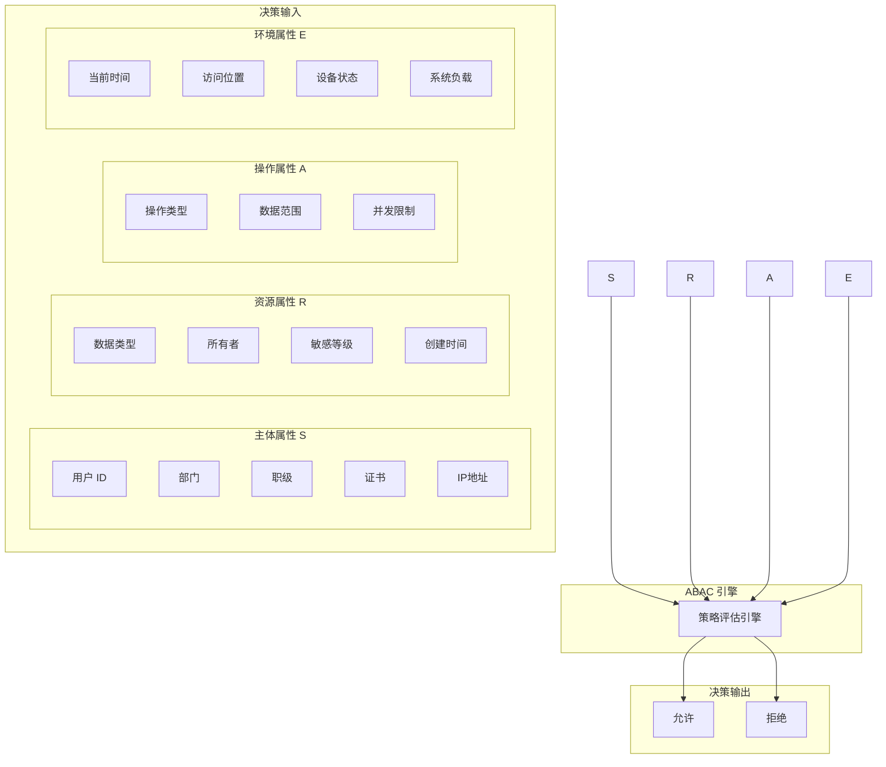
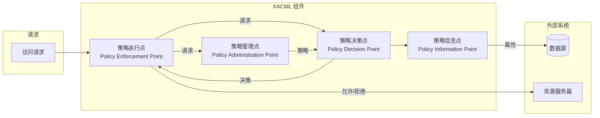
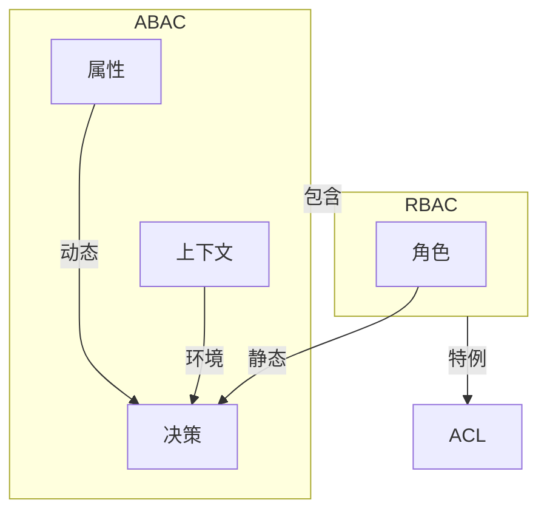
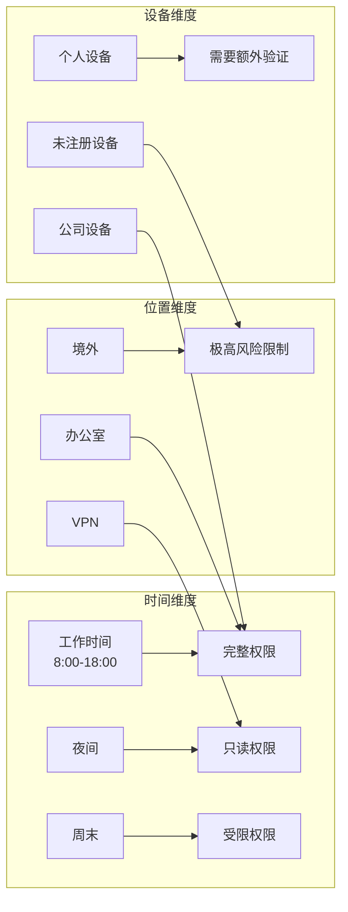

周一的早晨，某电商公司的安全团队收到了一条告警：一名员工的账号在凌晨 3 点从境外 IP 地址登录，并尝试访问大量客户订单数据。传统的 RBAC 系统可能只会检查「这个用户是不是客服角色」，但这位员工确实是客服——问题是，谁会在凌晨 3 点从境外访问客户数据？

RBAC 的局限在于，它是静态的：角色在入职时分配，之后很少变化。而真实的业务场景需要考虑「什么时候」「从哪里」「用什么设备」等多种动态因素。ABAC（基于属性的访问控制）正是为了解决这些问题而生的。

## 一、ABAC 的核心思想

ABAC 的核心决策逻辑可以用一句话概括：**通过评估主体、资源、操作、环境的属性，决定是否允许访问**。



## 二、属性类型详解

### 2.1 主体属性（Subject Attributes）

描述请求访问的主体特征：

| 属性类型 | 示例 | 说明 |
|---------|------|------|
| 身份属性 | `user_id`, `username` | 用户唯一标识 |
| 组织属性 | `department`, `team` | 所属组织单元 |
| 职能属性 | `job_title`, `role` | 职位和职能 |
| 资质属性 | `clearance_level`, `certifications` | 安全许可和证书 |
| 上下文属性 | `ip_address`, `device_id` | 当前访问上下文 |
| 时序属性 | `last_login`, `account_age` | 时间相关的属性 |

```java title="主体属性定义"
public class SubjectAttributes {
    private String userId;
    private String username;
    private String department;
    private String team;
    private String jobTitle;
    private int clearanceLevel;
    private Set<String> certifications;
    private String ipAddress;
    private String deviceId;
    private boolean deviceCompliant;
    private Instant lastLoginTime;
    private Duration accountAge;
}
```

### 2.2 资源属性（Resource Attributes）

描述被访问对象的特征：

| 属性类型 | 示例 | 说明 |
|---------|------|------|
| 标识属性 | `resource_id`, `resource_type` | 资源唯一标识 |
| 分类属性 | `owner`, `department` | 资源归属 |
| 敏感属性 | `classification`, `sensitivity` | 敏感等级 |
| 内容属性 | `has_pii`, `has_phi` | 内容特征 |
| 元数据 | `created_at`, `modified_at` | 创建和修改时间 |
| 关系属性 | `parent_id`, `workspace_id` | 与其他资源的关系 |

```java title="资源属性定义"
public class ResourceAttributes {
    private String resourceId;
    private String resourceType;
    private String namespace;
    private String owner;
    private String ownerDepartment;
    private String classification;  // public, internal, confidential, secret
    private boolean containsPII;
    private boolean containsPHI;
    private Instant createdAt;
    private Instant modifiedAt;
    private String workspaceId;
    private Map<String, String> tags;
}
```

### 2.3 操作属性（Action Attributes）

描述访问请求的操作类型：

| 属性类型 | 示例 | 说明 |
|---------|------|------|
| 操作类型 | `read`, `write`, `delete` | 基本操作 |
| 操作范围 | `scope`, `batch_size` | 操作范围 |
| 并发控制 | `max_concurrent` | 最大并发数 |
| 时间限制 | `max_duration` | 最大执行时长 |
| 数据限制 | `max_records` | 最多记录数 |

```java title="操作属性定义"
public class ActionAttributes {
    private String actionType;  // READ, WRITE, DELETE, ADMIN, ...
    private String subAction;    // 细分子操作
    private Integer scope;       // 操作范围
    private Integer batchSize;   // 批量大小
    private Duration maxDuration;
    private Integer maxRecords;
}
```

### 2.4 环境属性（Environment Attributes）

描述访问发生的上下文环境：

| 属性类型 | 示例 | 说明 |
|---------|------|------|
| 时间属性 | `current_time`, `day_of_week` | 访问时间 |
| 位置属性 | `location`, `country` | 物理或网络位置 |
| 设备属性 | `device_type`, `os_version` | 设备信息 |
| 系统属性 | `system_load`, `threat_level` | 系统状态 |
| 网络属性 | `network_type`, `vpn_enabled` | 网络环境 |

```java title="环境属性定义"
public class EnvironmentAttributes {
    private Instant currentTime;
    private DayOfWeek dayOfWeek;
    private String location;      // office, remote, vpn, unknown
    private String country;
    private String city;
    private String deviceType;
    private boolean deviceCompliant;
    private boolean mfaUsed;
    private double systemLoad;
    private String threatLevel;
    private boolean vpnEnabled;
}
```

## 三、ABAC 策略模型

### 3.1 XACML 参考架构

XACML（eXtensible Access Control Markup Language）是 ABAC 的标准化描述语言，定义了以下核心组件：



| 组件 | 职责 |
|------|------|
| PAP | 管理策略的创建、存储、版本控制 |
| PDP | 根据策略评估属性，做出决策 |
| PEP | 拦截请求，执行决策（允许或拒绝） |
| PIP | 从外部系统获取属性（用户目录、数据库等） |

### 3.2 策略结构

一个完整的 ABAC 策略包含以下部分：

```json title="ABAC 策略结构示例"
{
  "policy": {
    "id": "confidential-document-access",
    "description": "机密文档访问控制策略",
    "target": {
      "resource": {
        "classification": ["confidential", "secret"]
      }
    },
    "condition": {
      "any": [
        {
          "subject": { "department": "security" },
          "environment": { "mfa_used": true }
        },
        {
          "subject": { "role": "auditor" },
          "action": { "type": "read" }
        },
        {
          "subject": { "clearance_level": { "gte": 4 } },
          "resource": { "owner_department": "${subject.department}" }
        }
      ]
    },
    "effect": "permit"
  }
}
```

## 四、ABAC 与 RBAC 的关系

ABAC 并不是要替代 RBAC，而是 RBAC 的超集。RBAC 可以看作 ABAC 的一个特例：

| 对比维度 | RBAC | ABAC |
|---------|------|------|
| 决策依据 | 角色 | 属性 |
| 灵活性 | 静态 | 动态 |
| 粒度 | 粗粒度 | 细粒度 |
| 上下文感知 | 不支持 | 支持 |
| 表达能力 | 有限 | 强大 |
| 性能 | 高 | 较低 |
| 管理复杂度 | 低 | 高 |



**关键洞察**：RBAC 可以用 ABAC 表达，但反过来不一定成立。

```json title="用 ABAC 实现 RBAC 等效"
{
  "policy": {
    "id": "equivalent-rbac-policy",
    "condition": {
      "all": [
        { "subject": { "role": "DEVELOPER" } }
      ]
    },
    "effect": "permit"
  }
}
```

## 五、ABAC 的优点

### 5.1 细粒度控制

```java title="细粒度访问控制示例"
// RBAC：只能是粗粒度的
@PreAuthorize("hasRole('DEVELOPER')")
public void deploy(String environment) {
    // 无法区分部署到测试环境还是生产环境
}

// ABAC：可以实现细粒度控制
public boolean canDeploy(User user, Environment target) {
    // 条件 1：角色检查
    if (!user.hasRole("DEVELOPER") && !user.hasRole("DEVOPS")) {
        return false;
    }
    
    // 条件 2：职级要求（只有高级工程师以上才能部署生产）
    if (target.isProduction() && user.getLevel() < 5) {
        return false;
    }
    
    // 条件 3：MFA 必须开启
    if (!user.isMfaEnabled()) {
        return false;
    }
    
    // 条件 4：设备必须合规
    if (!user.getDevice().isCompliant()) {
        return false;
    }
    
    // 条件 5：不能在维护窗口外部署生产
    if (target.isProduction() && !target.isWithinMaintenanceWindow()) {
        return false;
    }
    
    return true;
}
```

### 5.2 动态上下文感知



### 5.3 自然语言映射

ABAC 策略可以更自然地表达业务规则：

| 业务规则 | ABAC 表达 |
|---------|----------|
| 只有财务部门的人可以查看财务数据 | `subject.department == resource.owner AND action == read` |
| 直属上级可以查看下属的绩效数据 | `subject.id == resource.employee.supervisorId` |
| 机密文件只能在工作时间从办公室访问 | `resource.classification == confidential AND environment.time in workHours AND environment.location == office` |

## 六、ABAC 的挑战

### 6.1 策略复杂性

随着属性和条件增多，策略可能变得非常复杂：

```java title="策略复杂性示例"
public boolean complexDecision(AccessRequest request) {
    // 现实中的策略可能包含数十个条件
    if (request.getSubject().getClearanceLevel() >= 4) {
        if (request.getResource().getClassification() != "top_secret") {
            return true;
        }
    }
    
    if (request.getSubject().isContractor()) {
        if (request.getResource().getHasPII()) {
            if (!request.getEnvironment().isInOffice()) {
                return false;
            }
        }
    }
    
    // ... 更多条件
    
    return false;
}
```

**解决方案**：
- 策略模块化
- 使用策略组合算法
- 可视化策略编辑工具
- 策略测试框架

### 6.2 性能开销

ABAC 需要获取多个属性、评估多个策略，比 RBAC 的查表操作慢得多：

| 优化策略 | 说明 |
|---------|------|
| 属性缓存 | 缓存主体属性，避免重复查询 |
| 策略索引 | 按目标属性建立索引，快速过滤 |
| 决策缓存 | 缓存相同请求的决策结果 |
| 异步评估 | 非关键路径异步执行 |
| 预计算 | 预计算常用权限组合 |

### 6.3 策略管理

ABAC 的灵活性带来管理挑战：

| 挑战 | 影响 |
|------|------|
| 策略数量 | 可能包含数千条策略 |
| 冲突解决 | 多条策略可能冲突 |
| 变更影响 | 修改一条策略可能影响广泛 |
| 审计追踪 | 理解决策逻辑需要更多上下文 |

## 七、典型应用场景

### 7.1 医疗健康系统

```json title="医疗数据访问策略"
{
  "policy": "patient-record-access",
  "conditions": [
    { "subject": { "role": "attending_physician" } },
    { "subject": { "department": "${resource.department}" } },
    { "resource": { "patient_id": "${subject.assigned_patients}" } },
    { "environment": { "purpose": "treatment" } }
  ],
  "effect": "permit"
}
```

### 7.2 金融交易系统

```json title="交易限额策略"
{
  "policy": "transaction-limit",
  "conditions": {
    "max_daily_amount": "${subject.account.tier * 100000}",
    "max_single_transaction": "${subject.account.tier * 50000}",
    "allowed_hours": [9, 10, 11, 12, 13, 14, 15, 16, 17]
  }
}
```

### 7.3 零信任架构

```json title="零信任持续验证策略"
{
  "policy": "zero-trust-continuous-verification",
  "conditions": {
    "subject.trust_score": { "gte": 80 },
    "device.compliance": true,
    "environment.risk_score": { "lte": 30 },
    "action.frequency": { "lte": 100 }
  },
  "effect": "permit"
}
```

:::tip 核心洞察
ABAC 的本质是「用属性表达业务规则」。当业务规则变得复杂、动态、多维度时，ABAC 的优势就显现出来；但对于简单、静态的权限需求，RBAC 仍然是更务实的选择。
:::

## 思考题

**问题 1**：在实现 ABAC 时，如何平衡策略的灵活性和可维护性？有哪些具体的工程实践可以防止策略变得混乱？

<details>
<summary>参考答案</summary>

平衡策略灵活性和可维护性的工程实践：

1. **分层策略架构**
   - 基础层：全局通用策略（如默认拒绝）
   - 业务层：按业务域划分的策略
   - 细粒度层：特定资源的特殊规则

2. **策略模板化**
   - 将通用模式提取为模板
   - 通过参数实例化策略
   - 例如：基于部门的数据访问策略模板

3. **命名和分类规范**
   - 策略命名：`{业务}_{资源}_{操作}_{版本}`
   - 标签分类：按部门、风险等级、资源类型分类

4. **版本控制和变更追踪**
   - 所有策略变更通过代码审查
   - 保留历史版本，支持回滚

5. **自动化测试**
   - 单元测试：策略逻辑正确性
   - 集成测试：策略组合正确性
   - 回归测试：策略变更影响分析

6. **可视化工具**
   - 策略编辑器
   - 影响分析图
   - 冲突检测警告
</details>

**问题 2**：假设你需要为一个多租户 SaaS 平台实现 ABAC，每个租户都有自己独立的权限规则设计。你会如何设计系统架构来支持多租户的隔离与定制？

<details>
<summary>参考答案</summary>

多租户 ABAC 架构设计：

**架构分层**：
```
┌─────────────────────────────────────┐
│           平台级 ABAC               │ ← 平台安全策略
├─────────────────────────────────────┤
│           租户级 ABAC               │ ← 租户自定义策略
├─────────────────────────────────────┤
│           应用级策略                 │ ← 具体应用策略
└─────────────────────────────────────┘
```

**关键设计**：

1. **策略隔离**
   - 每个租户独立的策略存储空间
   - 租户 ID 作为策略的第一过滤条件
   - 数据库级别的租户隔离

2. **策略继承与覆盖**
   - 租户可以继承平台级策略
   - 租户可以覆盖（更严格或特定场景）
   - 不允许租户削弱平台级安全策略

3. **多租户上下文注入**
   - 每个请求自动注入 `tenant_id`
   - 策略自动添加租户过滤条件
   - 防止跨租户数据泄露

4. **策略模板市场**
   - 提供预设的策略模板
   - 租户可选择启用
   - 降低租户配置难度
</details>
