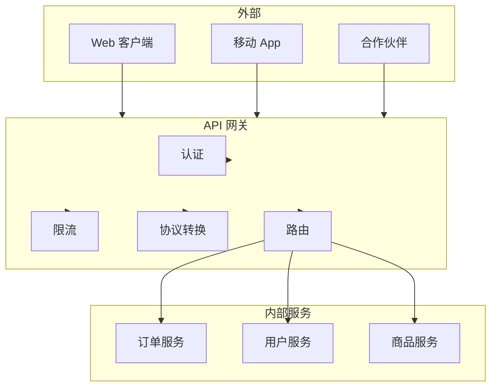
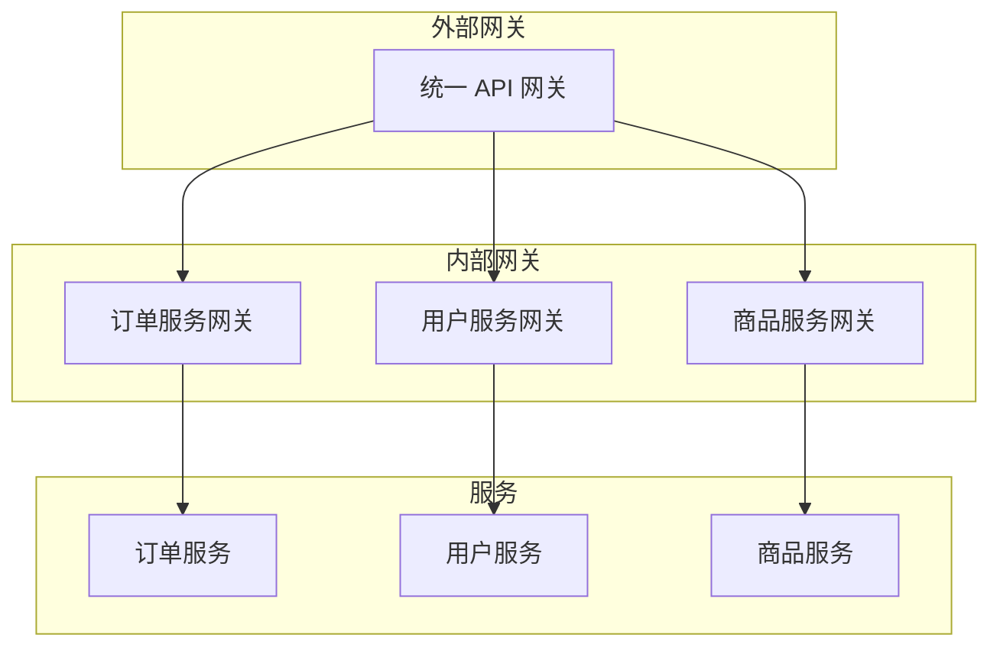

凌晨两点，API 监控显示某内部接口的调用量突然增长了 100 倍。排查后发现，是某服务被恶意利用，攻击者通过这个内部接口探测到了其他服务的数据库连接信息，最终导致了数据泄露。

这个场景揭示了一个关键问题：**内部服务之间的 API 调用，往往比外部 API 更缺乏保护**。外部 API 有防火墙、WAF、API 网关层层把关，而内部 API 通常被默认是「可信」的。但事实上，内部服务被攻破后，造成的损失往往更大。

API 网关，正是解决这个问题的主力防线。

## 一、API 网关在权限控制中的角色

API 网关是所有流量的单一入口，承担着「门卫」的角色：



### 网关的核心职责

| 职责 | 说明 | 对安全的影响 |
| --- | --- | --- |
| **身份认证** | 验证请求来源，颁发/验证 Token | 确定「是谁」 |
| **权限授权** | 检查是否有权访问特定资源 | 确定「能做什么」 |
| **流量控制** | 限制请求速率，防止滥用 | 防止 DoS |
| **协议转换** | HTTP/gRPC/WebSocket 互转 | 统一安全策略 |
| **日志审计** | 记录所有请求 | 事后溯源 |
| **协议安全** | TLS 终止、请求签名 | 传输安全 |

## 二、网关层的认证

### JWT 验证

JWT（JSON Web Token）是现代 API 认证的主流方案。网关需要在请求转发前验证 JWT 的有效性：

```java title="JWT 验证过滤器"
@Component
public class JwtAuthenticationFilter extends OncePerRequestFilter {
    
    private final JwtTokenProvider tokenProvider;
    private final UserDetailsService userDetailsService;
    
    @Override
    protected void doFilterInternal(HttpServletRequest request,
                                    HttpServletResponse response,
                                    FilterChain chain) throws ServletException, IOException {
        
        String token = extractToken(request);
        
        if (StringUtils.hasText(token)) {
            try {
                // 验证 Token
                Claims claims = tokenProvider.validateToken(token);
                
                // 提取用户信息
                String username = claims.getSubject();
                UserDetails user = userDetailsService.loadUserByUsername(username);
                
                // 构建认证上下文
                UsernamePasswordAuthenticationToken authentication =
                    new UsernamePasswordAuthenticationToken(
                        user, 
                        null, 
                        user.getAuthorities()
                    );
                authentication.setDetails(
                    new WebAuthenticationDetailsSource().buildDetails(request)
                );
                
                // 设置到 Security Context
                SecurityContextHolder.getContext().setAuthentication(authentication);
                
            } catch (JwtException e) {
                // Token 无效，返回 401
                response.setStatus(HttpServletResponse.SC_UNAUTHORIZED);
                response.setContentType("application/json");
                response.getWriter().write("{\"error\":\"invalid_token\"}");
                return;
            }
        }
        
        chain.doFilter(request, response);
    }
    
    private String extractToken(HttpServletRequest request) {
        String bearerToken = request.getHeader("Authorization");
        if (StringUtils.hasText(bearerToken) && bearerToken.startsWith("Bearer ")) {
            return bearerToken.substring(7);
        }
        return null;
    }
}
```

### OAuth2 Token 验证

对于使用 OAuth2 的系统，网关需要验证 Access Token 或从 Authorization Server 验证 Token：

```java title="OAuth2 Token 验证"
@Service
public class OAuth2TokenValidator {
    
    private final ReactiveOAuth2AuthorizationServerConfiguration
        .AuthorizationServerJwtClaimSets authorizationServerJwtClaimSets;
    
    /**
     * 验证 Access Token
     */
    public Mono<Authorization> validateToken(String accessToken) {
        // 1. 检查 Token 格式
        if (!isJwtFormat(accessToken)) {
            // 可能是 opaque token，需要向授权服务器验证
            return validateWithAuthorizationServer(accessToken);
        }
        
        // 2. 本地验证 JWT
        try {
            Claims claims = verifyJwtSignature(accessToken);
            return Mono.just(buildAuthorization(claims));
        } catch (Exception e) {
            return Mono.error(new InvalidTokenException("JWT verification failed", e));
        }
    }
    
    /**
     * 向授权服务器验证 Token
     */
    private Mono<Authorization> validateWithAuthorizationServer(String token) {
        return webClient.post()
            .uri(authorizationServerIntrospectionUrl)
            .bodyValue("token=" + token)
            .retrieve()
            .bodyToMono(IntrospectionResponse.class)
            .filter(IntrospectionResponse::isActive)
            .map(this::buildAuthorizationFromIntrospection)
            .switchIfEmpty(Mono.error(new InvalidTokenException("Token is not active")));
    }
}
```

### 多认证机制共存

实际系统中可能同时存在多种认证机制，网关需要按优先级依次尝试：

```java title="多认证策略"
@Component
public class AuthenticationStrategy {
    
    private final List<AuthenticationMechanism> mechanisms;
    
    public AuthenticationStrategy(
            JwtAuthenticationMechanism jwt,
            ApiKeyAuthenticationMechanism apiKey,
            BasicAuthMechanism basicAuth) {
        this.mechanisms = List.of(jwt, apiKey, basicAuth);
    }
    
    /**
     * 按优先级尝试认证
     * JWT > API Key > Basic Auth
     */
    public Optional<Authentication> authenticate(HttpRequest request) {
        for (AuthenticationMechanism mechanism : mechanisms) {
            Optional<Authentication> result = mechanism.tryAuthenticate(request);
            if (result.isPresent()) {
                return result;
            }
        }
        return Optional.empty();
    }
}
```

## 三、网关层的授权

### 基于路径的授权

最简单的授权方式是按 API 路径匹配：

```java title="路径授权配置"
@Configuration
public class PathAuthorizationConfig {
    
    @Bean
    public SecurityWebFilterChain securityWebFilterChain(
            ServerHttpSecurity http,
            AuthorizationManager<ServerWebExchange> authorizationManager) {
        
        return http
            .authorizeExchange(exchanges -> exchanges
                // 公开路径
                .pathMatchers("/api/v1/public/**").permitAll()
                .pathMatchers("/api/v1/auth/**").permitAll()
                .pathMatchers("/health").permitAll()
                
                // 需要认证的路径
                .pathMatchers("/api/v1/admin/**").access(
                    authorizationManager.requireRole("ADMIN")
                )
                .pathMatchers("/api/v1/user/**").access(
                    authorizationManager.requireAuthenticated()
                )
                
                // 基于资源的动态授权
                .pathMatchers(HttpMethod.GET, "/api/v1/orders/**").access(
                    authorizationManager.requirePermission("ORDER", "READ")
                )
                .pathMatchers(HttpMethod.DELETE, "/api/v1/orders/**").access(
                    authorizationManager.requirePermission("ORDER", "DELETE")
                )
                
                // 默认拒绝
                .anyExchange().deny()
            )
            .build();
    }
}
```

### 基于上下文的动态授权

更复杂的场景需要根据请求上下文（用户属性、参数值、时间等）动态决定授权：

```java title="动态授权决策器"
@Service
public class DynamicAuthorizationDecisionMaker {
    
    private final PermissionService permissionService;
    private final RiskAssessmentService riskService;
    
    /**
     * 根据上下文做出授权决策
     */
    public AuthorizationDecision decide(ServerWebExchange exchange) {
        Authentication authentication = exchange.getAttribute(
            "org.springframework.security.web.server.webfilter.WebFilterSecurityWebFilterAttribute"
        );
        
        String resource = extractResource(exchange);
        String action = extractAction(exchange);
        
        // 1. 检查基础权限
        if (!permissionService.hasPermission(authentication.getName(), resource, action)) {
            return AuthorizationDecision.deny("PERMISSION_DENIED");
        }
        
        // 2. 检查风险评估
        RiskLevel risk = riskService.assess(authentication.getName(), resource, action);
        if (risk == RiskLevel.HIGH) {
            // 高风险操作需要额外验证
            return AuthorizationDecision.requireMFA();
        }
        
        // 3. 检查时间窗口（如工作时间内才能操作）
        if (isSensitiveResource(resource) && !isInAllowedTimeWindow()) {
            return AuthorizationDecision.deny("OUTSIDE_ALLOWED_TIME");
        }
        
        return AuthorizationDecision.allow();
    }
    
    private boolean isSensitiveResource(String resource) {
        return resource.startsWith("/api/v1/admin/") 
            || resource.startsWith("/api/v1/export/");
    }
}
```

## 四、限流与配额管理

限流是防止 API 被滥用的核心手段。不同维度的限流适用于不同场景：

### 限流维度

| 维度 | 说明 | 示例 |
| --- | --- | --- |
| IP | 单一 IP 的请求速率 | 每 IP 每秒 100 次 |
| 用户 | 单一用户的请求速率 | 每用户每分钟 1000 次 |
| API Key | 单一 API Key 的配额 | 每天 10 万次 |
| 端点 | 单一接口的速率限制 | 每接口每秒 1000 次 |

### 令牌桶算法实现

```java title="令牌桶限流器"
@Service
public class TokenBucketRateLimiter {
    
    private final RedisTemplate<String, Object> redisTemplate;
    
    /**
     * 尝试获取令牌
     * @param key 限流维度标识
     * @param rate 每秒生成的令牌数
     * @param capacity 桶容量
     * @return 是否允许请求
     */
    public boolean tryAcquire(String key, double rate, int capacity) {
        String bucketKey = "rate_limit:" + key;
        
        // Lua 脚本保证原子性
        String script = """
            local tokens = tonumber(redis.call('GET', KEYS[1]) or ARGV[1])
            local now = tonumber(ARGV[2])
            local last = tonumber(redis.call('GET', KEYS[1] .. ':last') or now)
            local rate = tonumber(ARGV[3])
            local capacity = tonumber(ARGV[4])
            
            -- 计算应该生成的令牌数
            local elapsed = now - last
            local generated = elapsed * rate
            tokens = math.min(capacity, tokens + generated)
            
            -- 尝试消费令牌
            if tokens >= 1 then
                tokens = tokens - 1
                redis.call('SET', KEYS[1], tokens)
                redis.call('SET', KEYS[1] .. ':last', now)
                return 1
            else
                return 0
            end
            """;
        
        Long result = redisTemplate.execute(
            new DefaultRedisScript<>(script, Long.class),
            List.of(bucketKey),
            String.valueOf(capacity),
            String.valueOf(System.currentTimeMillis() / 1000),
            String.valueOf(rate),
            String.valueOf(capacity)
        );
        
        return result != null && result == 1;
    }
    
    /**
     * 封装限流结果
     */
    public RateLimitResult checkRateLimit(Authentication auth, String endpoint) {
        String key = auth.getName() + ":" + endpoint;
        
        if (tryAcquire(key, 100, 1000)) {
            return RateLimitResult.allowed();
        } else {
            // 返回剩余配额信息
            return RateLimitResult.rejected("Rate limit exceeded");
        }
    }
}
```

### 配额管理

```java title="配额管理服务"
@Service
public class QuotaManagementService {
    
    private final RedisTemplate<String, Object> redisTemplate;
    
    /**
     * 检查并消耗配额
     * @return 配额结果，包含剩余配额、是否允许、剩余时间
     */
    public QuotaResult consumeQuota(String apiKey, String endpoint, int cost) {
        String dailyKey = "quota:daily:" + apiKey + ":" + endpoint;
        String monthlyKey = "quota:monthly:" + apiKey + ":" + endpoint;
        
        QuotaConfig config = getQuotaConfig(apiKey);
        
        // 检查日配额
        Long dailyUsed = redisTemplate.opsForValue().increment(dailyKey);
        if (dailyUsed == 1) {
            redisTemplate.expire(dailyKey, getSecondsUntilEndOfDay(), TimeUnit.SECONDS);
        }
        
        if (dailyUsed != null && dailyUsed > config.getDailyLimit()) {
            return QuotaResult.rejected(
                "Daily quota exceeded", 
                0, 
                getSecondsUntilEndOfDay()
            );
        }
        
        // 检查月配额
        Long monthlyUsed = redisTemplate.opsForValue().increment(monthlyKey);
        if (monthlyUsed == 1) {
            redisTemplate.expire(monthlyKey, getSecondsUntilEndOfMonth(), TimeUnit.SECONDS);
        }
        
        if (monthlyUsed != null && monthlyUsed > config.getMonthlyLimit()) {
            // 回滚日配额
            redisTemplate.opsForValue().decrement(dailyKey);
            return QuotaResult.rejected(
                "Monthly quota exceeded",
                0,
                getSecondsUntilEndOfMonth()
            );
        }
        
        return QuotaResult.allowed(
            config.getDailyLimit() - dailyUsed,
            config.getMonthlyLimit() - monthlyUsed
        );
    }
}
```

## 五、请求签名验证

对于高安全要求的 API，需要验证请求签名的合法性：

### HMAC 签名方案

```java title="请求签名验证"
@Service
public class RequestSignatureValidator {
    
    private static final String SIGNATURE_HEADER = "X-Signature";
    private static final String TIMESTAMP_HEADER = "X-Timestamp";
    private static final long MAX_TIMESTAMP_DRIFT_SECONDS = 300;  // 5分钟
    
    private final Map<String, String> apiSecrets;  // apiKey -> secret
    
    /**
     * 验证请求签名
     * 签名 = HMAC-SHA256(secret, method + path + timestamp + body)
     */
    public boolean validateSignature(HttpRequest request, String apiKey) {
        String signature = request.getHeader(SIGNATURE_HEADER);
        String timestamp = request.getHeader(TIMESTAMP_HEADER);
        
        if (signature == null || timestamp == null) {
            return false;
        }
        
        // 1. 验证时间戳（防止重放攻击）
        if (!validateTimestamp(timestamp)) {
            return false;
        }
        
        // 2. 获取密钥
        String secret = apiSecrets.get(apiKey);
        if (secret == null) {
            return false;
        }
        
        // 3. 计算期望签名
        String expectedSignature = calculateSignature(
            secret,
            request.getMethod(),
            request.getPath(),
            timestamp,
            request.getBody()
        );
        
        // 4. 比对签名（使用恒定时间比较防止时序攻击）
        return MessageDigest.isEqual(
            signature.getBytes(StandardCharsets.UTF_8),
            expectedSignature.getBytes(StandardCharsets.UTF_8)
        );
    }
    
    private boolean validateTimestamp(String timestamp) {
        long requestTime = Long.parseLong(timestamp);
        long currentTime = System.currentTimeMillis() / 1000;
        return Math.abs(currentTime - requestTime) <= MAX_TIMESTAMP_DRIFT_SECONDS;
    }
    
    private String calculateSignature(String secret, String method, 
                                       String path, String timestamp, String body) {
        String data = method + path + timestamp + (body != null ? body : "");
        
        Mac mac = Mac.getInstance("HmacSHA256");
        SecretKeySpec keySpec = new SecretKeySpec(
            secret.getBytes(StandardCharsets.UTF_8), 
            "HmacSHA256"
        );
        mac.init(keySpec);
        
        byte[] hash = mac.doFinal(data.getBytes(StandardCharsets.UTF_8));
        return Base64.getEncoder().encodeToString(hash);
    }
}
```

## 六、链路权限传播

在微服务架构中，权限信息需要从入口网关传递到下游服务：

### 权限上下文传递

```java title="权限上下文传播"
@Component
public class PermissionContextPropagator {
    
    public static final String PERMISSION_CONTEXT_HEADER = "X-Permission-Context";
    
    /**
     * 将权限上下文注入到下游请求
     */
    public ClientHttpRequestInterceptor createInterceptor() {
        return (request, body, execution) -> {
            Authentication auth = SecurityContextHolder.getContext().getAuthentication();
            
            if (auth != null && auth.isAuthenticated()) {
                PermissionContext context = buildContext(auth);
                String serialized = serializeContext(context);
                request.getHeaders().add(PERMISSION_CONTEXT_HEADER, serialized);
            }
            
            return execution.execute(request, body);
        };
    }
    
    private PermissionContext buildContext(Authentication auth) {
        return PermissionContext.builder()
            .userId(auth.getName())
            .userId(auth.getName())
            .roles(extractRoles(auth))
            .permissions(extractPermissions(auth))
            .attributes(extractAttributes(auth))
            .timestamp(Instant.now())
            .build();
    }
}
```

### 下游服务验证

```java title="下游服务权限验证"
@Service
public class DownstreamPermissionValidator {
    
    private final PermissionCacheService cacheService;
    
    /**
     * 验证来自网关的权限上下文
     */
    public boolean validateIncomingRequest(HttpRequest request, String requiredPermission) {
        String contextHeader = request.getHeader(PERMISSION_CONTEXT_HEADER);
        
        if (contextHeader == null) {
            // 没有上下文，拒绝（除非是内部白名单）
            return isWhiteListedEndpoint(request.getPath());
        }
        
        PermissionContext context = deserializeContext(contextHeader);
        
        // 1. 验证上下文新鲜度
        if (context.isExpired(MAX_CONTEXT_AGE_SECONDS)) {
            return false;
        }
        
        // 2. 验证签名
        if (!verifyContextSignature(context)) {
            return false;
        }
        
        // 3. 检查权限
        return context.hasPermission(requiredPermission);
    }
}
```

## 七、网关策略配置示例

### Nginx 配置

```nginx title="nginx.conf"
server {
    listen 443 ssl;
    server_name api.example.com;
    
    # SSL 配置
    ssl_certificate /etc/nginx/ssl/cert.pem;
    ssl_certificate_key /etc/nginx/ssl/key.pem;
    ssl_protocols TLSv1.2 TLSv1.3;
    
    # JWT 验证
    location /api/ {
        # 验证 JWT
        auth_jwt "" token=$http_authorization;
        auth_jwt_key_file /etc/nginx/jwt-key.pem;
        
        # 限流
        limit_req zone=api_limit burst=100 nodelay;
        limit_req_status 429;
        
        # 上游配置
        proxy_pass http://backend;
        proxy_set_header Host $host;
        proxy_set_header X-Real-IP $remote_addr;
        proxy_set_header X-Forwarded-For $proxy_add_x_forwarded_for;
        proxy_set_header Authorization $http_authorization;
    }
    
    # 公开路径
    location /api/public/ {
        proxy_pass http://backend;
    }
}

# 限流 zone 定义
limit_req_zone $binary_remote_addr zone=api_limit:10m rate=100r/s;
```

### Kong 配置

```yaml title="kong.yml"
_format_version: "3.0"

services:
  - name: order-service
    url: http://order-service:8080
    plugins:
      # JWT 认证插件
      - name: jwt
        config:
          key_claim_name: iss
          claims_to_verify:
            - exp
          run_on_preflight: true
      
      # 限流插件
      - name: rate-limiting
        config:
          minute: 100
          policy: redis
          redis_host: redis
          redis_port: 6379
          fault_tolerant: true
          hide_client_headers: false
      
      # ACL 插件
      - name: acl
        config:
          allow:
            - group-admin
            - group-user
          hide_groups_header: true
      
      # 请求大小限制
      - name: request-size-limiting
        config:
          allowed_payload_size: 100
          size_unit: megabytes

routes:
  - name: order-api
    service: order-service
    paths:
      - /api/v1/orders
    methods:
      - GET
      - POST
      - DELETE
    plugins:
      - name: cors
        config:
          origins:
            - "https://example.com"
          methods:
            - GET
            - POST
          headers:
            - Authorization
            - Content-Type
          credentials: true
          max_age: 3600
```

### APISIX 配置

```yaml title="apisix-route.yaml"
routes:
  - id: secure-api
    uri: /api/v1/*"
    upstream:
      type: roundrobin
      nodes:
        - host: backend
          port: 8080
          weight: 100
    
    plugins:
      # JWT 认证
      jwt-auth:
        key: user-key
        secret: my-secret-key
      
      # 限流
      limit-req:
        rate: 100
        burst: 50
        key: remote_addr
        rejected_code: 429
      
      # 配额限制
      limit-count:
        count: 10000
        time_window: 3600
        key: jwt.user_id
        rejected_code: 429
        policy: redis
        redis_host: redis
        redis_port: 6379
      
      # 请求签名
      request-id:
        header_name: X-Request-ID
        include_in_response: true
      
      # CORS
      cors:
        origins:
          - "https://example.com"
        methods:
          - GET
          - POST
          - PUT
          - DELETE
        headers:
          - Authorization
        credentials: true
        max_age: 3600
```

## 八、微服务架构下的网关策略

### 统一网关 vs 独立网关

| 模式 | 架构 | 优势 | 劣势 |
| --- | --- | --- | --- |
| 统一网关 | 单一网关处理所有流量 | 策略统一、易维护 | 性能瓶颈、复杂 |
| 独立网关 | 每类服务独立网关 | 高性能、隔离性好 | 策略分散 |
| 混合模式 | 外部统一 + 内部独立 | 兼顾两者 | 复杂度高 |



### 内部服务认证

内部服务之间的认证通常采用 mTLS（双向 TLS）或服务账号 Token：

```java title="内部服务认证"
@Service
public class InternalServiceAuthenticator {
    
    private final SslContext sslContext;
    private final ServiceAccountTokenManager tokenManager;
    
    /**
     * 内部服务请求认证
     */
    public boolean authenticateInternalRequest(HttpRequest request, 
                                                String targetService) {
        // 1. 检查 mTLS 证书
        if (!validateMtlsCertificate(request)) {
            return false;
        }
        
        // 2. 检查服务账号 Token
        String serviceToken = extractServiceToken(request);
        if (serviceToken == null) {
            return false;
        }
        
        // 3. 验证 Token 所属服务
        String tokenService = tokenManager.getServiceFromToken(serviceToken);
        if (!tokenService.equals(targetService)) {
            log.warn("服务 {} 尝试冒充服务 {}", tokenService, targetService);
            return false;
        }
        
        return true;
    }
}
```

## 九、网关安全最佳实践

| 实践 | 说明 | 风险等级 |
| --- | --- | --- |
| 强制 HTTPS | 所有流量加密传输 | 必须 |
| 严格 CORS 配置 | 限制允许的源和方法 | 必须 |
| 请求体大小限制 | 防止大请求 DoS | 必须 |
| 超时配置 | 防止慢连接攻击 | 必须 |
| 请求头过滤 | 移除不可信的代理头 | 必须 |
| 响应头安全 | 配置 CSP、X-Frame-Options 等 | 必须 |
| 日志脱敏 | 敏感数据不记录日志 | 必须 |
| WebSocket 安全 | 验证 Origin、限流 | 高 |
| gRPC 安全 | TLS + mTLS | 高 |

```java title="网关安全配置"
@Configuration
public class GatewaySecurityConfig {
    
    @Bean
    public SecurityWebFilterChain springSecurityFilterChain(
            ServerHttpSecurity http) {
        
        return http
            // 禁用 HTTP
            .redirectToHttps()
            
            // CSRF 禁用（API 使用 Token 认证）
            .csrf().disable()
            
            // CORS 配置
            .cors().configurationSource(corsConfigurationSource())
            
            // 请求头安全
            .headers()
                .frameOptions().deny()
                .xssProtection().enable()
                .contentTypeOptions().enable()
                .referrerPolicy(referrer -> 
                    referrer.policy(ReferrerPolicy.StrictOriginWhenCrossOrigin)
                )
                .permissionsPolicy()
                    .policy("camera=(), microphone=(), geolocation=()")
                    .and()
                .and()
            
            // 速率限制
            .addFilterBefore(rateLimitFilter(), SecurityWebFiltersOrder.AUTHENTICATION)
            
            // 认证
            .authorizeExchange(exchanges -> exchanges
                .pathMatchers("/health").permitAll()
                .pathMatchers("/api/v1/public/**").permitAll()
                .anyExchange().authenticated()
            )
            
            .httpBasic().disable()
            .formLogin().disable()
            
            .build();
    }
}
```

## 思考题

**问题 1**：API 网关通常承担着限流、认证、路由等多种职责。如果网关成为性能瓶颈，应该如何进行优化？

<details>
<summary>参考答案</summary>

多层优化策略：

1. **网关层面优化**：
   - 本地缓存认证结果，减少对 Token 验证服务的调用
   - 使用高效的限流算法（如令牌桶而非计数器）
   - 异步处理日志和监控，减少同步开销

2. **架构层面优化**：
   - 网关无状态化，所有状态存储到 Redis
   - 水平扩展：增加网关实例，通过负载均衡分散压力
   - 分层网关：入口层做简单校验，核心校验下沉到专用认证服务

3. **网络层面优化**：
   - 网关与后端服务同机房部署，减少网络延迟
   - 使用 HTTP/2 或 gRPC 减少连接开销
   - 长连接复用

4. **限流优化**：
   - 分层限流：网关层 + 服务层 + 数据库层
   - 热点数据缓存，减少数据库访问

5. **降级策略**：
   - 当网关压力过大时，自动降级非核心功能
   - 紧急情况切换到备用网关集群
</details>

**问题 2**：在微服务架构中，如果内部服务之间不通过 API 网关直接调用，网关的权限策略如何应用到内部调用？

<details>
<summary>参考答案</summary>

内部服务权限控制的几种方案：

**方案一：服务网格（Service Mesh）**
- 使用 Istio/Linkerd 等服务网格
- 权限策略在 Sidecar 代理层执行
- 优点：对业务代码无侵入
- 缺点：额外的基础设施复杂度

**方案二：专用内部网关**
- 内部服务间通过专用内部网关路由
- 网关负责内部服务间的权限校验
- 优点：集中管理
- 缺点：增加一跳延迟

**方案三：服务账号 + mTLS**
- 每个服务拥有独立的服务账号和证书
- 服务间调用携带服务身份 Token
- 下游服务验证调用方身份
- 优点：去中心化、高性能
- 缺点：策略分散

**方案四：分布式权限 SDK**
- 将权限校验逻辑封装为 SDK
- 嵌入到每个服务中
- 优点：灵活可控
- 缺点：版本更新需要所有服务同步

**推荐**：混合方案
- 入口流量：统一 API 网关
- 服务间流量：服务网格 + mTLS + 轻量级权限 SDK
- 敏感操作：额外增加服务间认证
</details>
