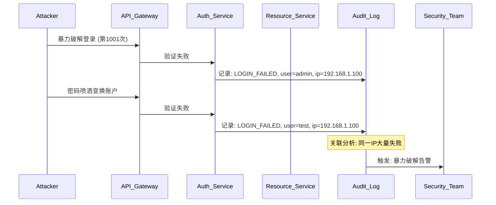
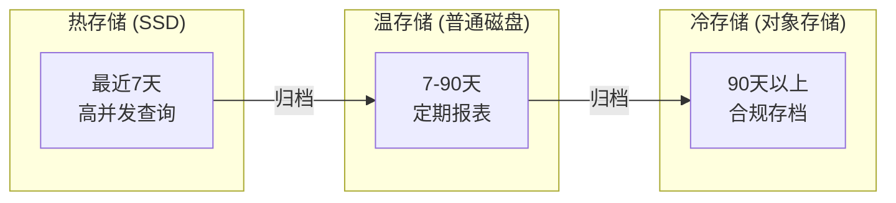

一次看似普通的安全事件，让某互联网公司损失了数百万用户数据。事后溯源发现，攻击者在事发前一周已经开始小规模试探：凌晨两点尝试登录管理员账号，每小时一次，连续七天。每次失败都触发了告警，但告警淹没在日常噪声中，没有人注意到这个固定时间、固定频率的异常模式。

这个故事的教训是：权限审计不只是记录「谁做了什么」，更重要的是发现「谁可能在做什么不该做的事」。审计日志的价值，不在于事后追责，而在于事前预警和事中阻断。

## 一、权限审计的必要性

权限审计是企业安全体系的最后一道防线，也是合规要求的硬性规定。

### 合规要求

不同行业和地区的法规对审计日志有明确的保存要求和内容规定：

| 法规/标准 | 关键要求 | 保存期限 |
| --- | --- | --- |
| SOC 2 | 记录所有身份验证和授权事件 | 最少 1 年 |
| PCI DSS | 记录所有持卡人数据访问 | 最少 1 年 |
| GDPR | 记录数据处理活动以便追溯 | 视业务需要 |
| HIPAA | 记录受保护健康信息的访问 | 最少 6 年 |
| ISO 27001 | 记录所有安全事件和审计 | 最少 3 年 |

如果你的系统服务于金融、医疗、政府等受监管行业，审计日志不是「可选项」，而是「必选项」。没有审计日志，在合规审计时你就是砧板上的鱼肉。

### 安全事件溯源

当安全事件发生后，审计日志是还原攻击路径的核心依据。没有完善的审计日志，安全事件调查就像在黑暗中摸索——你可能知道「出了事」，但不知道「谁在什么时候从哪个入口做了什么事」。

一个典型的事件溯源场景：



## 二、审计日志的内容设计

一个完整的审计日志，应该回答五个基本问题：**谁（Who）、何时（When）、何地（Where）、何事（What）、结果（Result）**。

### 六要素模型

```java title="审计事件结构"
public class AuditEvent {
    
    // 谁
    private String userId;          // 用户ID
    private String username;        // 用户名（冗余存储便于查询）
    private Set<String> roles;      // 当前用户的角色
    
    // 何时
    private Instant timestamp;      // 事件发生时间（UTC）
    private long requestId;         // 请求追踪ID
    
    // 何地
    private String sourceIp;        // 客户端IP
    private String userAgent;       // 客户端标识
    private String serviceName;     // 服务名称
    private String endpoint;        // 访问的端点
    
    // 何事
    private String action;          // 操作类型：LOGIN/LOGOUT/ACCESS/CREATE/UPDATE/DELETE
    private String resourceType;   // 资源类型：ORDER/USER/DOCUMENT
    private String resourceId;      // 资源ID
    private Map<String, Object> requestParams;  // 请求参数（脱敏后）
    
    // 结果
    private String result;          // 结果：SUCCESS/FAILURE/DENIED
    private String failureReason;   // 失败原因（如有）
    
    // 上下文
    private String sessionId;       // 会话ID
    private String correlationId;   // 关联请求ID（用于链路追踪）
}
```

### 操作类型分类

审计日志需要覆盖的操作类型：

| 类别 | 操作 | 说明 |
| --- | --- | --- |
| **身份认证** | LOGIN, LOGOUT, LOGIN_FAILED, TOKEN_REFRESH, TOKEN_REVOKED | 登录相关事件 |
| **授权变更** | ROLE_ASSIGNED, ROLE_REVOKED, PERMISSION_GRANTED, PERMISSION_DENIED | 权限分配变更 |
| **资源访问** | RESOURCE_READ, RESOURCE_CREATED, RESOURCE_UPDATED, RESOURCE_DELETED | 资源CRUD操作 |
| **敏感操作** | PASSWORD_CHANGED, MFA_ENABLED, API_KEY_CREATED, API_KEY_REVOKED | 高风险操作 |
| **管理操作** | USER_CREATED, USER_DELETED, CONFIG_CHANGED, POLICY_UPDATED | 管理员操作 |

### 敏感信息的脱敏处理

审计日志本身也可能成为攻击目标，因此敏感信息必须脱敏后再写入日志：

```java title="审计日志脱敏处理"
public class AuditLogSanitizer {
    
    private static final Set<String> SENSITIVE_FIELDS = Set.of(
        "password", "creditCard", "ssn", "apiKey", "secretKey", "token"
    );
    
    private static final Set<String> PARTIAL_MASK_FIELDS = Set.of(
        "email", "phone", "idCard"
    );
    
    public AuditEvent sanitize(AuditEvent event) {
        AuditEvent sanitized = event.clone();
        
        // 完全脱敏字段
        Map<String, Object> params = sanitized.getRequestParams();
        if (params != null) {
            params.replaceAll((key, value) -> {
                if (SENSITIVE_FIELDS.contains(key.toLowerCase())) {
                    return "[REDACTED]";
                }
                if (PARTIAL_MASK_FIELDS.contains(key.toLowerCase())) {
                    return maskPartial(String.valueOf(value));
                }
                return value;
            });
        }
        
        return sanitized;
    }
    
    private String maskPartial(String value) {
        if (value == null || value.length() <= 4) {
            return "****";
        }
        return value.substring(0, 2) + "****" + value.substring(value.length() - 2);
    }
}
```

## 三、审计日志的存储设计

审计日志的存储需要兼顾**查询效率**和**写入性能**，同时考虑成本和合规要求。

### 结构化日志设计

```sql title="审计日志表结构"
CREATE TABLE audit_logs (
    id BIGSERIAL PRIMARY KEY,
    
    -- 核心字段
    event_id UUID NOT NULL DEFAULT gen_random_uuid(),
    timestamp TIMESTAMPTZ NOT NULL DEFAULT NOW(),
    event_type VARCHAR(50) NOT NULL,
    
    -- 主体信息
    user_id VARCHAR(100),
    username VARCHAR(100),
    session_id VARCHAR(100),
    roles JSONB,
    
    -- 客体信息
    resource_type VARCHAR(50),
    resource_id VARCHAR(100),
    action VARCHAR(50),
    
    -- 上下文
    source_ip INET,
    user_agent TEXT,
    service_name VARCHAR(100),
    endpoint VARCHAR(255),
    
    -- 结果
    result VARCHAR(20) NOT NULL,
    failure_reason TEXT,
    error_code VARCHAR(50),
    
    -- 附加数据
    request_id UUID,
    correlation_id UUID,
    metadata JSONB,
    
    -- 审计字段
    created_at TIMESTAMPTZ DEFAULT NOW(),
    checksum VARCHAR(64)  -- 防篡改校验
);

-- 关键索引
CREATE INDEX idx_audit_timestamp ON audit_logs (timestamp DESC);
CREATE INDEX idx_audit_user ON audit_logs (user_id, timestamp DESC);
CREATE INDEX idx_audit_resource ON audit_logs (resource_type, resource_id, timestamp DESC);
CREATE INDEX idx_audit_type ON audit_logs (event_type, timestamp DESC);
CREATE INDEX idx_audit_ip ON audit_logs (source_ip, timestamp DESC);
```

### 分层存储策略

不同阶段的日志有不同的访问频率，应该采用分层存储：



| 层级 | 存储介质 | 保存周期 | 典型场景 |
| --- | --- | --- | --- |
| 热存储 | Elasticsearch/ClickHouse | 0-7 天 | 实时查询、告警 |
| 温存储 | MySQL/PostgreSQL | 7-90 天 | 月度报表、事件溯源 |
| 冷存储 | S3/OSS | 1-10 年 | 合规存档、历史分析 |

## 四、审计日志的关联分析

单个审计事件的信息有限，真正的价值在于将多个事件关联起来，还原完整的操作轨迹。

### 请求链路追踪

```java title="链路追踪上下文传播"
public class AuditContext {
    
    private static final ThreadLocal<AuditContext> CONTEXT = new ThreadLocal<>();
    
    private String correlationId;
    private String traceId;
    private List<AuditEvent> events = new ArrayList<>();
    
    public static void startRequest(HttpServletRequest request) {
        AuditContext context = new AuditContext();
        
        // 从请求头获取或生成追踪ID
        context.traceId = request.getHeader("X-Trace-ID");
        if (context.traceId == null) {
            context.traceId = UUID.randomUUID().toString();
        }
        
        context.correlationId = request.getHeader("X-Correlation-ID");
        
        CONTEXT.set(context);
    }
    
    public static AuditContext get() {
        return CONTEXT.get();
    }
    
    public static void addEvent(AuditEvent event) {
        AuditContext context = get();
        if (context != null) {
            event.setCorrelationId(context.traceId);
            context.events.add(event);
        }
    }
    
    public static void clear() {
        CONTEXT.remove();
    }
}
```

### 用户行为画像

基于审计日志构建用户行为画像，用于检测异常：

```java title="用户行为分析"
@Service
public class UserBehaviorAnalyzer {
    
    @Autowired
    private AuditLogRepository auditLogRepository;
    
    /**
     * 分析用户访问模式
     */
    public UserBehaviorProfile buildProfile(String userId, Duration lookback) {
        List<AuditEvent> events = auditLogRepository
            .findByUserIdAndTimestampAfter(userId, Instant.now().minus(lookback));
        
        UserBehaviorProfile profile = new UserBehaviorProfile();
        profile.setUserId(userId);
        
        // 访问时间分布
        Map<Integer, Long> hourDistribution = events.stream()
            .collect(Collectors.groupingBy(
                e -> e.getTimestamp().atZone(ZoneId.systemDefault()).getHour(),
                Collectors.counting()
            ));
        profile.setAccessTimeDistribution(hourDistribution);
        
        // 常用IP
        Map<String, Long> ipFrequency = events.stream()
            .collect(Collectors.groupingBy(
                AuditEvent::getSourceIp,
                Collectors.counting()
            ));
        profile.setKnownIps(ipFrequency.keySet());
        profile.setPrimaryIp(Collections.max(ipFrequency.entrySet(), 
            Map.Entry.comparingByValue()).getKey());
        
        // 常用资源
        Map<String, Long> resourceAccess = events.stream()
            .collect(Collectors.groupingBy(
                e -> e.getResourceType() + ":" + e.getResourceId(),
                Collectors.counting()
            ));
        profile.setFrequentlyAccessedResources(resourceAccess.keySet());
        
        // 活跃时段
        profile.setActiveHours(findActiveHours(hourDistribution));
        
        return profile;
    }
    
    /**
     * 检测异常行为
     */
    public List<AnomalyAlert> detectAnomalies(String userId) {
        UserBehaviorProfile profile = buildProfile(userId, Duration.ofDays(30));
        List<AnomalyAlert> alerts = new ArrayList<>();
        
        // 检测1：异常时间访问
        int currentHour = LocalTime.now().getHour();
        if (!profile.getActiveHours().contains(currentHour)) {
            alerts.add(new AnomalyAlert(
                "ABNORMAL_ACCESS_TIME",
                "用户在非活跃时段 " + currentHour + " 点访问",
                Severity.MEDIUM
            ));
        }
        
        // 检测2：异常IP访问
        AuditEvent latestEvent = auditLogRepository.findLatestByUserId(userId);
        if (latestEvent != null && 
            !profile.getKnownIps().contains(latestEvent.getSourceIp())) {
            alerts.add(new AnomalyAlert(
                "UNKNOWN_IP_ACCESS",
                "用户从新IP " + latestEvent.getSourceIp() + " 访问",
                Severity.HIGH
            ));
        }
        
        // 检测3：异常资源访问
        // ...
        
        return alerts;
    }
}
```

## 五、异常行为检测

异常行为检测是审计日志的核心应用场景。常见的异常模式包括：

### 暴力破解检测

```java title="暴力破解检测器"
@Service
public class BruteForceDetector {
    
    private static final int FAILURE_THRESHOLD = 5;
    private static final Duration WINDOW = Duration.ofMinutes(10);
    
    @Autowired
    private AuditLogRepository auditLogRepository;
    
    @Autowired
    private AlertService alertService;
    
    public void checkLoginAttempt(String username, String sourceIp, boolean success) {
        Instant windowStart = Instant.now().minus(WINDOW);
        
        // 查询窗口内的失败次数
        long failureCount = auditLogRepository.countByEventTypeAndUserIdAndTimestampAfter(
            "LOGIN_FAILED", username, windowStart
        );
        
        // 查询窗口内该IP的所有失败
        long ipFailureCount = auditLogRepository.countByEventTypeAndSourceIpAndTimestampAfter(
            "LOGIN_FAILED", sourceIp, windowStart
        );
        
        // 同一IP针对不同账户的失败尝试（密码喷洒攻击）
        Set<String> targetedUsers = auditLogRepository.findDistinctUsersByEventTypeAndSourceIpAndTimestampAfter(
            "LOGIN_FAILED", sourceIp, windowStart
        );
        
        if (ipFailureCount >= FAILURE_THRESHOLD * 3) {
            alertService.sendAlert(new SecurityAlert(
                AlertType.PASSWORD_SPRAYING,
                "密码喷洒攻击: IP " + sourceIp + " 尝试了 " + ipFailureCount + " 次登录",
                targetUsers = targetedUsers,
                severity = Severity.CRITICAL
            ));
        } else if (failureCount >= FAILURE_THRESHOLD) {
            alertService.sendAlert(new SecurityAlert(
                AlertType.BRUTE_FORCE,
                "暴力破解: 用户 " + username + " 在10分钟内失败 " + failureCount + " 次",
                targetUsers = Set.of(username),
                severity = Severity.HIGH
            ));
        }
    }
}
```

### 特权滥用检测

```java title="特权操作监控"
@Service
public class PrivilegeAbuseDetector {
    
    // 高敏感权限列表
    private static final Set<String> PRIVILEGED_PERMISSIONS = Set.of(
        "user:delete", "role:grant", "permission:assign",
        "config:modify", "api-key:create", "audit:delete"
    );
    
    public void monitorPrivilegedOperation(AuditEvent event) {
        if (!isPrivilegedOperation(event)) {
            return;
        }
        
        // 检查操作频率
        long operationCount = auditLogRepository.countByUserIdAndResourceTypeAndTimestampAfter(
            event.getUserId(),
            event.getResourceType(),
            Instant.now().minus(Duration.ofHours(1))
        );
        
        if (operationCount > 10) {
            alertService.sendAlert(new SecurityAlert(
                AlertType.PRIVILEGE_ABUSE,
                "特权滥用: 用户 " + event.getUsername() + " 在1小时内执行了 " + 
                operationCount + " 次特权操作",
                severity = Severity.HIGH
            ));
        }
        
        // 检查是否在非工作时间操作
        int hour = event.getTimestamp().atZone(ZoneId.systemDefault()).getHour();
        if (hour < 6 || hour > 22) {
            alertService.sendAlert(new SecurityAlert(
                AlertType.OFF_HOURS_PRIVILEGE,
                "非工作时间特权操作: 用户 " + event.getUsername() + " 在 " + hour + " 点执行了敏感操作",
                severity = Severity.MEDIUM
            ));
        }
    }
    
    private boolean isPrivilegedOperation(AuditEvent event) {
        String action = event.getAction();
        String resourceType = event.getResourceType();
        return PRIVILEGED_PERMISSIONS.contains(resourceType + ":" + action);
    }
}
```

### 横向移动检测

```java title="横向移动检测"
@Service
public class LateralMovementDetector {
    
    /**
     * 检测用户在短时间内访问多个不相关资源的行为
     * 正常用户通常专注于自己的业务范围
     */
    public void detectLateralMovement(String userId, String resourceId) {
        Instant recentWindow = Instant.now().minus(Duration.ofMinutes(30));
        
        List<AuditEvent> recentAccess = auditLogRepository
            .findByUserIdAndTimestampAfter(userId, recentWindow);
        
        // 计算访问资源的类型多样性
        long distinctResources = recentAccess.stream()
            .map(e -> e.getResourceType() + ":" + e.getResourceId())
            .distinct()
            .count();
        
        // 计算涉及的系统/部门数量
        long distinctSystems = recentAccess.stream()
            .map(AuditEvent::getServiceName)
            .distinct()
            .count();
        
        // 如果在短时间内访问大量不同资源，可能是横向移动
        if (distinctResources > 50 || distinctSystems > 5) {
            alertService.sendAlert(new SecurityAlert(
                AlertType.LATERAL_MOVEMENT,
                "可疑横向移动: 用户 " + userId + " 在30分钟内访问了 " + 
                distinctResources + " 个不同资源，跨越 " + distinctSystems + " 个系统",
                severity = Severity.HIGH
            ));
        }
    }
}
```

## 六、审计日志的保护

审计日志本身是敏感数据，需要特殊保护以防止被篡改或删除。

### 写一次（WORM）存储

对于高合规要求的场景，审计日志应该采用 WORM（Write Once Read Many）存储：

```java title="WORM存储实现"
@Service
public class WORMAuditLogStore {
    
    private final AuditLogRepository repository;
    private final AuditLogIntegrityService integrityService;
    
    /**
     * 写入审计日志，追加哈希链实现防篡改
     */
    @Transactional
    public void append(AuditEvent event) {
        // 获取上一条日志的哈希
        String previousHash = repository.getLatestHash()
            .orElse("GENESIS");
        
        // 生成当前日志的哈希
        String currentHash = integrityService.calculateHash(event, previousHash);
        event.setChecksum(currentHash);
        
        // 只允许插入，不允许更新或删除
        repository.insert(event);
    }
    
    /**
     * 验证日志完整性
     */
    public boolean verifyIntegrity() {
        List<AuditEvent> allLogs = repository.findAllOrderedById();
        String previousHash = "GENESIS";
        
        for (AuditEvent log : allLogs) {
            String expectedHash = integrityService.calculateHash(log, previousHash);
            if (!expectedHash.equals(log.getChecksum())) {
                return false;  // 日志已被篡改
            }
            previousHash = log.getChecksum();
        }
        
        return true;
    }
}
```

### 实时同步到外部存储

核心审计日志应该实时同步到独立的存储系统，即使主系统被攻破也能保证日志安全：

```yaml title="审计日志双写配置"
audit:
  primary:
    type: elasticsearch
    hosts:
      - es-primary.internal
    index: audit-logs
  
  secondary:
    type: s3
    bucket: company-audit-logs
    region: cn-north-1
    sync_interval: 1m
  
  protected:
    # 敏感操作日志同步到独立的HSM存储
    type: hsm
    endpoint: hsm.internal
    audit_key_id: audit-signing-key
```

## 七、合规报告生成

定期生成合规报告是审计的重要输出：

```java title="合规报告生成服务"
@Service
public class ComplianceReportService {
    
    public ComplianceReport generateReport(ComplianceStandard standard, 
                                           LocalDate startDate, 
                                           LocalDate endDate) {
        ComplianceReport report = new ComplianceReport();
        report.setStandard(standard);
        report.setPeriod(startDate, endDate);
        
        // 1. 访问统计
        report.setTotalAccessCount(auditLogRepository.countAccessEvents(startDate, endDate));
        report.setUniqueUsersCount(auditLogRepository.countUniqueUsers(startDate, endDate));
        report.setFailedAccessCount(auditLogRepository.countFailedAccess(startDate, endDate));
        
        // 2. 敏感数据访问
        report.setSensitiveDataAccess(auditLogRepository
            .countSensitiveResourceAccess(startDate, endDate));
        
        // 3. 权限变更记录
        report.setPrivilegeChanges(auditLogRepository
            .findPrivilegeChangeEvents(startDate, endDate));
        
        // 4. 安全事件摘要
        report.setSecurityIncidents(securityIncidentRepository
            .findByPeriod(startDate, endDate));
        
        // 5. 异常行为检测结果
        report.setAnomalyAlerts(anomalyAlertRepository
            .findByPeriod(startDate, endDate));
        
        // 6. 合规检查项
        report.setComplianceChecks(performComplianceChecks(standard, startDate, endDate));
        
        return report;
    }
    
    private List<ComplianceCheck> performComplianceChecks(
            ComplianceStandard standard, 
            LocalDate startDate, 
            LocalDate endDate) {
        // 根据标准执行具体检查项
        // ...
        return checks;
    }
}
```

## 思考题

**问题 1**：在设计审计日志时，如何平衡「记录足够信息」与「避免性能开销」？实时性要求很高的核心业务系统，审计日志会不会成为性能瓶颈？

<details>
<summary>参考答案</summary>

性能与审计的平衡策略：

1. **异步写入**：审计日志写入应该是异步的，不阻塞主业务流程。采用消息队列解耦，业务线程只负责发送事件，由专门的消费者线程负责写入存储。

2. **采样策略**：对于高频访问，可以采用采样日志而非全量记录。例如，记录前1000次访问，后续采样10%。

3. **关键事件优先**：敏感操作（登录、权限变更、删除）必须全量记录；普通读取操作可以适当采样。

4. **分层存储**：高频详细日志写入内存队列，定期聚合后写入持久化存储。告警相关的事件立即同步到ES等支持实时查询的系统。

5. **性能影响评估**：如果审计日志确实成为瓶颈，通常是因为同步写入或锁竞争。异步队列 + 批量写入可以将性能开销控制在5%以内。
</details>

**问题 2**：如果攻击者已经获得了系统最高权限，他可能会尝试删除或篡改审计日志来掩盖行踪。如何设计系统，使得即使拥有最高权限也无法抹除审计痕迹？

<details>
<summary>参考答案</summary>

多层防护策略：

1. **存储隔离**：审计日志存储在独立系统，应用程序账户无权直接访问。必须通过专用审计API写入，且只有追加权限。

2. **WORM存储**：使用一次写入、多次读取的存储介质（如WORM磁盘、归档存储），写入后不可修改、不可删除。

3. **哈希链**：每条日志包含前一条的哈希值，任何篡改都会导致哈希链断裂，可被检测。

4. **实时同步**：审计日志实时同步到外部系统（如云存储、远程SIEM），本地删除不影响外部副本。

5. **最小权限**：应用程序只拥有审计日志的「追加」权限，没有「读取全部」或「删除」的权限。审计管理员的权限也需要多签才能使用。

6. **监控告警**：对任何尝试访问或修改审计日志的行为（即使成功）都记录告警。

7. **物理隔离**：最高级别合规场景，审计日志可以存储在完全隔离的网络中，与业务系统物理断开。
</details>
