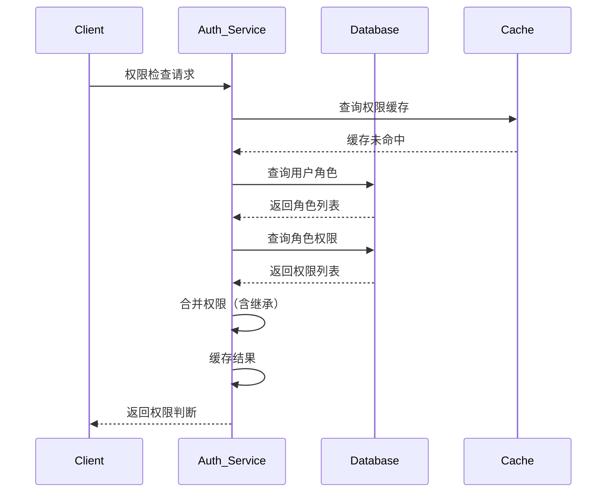

一个拥有 10 万用户的 SaaS 系统，每个用户平均持有 5 个角色，每个角色关联 20 个权限。如果每次 API 请求都实时查询数据库计算用户权限，网络延迟加上数据库查询时间，p99 响应时间可能达到 500ms。这样的系统，用户体验会极其糟糕。

但大多数时候，用户权限在短期内是稳定的。同一个用户，上午查他有权限访问订单，下午查他还是有权限。如果把权限数据缓存起来，避免每次都查询数据库，响应时间可以从 500ms 降低到 10ms。这正是权限缓存的核心价值。

## 一、权限检查的性能挑战

在深入缓存设计之前，需要先理解权限检查的性能瓶颈在哪里。

### 权限计算的复杂度

一次完整的权限检查，需要经历以下步骤：



如果涉及 ABAC，复杂度会进一步增加：属性查询、策略评估引擎、多个数据源访问。

### 性能指标

权限系统的核心性能指标：

| 指标 | 目标值 | 说明 |
| --- | --- | --- |
| 授权延迟 | `<` 10ms | 单次权限判断耗时 |
| 吞吐量 | `>` 10k QPS | 每秒可处理的权限请求 |
| 缓存命中率 | `>` 95% | 缓存有效减少数据库访问 |
| 可用性 | `>` 99.9% | 缓存故障不影响服务可用 |

## 二、缓存策略设计

选择合适的缓存策略直接影响系统的性能和资源消耗。

### LRU vs LFU vs TTL

三种常见的缓存淘汰策略：

| 策略 | 原理 | 适用场景 | 缺点 |
| --- | --- | --- | --- |
| **LRU**（最近最少使用） | 淘汰最长时间未访问的条目 | 大多数通用场景 | 不考虑访问频率 |
| **LFU**（最不经常使用） | 淘汰访问频率最低的条目 | 热点数据明显 | 维护成本高，历史数据权重过大 |
| **TTL**（固定过期） | 固定时间后过期 | 权限变更不频繁 | 可能返回过期数据 |

```java title="权限缓存配置"
@Configuration
public class PermissionCacheConfig {
    
    @Bean
    public CacheManager cacheManager() {
        // 本地缓存：Guava Cache
        Cache<String, Set<String>> localCache = CacheBuilder.newBuilder()
            .maximumSize(10_000)           // 最大条目数
            .expireAfterWrite(5, TimeUnit.MINUTES)  // 写入后5分钟过期
            .recordStats()                  // 开启统计
            .build();
        
        return new SimpleCacheManager(localCache);
    }
}
```

### Caffeine Cache 配置

如果使用 Spring Cache + Caffeine，可以更细粒度地控制缓存行为：

```java title="Caffeine 权限缓存"
@Service
public class PermissionCacheService {
    
    private final Cache<String, PermissionData> permissionCache;
    
    public PermissionCacheService() {
        this.permissionCache = Caffeine.newBuilder()
            // 初始容量
            .initialCapacity(1000)
            // 最大容量，超过后按权重淘汰
            .maximumSize(10_000)
            // 写入后过期时间（权限变更不频繁）
            .expireAfterWrite(10, TimeUnit.MINUTES)
            // 访问后过期时间（7天未访问则淘汰）
            .expireAfterAccess(7, TimeUnit.DAYS)
            // 权重：基于权限数量计算
            .weigher((key, value) -> value.getPermissions().size())
            .maximumWeight(100_000)
            // 异步刷新
            .scheduler(Scheduler.systemScheduler())
            // 统计
            .recordStats()
            .build();
    }
}
```

## 三、缓存失效策略

缓存失效是权限缓存最复杂的问题。权限变更后，如果缓存没有及时更新，可能导致权限判断错误。

### 基于事件的失效

当权限数据变更时，发布变更事件，缓存监听器收到事件后主动失效缓存：

```java title="权限变更事件监听"
@Service
public class PermissionEventListener {
    
    @Autowired
    private PermissionCacheService cacheService;
    
    /**
     * 监听用户角色变更
     */
    @EventListener
    public void onUserRoleChanged(UserRoleChangedEvent event) {
        // 失效该用户的权限缓存
        cacheService.invalidateUser(event.getUserId());
        
        // 如果是批量操作，可能影响所有用户
        if (event.isGlobal()) {
            cacheService.invalidateAll();
        }
    }
    
    /**
     * 监听角色权限变更
     */
    @EventListener
    public void onRolePermissionChanged(RolePermissionChangedEvent event) {
        // 查询所有拥有该角色的用户
        Set<Long> affectedUsers = userRoleRepository
            .findUsersByRoleId(event.getRoleId());
        
        // 失效所有受影响用户的缓存
        affectedUsers.forEach(cacheService::invalidateUser);
        
        // 如果角色被修改，影响所有用户
        if (event.isRoleDefinitionChanged()) {
            cacheService.invalidateAll();
        }
    }
    
    /**
     * 监听组织架构变更
     * 组织变更可能导致权限继承关系变化
     */
    @EventListener
    public void onOrgStructureChanged(OrgStructureChangedEvent event) {
        // 级联失效：获取该组织下所有用户
        Set<Long> affectedUsers = orgService.getAllUsersInOrg(event.getOrgId());
        affectedUsers.forEach(cacheService::invalidateUser);
    }
}
```

### 基于时间的失效

事件驱动的失效虽然及时，但可能出现遗漏。对于高安全要求的场景，需要结合 TTL 作为兜底：

```java title="双层缓存失效策略"
@Service
public class HybridCacheService {
    
    // 短期缓存：快速响应，频繁失效
    private final Cache<String, PermissionData> shortTermCache;
    
    // 长期缓存：兜底保护，降低数据库压力
    private final Cache<String, PermissionData> longTermCache;
    
    // 缓存版本：用于检测是否需要强制刷新
    private final AtomicLong cacheVersion = new AtomicLong(0);
    
    public PermissionData getUserPermissions(Long userId) {
        String cacheKey = "perm:" + userId;
        
        // 1. 先查短期缓存
        PermissionData data = shortTermCache.getIfPresent(cacheKey);
        if (data != null) {
            return data;
        }
        
        // 2. 查长期缓存（用于缓存穿透保护）
        data = longTermCache.getIfPresent(cacheKey);
        if (data != null) {
            shortTermCache.put(cacheKey, data);
            return data;
        }
        
        // 3. 查数据库
        data = loadFromDatabase(userId);
        
        // 4. 双写缓存
        shortTermCache.put(cacheKey, data);
        longTermCache.put(cacheKey, data);
        
        return data;
    }
    
    /**
     * 权限变更时，同时失效两层缓存
     */
    public void invalidateUser(Long userId) {
        String cacheKey = "perm:" + userId;
        shortTermCache.invalidate(cacheKey);
        longTermCache.invalidate(cacheKey);
        cacheVersion.incrementAndGet();
    }
    
    /**
     * 定期同步：补偿事件驱动的遗漏
     */
    @Scheduled(fixedRate = 300_000)  // 每5分钟
    public void reconcileCache() {
        // 比对缓存版本和数据库版本
        // 如果不一致，说明有遗漏的变更，强制刷新
        long dbVersion = permissionVersionRepository.getCurrentVersion();
        if (dbVersion > cacheVersion.get()) {
            log.warn("检测到缓存不一致，开始全量刷新");
            refreshAllCaches();
        }
    }
}
```

## 四、分布式环境下的缓存一致性

在多实例部署的系统中，本地缓存会导致数据不一致问题。

### 缓存一致性问题

```mermaid
flowchart LR
    subgraph 实例1["实例 A"]
        C1["本地缓存"]
    end
    
    subgraph 实例2["实例 B"]
        C2["本地缓存"]
    end
    
    subgraph 实例3["实例 C"]
        C3["本地缓存"]
    end
    
    DB["数据库"]
    
    DB --> C1
    DB --> C2
    DB --> C3
    
    Admin["管理员修改权限"] --> DB
    
    Note over C1,C3: 同一时间，只有一个实例的缓存失效
```

三个常见问题：

1. **缓存不一致**：实例 A 更新了权限，实例 B 和 C 的缓存还是旧数据
2. **缓存击穿**：大量请求同时穿透到数据库
3. **缓存雪崩**：大量缓存同时过期

### 集中式缓存方案

使用 Redis 等分布式缓存替代本地缓存：

```java title="Redis 分布式权限缓存"
@Service
public class DistributedPermissionCache {
    
    private final RedisTemplate<String, PermissionData> redisTemplate;
    private final ObjectMapper objectMapper;
    
    private static final String CACHE_PREFIX = "permission:";
    private static final Duration DEFAULT_TTL = Duration.ofMinutes(10);
    
    public PermissionData getUserPermissions(Long userId) {
        String key = CACHE_PREFIX + userId;
        
        // 1. 查询缓存
        PermissionData cached = redisTemplate.opsForValue().get(key);
        if (cached != null) {
            return cached;
        }
        
        // 2. 缓存未命中，加锁防止击穿
        String lockKey = "lock:" + key;
        Boolean acquired = redisTemplate.opsForValue()
            .setIfAbsent(lockKey, "1", Duration.ofSeconds(10));
        
        if (Boolean.TRUE.equals(acquired)) {
            try {
                // 双重检查
                cached = redisTemplate.opsForValue().get(key);
                if (cached != null) {
                    return cached;
                }
                
                // 3. 从数据库加载
                cached = loadFromDatabase(userId);
                
                // 4. 写入缓存
                redisTemplate.opsForValue().set(key, cached, DEFAULT_TTL);
                
                return cached;
            } finally {
                redisTemplate.delete(lockKey);
            }
        } else {
            // 等待其他线程加载
            try {
                Thread.sleep(100);
            } catch (InterruptedException ignored) {}
            return getUserPermissions(userId);
        }
    }
    
    /**
     * 权限变更时发布失效消息
     */
    @TransactionalEventListener
    public void onPermissionChanged(PermissionChangedEvent event) {
        String key = CACHE_PREFIX + event.getUserId();
        
        // 1. 删除缓存
        redisTemplate.delete(key);
        
        // 2. 发布变更消息，通知其他实例
        redisTemplate.convertAndSend("permission:invalidate", 
            event.getUserId().toString());
    }
}
```

### 本地缓存 + 广播失效

对于性能要求极高的场景，可以采用「本地缓存 + Redis 广播失效」的混合方案：

```java title="本地缓存 + Redis 广播"
@Service
public class HybridPermissionCache {
    
    // 本地缓存：超低延迟
    private final LoadingCache<Long, PermissionData> localCache;
    
    // Redis：分布式协调
    private final RedisTemplate<String, PermissionData> redisTemplate;
    
    // 发布-订阅监听器
    @Autowired
    private RedisMessageListenerContainer listenerContainer;
    
    public HybridPermissionCache() {
        this.localCache = CacheBuilder.newBuilder()
            .maximumSize(5000)
            .expireAfterWrite(5, TimeUnit.MINUTES)
            .build(CacheLoader.from(this::loadFromRedisOrDb));
        
        // 订阅失效消息
        subscribeToInvalidation();
    }
    
    private void subscribeToInvalidation() {
        listenerContainer.addMessageListener((message, pattern) -> {
            String userId = new String(message.getBody());
            localCache.invalidate(Long.parseLong(userId));
        }, new PatternTopic("permission:invalidate"));
    }
    
    private PermissionData loadFromRedisOrDb(Long userId) {
        String redisKey = "permission:" + userId;
        PermissionData data = redisTemplate.opsForValue().get(redisKey);
        
        if (data == null) {
            data = loadFromDatabase(userId);
            redisTemplate.opsForValue().set(redisKey, data, Duration.ofMinutes(10));
        }
        
        return data;
    }
}
```

## 五、缓存穿透与缓存雪崩

### 缓存穿透

攻击者故意查询不存在的用户或资源，导致每次都穿透到数据库：

```java title="缓存穿透防护"
@Service
public class PermissionCacheWithProtection {
    
    private final RedisTemplate<String, PermissionData> redisTemplate;
    
    // 空值缓存：防止恶意穿透
    private static final Duration NULL_CACHE_TTL = Duration.ofMinutes(1);
    
    public PermissionData getPermissions(Long userId) {
        String key = "permission:" + userId;
        
        // 1. 查询缓存
        PermissionData data = redisTemplate.opsForValue().get(key);
        
        // 2. 命中空值缓存（说明用户不存在）
        if (isNullMarker(data)) {
            return null;
        }
        
        // 3. 缓存未命中
        if (data == null) {
            // 查询数据库
            data = loadFromDatabase(userId);
            
            // 4. 如果用户存在，缓存结果；如果不存在，写入空值标记
            if (data != null) {
                redisTemplate.opsForValue().set(key, data, Duration.ofMinutes(10));
            } else {
                // 写入空值标记
                redisTemplate.opsForValue().set(key, createNullMarker(), NULL_CACHE_TTL);
            }
        }
        
        return data;
    }
    
    private boolean isNullMarker(PermissionData data) {
        return data != null && data.getUserId() == null && data.isNullMarker();
    }
}
```

### 缓存雪崩

大量缓存同时过期或缓存服务宕机，导致大量请求穿透到数据库：

```java title="缓存雪崩防护"
@Service
public class PermissionCacheWithAvalancheProtection {
    
    /**
     * 随机过期时间：避免大量缓存同时过期
     */
    private Duration randomizeTtl(Duration baseTtl) {
        // 基础TTL的80%~120%之间随机
        double factor = 0.8 + Math.random() * 0.4;
        return Duration.ofMillis((long)(baseTtl.toMillis() * factor));
    }
    
    /**
     * 多级缓存：本地缓存作为最后防线
     */
    private final LoadingCache<Long, PermissionData> localCache;
    
    /**
     * Redis降级：当Redis不可用时，降级到本地缓存
     */
    public PermissionData getPermissionsWithFallback(Long userId) {
        try {
            return getFromRedis(userId);
        } catch (RedisConnectionException e) {
            log.warn("Redis不可用，降级到本地缓存");
            return localCache.get(userId);
        }
    }
    
    /**
     * 热点数据预加载：防止缓存重建时的雪崩
     */
    @PostConstruct
    public void preloadHotData() {
        // 在服务启动时预加载热点用户权限
        Set<Long> hotUserIds = userService.getHotUserIds();
        
        hotUserIds.forEach(userId -> {
            try {
                localCache.put(userId, loadFromDatabase(userId));
            } catch (Exception e) {
                log.warn("预加载用户 {} 权限失败", userId);
            }
        });
    }
}
```

## 六、预热与批量处理

### 启动预热

```java title="缓存预热"
@Component
public class PermissionCacheWarmer implements ApplicationRunner {
    
    private final PermissionCacheService cacheService;
    private final UserRepository userRepository;
    
    @Override
    public void run(ApplicationArguments args) {
        log.info("开始权限缓存预热...");
        
        // 1. 预热管理员和热点用户
        List<Long> priorityUsers = userRepository.findPriorityUsers();
        priorityUsers.forEach(cacheService::warmUser);
        
        // 2. 预热最近活跃用户（最近7天有登录）
        Set<Long> recentUsers = sessionService.getRecentUserIds(7, TimeUnit.DAYS);
        recentUsers.parallelStream().forEach(cacheService::warmUser);
        
        log.info("权限缓存预热完成，共预热 {} 个用户", 
            priorityUsers.size() + recentUsers.size());
    }
}
```

### 批量失效

权限变更时，需要高效地批量失效相关缓存：

```java title="批量缓存失效"
@Service
public class BatchCacheInvalidation {
    
    private final RedisTemplate<String, Object> redisTemplate;
    
    /**
     * 批量失效：使用Pipeline提高效率
     */
    public void batchInvalidateUserPermissions(Collection<Long> userIds) {
        List<String> keys = userIds.stream()
            .map(id -> "permission:" + id)
            .collect(Collectors.toList());
        
        // Redis Pipeline：减少网络往返
        redisTemplate.executePipelined((RedisCallback<Object>) connection -> {
            for (String key : keys) {
                connection.del(key.getBytes());
            }
            return null;
        });
    }
    
    /**
     * 模糊匹配失效：删除所有以某前缀开头的缓存
     */
    public void invalidateByPattern(String pattern) {
        Set<String> keys = redisTemplate.keys(pattern);
        if (keys != null && !keys.isEmpty()) {
            redisTemplate.delete(keys);
        }
    }
}
```

## 七、性能指标与监控

```java title="缓存性能监控"
@Service
public class PermissionCacheMetrics {
    
    private final Cache<Long, PermissionData> cache;
    
    @Autowired
    private MeterRegistry meterRegistry;
    
    public PermissionCacheMetrics(Cache<Long, PermissionData> cache) {
        this.cache = cache;
        
        // 注册缓存统计指标
        CacheMetricsRecorder metrics = Metrics.of(cache.getClass());
        metrics.bindTo(meterRegistry);
    }
    
    public CacheStats getCacheStats() {
        CacheStats stats = new CacheStats();
        
        stats.setHitCount(cache.stats().hitCount());
        stats.setMissCount(cache.stats().missCount());
        stats.setHitRate(cache.stats().hitRate());
        stats.setLoadSuccessCount(cache.stats().loadSuccessCount());
        stats.setLoadExceptionCount(cache.stats().loadExceptionCount());
        stats.setTotalLoadTime(cache.stats().totalLoadTime().toMillis());
        
        return stats;
    }
    
    @Scheduled(fixedRate = 60_000)
    public void reportMetrics() {
        CacheStats stats = getCacheStats();
        
        log.info("权限缓存统计 - 命中率: {:.2f}%, 命中: {}, 未命中: {}, 加载成功: {}, 加载失败: {}",
            stats.getHitRate() * 100,
            stats.getHitCount(),
            stats.getMissCount(),
            stats.getLoadSuccessCount(),
            stats.getLoadExceptionCount());
    }
}
```

关键监控指标：

| 指标 | 健康范围 | 说明 |
| --- | --- | --- |
| 命中率 | `>` 95% | 缓存有效性的核心指标 |
| 未命中加载时间 | `<` 50ms | 数据库查询耗时 |
| 缓存大小 | `不超过` 上限 | 防止OOM |
| 淘汰率 | `<` 10% | 缓存淘汰过于频繁说明容量不足 |
| 异常率 | `<` 0.1% | 缓存异常不应影响业务 |

## 思考题

**问题 1**：在分布式系统中使用 Redis 作为权限缓存时，如果 Redis 集群发生主从切换，短期内可能读到脏数据。如何在性能和数据一致性之间取得平衡？

<details>
<summary>参考答案</summary>

分层一致性策略：

1. **读场景**：可以接受一定时间的延迟，使用「过期时间短的本地缓存 + Redis」组合。

2. **写场景**：权限变更时采用「Cache Aside + 延迟双删」模式：
   - 先更新数据库
   - 删除缓存
   - 延迟一段时间后再次删除（补偿并发更新）

3. **关键权限**：对于超级管理员等关键账户，可以跳过缓存，每次实时查询。

4. **版本号机制**：在缓存数据中携带版本号，客户端定期与服务端核对版本。

5. **强制刷新**：敏感操作后，客户端显式请求刷新权限缓存。

6. **监控告警**：检测到数据不一致时告警，由管理员决定是否需要人工干预。
</details>

**问题 2**：如果权限变更非常频繁（比如用户频繁进出部门导致权限不断变化），缓存反而会成为性能瓶颈。遇到这种情况，应该如何设计缓存策略？

<details>
<summary>参考答案</summary>

三种应对策略：

**策略一：缩短 TTL，减少不一致窗口**
- 将权限缓存 TTL 从 10 分钟缩短到 1 分钟
- 代价：数据库查询频率增加

**策略二：放弃缓存，实时计算**
- 如果变更频率超过阈值（如每秒超过100次），完全放弃缓存
- 改为预计算 + 消息队列异步更新
- 适用于：权限变更有规律可循的场景

**策略三：变更为「事件驱动 + 版本号」**
- 缓存数据携带变更版本号
- 权限变更只发布事件，不立即更新缓存
- 读取时比对版本号，不一致则异步刷新
- 适用于：变更频繁但可以容忍短暂不一致的场景

**综合建议**：
- 首先评估权限变更的真正频率，大多数场景没有想象中那么频繁
- 如果是特定用户频繁变更，可以针对该用户禁用缓存，而不是全局禁用
- 监控缓存更新频率，动态调整策略
</details>
