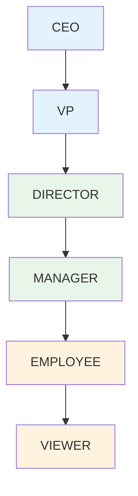

Casbin 的精髓在于**模型与实现的分离**。你只需要定义「权限应该如何检查」的模型，然后用配置文件填充具体的策略——这就像给程序写规则，而不是写代码。

理解 Casbin 模型配置，是掌握 Casbin 的关键。

## 一、模型配置结构

### 1.1 完整配置示例

```ini title="完整模型配置示例")
[request_definition]
r = sub, obj, act

[policy_definition]
p = sub, obj, act

[role_definition]
g = _, _

[policy_effect]
e = some(where (p.eft == allow))

[matchers]
m = g(r.sub, p.sub) && r.obj == p.obj && r.act == p.act
```

### 1.2 各节说明

| 节 | 必填 | 说明 |
|---|------|------|
| `request_definition` | 是 | 请求格式定义 |
| `policy_definition` | 是 | 策略格式定义 |
| `role_definition` | 是 | 角色继承定义 |
| `policy_effect` | 是 | 策略效果（允许/拒绝） |
| `matchers` | 是 | 匹配规则 |

## 二、ACL 模型

### 2.1 基础 ACL

最简单的访问控制模型：

```ini title="basic_model.conf")
[request_definition]
r = sub, obj, act

[policy_definition]
p = sub, obj, act

[policy_effect]
e = some(where (p.eft == allow))

[matchers]
m = r.sub == p.sub && r.obj == p.obj && r.act == p.act
```

```csv title="basic_policy.csv")
p, alice, data1, read
p, alice, data1, write
p, bob, data2, read
p, bob, data2, write
p, bob, data2, delete
```

```java title="使用示例")
Enforcer e = new Enforcer("basic_model.conf", "basic_policy.csv");

e.enforce("alice", "data1", "read");    // true
e.enforce("bob", "data2", "delete");    // true
e.enforce("alice", "data2", "read");    // false
```

### 2.2 ACL 的局限性

ACL 简单直接，但问题也很明显：**用户直接绑定权限，无法表达角色概念**。

```
alice ──read──> data1
alice ──write──> data1
bob ──read──> data2
bob ──write──> data2
bob ──delete──> data2
```

如果要给 100 个用户都授予「读取 data1」的权限，需要写 100 条策略。

## 三、RBAC 模型

### 3.1 标准 RBAC

引入角色层：

```ini title="rbac_model.conf")
[request_definition]
r = sub, obj, act

[policy_definition]
p = sub, obj, act

[role_definition]
g = _, _

[policy_effect]
e = some(where (p.eft == allow))

[matchers]
m = g(r.sub, p.sub) && r.obj == p.obj && r.act == p.act
```

```csv title="rbac_policy.csv")
p, admin, data, read
p, admin, data, write
p, admin, data, delete
p, user, data, read

g, alice, admin
g, bob, user
g, charlie, user
```

```java title="使用示例")
Enforcer e = new Enforcer("rbac_model.conf", "rbac_policy.csv");

// 权限检查（自动通过角色检查）
e.enforce("alice", "data", "read");    // true (via admin)
e.enforce("bob", "data", "read");      // true (via user)
e.enforce("bob", "data", "delete");    // false (user can't delete)

// 角色操作
e.addRoleForUser("david", "admin");
e.deleteRoleForUser("charlie", "user");
```

### 3.2 多角色继承

角色可以继承其他角色：

```ini title="rbac_hierarchy_model.conf")
[role_definition]
g = _, _
```

```csv title="rbac_hierarchy_policy.csv")
g, employee, viewer
g, manager, employee
g, director, manager
g, vp, director
g, ceo, vp
```



现在 `ceo` 继承所有角色的权限。

### 3.3 RBAC with Domain

支持多租户/域隔离：

```ini title="rbac_with_dom_model.conf")
[request_definition]
r = sub, dom, obj, act

[policy_definition]
p = sub, dom, obj, act

[role_definition]
g = _, _, _

[policy_effect]
e = some(where (p.eft == allow))

[matchers]
m = g(r.sub, p.sub, r.dom) && r.dom == p.dom && r.obj == p.obj && r.act == p.act
```

```csv title="rbac_with_dom_policy.csv")
p, admin, tenant-a, data, read
p, admin, tenant-a, data, write
p, user, tenant-b, data, read

g, alice, admin, tenant-a
g, bob, user, tenant-a
g, charlie, user, tenant-b
```

```java title="使用示例")
Enforcer e = new Enforcer("rbac_with_dom_model.conf", 
    "rbac_with_dom_policy.csv");

// alice 在 tenant-a 是 admin
e.enforce("alice", "tenant-a", "data", "read");   // true
e.enforce("alice", "tenant-b", "data", "read");    // false (不在 tenant-b)

// bob 在 tenant-a 是 user
e.enforce("bob", "tenant-a", "data", "read");      // true
```

### 3.4 资源层级 RBAC

支持资源的层级关系：

```ini title="rbac_with_hierarchy_model.conf")
[request_definition]
r = sub, obj, act

[policy_definition]
p = sub, obj, act

[role_definition]
g = _, _

[policy_effect]
e = some(where (p.eft == allow))

[matchers]
m = g(r.sub, p.sub) && (r.obj == p.obj || regexMatch(r.obj, p.obj))
```

```csv title="rbac_hierarchy_policy.csv")
p, manager, /department/finance/*, read
p, manager, /department/finance/*, write
p, employee, /department/*, read

g, alice, manager
g, bob, employee
```

```
目录结构：
/department/finance/
    ├── reports/
    └── budgets/

/department/hr/
    └── employees/

权限继承：
manager 可以访问 /department/finance/*（包含 reports 和 budgets）
employee 可以访问 /department/*（包含 finance 和 hr）
```

## 四、ABAC 模型

### 4.1 基础 ABAC

支持条件表达式：

```ini title="abac_model.conf")
[request_definition]
r = sub, obj, act

[policy_definition]
p = sub, obj, act

[policy_effect]
e = some(where (p.eft == allow))

[matchers]
m = r.sub.Role == p.sub && r.obj.Owner == r.sub.Name || r.sub.Role == "admin"
```

```java title="使用示例")
// 传入对象需要包含属性
Request request = new Request();
request.setSub(new Subject("alice", "manager", 35));
request.setObj(new Resource("doc-1", "alice"));
request.setAct("read");

e.enforce(request);
```

### 4.2 复杂 ABAC 条件

```ini title="abac_complex_model.conf")
[request_definition]
r = sub, obj, act

[policy_definition]
p = sub, obj, act

[policy_effect]
e = some(where (p.eft == allow))

[matchers]
m = eval(p.constraints) || r.sub.Role == "admin"

[abac]
enabled = true
```

```java title="策略中的约束")
p, user, document, read, {
  "constraints": {
    "time_range": "09:00-18:00",
    "max_amount": 10000,
    "allowed_departments": ["engineering", "product"]
  }
}
```

### 4.3 动态属性匹配

```ini title="abac_resource_model.conf")
[request_definition]
r = sub, obj, act

[policy_definition]
p = sub, obj, act

[policy_effect]
e = some(where (p.eft == allow))

[matchers]
m = r.sub.Department == r.obj.Department || r.sub.Level >= r.obj.MinAccessLevel
```

## 五、RESTful 模型

### 5.1 路径匹配

```ini title="restful_model.conf")
[request_definition]
r = sub, obj, act

[policy_definition]
p = sub, obj, act

[policy_effect]
e = some(where (p.eft == allow))

[matchers]
m = r.sub == p.sub && regexMatch(r.obj, p.obj) && (r.act == p.act || r.act == "*")
```

```csv title="restful_policy.csv")
p, alice, /api/users, GET
p, alice, /api/users/*, POST
p, alice, /api/users/*, PUT
p, bob, /api/reports, GET
p, admin, /api/*, *
```

```java title="使用示例")
e.enforce("alice", "/api/users", "GET");      // true
e.enforce("alice", "/api/users/123", "GET");  // true
e.enforce("bob", "/api/users", "GET");        // false
e.enforce("bob", "/api/reports", "GET");      // true
```

### 5.2 HTTP 方法映射

```java title="HTTP 方法转义")
public class RestfulExample {
    
    public static void main(String[] args) {
        // HTTP Method → Action 映射
        Map<String, String> methodMap = Map.of(
            "GET", "read",
            "POST", "create",
            "PUT", "update",
            "PATCH", "update",
            "DELETE", "delete"
        );
        
        HttpServletRequest request = ...;
        String action = methodMap.get(request.getMethod());
        
        e.enforce(userId, request.getRequestURI(), action);
    }
}
```

## 六、模型配置详解

### 6.1 Request Definition

定义权限检查的输入格式：

```ini
[request_definition]
r = sub, obj, act
```

| 变量 | 含义 |
|------|------|
| `sub` | 主体（用户） |
| `obj` | 对象（资源） |
| `act` | 操作（动作） |

可以自定义变量名：

```ini
[request_definition]
r = user, resource, operation
```

### 6.2 Policy Definition

定义策略的格式：

```ini
[policy_definition]
p = sub, obj, act
```

策略文件中的每一行对应一个 `p` 开头的记录：

```csv
p, alice, data1, read
p, bob, data2, write
```

### 6.3 Role Definition

定义角色继承关系：

```ini
[role_definition]
g = _, _
```

| 变量 | 含义 |
|------|------|
| 第一位 | 用户 |
| 第二位 | 角色 |

```csv
g, alice, admin
g, bob, user
g, charlie, admin
```

### 6.4 Policy Effect

定义多条策略冲突时的效果：

```ini title="允许覆盖")
[policy_effect]
e = some(where (p.eft == allow))
```

```ini title="优先拒绝")
[policy_effect]
e = !some(where (p.eft == deny))
```

```ini title="允许且无拒绝")
[policy_effect]
e = some(where (p.eft == allow)) && !some(where (p.eft == deny))
```

| 效果表达式 | 说明 |
|-----------|------|
| `some(where (p.eft == allow))` | 任一策略允许则允许 |
| `!some(where (p.eft == deny))` | 无策略拒绝则允许 |
| `any(where (p.eft == allow)) && !any(where (p.eft == deny))` | 允许且无拒绝 |

### 6.5 Matchers

定义请求与策略的匹配逻辑：

```ini
[matchers]
m = r.sub == p.sub && r.obj == p.obj && r.act == p.act
```

| 操作符 | 说明 |
|--------|------|
| `==` | 等于 |
| `!=` | 不等于 |
| `&&` | 逻辑与 |
| `\|\|` | 逻辑或 |
| `!` | 逻辑非 |
| `regexMatch()` | 正则匹配 |
| `keyMatch()` | 路径匹配 |
| `keyGet()` | 路径获取 |

## 七、模型配置验证

### 7.1 验证工具

```java title="模型验证")
public class ModelValidator {
    
    /**
     * 验证模型配置语法
     */
    public ValidationResult validate(String modelConfig) {
        try {
            Model model = new Model();
            model.loadModel(modelConfig);
            return ValidationResult.success();
        } catch (Exception e) {
            return ValidationResult.failure(e.getMessage());
        }
    }
    
    /**
     * 检查策略与模型是否匹配
     */
    public boolean validatePolicy(String modelPath, String policyPath) {
        Enforcer e = new Enforcer(modelPath, policyPath);
        return e.enforce("test", "test", "test");  // 测试性检查
    }
}
```

### 7.2 常见配置错误

| 错误 | 原因 | 解决 |
|------|------|------|
| `Invalid request definition` | 变量数量不匹配 | 检查 `request_definition` |
| `Invalid policy definition` | 策略格式不匹配 | 检查 `policy_definition` |
| `Invalid matcher expression` | 表达式语法错误 | 检查 `matchers` |
| `Missing role definition` | 未定义角色继承 | 添加 `role_definition` |

## 八、动态模型更新

### 8.1 运行时更新模型

```java title="动态模型更新")
public class DynamicModelService {
    
    private Enforcer enforcer;
    
    /**
     * 运行时更新 matcher
     */
    public void updateMatcher(String newMatcher) {
        Model model = enforcer.getModel();
        model.addDef("matchers", "m", newMatcher);
        enforcer.clearCache();
    }
    
    /**
     * 运行时添加策略定义
     */
    public void addPolicyDef(String newDef) {
        Model model = enforcer.getModel();
        model.addDef("policy_definition", "p", newDef);
    }
}
```

### 8.2 模型版本控制

```java title="模型版本管理")
@Service
public class ModelVersionService {
    
    /**
     * 获取指定版本的模型
     */
    public Model getModel(String version) {
        String modelConfig = modelRepository.findByVersion(version);
        Model model = new Model();
        model.loadModelFromText(modelConfig);
        return model;
    }
    
    /**
     * 版��兼容性检查
     */
    public boolean isCompatible(String fromVersion, String toVersion) {
        // 检查变量定义是否兼容
        Model from = getModel(fromVersion);
        Model to = getModel(toVersion);
        
        return from.getRequestDef().equals(to.getRequestDef());
    }
}
```

:::tip 核心原则
Casbin 模型配置的核心是**「匹配器」**。理解 matchers 的写法，就掌握了 Casbin 的精髓。从简单到复杂，逐步演进你的模型。
:::

## 思考题

**问题 1**：设计一个支持「资源层级」和「用户层级」的混合模型，使得：
- 父资源拥有权限时，子资源自动继承
- 上级角色拥有权限时，下级角色自动继承

<details>
<summary>参考答案</summary>

**设计方案**：

```ini title="混合层级模型")
[request_definition]
r = sub, obj, act

[policy_definition]
p = sub, obj, act

[role_definition]
g = _, _

[policy_effect]
e = some(where (p.eft == allow))

[matchers]
m = g(r.sub, p.sub) && (objMatch(r.obj, p.obj) || r.obj == p.obj) && (r.act == p.act || p.act == "*")

[helpers]
objMatch(obj, pattern) = regexMatch(obj, pattern) || isChildOf(obj, pattern)
isChildOf(obj, parent) = startswith(obj, concat(parent, "/"))
```

**关键点**：
1. `objMatch` 函数支持前缀匹配
2. `g(r.sub, p.sub)` 处理用户层级继承
3. `p.act == "*"` 表示通配符操作

**策略示例**：

```csv
p, manager, /department/finance, *
p, employee, /department, read

g, alice, manager
g, bob, employee
```

- `alice` 可以访问 `/department/finance/*`（父资源通配）
- `bob` 可以访问 `/department/*`（子资源继承）
</details>

**问题 2**：如何在 Casbin 中实现「拒绝优先」机制，使得当存在拒绝策略时，无论有多少允许策略，最终结果都是拒绝？

<details>
<summary>参考答案</summary>

**方案一：使用多层策略类型**

```ini
[policy_definition]
p = sub, obj, act
p2 = sub, obj, act  # 拒绝策略

[policy_effect]
e = !some(where (p2.eft == deny)) && some(where (p.eft == allow))
```

```csv
p, alice, data, read
p2, alice, data, read
```

Alice 虽然有 read 权限，但也有明确的拒绝策略，最终被拒绝。

**方案二：使用 effect 字段**

```ini
[policy_effect]
e = deny_overrides

[matchers]
m = r.sub == p.sub && r.obj == p.obj && r.act == p.act
```

在策略中明确标记：

```csv
p, alice, data, read, allow
p, bob, data, read, deny
```

**方案三：分离 allow/deny 表**

```ini
[policy_definition]
allow_p = sub, obj, act
deny_p = sub, obj, act

[policy_effect]
e = some(where (deny_p.eft == deny)) || some(where (allow_p.eft == allow))
```

```csv
allow_p, alice, data, read
deny_p, bob, data, read
```

- 如果存在任何 deny 匹配，拒绝
- 否则，如果有 allow 匹配，允许
- 否则，默认拒绝
</details>
