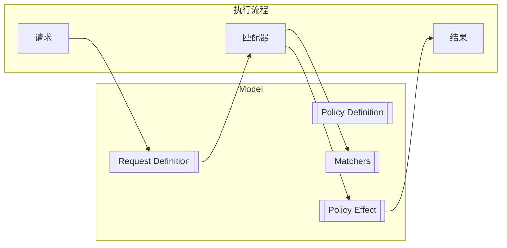
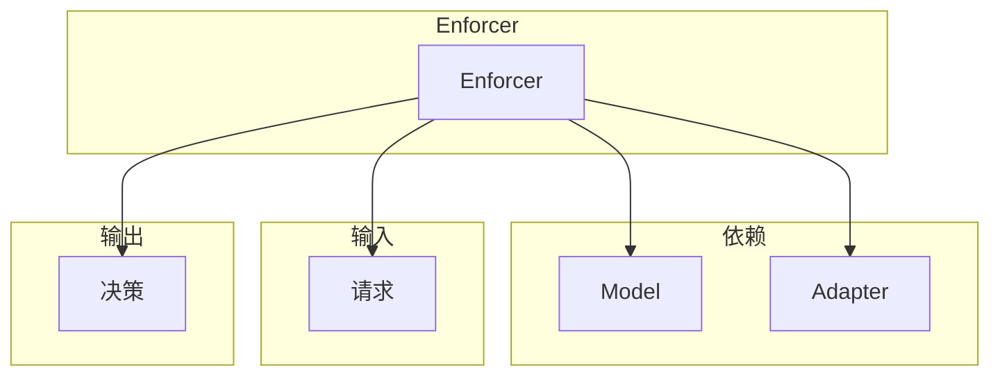
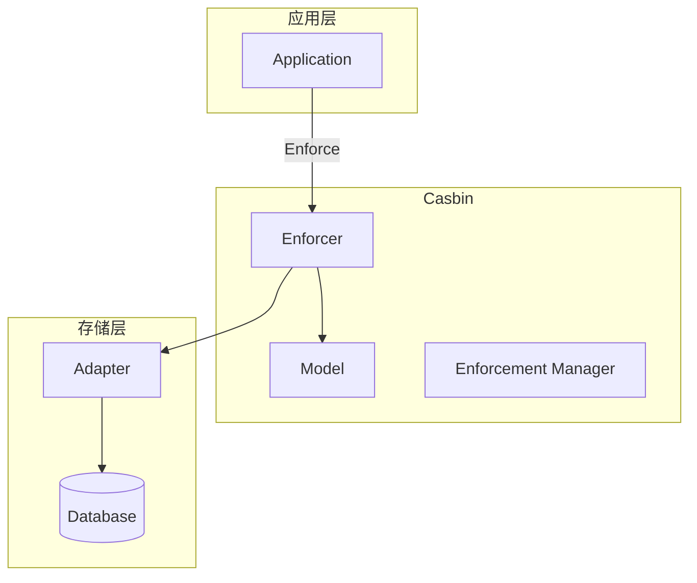
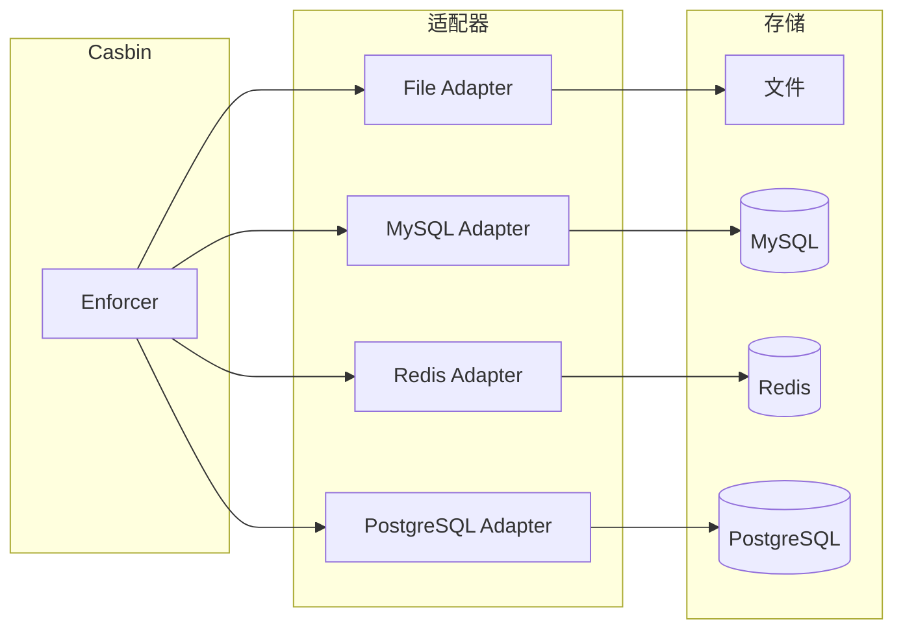
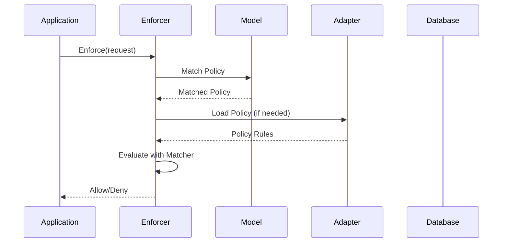

某团队需要在 Java 应用中实现一套权限控制系统。他们评估了几个方案：自研 RBAC、Spring Security、Shiro、Keycloak……每个方案都有自己的权衡。最后，团队选择了一个名字有趣的框架——Casbin。

Casbin 是一个轻量级的、Go 语言发源的多语言权限框架。它的核心理念是：**用配置文件定义模型，用代码执行决策**。

## 一、Casbin 定位

### 1.1 什么是 Casbin

Casbin 是一个开源的访问控制框架，最初由 Go 语言实现，现已支持 Java、Python、Node.js 等多种语言：

| 语言 | 实现 | GitHub Stars |
|------|------|-------------|
| Go | casbin/casbin | 18k+ |
| Java | casbin/jcasbin | 2k+ |
| Python | casbin/pycasbin | 1k+ |
| Node.js | casbin/node-casbin | 1k+ |

### 1.2 核心特性

| 特性 | 说明 |
|------|------|
| 多模型支持 | ACL、RBAC、ABAC 等 |
| 轻量级 | 核心库体积小，依赖少 |
| 可扩展 | 适配器模式存储策略 |
| 高性能 | 本地评估，无网络开销 |
| 简洁 API | 学习曲线低 |

## 二、支持的权限模型

### 2.1 ACL 模型

最基本的访问控制列表模型：

```ini title="ACL 模型配置")
[request_definition]
r = sub, obj, act

[policy_definition]
p = sub, obj, act

[policy_effect]
e = some(where (p.eft == allow))

[matchers]
m = r.sub == p.sub && r.obj == p.obj && r.act == p.act
```

### 2.2 RBAC 模型

支持角色继承的 RBAC：

```ini title="RBAC 模型配置")
[request_definition]
r = sub, obj, act

[policy_definition]
p = sub, obj, act

[role_definition]
g = _, _

[policy_effect]
e = some(where (p.eft == allow))

[matchers]
m = g(r.sub, p.sub) && r.obj == p.obj && r.act == p.act
```

### 2.3 RBAC with Domains

带域（租户）隔离的 RBAC：

```ini title="RBAC with Domains 模型")
[request_definition]
r = sub, dom, obj, act

[policy_definition]
p = sub, dom, obj, act

[role_definition]
g = _, _, _

[policy_effect]
e = some(where (p.eft == allow))

[matchers]
m = g(r.sub, p.sub, r.dom) && r.dom == p.dom && r.obj == p.obj && r.act == p.act
```

### 2.4 ABAC 模型

支持属性条件判断：

```ini title="ABAC 模型配置")
[request_definition]
r = sub, obj, act

[policy_definition]
p = sub, obj, act

[policy_effect]
e = some(where (p.eft == allow))

[matchers]
m = r.sub.Role == "admin" || r.obj.Owner == r.sub.Name
```

### 2.5 RESTful 模型

支持 RESTful 风格的路径匹配：

```ini title="RESTful 模型")
[request_definition]
r = sub, obj, act

[policy_definition]
p = sub, obj, act

[policy_effect]
e = some(where (p.eft == allow))

[matchers]
m = r.sub == p.sub && regexMatch(r.obj, p.obj) && r.act == p.act
```

## 三、核心概念

### 3.1 Model 模型

模型定义了**如何做决策**的逻辑：



### 3.2 Policy 策略

策略定义了**允许什么**：

```csv title="策略文件示例")
p, alice, data1, read
p, bob, data2, write
p, manager, data, read
p, manager, data, write

g, alice, manager
g, bob, manager
```

### 3.3 Enforcer 执行器

执行器是 Casbin 的核心，持有 Model 和 Adapter：



## 四、架构设计

### 4.1 整体架构



### 4.2 适配器模式



### 4.3 执行流程



## 五、Java 实现

### 5.1 Maven 依赖

```xml title="pom.xml")
<dependency>
    <groupId>org.casbin</groupId>
    <artifactId>jcasbin</artifactId>
    <version>1.27.0</version>
</dependency>
```

### 5.2 基本使用

```java title="BasicExample.java")
import org.casbin.jcasbin.main.Enforcer;
import org.casbin.jcasbin.model.Model;
import org.casbin.jcasbin.adapter.FileAdapter;

public class BasicExample {
    public static void main(String[] args) throws Exception {
        // 1. 创建执行器
        Enforcer e = new Enforcer(
            "path/to/basic_model.conf",  // 模型文件
            "path/to/basic_policy.csv"    // 策略文件
        );
        
        // 2. 权限检查
        boolean allowed = e.enforce("alice", "data1", "read");
        System.out.println("alice can read data1: " + allowed);
        
        // 3. 修改策略（文件模式）
        e.addPolicy("bob", "data2", "write");
        e.removePolicy("alice", "data1", "read");
    }
}
```

### 5.3 RBAC 实现

```java title="RBACExample.java")
public class RBACExample {
    public static void main(String[] args) throws Exception {
        Enforcer e = new Enforcer(
            "path/to/rbac_model.conf",
            "path/to/rbac_policy.csv"
        );
        
        // 权限检查（会自动检查角色继承）
        boolean allowed = e.enforce("alice", "data", "read");
        System.out.println("alice can read data: " + allowed);
        
        // 获取用户的所有角色
        List<String> roles = e.getRolesForUser("alice");
        System.out.println("alice's roles: " + roles);
        
        // 获取角色拥有的权限
        List<String> permissions = e.getPermissionsForUser("alice");
        System.out.println("alice's permissions: " + permissions);
        
        // 添加角色继承关系
        e.addRoleForUser("alice", "admin");
        
        // 检查角色成员
        List<String> members = e.getUsersForRole("admin");
        System.out.println("admin members: " + members);
    }
}
```

### 5.4 数据库适配器

```java title="DatabaseExample.java")
public class DatabaseExample {
    public static void main(String[] args) throws Exception {
        // 1. 使用 MySQL 适配器
        DbAdapter adapter = new DbAdapter(
            "mysql",
            "jdbc:mysql://localhost:3306/casbin",
            "root",
            "password"
        );
        
        // 2. 自动创建表
        adapter.createTable("casbin_rule");
        
        // 3. 创建执行器
        Enforcer e = new Enforcer(
            "path/to/rbac_model.conf",
            adapter
        );
        
        // 4. 从数据库加载策略
        // 策略会在首次加载时自动从数据库读取
        
        // 5. 修改策略（持久化到数据库）
        e.addPolicy("charlie", "data3", "read");
        e.removePolicy("alice", "data1", "read");
        
        // 6. 清除缓存并重新加载
        e.clearCache();
        e.loadPolicy();
    }
}
```

### 5.5 Spring Boot 集成

```java title="CasbinConfig.java")
@Configuration
public class CasbinConfig {
    
    @Value("${casbin.model.path}")
    private String modelPath;
    
    @Value("${casbin.policy.adapter}")
    private String adapterType;
    
    @Bean
    public Enforcer casbinEnforcer() throws Exception {
        Enforcer e;
        
        if ("database".equals(adapterType)) {
            // 使用数据库适配器
            DataSourceAdapter adapter = new DataSourceAdapter(dataSource);
            e = new Enforcer(modelPath, adapter);
        } else {
            // 使用文件适配器
            FileAdapter adapter = new FileAdapter(modelPath.replace(".conf", "_policy.csv"));
            e = new Enforcer(modelPath, adapter);
        }
        
        return e;
    }
}
```

```java title="CasbinService.java")
@Service
@Slf4j
public class CasbinService {
    
    private final Enforcer enforcer;
    
    public CasbinService(Enforcer enforcer) {
        this.enforcer = enforcer;
    }
    
    /**
     * 权限检查
     */
    public boolean checkPermission(String user, String resource, String action) {
        try {
            return enforcer.enforce(user, resource, action);
        } catch (Exception e) {
            log.error("Casbin check failed", e);
            return false;
        }
    }
    
    /**
     * 批量权限检查
     */
    public Map<String, Boolean> batchCheck(String user, 
            List<ResourceAction> resourceActions) {
        Map<String, Boolean> results = new HashMap<>();
        
        for (ResourceAction ra : resourceActions) {
            boolean allowed = checkPermission(user, ra.getResource(), ra.getAction());
            results.put(ra.getResource() + ":" + ra.getAction(), allowed);
        }
        
        return results;
    }
    
    /**
     * 授予角色
     */
    public boolean grantRole(String user, String role) {
        return enforcer.addRoleForUser(user, role);
    }
    
    /**
     * 撤销角色
     */
    public boolean revokeRole(String user, String role) {
        return enforcer.deleteRoleForUser(user, role);
    }
}
```

## 六、策略存储与持久化

### 6.1 策略存储表结构

```sql title="MySQL 策略表")
CREATE TABLE casbin_rule (
    id BIGINT AUTO_INCREMENT PRIMARY KEY,
    ptype VARCHAR(128) NOT NULL,  -- 策略类型：p, g, p2, g2 等
    v0 VARCHAR(128),
    v1 VARCHAR(128),
    v2 VARCHAR(128),
    v3 VARCHAR(128),
    v4 VARCHAR(128),
    v5 VARCHAR(128),
    INDEX idx_ptype (ptype)
);
```

### 6.2 自定义适配器

```java title="RedisAdapter.java")
public class RedisAdapter extends Adapter {
    
    private JedisPool jedisPool;
    private String keyPrefix = "casbin:policy:";
    
    public RedisAdapter(JedisPool jedisPool) {
        this.jedisPool = jedisPool;
    }
    
    @Override
    public void loadPolicy(Model model) {
        try (Jedis jedis = jedisPool.getResource()) {
            Set<String> keys = jedis.keys(keyPrefix + "*");
            
            for (String key : keys) {
                String value = jedis.get(key);
                String[] parts = value.split(",");
                
                // 解析并加载策略
                if (parts.length >= 2) {
                    model.addPolicy(parts[0], "p", Arrays.copyOfRange(parts, 1, parts.length));
                }
            }
        }
    }
    
    @Override
    public void savePolicy(String ptype, String... rules) {
        // 实现保存逻辑
    }
}
```

## 七、Casbin vs OPA

### 7.1 核心对比

| 维度 | Casbin | OPA |
|------|--------|-----|
| 策略语言 | 模型配置 + 匹配器 | Rego |
| 表达能力 | 中等 | 强大 |
| 学习曲线 | 低 | 中等 |
| 性能 | 本地评估，高性能 | 可配置 |
| 生态系统 | 较小 | 丰富 |
| K8s 集成 | 无 | Gatekeeper |
| 云原生支持 | 一般 | 优秀 |
| 策略测试 | 基础 | 完善 |

### 7.2 选型建议

| 场景 | 推荐 |
|------|------|
| 简单 RBAC 需求 | Casbin |
| 复杂策略逻辑 | OPA |
| 微服务权限 | Casbin |
| K8s 资源控制 | OPA Gatekeeper |
| 快速上线 | Casbin |
| 需要云原生生态 | OPA |

### 7.3 混合使用

```java title="混合使用示例")
@Service
public class HybridAuthorizationService {
    
    private final Enforcer casbin;
    private final OPAClient opaClient;
    
    /**
     * Casbin 处理常规 RBAC
     * OPA 处理特殊 ABAC 规则
     */
    public AuthorizationResult authorize(AccessRequest request) {
        // 1. Casbin 快速判断（简单 RBAC）
        if (casbin.enforce(request.getUserId(), 
                request.getResourceType(), 
                request.getAction())) {
            return AuthorizationResult.permit("casbin");
        }
        
        // 2. OPA 判断（复杂规则）
        if (opaClient.evaluate(buildOPAInput(request)).isAllowed()) {
            return AuthorizationResult.permit("opa");
        }
        
        return AuthorizationResult.deny();
    }
}
```

:::tip 核心洞察
Casbin 的设计哲学是**「简单场景简单做」**。如果你只需要一个轻量级的 RBAC/ACL 引擎，Casbin 是很好的选择；如果你的策略逻辑复杂且需要云原生集成，OPA 更合适。
:::

## 思考题

**问题 1**：Casbin 的模型配置和 OPA 的 Rego 语言，各自在表达能力和易用性上有什么取舍？

<details>
<summary>参考答案</summary>

**表达能力对比**：

| 场景 | Casbin | OPA |
|------|--------|-----|
| 简单的角色权限 | ✅ 简洁 | ✅ 可以 |
| 基于时间的权限 | ⚠️ 需要辅助字段 | ✅ 原生支持 |
| 基于 IP 的权限 | ⚠️ 需要辅助字段 | ✅ 原生支持 |
| 数值比较 | ❌ 不支持 | ✅ 支持 |
| 正则表达式 | ⚠️ 部分支持 | ✅ 完整支持 |
| 跨表关联查询 | ❌ 不支持 | ✅ 支持 |

**易用性对比**：

| 维度 | Casbin | OPA |
|------|--------|-----|
| 入门难度 | 低 | 中等 |
| 配置文件可读性 | 高（INI 风格） | 中（函数式） |
| 调试难度 | 低 | 中等 |
| 测试工具 | 基础 | 完善 |

**结论**：简单场景用 Casbin，复杂场景用 OPA。
</details>

**问题 2**：设计一个将 Casbin 与 Spring Security 集成的方案，使两者协同工作。

<details>
<summary>参考答案</summary>

**集成方案设计**：

**1. 架构分层**

```
┌─────────────────────────────────────┐
│         Spring Security Filter      │
├─────────────────────────────────────┤
│  认证 (Authentication)               │ ← Spring Security
├─────────────────────────────────────┤
│  授权 (Authorization)               │ ← Casbin + Spring Security
└─────────────────────────────────────┘
```

**2. 实现代码**

```java
@Configuration
@EnableWebSecurity
public class SecurityConfig {
    
    @Bean
    public SecurityFilterChain filterChain(HttpSecurity http) throws Exception {
        http
            .authorizeHttpRequests(auth -> auth
                .requestMatchers("/public/**").permitAll()
                .requestMatchers("/admin/**").hasRole("ADMIN")
                .anyRequest().authenticated()
            )
            .addFilterBefore(casbinAuthorizationFilter(), 
                AuthorizationFilter.class);
        
        return http.build();
    }
    
    @Bean
    public CasbinAuthorizationFilter casbinAuthorizationFilter() {
        return new CasbinAuthorizationFilter(casbinService);
    }
}
```

**3. Casbin 授权过滤器**

```java
public class CasbinAuthorizationFilter extends OncePerRequestFilter {
    
    private final CasbinService casbinService;
    
    @Override
    protected void doFilterInternal(HttpServletRequest request,
                                    HttpServletResponse response,
                                    FilterChain chain) 
            throws ServletException, IOException {
        
        String user = getCurrentUser(request);
        String resource = extractResource(request);
        String action = mapMethodToAction(request.getMethod());
        
        if (!casbinService.checkPermission(user, resource, action)) {
            response.setStatus(HttpServletResponse.SC_FORBIDDEN);
            return;
        }
        
        chain.doFilter(request, response);
    }
}
```

**4. 职责划分建议**

| 层级 | 职责 | 实现 |
|------|------|------|
| 全局角色 | `@PreAuthorize("hasRole('ADMIN')")` | Spring Security |
| 资源权限 | 文档、API 的读/写/删 | Casbin |
| 动态规则 | 时间、IP、设备等 | OPA（可选） |
</details>
