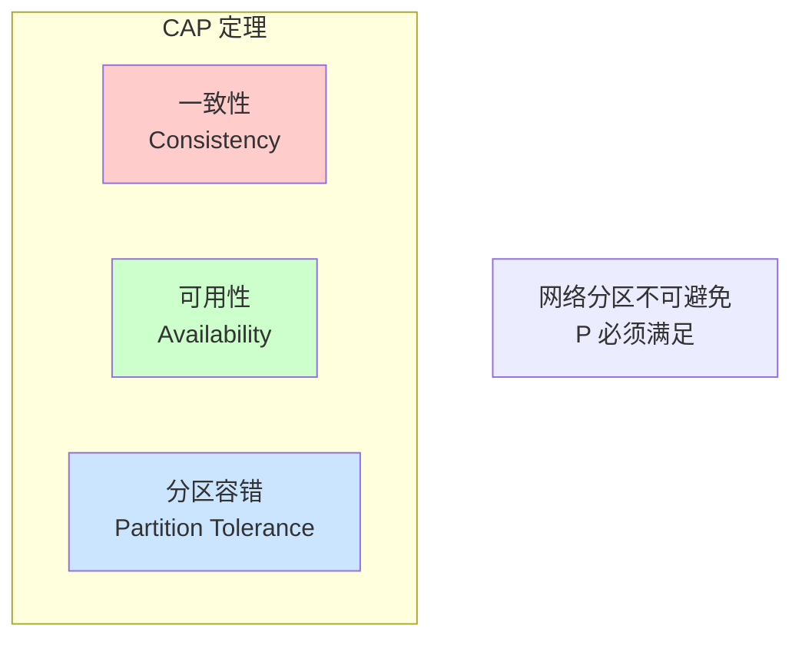
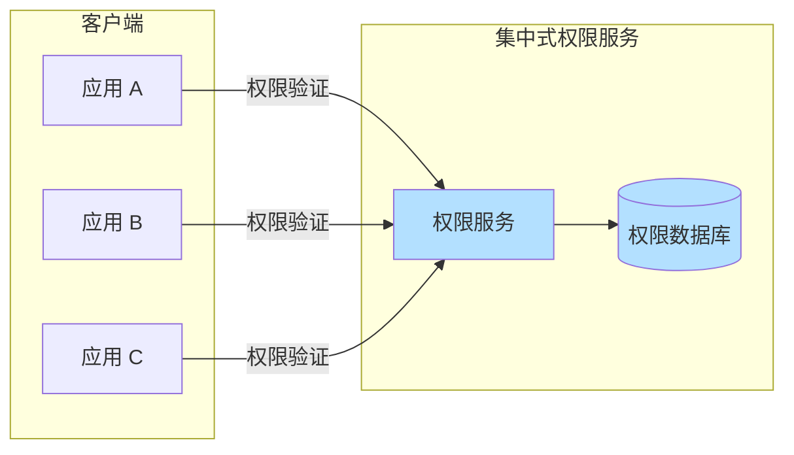
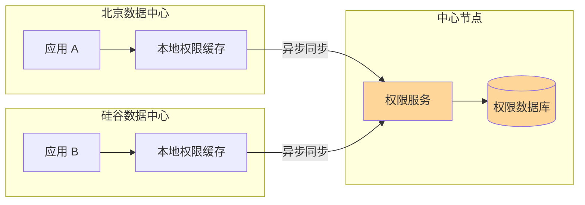
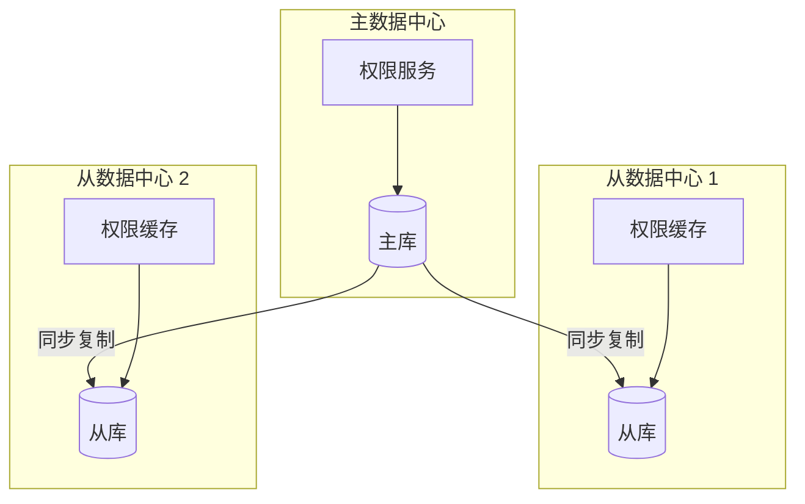
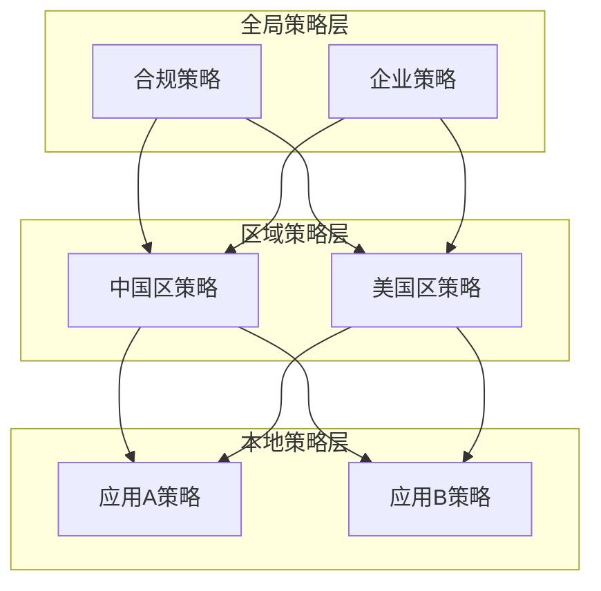
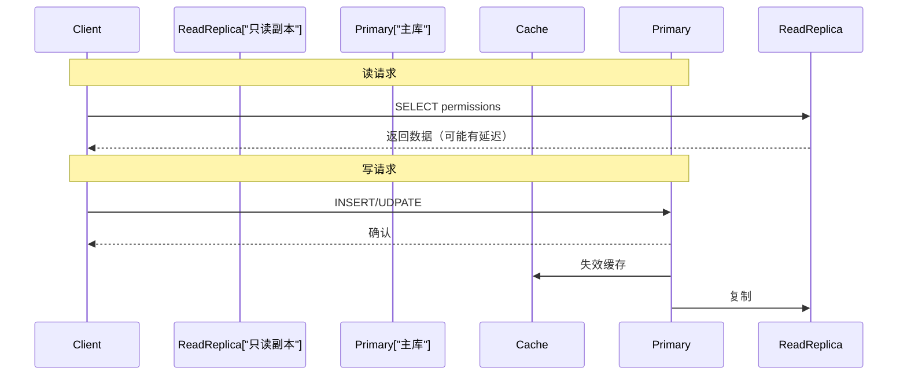
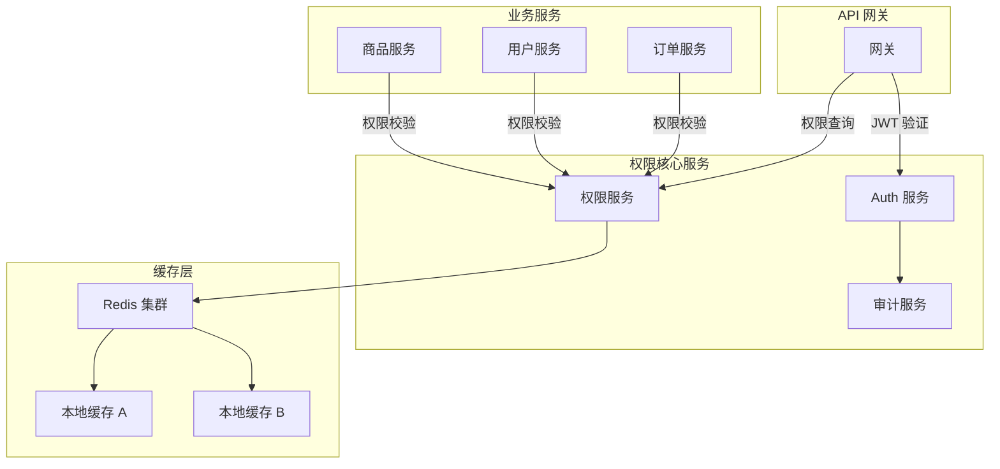
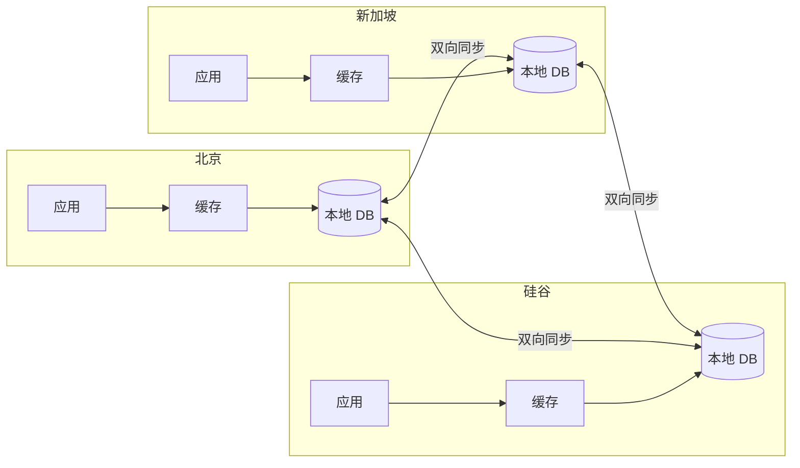

一个订单系统部署在四个数据中心：中国北京、美国硅谷、德国法兰克福、新加坡。每个数据中心的服务器都需要验证用户权限，但用户可能在任何一个数据中心登录。如果每次权限验证都要跨数据中心查询，网络延迟可能达到 200ms，用户体验会非常糟糕。

这正是分布式权限系统需要解决的核心问题：在保证权限一致性的前提下，如何让权限验证足够快？

## 一、分布式权限系统的设计挑战

分布式权限系统面临三个核心挑战：**一致性、可用性、性能**。

### 三难困境



在网络分区发生时，必须在一致性和可用性之间做出选择：

| 场景 | 选择 | 结果 |
| --- | --- | --- |
| 强一致优先 | CP | 分区期间拒绝服务，但保证数据一致 |
| 可用性优先 | AP | 分区期间继续服务，但可能返回过期数据 |

对于权限系统，大多数场景应该选择 **AP**：即使偶尔返回过期权限（用户刚被授予的权限还未同步），也比直接拒绝服务好。

### 权限系统的特殊性

权限系统与一般分布式数据相比有几个独特挑战：

1. **读取远多于写入**：权限验证次数是权限变更次数的 1000 倍以上
2. **一致性要求相对宽松**：几秒钟的权限延迟通常可接受
3. **变更需要实时生效**：权限撤销必须尽快传播，否则可能造成安全事故
4. **跨服务依赖**：几乎所有业务服务都依赖权限系统

## 二、集中式 vs 分布式架构

### 集中式架构



| 优势 | 劣势 |
| --- | --- |
| 数据一致性高 | 单点故障风险 |
| 管理维护简单 | 网络延迟高 |
| 审计集中 | 扩展性受限 |

### 分布式架构



| 优势 | 劣势 |
| --- | --- |
| 低延迟 | 数据一致性复杂 |
| 高可用 | 管理复杂度高 |
| 水平扩展 | 冲突处理困难 |

### 混合架构

实际生产环境通常采用混合架构：核心权限数据集中管理，各节点部署本地缓存。

```java title="混合架构配置"
public class HybridPermissionConfig {
    
    // 集中式权限服务
    @Value("${permission.service.url:http://permission-center:8080}")
    private String permissionServiceUrl;
    
    // 本地缓存配置
    @Value("${permission.local.cache.ttl:300}")
    private long localCacheTtlSeconds;
    
    @Value("${permission.local.cache.max-size:10000}")
    private int localCacheMaxSize;
    
    // 分布式缓存配置
    @Value("${permission.redis.url:redis://redis:6379}")
    private String redisUrl;
}
```

## 三、数据分片策略

当权限数据量超过单节点容量时，需要进行数据分片。

### 按用户分片

最常见的分片策略：将用户按 ID 哈希到不同分片：

```java title="一致性哈希分片"
public class ConsistentHashSharding {
    
    private final TreeMap<Long, ShardNode> ring = new TreeMap<>();
    private final HashFunction hashFunction = Hashing.murmur3_128();
    
    public ConsistentHashSharding(List<ShardNode> nodes) {
        // 添加物理节点
        for (ShardNode node : nodes) {
            addNode(node);
            
            // 每个物理节点对应多个虚拟节点，实现负载均衡
            for (int i = 0; i < VIRTUAL_NODES; i++) {
                String virtualNodeName = node.getName() + "-VN" + i;
                addNode(virtualNodeName, node);
            }
        }
    }
    
    /**
     * 根据用户ID定位分片
     */
    public ShardNode locateShard(Long userId) {
        if (ring.isEmpty()) {
            throw new IllegalStateException("无可用分片");
        }
        
        // 计算用户ID的哈希值
        long hash = hashFunction.hashString(userId.toString(), StandardCharsets.UTF_8).asLong();
        
        // 找到顺时针方向的第一个节点
        Map.Entry<Long, ShardNode> entry = ring.ceilingEntry(hash);
        if (entry == null) {
            // 环绕到第一个节点
            entry = ring.firstEntry();
        }
        
        return entry.getValue().getRealNode();
    }
}
```

### 分片路由

```java title="分片路由服务"
@Service
public class ShardedPermissionService {
    
    private final Map<ShardNode, PermissionRepository> repositories;
    private final ConsistentHashSharding sharding;
    
    public PermissionData getUserPermissions(Long userId) {
        // 1. 路由到正确分片
        ShardNode shard = sharding.locateShard(userId);
        PermissionRepository repo = repositories.get(shard);
        
        // 2. 从对应分片查询
        return repo.findByUserId(userId);
    }
    
    @Transactional
    public void updateUserPermissions(Long userId, PermissionData data) {
        ShardNode shard = sharding.locateShard(userId);
        PermissionRepository repo = repositories.get(shard);
        
        // 权限更新需要跨分片协调
        repo.update(data);
        
        // 发布变更事件，同步到缓存层
        eventPublisher.publish(new PermissionChangedEvent(userId));
    }
}
```

### 分片策略对比

| 策略 | 原理 | 优势 | 劣势 |
| --- | --- | --- | --- |
| 哈希分片 | 按 ID 哈希定位 | 负载均匀 | 跨分片查询困难 |
| 范围分片 | 按 ID 范围分区 | 支持范围查询 | 可能产生热点 |
| 目录分片 | 维护 ID-分片映射 | 灵活 | 单点查询性能 |
| 异地多活 | 按地域分片 | 低延迟 | 数据同步复杂 |

## 四、跨数据中心一致性

### 主从复制



```yaml title="主从复制配置"
permission:
  replication:
    type: semi_sync  # 半同步复制
    timeout: 5s       # 超时后降级为异步
    
  failover:
    enabled: true
    heart_beat: 1s
    max_retry: 3
```

### 无主复制（CRDT）

对于需要高可写的场景，可以采用无主复制：

```java title="CRDT 权限数据"
public class PermissionSet implements CmRDT<PermissionSet> {
    
    private final Set<String> permissions = new HashSet<>();
    private final VectorClock vectorClock;
    
    /**
     * 添加权限（可合并）
     */
    public void add(String permission) {
        permissions.add(permission);
        vectorClock.increment();
    }
    
    /**
     * 移除权限（可合并）
     */
    public void remove(String permission) {
        permissions.remove(permission);
        vectorClock.increment();
    }
    
    /**
     * 合并两个权限集
     * 使用 LWW（Last-Write-Wins）处理冲突
     */
    @Override
    public PermissionSet merge(PermissionSet other) {
        if (this.vectorClock.compareTo(other.vectorClock) > 0) {
            return this;
        } else if (other.vectorClock.compareTo(this.vectorClock) > 0) {
            return other;
        } else {
            // 相同时间戳时，合并权限集合
            PermissionSet merged = new PermissionSet();
            merged.permissions.addAll(this.permissions);
            merged.permissions.addAll(other.permissions);
            return merged;
        }
    }
}
```

### 冲突解决策略

| 策略 | 原理 | 适用场景 |
| --- | --- | --- |
| LWW | 以时间戳判断，以最新为准 | 大多数场景 |
| Vector Clock | 追踪所有节点的版本 | 需要保留所有变更 |
| 语义合并 | 根据业务语义合并 | 权限增减等有语义的操作 |

## 五、全局策略与本地策略

### 分层策略模型



### 策略合并规则

```java title="分层策略合并"
public class PolicyMerger {
    
    /**
     * 合并多层策略
     * 优先级：本地 > 区域 > 全局
     * 但全局禁止策略具有最高优先级
     */
    public Policy mergePolicies(List<Policy> policies) {
        Policy merged = new Policy();
        
        // 1. 收集所有权限
        Set<String> allowedPermissions = new HashSet<>();
        Set<String> deniedPermissions = new HashSet<>();
        Set<String> globalDenied = new HashSet<>();  // 全局禁止，不可覆盖
        
        for (Policy policy : policies) {
            if (policy.isGlobal()) {
                globalDenied.addAll(policy.getDenied());
            } else {
                allowedPermissions.addAll(policy.getAllowed());
                deniedPermissions.addAll(policy.getDenied());
            }
        }
        
        // 2. 应用合并规则
        // 全局禁止策略优先级最高
        deniedPermissions.addAll(globalDenied);
        
        // 允许 = 允许集合 - 禁止集合
        Set<String> finalAllowed = new HashSet<>(allowedPermissions);
        finalAllowed.removeAll(deniedPermissions);
        
        merged.setPermissions(finalAllowed);
        
        return merged;
    }
}
```

## 六、故障隔离与降级

### 熔断降级

```java title="权限服务熔断器"
@Service
public class PermissionServiceWithCircuitBreaker {
    
    private final CircuitBreaker circuitBreaker;
    private final PermissionRepository repository;
    
    public PermissionServiceWithCircuitBreaker() {
        this.circuitBreaker = CircuitBreaker.of("permissionService",
            CircuitBreakerConfig.custom()
                .failureRateThreshold(50)          // 50% 失败率触发熔断
                .slidingWindowSize(10)             // 滑动窗口 10 次请求
                .slidingWindowType(CircuitBreakerConfig.SlidingWindowType.COUNT_BASED)
                .minimumNumberOfCalls(5)           // 最少 5 次请求才开始计算
                .waitDurationInOpenState(Duration.ofSeconds(30))  // 熔断 30 秒后进入半开
                .permittedNumberOfCallsInHalfOpenState(3)  // 半开状态允许 3 次试探
                .build()
        );
    }
    
    public PermissionData getUserPermissions(Long userId) {
        return circuitBreaker.executeSupplier(() -> {
            return repository.findByUserId(userId);
        });
    }
}
```

### 降级策略

| 降级级别 | 条件 | 行为 | 影响 |
| --- | --- | --- | --- |
| L1 | 缓存可用 | 使用缓存数据 | 可能读到几分钟前的权限 |
| L2 | 缓存不可用 | 使用本地默认权限 | 无权限变更，保守放行 |
| L3 | 服务完全不可用 | 返回「需要二次验证」 | 所有操作需额外认证 |

```java title="多级降级实现"
@Service
public class PermissionServiceWithDegradation {
    
    private final DistributedCache distributedCache;
    private final LocalCache localCache;
    private final PermissionRepository repository;
    
    public PermissionResult authorize(Long userId, String action) {
        // L0: 正常路径
        try {
            return checkWithCache(userId, action);
        } catch (Exception e) {
            log.warn("缓存检查失败，尝试降级", e);
        }
        
        // L1: 分布式缓存
        try {
            return checkWithDistributedCache(userId, action);
        } catch (Exception e) {
            log.error("分布式缓存不可用，尝试本地降级", e);
        }
        
        // L2: 本地缓存或默认策略
        return checkWithLocalOrDefault(userId, action);
    }
}
```

## 七、性能与一致性权衡

### 读写分离



### CAP 权衡矩阵

| 场景 | 一致性 | 性能 | 实现方式 |
| --- | --- | --- | --- |
| 权限验证（读） | 最终一致 | 优先 | 多级缓存 + 异步同步 |
| 权限撤销（写） | 强一致 | 可牺牲 | 同步失效 + 消息确认 |
| 审计日志 | 至少一次 | 异步 | 消息队列 + 持久化 |
| 管理员操作 | 强一致 | 批量 | 读写分离 + 重试 |

## 八、微服务架构下的权限设计



### 服务间权限传递

```java title="服务间权限上下文传播"
@Service
public class PermissionContextPropagator {
    
    private static final String PERMISSION_HEADER = "X-Permission-Context";
    
    /**
     * 提取权限上下文
     */
    public PermissionContext extract(HttpRequest request) {
        String header = request.getHeader(PERMISSION_HEADER);
        if (header == null) {
            return null;
        }
        
        return JsonSerializer.deserialize(header, PermissionContext.class);
    }
    
    /**
     * 注入权限上下文到下游请求
     */
    public void inject(HttpRequest request, PermissionContext context) {
        String serialized = JsonSerializer.serialize(context);
        request.setHeader(PERMISSION_HEADER, serialized);
    }
    
    /**
     * 验证下游服务权限
     */
    public boolean validateDownstream(PermissionContext context, 
                                       String requiredPermission) {
        if (context == null) {
            return false;
        }
        
        Set<String> permissions = context.getPermissions();
        return permissions.contains(requiredPermission);
    }
}
```

## 九、高可用方案

### 多活架构



### 健康检查与自动切换

```java title="数据中心故障检测与切换"
@Service
public class DataCenterFailover {
    
    private volatile String currentDataCenter = "BJ";
    private final Map<String, DataCenterClient> clients;
    
    /**
     * 健康检查
     */
    @Scheduled(fixedRate = 5000)
    public void healthCheck() {
        for (Map.Entry<String, DataCenterClient> entry : clients.entrySet()) {
            String dc = entry.getKey();
            boolean healthy = entry.getValue().isHealthy();
            
            if (!healthy && dc.equals(currentDataCenter)) {
                // 当前数据中心故障，切换
                String target = selectHealthyDataCenter();
                if (target != null) {
                    switchToDataCenter(target);
                }
            }
        }
    }
    
    private void switchToDataCenter(String target) {
        log.warn("切换数据中心: {} -> {}", currentDataCenter, target);
        this.currentDataCenter = target;
        metrics.record("datacenter.switch", 1);
    }
}
```

## 思考题

**问题 1**：在分布式权限系统中，如何设计权限变更的同步机制，使得权限撤销能够尽快生效，同时不影响正常业务？

<details>
<summary>参考答案</summary>

分层同步策略：

1. **紧急撤销通道**：对于敏感权限撤销，建立单独的高速通道，绕过常规队列，直接推送通知到所有节点。

2. **推送优先、拉取兜底**：
   - 权限变更时，主动推送到所有缓存节点
   - 推送失败时，目标节点下次请求时强制拉取最新

3. **版本号机制**：
   - 每个权限数据携带版本号
   - 节点定期检查版本号，不一致则拉取最新

4. **分级同步**：
   - 超级管理员权限变更：同步确认模式（所有节点确认后才返回）
   - 普通权限变更：最终一致模式（异步同步）

5. **降级保护**：
   - 权限撤销后，如果节点未及时更新，对该用户的所有操作标记为「待验证」
   - 下次验证时强制拉取最新权限

6. **监控告警**：
   - 权限同步延迟超过阈值（如5秒）时告警
   - 未同步节点数量超过阈值时触发应急处理
</details>

**问题 2**：如果系统要求「权限变更后，所有相关节点的缓存必须立即失效」，应该采用什么架构？这种架构有什么潜在风险？

<details>
<summary>参考答案</summary>

强制失效架构需要考虑：

**架构设计**：

1. **发布-订阅模式**：使用 Redis Pub/Sub 或 Kafka，权限变更时发布失效消息，所有节点订阅并立即失效本地缓存。

2. **一致性哈希广播**：基于一致性哈希环，将节点分组，每组一个「缓存协调者」，变更只通知协调者，再由协调者广播到组内成员。

3. **全局版本向量**：维护全局版本号，所有节点在验证权限前比对版本号。

**潜在风险**：

1. **网络分区时无法保证**：如果节点在分区期间，无法收到失效消息，可能导致「权限已撤销但仍可用」。

2. **广播风暴**：节点数量多时，大量失效消息可能造成网络拥塞。

3. **复杂度增加**：需要维护节点注册、心跳、故障检测等机制。

4. **一致性 vs 性能**：强制同步失效会增加响应延迟。

**折中方案**：

- 权限验证采用「本地缓存 + 版本号」
- 变更时更新分布式缓存，节点通过版本号感知变更
- 定期强制刷新兜底（如每分钟）
</details>
