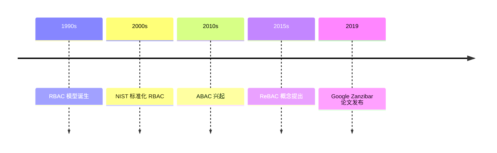

2019 年，某云服务商的一次误操作导致某政务云平台数据被批量删除。事后复盘发现，运维人员的账号拥有「删除任意数据」的权限——这个权限原本只应该在紧急情况下由安全管理员手动授权，却因为权限模型设计粗糙，被长期授予了普通运维角色。

权限模型的设计往往在项目初期被草率对待，却在业务增长后成为安全与合规的噩梦。从简单的 RBAC 到精细化的 ABAC，从开源的 Casbin 到 Google 内部的 Zanzibar，本章节将系统梳理权限控制领域的技术演进与最佳实践。

## 核心内容概述

### 权限模型演进



权限模型经历了从粗粒度到细粒度、从静态到动态的��进：

| 模型 | 全称 | 特点 | 适用场景 |
|---|---|---|---|
| RBAC | 基于角色的访问控制 | 角色→权限，简化管理 | 通用场景、权限稳定 |
| ABAC | 基于属性的访问控制 | 主体+资源+环境属性动态决策 | 复杂权限、细粒度控制 |
| ReBAC | 基于关系的访问控制 | 图关系建模（文件夹/分享） | 社交系统、协作平台 |
| Zanzibar | Google 授权系统 | 宽松一致性、全球规模 | 超大规模多租户 |

### RBAC：经典与陷阱

RBAC 看似简单，却藏着几个深坑：

- **角色爆炸**：业务复杂后角色数指数增长，出现「普通管理员」「高级管理员」「特殊权限管理员」等难以维护的角色。
- **权限继承混乱**：子角色继承父角色权限时，边界不清晰，容易出现越权。
- **最小权限原则违反**：角色权限通常是「够用原则」而非「刚好够用」，长期积累导致过度授权。

详见 [RBAC 深度解析](./rbac) 和 [RBAC 设计最佳实践](./rbac-best-practices)。

### ABAC：灵活与复杂度

当 RBAC 满足不了需求时，ABAC 通过属性（用户属性、资源属性、环境属性）动态计算权限。它的优势是表达能力极强，劣势是策略管理和性能都是挑战。详见 [ABAC 详解](./abac) 和 [ABAC 策略设计](./abac-policies)。

### OPA：策略即代码

Open Policy Agent（OPA）将策略逻辑从应用代码中抽离出来，以声明式 Rego 语言表达。配合 Gatekeeper，可在 Kubernetes 环境中实现Admission Control。详见 [OPA 深度解析](./opa) 和 [OPA 与 Kubernetes 集成](./opa-k8s)。

### Casbin：轻量级权限框架

Casbin 是一个支持多种访问控制模型的 Go 语言库，通过模型配置文件（.conf）而非代码来定义权限逻辑。详见 [Casbin 权限框架](./casbin)。

## 子主题列表

### 模型基础

- [授权模型概述](./overview)
- [RBAC（基于角色的访问控制）](./rbac)
- [RBAC 设计最佳实践](./rbac-best-practices)
- [ABAC（基于属性的访问控制）](./abac)
- [ABAC 策略设计](./abac-policies)
- [RBAC vs ABAC 对比](./rbac-vs-abac)

### 高级模型

- [ReBAC（基于关系的访问控制）](./rebac)
- [Google Zanzibar 论文解析](./zanzibar)

### 策略引擎

- [OPA（Open Policy Agent）深度解析](./opa)
- [Rego 策略语言语法](./rego)
- [OPA 集成实战](./opa-integration)
- [OPA 与 Kubernetes 集成](./opa-k8s)

### 开源框架

- [Casbin 权限框架](./casbin)
- [Casbin 模型配置](./casbin-model)

### 工程实践

- [权限审计与日志](./audit)
- [权限缓存与性能优化](./caching)
- [分布式权限设计](./distributed)
- [API 网关权限控制](./api-gateway)

## 思考题

**问题 1**：为什么 Google 选择自研 Zanzibar 而不是使用现有的开源方案（如 OPA）？

<details>
<summary>参考答案</summary>

Google Zanzibar 解决的核心问题是**超大规模 + 宽松一致性**的组合需求：

1. **全球一致性要求**：YouTube、Google Drive 等产品的权限系统需要服务全球数十亿用户，权限数据需要在全球多个数据中心保持同步。Zanzibar 采用 Paxos 复制的 Slotted Leaf Node 结构，保证最终一致性。
2. **超低延迟要求**：权限检查是热路径，Zanzibar 优化了 ZooKeeper 不擅长的「前缀匹配」场景，通过 Chandy-Misra-Gals 分布式复制实现毫秒级响应。
3. **复杂关系建模**：Google 内部有大量「文件夹-文档-分享」的层级和关系型权限，Zanzibar 的 Namespace-Tuple-Object-Subject 四元组模型天然支持这种场景。
4. **一致性隔离**：不同租户可以配置不同的 ZooKeeper 服务器，实现隔离。

开源方案（如 OPA）更适合中等规模场景，Google 的规模需求超出了通用开源方案的边界。

</details>

**问题 2**：在 RBAC 系统中，「审计权限」应该授予什么角色？审计员需要看到什么？

<details>
<summary>参考答案</summary>

这是一个经典的权限设计问题。

**审计员的权限设计**：

1. **只读权限**：审计员不应拥有任何写权限（创建/修改/删除）。
2. **分离审计数据**：审计日志本身需要受保护，普通管理员不能删除或篡改日志。可使用独立存储，审计员有读取权限。
3. **最小知情原则**：审计员通常只需要看到「谁在什么时间访问了什么资源」，不需要看到资源内容。

**审计内容**：

| 审计维度 | 说明 |
|---|---|
| 认证事件 | 登录/登出/MFA 验证 |
| 授权决策 | 权限检查通过/拒绝的请求 |
| 敏感操作 | 文件删除、配置变更、用户管理 |
| 异常行为 | 失败登录、权限提升尝试 |

**常见陷阱**：
- 审计员角色混入写权限 → 审计记录可被篡改
- 审计日志存储在业务库 → 管理员可删除
- 审计员能看到数据内容 → 违反最小知情原则

</details>

**问题 3**：假设你需要为一个 SaaS 多租户系统设计权限模型，其中租户 A 的管理员能否访问租户 B 的数据？

<details>
<summary>参考答案</summary>

答案是 **绝对不能**，这是多租户安全的核心要求。

**多层隔离设计方案**：

1. **租户标识作为强制属性**：在 ABAC 策略中，`tenant_id` 应作为强制检查字段，任何权限决策必须包含租户隔离校验。
2. **数据隔离**：
   - 方案 A：每个租户独立数据库（最强隔离，但成本高）
   - 方案 B：数据库行级隔离（通过 `tenant_id` 字段过滤）
   - 方案 C：Schema 隔离（PostgreSQL Schema）
3. **权限预检查**：在 OPA/Casbin 策略中，第一条规则永远是 `tenant_id 匹配`：

```ruby
package authz

default allow = false

allow {
    input.tenant_id == data.tenant_id
    input.user_id == data.user_id
    input.action == data.action
}
```

**常见错误**：

- 只在前端做租户隔离，后端 API 无验证（攻击者可绕过）
- 缓存 key 未包含 tenant_id（不同租户数据串读）
- 内部服务调用未传递 tenant_id（内部滥用）

</details>