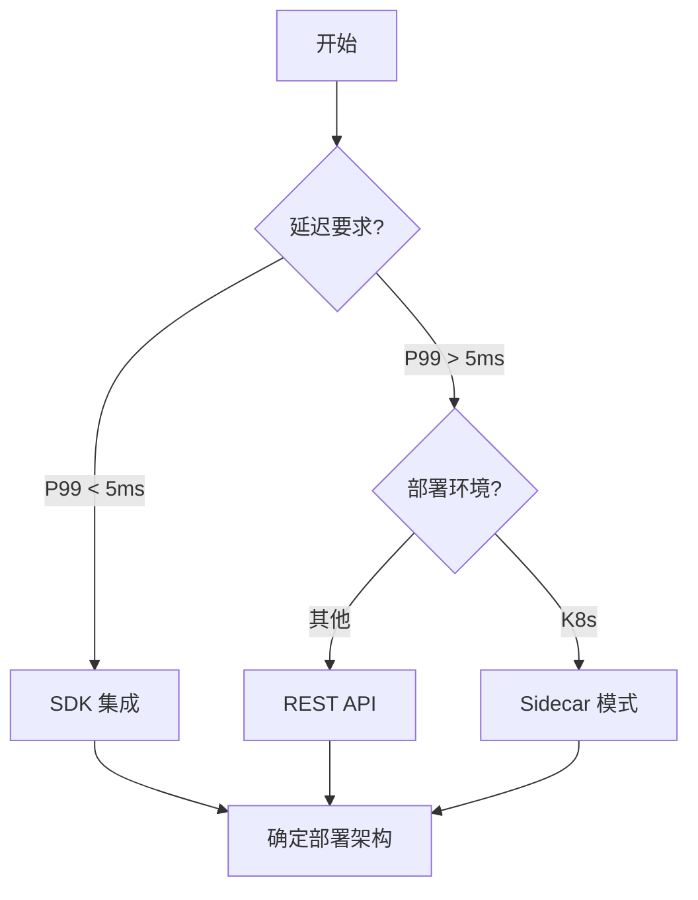
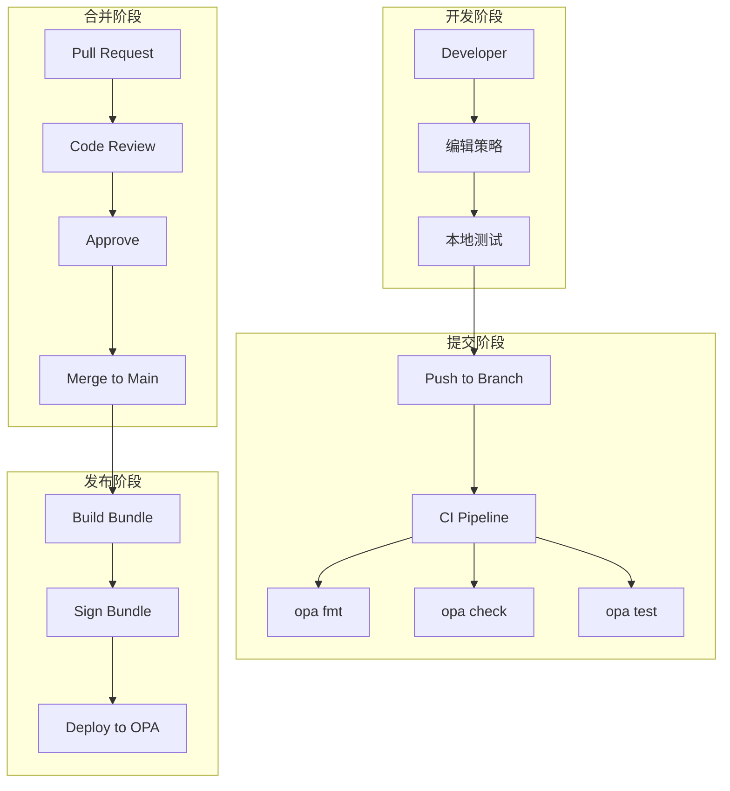
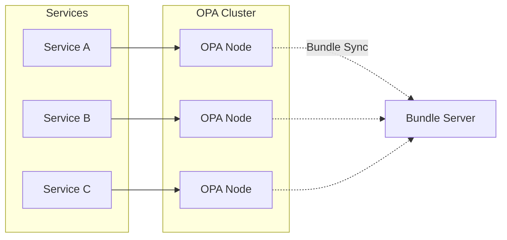
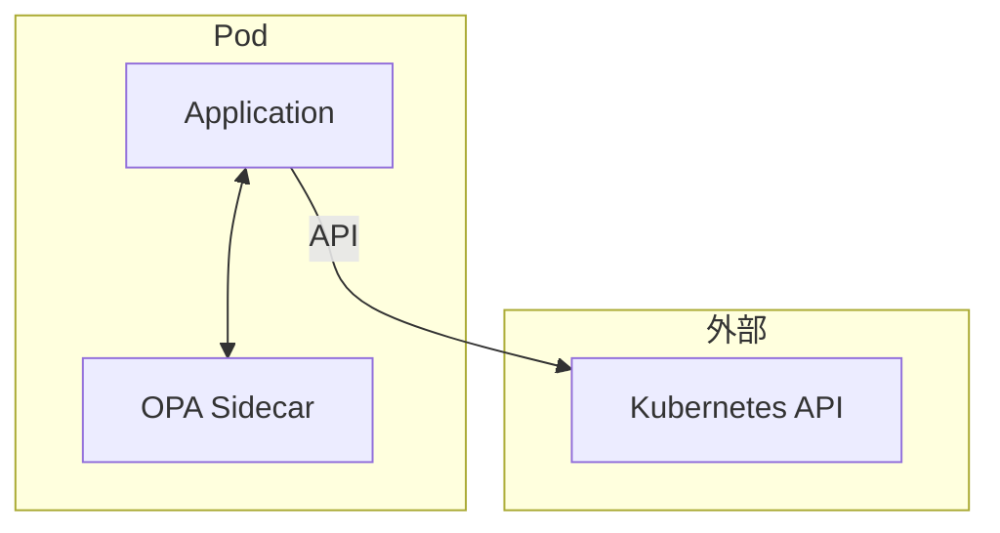
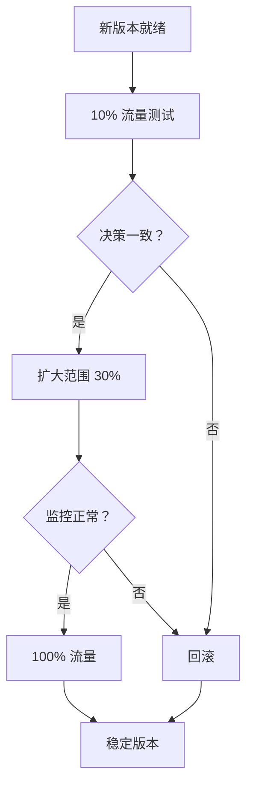

一个微服务团队决定将权限逻辑从硬编码迁移到 OPA。工程师们发现，最大的挑战不是 OPA 本身，而是**如何让策略变更与代码部署解耦，同时保持足够的测试覆盖和监控**。

这一篇，我们来实战解决这些问题。

## 一、集成方式选择

### 1.1 三种集成方式对比

| 方式 | 延迟 | 复杂度 | 适用场景 |
|------|------|--------|---------|
| REST API | 中等 | 低 | 快速集成、独立部署 |
| SDK (本地) | 低 | 中 | 微服务、高性能 |
| Sidecar | 低 | 高 | Kubernetes 环境 |

### 1.2 决策树



## 二、Java SDK 集成

### 2.1 依赖配置

```xml title="Maven 依赖")
<dependency>
    <groupId>org.openpolicyagent</groupId>
    <artifactId>opa4j-core</artifactId>
    <version>${opa4j.version}</version>
</dependency>

<dependency>
    <groupId>com.squareup.okhttp3</groupId>
    <artifactId>okhttp</artifactId>
    <version>4.12.0</version>
</dependency>
```

### 2.2 OPA 连接配置

```java title="OPA 配置")
@Configuration
public class OPAConfig {
    
    @Value("${opa.server.url:http://localhost:8181}")
    private String opaServerUrl;
    
    @Bean
    public OPAClient opaClient() {
        return OPAClient.builder()
            .serverUrl(opaServerUrl)
            .timeout(5, TimeUnit.SECONDS)
            .retry(3)  // 重试次数
            .build();
    }
}
```

### 2.3 权限服务实现

```java title="AuthorizationService.java")
@Service
@Slf4j
public class AuthorizationService {
    
    private final OPAClient opaClient;
    private final Cache<String, Boolean> permissionCache;
    
    public AuthorizationService(OPAClient opaClient) {
        this.opaClient = opaClient;
        this.permissionCache = Caffeine.newBuilder()
            .maximumSize(10000)
            .expireAfterWrite(30, TimeUnit.SECONDS)
            .build();
    }
    
    /**
     * 权限���查
     */
    public AuthorizationResult authorize(AccessRequest request) {
        String cacheKey = buildCacheKey(request);
        
        // 尝试从缓存获取
        Boolean cached = permissionCache.getIfPresent(cacheKey);
        if (cached != null) {
            return AuthorizationResult.builder()
                .allowed(cached)
                .fromCache(true)
                .build();
        }
        
        // 调用 OPA
        long startTime = System.currentTimeMillis();
        
        try {
            OPARequest opaRequest = OPARequest.builder()
                .path("app/authz/allow")
                .input(buildOPAInput(request))
                .build();
            
            OPAResponse response = opaClient.evaluate(opaRequest);
            
            boolean allowed = response.getBoolean("result").orElse(false);
            
            // 缓存结果
            permissionCache.put(cacheKey, allowed);
            
            return AuthorizationResult.builder()
                .allowed(allowed)
                .fromCache(false)
                .latencyMs(System.currentTimeMillis() - startTime)
                .build();
                
        } catch (OPAException e) {
            log.error("OPA evaluation failed", e);
            // 失败时保守拒绝
            return AuthorizationResult.builder()
                .allowed(false)
                .error(e.getMessage())
                .build();
        }
    }
    
    private String buildCacheKey(AccessRequest request) {
        return String.format("%s:%s:%s:%s",
            request.getUserId(),
            request.getResourceType(),
            request.getResourceId(),
            request.getAction());
    }
    
    private Map<String, Object> buildOPAInput(AccessRequest request) {
        Map<String, Object> input = new HashMap<>();
        
        input.put("user", Map.of(
            "id", request.getUserId(),
            "roles", request.getRoles(),
            "department", request.getDepartment(),
            "clearance_level", request.getClearanceLevel()
        ));
        
        input.put("resource", Map.of(
            "type", request.getResourceType(),
            "id", request.getResourceId(),
            "classification", request.getClassification(),
            "owner", request.getOwner()
        ));
        
        input.put("action", request.getAction());
        
        input.put("environment", Map.of(
            "timestamp", Instant.now().toString(),
            "ip_address", request.getClientIp()
        ));
        
        return input;
    }
}
```

### 2.4 Spring Security 集成

```java title="OPA WebSecurityConfig.java")
@Configuration
@EnableWebSecurity
public class OPAWebSecurityConfig {
    
    @Autowired
    private AuthorizationService authorizationService;
    
    @Bean
    public SecurityFilterChain filterChain(HttpSecurity http) throws Exception {
        http
            .csrf(csrf -> csrf.disable())
            .sessionManagement(session -> 
                session.sessionCreationPolicy(SessionCreationPolicy.STATELESS))
            .authorizeHttpRequests(auth -> auth
                .requestMatchers("/health", "/actuator/**").permitAll()
                .requestMatchers("/api/**").authenticated()
                .anyRequest().permitAll()
            )
            .addFilterBefore(new OPAAuthorizationFilter(authorizationService),
                UsernamePasswordAuthenticationFilter.class);
        
        return http.build();
    }
}
```

```java title="OPAAuthorizationFilter.java")
@Slf4j
public class OPAAuthorizationFilter extends OncePerRequestFilter {
    
    private final AuthorizationService authorizationService;
    
    @Override
    protected void doFilterInternal(HttpServletRequest request,
                                    HttpServletResponse response,
                                    FilterChain chain) 
            throws ServletException, IOException {
        
        String path = request.getRequestURI();
        String method = request.getMethod();
        
        // 构建访问请求
        AccessRequest accessRequest = AccessRequest.builder()
            .userId(getCurrentUserId(request))
            .resourceType(extractResourceType(path))
            .resourceId(extractResourceId(path))
            .action(mapHttpMethodToAction(method))
            .clientIp(request.getRemoteAddr())
            .build();
        
        // OPA 权限检查
        AuthorizationResult result = authorizationService.authorize(accessRequest);
        
        if (!result.isAllowed()) {
            log.warn("Access denied: user={}, path={}, action={}",
                accessRequest.getUserId(), path, method);
            
            response.setStatus(HttpServletResponse.SC_FORBIDDEN);
            response.getWriter().write("{\"error\":\"Access denied\"}");
            return;
        }
        
        // 记录审计日志
        if (result.getLatencyMs() != null) {
            log.info("Access audit: user={}, path={}, latency={}ms",
                accessRequest.getUserId(), path, result.getLatencyMs());
        }
        
        chain.doFilter(request, response);
    }
}
```

## 三、Go SDK 集成

### 3.1 依赖配置

```go title="go.mod")
require (
    github.com/open-policy-agent/frameworks/constraint v0.0.0-20240101
    github.com/open-policy-agent/opa v0.64.1
)
```

### 3.2 集成实现

```go title="opa_client.go")
package authz

import (
    "context"
    "time"
    
    "github.com/open-policy-agent/opa/rego"
)

type OPAClient struct {
    client *rego.Rego
}

func NewOPAClient(policyPath string) *OPAClient {
    rego := rego.New(
        rego.Query("data.app.authz.allow"),
        rego.LoadBundle(policyPath),
    )
    
    return &OPAClient{client: rego}
}

func (c *OPAClient) Evaluate(ctx context.Context, input map[string]interface{}) (bool, error) {
    query := c.client.WithInput(input)
    
    rs, err := query.Eval(ctx)
    if err != nil {
        return false, err
    }
    
    if len(rs) == 0 || len(rs[0].Expressions) == 0 {
        return false, nil
    }
    
    result, ok := rs[0].Expressions[0].(bool)
    if !ok {
        return false, nil
    }
    
    return result, nil
}

type AuthorizationService struct {
    client *OPAClient
}

func NewAuthorizationService(client *OPAClient) *AuthorizationService {
    return &AuthorizationService{client: client}
}

func (s *AuthorizationService) Authorize(ctx context.Context, req *AccessRequest) (*AuthorizationResult, error) {
    input := map[string]interface{}{
        "user": map[string]interface{}{
            "id":         req.UserID,
            "roles":      req.Roles,
            "department": req.Department,
        },
        "resource": map[string]interface{}{
            "type":          req.ResourceType,
            "id":            req.ResourceID,
            "classification": req.Classification,
        },
        "action": req.Action,
        "environment": map[string]interface{}{
            "timestamp": time.Now().UTC(),
            "ip":        req.ClientIP,
        },
    }
    
    start := time.Now()
    
    allowed, err := s.client.Evaluate(ctx, input)
    
    return &AuthorizationResult{
        Allowed:   allowed,
        LatencyMs: time.Since(start).Milliseconds(),
        Error:     err,
    }, err
}
```

## 四、Bundle API 与动态策略加载

### 4.1 Bundle 服务端

```bash title="Bundle 服务启动")
# 启动 OPA Bundle 服务器
opa bundle serve --port 8182 ./policies

# 自动签名验证
opa bundle serve --verification-key ./keys/pub.pem ./policies
```

### 4.2 客户端配置

```yaml title="OPA Bundle 配置")
services:
  bundle:
    url: http://bundle-server:8182
    credentials:
      bearer:
        token: "${BUNDLE_TOKEN}"

bundles:
  app:
    service: bundle
    resource: /app/authz/bundle.tar.gz
    persist: true
    force: true
```

### 4.3 动态重载

```bash title="触发 Bundle 重载")
# 推送新 Bundle
curl -X POST http://bundle-server:8182/v1/bundles/app/refresh

# 或者通过 OPA API
curl -X POST http://opa-server:8181/v1/bundles/app/refresh
```

## 五、策略即代码工作流

### 5.1 目录结构

```
policies/
├── .github/
│   └── workflows/
│       └── policy-ci.yml
├── Makefile
├── tests/
│   ├── authz_test.rego
│   └── rbac_test.rego
├── policies/
│   ├── app/
│   │   ├── authz.rego
│   │   └── authz_test.rego
│   ├── k8s/
│   │   └── admission.rego
│   └── network/
│       └── firewall.rego
└── .opa/
    └── fmt-config.yaml
```

### 5.2 CI/CD 流程



### 5.3 GitHub Actions 配置

```yaml title=".github/workflows/policy-ci.yml")
name: Policy CI

on:
  push:
    branches: [main]
    paths: ['policies/**']
  pull_request:
    paths: ['policies/**']

jobs:
  test:
    runs-on: ubuntu-latest
    steps:
      - uses: actions/checkout@v4
      
      - name: Download OPA
        run: |
          curl -L -o opa https://openpolicyagent.org/downloads/v0.64.1/opa_linux_amd64
          chmod +x opa
      
      - name: Format Check
        run: ./opa fmt --diff policies/
      
      - name: Syntax Check
        run: ./opa check policies/
      
      - name: Unit Tests
        run: ./opa test -v policies/
      
      - name: Bundle Build
        run: |
          ./opa bundle build policies/ --output bundle.tar.gz
          
      - name: Upload Bundle
        if: github.ref == 'refs/heads/main'
        run: |
          # 上传到 Bundle 服务器
          curl -X PUT -T bundle.tar.gz \
            http://bundle-server:8182/v1/bundles/app
```

### 5.4 本地开发工具

```makefile title="Makefile")
.PHONY: help test fmt check bundle serve

OPA_VERSION := v0.64.1

test:
	./opa test -v ./policies/

fmt:
	./opa fmt ./policies/ --write

check:
	./opa check ./policies/

bundle:
	./opa bundle build ./policies/ --output bundle.tar.gz

serve:
	docker run -p 8181:8181 \
		-v $(PWD)/policies:/policies \
		-v $(PWD)/bundle.tar.gz:/bundle.tar.gz \
		openpolicyagent/opa:$(OPA_VERSION) \
		run --bundle /bundle.tar.gz --server
```

## 六、OPA 测试框架

### 6.1 测试用例设计

```ruby title="综合测试示例")
package app.authz

# ============ 管理员权限测试 ============

test_admin_can_access_all {
    allow with input as {
        "user": {"id": "admin-1", "role": "admin"},
        "resource": {"type": "database", "classification": "confidential"},
        "action": "delete"
    }
}

test_admin_can_bypass_restrictions {
    allow with input as {
        "user": {"id": "admin-2", "role": "admin"},
        "resource": {"type": "api", "classification": "internal"},
        "action": "write",
        "environment": {"hour": 3}  # 非工作时间
    }
}

# ============ 普通用户权限测试 ============

test_user_can_read_own_resource {
    allow with input as {
        "user": {"id": "user-1", "role": "user", "department": "engineering"},
        "resource": {"type": "document", "owner": "user-1"},
        "action": "read"
    }
}

test_user_cannot_delete {
    not allow with input as {
        "user": {"id": "user-1", "role": "user"},
        "resource": {"type": "database"},
        "action": "delete"
    }
}

test_user_cannot_access_other_department {
    not allow with input as {
        "user": {"id": "user-2", "role": "user", "department": "sales"},
        "resource": {"type": "document", "department": "engineering"},
        "action": "read"
    }
}

# ============ 拒绝条件测试 ============

test_reject_insufficient_clearance {
    not allow with input as {
        "user": {"id": "user-3", "clearance": 2},
        "resource": {"classification": "secret", "required_clearance": 4},
        "action": "read"
    }
}

test_reject_off_hours {
    not allow with input as {
        "user": {"id": "user-1", "role": "admin"},
        "resource": {"classification": "top_secret"},
        "action": "read",
        "environment": {"hour": 3}
    }
}
```

### 6.2 运行测试

```bash
# 运行所有测试
opa test -v ./policies/

# 运行特定包的测试
opa test -v ./policies/app/authz_test.rego

# 生成覆盖率报告
opa test --coverage ./policies/

# 输出测试覆盖率
opa test --coverage --format=json ./policies/ > coverage.json
```

### 6.3 测试覆盖报告

```bash
$ opa test --coverage ./policies/app/authz.rego ./policies/app/authz_test.rego

Coverage:
  app/authz.rego
    100% | █��██████████████████████████████████████ | 10/10
```

## 七、OPA 与微服务的集成模式

### 7.1 中央 OPA 模式



### 7.2 Sidecar 模式



:::tip 核心原则
OPA 集成的成功关键不在于技术，而在于**流程**——策略即代码的本质是让策略变更获得与代码变更同等的质量和安全保证。
:::

## 思考题

**问题 1**：在微服务架构中，如果 OPA 服务不可用，系统应该如何降级？设计一个优雅降级方案。

<details>
<summary>参考答案</summary>

降级策略设计：

**分层降级方案**：

| 层级 | 策略 | 说明 |
|------|------|------|
| 1. 正常 | OPA 决策 | 完全信任 OPA |
| 2. 降级 | 本地缓存 | 使用上次决策结果 |
| 3. 安全拒绝 | 默认拒绝 | 保守策略 |
| 4. 部分可用 | RBAC 兜底 | 使用应用内置权限 |

**代码实现**：

```java
public AuthorizationResult authorize(AccessRequest request) {
    try {
        return opaClient.evaluate(request);
    } catch (OPAException e) {
        log.error("OPA unavailable: {}", e.getMessage());
        
        // 尝试本地缓存
        Boolean cached = getCachedDecision(request);
        if (cached != null) {
            return AuthorizationResult.builder()
                .allowed(cached)
                .degraded(true)
                .note("使用缓存决策")
                .build();
        }
        
        // 降级到应用内 RBAC
        return fallbackRbacCheck(request);
    }
}
```

**关键指标**：
1. 降级次数
2. 降级决策命中率
3. 回滚恢复时间
</details>

**问题 2**：设计一个 OPA 策略的生命周期管理流程，包括版本控制、灰度发布和回滚。

<details>
<summary>参考答案</summary>

生命周期管理流程：

**版本控制**：
```
policy/v1.0.0/authz.rego
policy/v1.1.0/authz.rego
policy/v2.0.0/authz.rego
```

**灰度发布流程**：



**回滚机制**：
1. 保留历史版本的 Bundle
2. 快速切换到指定版本
3. 自动回滚阈值（错误率、延迟）
</details>
