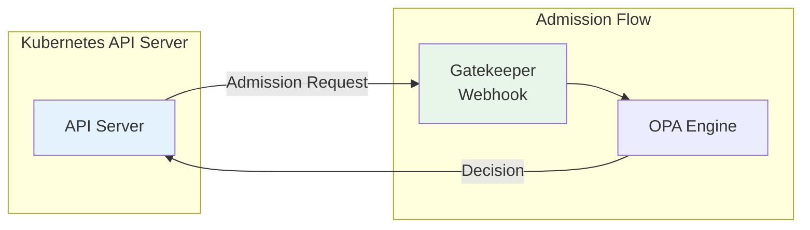
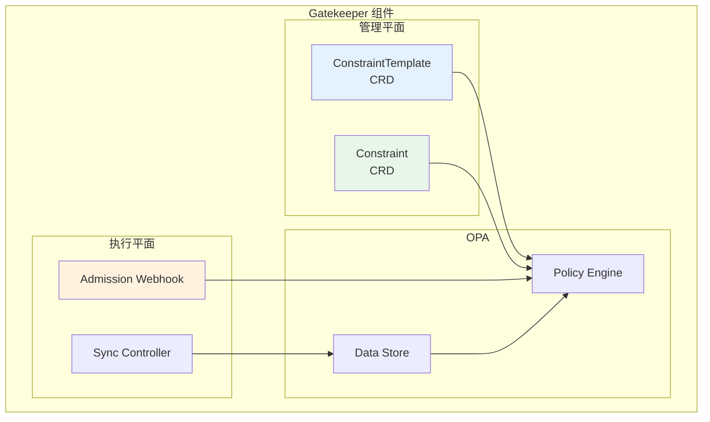
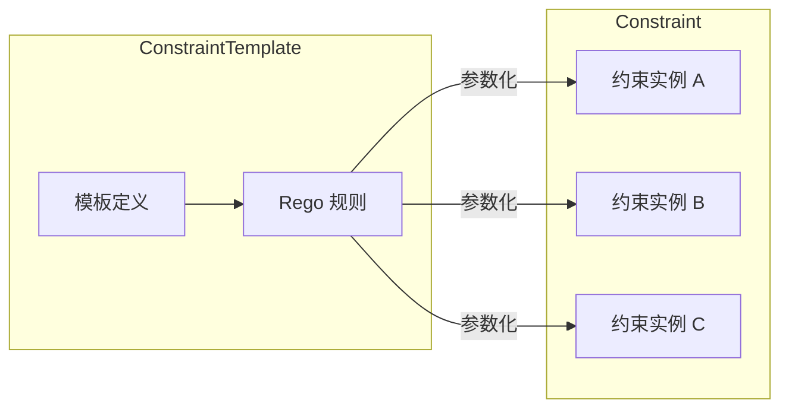
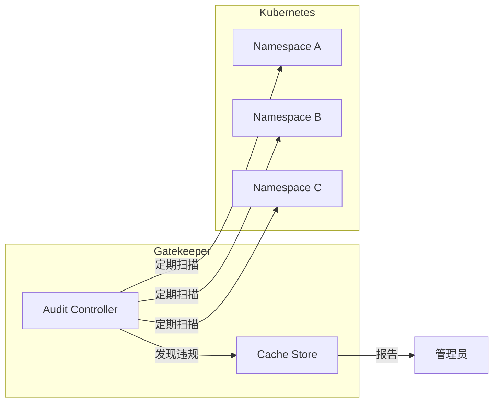
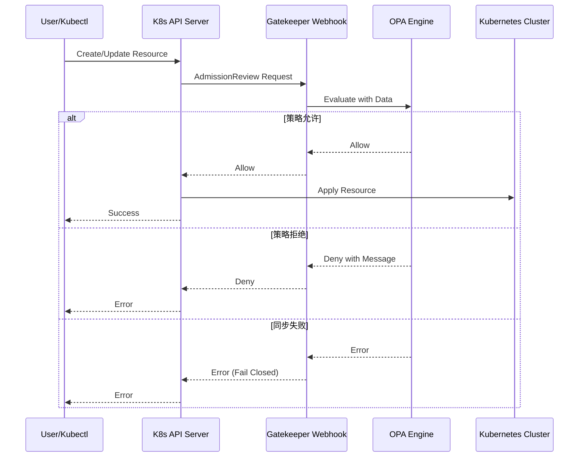

Kubernetes 集群中有数千个 Pod、几百个 Service、数百个 ConfigMap。每天都有开发者尝试部署不符合规范的资源：有的用特权模式运行容器，有的挂载敏感的配置密钥，有的使用过期的镜像版本。

传统方案是在 admission controller 中硬编码检查逻辑，但每次规则变更都需要修改代码并重新部署。OPA Gatekeeper 给出了另一种可能：**策略即代码，变更即部署**。

## 一、OPA Gatekeeper 简介

### 1.1 什么是 Gatekeeper

Gatekeeper 是 OPA 的 Kubernetes 专版实现，基于 Kubernetes Admission Webhook 机制工作：



### 1.2 Gatekeeper vs OPA 原生

| 维度 | Gatekeeper | OPA 原生 |
|------|-----------|----------|
| 部署方式 | K8s Operator | Daemon/Sidecar |
| 配置方式 | CRD | 配置/API |
| 策略语言 | Rego | Rego |
| 审计模式 | 内置 | 需要额外实现 |
| 与 K8s 集成 | 原生 | 需要适配 |

## 二、Gatekeeper 架构

### 2.1 核心组件



### 2.2 组件职责

| 组件 | 职责 |
|------|------|
| ConstraintTemplate | 定义策略模板，声明 Rego 规则 |
| Constraint | 实例化模板，创建具体约束 |
| Admission Webhook | 拦截 K8s 资源创建/更新请求 |
| Sync Controller | 将 K8s 资源同步到 OPA Data |

## 三、ConstraintTemplate 与 Constraint

### 3.1 关系说明



### 3.2 模板定义

```yaml title="ConstraintTemplate 示例")
apiVersion: templates.gatekeeper.sh/v1beta1
kind: ConstraintTemplate
metadata:
  name: k8srequiredlabels
spec:
  crd:
    spec:
      names:
        kind: K8sRequiredLabels
      validation:
        openAPIV3Schema:
          type: object
          properties:
            message:
              type: string
            labels:
              type: array
              items:
                type: object
                properties:
                  key:
                    type: string
                  allowedRegex:
                    type: string
  targets:
    - target: admission.k8s.gatekeeper.sh
      rego: |
        package kubernetes.admission
        
        deny[msg] {
          provided := {key | input.request.object.metadata.labels[key]}
          required := {key | input.parameters.labels[_].key}
          missing := required - provided
          count(missing) > 0
          msg := sprintf("Required labels missing: %v", [missing])
        }
        
        violation[msg] {
          provided := {key | input.request.object.metadata.labels[key]}
          required := {key | input.parameters.labels[_].key}
          missing := required - provided
          count(missing) > 0
          msg := sprintf("Required labels missing: %v", [missing])
        }
```

### 3.3 约束实例化

```yaml title="强制要求所有命名空间有 environment 标签")
apiVersion: constraints.gatekeeper.sh/v1beta1
kind: K8sRequiredLabels
metadata:
  name: require-environment-label
spec:
  match:
    kinds:
      - apiGroups: [""]
        kinds: ["Namespace"]
  parameters:
    labels:
      - key: environment
```

```yaml title="强制要求所有 Deployment 有 app 标签")
apiVersion: constraints.gatekeeper.sh/v1beta1
kind: K8sRequiredLabels
metadata:
  name: require-app-label
spec:
  match:
    kinds:
      - apiGroups: ["apps"]
        kinds: ["Deployment"]
  parameters:
    labels:
      - key: app
      - key: team
        allowedRegex: "^(frontend|backend|data)$"
```

## 四、资源策略示例

### 4.1 禁止特权容器

```yaml title="ConstraintTemplate")
apiVersion: templates.gatekeeper.sh/v1beta1
kind: ConstraintTemplate
metadata:
  name: prohibitprivilegedcontainers
spec:
  crd:
    spec:
      names:
        kind: ProhibitPrivilegedContainers
  targets:
    - target: admission.k8s.gatekeeper.sh
      rego: |
        package kubernetes.admission
        
        violation[msg] {
          container := input.request.object.spec.containers[_]
          container.securityContext.privileged == true
          msg := sprintf("Container %v is running in privileged mode", [container.name])
        }
        
        violation[msg] {
          container := input.request.object.spec.initContainers[_]
          container.securityContext.privileged == true
          msg := sprintf("Init container %v is running in privileged mode", [container.name])
        }
```

```yaml title="Constraint")
apiVersion: constraints.gatekeeper.sh/v1beta1
kind: ProhibitPrivilegedContainers
metadata:
  name: no-privileged-containers
spec:
  match:
    kinds:
      - apiGroups: [""]
        kinds: ["Pod"]
    excludedNamespaces: ["kube-system"]
```

### 4.2 强制资源限制

```yaml title="ConstraintTemplate")
apiVersion: templates.gatekeeper.sh/v1beta1
kind: ConstraintTemplate
metadata:
  name: requirelimits
spec:
  crd:
    spec:
      names:
        kind: RequireLimits
      validation:
        openAPIV3Schema:
          type: object
          properties:
            limits:
              type: array
              items:
                type: object
                properties:
                  cpu:
                    type: string
                  memory:
                    type: string
  targets:
    - target: admission.k8s.gatekeeper.sh
      rego: |
        package kubernetes.admission
        
        violation[msg] {
          container := input.request.object.spec.containers[_]
          not container.resources.limits
          msg := sprintf("Container %v has no resource limits", [container.name])
        }
        
        violation[msg] {
          container := input.request.object.spec.containers[_]
          container.resources.limits
          limit := container.resources.limits
          not limit.cpu
          msg := sprintf("Container %v has no CPU limit", [container.name])
        }
```

```yaml title="Constraint")
apiVersion: constraints.gatekeeper.sh/v1beta1
kind: RequireLimits
metadata:
  name: require-resource-limits
spec:
  match:
    kinds:
      - apiGroups: [""]
        kinds: ["Pod"]
    excludedNamespaces: ["kube-system", "kube-public"]
  parameters:
    limits:
      - cpu: "100m"
        memory: "256Mi"
```

### 4.3 存储类限制

```yaml title="禁止使用某些存储类")
apiVersion: templates.gatekeeper.sh/v1beta1
kind: ConstraintTemplate
metadata:
  name: restrictstorageclass
spec:
  crd:
    spec:
      names:
        kind: RestrictStorageClass
      validation:
        openAPIV3Schema:
          type: object
          properties:
            deniedStorageClasses:
              type: array
              items:
                type: string
  targets:
    - target: admission.k8s.gatekeeper.sh
      rego: |
        package kubernetes.admission
        
        violation[msg] {
          storage_class := input.request.object.spec.storageClassName
          denied := input.parameters.deniedStorageClasses[_]
          storage_class == denied
          msg := sprintf("Storage class %v is not allowed", [storage_class])
        }
```

```yaml title="Constraint")
apiVersion: constraints.gatekeeper.sh/v1beta1
kind: RestrictStorageClass
metadata:
  name: deny-gold-storage
spec:
  match:
    kinds:
      - apiGroups: [""]
        kinds: ["PersistentVolumeClaim"]
  parameters:
    deniedStorageClasses:
      - gold
      - platinum
```

### 4.4 服务类型白名单

```yaml title="服务类型白名单")
apiVersion: templates.gatekeeper.sh/v1beta1
kind: ConstraintTemplate
metadata:
  name: restrictservicetype
spec:
  crd:
    spec:
      names:
        kind: RestrictServiceType
      validation:
        openAPIV3Schema:
          type: object
          properties:
            allowedTypes:
              type: array
              items:
                type: string
  targets:
    - target: admission.k8s.gatekeeper.sh
      rego: |
        package kubernetes.admission
        
        violation[msg] {
          service_type := input.request.object.spec.type
          not service_type in input.parameters.allowedTypes
          msg := sprintf("Service type %v is not allowed. Allowed types: %v", 
            [service_type, input.parameters.allowedTypes])
        }
```

```yaml title="Constraint")
apiVersion: constraints.gatekeeper.sh/v1beta1
kind: RestrictServiceType
metadata:
  name: restrict-service-type
spec:
  match:
    kinds:
      - apiGroups: [""]
        kinds: ["Service"]
  parameters:
    allowedTypes:
      - ClusterIP
      - NodePort
```

## 五、Audit 模式

### 5.1 Audit 工作原理



### 5.2 Audit 配置

```yaml title="Gatekeeper Audit 配置")
apiVersion: config.gatekeeper.sh/v1alpha1
kind: Config
metadata:
  name: config
  namespace: gatekeeper-system
spec:
  sync:
    syncOnly:
      - group: ""
        version: "v1"
        kind: "Namespace"
      - group: ""
        version: "v1"
        kind: "ServiceAccount"
```

### 5.3 查看违规

```bash
# 查看所有违规
kubectl get constraintviolations

# 查看特定约束的违规
kubectl get constraintviolations -l constraint=require-environment-label

# 查看详细违规信息
kubectl describe constraintviolations require-environment-label
```

### 5.4 同步与变更追踪

```yaml title="Sync Controller 配置")
apiVersion: config.gatekeeper.sh/v1alpha1
kind: Config
metadata:
  name: config
  namespace: gatekeeper-system
spec:
  sync:
    syncOnly:
      # 同步这些资源到 OPA Data
      - group: ""
        version: "v1"
        kind: "Namespace"
      - group: "networking.k8s.io"
        version: "v1"
        kind: "NetworkPolicy"
```

## 六、Admission 流程图



## 七、常见问题与调试

### 7.1 调试工具

```bash
# 查看 Gatekeeper 日志
kubectl logs -n gatekeeper-system -l control-plane=controller-manager

# 查看 Webhook 调用日志
kubectl logs -n gatekeeper-system -l gatekeeper.sh/operation=webhook

# 测试约束匹配
kubectl gatekeeper trace <resource.yaml
```

### 7.2 常见错误

| 错误 | 原因 | 解决方案 |
|------|------|---------|
| `no matching constraints` | 没有适用的 Constraint | 检查 match 条件 |
| `constraint template not found` | 模板未创建 | 先创建 ConstraintTemplate |
| `sync failed` | 数据同步失败 | 检查 Config 配置 |
| `webhook timeout` | OPA 评估超时 | 优化 Rego 性能 |

### 7.3 性能优化

```ruby title="性能优化示例")
# 避免全量扫描
violation[msg] {
  # 只检查特定资源
  input.request.kind.kind == "Pod"
  input.request.operation == "CREATE"
  
  container := input.request.object.spec.containers[_]
  container.securityContext.privileged == true
  msg := sprintf("Container %v is privileged", [container.name])
}
```

:::tip 核心原则
Gatekeeper 的最佳实践是**「先审计后强制」**。新策略先用 Audit 模式运行一段时间，确认没有误报后再启用强制模式。
:::

## 思考题

**问题 1**：在生产环境中部署 Gatekeeper 时，如何平衡「强制执行」与「不阻塞业务」之间的矛盾？

<details>
<summary>参考答案</summary>

**分阶段部署策略**：

**阶段一：监控模式（1-2 周）**
- 部署 Constraint 但不启用 enforcement
- 收集违规数据
- 修复明显问题
- 分析误报原因

**阶段二：警告模式（1 周）**
- 启用 enforcement 但设置宽限期
- 发送通知但不阻止
- 让开发者有时间修复

**阶段三：强制模式**
- 逐步扩大范围
- 关键路径先强制
- 非关键路径保持宽松

**关键保障**：
1. 提供快速豁免流程
2. 设置宽限期（24-48 小时）
3. 完善的告警通知
4. 清晰的错误消息
</details>

**问题 2**：设计一个机制，让 Gatekeeper 能够根据不同的环境（dev/staging/prod）���用不同的策略集。

<details>
<summary>参考答案</summary>

**设计方案**：

**方案一：基于命名空间标签**

```yaml
# namespace.yaml
apiVersion: v1
kind: Namespace
metadata:
  name: production
  labels:
    environment: prod
    enforcement-mode: strict

apiVersion: v1
kind: Namespace
metadata:
  name: development
  labels:
    environment: dev
    enforcement-mode: advisory
```

```ruby
# 策略中检查环境标签
violation[msg] {
  ns := input.request.namespace
  ns_data := data.namespace[ns]
  ns_data.labels.enforcement-mode == "strict"
  
  container := input.request.object.spec.containers[_]
  container.securityContext.privileged == true
  msg := sprintf("Container %v is privileged", [container.name])
}
```

**方案二：独立的 Constraint 集合**

```
constraints/
├── base/           # 所有环境通用
│   ├── no-privileged.yaml
│   └── require-labels.yaml
├── production/     # 生产环境
│   └── strict-resources.yaml
└── development/     # 开发环境
    └── relaxed-resources.yaml
```

**方案三：参数化约束**

```yaml
# 所有环境使用同一个模板，通过参数区分
apiVersion: constraints.gatekeeper.sh/v1beta1
kind: RequireLimits
metadata:
  name: prod-require-limits
spec:
  match:
    namespaces: ["production"]
  parameters:
    mode: "strict"  # strict vs advisory
```
</details>
