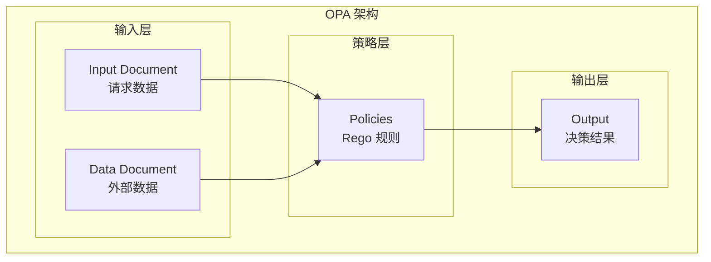
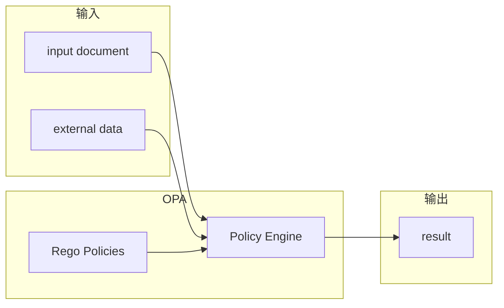
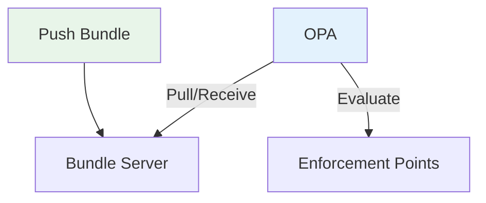
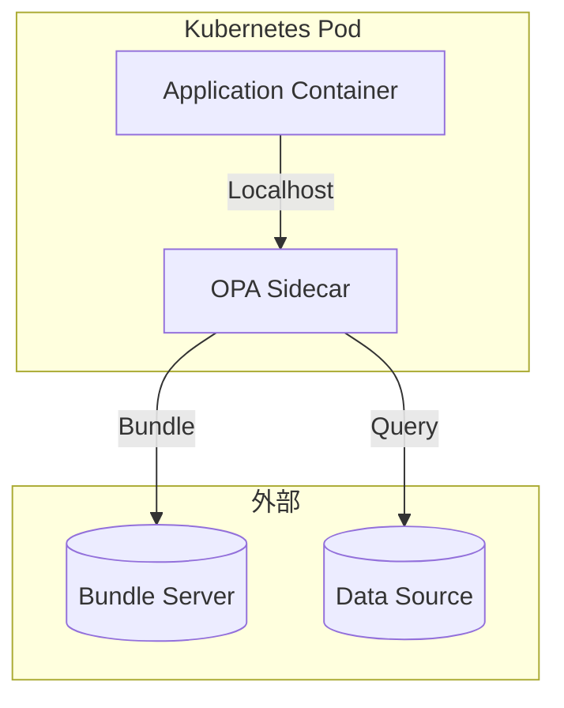
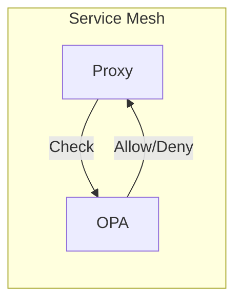

凌晨 3 点，某云服务商的工程师被告警叫醒：Kubernetes 集群中一个 Pod 试图以特权模式运行。这个请求被拒绝了——但不是 Kubernetes 本身拒绝的，而是集群外部的一个策略引擎在 5ms 内做出了决策，并将结果推送到所有节点。

这就是 Open Policy Agent（OPA）的魔力：一个与语言无关、策略即代码的通用策略引擎。

## 一、OPA 定位与设计理念

### 1.1 什么是 OPA

OPA 是一个开源的通用策略引擎，用于统一跨系统的策略执行。

```
┌─────────────────────────────────────────────────────┐
│                    OPA                              │
│         通用策略执行层                               │
├─────────────────────────────────────────────────────┤
│                                                     │
│   Kubernetes    API Gateway    Microservices        │
│       ↓              ↓              ↓               │
│                                                     │
│   ┌─────────────────────────────────────────────┐   │
│   │            Policy Engine                    │   │
│   │         (Rego 策略语言)                     │   │
│   └─────────────────────────────────────────────┘   │
│                                                     │
└─────────────────────────────────────────────────────┘
```

### 1.2 策略即代码

OPA 的核心理念：**策略应该像代码一样被管理**。

| 传统模式 | 策略即代码 |
|---------|-----------|
| 配置存储在数据库 | 策略存储在代码仓库 |
| 手动修改配置 | 通过 PR 修改策略 |
| 无版本控制 | Git 版本控制 |
| 无代码审查 | 代码审查流程 |
| 难以测试 | 自动化测试 |

### 1.3 核心优势

| 优势 | 说明 |
|------|------|
| 语言无关 | 任何系统都可以集成 |
| 解耦部署 | 策略变更无需修改应用 |
| 统一模型 | 跨系统使用相同策略语言 |
| 可测试 | 支持单元测试和集成测试 |
| 可审计 | 完整的变更历史 |
| 云原生 | 原生支持 K8s 和云环境 |

## 二、OPA 架构

### 2.1 核心组件



### 2.2 决策模型

OPA 的决策非常简单：**给定输入 + 数据 + 策略 = 结果**。



## 三、输入模型

### 3.1 Input Document

Input 是每次请求必须提供的上下文：

```json title="Input 示例")
{
  "input": {
    "user": {
      "id": "user-123",
      "role": "developer",
      "department": "engineering"
    },
    "resource": {
      "type": "database",
      "name": "prod-users",
      "classification": "confidential"
    },
    "action": "delete",
    "environment": {
      "ip": "192.168.1.100",
      "timestamp": "2026-04-09T10:30:00Z"
    }
  }
}
```

### 3.2 Data Document

Data 是 OPA 缓存的外部数据：

```json title="Data 示例")
{
  "data": {
    "users": {
      "user-123": {
        "clearance_level": 3,
        "manager": "user-456"
      }
    },
    "resources": {
      "databases": {
        "prod-users": {
          "owner": "team-infra",
          "environment": "production"
        }
      }
    },
    "policies": {
      "confidential_delete": {
        "allowed_roles": ["security_admin", "dba"],
        "require_mfa": true
      }
    }
  }
}
```

### 3.3 完整查询请求

```bash title="OPA 查询 API")
curl -X POST http://localhost:8181/v1/data/app/allow \
  -H 'Content-Type: application/json' \
  -d '{
    "input": {
      "user": { "id": "user-123", "role": "developer" },
      "resource": { "type": "database", "name": "prod-users" },
      "action": "delete"
    }
  }'
```

```json title="响应")
{
  "result": false,
  "explanation": {
    "reason": "Role developer is not authorized to delete confidential databases"
  }
}
```

## 四、输出模型

### 4.1 标准布尔结果

最简单的输出是布尔值：

```json
{ "result": true }
```

或

```json
{ "result": false }
```

### 4.2 结构化结果

更复杂的场景可以返回结构化数据：

```json
{
  "result": {
    "allowed": true,
    "filters": [
      { "field": "status", "operator": "eq", "value": "active" },
      { "field": "department", "operator": "eq", "value": "engineering" }
    ],
    "rate_limit": {
      "requests_per_minute": 100,
      "burst": 20
    }
  }
}
```

### 4.3 多维度决策

```json
{
  "result": {
    "allow": true,
    "audit": {
      "required": true,
      "retention_days": 90
    },
    "mfa": {
      "required": true
    },
    "notification": {
      "channels": ["email", "slack"],
      "recipients": ["security-team"]
    }
  }
}
```

## 五、部署模式

### 5.1 Daemon 模式

作为独立服务运行：

```mermaid
flowchart LR
    subgraph "应用"
        APP[Application]
    end
    
    subgraph "OPA"
        OPA[OPA Daemon]
    end
    
    subgraph "外部数据"
        DB[(Database)]
        ID[(LDAP)]
    end
    
    APP -->|HTTP API| OPA
    OPA -->|Pull Data| DB
    OPA -->|Pull Data| ID
```

**适用场景**：
- 微服务架构
- API 权限控制
- 简单集成

```yaml title="OPA Daemon 配置")
services:
  - name: ldap
    url: http://ldap.internal
    type: openidms

datasources:
  - name: users
    service: ldap
    path: /users
    resource:
      - /users
```

### 5.2 Bundle 模式

将策略打包部署：

```
policy_bundle.tar.gz
├── .manifest
├── app/
│   ├── authz.rego
│   └── authz_test.rego
├── k8s/
│   ├── admission.rego
│   └── admission_test.rego
└── network/
    ├── firewall.rego
    └── firewall_test.rego
```

**部署流程**：



### 5.3 Sidecar 模式

与应用容器部署在同一 Pod：



**优势**：
- 网络延迟低
- 不依赖外部服务
- 独立扩缩容

### 5.4 Embedded 模式

将 OPA 嵌入到应用中：

```java title="Java SDK 集成")
import org.openpolicyagent.opa.*;

public class AuthorizationService {
    
    private OPA opa;
    
    public AuthorizationService() {
        opa = OPA.builder()
            .serverUrl("http://localhost:8181")
            .build();
    }
    
    public boolean authorize(User user, Resource resource, String action) {
        OPARequest request = OPARequest.builder()
            .path("app/authz")
            .input("user", user)
            .input("resource", resource)
            .input("action", action)
            .build();
        
        OPAResponse response = opa.evaluate(request);
        
        return response.getBoolean("result").orElse(false);
    }
}
```

## 六、与传统 IAM 的区别

### 6.1 架构对比

| 维度 | 传统 IAM | OPA |
|------|---------|-----|
| 部署方式 | 独立服务 | 分散或集中 |
| 策略语言 | 厂商定义 | Rego（声明式） |
| 更新方式 | API 调用 | 策略热加载 |
| 表达能力 | 固定模型 | 任意逻辑 |
| 适用场景 | 身份管理 | 通用策略 |

### 6.2 集成对比

```mermaid
flowchart LR
    subgraph 传统 IAM
        A1[App] --> IAM[IAM Service]
        A2[App] --> IAM
        A3[App] --> IAM
    end
    
    subgraph OPA
        B1[App] --> OPA
        B2[App] --> OPA
        B3[App] --> OPA
    end
```

### 6.3 OPA 不做什么

OPA 专注于**策略决策**，不处理：

| 职责 | 说明 | 不属于 OPA |
|------|------|-----------|
| 身份认证 | 验证用户身份 | ❌ |
| 策略决策 | 判断是否允许 | ✅ |
| 身份存储 | 用户目录 | ❌ |
| 策略存储 | 策略版本管理 | ❌（Bundle Server） |
| 用户界面 | 管理后台 | ❌ |

## 七、性能特征

### 7.1 延迟基准

| 场景 | P50 | P99 | 说明 |
|------|-----|-----|------|
| 简单布尔判断 | 0.1ms | 0.5ms | 无外部数据 |
| 中等复杂度 | 1ms | 5ms | 小数据集 |
| 复杂策略 | 5ms | 20ms | 大数据集 |
| 含 I/O | 10ms | 50ms | 外部查询 |

### 7.2 吞吐基准

| 场景 | QPS | 说明 |
|------|-----|------|
| 单实例 | 50,000 | 简单策略 |
| 单实例 | 10,000 | 复杂策略 |
| 集群（5节点） | 250,000 | 简单策略 |

### 7.3 性能优化

```ruby title="性能优化示例")
# 避免重复计算
deny[msg] {
    # 使用局部变量缓存计算结果
    user := data.users[input.user.id]
    resource := data.resources[input.resource.id]
    
    # 使用 = 而不是 == 进行赋值
    user.clearance_level < resource.required_level
    msg := sprintf("Insufficient clearance: user has %v, resource requires %v", 
        [user.clearance_level, resource.required_level])
}

# 避免深度嵌套
deny[msg] {
    # 提前退出
    input.user.role == "admin"
    msg := "Admin bypass not allowed"
}

# 使用 cut 减少回溯
deny[msg] {
    input.resource.classification == "top_secret"
    # 进一步检查...
}
```

## 八、生态系统

### 8.1 集成方案

| 领域 | 集成方式 |
|------|---------|
| Kubernetes | OPA Gatekeeper |
| API Gateway | Envoy 扩展 |
| Terraform | Sentinel |
| SSH | OpenSSH authorized_keys |
| Linux | eBPF |
| Docker | authorization plugin |

### 8.2 工具链

| 工具 | 说明 |
|------|------|
| `opa` CLI | 本地测试和调试 |
| `opa eval` | 命令行评估 |
| `opa test` | 单元测试 |
| `opa fmt` | 代码格式化 |
| `opa check` | 语法检查 |
| VSCode Extension | IDE 支持 |

### 8.3 服务网格集成



:::tip 核心洞察
OPA 的本质是**将「能不能做」这个问题从业务代码中抽离出来**。它不是要替代 IAM，而是成为 IAM 与业务之间的桥梁——IAM 提供身份，OPA 提供基于身份的精细化决策。
:::

## 思考题

**问题 1**：OPA 与传统的基于角色的权限控制相比，在哪些场景下优势明显？在哪些场景下可能不是最优选择？

<details>
<summary>参考答案</summary>

**优势明显的场景**：

1. **跨系统统一策略**：当需要在 Kubernetes、API Gateway、微服务等多处执行相同策略时
2. **复杂条件判断**：需要考虑时间、地点、设备状态等多维度因素
3. **策略频繁变更**：策略需要经常调整，但不想重新部署应用
4. **合规要求高**：需要对策略变更进行完整的代码审查和版本控制
5. **多租户隔离**：每个租户有独立的策略需求

**可能不是最优选择的场景**：

1. **简单权限场景**：只有几个固定角色，变更不频繁（RBAC 更简单）
2. **超低延迟要求**：P99 需要 `<` 1ms 的场景（OPA 本身有开销）
3. **资源受限环境**：无法部署额外服务的边缘设备
4. **强一致性要求**：需要每次都查询权威数据源（OPA 有缓存延迟）
5. **团队能力不足**：团队不熟悉 Rego 或策略即代码概念
</details>

**问题 2**：设计一个策略迁移计划，将现有的分散在各微服务中的硬编码权限逻辑迁移到 OPA。

<details>
<summary>参考答案</summary>

**迁移阶段**：

**阶段一：盘点与分类**
- 列出所有微服务中的权限检查点
- 分类：简单判断 vs 复杂逻辑
- 评估每个权限检查的调用频率

**阶段二：试点选择**
- 选择 1-2 个非关键服务
- 识别可复制的策略模式
- 制定标准化的 input 模型

**阶段三：并行运行**
- 新服务启用 OPA
- 老服务保持原有逻辑
- 记录两边结果差异
- 修复不一致

**阶段四：灰度切换**
- 5% -> 20% -> 50% -> 100%
- 每阶段监控指标
- 准备回滚方案

**阶段五：清理与优化**
- 移除旧权限代码
- 提取公共策略模板
- 建立策略治理流程

**关键成功因素**：
1. 统一的 input 模型设计
2. 完整的测试覆盖率
3. 灰度发布机制
4. 回滚自动化
</details>
