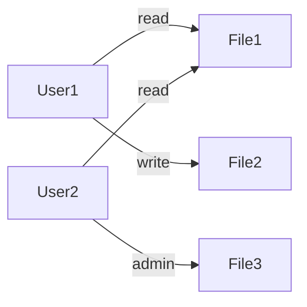
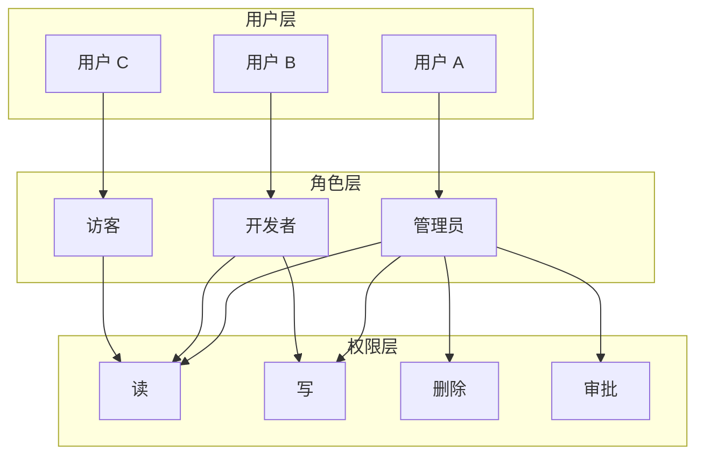
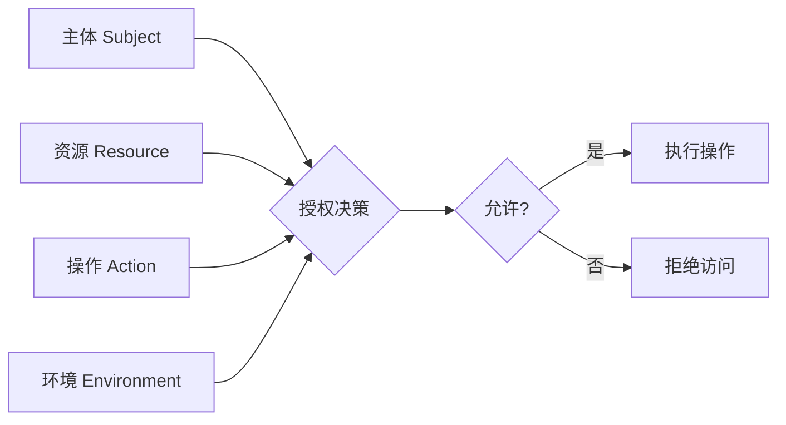
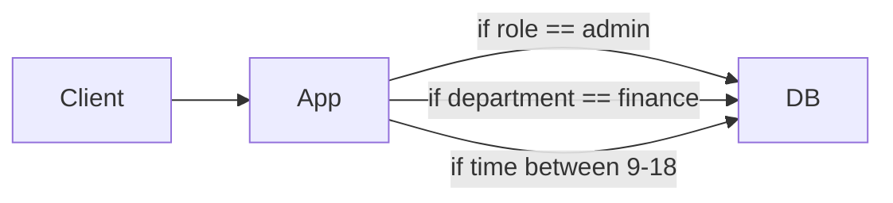
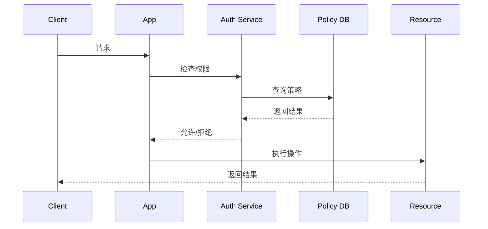
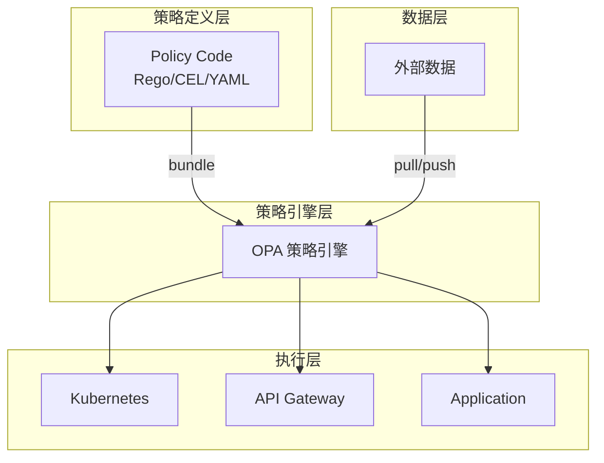

凌晨 2 点，某云服务商的线上系统遭遇了一次严重的安全事件：一位离职三个月的员工账号仍然能够访问生产数据库，删除了数千条用户数据。这不是孤例——传统基于角色的访问控制（RBAC）在处理人员流动、组织变更时，暴露出了根本性的设计缺陷。

权限管理，从来都不只是「谁能做什么」这么简单。它关乎数据安全、合规审计、系统韧性，以及组织能否在快速变化中保持对资源的精准管控。

## 一、授权模型的发展历程

授权模型并非一成不变，它随着计算架构的演进而不断进化。

### 1.1 ACL：最早的权限控制

访问控制列表（ACL）是最原始的权限模型，直接将用户与资源权限绑定：



ACL 的问题显而易见：随着用户和资源数量增长，条目数呈 `O(n*m)` 增长，其中 `n` 是用户数，`m` 是资源数。一个拥有 1000 个用户、10000 个资源的企业系统，需要维护数百万条 ACL 条目。权限变更需要逐条修改，极易出错且难以审计。

### 1.2 RBAC：角色抽象的革命

1992 年，美国国家标准与技术研究院（NIST）提出了基于角色的访问控制（RBAC）。核心思想是引入「角色」作为用户与权限之间的中介：



RBAC 将复杂度从 `O(n*m)` 降低到 `O(n*r + r*m)`，其中 `r` 是角色数量。1000 个用户、10 个角色、10000 个资源，只需管理 10000 + 100000 = 110000 条关系，而非 10^7 条。

### 1.3 ABAC：属性驱动的精细控制

RBAC 解决了用户-权限的解耦问题，但仍然无法处理动态上下文。ABAC（基于属性的访问控制）将决策依据扩展到主体属性、资源属性、环境属性等多个维度：

```json title="ABAC 决策请求示例"
{
  "subject": {
    "user_id": "user_001",
    "department": "engineering",
    "clearance_level": 3,
    "ip_address": "192.168.1.100",
    "authentication_time": "2026-04-09T10:30:00Z"
  },
  "resource": {
    "type": "document",
    "classification": "confidential",
    "owner": "finance_team",
    "created_at": "2026-01-15T08:00:00Z"
  },
  "action": "read",
  "environment": {
    "current_time": "2026-04-09T14:30:00Z",
    "location": "office",
    "device_trusted": true
  }
}
```

这个请求的决策逻辑可能是：「当用户属于工程部门 clearance_level >= 3 且设备可信时，可以在工作时间（周一至周五 9:00-18:00）读取机密文档」。

### 1.4 ReBAC：关系即权限

Google Zanzibar 论文（2019）推动了基于关系的访问控制（ReBAC）进入主流视野。ReBAC 的核心洞察是：权限的本质是主体与资源之间的关系。

```
alice 拥有 (owner) 文档:doc_123
bob    编辑 (editor) 文档:doc_123
charlie 查看 (viewer) 文档:doc_123
```

组织层级、项目成员、家庭关系——这些天然存在的社会关系，恰好可以映射为权限关系。ReBAC 的优雅之处在于，它用统一的关系模型表达了所有这些场景。

## 二、授权决策的核心要素

无论采用哪种模型，授权决策都绕不开四个核心要素：

| 要素 | 定义 | 示例 |
|------|------|------|
| 主体（Subject） | 发起访问请求的实体 | 用户、服务账号、API Key |
| 资源（Resource） | 被访问的对象 | 文件、API、数据库表、打印机 |
| 操作（Action） | 可执行的行为 | read、write、delete、approve |
| 环境（Environment） | 决策时的上下文条件 | 时间、位置、设备状态、网络 |



## 三、授权决策模型对比

### 3.1 DAC：自主访问控制

在 DAC 模型中，资源所有者可以自主决定谁有权访问其资源。Unix 文件系统的权限模型是 DAC 的典型代表。

**优点**：灵活性高，适合资源共享场景。

**缺点**：权限传播难以控制，容易出现「权限泄露」。

### 3.2 MAC：强制访问控制

MAC 由系统强制执行，主体和资源都有安全标签，只有满足特定标签组合才能访问。军事系统常用此模型。

**优点**：安全性高，权限变更由系统控制。

**缺点**：灵活性差，不适合商业环境。

### 3.3 RBAC：基于角色的访问控制

通过角色间接管理权限，支持职责分离和权限继承。

**优点**：降低管理复杂度，支持最小权限原则。

**缺点**：静态角色难以适应动态上下文。

### 3.4 ABAC：基于属性的访问控制

通过评估主体、资源、环境的属性做出决策。

**优点**：细粒度、动态、上下文感知。

**缺点**：策略复杂，审计困难。

## 四、授权架构模式演进

### 4.1 Ugly 模型：逻辑内嵌



权限逻辑分散在应用代码各处，每个服务各自实现一套「变种」。改一处权限逻辑，需要改 N 个服务；新增一个权限维度，需要 N 个服务同时上线。

### 4.2 Bad 模型：独立权限服务

将权限判断抽取为独立服务，所有请求都经过权限服务。



优点是集中管理，缺点是单点瓶颈、网络延迟、版本同步困难。

### 4.3 Good 模型：策略即代码



策略存储在代码仓库中，与应用代码一样接受版本管理、代码审查、自动化测试。策略变更通过 CI/CD 流程部署，无需修改应用代码。

## 五、现代系统为什么需要策略即代码

### 5.1 合规驱动力

GDPR、SOX、HIPAA 等法规要求权限变更可追溯、策略变更可审计。传统 IAM 系统的「点击配置」模式难以满足这些要求。

### 5.2 云原生挑战

微服务、Kubernetes、多云部署——现代架构中资源的生命周期变得更短，权限策略需要更频繁地调整。内嵌在应用中的权限逻辑无法快速响应。

### 5.3 最小权限原则的实践

研究表明，75% 的云安全事件源于过度权限。策略即代码允许团队定义「默认拒绝」策略，只在明确授予时才开放权限。

### 5.4 开发者体验

开发者希望在代码审查中看到权限变更，在 PR 中验证权限逻辑，在部署前测试权限影响。策略即代码将这些需求变为现实。

:::tip 核心洞察
授权模型的演进，本质上是对「变化」的适应能力提升：ACL 适应用户变化、RBAC 适应组织变化、ABAC 适应上下文变化、ReBAC 适应关系变化。选择哪种模型，取决于你的系统在多大尺度上需要应对变化。
:::

## 思考题

**问题 1**：一个拥有 5000 名员工、200 个业务系统、3 个数据中心的金融机构，应该选择哪种授权模型？为什么？

<details>
<summary>参考答案</summary>

建议采用混合模型：以 RBAC 为基础处理组织架构相关的静态权限，配合 ABAC 处理数据敏感度、时间窗口、设备状态等动态条件，在关键系统（如交易系统）引入 ReBAC 处理复杂的组织关系。

核心考量：5000 人的规模需要角色层简化管理；金融合规要求需要精细的审计和变更追溯；多数据中心需要考虑跨区域一致性与延迟。
</details>

**问题 2**：策略即代码（Policy as Code）与传统的 IAM 系统相比，最大的优势是什么？有什么场景下不适用？

<details>
<summary>参考答案</summary>

最大优势：
- 版本控制：所有变更都有审计轨迹
- 代码审查：权限变更需要经过评审流程
- 自动化测试：可以在部署前验证策略正确性
- 快速部署：无需修改应用代码即可更新策略

不适用场景：
- 小型团队（简单权限不需要引入复杂性）
- 高度动态的环境（每秒数千次策略变更可能超出 PaC 的更新周期）
- 遗留系统改造（集成成本可能超过收益）
</details>
