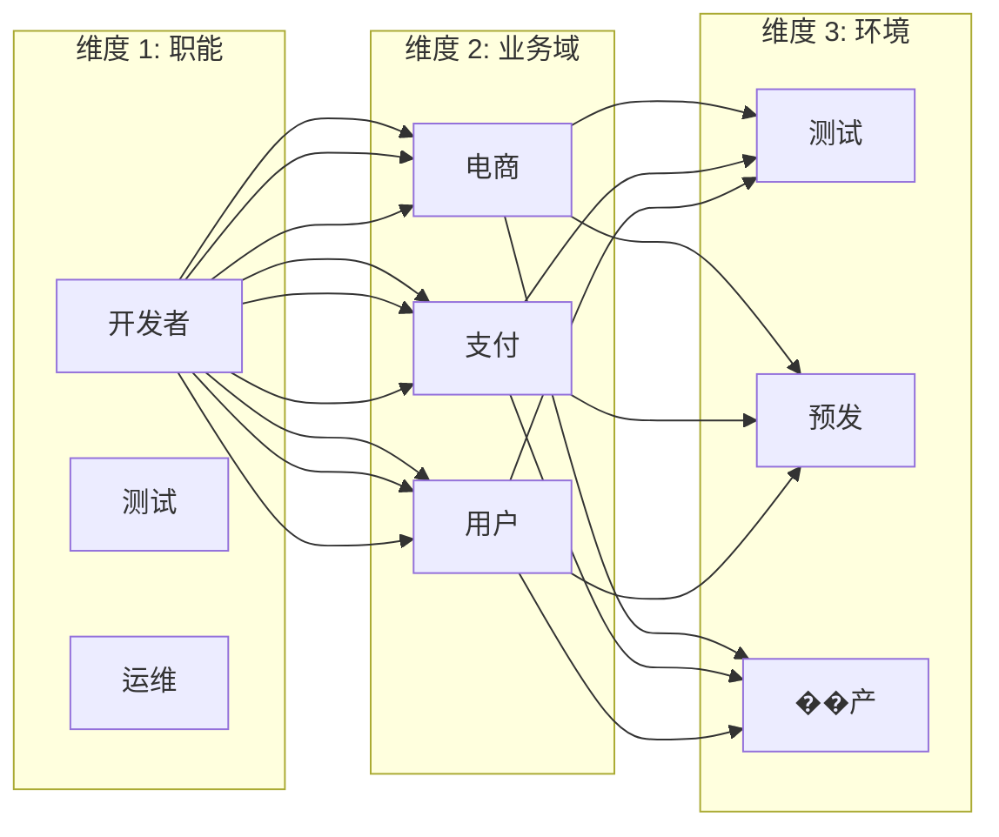
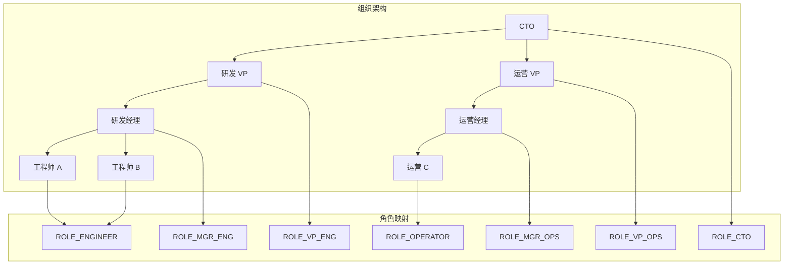
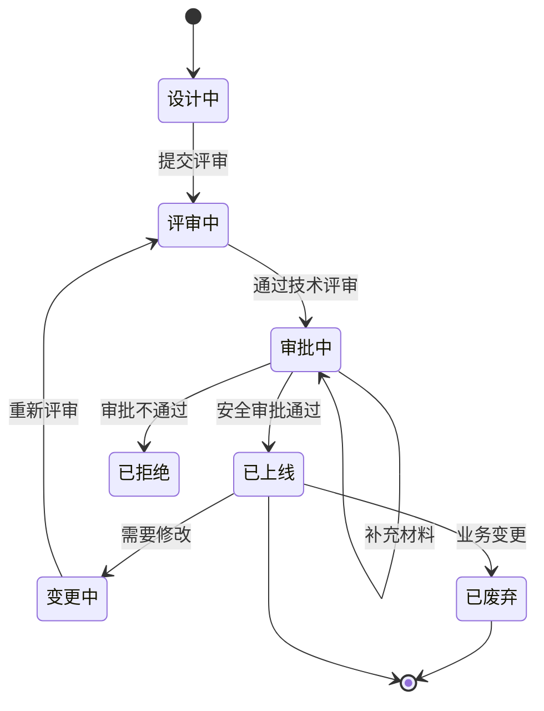

某互联网公司的安全团队在年度审计中发现了一个严重问题：系统里有 347 个角色，但真正活跃使用的只有 23 个。更糟糕的是，其中 8 个角色因为创建时间早、维护文档缺失，已经没有人能说清楚它们的具体用途。

角色设计从来不是「先随便建一个试试」的事情。RBAC 的成败，很大程度上取决于角色体系的规划质量。

## 一、角色设计的常见反模式

### 1.1 超级管理员滥用

这是 RBAC 设计中最危险的反模式。

```java title="超级管理员反模式示例"
// 过度依赖超级管理员角色
public class SecurityService {
    
    @PreAuthorize("hasRole('ADMIN')")
    public void deleteUser(Long userId) {
        // 任何管理员都可以删除任何用户
        userRepository.deleteById(userId);
    }
    
    @PreAuthorize("hasRole('ADMIN')")
    public void accessAllData() {
        // 管理员可以访问所有数据
        return dataRepository.findAll();
    }
    
    @PreAuthorize("hasRole('ADMIN')")
    public void modifySystemConfig() {
        // 管理员可以修改系统配置
        configRepository.updateAll(settings);
    }
}
```

**问题分析**：

| 问题 | 风险 |
|------|------|
| 权限过度集中 | 一个账号泄露影响整个系统 |
| 审计失效 | 无法追溯「谁做了什么」 |
| 合规风险 | 违反最小权限原则和职责分离 |
| 离职风险 | 超级管理员账户成为内部威胁 |

**正确做法**：拆分超级管理员权限，按业务域划分。

```java title="权限拆分方案"
public class SecurityService {
    
    // 用户管理：HR 管理员
    @PreAuthorize("hasRole('HR_ADMIN')")
    public void deleteUser(Long userId) {
        userRepository.deleteById(userId);
    }
    
    // 数据访问：数据分析师
    @PreAuthorize("hasRole('DATA_ANALYST') and hasAuthority('DATA:READ')")
    public List<Data> accessSalesData() {
        return dataRepository.findByDomain(Domain.SALES);
    }
    
    // 系统配置：运维管理员
    @PreAuthorize("hasRole('OPS_ADMIN') and hasAuthority('CONFIG:WRITE')")
    public void modifySystemConfig(SystemSettings settings) {
        configRepository.updateSystem(settings);
    }
}
```

### 1.2 角色过于粗粒度

粗粒度角色在初期看起来「简单」，但随着业务发展会变成噩梦。

**典型案例**：「开发人员」角色

```json title="粗粒度角色的权限膨胀"
{
  "role": "DEVELOPER",
  "permissions": [
    "code:read",
    "code:write",
    "ci:trigger",
    "ci:view",
    "test:run",
    "deploy:staging",
    "deploy:production",  // 问题：初级开发者也能部署到生产
    "db:read",
    "db:write",          // 问题：不需要直接操作数据库
    "log:read",
    "config:read",
    "config:write",      // 问题：配置变更风险高
    "secret:read"        // 问题：敏感信息不应被所有开发者访问
  ]
}
```

**正确做法**：按职责拆分细粒度角色。

```json title="细粒度角色设计"
{
  "roles": {
    "DEVELOPER_READ": {
      "description": "代码阅读权限",
      "permissions": ["code:read", "ci:view", "test:view", "log:read"]
    },
    "DEVELOPER_WRITE": {
      "description": "代码提交权限（需要先通过 CI）",
      "permissions": ["code:read", "code:write", "ci:trigger", "test:run"],
      "prerequisites": ["DEVELOPER_READ"]
    },
    "DEPLOY_STAGING": {
      "description": "部署到预发环境",
      "permissions": ["deploy:staging", "config:read"],
      "requiresMFA": true
    },
    "DEPLOY_PRODUCTION": {
      "description": "生产环境部署（需要审批）",
      "permissions": ["deploy:staging", "deploy:production"],
      "requiresApproval": true,
      "approverRole": "TECH_LEAD"
    },
    "DB_READONLY": {
      "description": "数据库只读权限",
      "permissions": ["db:read"],
      "auditable": true,
      "ipWhitelist": ["10.0.0.0/8"]
    }
  }
}
```

### 1.3 角色爆炸问题

当业务场景复杂时，细粒度角色可能导致角色数量爆炸。



3 x 3 x 3 = 27 个角色的组合爆炸。

**解决方案**：多维度权限矩阵 + 动态角色组合

```java title="动态角色组合"
public class DynamicRoleComposer {
    
    /**
     * 动态生成角色权限
     * 基于用户属性组合权限
     */
    public Set<Permission> composePermissions(User user) {
        Set<Permission> permissions = new HashSet<>();
        
        // 基础职能权限
        permissions.addAll(getBaseFunctionPermissions(user.getFunction()));
        
        // 业务域权限（只包含用户相关的域）
        permissions.addAll(
            getBusinessDomainPermissions(user.getAssignedDomains())
        );
        
        // 环境权限（基于当前环境）
        permissions.addAll(
            getEnvironmentPermissions(user.getCurrentEnvironment())
        );
        
        // 特殊情况：紧急权限
        if (user.hasEmergencyAccess()) {
            permissions.addAll(getEmergencyPermissions());
        }
        
        return permissions;
    }
}
```

### 1.4 直接赋予个人权限

绕过角色直接给用户分配权限是最常见的反模式之一。

```sql title="直接权限分配的陷阱"
-- 反模式：直接给用户分配权限
INSERT INTO user_permissions (user_id, permission_id) VALUES
(1, 100),  -- 用户 A 直接获得权限
(1, 101),
(2, 100),
(2, 102);
-- 问题：这些权限不会随着角色调整而变化
-- 问题：无法通过角色变更批量调整
-- 问题：审计时需要查看每个用户的个人权限

-- 正确做法：通过角色分配
INSERT INTO user_roles (user_id, role_id) VALUES (1, 5);
-- 用户 A 获得 DEVELOPER 角色，权限由角色定义
```

**后果**：

| 问题 | 影响 |
|------|------|
| 权限分散 | 无法通过角色管理权限 |
| 变更困难 | 修改一个用户需要手动操作 |
| 审计困难 | 无法回答「这个权限授予了谁」 |
| 离职困难 | 员工离职时权限清理不完整 |

## 二、最佳实践

### 2.1 基于组织架构设计角色

角色应该与组织结构对齐，让管理者能够理解和管理权限。



**映射原则**：

| 组织层级 | 角色设计 | 权限策略 |
|---------|---------|---------|
| 高管层 | 单一角色 + 审批流 | 高风险操作需多级审批 |
| 中层管理 | 部门管理员角色 | 本部门内的管理权限 |
| 基层员工 | 岗位标准角色 | 基于岗位的标准化权限 |

### 2.2 角色命名规范

清晰的命名规范是团队协作的基础。

```java title="角色命名规范"
public class RoleNamingConvention {
    
    /**
     * 角色命名格式：[类型]_[职能]_[范围]_[级别]
     */
    
    // 用户管理类
    // USER_VIEWER: 用户查看权限
    // USER_EDITOR: 用户编辑权限
    // USER_ADMIN: 用户管理权限
    
    // 数据访问类
    // DATA_READER: 数据读取
    // DATA_WRITER: 数据写入
    // DATA_ADMIN: 数据管理
    
    // 系统操作类
    // SYS_CONFIG: 系统配置
    // SYS_AUDIT: 审计查看
    // SYS_ADMIN: 系统管理
    
    // 业务操作类
    // ORDER_CREATE: 创建订单
    // ORDER_APPROVE: 审批订单
    // ORDER_CANCEL: 取消订单
}
```

**命名禁忌**：

| 禁忌 | 原因 |
|------|------|
| `admin`、`super_admin` | 含义模糊，无法区分具体权限 |
| `developer_v2`、`temp_role` | 无语义，难以理解用途 |
| `role_001`、`role_test` | 无业务意义 |
| 中文拼音缩写 | 国际团队无法理解 |

### 2.3 职责分离（SOD）原则

职责分离是防止欺诈和错误的核心机制。

```java title="SOD 约束配置"
public class SeparationOfDutyConfig {
    
    private static final List<MutexGroup> MUTEX_GROUPS = List.of(
        // 交易相关：请求者不能审批
        new MutexGroup("TRADE_SOD",
            Set.of("TRADE_CREATOR", "TRADE_APPROVER")),
        
        // 财务相关：制单与审核分离
        new MutexGroup("FINANCE_SOD",
            Set.of("FINANCE_CREATOR", "FINANCE_APPROVER", "FINANCE_PAYER")),
        
        // 安全相关：安全管理员不能审计
        new MutexGroup("SECURITY_SOD",
            Set.of("SECURITY_ADMIN", "SECURITY_AUDITOR")),
        
        // IT 相关：开发者不能是发布审批者
        new MutexGroup("IT_SOD",
            Set.of("DEVELOPER", "DEPLOY_APPROVER"))
    );
    
    /**
     * 检查用户是否违反 SOD 约束
     */
    public SODViolation checkViolation(User user, Role newRole) {
        Set<Role> currentRoles = user.getAssignedRoles();
        
        for (MutexGroup group : MUTEX_GROUPS) {
            if (group.contains(newRole) && 
                group.hasOverlap(currentRoles)) {
                return new SODViolation(
                    group.getName(),
                    "角色 " + newRole.getName() + 
                    " 与已有角色存在职责冲突"
                );
            }
        }
        return SODViolation.NONE;
    }
}
```

**常见 SOD 场景**：

| 场景 | 互斥角色 |
|------|---------|
| 采购流程 | 采购申请人 vs 采购审批人 vs 采购付款人 |
| 代码发布 | 代码编写者 vs 发布审批者 vs 发布执行者 |
| 用户管理 | 用户创建者 vs 用户权限管理员 |
| 财务管理 | 凭证制作者 vs 凭证审核者 vs 账务结账者 |

### 2.4 角色与权限的映射管理

使用结构化方式管理角色-权限映射。

```java title="PermissionMatrix.java"
@Service
public class PermissionMatrixService {
    
    /**
     * 角色权限矩阵
     * 维护角色与权限的映射关系
     */
    
    public PermissionMatrix buildMatrix() {
        List<Role> allRoles = roleRepository.findAllActive();
        List<Permission> allPermissions = permissionRepository.findAll();
        
        Map<Role, Set<Permission>> matrix = new HashMap<>();
        
        for (Role role : allRoles) {
            Set<Permission> permissions = role.getPermissions();
            matrix.put(role, permissions);
        }
        
        return new PermissionMatrix(allRoles, allPermissions, matrix);
    }
    
    /**
     * 检查权限覆盖
     * 确保每个权限都被至少一个角色覆盖
     */
    public List<Permission> findOrphanedPermissions() {
        Set<Permission> covered = roleRepository.findAll()
            .stream()
            .flatMap(r -> r.getPermissions().stream())
            .collect(Collectors.toSet());
        
        return permissionRepository.findAll().stream()
            .filter(p -> !covered.contains(p))
            .collect(Collectors.toList());
    }
    
    /**
     * 生成权限报告
     */
    public PermissionReport generateReport() {
        PermissionMatrix matrix = buildMatrix();
        
        return new PermissionReport(
            matrix.getTotalRoles(),
            matrix.getTotalPermissions(),
            matrix.getPermissionsPerRole(),
            findOrphanedPermissions(),
            findOverprivilegedRoles(),
            findUnderprivilegedRoles()
        );
    }
}
```

### 2.5 角色的生命周期管理

角色不是静态的，需要完整的生命周期管理。



**关键流程**：

| 阶段 | 活动 | 负责人 |
|------|------|--------|
| 设计 | 角色设计、权限规划 | 安全架构师 |
| 评审 | 技术评审、安全评审 | 安全团队 |
| 审批 | 合规审批、业务审批 | 安全委员会 |
| 上线 | 配置、测试、监控 | 运维团队 |
| 运营 | 定期审计、权限调整 | 安全团队 |
| 废弃 | 权限清理、数据归档 | 运维团队 |

## 三、实施步骤

### 3.1 现状调研

1. 盘点所有系统和资源
2. 识别现有权限模型
3. 分析权限变更历史
4. 识别高风险权限点

### 3.2 角色设计

1. 按职能梳理权限需求
2. 识别角色候选集
3. 定义角色层级关系
4. 设计 SOD 约束
5. 评审角色设计方案

### 3.3 权限迁移

1. 建立权限映射表
2. 设计迁移脚本
3. 执行灰度迁移
4. 验证权限一致性
5. 切换到新系统

### 3.4 上线与审计

1. 角色权限配置
2. 用户角色分配
3. 权限测试验证
4. 上线监控
5. 定期审计

## 四、RBAC 与最小权限原则

最小权限原则要求用户只拥有完成工作所需的最小权限。

```java title="最小权限检查工具"
public class LeastPrivilegeChecker {
    
    /**
     * 分析用户实际使用的权限
     * 与授予权限对比，发现过度授权
     */
    public PrivilegeAnalysis analyzeUserPrivileges(Long userId) {
        User user = userRepository.findById(userId);
        
        // 授予的权限（含角色继承）
        Set<Permission> granted = permissionService
            .getUserEffectivePermissions(userId);
        
        // 实际使用的权限（基于审计日志）
        Set<Permission> used = auditLogRepository
            .findDistinctPermissionsByUser(userId, 
                Duration.ofDays(90));
        
        // 分析差异
        Set<Permission> unused = Sets.difference(granted, used);
        Set<Permission> undocumented = Sets.difference(used, granted);
        
        return new PrivilegeAnalysis(
            user.getUsername(),
            granted.size(),
            used.size(),
            unused,
            undocumented,
            calculateOverPrivilegedScore(granted, used)
        );
    }
    
    /**
     * 定期生成最小权限报告
     */
    @Scheduled(cron = "0 0 2 * * ?") // 每天凌晨 2 点
    public void generateLeastPrivilegeReport() {
        List<PrivilegeAnalysis> analyses = userRepository.findAll()
            .stream()
            .map(u -> analyzeUserPrivileges(u.getId()))
            .filter(a -> a.getOverprivilegedScore() > 0.3)
            .sorted(Comparator.comparing(
                PrivilegeAnalysis::getOverprivilegedScore).reversed())
            .collect(Collectors.toList());
        
        if (!analyses.isEmpty()) {
            emailService.sendReport(
                "Security Team",
                "最小权限分析报告",
                analyses
            );
        }
    }
}
```

:::tip 核心原则
RBAC 设计的黄金法则：让角色对管理者有意义，让权限对开发者有意义，让审计对安全团队有意义。
:::

## 思考题

**问题 1**：在大型企业实施 RBAC 时，最容易遇到的组织阻力是什么？如何在不牺牲安全性的前提下平衡用户体验？

<details>
<summary>参考答案</summary>

常见阻力：
1. **部门利益**：某些部门希望保留「特殊权限」
2. **效率担忧**：开发者担心细粒度权限会影响开发效率
3. **惯性抗拒**：现有管理员不愿意改变现有模式
4. **沟通成本**：需要协调多个部门达成共识

平衡策略：
1. **渐进式迁移**：分阶段实施，不搞一刀切
2. **透明化**：让所有人看到权限变更的必要性
3. **���动化**：通过工作流自动化减少操作步骤
4. **紧急通道**：保留快速审批通道处理紧急需求
5. **培训支持**：帮助用户理解新模型的收益
</details>

**问题 2**：设计一个角色「退休」机制，处理那些「历史遗留」但仍在使用中的角色。

<details>
<summary>参考答案</summary>

角色「退休」机制设计：

**阶段一：标记为废弃**
- 在角色上添加 `deprecated = true` 标记
- 禁止为新用户分配该角色
- 在管理界面显示警告标识

**阶段二：影响分析**
- 分析该角色的当前使用情况
- 识别受影响的用户数量
- 评估迁移到新角色的方案

**阶段三：迁移通知**
- 向用户发送迁移通知
- 提供迁移时间表和支持
- 分配临时权限确保业务连续

**阶段四：执行迁移**
- 分批次将用户迁移到新角色
- 监控迁移过程中的异常

**阶段五：废弃完成**
- 移除废弃角色的所有分配
- 保留审计记录
- 归档角色定义

关键点：整个过程需要与业务方充分沟通，提供足够的迁移窗口期（建议 3-6 个月）。
</details>
