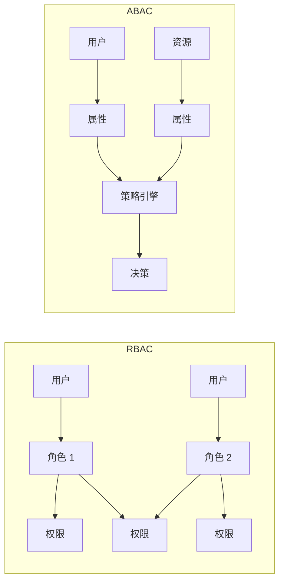
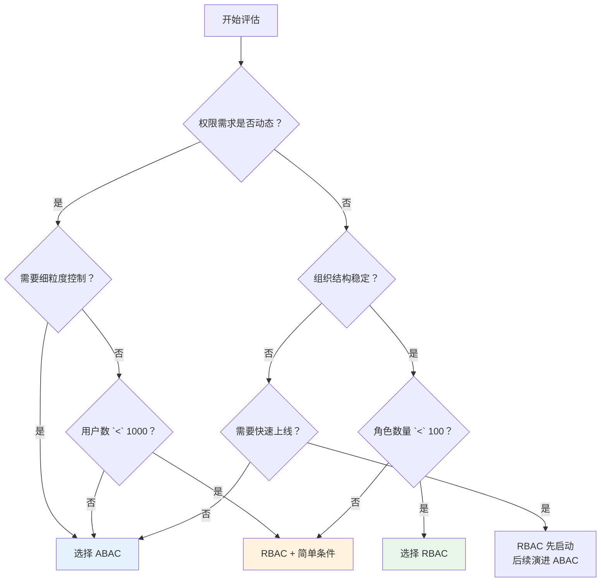
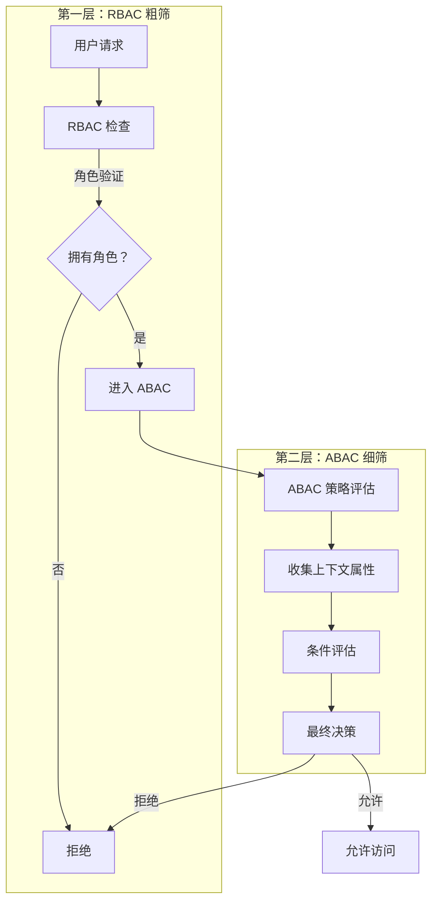
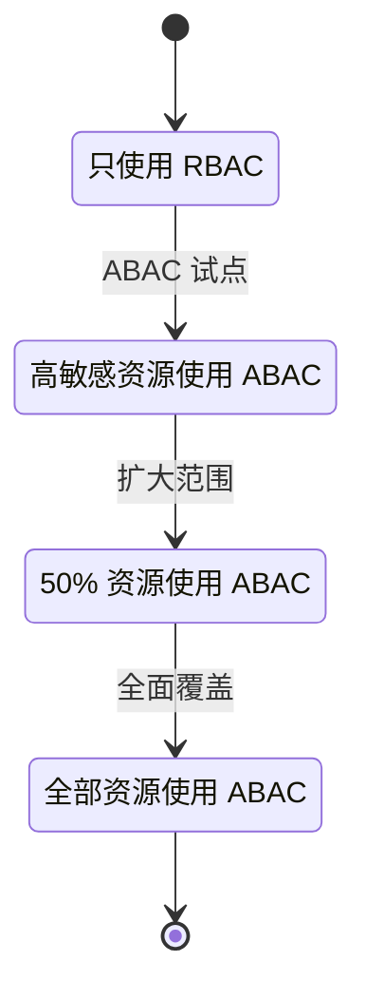

一个拥有 5000 名员工的金融科技公司，安全团队面临一个艰难的决策：现有的 RBAC 系统已经无法满足合规审计的需求，但迁移到 ABAC 的成本和时间都不容忽视。更复杂的是，不同业务部门的需求各不相同——合规部门需要细粒度的审计，而产品部门则希望权限管理不要太复杂。

这不是一道简单的选择题。RBAC 和 ABAC 各有优劣，真正的挑战在于理解它们之间的权衡，并在具体场景中找到最优解。

## 一、设计理念对比

### 1.1 RBAC：角色即权限的抽象

RBAC 的核心假设是：**权限可以通过角色自然地组织起来**。

```
用户 ──属于──> 角色 ──拥有──> 权限
  │                      │
  └──岗位决定─────────────┘
```

RBAC 的优雅之处在于「角色」这个概念与现实世界天然对应：
- 入职时分配岗位 = 分配角色
- 转岗时调整角色 = 权限跟着变
- 离职时删除角色 = 权限全部回收

**适用哲学**：通过定义「谁能做什么」来管理权限。

### 1.2 ABAC：属性即决策的输入

ABAC 的核心假设是：**权限决策应该考虑所有相关的上下文**。

```
访问请求
    ├── 主体属性（谁）
    ├── 资源属性（什么）
    ├── 操作属性（怎么做）
    └── 环境属性（何时何地）
           ↓
      策略评估
           ↓
      决策结果
```

ABAC 的灵活之处在于「属性」可以无限扩展：
- 时间属性：工作时间 vs 非工作时间
- 位置属性：办公室 vs 远程 vs VPN
- 设备属性：托管设备 vs 个人设备
- 上下文属性：紧急模式 vs 正常模式

**适用哲学**：通过定义「在什么条件下谁可以做什么」来管理权限。

## 二、核心维度对比

### 2.1 粒度与灵活性

| 维度 | RBAC | ABAC |
|------|------|------|
| 权限粒度 | 粗粒度（角色级别） | 细粒度（属性级别） |
| 上下文感知 | 静态，无视环境变化 | 动态，基于实时属性 |
| 规则复杂度 | 简单（是/否） | 复杂（条件组合） |
| 新场景适应 | 需要新增角色 | 通过调整属性实现 |

**典型场景对比**：

```java title="RBAC 权限检查"
public boolean canAccessFile_RBAC(User user, File file) {
    // 简单直接
    return user.hasRole("DOCUMENT_VIEWER") || 
           user.hasRole("DOCUMENT_ADMIN");
}
```

```java title="ABAC 权限检查"
public boolean canAccessFile_ABAC(User user, File file, Environment env) {
    // 复杂但精细
    if (file.getClassification().equals("top_secret")) {
        return user.getClearanceLevel() >= 4 &&
               env.isInOffice() &&
               env.isWithinWorkHours() &&
               user.getDevice().isCompliant();
    }
    
    if (file.getClassification().equals("confidential")) {
        return user.getDepartment().equals(file.getOwnerDepartment()) ||
               user.hasRole("auditor");
    }
    
    return true; // public 文件无限制
}
```

### 2.2 性能特征

| 指标 | RBAC | ABAC |
|------|------|------|
| 决策延迟 | `O(1)` 查表 | `O(n*m)` 策略评估 |
| 属性获取 | 一次性加载 | 动态获取，可能有 I/O |
| 缓存友好度 | 高 | 低（属性可能变化） |
| 扩展性 | 角色数增长后下降 | 属性数增长影响有限 |

**性能优化策略**：

```java title="RBAC 性能优化：角色权限预计算"
public class RbacPermissionCache {
    
    private LoadingCache<Long, Set<String>> userPermissions;
    
    public RbacPermissionCache() {
        userPermissions = Caffeine.newBuilder()
            .maximumSize(10000)
            .expireAfterWrite(10, TimeUnit.MINUTES)
            .build(userId -> computeUserPermissions(userId));
    }
    
    public boolean hasPermission(Long userId, String permission) {
        return userPermissions.get(userId)
            .contains(permission);
    }
}
```

```java title="ABAC 性能优化：属性索引与缓存"
public class AbacAttributeCache {
    
    // 按类型分区缓存属性
    private LoadingCache<String, SubjectAttributes> subjectCache;
    private LoadingCache<String, ResourceAttributes> resourceCache;
    private LoadingCache<String, EnvironmentAttributes> envCache;
    
    public boolean evaluate(AccessRequest request) {
        // 属性并行获取
        SubjectAttributes subject = subjectCache.get(
            request.getSubjectId());
        ResourceAttributes resource = resourceCache.get(
            request.getResourceId());
        EnvironmentAttributes env = envCache.get(
            request.getEnvironmentKey());
        
        return policyEngine.evaluate(subject, resource, 
            request.getAction(), env);
    }
}
```

### 2.3 管理复杂度

| 维度 | RBAC | ABAC |
|------|------|------|
| 初始配置 | 简单（角色 + 权限） | 复杂（属性定义 + 策略） |
| 用户操作 | 分配角色即可 | 需要理解属性含义 |
| 变更影响 | 局部（单角色影响有限用户） | 全局（一策略可能影响广泛） |
| 审计难度 | 低（角色变更可追溯） | 高（策略逻辑复杂） |
| 培训成本 | 低 | 高 |

**管理复杂度可视化**：



## 三、适用场景对比

### 3.1 选择 RBAC 的场景

| 场景 | 原因 |
|------|------|
| 组织结构清晰 | 角色与岗位一一对应 |
| 权限需求稳定 | 不会频繁新增权限维度 |
| 小到中等规模 | 用户数 `<` 1000，角色数 `<` 100 |
| 快速上线 | 需要快速搭建权限体系 |
| 简单审计需求 | 只需追踪「谁拥有什么角色」 |
| 成本敏感 | 资源有限，无法投入复杂的 ABAC 系统 |

**典型行业**：传统企业、制造业、政府机构、内部工具

### 3.2 选择 ABAC 的场景

| 场景 | 原因 |
|------|------|
| 动态上下文决策 | 需要根据时间、地点、设备等决策 |
| 多租户环境 | 每个租户有不同的权限规则 |
| 合规要求严格 | 需要详细的决策日志和属性记录 |
| 大规模数据访问控制 | 资源数量远大于用户数量 |
| 外部用户访问 | 合作伙伴、客户需要差异化的访问控制 |
| 零信任架构 | 持续验证，不依赖静态角色 |

**典型行业**：金融科技、医疗健康、云服务、电商平台

### 3.3 选型决策树



## 四、混合使用策略

### 4.1 混合架构设计

在实际项目中，RBAC + ABAC 的混合方案往往是最务实的选择：



### 4.2 混合实现示例

```java title="混合权限检查实现")
@Service
public class HybridAuthorizationService {
    
    @Autowired
    private RbacService rbacService;
    
    @Autowired
    private AbacService abacService;
    
    /**
     * 先 RBAC 粗筛，再 ABAC 细筛
     */
    public AuthorizationResult authorize(AccessRequest request) {
        // 第一步：RBAC 粗筛
        String[] requiredRoles = determineRequiredRoles(request);
        if (!rbacService.hasAnyRole(request.getSubject(), requiredRoles)) {
            return AuthorizationResult.deny("角色不匹配");
        }
        
        // 第二步：ABAC 细筛（如果需要）
        if (requiresAbac(request)) {
            AbacDecision decision = abacService.evaluate(
                buildAbacContext(request));
            
            if (decision.isDeny()) {
                return AuthorizationResult.deny(
                    "不满足访问条件: " + decision.getReason());
            }
        }
        
        return AuthorizationResult.permit();
    }
    
    private boolean requiresAbac(AccessRequest request) {
        // 敏感资源需要 ABAC 细筛
        return request.getResource().getClassification() 
            != null ||
               request.getResource().isExternal() ||
               request.getEnvironment().isAbacRequired();
    }
}
```

### 4.3 职责边界划分

| 层次 | 职责 | 实现 |
|------|------|------|
| RBAC 层 | 基础权限、角色分配 | 用户-角色映射 |
| ABAC 层 | 上下文限制、动态条件 | 策略规则 |
| 审计层 | 所有决策的完整日志 | 统一审计 |

## 五、迁移路径

### 5.1 迁移决策矩阵

| 起点 | 终点 | 迁移复杂度 | 建议 |
|------|------|-----------|------|
| 纯 RBAC | RBAC + ABAC | 中 | 按需引入 ABAC |
| 纯 RBAC | 纯 ABAC | 高 | 建议不迁移 |
| 无权限系统 | RBAC | 低 | 直接 RBAC |
| 无权限系统 | ABAC | 中 | 可直接 ABAC |
| ACL | RBAC | 低 | 推荐迁移 |
| ACL | ABAC | 高 | RBAC 过渡 |

### 5.2 渐进式迁移策略



### 5.3 迁移实施步骤

```java title="迁移检查清单")
public class MigrationChecklist {
    
    /**
     * RBAC → ABAC 迁移前评估
     */
    public MigrationAssessment assess() {
        return MigrationAssessment.builder()
            // 复杂度评估
            .roleCount(getCurrentRoleCount())
            .userCount(getCurrentUserCount())
            .permissionCount(getCurrentPermissionCount())
            .complexity(getComplexityScore())
            
            // 收益评估
            .unmetRequirements(getUnmetRequirements())
            .complianceGaps(getComplianceGaps())
            .userExperienceIssues(getUXIssues())
            
            // 风险评估
            .migrationRisk(calculateMigrationRisk())
            .rollbackComplexity(estimateRollbackEffort())
            
            // 建议
            .recommendation(generateRecommendation())
            .build();
    }
}
```

:::tip 决策建议
不要陷入「二选一」的思维陷阱。现实中 80% 的系统适合「RBAC 做基础，ABAC 做补充」的混合方案。关键是明确分界：RBAC 负责「有没有权限」，ABAC 负责「在什么条件下有权限」。
:::

## 思考题

**问题 1**：一个快速成长的 SaaS 平台，从初创期（50 用户）到成熟期（50000 用户），权限模型应该如何演进？每个阶段应该关注什么核心问题？

<details>
<summary>参考答案</summary>

分阶段演进策略：

**阶段一：初创期（`<` 500 用户）**
- 核心问题：快速上线、最小可用权限
- 推荐模型：简版 RBAC（2-3 个角色）
- 角色示例：`owner`、`admin`、`member`
- 关键决策：不要过度设计

**阶段二：成长期（500-5000 用户）**
- 核心问题：多租户隔离、团队协作
- 推荐模型：RBAC + 基础 ABAC
- 演进点：引入团队角色、租户隔离
- 关键决策：开始考虑 ABAC 试点

**阶段三：规模期（5000-20000 用户）**
- 核心问题：合规审计、���杂权限
- 推荐模型：混合 RBAC + ABAC
- 演进点：敏感资源 ABAC、审计日志
- 关键决策：建立权限治理流程

**阶段四：成熟期（`>` 20000 用户）**
- 核心问题：权限复杂度管理、性能
- 推荐模型：分层 ABAC + 策略引擎
- 演进点：引入 OPA/Casbin 等策略引擎
- 关键决策：权限系统专业化
</details>

**问题 2**：假设你已经有一个运行多年的 RBAC 系统，现在需要引入 ABAC 处理一些特殊的合规需求。如何在不破坏现有系统稳定性的前提下完成这个转变？

<details>
<summary>参考答案</summary>

稳定性优先的迁移策略：

**第一步：隔离测试**
- 在测试环境部署 ABAC 组件
- 与生产 RBAC 并行运行
- 对比结果，确保一致

**第二步：影子模式**
- 在生产环境启用 ABAC
- ABAC 执行但不生效
- 记录差异，修复问题

**第三步：灰度放量**
- 选择非关键资源启用 ABAC
- 监控 2-4 周
- 逐步扩大范围

**第四步：职责分离**
- ABAC 负责高敏感资源
- RBAC 负责普通资源
- 明确边界，避免冲突

**关键保障**：
1. 保留 RBAC 作为兜底
2. ABAC 决策结果必须可解释
3. 所有变更有完整回滚方案
4. 与业务方充分沟通变更影响
</details>
