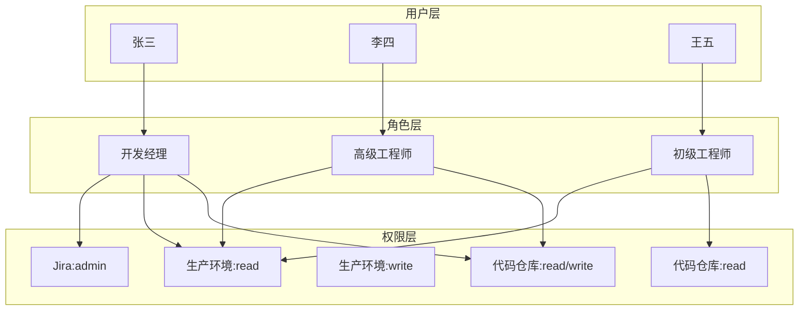
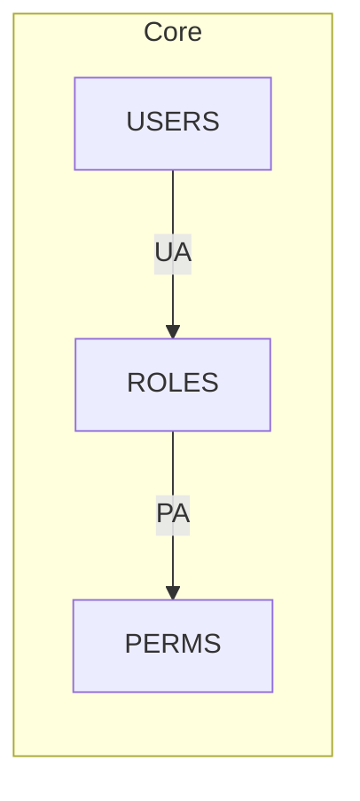
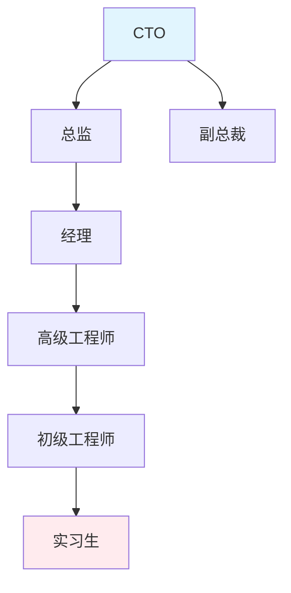

一家快速扩张的创业公司，一年之内从 50 人增长到 500 人。HR 系统里的部门在变、岗位在变、入职离职在变。运维工程师发现，每次组织架构调整，都要花三天时间在各个系统中逐个修改权限配置。错误、遗漏、延迟——传统的用户-权限直接映射模式，已经成为组织扩张的瓶颈。

RBAC 的诞生，正是为了解决这个问题。

## 一、RBAC 的核心概念

RBAC（Role-Based Access Control）引入了「角色」作为用户与权限之间的中间层：



三个核心关系：
- **用户-角色分配（UA）**：用户被分配到角色
- **角色-权限分配（PA）**：角色被授予权限
- **角色-角色关系**：角色之间存在继承或其他关系

## 二、RBAC 的四个层级

NIST 定义的 RBAC 标准包含四个递增的复杂性层级：

### 2.1 Core RBAC（核心 RBAC）

这是最基本的 RBAC，包含用户、角色、权限、会话五个基本元素：

| 元素 | 定义 |
|------|------|
| USERS | 系统用户 |
| ROLES | 角色（与岗位对应） |
| PERMS | 权限（对资源的操作） |
| UA | 用户-角色分配关系 |
| PA | 角色-权限分配关系 |
| SESSIONS | 用户激活角色的会话 |



### 2.2 Hierarchical RBAC（层级 RBAC）

引入角色继承：子角色自动继承父角色的所有权限：

```java title="角色层次定义"
public enum RoleLevel {
    // 层级越高，权限越大
    INTERN(1),      // 实习生：最低权限
    JUNIOR(2),       // 初级：继承实习生
    SENIOR(3),       // 高级：继承初级
    MANAGER(4),       // 经理：继承高级
    DIRECTOR(5),     // 总监：继承经理
    CTO(6);          // CTO：最高权限
    
    private final int level;
    
    RoleLevel(int level) {
        this.level = level;
    }
    
    public boolean canInheritFrom(RoleLevel parent) {
        return this.level <= parent.level;
    }
}
```



层级 RBAC 的优势在于：新晋升的员工只需要改变角色，权限自动跟随层级调整。

### 2.3 Constrained RBAC（约束 RBAC）

引入职责分离（SOD）和基数约束：

**互斥角色**：同一个人不能同时持有两个互斥角色，防止利益冲突。

```java title="互斥角色约束检查"
public class MutuallyExclusiveRoleValidator {
    
    private static final Set<RolePair> EXCLUSIVE_PAIRS = Set.of(
        new RolePair("ACCOUNTANT", "AUDITOR"),
        new RolePair("PURCHASE_APPROVER", "PURCHASE_REQUESTER"),
        new RolePair("SYSTEM_ADMIN", "SECURITY_AUDITOR")
    );
    
    public boolean validateAssignment(User user, Role newRole) {
        Set<Role> currentRoles = user.getAssignedRoles();
        
        for (Role existingRole : currentRoles) {
            if (EXCLUSIVE_PAIRS.contains(new RolePair(
                    existingRole.getName(), 
                    newRole.getName()))) {
                return false; // 违反互斥约束
            }
        }
        return true;
    }
}
```

**基数约束**：限制角色分配的数量。

```java title="角色基数约束"
public class RoleCardinalityConstraint {
    // 角色最大分配数
    private final Map<String, Integer> roleMaxAssignments;
    
    // 统计当前角色分配数
    public boolean canAssignRole(Role role) {
        int currentCount = roleAssignmentRepository
            .countByRoleId(role.getId());
        int maxAllowed = roleMaxAssignments.getOrDefault(
            role.getName(), 
            Integer.MAX_VALUE
        );
        return currentCount < maxAllowed;
    }
}
```

**先决条件角色**：获得某个角色之前必须先拥有另一个角色。

```java title="先决条件检查"
public class PrerequisiteRoleValidator {
    
    private static final Map<String, Set<String>> PREREQUISITES = Map.of(
        "SENIOR_DEVELOPER", Set.of("DEVELOPER"),
        "TEAM_LEAD", Set.of("SENIOR_DEVELOPER"),
        "PROJECT_MANAGER", Set.of("LEAD_DEVELOPER")
    );
    
    public boolean hasPrerequisiteRoles(User user, Role targetRole) {
        Set<String> required = PREREQUISITES.get(targetRole.getName());
        if (required == null || required.isEmpty()) {
            return true; // 无先决条件
        }
        
        Set<String> userRoles = user.getAssignedRoles().stream()
            .map(Role::getName)
            .collect(Collectors.toSet());
        
        return userRoles.containsAll(required);
    }
}
```

### 2.4 Symmetric RBAC（对称 RBAC）

引入角色-权限分配与角色-角色分配的对称性，并支持权限的外部管理。本层级主要面向大型企业的复杂权限管理场景。

## 三、RBAC 的 Java 实现

### 3.1 基于 Spring Security 的 RBAC 实现

```java title="RBAC 核心配置"
@Configuration
@EnableMethodSecurity(prePostEnabled = true)
public class RbacSecurityConfig {
    
    @Autowired
    private UserDetailsService userDetailsService;
    
    @Bean
    public RoleHierarchy roleHierarchy() {
        RoleHierarchyImpl hierarchy = new RoleHierarchyImpl();
        
        // 使用 ">" 表示继承关系
        // CTO > Director > Manager > Senior > Junior > Intern
        hierarchy.setHierarchy(
            "ROLE_CTO > ROLE_DIRECTOR > ROLE_MANAGER > " +
            "ROLE_SENIOR > ROLE_JUNIOR > ROLE_INTERN"
        );
        
        return hierarchy;
    }
    
    @Bean
    public DefaultMethodSecurityExpressionHandler 
            defaultMethodSecurityExpressionHandler() {
        DefaultMethodSecurityExpressionHandler handler = 
            new DefaultMethodSecurityExpressionHandler();
        handler.setRoleHierarchy(roleHierarchy());
        return handler;
    }
}
```

### 3.2 权限服务实现

```java title="PermissionService.java"
@Service
@Transactional
public class PermissionService {
    
    @Autowired
    private RoleRepository roleRepository;
    
    @Autowired
    private PermissionRepository permissionRepository;
    
    @Autowired
    private UserRoleRepository userRoleRepository;
    
    @Autowired
    private RolePermissionRepository rolePermissionRepository;
    
    @Autowired
    private RoleHierarchyService roleHierarchyService;
    
    /**
     * 检查用户是否具有特定权限
     * 考虑角色层级继承
     */
    public boolean hasPermission(Long userId, String permission) {
        // 1. 获取用户直接权限（通过角色层级展开）
        Set<String> userPermissions = getUserEffectivePermissions(userId);
        
        // 2. 检查权限匹配
        return userPermissions.stream()
            .anyMatch(p -> matchesPermission(p, permission));
    }
    
    /**
     * 获取用户所有有效权限（含继承）
     */
    public Set<String> getUserEffectivePermissions(Long userId) {
        // 获取用户角色
        Set<Role> userRoles = getUserRoles(userId);
        
        // 展开角色层级
        Set<Role> expandedRoles = roleHierarchyService
            .expandRoleHierarchy(userRoles);
        
        // 收集所有权限
        return expandedRoles.stream()
            .flatMap(role -> role.getPermissions().stream())
            .map(Permission::getCode)
            .collect(Collectors.toSet());
    }
    
    /**
     * 权限模式匹配（支持通配符）
     * "document:read" 匹配 "document:read"
     * "document:*" 匹配 "document:read"、"document:write"
     * "*:read" 匹配 "document:read"、"report:read"
     */
    private boolean matchesPermission(String granted, String requested) {
        if (granted.equals(requested)) {
            return true;
        }
        
        String[] grantedParts = granted.split(":");
        String[] requestedParts = requested.split(":");
        
        if (grantedParts.length != requestedParts.length) {
            return false;
        }
        
        for (int i = 0; i < grantedParts.length; i++) {
            if (!grantedParts[i].equals("*") && 
                !grantedParts[i].equals(requestedParts[i])) {
                return false;
            }
        }
        
        return true;
    }
}
```

### 3.3 数据库模型

```sql title="RBAC 数据库表结构"
-- 用户表
CREATE TABLE users (
    id BIGINT PRIMARY KEY AUTO_INCREMENT,
    username VARCHAR(50) NOT NULL UNIQUE,
    password VARCHAR(255) NOT NULL,
    email VARCHAR(100),
    status TINYINT DEFAULT 1,
    created_at TIMESTAMP DEFAULT CURRENT_TIMESTAMP
);

-- 角色表
CREATE TABLE roles (
    id BIGINT PRIMARY KEY AUTO_INCREMENT,
    name VARCHAR(50) NOT NULL UNIQUE,
    description VARCHAR(200),
    status TINYINT DEFAULT 1
);

-- 权限表
CREATE TABLE permissions (
    id BIGINT PRIMARY KEY AUTO_INCREMENT,
    code VARCHAR(100) NOT NULL UNIQUE,
    name VARCHAR(100),
    resource VARCHAR(100),
    action VARCHAR(50),
    description VARCHAR(200)
);

-- 用户-角色关联表
CREATE TABLE user_roles (
    user_id BIGINT,
    role_id BIGINT,
    PRIMARY KEY (user_id, role_id),
    FOREIGN KEY (user_id) REFERENCES users(id),
    FOREIGN KEY (role_id) REFERENCES roles(id)
);

-- 角色-权限关联表
CREATE TABLE role_permissions (
    role_id BIGINT,
    permission_id BIGINT,
    PRIMARY KEY (role_id, permission_id),
    FOREIGN KEY (role_id) REFERENCES roles(id),
    FOREIGN KEY (permission_id) REFERENCES permissions(id)
);

-- 角色层级表
CREATE TABLE role_hierarchy (
    id BIGINT PRIMARY KEY AUTO_INCREMENT,
    parent_role_id BIGINT NOT NULL,
    child_role_id BIGINT NOT NULL,
    FOREIGN KEY (parent_role_id) REFERENCES roles(id),
    FOREIGN KEY (child_role_id) REFERENCES roles(id)
);
```

## 四、RBAC 的优点与局限性

### 4.1 优点

| 优势 | 说明 |
|------|------|
| 简化权限管理 | 权限分配从 `O(n*m)` 降低到 `O(n*r + r*m)` |
| 最小权限原则 | 可以为每个角色定义恰好满足工作需要的权限 |
| 职责分离 | 通过互斥角色防止利益冲突 |
| 审计友好 | 角色变更可追溯，权限分配有记录 |
| 与组织结构对齐 | 角色自然对应岗位，便于理解 |

### 4.2 局限性

| 问题 | 场景 |
|------|------|
| 角色爆炸 | 复杂业务可能需要数百个细粒度角色 |
| 静态授权 | 无法根据时间、地点、设备状态动态调整 |
| 跨组织场景 | 多租户、合作伙伴访问难以建模 |
| 临时权限 | 紧急权限授予缺乏快速通道 |
| 层级复杂性 | 多层级角色继承难以维护 |

:::warning 注意
RBAC 的「角色」是静态的。当需要根据用户当前状态（如「是否在会议室」）决定权限时，RBAC 就力不从心了。这是 ABAC 的用武之地。
:::

## 五、最小权限原则在 RBAC 中的实践

最小权限原则（Principle of Least Privilege）要求每个用户只拥有完成工作所需的最小权限集。

**实践方法**：

1. **默认拒绝**：新建用户默认没有任何角色
2. **基于岗位设计角色**：每个岗位对应一个角色，不跨岗位复用
3. **定期审查**：每季度审查角色权限配置，移除不必要的权限
4. **临时权限例外**：需要额外权限时通过审批流程临时授予，到期自动回收

```java title="最小权限检查"
public class LeastPrivilegeValidator {
    
    public ValidationResult validateRolePermissions(
            Role role, 
            Set<Permission> requestedPermissions) {
        
        // 1. 检查权限是否与角色职责相关
        Set<String> roleDomain = extractRoleDomain(role);
        
        Set<Permission> irrelevantPermissions = requestedPermissions.stream()
            .filter(p -> !isRelatedToDomain(p, roleDomain))
            .collect(Collectors.toSet());
        
        if (!irrelevantPermissions.isEmpty()) {
            return ValidationResult.rejected(
                "以下权限与角色职责无关: " + irrelevantPermissions
            );
        }
        
        // 2. 检查是否存在更小的权限子集
        Set<Permission> minimalSet = findMinimalPermissionSet(
            requestedPermissions
        );
        
        if (minimalSet.size() < requestedPermissions.size()) {
            return ValidationResult.warning(
                "可以授予更小权限集: " + minimalSet
            );
        }
        
        return ValidationResult.approved();
    }
}
```

## 思考题

**问题 1**：在 RBAC 中实现「临时权限」机制，需要考虑哪些设计要素？如何在不过度复杂化系统的前提下支持紧急权限授予？

<details>
<summary>参考答案</summary>

临时权限需要考虑的核心要素：
1. **时效性**：明确权限的开始时间和结束时间
2. **审批流程**：紧急场景下需要快速审批（可以设置自动审批阈值）
3. **通知机制**：权限变更需要通知用户和管理员
4. **自动回收**：到期后系统自动撤销权限
5. **审计记录**：记录所有临时权限的授予和回收
6. **次数限制**：同一临时权限不能无限续期

简化方案：
- 使用「审批工作流 + 自动过期」机制
- 临时角色命名规范：`TEMP_{业务}_{过期时间戳}`
- 到期前 24 小时提醒用户续期
</details>

**问题 2**：角色层级设计不当会导致权限失控。请分析以下场景中潜在的安全风险：CTO 拥有所有权限，而实习生可以继承 CTO 的所有权限。

<details>
<summary>参考答案</summary>

风险分析：

**场景一：CTO 拥有所有权限**
- 问题：单一角色权限过于集中，一旦泄露影响巨大
- 建议：即使是 CTO，也应该将权限拆分到多个角色，通过角色组合实现完整权限

**场景二：实习生继承 CTO 权限**
- 问题：这违反了 RBAC 层级设计的初衷，高层级角色的权限不应被低层级角色完全继承
- 原因：层级继承应该基于「向上继承」，而非「向下继承」
- 正确设计：`INTERN` 继承 `JUNIOR`，而不是 `CTO` 继承 `INTERN`

安全原则：角色层级应该是「自下而上」的权限叠加，而非「自上而下」的权限下沉。
</details>
