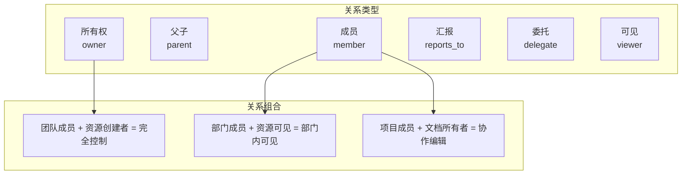
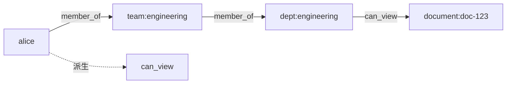
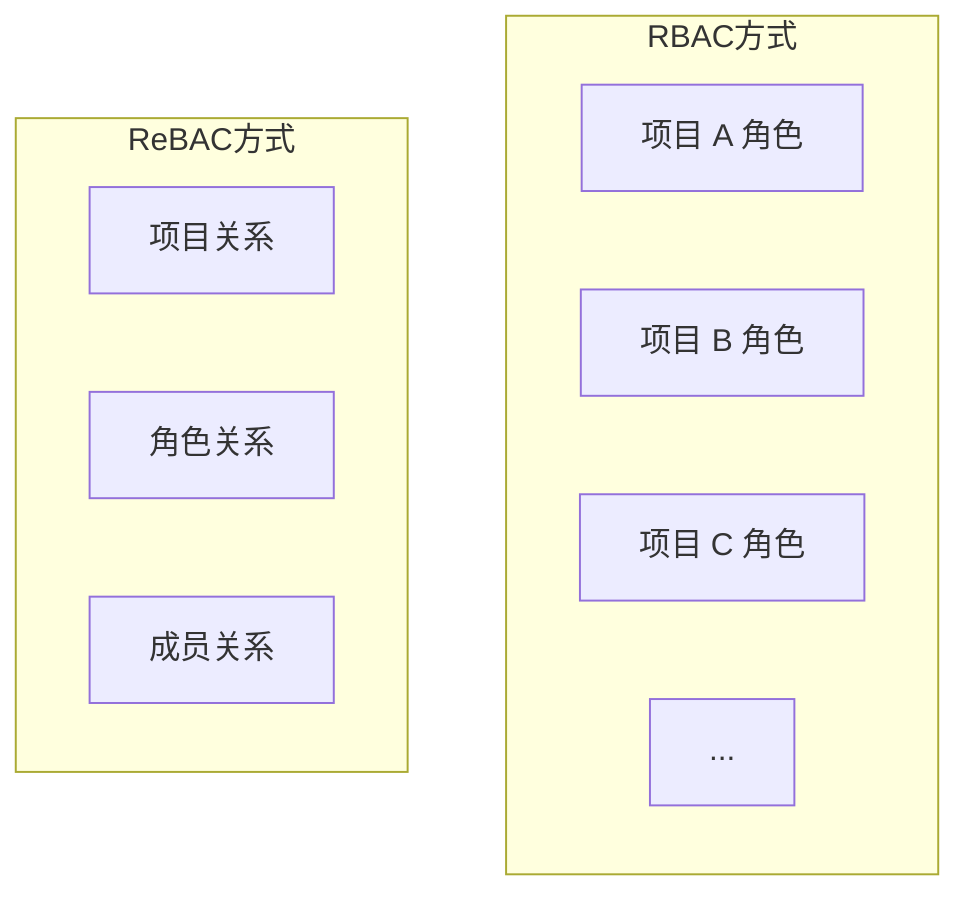
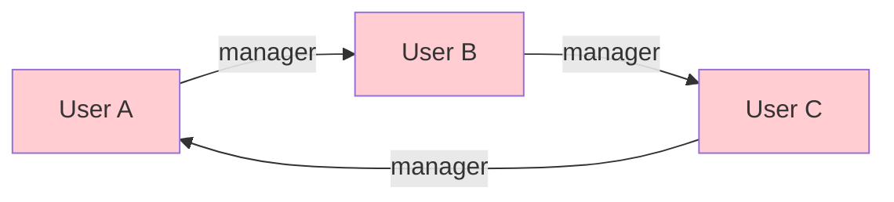

某科技公司的组织架构是这样的：CEO 之下是各事业部 VP，每个 VP 下有多个部门总监，每个总监下有若干团队经理，每个经理下有员工。同时，员工会参与各种跨部门的项目组。项目结束后，项目组的权限应该如何自动回收？

如果用 RBAC，你需要为每个项目组创建一个角色，项目结束时删除角色。但如果每年有 500 个项目呢？角色的增长速度会失控。

ReBAC（基于关系的访问控制）提供了一种更优雅的解决方案：**权限 = 关系**。

## 一、ReBAC 的核心思想

ReBAC 的核心洞察是：**权限不是孤立的标签，而是主体与资源之间的社会关系**。

```
alice 拥有(owner) 文档:doc-123
bob 编辑(editor) 文档:doc-123
charlie 订阅(subscribed) 文档:doc-123
```

不再是简单的「用户-角色-权限」，而是将关系作为一等公民：

| RBAC | ReBAC |
|------|-------|
| 用户拥有角色 | 用户与资源存在关系 |
| 角色决定权限 | 关系决定权限 |
| 角色是静态的 | 关系是动态的 |
| 角色需要手动管理 | 关系自动派生 |

### 1.1 关系的本质

关系不仅仅是「拥有」或「编辑」。在真实世界中，关系可以非常丰富：



## 二、关系类型

### 2.1 所有权关系（Ownership）

最基本的关系类型，表示对资源的控制权：

```json title="所有权关系示例"
{
  "relation": {
    "subject": "alice",
    "relation": "owner",
    "object": "folder:projects"
  }
}
```

### 2.2 层级关系（Hierarchy）

通过组织层级自动继承关系：

```json title="层级关系示例"
{
  "relations": [
    { "subject": "alice", "relation": "member", "object": "org:acme" },
    { "subject": "bob", "relation": "member", "object": "org:acme" },
    { "subject": "carol", "relation": "member", "object": "team:engineering" },
    { "subject": "team:engineering", "relation": "member", "object": "org:acme" }
  ]
}
```

### 2.3 成员关系（Membership）

```
alice ─member_of──> engineering_team ─member_of──> engineering_department ─member_of──> company
                                                                                            │
                                                                                    charlie ─member_of──> company
                                                                                            │
                                                                                            └── charlie 通过层级继承获得 engineering_department 的访问权限
```

### 2.4 委托关系（Delegation）

允许将权限委托给他人：

```json title="委托关系示例"
{
  "relation": {
    "subject": "alice",
    "relation": "delegation",
    "object": "folder:shared",
    "delegate": "bob",
    "expires_at": "2026-12-31T23:59:59Z"
  }
}
```

## 三、图模型表示

### 3.1 关系元组结构

ReBAC 使用关系元组（Relation Tuple）来表示所有关系：

```mermaid
flowchart LR
    subgraph "关系元组"
        N[Namespace]
        O[Object]
        R[Relation]
        S[Subject]
    end
    
    N -->|文件夹| O
    O -->|doc-123| R
    R -->|编辑| S
    S -->|alice|
    
    style N fill:#e3f2fd
    style O fill:#e8f5e9
    style R fill:#fff3e0
    style S fill:#fce4ec
```

| 字段 | 说明 | 示例 |
|------|------|------|
| `namespace` | 名称空间 | `folder`、`document`、`team` |
| `object` | 对象 ID | `doc-123`、`folder-projects` |
| `relation` | 关系类型 | `owner`、`editor`、`viewer` |
| `subject` | 主语 | `user:alice`、`team:engineering` |

### 3.2 关系查询

**直接关系查询**：查询主体与资源之间的直接关系

```json title="直接关系查询"
{
  "namespace": "document",
  "object": "doc-123",
  "subject": "user:alice"
}
```

**可达性查询**：查询主体是否通过关系路径可达



**路径查询**：查找两个实体之间的关系路径

```java title="路径查询实现"
public class RelationshipPathFinder {
    
    /**
     * 查找两个实体之间的关系路径
     */
    public List<Path> findPath(String from, String to) {
        Graph graph = buildGraph();
        
        BFSResult result = graph.bfs(from, to, maxDepth: 5);
        
        return result.getPaths().stream()
            .map(this::toReadablePath)
            .collect(Collectors.toList());
    }
    
    /**
     * 示例路径：
     * alice -> team:engineering -> member_of -> dept:engineering -> member_of -> doc-123 -> can_view
     */
}
```

## 四、Google Zanzibar 与 ReBAC

Google Zanzibar 是 ReBAC 最著名的工业实现，被用于 Google 内部的权限管理系统（YouTube、Google Drive、Google Cloud 等）。

### 4.1 Zanzibar 的关系模型

```json title="Zanzibar 关系元组示例"
[
  {"namespace": "doc", "object": "report-2024", "relation": "owner", "subject": "user:alice"},
  {"namespace": "doc", "object": "report-2024", "relation": "editor", "subject": "user:bob"},
  {"namespace": "doc", "object": "report-2024", "relation": "viewer", "subject": "team:marketing"},
  {"namespace": "team", "object": "marketing", "relation": "member", "subject": "user:charlie"}
]
```

### 4.2 权限检查示例

```
Alice 能编辑 report-2024 吗？

检查步骤：
1. 直接关系：doc:report-2024#editor@user:alice → NO
2. 通过团队：
   - user:alice ∈ team:engineering#member? → YES
   - doc:report-2024#editor@team:engineering? → NO
3. 通过所有权：
   - doc:report-2024#owner@user:alice → YES
   - owner 包含 editor 权限 → YES
```

## 五、ReBAC 的优势

### 5.1 自然表达组织关系

```java title="组织关系表达")
@Service
public class OrgRelationService {
    
    /**
     * 基于组织关系自动授权
     */
    public void grantOrgAccess(User user, Department dept) {
        // 部门成员可以查看部门文档
        tuples.add(RelationTuple.builder()
            .namespace("document")
            .object("dept:" + dept.getId())
            .relation("viewer")
            .subject("user:" + user.getId())
            .build());
        
        // 部门经理有编辑权限
        if (user.isDeptManager(dept)) {
            tuples.add(RelationTuple.builder()
                .namespace("document")
                .object("dept:" + dept.getId())
                .relation("editor")
                .subject("user:" + user.getId())
                .build());
        }
    }
}
```

### 5.2 避免角色爆炸

RBAC 的问题：100 个项目 × 每项目 5 个角色 = 500 个角色

ReBAC 的解法：定义通用关系 + 动态实例化



### 5.3 自动关系派生

当组织结构变化时，权限自动跟随：

```java title="自动派生示例")
public class RelationDerivationService {
    
    /**
     * 当员工转岗时，自动更新关系
     */
    public void onEmployeeTransfer(EmployeeTransfer transfer) {
        // 移除旧部门关系
        removeRelation(
            "user:" + transfer.getUserId(),
            "member",
            "team:" + transfer.getOldTeamId()
        );
        
        // 添加新部门关系
        addRelation(
            "user:" + transfer.getUserId(),
            "member",
            "team:" + transfer.getNewTeamId()
        );
        
        // 删除旧项目组关系（项目组与部门绑定）
        projectGroups.findByDepartment(transfer.getOldDept())
            .forEach(pg -> removeRelation(
                "user:" + transfer.getUserId(),
                "member",
                "project:" + pg.getId()
            ));
        
        // 添加新项目组关系
        projectGroups.findByDepartment(transfer.getNewDept())
            .forEach(pg -> addRelation(
                "user:" + transfer.getUserId(),
                "member",
                "project:" + pg.getId()
            ));
    }
}
```

## 六、ReBAC 的挑战

### 6.1 关系遍历性能

关系路径越深，查询越慢：

| 路径深度 | 典型延迟 | 优化策略 |
|---------|---------|---------|
| 1-2 层 | `<` 10ms | 直接索引 |
| 3-4 层 | 10-50ms | 缓存 + 预计算 |
| 5+ 层 | 50ms+ | 限制深度 + 降级 |

```java title="性能优化策略")
@Service
public class ReBACPerformanceService {
    
    // 预计算常用的关系组合
    private LoadingCache<String, Boolean> computedPermissions;
    
    /**
     * 限制最大遍历深度
     */
    public static final int MAX_TRAVERSAL_DEPTH = 5;
    
    /**
     * 超出深度的查询降级处理
     */
    public PermissionResult checkPermission(
            String subject, String object, String relation) {
        
        try {
            return graphService.checkWithTimeout(
                subject, object, relation,
                MAX_TRAVERSAL_DEPTH,
                100, TimeUnit.MILLISECONDS  // 100ms 超时
            );
        } catch (TimeoutException e) {
            // 超时降级：保守拒绝
            return PermissionResult.denied("查询超时，保守拒绝");
        }
    }
}
```

### 6.2 循环关系处理

需要防止循环依赖导致的问题：



```java title="循环检测")
public class CycleDetector {
    
    /**
     * 检测关系变更是否会产生循环
     */
    public boolean wouldCreateCycle(RelationTuple newTuple) {
        // 特殊关系类型才需要检测
        if (!requiresCycleCheck(newTuple.getRelation())) {
            return false;
        }
        
        // BFS 检测是否有回路
        Graph graph = buildCurrentGraph();
        return graph.hasCycleAfterAdding(
            newTuple.getSubject(),
            newTuple.getObject()
        );
    }
    
    private boolean requiresCycleCheck(String relation) {
        // 只有层级关系需要检测循环
        return Set.of("manager", "parent", "owner", "member")
            .contains(relation);
    }
}
```

### 6.3 一致性问题

分布式环境下，关系的一致性维护是挑战：

| 问题 | 解决方案 |
|------|---------|
| 写一致性 | 使用向量时钟或时间戳 |
| 读一致性 | 支持过期读取（staleness） |
| 顺序一致性 | 事务保证 |

## 七、Java 实现思路

### 7.1 关系元组存储

```java title="关系元组模型")
@Entity
@Table(name = "relation_tuples")
public class RelationTuple {
    
    @Id
    private String id;
    
    @Column(nullable = false)
    private String namespace;
    
    @Column(nullable = false)
    private String objectId;
    
    @Column(nullable = false)
    private String relation;
    
    @Column(nullable = false)
    private String subjectId;
    
    @Column
    private String subjectRelation;  // 通用的 subject 可以指定子关系
    
    @Column
    private Instant createdAt;
    
    @Column
    private Instant deletedAt;  // 软删除
}
```

### 7.2 权限检查引擎

```java title="ReBAC 权限检查器")
@Service
public class ReBACPermissionChecker {
    
    @Autowired
    private TupleRepository tupleRepository;
    
    @Autowired
    private GraphService graphService;
    
    /**
     * 检查权限：subject 是否对 object 有 relation 权限
     */
    public PermissionCheckResult check(
            String subject,
            String namespace,
            String objectId,
            String relation) {
        
        // 1. 直接关系检查
        if (hasDirectRelation(subject, namespace, objectId, relation)) {
            return PermissionCheckResult.permit();
        }
        
        // 2. 通配符关系检查
        if (hasWildcardRelation(subject, namespace, objectId, relation)) {
            return PermissionCheckResult.permit();
        }
        
        // 3. 关系路径遍历
        Set<String> reachable = graphService.findReachable(
            subject, namespace + ":" + objectId);
        
        for (String target : reachable) {
            if (impliesRelation(target, relation)) {
                return PermissionCheckResult.permit();
            }
        }
        
        return PermissionCheckResult.denied();
    }
    
    /**
     * 关系蕴含：owner 蕴含 editor 和 viewer
     */
    private boolean impliesRelation(String sourceRelation, String targetRelation) {
        Map<String, Set<String>> hierarchy = Map.of(
            "owner", Set.of("editor", "viewer", "commenter"),
            "editor", Set.of("viewer", "commenter"),
            "viewer", Set.of()
        );
        
        return hierarchy.getOrDefault(sourceRelation, Set.of())
            .contains(targetRelation);
    }
}
```

## 八、应用案例

### 8.1 Google Drive 权限系统

```
文档 doc-123 的权限树：

owner: user:alice
  └─ editor: user:bob (直接)
  └─ viewer: group:marketing (直接)
        └─ member: user:charlie (派生)
        └─ member: user:david (派生)
```

### 8.2 云资源权限继承

```json title="云资源关系模型")
{
  "relations": [
    { "subject": "org:acme", "relation": "owner", "object": "folder:root" },
    { "subject": "folder:root", "relation": "parent", "object": "folder:projects" },
    { "subject": "folder:projects", "relation": "parent", "object": "folder:2024" },
    { "subject": "folder:2024", "relation": "parent", "object": "project:alpha" },
    { "subject": "user:alice", "relation": "member", "object": "org:acme" }
  ]
}
```

:::tip 核心洞察
ReBAC 的本质是「用关系表达权限」。当你发现系统中的「角色」越来越多、越来越难管理时，尝试从关系的角度重新审视问题——也许你能找到一条更简洁的路径。
:::

## 思考题

**问题 1**：在设计一个支持 ReBAC 的系统时，如何平衡关系的表达能力和系统的可维护性？

<details>
<summary>参考答案</summary>

平衡策略：

**1. 关系类型最小化**
- 只定义必要的核心关系
- 通过关系组合实现复杂场景
- 避免「万能关系」

**2. 关系命名规范**
- 使用动词或介词：`owns`、`member_of`、`reports_to`
- 避免歧义：`manage` vs `administer` vs `control`

**3. 关系层级限制**
- 限制最大继承深度（建议 3-5 层）
- 深层关系通过显式授权代替

**4. 关系可审计**
- 所有关系变更记录日志
- 支持关系追溯和问题排查

**5. 关系可视化**
- 提供关系图可视化工具
- 帮助管理员理解复杂关系

**6. 定期清理**
- 识别并清理孤立关系
- 删除已不存在的实体的关系
</details>

**问题 2**：假设你需要为一个社交平台实现 ReBAC 权限系统，支持「关注」「好友」「粉丝」等关系。你会如何设计关系模型？

<details>
<summary>参考答案</summary>

社交平台关系模型设计：

**核心关系**：

```json
[
  // 用户间的社会关系
  { "subject": "user:alice", "relation": "follows", "object": "user:bob" },
  { "subject": "user:bob", "relation": "follows", "object": "user:alice" },
  { "subject": "user:alice", "relation": "friends", "object": "user:carol" },
  
  // 用户与内容的关系
  { "subject": "user:alice", "relation": "owner", "object": "post:123" },
  { "subject": "user:alice", "relation": "liked", "object": "post:456" },
  { "subject": "user:bob", "relation": "commented", "object": "post:123" },
  
  // 群组关系
  { "subject": "user:alice", "relation": "member", "object": "group:hikers" },
  { "subject": "group:hikers", "relation": "member", "object": "post:789" }
]
```

**权限派生规则**：

| 关系 | 派生的查看权限 | 派生的编辑权限 |
|------|--------------|--------------|
| owner | 所有内容 | 所有内容 |
| follows | 公开内容 | 仅自己内容 |
| friends | 公开 + 好友可见 | 好友内容 |
| group member | 群组内容 | 群组内容（编辑者） |

**关键设计点**：
1. 使用软删除保留历史关系
2. 关注关系不对称（A 关注 B 不等于 B 关注 A）
3. 好友关系是双向的
4. 隐私设置覆盖关系权限
</details>
