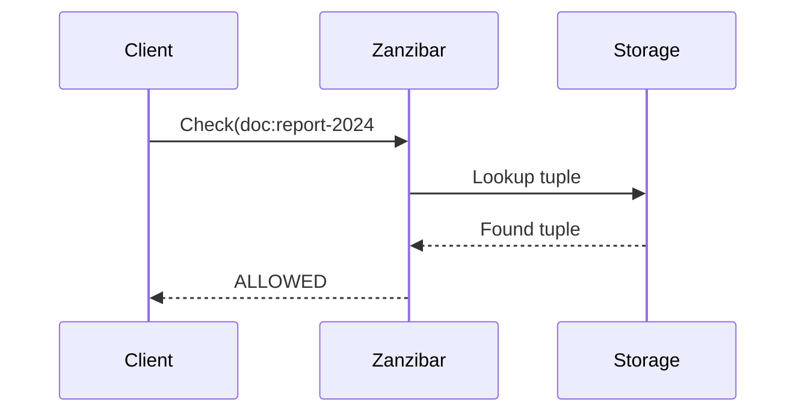
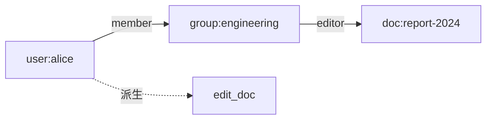
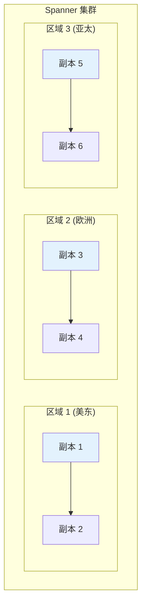
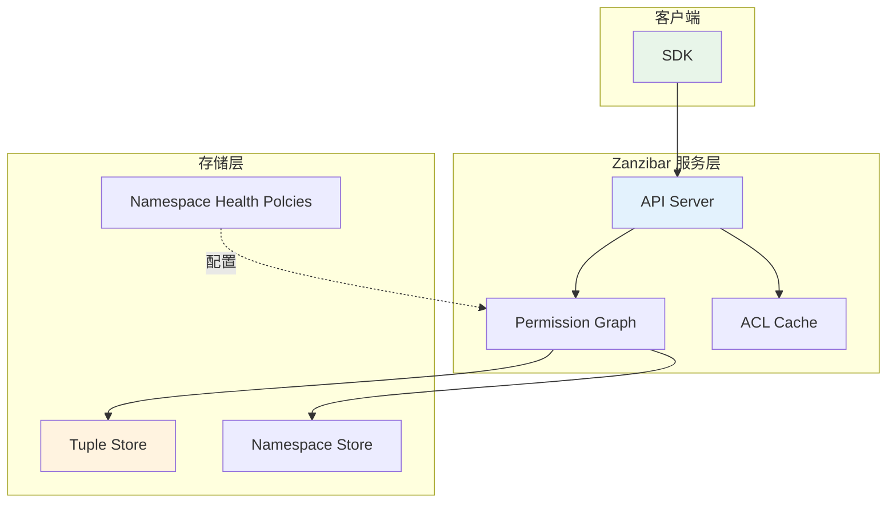
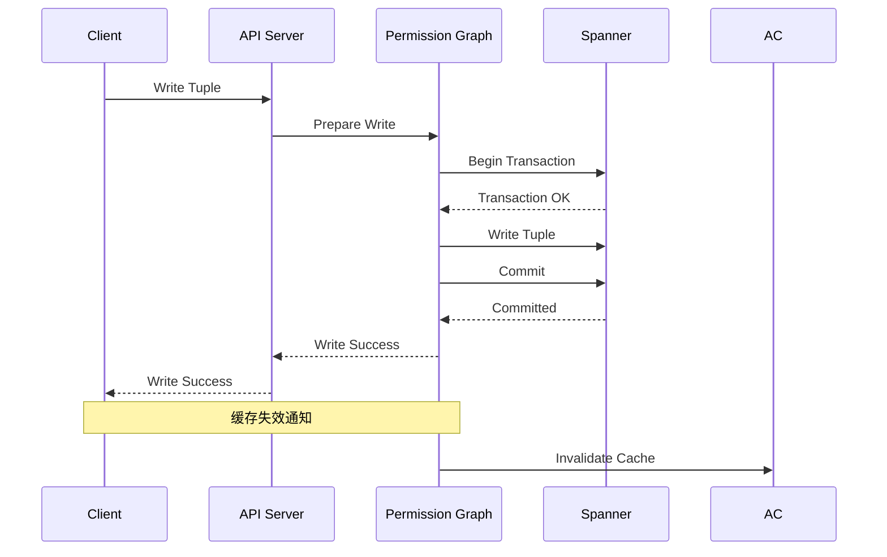
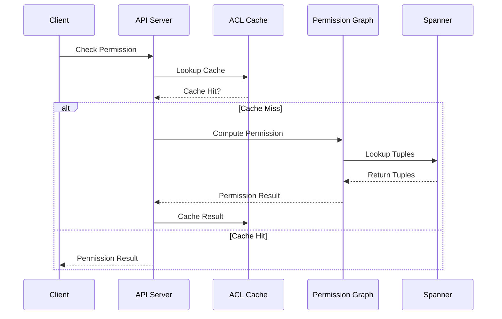
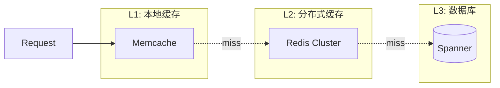

2019 年，Google 发表了一篇震撼业界的论文：《Zanzibar: Google's Consistent, Global Authorization System》。这篇论文描述了 Google 内部使用了 10 年的权限系统，它支撑着 YouTube、Google Drive、Google Cloud 等数十亿用户产品的授权决策。

一个每秒处理数百万请求、全球分布式部署、保证强一致性、同时支持毫秒级延迟的权限系统——它是如何做到的？

## 一、背景与设计目标

### 1.1 Google 的权限挑战

Google 的产品有一个独特之处：**跨服务的统一授权**。

当你在 YouTube 上分享一个视频给特定用户时，这个授权决策需要在 YouTube、Gmail、Google Drive 等多个系统中生效。传统的「每个服务自己管理权限」模式无法满足需求。

### 1.2 核心设计目标

| 目标 | 说明 | 挑战 |
|------|------|------|
| 一致性 | 全局权限视图 | 跨数据中心复制 |
| 低延迟 | P99 `<` 10ms | 复杂关系计算 |
| 高可用 | `>` 99.999% | 故障转移 |
| 全球复制 | 多区域部署 | 一致性协议 |
| 灵活模型 | 支持任意关系 | 表达能力强 |

## 二、核心数据结构

### 2.1 Relation Tuple（关系元组）

Zanzibar 的核心数据模型是 Relation Tuple：

```mermaid
flowchart LR
    subgraph "Relation Tuple"
        N[namespace]
        O[object_id]
        R[relation]
        S[subject]
    end
    
    N -->|"doc"| O
    O -->|"report-123"| R
    R -->|"viewer"| S
    S -->|"user:alice"|
    
    style N fill:#e3f2fd
    style O fill:#e8f5e9
    style R fill:#fff3e0
    style S fill:#fce4ec
```

| 字段 | 类型 | 说明 |
|------|------|------|
| `namespace` | string | 名称空间（如 `doc`、`folder`） |
| `object_id` | string | 对象标识 |
| `relation` | string | 关系类型（如 `owner`、`editor`） |
| `subject` | Subject | 主语（可以是用户或群组） |

### 2.2 Subject（主语）

Subject 可以是用户或群组：

```json title="Subject 定义"
{
  "subject": {
    "oneof": {
      "user": { "user_id": "alice" },
      "group": {
        "group_id": "engineering",
        "namespace": "group"
      }
    }
  }
}
```

群组本身可以有成员关系，形成层级结构：

```
user:alice ∈ group:engineering
group:engineering ∈ group:all-employees
```

### 2.3 示例数据

```json title="Zanzibar 数据示例"
[
  {
    "namespace": "doc",
    "object_id": "report-2024",
    "relation": "owner",
    "subject": { "user": { "user_id": "alice" } }
  },
  {
    "namespace": "doc",
    "object_id": "report-2024",
    "relation": "editor",
    "subject": { "group": { "group_id": "engineering", "namespace": "group" } }
  },
  {
    "namespace": "group",
    "object_id": "engineering",
    "relation": "member",
    "subject": { "user": { "user_id": "bob" } }
  },
  {
    "namespace": "group",
    "object_id": "engineering",
    "relation": "member",
    "subject": { "user": { "user_id": "charlie" } }
  }
]
```

## 三、权限模型

### 3.1 直接权限检查

检查用户是否与对象有直接关系：



### 3.2 群组权限检查

通过群组间接获得权限：

```
user:alice ∈ group:engineering
doc:report-2024#editor@group:engineering
───────────────────────────────
user:alice can edit doc:report-2024
```



### 3.3 关系类型定义

```json title="Namespace 配置示例")
{
  "name": "doc",
  "relation_definitions": [
    {
      "name": "owner",
      "userset_rewrite": { "union": { "root": [] } }
    },
    {
      "name": "editor",
      "userset_rewrite": {
        "union": {
          "root": [
            { "computed": { "relation": "owner" } },
            { "tupleToUserset": { "tupleset": "parent", "computedUserset": { "relation": "editor" } } }
          ]
        }
      }
    },
    {
      "name": "viewer",
      "userset_rewrite": {
        "union": {
          "root": [
            { "computed": { "relation": "editor" } },
            { "computed": { "relation": "owner" } },
            { "tupleToUserset": { "tupleset": "parent", "computedUserset": { "relation": "viewer" } } }
          ]
        }
      }
    },
    {
      "name": "parent",
      "relation_reference": { "namespace": "folder" }
    }
  ]
}
```

### 3.4 Computed Userset

直接从其他关系继承权限：

```json
{
  "computed": {
    "relation": "owner"  // viewer 继承 owner 的所有主体
  }
}
```

### 3.5 TupleToUserset

通过元组动态计算权限主体：

```json
{
  "tupleToUserset": {
    "tupleset": "parent",           // 查找 parent 关系
    "computedUserset": {
      "relation": "editor"          // 使用找到的对象的 editor 关系
    }
  }
}
```

**含义**：如果 `folder:project#editor@group:alice-team`，则 `doc:readme#viewer@group:alice-team`（继承父文件夹的 editor 权限）。

## 四、一致性模型

### 4.1 Zooke's Law 挑战

分布式系统面临一个基本权衡：**一致性 vs 延迟**。

```
延迟越低 → 允许更大的不一致窗口
延迟越高 → 可以提供更强的一致性保证
```

### 4.2 快照读取 vs 即时读取

| 模式 | 一致性 | 延迟 | 场景 |
|------|--------|------|------|
| Snapshot Read | 固定时间点 | 低 | 历史权限查询 |
| Immediate Read | 写入后立即可读 | 中 | 一般场景 |
| Linearized Read | 全局顺序保证 | 高 | 关键操作 |

### 4.3 ZooKeeper 的教训

Google 早期使用 ZooKeeper 管理权限，发现：

- **写入瓶颈**：ZooKeeper 的 leader 成为写入热点
- **扩展困难**：无法水平扩展
- **延迟高**：P99 延迟达数百毫秒

### 4.4 Spanner 的解决方案

Zanzibar 底层使用 Google Spanner 数据库：

- 全球分布式的强一致性数据库
- 基于 TrueTime（GPS + 原子钟）
- 提供全局有序的事务



## 五、架构设计

### 5.1 系统架构



### 5.2 核心组件

| 组件 | 职责 |
|------|------|
| API Server | 处理客户端请求路由 |
| Permission Graph | 权限计算引擎 |
| ACL Cache | 权限结果缓存 |
| Tuple Store | 关系元组持久化 |
| Namespace Store | 命名空间配置存储 |

### 5.3 写入流程



### 5.4 读取流程



## 六、Watch API 与实时通知

### 6.1 Watch 机制

Zanzibar 支持订阅权限变更：

```protobuf title="Watch API 定义")
rpc WatchChanges(WatchRequest) returns (stream WatchResponse) {}

message WatchRequest {
    string namespace_filter = 1;
    string object_id_filter = 2;
    int64 start_read_offset = 3;  // 从哪个时间点开始
}

message WatchResponse {
    repeated RelationshipUpdate updates = 1;
    int64 read_offset = 2;
}
```

### 6.2 应用场景

| 场景 | 说明 |
|------|------|
| 缓存同步 | 权限变更时主动更新缓存 |
| 审计日志 | 记录所有权限变更 |
| 实时通知 | 用户权限变更时发送通知 |
| 跨系统同步 | 其他系统同步权限状态 |

## 七、性能数据

### 7.1 论文中的性能指标

| 指标 | 数值 |
|------|------|
| 全球请求量 | 每天数十亿次 |
| 峰值 QPS | 数百万 |
| P50 延迟 | 2ms |
| P99 延迟 | 10ms |
| P99.9 延迟 | 100ms |
| 可用性 | 99.999% |

### 7.2 性能优化策略

**缓存层设计**：



**缓存失效策略**：
- 写时失效（Write-through Invalidation）
- 版本号控制
- 渐进过期

## 八、启发与局限

### 8.1 Zanzibar 的核心贡献

| 贡献 | 影响 |
|------|------|
| 全球一致的权限系统 | 证明了大规模 ReBAC 的可行性 |
| 灵活的关系模型 | 支持任意复杂的权限场景 |
| 一致性与延迟权衡 | 提供了可配置的一致性级别 |
| 开源实现参考 | OpenFGA 等项目借鉴其设计 |

### 8.2 局限性

| 局限 | 说明 |
|------|------|
| 运维复杂度 | 全球分布式系统的运维挑战 |
| 延迟下界 | 即使有缓存，最慢情况仍达 100ms |
| 表达能力 | 不支持数值比较（如 `amount < 10000`） |
| 运维成本 | 需要专业团队维护 |

### 8.3 开源实现

基于 Zanzibar 论文的开源实现：

| 项目 | 特点 |
|------|------|
| OpenFGA | Auth0 出品，Zanzibar 的轻量实现 |
| Casbin | 支持多种模型，社区活跃 |
| OPA | 通用策略引擎，可与 Zanzibar 概念结合 |

:::tip 核心洞察
Zanzibar 的精髓不在于某个具体技术，而在于**将复杂的关系计算转化为可扩展的分布式系统问题**。它证明了：只要架构设计得当，即使是「用户 A 能否访问资源 B」这样看似简单的问题，也可以优雅地解决。
:::

## 思考题

**问题 1**：Zanzibar 的「一致性 vs 延迟」权衡对实际业务系统设计有什么启示？

<details>
<summary>参考答案</summary>

核心启示：

**1. 不同操作需要不同一致性级别**
- 权限检查：可以使用「稍旧」的数据（P99 10ms）
- 权限写入：需要强一致性
- 管理员操作：可以接受更高延迟

**2. 一致性是可配置的**
- 根据业务需求选择合适的一致性级别
- 关键操作使用强一致性
- 普通操作使用最终一致性

**3. 缓存是性能的关键**
- 多级缓存架构
- 写时失效策略
- 版本号控制并发

**4. 接受不完美**
- 没有完美的系统
- 权衡是设计的核心
- 满足业务需求优先
</details>

**问题 2**：如果让你设计一个类似 Zanzibar 的系统，你会如何选择存储层？请比较几种可能的方案。

<details>
<summary>参考答案</summary>

存储层方案对比：

| 方案 | 优点 | 缺点 | 适用场景 |
|------|------|------|---------|
| Spanner | 强一致，全球分布 | 成本高，需要 GCP | 大型互联网公司 |
| CockroachDB | 开源，强一致 | 延迟较高 | 自建团队 |
| TiDB | MySQL 兼容，强一致 | 生态较新 | MySQL 用户迁移 |
| Cassandra | 高可用，写吞吐高 | 最终一致 | 写入密集型 |
| etcd | 强一致，成熟 | 扩展性有限 | 中小规模 |
| 自研 | 完全可控 | 开发成本高 | 有特殊需求 |

**推荐方案**：
- 初创公司：使用 OpenFGA（云服务）快速验证
- 中型公司：CockroachDB + 应用层缓存
- 大型公司：参考 Zanzibar 设计自研
</details>
