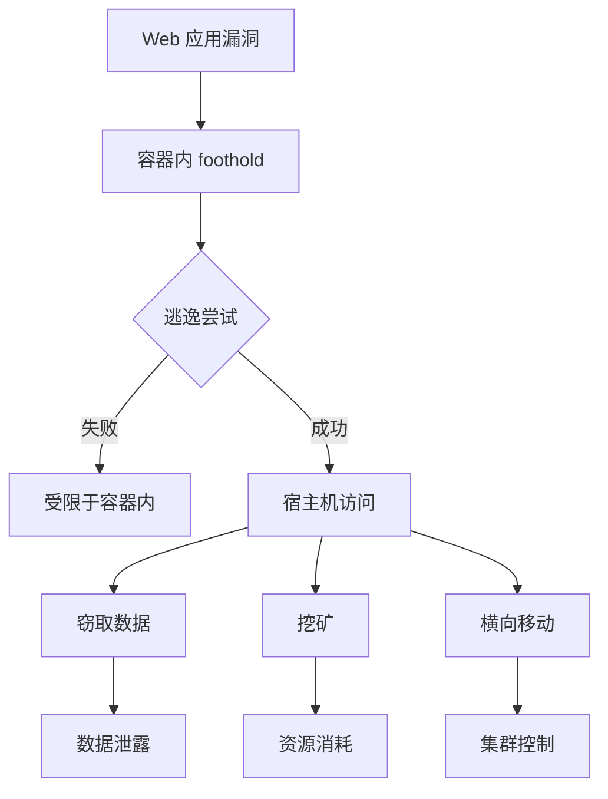

想象一下：攻击者拿下了你的 Web 应用容器，正准备渗透到宿主机以获取更多资源。他们尝试读取 `/etc/shadow`——失败了，权限不足。他们尝试挂载宿主机的文件系统——失败了，Seccomp 阻止了。他们尝试利用内核漏洞提权——失败了，AppArmor 限制了攻击面。

如果没有这些防护机制呢？攻击者可能已经通过容器逃逸控制了整个节点，进而横向移动到其他 Pod，甚至获取集群管理员权限。

**容器逃逸是云原生环境中最严重的安全威胁之一**。一旦逃逸成功，攻击者就突破了容器的隔离边界，可以访问宿主机上的资源、其他容器的数据，甚至整个 Kubernetes 集群。

## 容器逃逸的定义与危害

容器逃逸（Container Escape）是指攻击者从容器内部突破容器的隔离限制，获取宿主机或其他容器访问权限的攻击行为。

### 逃逸的危害程度

**节点资源访问**：获取宿主机的 CPU、内存、存储资源，可以用于挖矿或发起 DoS 攻击。

**Kubernetes API 访问**：如果宿主机上的 kubelet 配置不当，可以直接调用 Kubernetes API 获取集群资源。

**跨容器攻击**：可以访问同一节点上的其他容器，窃取敏感数据。

**持久化攻击**：在宿主机上建立后门，即使容器重启或重建也能保持访问。

**集群横向移动**：通过获取的凭证横向移动到其他节点或命名空间。



## 容器逃逸的攻击向量

### 特权容器（Privileged Container）

特权容器是安全风险最高的容器配置。在特权模式下，容器的 Capabilities 几乎与宿主机上的 root 用户相同。

```bash title="创建特权容器"
# 危险配置示例
docker run --privileged nginx:latest

# 或等效的 Kubernetes 配置
securityContext:
  privileged: true
```

**特权容器的风险**：攻击者可以访问宿主机的所有设备，可以加载内核模块，可以修改网络配置，可以访问宿主机文件系统。

**检测特权容器**：

```bash title="检测特权容器"
# 检查正在运行的特权容器
docker ps --filter "publish=privileged"

# 使用 Falco 检测特权容器
- rule: Privileged container
  desc: >
    A privileged container was created
  condition: >
    container and
    container.privileged = true
  output: >
    Privileged container
    (container=%container.name image=%container.image.repository)
  priority: CRITICAL
```

### 挂载宿主目录（HostPath）

通过 HostPath 将宿主机的敏感目录挂载到容器内，是另一种常见的逃逸路径。

```yaml title="危险的 HostPath 配置"
# 危险配置
volumes:
  - name: hostfs
    hostPath:
      path: /
      type: Directory
```

如果将宿主机的根目录挂载到容器，攻击者可以直接修改宿主机的文件系统。

**安全建议**：HostPath 挂载应该尽量避免，如果必须使用，只挂载特定的必要目录。

```yaml title="安全的 HostPath 配置"
# 仅挂载必要的只读目录
volumes:
  - name: log-dir
    hostPath:
      path: /var/log/myapp
      type: DirectoryOrCreate
```

### 共享命名空间（--pid=host / --net=host）

共享宿主机的 PID 或网络命名空间，会显著增加逃逸风险。

```bash title="危险的命名空间共享"
# 共享 PID 命名空间
docker run --pid=host nginx:latest

# 共享网络命名空间
docker run --net=host nginx:latest
```

**共享 PID 命名空间的风险**：可以查看宿主机的所有进程，包括其他容器进程，可以对宿主机进程进行操作。

**共享网络命名空间的风险**：可以直接访问宿主机的网络栈，可以监听宿主机上的所有网络流量。

### 内核漏洞利用

Linux 内核漏洞是容器逃逸的另一种途径。即使容器配置了最小权限，内核漏洞仍然可能被利用。

**Dirty COW（CVE-2016-5195）**：通过竞态条件实现权限提升，影响 2016 年前的所有 Linux 内核。

**Dirty Pipe（CVE-2022-0847）**：Linux 5.8+ 内核的管道缓冲区漏洞，可用于提权。

**Polkit 漏洞**：容器内可以通过 Polkit 漏洞进行特权升级。

**防范措施**：保持内核更新、限制容器 Capabilities、使用只读文件系统。

### 容器运行时漏洞

容器运行时的漏洞也可能被利用进行逃逸。

**containerd CVE-2022-23612**：containerd 的 snapshotter 组件漏洞，允许容器访问宿主机文件系统。

**runc CVE-2021-30465**：runc 的挂载传播漏洞，可用于容器逃逸。

## 容器逃逸的防护措施

### 禁止特权容器

最基本的安全配置是禁止特权容器运行。

**Kubernetes PSP/PSS 配置**：

```yaml title="禁止特权容器"
apiVersion: policy/v1beta1
kind: PodSecurityPolicy
metadata:
  name: no-privileged
spec:
  privileged: false
  seLinux:
    rule: RunAsAny
  supplementalGroups:
    rule: RunAsAny
  runAsUser:
    rule: RunAsAny
  fsGroup:
    rule: RunAsAny
  volumes:
    - '*'
```

**OPA Gatekeeper 配置**：

```yaml title="OPA Gatekeeper 约束"
apiVersion: constraints.gatekeeper.sh/v1beta1
kind: K8sPSPPrivilegedContainer
metadata:
  name: no-privileged-container
spec:
  match:
    kinds:
      - apiGroups: [""]
        kinds: ["Pod"]
```

### 最小化 Capabilities

Linux Capabilities 将传统的超级用户权限分解为多个独立单元。容器默认只需要少量 Capabilities。

```yaml title="最小化 Capabilities 配置"
securityContext:
  capabilities:
    drop:
      - ALL
    add:
      - NET_BIND_SERVICE
```

**常见 Capabilities 说明**：

| Capability | 说明 | 风险 |
| --- | --- | --- |
| CAP_SYS_ADMIN | 系统管理员权限 | 高，允许挂载等敏感操作 |
| CAP_NET_ADMIN | 网络管理员权限 | 中，允许修改网络配置 |
| CAP_SYS_MODULE | 加载内核模块 | 高，可用于内核漏洞利用 |
| CAP_NET_BIND_SERVICE | 绑定低端口 | 低，常规需求 |

### Seccomp 配置

Seccomp（Secure Computing Mode）限制容器可以执行的系统调用。

**使用预定义 Seccomp 配置文件**：

```yaml title="使用 RuntimeDefault Seccomp"
securityContext:
  seccompProfile:
    type: RuntimeDefault
```

**自定义 Seccomp 配置**：

```json title="custom-seccomp.json"
{
  "defaultAction": "SCMP_ACT_ERRNO",
  "architectures": [
    "SCMP_ARCH_X86_64"
  ],
  "syscalls": [
    {
      "names": [
        "read",
        "write",
        "open",
        "close"
      ],
      "action": "SCMP_ACT_ALLOW"
    },
    {
      "names": [
        "mount",
        "ptrace",
        "syslog"
      ],
      "action": "SCMP_ACT_ERRNO"
    }
  ]
}
```

### AppArmor/SELinux 配置

**AppArmor** 是 Debian/Ubuntu 系统的 MAC（强制访问控制）系统：

```yaml title="AppArmor 配置"
annotations:
  container.apparmor.security.beta.kubernetes.io/myapp: "localhost/profile-name"
```

**SELinux** 是 RedHat/CentOS 系统的 MAC 系统：

```yaml title="SELinux 配置"
securityContext:
  seLinuxOptions:
    level: "s0:c123,c456"
    role: "system_r"
    type: "container_t"
```

### 只读文件系统

容器文件系统默认是可写的，但这增加了被攻击的风险。

```yaml title="只读根文件系统"
securityContext:
  readOnlyRootFilesystem: true
```

如果应用需要写入临时文件，可以挂载 tmpfs：

```yaml title="挂载 tmpfs"
volumeMounts:
  - name: tmp
    mountPath: /tmp
volumes:
  - name: tmp
    emptyDir:
      medium: Memory
```

## 逃逸检测方法

### Falco 检测规则

```yaml title="容器逃逸检测规则"
# 检测容器内加载内核模块
- rule: Detect内核模块加载
  desc: Container attempted to load a kernel module
  condition: >
    spawned_process and
    container and
    proc.name = "modprobe" or proc.name = "insmod"
  output: >
    Kernel module loading in container
    (container=%container.name proc=%proc.name)
  priority: CRITICAL

# 检测敏感目录访问
- rule: Sensitive directory mount access
  desc: Container accessed sensitive host directory
  condition: >
    container and
    (
      fd.name startswith "/host/sys" or
      fd.name startswith "/host/proc/sys" or
      fd.name startswith "/host/etc/shadow"
    )
  output: >
    Sensitive directory access
    (container=%container.name file=%fd.name)
  priority: HIGH

# 检测特权操作
- rule: Detect特权操作
  desc: Container attempted privileged operation
  condition: >
    container and
    syscalls contains "mount" and
    not expected_mount_paths
  output: >
    Privileged mount attempt
    (container=%container.name syscall=%syscall.type)
  priority: HIGH
```

:::warning 防御的局限性
没有任何单一防护措施是完美的。真正的安全需要纵深防御：最小权限原则 + 运行时监控 + 内核更新 + 限制攻击面。即使某一层被突破，还有其他层作为缓冲。
:::

## 总结与延伸思考

容器逃逸是云原生安全中最具破坏性的威胁之一。防护的核心思路是「最小权限」：只授予容器完成任务所需的最小权限，不多一分一毫。

在实际工作中，经常遇到的问题是「安全与便利的冲突」。开发者可能抱怨最小权限配置太复杂，影响了开发效率。这时的决策标准应该是：**如果这个容器被攻破，攻击者能获得多大的权限？** 如果答案是「整个集群」，那么再麻烦的限制都是值得的。

### 思考题

**问题 1**：为什么说容器内的 root 用户与宿主机的 root 用户本质上不同？
<details>
<summary>参考答案</summary>

容器内的 root 用户虽然在容器内具有完整权限，但其权限受到多个安全机制的约束：1）Namespace 隔离：容器内的进程在独立的 PID、Network、Mount 等命名空间中运行；2）Capabilities：容器内的 root 默认只拥有少量 Capabilities（如 CAP_CHOWN、CAP_DAC_OVERRIDE），而宿主机 root 拥有所有 Capabilities；3）Cgroups：容器的资源使用受 Cgroups 限制；4）Seccomp/AppArmor：容器被限制只能执行部分系统调用。但这种隔离不是绝对安全的，内核漏洞可能突破这些限制。
</details>

**问题 2**：如果业务确实需要某些特权操作（如加载特定内核模块），应该如何处理？
<details>
<summary>参考答案</summary>

对于确实需要特权操作的业务，建议采用以下方案：1）评估是否可以用用户空间替代方案，避免内核操作；2）如果必须使用，考虑将特权操作抽取为独立服务，以 Sidecar 模式运行最小化特权容器；3）使用 Kubernetes 的 Device Plugin 机制，为需要特殊硬件访问的容器提供受控访问；4）如果需要完整的系统权限，考虑使用虚拟机而非容器（如 Kata Containers、gVisor）；5）无论如何，都不应该在应用容器中使用 `--privileged` 标志。
</details>
