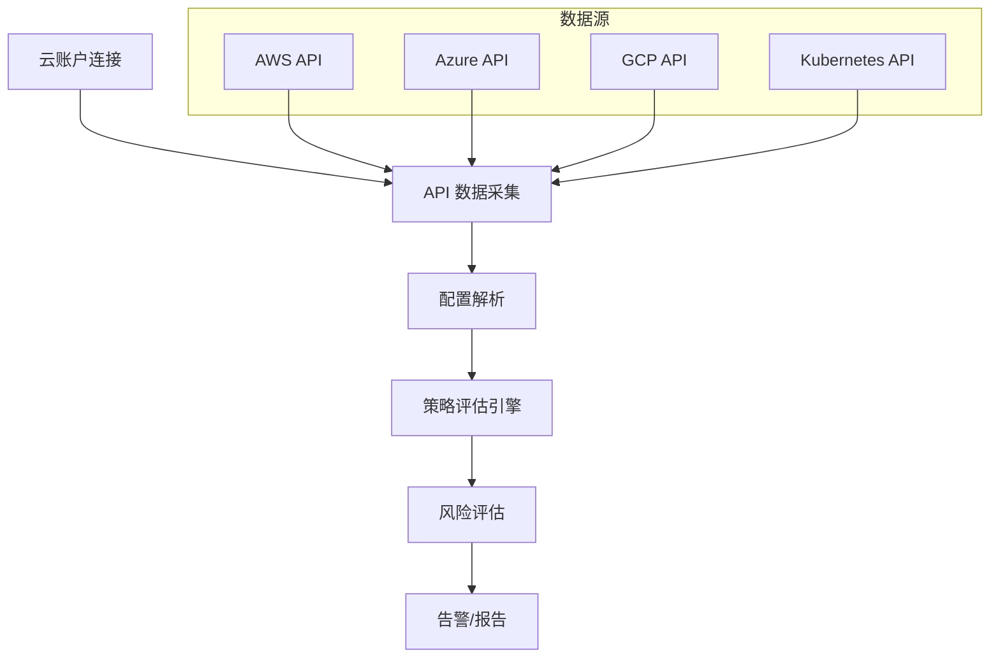
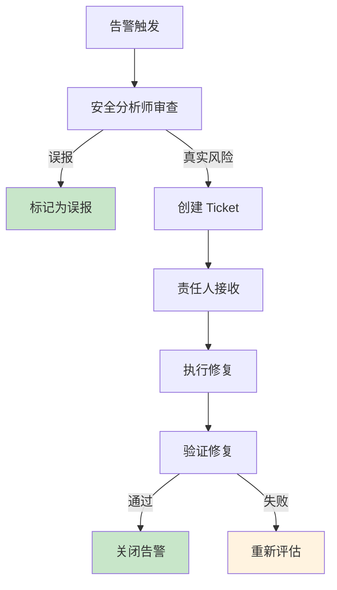
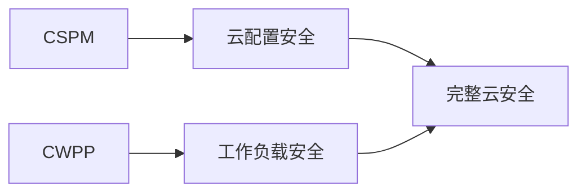

某公司安全团队进行了一次云安全评估。他们发现：

- 30% 的 S3 Bucket 配置为公开访问
- 50% 的 IAM 用户没有启用 MFA
- 20% 的 EBS 卷未启用加密
- 80% 的 Kubernetes 集群没有启用 RBAC 最小权限

**这些问题不是运行时威胁，而是配置错误**。它们存在于云服务的配置中，不被传统安全工具检测到。

CSPM（Cloud Security Posture Management）正是为了解决这个问题——持续评估云资源配置，检测配置错误，修复安全风险。

## CSPM（Cloud Security Posture Management）的定义

Gartner 将 CSPM 定义为：**持续评估和改进云安全态势的解决方案，通过自动化检测和修复配置错误来减少云环境的风险暴露**。

CSPM 的核心特征：

**云原生**：直接与云服务 API 集成，理解云服务的语义。

**配置评估**：检查云资源配置是否符合安全最佳实践。

**持续监控**：实时或定时评估，及时发现配置漂移。

**修复工作流**：提供修复建议或自动化修复。

## CSPM 的核心能力

### 资产发现

自动发现云环境中的所有资源：

- 计算资源（EC2、Azure VM、GCE 实例）
- 存储资源（S3、Azure Blob、GCS）
- 数据库资源（RDS、Azure SQL、Cloud SQL）
- 网络资源（VPC、Security Group、网络配置）
- Kubernetes 集群和工作负载

### 合规评估

**行业标准**：

- CIS Cloud Benchmarks
- SOC 2
- PCI DSS
- ISO 27001
- HIPAA

**云服务商特定**：

- AWS Well-Architected Framework
- Azure Security Benchmark
- GCP Security Command Center

### 威胁检测

**配置变更检测**：检测异常的云资源配置变更。

**身份威胁检测**：检测异常的 IAM 操作。

**网络威胁检测**：检测暴露到公网的资源。

## CSPM 的工作原理

### 数据采集



### 云账户连接方式

| 方式 | 说明 | 权限 |
| --- | --- | --- |
| Read-Only Role | 跨账户 IAM Role | 读取配置 |
| Service Principal | 应用程序主体 | 读取 + 修复 |
| Federation | 身份联合 | SSO 集成 |
| Cloud-native | CSPM 内置 | 自动配置 |

### AWS 配置示例

```json title="AWS Config 聚合器权限"
{
  "Version": "2012-10-17",
  "Statement": [
    {
      "Effect": "Allow",
      "Action": [
        "config:BatchGetAggregateResourceConfig",
        "config:ListDiscoveredResources",
        "config:PutEvaluations"
      ],
      "Resource": "*"
    }
  ]
}
```

## CSPM 工具对比

### Prisma Cloud

最全面的企业级 CSPM 平台。

**核心功能**：

- 多云支持（AWS、Azure、GCP）
- 合规框架（30+）
- 运行时安全（CWPP 集成）
- 数据安全
- 网络安全

**技术特点**：

- Policy-as-Code（OPA 集成）
- Terraform 安全集成
- CI/CD 集成

### AWS Security Hub

AWS 原生的安全态势管理工具。

**核心功能**：

- AWS 资源评估
- 与 AWS 服务的深度集成
- AWS Config 集成
- GuardDuty 集成

**局限性**：

- 仅支持 AWS
- 合规框架有限
- 自���义策略能力弱

### Microsoft Defender for Cloud

Azure 原生的安全态势管理工具。

**核心功能**：

- Azure 资源评估
- 与 Microsoft 365 集成
- 混合云支���
- 安全态势评估

**技术特点**：

- 云安全图表
- 攻击路径分析
- 安全专家（付费服务）

### 对比表

| 特性 | Prisma Cloud | Security Hub | Defender for Cloud |
| --- | --- | --- | --- |
| 多云支持 | 是 | 否（仅 AWS） | 部分（Azure + 混合） |
| 合规框架 | 30+ | 10+ | 20+ |
| CWPP 集成 | 是 | 有限 | 是 |
| 自定义策略 | 是 | 有限 | 中等 |
| 定价 | 企业级 | 按事件 | 按工作负载 |

## 云原生安全的持续评估

### 评估维度

**身份安全**：

- IAM 用户未启用 MFA
- 过度权限的 IAM Role
- 未使用的访问密钥
- 公开访问的 S3 Bucket

**数据安全**：

- 未加密的存储
- 过度暴露的数据库
- 缺少备份配置
- 数据分类缺失

**网络安全**：

- 开放的安全组规则
- 公开的负载均衡器
- 缺少网络隔离
- VPN/Peering 配置

**计算安全**：

- 未加密的 EBS 卷
- 过期的操作系统
- 缺少标签管理
- 自动扩缩容配置

### 风险评分

```yaml title="安全态势评分"
{
  "overall_score": 72,
  "trend": "+5",
  "categories": [
    {
      "name": "身份安全",
      "score": 85,
      "risks": 12
    },
    {
      "name": "数据安全",
      "score": 65,
      "risks": 28
    },
    {
      "name": "网络安全",
      "score": 78,
      "risks": 15
    },
    {
      "name": "计算安全",
      "score": 60,
      "risks": 42
    }
  ]
}
```

## CSPM 的告警与修复工作流

### 告警优先级

| 优先级 | 含义 | 响应时间 |
| --- | --- | --- |
| Critical | 立即修复 | 1 小时内 |
| High | 尽快修复 | 24 小时内 |
| Medium | 计划修复 | 1 周内 |
| Low | 持续改进 | 1 个月内 |

### 修复工作流



### 自动化修复

```yaml title="Prisma Cloud 自动修复配置"
policies:
  - name: s3-bucket-public-access
    enabled: true
    auto_remediate: true
    alert: true
    conditions:
      - resource.type: s3
        property: acl.public
        operator: equals
        value: true
    actions:
      - type: modify-acl
        value: private
```

## CSPM 与 CWPP 的关系

| 维度 | CSPM | CWPP |
| --- | --- | --- |
| 保护层级 | 云基础设施 | 工作负载 |
| 检测时间 | 配置时 | 运行时 |
| 主要威胁 | 配置错误 | 运行时攻击 |
| 修复方式 | 配置变更 | 容器隔离 |
| 响应范围 | 云配置 | 容器行为 |

**互补关系**：

- CSPM 防止配置错误（如公开 S3）
- CWPP 检测运行时攻击（如恶意容器）

**完整安全策略**需要两者结合：



## CSPM 的选型标准

### 评估维度

| 维度 | 评估要点 |
| --- | --- |
| 多云支持 | 是否支持所有使用的云服务商 |
| 合规框架 | 是否覆盖所需的合规要求 |
| 检测深度 | 配置检查的粒度 |
| 自动化能力 | 自动修复的范围 |
| 集成能力 | 与 ITSM、SIEM 的集成 |
| 部署方式 | SaaS vs On-premise |

### 选型建议

**中小型企业**：

- 优先考虑 AWS Security Hub 或 Defender for Cloud（如果使用单云）
- 成本可控，与云平台深度集成

**大型企业**：

- 优先考虑 Prisma Cloud（多云统一管理）
- 需要与现有安全工具链集成

:::tip 选型建议
CSPM 的价值在于持续监控和修复工作流。建议在选型时重点关注：告警去重能力、自动修复覆盖范围、报告生成能力。
:::

## 总结与延伸思考

CSPM 是云安全基础设施的重要组成部分。它解决的是「配置错误」而非「运行时攻击」，是预防性安全而非检测性安全。

选择 CSPM 时，需要考虑：

1. **多云需求**：如果使用多个云服务商，需要统一管理能力
2. **合规要求**：是否支持所需的合规框架
3. **自动化能力**：手动修复还是自动修复
4. **与现有工具链的集成**：是否能与 SIEM、 ITSM 集成

CSPM 与 CWPP 是互补的。一个完整的云安全策略应该：

- CSPM 防止配置错误
- CWPP 检测运行时威胁
- 两者结合实现云安全的全面覆盖

### 思考题

**问题 1**：为什么说 CSPM 是「预防性安全」，而 CWPP 是「检测性安全」？
<details>
<summary>参考答案</summary>

CSPM 检测的是配置错误，这些错误在配置时就存在，如果不修复就会持续暴露风险——是「预防」性质。CWPP 检测的是运行时行为，即使配置正确，运行时的攻击仍然可能发生——是「检测」性质。两者解决的问题不同：配置时的问题靠 CSPM，运行时的问题靠 CWPP。
</details>

**问题 2**：如何建立 CSPM 的修复工作流，避免告警堆积？
<details>
<summary>参考答案</summary>

建议建立以下工作流：1）告警分类：Critical/High/Medium/Low，不同级别不同处理流程；2）责任分配：明确每类告警的责任人，确保有人处理；3）自动修复：对于低风险、可自动修复的问题，启用自动修复；4）批量修复：对于同类问题，提供批量修复能力；5）SLA 跟踪：监控告警处理时间，确保满足 SLA；6）根因分析：定期分析告警根因，从源头减少告警产生。
</details>
