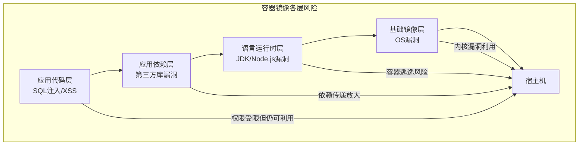
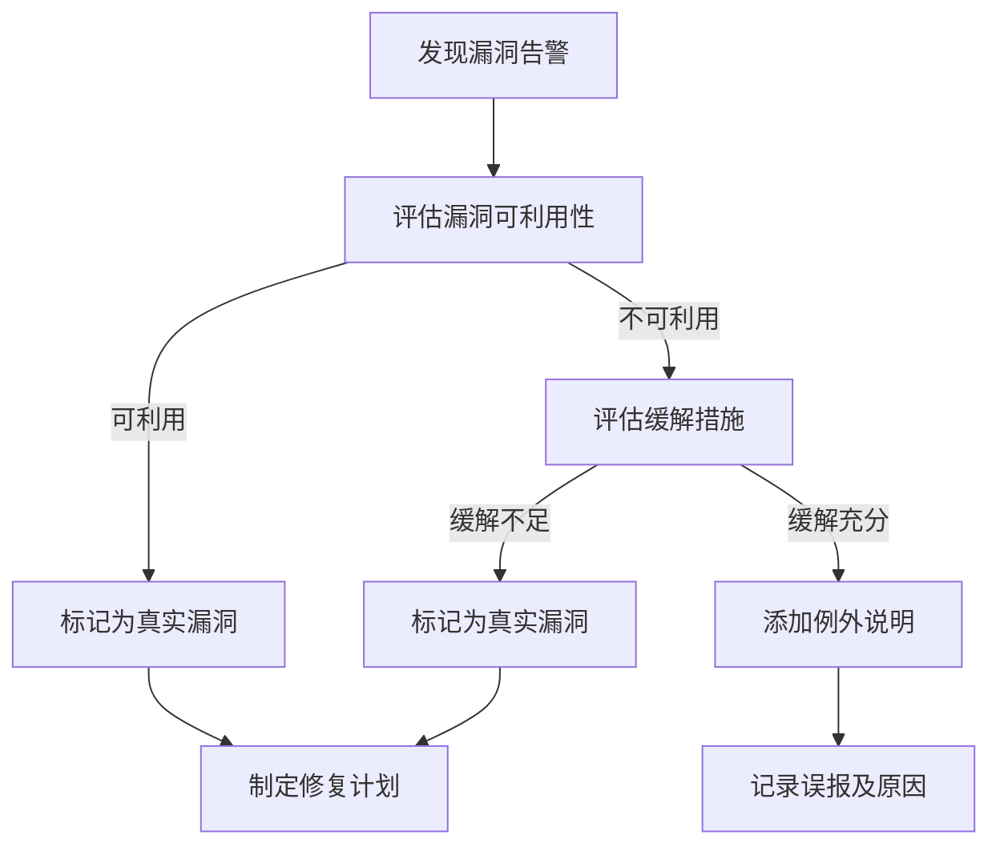

2019 年，某云服务商对容器镜像仓库的一次全面扫描发现了一个令人震惊的事实：生产环境中 30% 的容器镜像包含高危漏洞，5% 的镜像包含远程代码执行漏洞。这些漏洞在镜像构建时就已经存在，但因为没有扫描机制，它们悄悄进入了生产环境。

更令人不安的是，这些漏洞的修复并不复杂——只需要更新基础镜像版本或调整依赖版本。但因为没有人知道漏洞的存在，它们在生产环境中运行了数月甚至数年。

这正是镜像扫描的核心价值：**让不可见的风险变得可见，从而可以被管理和修复**。

## 容器镜像漏洞的严重性

容器镜像的安全性取决于其所有层的组合。一个典型的容器镜像可能包含：

**基础镜像层**：操作系统和运行时环境。如果使用过期三年的 Ubuntu 基础镜像，可能包含数百个未修复的内核漏洞。

**语言运行时层**：JDK、Node.js、Python 解释器等。2021 年的 Log4Shell 漏洞影响的是 Java 应用的日志组件，而这个组件被广泛应用于 Java 应用中。

**应用依赖层**：Maven/Gradle 的 pom.xml、npm 的 package.json、Python 的 requirements.txt。每增加一个依赖，都可能引入新的漏洞。

**应用代码层**：自己编写的代码。SQL 注入、XSS 等应用层漏洞同样存在于容器化应用中。



## 镜像扫描工具对比

业界有多个容器镜像扫描工具可供选择，每个工具都有其特点和适用场景。

| 工具 | 开发方 | 特点 | 扫描速度 | 适用场景 |
| --- | --- | --- | --- | --- |
| Trivy | Aqua Security | 零配置、轻量级、CVE 库全面 | 快 | 快速集成、CI/CD |
| Grype | Anchore | 结构化输出、与 Syft 集成 | 中等 | SBOM 生成、供应链安全 |
| Clair | Quay | API 驱动、企业友好 | 慢 | 自托管镜像仓库 |
| Anchore | Anchore | 企业级、功能全面 | 慢 | 大规模企业 |
| Snyk | Snyk | 开发者友好、IDE 集成 | 快 | 开发阶段集成 |

### Trivy

Trivy 是目前最流行的开源镜像扫描工具。它的核心优势是零配置——安装后直接扫描，无需复杂配置。

```bash title="Trivy 基础使用"
# 扫描本地镜像
trivy image nginx:latest

# 扫描镜像并输出 JSON 格式
trivy image --format json --output report.json nginx:latest

# 只显示高危和严重漏洞
trivy image --severity HIGH,CRITICAL nginx:latest

# 扫描文件系统（用于 CI/CD）
trivy fs --severity HIGH,CRITICAL ./app
```

Trivy 的另一个优势是支持多种扫描目标：容器镜像、Dockerfile、文件系统、Kubernetes 资源。

### Grype

Grype 的特点是其与 Anchore 产品线（特别是 Syft）的深度集成。Syft 用于生成 SBOM，Grype 用于漏洞扫描，两者结合可以提供完整的供应链可见性。

```bash title="Grype 与 Syft 集成"
# 使用 Syft 生成 SBOM
syft ubuntu:latest -o cyclonedx-json > sbom.json

# 使用 Grype 基于 SBOM 扫描漏洞
grype sbom:sbom.json

# 或者直接扫描镜像（会自动生成 SBOM）
grype ubuntu:latest
```

Grype 的输出格式支持 CycloneDX JSON，便于与下游工具集成。

### Clair

Clair 是 CoreOS（现 Red Hat）开发的企业级镜像扫描工具，主要用于自托管的镜像仓库（如 Quay）。

Clair 的架构是 API 驱动的，适合需要集中管理扫描结果的场景。它的 CVE 索引会自动更新，但扫描速度较慢。

```json title="Clair API 扫描请求示例"
{
  "docker_image": "docker.io/library/nginx:latest"
}
```

## CVE 数据库与漏洞情报

镜像扫描的准确性完全依赖于 CVE（Common Vulnerabilities and Exposures）数据库。主流的 CVE 数据源包括：

**NVD（National Vulnerability Database）**：美国政府的官方漏洞数据库，收录了全球范围的公开漏洞。数据全面但更新延迟较高。

**MITRE CVE**：CVE 编号的官方发布机构，但不提供漏洞详情。

**vendor-specific**：各操作系统供应商维护的漏洞列表，如 Ubuntu Security Notices、Debian Security Bug Tracker。

**GitHub Advisory Database**：GitHub 维护的开源项目漏洞数据库，数据更新及时。

漏洞严重性评级通常采用 CVSS（Common Vulnerability Scoring System）标准：

| CVSS 评分 | 等级 | 含义 |
| --- | --- | --- |
| 0.0 - 3.9 | 低危（Low） | 漏洞影响有限 |
| 4.0 - 6.9 | 中危（Medium） | 漏洞可能被利用 |
| 7.0 - 8.9 | 高危（High） | 漏洞可被利用，影响较大 |
| 9.0 - 10.0 | 严重（Critical） | 远程代码执行等严重漏洞 |

:::warning CVSS 评分的局限性
CVSS 评分是理论严重性，实际严重性取决于漏洞是否可利用、业务环境是否存在攻击路径。一个 CVSS 9.0 的漏洞如果在隔离网络中可能比 CVSS 7.0 的漏洞更安全。建议结合业务上下文评估漏洞优先级。
:::

## 扫描时机：构建时 / 部署时 / 运行时

镜像扫描应该在软件生命周期的多个阶段进行，形成多层防护。

### 构建时扫描

在 CI/CD 流水线中，镜像构建完成后立即进行扫描。如果发现高危漏洞，阻断构建流程。

```yaml title="GitLab CI 集成 Trivy"
stages:
  - build
  - security

build:
  stage: build
  script:
    - docker build -t $IMAGE_NAME:$CI_COMMIT_SHA .
    - docker push $IMAGE_NAME:$CI_COMMIT_SHA

trivy-scan:
  stage: security
  script:
    - trivy image --exit-code 1 --severity HIGH,CRITICAL $IMAGE_NAME:$CI_COMMIT_SHA
  rules:
    - if: $CI_COMMIT_TAG
```

构建时扫描的优势是发现时间早、修复成本低。劣势是可能检测不到运行时新出现的漏洞。

### 部署时扫描

在镜像部署到 Kubernetes 之前进行扫描。可以通过 admission controller 实现自动化阻断。

```yaml title="Kubernetes Admission Controller 集成"
apiVersion: constraints.gatekeeper.sh/v1beta1
kind: K8sVulnConstraints
metadata:
  name: no-high-critical-vulnerabilities
spec:
  match:
    kinds:
      - apiGroups: [""]
        kinds: ["Pod"]
  parameters:
    severity: "HIGH,CRITICAL"
    blockedImages:
      - "*"
```

部署时扫描的优势是可以利用最新的漏洞情报，劣势是如果流水线频繁，扫描可能成为瓶颈。

### 运行时扫描

定期扫描生产环境中正在运行的容器，发现新出现的漏洞（0-day 或情报更新后才发现的漏洞）。

```bash title="定时扫描生产镜像"
#!/bin/bash
# scan-running-containers.sh

# 获取所有运行中的镜像
images=$(docker images --format "{{.Repository}}:{{.Tag}}" | grep -v "^<none>")

for image in $images; do
  echo "扫描镜像: $image"
  trivy image --severity CRITICAL --format json "$image" > "reports/$(echo $image | tr '/:' '-').json"
done
```

## 镜像扫描的 CI/CD 集成

CI/CD 集成是镜像扫描落地的关键环节。以下是几种主流集成方式。

### Jenkins Pipeline

```groovy title="Jenkinsfile 集成 Trivy"
pipeline {
  agent any
  environment {
    IMAGE_NAME = "myapp"
    TRIVY_SEVERITY = "HIGH,CRITICAL"
  }
  stages {
    stage('Build') {
      steps {
        script {
          def imageTag = "${IMAGE_NAME}:${env.BUILD_NUMBER}"
          env.IMAGE_TAG = imageTag
          sh "docker build -t ${imageTag} ."
          sh "docker push ${imageTag}"
        }
      }
    }
    stage('Security Scan') {
      steps {
        script {
          def result = sh(
            script: "trivy image --exit-code 1 --severity ${TRIVY_SEVERITY} ${IMAGE_TAG}",
            returnStatus: true
          )
          if (result != 0) {
            error "镜像包含高危漏洞，构建被阻断"
          }
        }
      }
    }
  }
}
```

### GitHub Actions

```yaml title=".github/workflows/security.yml"
name: Container Security Scan
on:
  push:
    branches: [main]
  pull_request:
    branches: [main]

jobs:
  scan:
    runs-on: ubuntu-latest
    steps:
      - name: Checkout code
        uses: actions/checkout@v4
      
      - name: Build and push image
        run: |
          docker build -t ${{ env.IMAGE_NAME }}:${{ github.sha }} .
          docker push ${{ env.IMAGE_NAME }}:${{ github.sha }}
      
      - name: Run Trivy scanner
        uses: aquasecurity/trivy-action@master
        with:
          image-ref: '${{ env.IMAGE_NAME }}:${{ github.sha }}'
          format: 'sarif'
          severity: 'HIGH,CRITICAL'
          exit-code: '1'
```

## 漏洞严重性评级与过滤

不是所有扫描结果都需要立即处理。根据漏洞的实际可利用性和业务环境，需要进行优先级排序。

### 过滤策略

**基于 CVSS 评分的过滤**：只关注高危和严重漏洞，过滤低危和中危漏洞。

**基于攻击向量的过滤**：如果容器网络完全隔离，可以忽略网络远程利用漏洞。

**基于包版本的过滤**：如果确认容器不会运行特定包，可以忽略相关漏洞。

**基于运行时路径的过滤**：只关注实际会被执行的代码路径中的漏洞。

### Java 示例：漏洞过滤配置

```java title="VulnerabilityFilter.java"
import java.util.List;
import java.util.stream.Collectors;

public class VulnerabilityFilter {
    
    public record Vulnerability(
        String cveId,
        double cvssScore,
        String packageName,
        String attackVector,
        boolean isExploitable
    ) {}
    
    public List<Vulnerability> filterActionable(List<Vulnerability> vulns) {
        return vulns.stream()
            .filter(v -> v.cvssScore() >= 7.0)  // 只关注高危以上
            .filter(v -> v.isExploitable())       // 只关注可利用漏洞
            .filter(v -> v.packageName() != null) // 过滤未知包
            .collect(Collectors.toList());
    }
    
    public String prioritizeFix(List<Vulnerability> vulns) {
        return vulns.stream()
            .sorted((a, b) -> Double.compare(b.cvssScore(), a.cvssScore()))
            .findFirst()
            .map(Vulnerability::cveId)
            .orElse("N/A");
    }
}
```

## 私有镜像仓库的扫描策略

私有镜像仓库（如 Harbor）通常内置了镜像扫描功能。

### Harbor 集成 Trivy

Harbor v2.0 之后内置了 Trivy 作为默认扫描器。配置 Harbor 后，所有推送到仓库的镜像都会自动触发扫描。

```bash title="Harbor 扫描 API"
# 触发手动扫描
curl -X POST "https://harbor.example.com/api/v2.0/projects/myproject/repositories/myrepo/artifacts/:digest/scan" \
  -H "Content-Type: application/json" \
  -H "Authorization: Bearer $HARBOR_TOKEN"

# 获取扫描结果
curl "https://harbor.example.com/api/v2.0/repositories/myproject/myrepo/tags/latest?verbose=true" \
  -H "Authorization: Bearer $HARBOR_TOKEN"
```

### 扫描策略��阵

| 仓库类型 | 推荐工具 | 扫描时机 | 阻断策略 |
| --- | --- | --- | --- |
| 公共镜像仓库 | Trivy/Grype | 拉取时扫描 | 禁止拉取高危镜像 |
| 私有镜像仓库 | Harbor 内置/Clair | 推送时扫描 | 阻断推送高危镜像 |
| 生产环境 | Trivy | 定时扫描 | 告警 + 计划修复 |
| CI/CD | Trivy | 构建时扫描 | 阻断构建高危镜像 |

## 扫描结果的误报处理

镜像扫描存在一定的误报率，处理误报需要谨慎，避免过度信任工具。

**误报来源一**：CVE 引用错误。某个 CVE 可能适用于特定版本的包，但扫描器错误地匹配了其他版本。

**误报来源二**：漏洞不可利用。某些漏洞需要特定的运行时条件才能触发，如果容器配置了最小权限，漏洞可能无法利用。

**误报来源三**：依赖关系误判。扫描器可能错误地识别了包与包之间的依赖关系。

### 误报处理流程



:::tip 误报处理建议
建立漏洞例外管理机制是必要的，但例外应该有明确的失效日期和重新评估流程。随着业务环境变化，今天的误报可能变成明天的真实漏洞。
:::

## 总结与延伸思考

镜像扫描是云原生安全的基础防线，它的核心价值不是发现漏洞，而是让安全状态可见。扫描工具本身不是银弹，需要与策略引擎、访问控制、运行时安全形成完整的防护体系。

选择扫描工具时，建议考虑以下因素：与现有 CI/CD 流水线的集成难度、CVE 数据库的更新频率、误报率、性能开销。对于大多数团队，Trivy 是最优选择——零配置、快速、免费。

### 思考题

**问题 1**：为什么说「扫描一次就够」是镜像扫描的常见误区？
<details>
<summary>参考答案</summary>

因为 CVE 数据库每天都在更新。镜像中今天没有漏洞，不代表明天也没有。2021 年 12 月 Log4Shell 漏洞曝光后，许多团队扫描了生产环境，发现多个受影响的服务——这些服务在构建时确实没有漏洞（Log4j 漏洞还未被发现）。建议采用「构建时扫描 + 运行时定期扫描」的组合策略。
</details>

**问题 2**：如何设计一个合理的漏洞修复优先级？
<details>
<summary>参考答案</summary>
优先级评估应该综合多个维度：1）CVSS 评分（越高越优先）；2）可利用性（是否有公开的 exploit）；3）攻击面（容器是否暴露到外网）；4）业务影响（如果被利用会造成什么损失）；5）修复难度（是否需要代码变更，还是只需更新基础镜像）。建议建立一个评分公式：`Priority = CVSS * Exploitability * AttackSurface * BusinessImpact`，高于阈值的必须立即修复。
</details>
