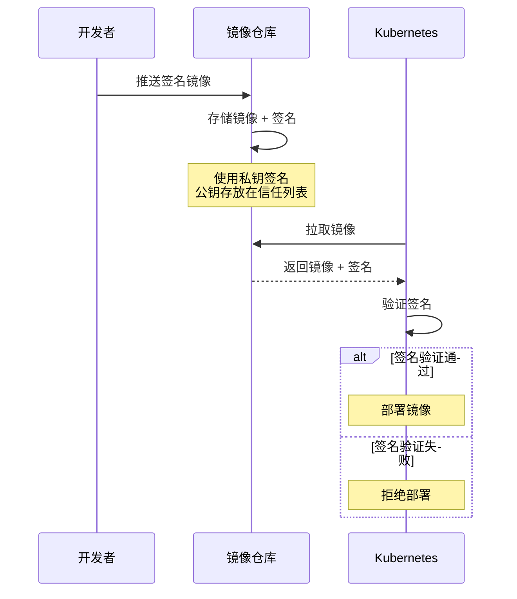
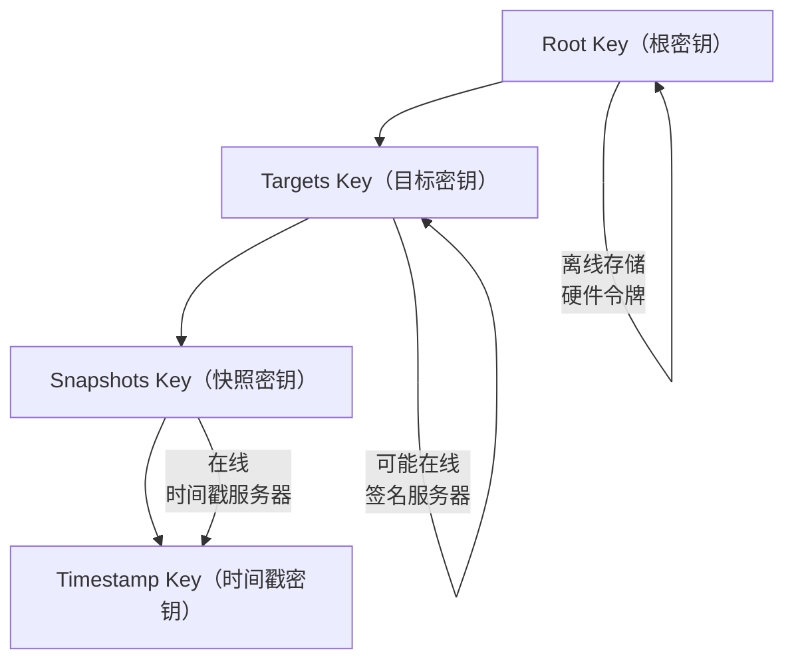
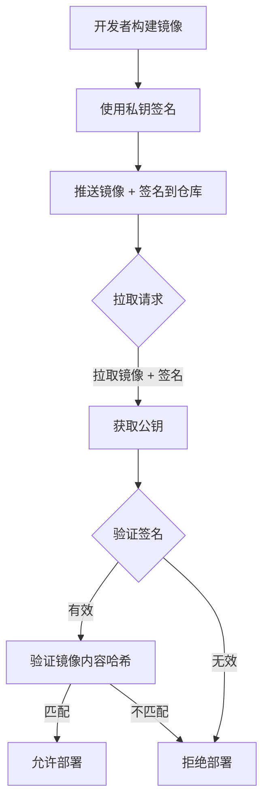
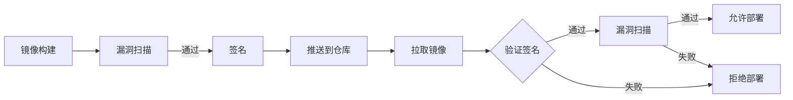

2022 年 3 月，攻击者在 PyPI 仓库中上传了多个带有恶意代码的依赖包。这些包与正规包名称相似（ typosquatting 攻击），当开发者使用错误的包名安装依赖时，恶意代码被执行。

容器镜像同样面临类似的供应链攻击风险。攻击者可以上传带有恶意代码的镜像到公共仓库，或者在镜像传输过程中篡改镜像内容。如果不加验证就拉取和运行这些镜像，后果不堪设想。

**镜像签名正是为了解决这个问题而生**——通过数字签名技术，验证镜像的来源和完整性，确保只有可信的镜像才能进入你的集群。

## 镜像完整性的重要性

容器镜像的安全性不仅取决于漏洞数量，还取决于镜像的来源和完整性。

**镜像来源风险**：公共镜像仓库（如 Docker Hub）任何人都可以上传镜像，其中可能包含恶意代码、挖矿程序或后门。2021 年的 Weave Scope 事件就是典型——攻击者上传了名为官方镜像的恶意镜像。

**镜像篡改风险**：即使镜像在上传时是可信的，传输过程中的中间人攻击也可能篡改镜像内容。如果不验证完整性，恶意代码可能在不知不觉中进入生产环境。

**供应链攻击风险**：现代应用依赖层层镜像——基础镜像 + 运行时镜像 + 应用镜像 + 框架镜像。每层镜像都是潜在的供应链攻击面。



## Docker Content Trust（DCT）

Docker Content Trust 是 Docker 官方提供的镜像签名机制，基于 The Update Framework（TUF）实现。

### DCT 工作原理

DCT 在镜像推送时自动进行签名，在镜像拉取时自动进行验证。整个过程对用户透明。

```bash title="启用 DCT"
# 启用 Docker Content Trust
export DOCKER_CONTENT_TRUST=1

# 推送镜像时会自动签名
docker push myregistry.com/myapp:latest

# 拉取镜像时会自动验证签名
docker pull myregistry.com/myapp:latest
```

### DCT 的局限性

DCT 的设计存在一些局限性：

**首次拉取的信任问题**：第一次拉取镜像时，Docker 需要从 Notary 服务器获取信任根（Trust Root）。如果 Notary 服务器不可达或被攻击，信任链可能被破坏。

**密钥管理复杂性**：DCT 使用多层密钥体系，包括离线根密钥和在线时间戳密钥。密钥管理不善可能导致签名失效或被伪造。

**用户可见性不足**：DCT 验证过程对用户不透明，用户难以了解当前拉取的镜像是否被签名、签名是否有效。

## Notary 与 The Update Framework（TUF）

Notary 是 Docker 开发的镜像签名和信任管理服务，是 CNCF 孵化项目。TUF 是 Notary 底层的签名框架，提供了完整的安全保证。

### TUF 的设计原则

TUF 的设计目标是在软件分发过程中防止各种攻击，包括：

- **重放攻击**：攻击者重新发送之前捕获的有效数据
- **密钥泄露**：攻击者获取了某个密钥
- **冻结攻击**：攻击者阻止更新，分发过时的可信版本
- **无限密钥滥用**：攻击者使用泄露的密钥继续分发恶意软件

### TUF 的密钥层次



**Root Key**：最顶层的密钥，用于签名其他密钥。应该离线存储，通常使用硬件安全模块（HSM）。

**Targets Key**：用于签名实际的镜像元数据（targets metadata）。

**Snapshots Key**：用于签名仓库的快照元数据，确保仓库中所有镜像版本的顺序。

**Timestamp Key**：用于签名时间戳元数据，确保元数据的时效性。密钥通常在线存储，自动轮换。

## Cosign：简化镜像签名

Cosign 是 Sigstore 项目的一部分，专门为容器镜像签名设计。Cosign 的目标是让镜像签名变得像拉取镜像一样简单。

### Cosign 核心概念

Cosign 采用了不同的信任模型：使用 OIDC（OpenID Connect）进行身份认证，任何拥有 Google/Microsoft/GitHub 账户的人都可以立即开始签名。

### Cosign 基础使用

```bash title="Cosign 安装与使用"
# 安装 Cosign
brew install cosign

# 生成密钥对
cosign generate-key-pair

# 对镜像签名
cosign sign --key cosign.key myregistry.com/myapp:latest

# 验证镜像签名
cosign verify --key cosign.pub myregistry.com/myapp:latest
```

### Cosign 输出解析

```bash title="验证输出示例"
Verification for myregistry.com/myapp:latest --
The following checks were performed on each of these signatures:
  - The cosign claims were validated
  - The signatures were verified against the specified public key
  - Any OIDC credentials were validated against the claimed subject publisher

{"critical":{"identity":{"docker-reference":"myregistry.com/myapp"},
"image":{"docker-manifest-digest":"sha256:abc123..."},
"type":"cosign container image signature"},
"optional":{"Bundle":{"MediaType":"application/vnd.dev.cosign.bundle.v1+json"},
"Timestamp":{"Time":"2024-01-15T10:30:00Z"}}}
```

### Kubernetes 集成 Cosign

Cosign 可以与 Kubernetes admission controller 集成，实现签名验证的自动化。

```yaml title="Cosign Admission Configuration"
apiVersion: v1
kind: ConfigMap
metadata:
  name: cosign-public-keys
  namespace: cosign-system
data:
  myapp.pub: |
    -----BEGIN PUBLIC KEY-----
    MFkwEwYHKoZIzj0CAQYIKoZIzj0DAQcDQgAE...
    -----END PUBLIC KEY-----
```

## 签名验证的流程

完整的签名验证流程包括以下步骤：



## 镜像拉取时的签名验证

### Kubernetes 配置

在 Kubernetes 中，可以通过 admission controller 或 mutating webhook 实现镜像签名验证。

```yaml title="Kyverno 镜像签名策略"
apiVersion: kyverno.io/v1
kind: ClusterPolicy
metadata:
  name: require-signed-images
spec:
  validationFailureAction: enforce
  rules:
    - name: verify-signature
      match:
        resources:
          kinds:
            - Pod
      verifyImages:
        - imageReferences:
            - "myregistry.com/*"
          attestors:
            - entries:
                - keys:
                    publicKeySecretRef:
                      name: cosign-pub-key
                      namespace: cosign-system
```

### Containerd 配置

```toml title="/etc/containerd/config.toml"
[plugins."io.containerd.grpc.v1.cri".image_verifier]
  enabled = true
  plugin_config_uri = "sigstore-notation://"
```

## 签名密钥管理

密钥管理是镜像签名体系的核心环节。密钥丢失意味着已签名的镜像无法验证；密钥泄露意味着攻击者可以伪造签名。

### 密钥类型与安全级别

| 密钥类型 | 安全级别 | 存储方式 | 轮换策略 |
| --- | --- | --- | --- |
| Root Key | 最高 | 离线存储（HSM） | 每年或发现泄露时 |
| Targets Key | 高 | 硬件令牌或加密存储 | 每季度 |
| Snapshot Key | 中 | 在线服务 | 每月 |
| Timestamp Key | 中 | 自动轮换 | 每天 |

### Cosign 的密钥轮换

```bash title="Cosign 密钥轮换"
# 重新生成密钥对
cosign generate-key-pair

# 使用新密钥重新签名镜像
cosign sign --key cosign.key myregistry.com/myapp:v2

# 旧镜像仍然有效（如果使用签名透明日志）
cosign timestamp myregistry.com/myapp:sha256-abc.sig
```

## 签名与扫描的结合

镜像签名和镜像扫描是互补的安全措施。签名确保镜像来源可信，扫描确保镜像内容安全。

### 双层验证架构



### Sigstore 的透明日志

Sigstore 引入的透明日志（Rekor）记录了所有签名操作，使得签名历史可审计、可追溯。这对于应对密钥泄露和供应链攻击至关重要。

```bash title="查询镜像签名历史"
# 安装 Rekor CLI
brew install rekor-cli

# 查询签名记录
rekor-cli search --sha sha256:abc123...

# 获取签名详细信息
rekor-cli get --uuid <uuid>
```

## GitHub Actions 集成镜像签名

```yaml title="GitHub Actions CI/CD 集成 Cosign"
name: Build and Sign

on:
  push:
    branches: [main]

jobs:
  build-and-sign:
    runs-on: ubuntu-latest
    permissions:
      id-token: write  # OIDC 身份验证
      contents: read
      packages: write
    
    steps:
      - name: Checkout
        uses: actions/checkout@v4
      
      - name: Set up Docker Buildx
        uses: docker/setup-buildx-action@v3
      
      - name: Login to Container Registry
        uses: docker/login-action@v3
        with:
          registry: ghcr.io
          username: ${{ github.actor }}
          password: ${{ secrets.GITHUB_TOKEN }}
      
      - name: Build and push image
        uses: docker/build-push-action@v5
        with:
          push: true
          tags: ghcr.io/${{ github.repository }}:${{ github.sha }}
      
      - name: Sign image with Cosign
        uses: sigstore/cosign-installer@v3
        with:
          cosign-release: 'v2.2.0'
      
      - name: Sign the image
        run: |
          cosign sign --yes \
            --oidc-issuer https://oauth2.sigstore.dev/auth \
            ghcr.io/${{ github.repository }}:${{ github.sha }}
```

:::tip GitHub OIDC 集成
使用 GitHub OIDC 进行身份验证，无需管理静态密钥。Cosign 会自动获取短期令牌，安全性更高。
:::

## 总结与延伸思考

镜像签名是供应链安全的重要组成部分，但仅有签名是不够的。签名验证只是确保「这是我预期的镜像」，还需要结合镜像扫描确保「这个镜像没有漏洞」。两者结合才能构建完整的供应链安全防护。

选择签名方案时，建议优先考虑 Cosign。它的 OIDC 集成简化了密钥管理，透明日志提供了可审计性，而且与主流 CI/CD 和 Kubernetes 方案集成良好。

### 思考题

**问题 1**：如果私钥泄露了，已经拉取到生产环境的镜像会发生什么？
<details>
<summary>参考答案</summary>

私钥泄露的严重后果是：攻击者可以用泄露的密钥伪造签名，使恶意镜像看起来是可信的。应对措施：1）使用硬件令牌（HSM）存储根密钥，降低泄露风险；2）启用透明日志（Sigstore/Rekor），泄露可以被检测到；3）实施密钥轮换策略；4）如果发现密钥泄露，立即撤销并重新签名所有镜像；5）配置短期有效的 OIDC 令牌（如 GitHub Actions），减少密钥管理的风险。
</details>

**问题 2**：为什么说 Cosign 的 OIDC 集成比传统 PKI 更适合容器镜像场景？
<details>
<summary>参考答案</summary>

传统 PKI 的挑战在于证书颁发机构的信任建立和证书管理成本。开发者需要向 CA 申请证书，CA 需要验证身份，证书需要定期续期。Cosign 的 OIDC 集成利用了已有的身份提供商（Google、Microsoft、GitHub），用户无需额外注册即可开始签名。这种方式降低了门槛，提高了可用性，同时通过身份提供商的认证保证了签名者身份可追溯。
</details>
