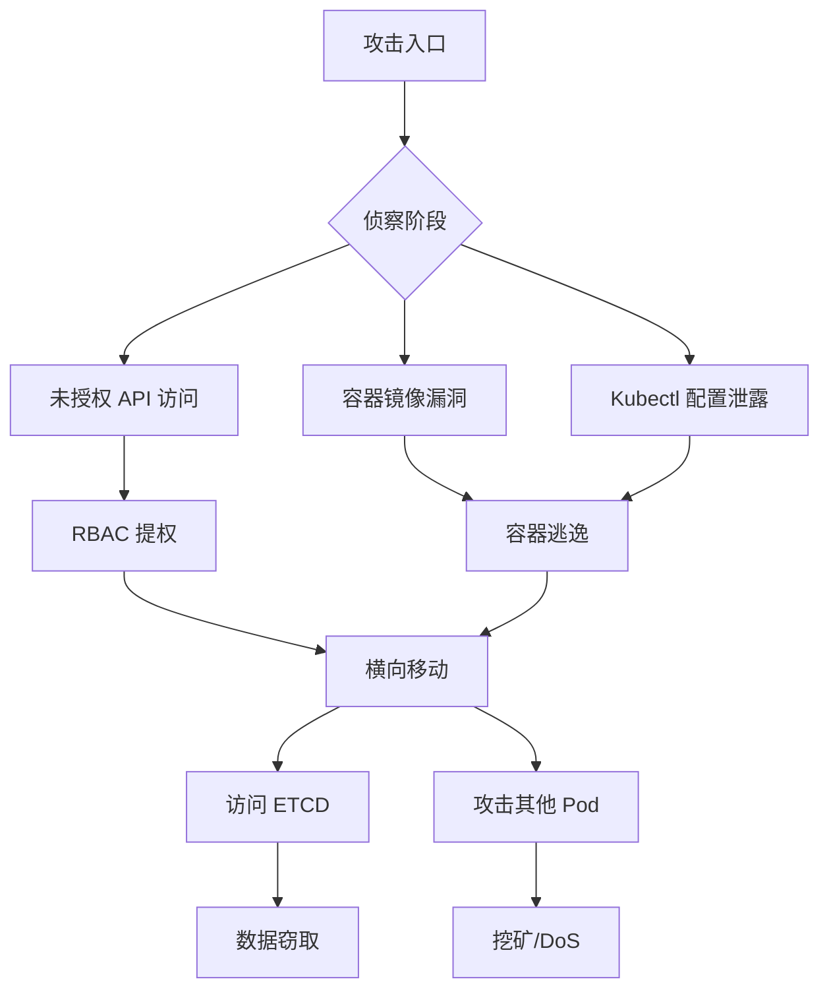

云原生安全与传统安全的最大区别，不是「用什么技术」，而是「威胁模型完全不同」。容器共享宿主机内核，Pod IP 动态变化，etcd 存储着所有密钥和配置——这些特性带来的攻击面，在传统虚拟机环境中根本不存在。

本专题覆盖云原生安全的完整知识体系：从容器镜像的安全扫描与签名，到 Kubernetes 的 RBAC、网络策略、Secret 管理，再到 Falco 运行时安全、OPA Gatekeeper 策略控制，以及供应链安全、SBOM 等前沿实践。

## 核心内容

### 安全责任

- [云原生安全概述](/security/cloud-native/overview) — 容器、K8s、服务网格带来的新挑战
- [云安全责任共担模型](/security/cloud-native/shared-responsibility) — 云服务商与用户的责任边界

### 镜像安全

- [容器镜像安全扫描](/security/cloud-native/image-scanning) — Trivy、Grype、Clair 的使用
- [镜像签名与信任](/security/cloud-native/image-signing) — Cosign、Notary、TUF

### Kubernetes 安全

- [Kubernetes RBAC 深度解析](/security/cloud-native/k8s-rbac) — Role、ClusterRole、Binding
- [Kubernetes 网络策略](/security/cloud-native/k8s-network-policy) — 命名空间隔离与工作负载隔离
- [Pod 安全策略](/security/cloud-native/pod-security) — PSS 三级标准与 Security Context
- [Kubernetes Secret 管理](/security/cloud-native/k8s-secret) — etcd 加密与 External Secrets
- [Kubernetes 审计日志](/security/cloud-native/k8s-audit) — 审计策略配置与异常检测
- [Kubernetes 攻击面分析](/security/cloud-native/k8s-attack-surface) — 攻击路径与真实案例

### 运行时安全

- [容器运行时安全](/security/cloud-native/runtime-security) — Falco 规则与告警
- [容器逃逸防护](/security/cloud-native/container-escape) — 特权容器、内核漏洞的防护

### 策略即代码

- [OPA Gatekeeper 策略即代码](/security/cloud-native/opa-gatekeeper) — ConstraintTemplate 与 Constraint

### 服务网格安全

- [服务网格安全](/security/cloud-native/service-mesh-security) — mTLS、自动证书轮转、AuthorizationPolicy

### 云安全平台

- [CWPP 云工作负载保护平台](/security/cloud-native/cwpp) — 漏洞管理、运行时保护
- [CSPM 云安全态势管理](/security/cloud-native/cspm) — 合规评估、资产发现

### 评估工具

- [Kube-bench 合规检查](/security/cloud-native/kube-bench) — CIS Benchmark 自动化评估
- [Kube-hunter 安全渗透](/security/cloud-native/kube-hunter) — K8s 渗透测试

### 供应链安全

- [容器环境供应链安全](/security/cloud-native/supply-chain) — SLSA、sigstore
- [SBOM 软件物料清单](/security/cloud-native/sbom) — SPDX、CycloneDX 格式与应用

### 工具链

- [云原生安全工具链](/security/cloud-native/toolchain) — 建设路径与工具选型

## 攻击路径

## 思考题

**问题 1**：在 Kubernetes 环境中，为什么「容器逃逸」是比「容器内提权」更严重的安全问题？防御方应该如何防止容器逃逸？

参考答案

容器逃逸指攻击者从容器内突破到宿主机，一旦逃逸成功，攻击者可以访问宿主机上的所有容器、所有密钥（如果宿主机上运行了 kubelet）、甚至通过 kubelet 凭证访问整个集群。容器内提权只是容器内权限扩大，逃逸是跨越了容器边界。防止容器逃逸的关键措施：禁止使用特权容器、只读根文件系统、删除不必要的 Linux Capabilities（如 CAP_SYS_ADMIN）、使用 Seccomp 配置文件禁止危险的系统调用、AppArmor/SELinux 强制访问控制、避免使用 HostPath 挂载敏感目录。

**问题 2**：Sigstore 的 Cosign 和传统 Docker Content Trust 在镜像签名方面有什么核心区别？为什么说 Sigstore 更适合云原生环境？

参考答案

Docker Content Trust（DCT）使用传统的 PKI 模型，需要预先建立和管理的根 CA 证书体系，证书管理复杂且难以自动化。Cosign 使用 Sigstore 项目，通过 Fuggid 匿名机制和Transparency Log（Rekor）实现了无需预先注册即可签名的能力——开发者只需持有私钥（可以是 GitHub Actions 的 OIDC Token 临时密钥），无需管理证书。Cosign 的签名自动记录在公开的 Transparency Log 中，任何人都可以验证签名的有效性，防止恶意签名。这使得镜像签名从「证书管理负担」变成「开箱即用的开发者体验」，更适合云原生的自动化 CI/CD 环境。

