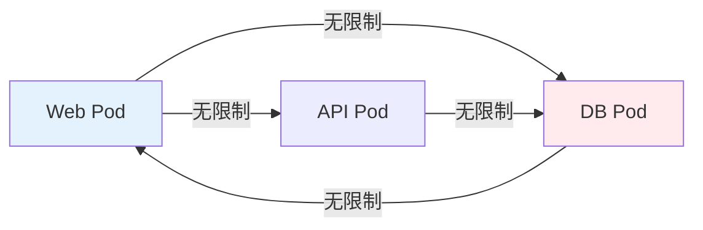
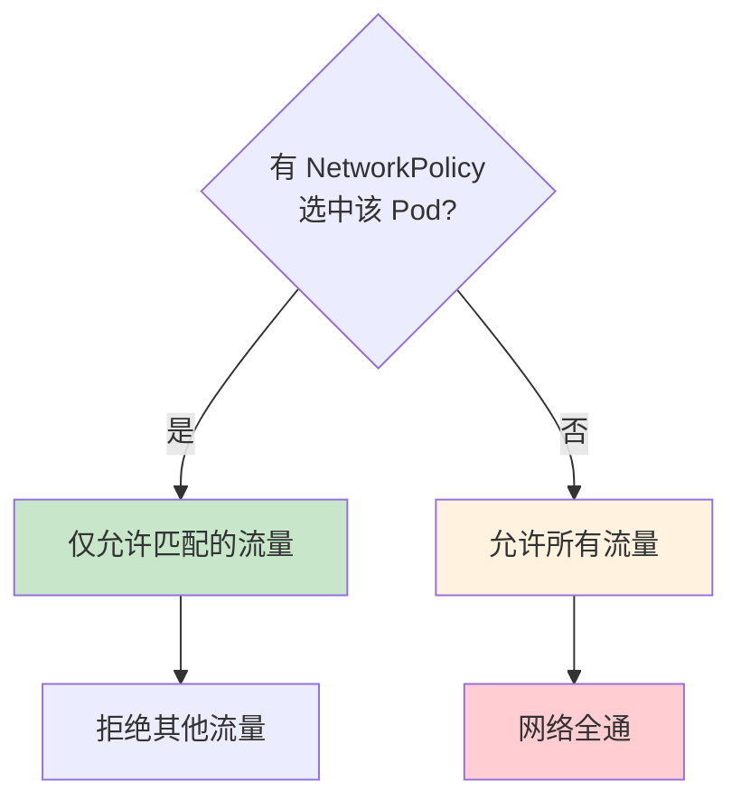
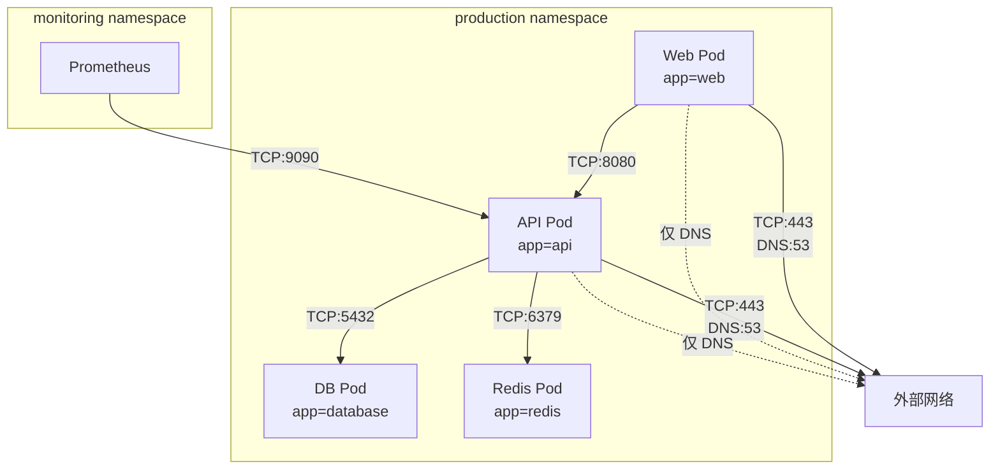

某公司微服务架构运行正常，直到一次内部渗透测试暴露了一个严重问题：攻击者通过 Web 应用的 SQL 注入漏洞拿下了数据库 Pod。然后，他发现了一个更惊人的事实——他可以直接从数据库 Pod 访问到内部所有其他服务，包括消息队列、缓存、甚至 Kubernetes API。

**「扁平网络」让攻击者可以自由横向移动**。在 Kubernetes 中，默认情况下，同一集群内的 Pod 可以自由通信，不受任何限制。这就是为什么需要 NetworkPolicy。

## K8s 默认网络的全通性

Kubernetes 的默认网络模型是全通的（Flat Network）。每个 Pod 获得一个 IP 地址，Pod 之间可以直接通过 IP 通信，不需要 NAT。

这种设计简化了网络配置，但带来了安全风险：

**无隔离**：任意 Pod 可以访问任意其他 Pod，不受应用边界的约束。

**默认信任**：网络层面的身份认证缺失，假设「能连接就是可信的」。

**攻击面扩大**：一旦某个 Pod 被攻破，攻击者可以轻松横向移动到其他 Pod。



## NetworkPolicy 的作用

NetworkPolicy 是 Kubernetes 提供的网络隔离资源，用于控制 Pod 之间的网络流量。

### 命名空间隔离

通过标签选择器隔离命名空间，控制跨命名空间的流量。

### 工作负载隔离

在命名空间内部，通过 Pod 选择器控制哪些 Pod 可以相互通信。

### 入口与出口控制

分别控制入站流量（Ingress）和出站流量（Egress）。

## NetworkPolicy 的 YAML 结构

```yaml title="NetworkPolicy 基本结构"
apiVersion: networking.k8s.io/v1
kind: NetworkPolicy
metadata:
  name: api-network-policy
  namespace: production
spec:
  podSelector:
    matchLabels:
      app: api
  policyTypes:
    - Ingress
    - Egress
  ingress:
    - from:
        - podSelector:
            matchLabels:
              app: web
      ports:
        - protocol: TCP
          port: 8080
  egress:
    - to:
        - podSelector:
            matchLabels:
              app: database
      ports:
        - protocol: TCP
          port: 5432
```

### 核心字段说明

| 字段 | 说明 |
| --- | --- |
| `podSelector` | 选择策略应用到的 Pod |
| `policyTypes` | 声明策略类型（Ingress/Egress/Both） |
| `ingress.from` | 允许的入站流量来源 |
| `ingress.ports` | 允许的入站端口 |
| `egress.to` | 允许的出站流量目标 |
| `egress.ports` | 允许的出站端口 |

## Ingress 与 Egress 规则

### Ingress 规则

控制谁可以访问被保护的 Pod。

```yaml title="Ingress 规则示例"
ingress:
  # 允许来自 Web Pod 的流量
  - from:
      - podSelector:
          matchLabels:
            app: web
    ports:
      - protocol: TCP
        port: 8080
  # 允许来自特定命名空间的流量
  - from:
      - namespaceSelector:
          matchLabels:
            name: monitoring
    ports:
      - protocol: TCP
        port: 9090
  # 允许来自外部 IP 的流量
  - from:
      - ipBlock:
          cidr: 10.0.0.0/8
          except:
            - 10.0.0.0/24
```

### Egress 规则

控制被保护的 Pod 可以访问什么。

```yaml title="Egress 规则示例"
egress:
  # 允许访问数据库
  - to:
      - podSelector:
          matchLabels:
            app: database
    ports:
      - protocol: TCP
        port: 5432
  # 允许访问 DNS
  - to:
      - namespaceSelector: {}
        podSelector:
          matchLabels:
            k8s-app: kube-dns
    ports:
      - protocol: UDP
        port: 53
  # 允许访问外部 API
  - to:
      - ipBlock:
          cidr: 0.0.0.0/0
    ports:
      - protocol: TCP
        port: 443
```

## 标签选择器与命名空间选择器

### Pod 选择器

```yaml title="Pod 选择器"
ingress:
  - from:
      - podSelector:
          matchLabels:
            app: web
            role: frontend
```

### 命名空间选择器

```yaml title="命名空间选择器"
ingress:
  - from:
      - namespaceSelector:
          matchLabels:
            name: production
            tenant: company-a
```

### 组合选择器

```yaml title="组合选择器"
ingress:
  # 同时满足命名空间和 Pod 标签
  - from:
      - namespaceSelector:
          matchLabels:
            name: production
        podSelector:
          matchLabels:
            app: web
```

## NetworkPolicy 的评估顺序

当多个 NetworkPolicy 作用于同一个 Pod 时，Kubernetes 按以下顺序评估：

1. 如果 Pod 被任何 NetworkPolicy 选中，则只允许匹配规则的流量
2. 如果 Pod 没有被任何 NetworkPolicy 选中，则允许所有流量



:::warning 默认行为的重要性
由于默认行为是允许所有流量，很多团队在部署了部分 NetworkPolicy 后误以为网络已被隔离。实际上，只有被 NetworkPolicy 选中的 Pod 才会被限制。
:::

## CNI 对 NetworkPolicy 的支持

不是所有 CNI 插件都支持 NetworkPolicy。

| CNI 插件 | NetworkPolicy 支持 | 说明 |
| --- | --- | --- |
| Calico | 完全支持 | 成熟的 NetworkPolicy 实现 |
| Cilium | 完全支持 + 增强 | 支持 L3-L7 层策略 |
| Cilium (eBPF) | 完全支持 + 增强 | 性能更好 |
| Weave Net | 完全支持 | 基础功能 |
| Flannel | 不支持 | 需要额外组件 |
| Amazon VPC CNI | 有限支持 | 使用 AWS Security Group |
| GKE (默认) | 完全支持 | 自动启用 |

### Calico 配置

```yaml title="Calico NetworkPolicy"
apiVersion: projectcalico.org/v3
kind: NetworkPolicy
metadata:
  name: api-isolation
  namespace: production
spec:
  selector: app == 'api'
  types:
    - Ingress
    - Egress
  ingress:
    - action: Allow
      protocol: TCP
      source:
        selector: app == 'web'
      destination:
        ports:
          - 8080
    - action: Deny
  egress:
    - action: Allow
      protocol: TCP
      destination:
        selector: app == 'database'
        ports:
          - 5432
```

### Cilium 配置

Cilium 支持 L7 层的 HTTP 感知策略：

```yaml title="Cilium L7 策略"
apiVersion: cilium.io/v2
kind: CiliumNetworkPolicy
metadata:
  name: http-policy
  namespace: production
spec:
  endpointSelector:
    matchLabels:
      app: api
  ingress:
    - fromEndpoints:
        - matchLabels:
            app: web
      toPorts:
        - port: "8080"
          rules:
            http:
              - method: GET
                path: "/api/*"
```

## 常见 NetworkPolicy 模式

### 模式一：默认拒绝

最先部署的策略应该是默认拒绝，限制所有流量进入。

```yaml title="默认拒绝入口流量"
apiVersion: networking.k8s.io/v1
kind: NetworkPolicy
metadata:
  name: default-deny-ingress
spec:
  podSelector: {}
  policyTypes:
    - Ingress
```

### 模式二：允许 Web 到 API

```yaml title="Web 到 API 访问"
apiVersion: networking.k8s.io/v1
kind: NetworkPolicy
metadata:
  name: allow-web-to-api
  namespace: production
spec:
  podSelector:
    matchLabels:
      app: api
  policyTypes:
    - Ingress
  ingress:
    - from:
        - podSelector:
            matchLabels:
              app: web
      ports:
        - protocol: TCP
          port: 8080
```

### 模式三：允许 API 到数据库

```yaml title="API 到数据库访问"
apiVersion: networking.k8s.io/v1
kind: NetworkPolicy
metadata:
  name: allow-api-to-db
  namespace: production
spec:
  podSelector:
    matchLabels:
      app: database
  policyTypes:
    - Ingress
    - Egress
  ingress:
    - from:
        - podSelector:
            matchLabels:
              app: api
      ports:
        - protocol: TCP
          port: 5432
  egress:
    - to:
        - podSelector: {}
          namespaceSelector: {}
      ports:
        - protocol: UDP
          port: 53  # DNS
```

### 模式四：完整微隔离



## NetworkPolicy 的测试与验证

NetworkPolicy 容易配置错误，需要测试验证。

### 测试工具：kubectl debug

```bash title="测试网络连通性"
# 部署测试 Pod
kubectl run test-$RANDOM --rm -it --image=busybox -- /bin/sh

# 测试到 API 的连通性
wget -qO- http://api.production:8080/health

# 如果能访问成功，说明策略未正确配置
```

### 测试工具：curl from within

```bash title="验证网络隔离"
# 创建临时测试 Pod
kubectl run nettest --image=curlimages/curl --rm -it --restart=Never

# 进入 Pod 并测试
/ $ curl -v http://database.production:5432

# 预期：连接被拒绝（NetworkPolicy 生效）
# 异常：连接成功（NetworkPolicy 未生效）
```

### 自动化测试：Sonobuoy

```bash title="使用 Sonobuoy 测试 NetworkPolicy"
# 运行 Network Policy 测试
sonobuoy run --mode=conformance --plugin=e2e --kubernetes-version=1.28.0

# 检查结果
sonobuoy status
sonobuoy retrieve
```

## 总结与延伸思考

NetworkPolicy 是微隔离的核心工具，但它的配置需要仔细规划。实践中，建议采用以下策略：

**从外到内**：先保护核心资源（如数据库），再放宽到外围服务。

**显式声明**：明确允许每一条通信路径，而不是默认允许再逐条拒绝。

**测试驱动**：在生产部署前，通过测试验证策略的有效性。

**持续审计**：定期检查实际流量与 NetworkPolicy 的匹配情况，发现过度的允许规则。

### 思考题

**问题 1**：为什么说「部署了一个 NetworkPolicy 后，所有流量都被限制了」是一个常见误解？
<details>
<summary>参考答案</summary>

这是因为对 Kubernetes NetworkPolicy 默认行为的误解。如果 Pod 没有被任何 NetworkPolicy 选中，它仍然可以自由通信。NetworkPolicy 的评估是基于「选中」关系的，只有被选中的 Pod 才会被限制。正确的做法是先部署「默认拒绝」策略，然后再显式声明允许的通信路径。
</details>

**问题 2**：为什么 GKE 的默认 CNI（Google VPC CNI）不直接支持 Kubernetes NetworkPolicy？如何解决这个问题？
<details>
<summary>参考答案</summary>

Google VPC CNI 使用 AWS VPC 式的安全组模型，不直接实现 Kubernetes NetworkPolicy API。解决方式有三种：1）使用 Calico 作为 CNI 插件替代默认插件；2）使用 Anthos Service Mesh（基于 Istio）实现网络隔离；3）在 GKE 中启用 Network Policy 功能（本质上是部署 Calico）。对于需要 Kubernetes 原生 NetworkPolicy 的场景，建议使用 Calico CNI。
</details>
