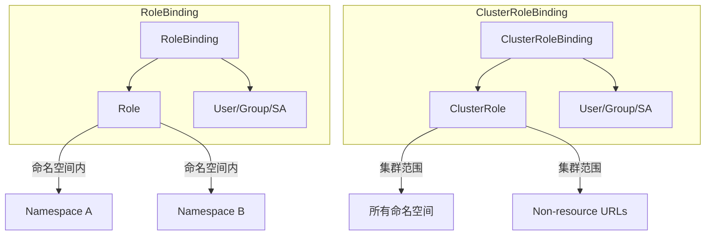
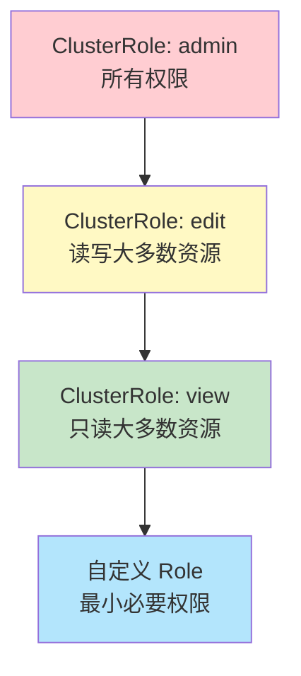

某公司 Kubernetes 集群被入侵调查发现，攻击者获取的是一个普通开发者的 kubectl 配置。这个开发者有权限查看日志、查看 Pod 状态、进入容器调试。理论上，他不应该能造成太大的破坏。

但实际上，他利用了 RBAC 配置的一个缺陷：能够创建临时 Pod 并将宿主机的根目录挂载进去，从而读取了宿主机上的所有凭证文件，最终获取了集群管理员权限。

**这不是 Kubernetes RBAC 本身的缺陷，而是 RBAC 配置不当的问题**。这个案例说明，理解 RBAC 的每一个细节是安全运维的基础。

## Kubernetes RBAC 的核心概念

RBAC（Role-Based Access Control）基于三个核心概念：

**Subject（主体）**：谁在执行操作。包括 User（用户）、Group（用户组）、ServiceAccount（服务账号）。

**Resource（资源）**：对什么执行操作。Kubernetes 中的资源包括 Pod、Service、Deployment、Secret、ConfigMap、PersistentVolume 等。

**Verb（动词）**：执行什么操作。常见动词包括 get（读取）、list（列表）、watch（监听）、create（创建）、update（更新）、delete（删除）、patch（打补丁）、exec（在容器中执行命令）。

## Role 与 ClusterRole

RBAC 中的 Role 定义了一组权限规则。Role 和 ClusterRole 的区别在于作用范围。

### Role

Role 只在特定命名空间内生效。适用于需要限制在某个命名空间内的权限。

```yaml title="Role 示例"
apiVersion: rbac.authorization.k8s.io/v1
kind: Role
metadata:
  name: pod-reader
  namespace: production
rules:
  - apiGroups: [""]
    resources: ["pods"]
    verbs: ["get", "list", "watch"]
  - apiGroups: [""]
    resources: ["pods/log"]
    verbs: ["get"]
```

### ClusterRole

ClusterRole 是集群级别的角色，可以授予集群范围的资源，也可以授予跨命名空间的资源。

```yaml title="ClusterRole 示例"
apiVersion: rbac.authorization.k8s.io/v1
kind: ClusterRole
metadata:
  name: node-reader
rules:
  - apiGroups: [""]
    resources: ["nodes"]
    verbs: ["get", "list", "watch"]
  - apiGroups: [""]
    resources: ["persistentvolumes"]
    verbs: ["get", "list", "watch"]
```

ClusterRole 还可以用于授予非资源类型 URL 的访问权限：

```yaml title="非资源类型 ClusterRole"
apiVersion: rbac.authorization.k8s.io/v1
kind: ClusterRole
metadata:
  name: api-reader
rules:
  - nonResourceURLs: ["/api/*", "/apis/*"]
    verbs: ["get"]
```

### Role 与 ClusterRole 的对照

| 特性 | Role | ClusterRole |
| --- | --- | --- |
| 作用范围 | 单个命名空间 | 集群范围 |
| 资源类型 | 命名空间资源 | 命名空间资源 + 集群资源 |
| 非资源 URL | 不支持 | 支持 |
| 使用场景 | 常规应用权限 | 集群管理员、节点权限 |

## RoleBinding 与 ClusterRoleBinding

Binding 将 Role/ClusterRole 绑定到 Subject（主体）。

### RoleBinding

RoleBinding 将 Role 或 ClusterRole 绑定到特定命名空间内的 Subject。

```yaml title="RoleBinding 示例"
apiVersion: rbac.authorization.k8s.io/v1
kind: RoleBinding
metadata:
  name: pod-reader-binding
  namespace: production
subjects:
  - kind: User
    name: alice@example.com
    apiGroup: rbac.authorization.k8s.io
  - kind: Group
    name: developers
    apiGroup: rbac.authorization.k8s.io
roleRef:
  kind: Role
  name: pod-reader
  apiGroup: rbac.authorization.k8s.io
```

### ClusterRoleBinding

ClusterRoleBinding 将 ClusterRole 绑定到集群范围的 Subject。

```yaml title="ClusterRoleBinding 示例"
apiVersion: rbac.authorization.k8s.io/v1
kind: ClusterRoleBinding
metadata:
  name: node-admin-binding
subjects:
  - kind: Group
    name: node-admins
    apiGroup: rbac.authorization.k8s.io
roleRef:
  kind: ClusterRole
  name: cluster-admin
  apiGroup: rbac.authorization.k8s.io
```

### Binding 组合图解



## 最小权限原则在 K8s RBAC 中的实践

最小权限原则（Principle of Least Privilege）要求只授予完成任务所需的最小权限。RBAC 是实施这个原则的主要工具。

### 权限层级设计



### 自定义权限设计

```yaml title="最小权限 Role 示例"
apiVersion: rbac.authorization.k8s.io/v1
kind: Role
metadata:
  name: app-service-account-manager
  namespace: production
rules:
  # 只允许管理特定前缀的 ServiceAccount
  - apiGroups: [""]
    resources: ["serviceaccounts"]
    resourceNames: ["app-*-sa"]
    verbs: ["get", "update", "patch"]
  # 只允许读取 secrets（不能创建或删除）
  - apiGroups: [""]
    resources: ["secrets"]
    verbs: ["get", "list"]
    resourceNames: ["app-config"]
```

### 资源名称限制

`resourceNames` 字段可以进一步限制可以操作的资源实例：

```yaml title="限制特定资源实例"
rules:
  - apiGroups: [""]
    resources: ["configmaps"]
    resourceNames: ["app-config", "db-config"]
    verbs: ["get", "update"]
```

这意味着只能操作名为 `app-config` 和 `db-config` 的 ConfigMap，不能操作其他 ConfigMap。

## 内置 Role 的分析

Kubernetes 提供了一组内置的 ClusterRole，了解它们的权限范围对于安全配置至关重要。

### system:authenticated

所有经过身份验证的用户都属于此组，权限非常有限。

### system:anonymous

所有未认证的用户都属于此组，默认没有特殊权限。

### cluster-admin

最高权限角色，拥有集群的完全控制权。**应极其谨慎地使用**，仅用于紧急恢复场景。

### admin（命名空间级别）

命名空间内的管理员权限，包括创建和删除大多数资源。但不包括修改命名空间本身或资源配额。

### edit（命名空间级别）

命名空间内的编辑权限，可以读取和修改大多数资源，但不能查看或修改 Secrets。

### view（命名空间级别）

命名空间内的只读权限，可以查看大多数资源，但不能查看 Secrets，也不能进入容器执行命令。

:::warning admin/edit/view 的安全陷阱
默认的 admin/cluster-admin Role 绑定了 `system:masters` Group，这个 Group 具有永久的 cluster-admin 权限。如果将普通用户添加到这个 Group，等同于授予 cluster-admin 权限。
:::

## 常见 RBAC 配置错误与风险

### 错误一：过度使用 cluster-admin

```yaml title="危险配置 - 给开发者绑定 cluster-admin"
apiVersion: rbac.authorization.k8s.io/v1
kind: ClusterRoleBinding
metadata:
  name: developer-cluster-admin
subjects:
  - kind: Group
    name: developers
roleRef:
  kind: ClusterRole
  name: cluster-admin
```

**风险**：开发者无意或恶意可以修改集群任何配置，包括删除所有命名空间。

**正确做法**：根据实际需要授予最小权限。

```yaml title="正确配置 - 仅授予日志读取权限"
apiVersion: rbac.authorization.k8s.io/v1
kind: ClusterRoleBinding
metadata:
  name: developer-logs-reader
subjects:
  - kind: Group
    name: developers
roleRef:
  kind: ClusterRole
  name: pod-logs-reader
```

### 错误二：允许 exec 操作到生产 Pod

```yaml title="危险配置 - 允许 exec 到所有 Pod"
rules:
  - apiGroups: [""]
    resources: ["pods/exec"]
    verbs: ["create"]
```

**风险**：攻击者通过 Web Shell 获取 foothold 后，可以 exec 到容器执行任意命令。

**正确做法**：限制 exec 权限的范围和时间。

```yaml title="正确配置 - 限制 exec 权限"
rules:
  - apiGroups: [""]
    resources: ["pods/exec"]
    verbs: ["create"]
    resourceNames: ["debug-pod"]
  - apiGroups: [""]
    resources: ["pods"]
    verbs: ["get", "list"]
```

### 错误三：ServiceAccount 权限过大

```yaml title="危险配置 - SA 有创建 Pod 的权限"
rules:
  - apiGroups: [""]
    resources: ["pods"]
    verbs: ["*"]
```

**风险**：攻击者获取 SA 的令牌后，可以创建特权 Pod 发动逃逸攻击。

**正确做法**：使用更精细的 Role 并限制创建的 Pod 类型。

```yaml title="正确配置 - 限制 Pod 创建和修改能力"
apiVersion: rbac.authorization.k8s.io/v1
kind: Role
metadata:
  name: ci-pipeline-sa
rules:
  # 允许部署授权的镜像
  - apiGroups: [""]
    resources: ["pods"]
    verbs: ["get", "list", "delete"]
  # 允许创建 Deployment（会创建 Pod）
  - apiGroups: ["apps"]
    resources: ["deployments"]
    verbs: ["get", "list", "create", "update"]
  # 限制只能使用特定 ServiceAccount
  - apiGroups: [""]
    resources: ["pods"]
    verbs: ["create"]
    resourceNames: ["ci-pipeline-sa"]
```

## RBAC 的审计与监控

### 审计 API 调用

启用 Kubernetes 审计日志，记录所有 API 调用：

```yaml title="审计策略配置"
apiVersion: audit.k8s.io/v1
kind: AuditPolicy
rules:
  # 不记录只读请求
  - level: None
    users: ["system:kube-proxy"]
    verbs: ["get"]
    resources:
      - group: ""
        resources: ["endpoints"]
  
  # 记录对 Secret 的所有操作
  - level: Metadata
    resources:
      - group: ""
        resources: ["secrets"]
  
  # 记录对敏感资源的所有操作
  - level: RequestResponse
    resources:
      - group: ""
        resources: ["pods/exec", "secrets"]
```

### 使用 audit2rbac 分析权限

```bash title="使用 audit2rbac 生成建议的 RBAC 配置"
# 从审计日志生成 Role
audit2rbac -filename audit.log > generated-rbac.yaml

# 分析当前配置的风险
audit2rbac --incluster --cluster-wide > current-rbac.yaml
```

## RBAC 的局限性

RBAC 虽然强大，但也有局限性：

**无法控制资源内容**：RBAC 控制对资源类型的访问，但不控制资源内容（如 Pod 规格中的环境变量）。需要使用 Policy Engine（如 OPA Gatekeeper）控制内容。

**无法动态生效**：RBAC 配置变更后，新权限会立即生效，旧权限不会自动撤销（除非使用 Bound ServiceAccount Token）。

**复杂的组管理**：跨多个命名空间的权限管理可能变得复杂。

## 总结与延伸思考

RBAC 是 Kubernetes 安全的基石。正确的 RBAC 配置可以显著降低安全风险，错误的配置则可能让攻击者获得意想不到的权限。

实践中的建议是**「默认拒绝，显式允许」**。新用户和 SA 应该有最少的默认权限，然后根据需要逐步增加。同时，建立 RBAC 配置的变更审批流程，确保每次变更都经过安全审查。

### 思考题

**问题 1**：为什么说「不给任何人 cluster-admin 权限」是一个好的安全实践？
<details>
<summary>参考答案</summary>

cluster-admin 权限意味着对集群的完全控制，包括删除所有命名空间、修改 RBAC 本身、访问所有 Secret。一旦被滥用或泄露，cluster-admin 权限可以被用于彻底破坏系统或在集群中建立持久化后门。建议做法：cluster-admin 仅用于紧急恢复场景；日常运维使用更小范围的 Role，如 admin（命名空间级别）或自定义的最小权限 Role。
</details>

**问题 2**：攻击者如何利用过度的 RBAC 权限进行容器逃逸？请描述一个攻击链。
<details>
<summary>参考答案</summary>

攻击链示例：1）攻击者获取了一个有「创建 Pod」权限的 ServiceAccount 令牌；2）创建一个特权 Pod（privileged: true）；3）将宿主机根目录挂载到 Pod（hostPath: /）；4）Pod 内可以访问宿主机的文件系统；5）修改宿主机的 /etc/crontab 或 /root/.ssh/authorized_keys 建立持久化后门；6）或直接通过宿主机的 kubelet 凭证获取集群管理员权限。防护措施：限制 SA 的权限范围，限制创建的 Pod 规格（通过 OPA Gatekeeper），启用 PSP/PSS 限制 Pod 配置。
</details>
