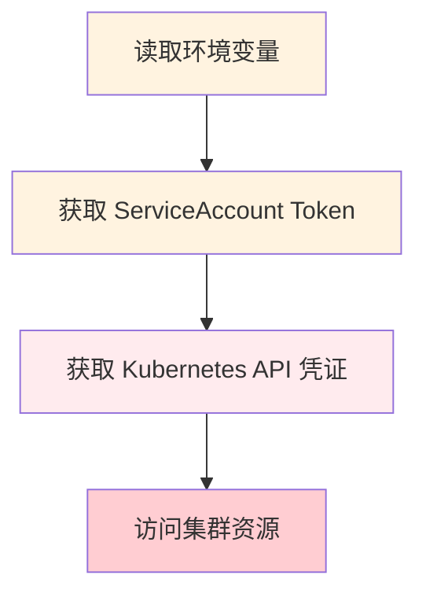
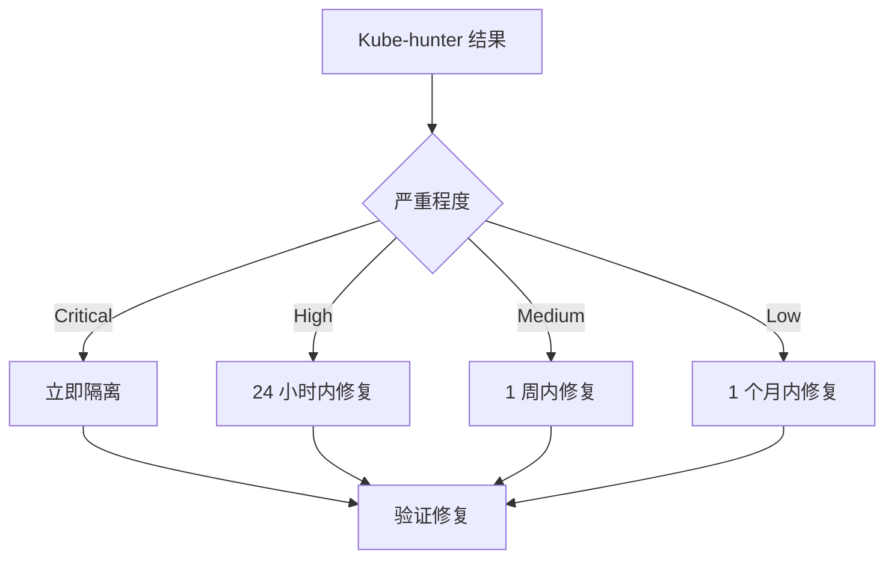
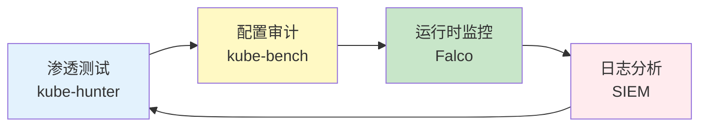

某公司安全团队部署了完整的 Kubernetes 安全防护——RBAC 配置正确、PSP 启用、网络策略配置、网络隔离到位。他们认为集群已经足够安全。

然后他们运行了 kube-hunter。**三分钟后，kube-hunter 发现了 7 个潜在攻击面，其中 3 个可以直接获取集群访问权限**。

**这就是渗透测试的价值**——从攻击者的视角验证安全防护的有效性。kube-hunter 是专门为 Kubernetes 设计的渗透测试工具。

## kube-hunter 的作用

kube-hunter 是一个开源的 Kubernetes 安全渗透测试工具，用于发现集群中的潜在漏洞和攻击面。

**核心价值**：

- 从攻击者视角发现安全问题
- 自动化渗透测试流程
- 生成可操作的安全报告
- 验证安全防护的有效性

## kube-hunter 的检测模式

kube-hunter 支持三种检测模式，适用于不同的测试场景。

### Passive（被动模式）

被动模式���收集公开可见的信息，不进行主动探测。

```bash title="被动模式扫描"
kube-hunter --pod
```

**适用场景**：

- 从容器内部扫描
- 不希望产生网络流量
- 快速评估攻击面

**检测内容**：

- Kubelet API 开放情况
- Kubernetes 服务发现信息
- 公开的环境变量
- Kubernetes API 未授权访问

### Active（主动模式）

主动模式进行更深层的探测，包括尝试利用发现的漏洞。

```bash title="主动模式扫描"
kube-hunter --active
```

**适用场景**：

- 获得授权的渗透测试
- 模拟真实攻击
- 深度评估安全性

**检测内容**：

- API Server 认证绕过
- RBAC 提权路径
- 容器逃逸可能性
- 凭证猜测

### Remote（远程模式）

远程模式从外部扫描集群的 API Server 地址。

```bash title="远程模式扫描"
kube-hunter --remote <kube-apiserver-ip-or-hostname>
```

**适用场景**：

- 从集群外部测试
- 测试公网暴露的集群
- 渗透测试初始侦察

## kube-hunter 的漏洞检测类型

### 1. 凭证泄露



**常见漏洞**：

- 环境变量中的凭证
- 挂载的 ServiceAccount Token
- ConfigMap/Secret 配置错误
- Dockerfile 中硬编码的密钥

### 2. Kubelet API 问题

**Kubelet 读取服务**：

```
VULNERABLE: Kubelet readonly API ports open
Severity: medium
Description: An attacker could read sensitive information from kubelet API
```

**Kubelet 匿名认证**：

```
VULNERABLE: Anonymous kubelet auth enabled
Severity: high
Description: Could allow listing pods and executing commands
```

### 3. API Server 访问

**API Server 未授权访问**：

```
VULNERABLE: API server unauthenticated
Severity: high
Description: API server allows unauthenticated access
```

**etcd 直接访问**：

```
VULNERABLE: etcd direct access
Severity: critical
Description: etcd is directly accessible, could expose cluster data
```

### 4. 特权容器

**特权容器检测**：

```
VULNERABLE: Privileged container
Severity: high
Description: A privileged container could escape to host
```

**HostPath 挂载**：

```
VULNERABLE: HostPath mount
Severity: high
Description: Container has hostPath mount, could escape to host
```

### 5. RBAC 提权

```
VULNERABLE: Could create privileged pods
Severity: high
Description: Service account can create privileged pods
```

## kube-hunter 的使用流程

### 1. 环境准备

```bash title="安装 kube-hunter"
# 从 GitHub 下载
curl -L https://github.com/aquasec/kube-hunter/releases/download/v0.9.0/kube-hunter_0.9.0_linux_amd64.tar.gz -o kube-hunter.tar.gz
tar -xzf kube-hunter.tar.gz
chmod +x kube-hunter
```

### 2. 配置扫描

```bash title="配置扫描选项"
# 查看可用选项
./kube-hunter --help

# 扫描输出设置
./kube-hunter --report json  # JSON 格式
./kube-hunter --report yaml  # YAML 格式
./kube-hunter --report plain  # 纯文本
```

### 3. 执行扫描

```bash title="执行不同模式的扫描"
# 从 Pod 内部扫描（被动）
./kube-hunter --pod

# 主动模式（需要授权）
./kube-hunter --active

# 远程扫描 API Server
./kube-hunter --remote cluster.example.com --active
```

### 4. 分析结果

```json title="扫描结果示例"
{
  " vulnerabilities": [
    {
      "category": "remote_exec",
      "vulnerability": "Kubelet exec API",
      "evidence": "Kubelet exec API is accessible",
      "severity": "high",
      "reference": "https://aquasecurity.github.io/kube-hunter/plugs_details/#access-denied-1",
      "remediation": "Disable anonymous kubelet auth and enable kubelet authorization"
    }
  ],
  "hunter": "kube-hunter/0.9.0",
  "timestamp": "2024-01-15T10:00:00Z"
}
```

## 渗透测试结果的解读

### 严重程度分级

| 级别 | 含义 | 建议 |
| --- | --- | --- |
| Critical | 可直接获取集群控制权 | 立即修复 |
| High | 可获取节点或服务访问权限 | 24 小时内修复 |
| Medium | 可获取敏感信息 | 1 周内修复 |
| Low | 信息泄露风险 | 1 个月内修复 |

### 修复优先级



### 修复验证

```bash title="修复后重新扫描"
# 确认修复
./kube-hunter --pod

# 检查特定漏洞是否已修复
./kube-hunter --pod --filter "Kubelet exec"
```

## kube-hunter 的局限性

### 静态检测的局限

kube-hunter 无法检测以下内容：

| 局限性 | 说明 |
| --- | --- |
| 运行时攻击 | 无法检测容器内执行的恶意代码 |
| 供应链攻击 | 无法检测镜像中的恶意代码 |
| 配置漂移 | 只能检测扫描时的状态 |
| 网络流量 | 无法分析实际的网络流量 |

### 无法检测的场景

**场景一：应用层漏洞**

```java title="应用层漏洞 kube-hunter 无法检测"
@RestController
public class UserController {
    
    @GetMapping("/user/{id}")
    public String getUser(@PathVariable String id) {
        // SQL 注入漏洞，kube-hunter 无法检测
        String query = "SELECT * FROM users WHERE id = " + id;
        return jdbcTemplate.queryForObject(query);
    }
}
```

**场景二：RBAC 配置错误**

```yaml title="需要手工审计的 RBAC 问题"
# kube-hunter 可能检测不到这种微妙配置
apiVersion: rbac.authorization.k8s.io/v1
kind: Role
metadata:
  name: app-role
rules:
  - apiGroups: [""]
    resources: ["secrets"]
    verbs: ["get", "list"]
    # 可能允许访问敏感 Secret
    resourceNames: ["app-key", "db-password"]
```

**场景三：网络流量异常**

kube-hunter 无法实时监控网络流量，无法检测：中间人攻击、DNS 劫持、恶意流量模式。

## 渗透测试与纵深防御

kube-hunter 是纵深防御策略的一部分，不是全部。

### 完整的安全测试框架



### 综合测试策略

| 工具 | 用途 | 频率 |
| --- | --- | --- |
| kube-hunter | 渗透测试 | 每季度 |
| kube-bench | 配置合规 | 每周 |
| Falco | 运行时监控 | 持续 |
| Trivy | 镜像扫描 | 每次构建 |

:::warning 授权要求
kube-hunter 的主动模式会进行实际攻击尝试，使用前必须获得明确的授权。未经授权的渗透测试可能违反法律。
:::

## 总结与延伸思考

kube-hunter 是 Kubernetes 安全测试工具箱的重要组成部分。它从攻击者视角发现问题，补充了防守方的盲区。

使用建议：

1. **定期测试**：建议每季度进行一次完整渗透测试
2. **授权明确**：主动模式测试前必须获得授权
3. **修复验证**：发现漏洞后修复并重新测试
4. **结合其他工具**：kube-hunter 不能替代其他安全工具

### 思考题

**问题 1**：为什么说渗透测试是「验证」而非「保证」？
<details>
<summary>参考答案</summary>

渗透测试只能检测已知的攻击模式，无法发现未知漏洞或 0-day。测试结果只反映测试时的安全状态，测试后的配置变更可能引入新风险。渗透测试应该作为多层防御的一环，而不是唯一的安全验证手段。
</details>

**问题 2**：如何将 kube-hunter 整合到安全开发生命周期中？
<details>
<summary>参考答案</summary>

建议在以下时机使用：1）CI/CD 流水线中集成 kube-hunter passive 模式；2）每个季度进行一次完整的主动渗透测试；3）重大配置变更后进行针对性测试；4）安全事件后进行复盘测试。测试结果应该纳入安全指标，持续跟踪修复率。
</details>
