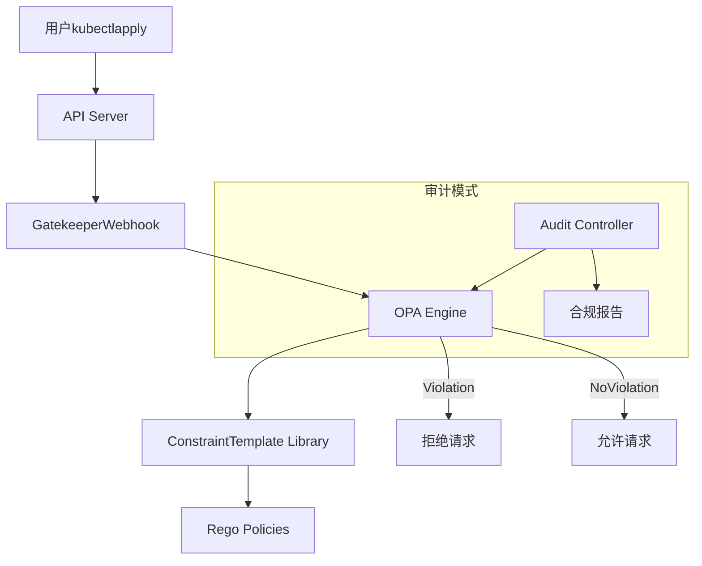

某公司安全团队发现，尽管已经部署了 PSP 和 RBAC 配置，开发者仍然能够创建特权 Pod。经过调查，问题在于：**PSP 策略配置复杂，需要额外的 RBAC 才能生效，而 RBAC 配置本身就有问题**。

这不是安全策略的缺失，而是安全策略无法被正确执行。

**OPA Gatekeeper 的核心理念是将安全策略定义为代码，通过 admission webhook 自动执行**——策略不仅被定义，而且被强制执行。

## OPA Gatekeeper 的定位

OPA（Open Policy Agent）是一个通用的策略引擎，Gatekeeper 是其在 Kubernetes 中的集成实现。

### Gatekeeper vs 传统 PSP

| 特性 | PSP | Gatekeeper |
| --- | --- | --- |
| 策略定义位置 | 独立 PSP 对象 | CRD 方式，与资源定义分离 |
| RBAC 依赖 | 需要额外的 RBAC 配置 | 独立的 OPA 策略 |
| 策略语言 | 预定义字段 | Rego（通用策略语言） |
| 调试能力 | 有限 | 丰富（测试框架、模拟执行） |
| 社区活跃度 | 已废弃 | CNCF 毕业项目 |

### Gatekeeper 架构



## Gatekeeper 的架构：ConstraintTemplate + Constraint

Gatekeeper 的策略分为两层：

**ConstraintTemplate**：定义策略逻辑，使用 Rego 语言。

**Constraint**：实例化模板，提供具体参数。

### ConstraintTemplate 编写

```yaml title="禁止特权容器的 ConstraintTemplate"
apiVersion: templates.gatekeeper.sh/v1beta1
kind: ConstraintTemplate
metadata:
  name: k8spspprivilegedcontainer
spec:
  crd:
    spec:
      names:
        kind: K8sPSPPrivilegedContainer
  targets:
    - target: admission.k8s.gatekeeper.sh
      rego: |
        package kubernetes.admission
        
        violation[msg] {
          input.request.kind.kind == "Pod"
          input.request.operation == "CREATE"
          container := input.request.object.spec.containers[_]
          container.securityContext.privileged == true
          msg := sprintf("Container '%v' is not allowed to run in privileged mode", [container.name])
        }
```

### Constraint 编写

```yaml title="Constraint 实例化"
apiVersion: constraints.gatekeeper.sh/v1beta1
kind: K8sPSPPrivilegedContainer
metadata:
  name: no-privileged-containers
spec:
  match:
    kinds:
      - apiGroups: [""]
        kinds: ["Pod"]
    excludedNamespaces: ["kube-system"]
```

## 编写 ConstraintTemplate（rego 规则）

### Rego 基础语法

```ruby title="Rego 策略示例"
package kubernetes.admission

# 简单的拒绝规则
deny[msg] {
  input.request.kind.kind == "Pod"
  container := input.request.object.spec.containers[_]
  container.securityContext.privileged == true
  msg := "Privileged containers are not allowed"
}

# 带条件的拒绝规则
deny[msg] {
  input.request.kind.kind == "Pod"
  not input.request.object.spec.securityContext.runAsNonRoot
  container := input.request.object.spec.containers[_]
  container.securityContext.runAsUser == 0
  msg := "Container must not run as root"
}
```

### 复杂条件判断

```ruby title="镜像来源验证"
package kubernetes.admission

deny[msg] {
  # 检查是否来自允许的镜像仓库
  container := input.request.object.spec.containers[_]
  not startswith(container.image, "allowed-registry.com/")
  msg := sprintf("Container image '%v' must be from allowed registry", [container.image])
}

# 允许的镜像仓库列表（通过参数传入）
allowed_registries = ["gcr.io/", "docker.io/", "my-registry.com/"]

deny[msg] {
  container := input.request.object.spec.containers[_]
  image := container.image
  not startswith(image, "allowed-registry.com/")
  not startswith(image, "gcr.io/")
  not startswith(image, "docker.io/")
  msg := sprintf("Container image '%v' is not from allowed registries", [image])
}
```

### 带参数的策略

```yaml title="带参数的 ConstraintTemplate"
apiVersion: templates.gatekeeper.sh/v1beta1
kind: ConstraintTemplate
metadata:
  name: require-resource-limits
spec:
  crd:
    spec:
      names:
        kind: RequireResourceLimits
      validation:
        openAPIV3Schema:
          type: object
          properties:
            excludedNamespaces:
              type: array
              items:
                type: string
  targets:
    - target: admission.k8s.gatekeeper.sh
      rego: |
        package kubernetes.admission
        
        violation[msg] {
          input.request.kind.kind == "Pod"
          input.request.operation == "CREATE"
          container := input.request.object.spec.containers[_]
          not container.resources.limits
          not_excluded(input.request.namespace)
          msg := sprintf("Container '%v' must set resource limits", [container.name])
        }
        
        not_excluded(ns) {
          excluded := input.parameters.excludedNamespaces
          count(excluded) > 0
          ns in excluded
        }
        
        not_excluded(ns) {
          count(input.parameters.excludedNamespaces) == 0
        }
```

## 编写 Constraint（参数配置）

```yaml title="基本 Constraint"
apiVersion: constraints.gatekeeper.sh/v1beta1
kind: RequireResourceLimits
metadata:
  name: require-all-resources
spec:
  enforcementAction: deny
  match:
    kinds:
      - apiGroups: [""]
        kinds: ["Pod"]
  parameters:
    excludedNamespaces: ["kube-system", "monitoring"]
```

## 同步与变更追踪

Gatekeeper 可以与外部数据源同步，实现动态策略调整。

### Config Sync

```yaml title="与 OPA Config Sync 集成"
apiVersion: config.gatekeeper.sh/v1alpha1
kind: Config
metadata:
  name: config
spec:
  sync:
    synced:
      - provider: 
          type: github
          config:
            repo: myorg/k8s-policies
            path: policies/
            secretRef:
              name: github-token
```

### 数据源集成

```yaml title="外部数据源配置"
apiVersion: config.gatekeeper.sh/v1alpha1
kind: Provider
metadata:
  name: http-provider
spec:
  url: https://api.example.com/allowed-images
  timeout: 5
  insecureTLSSkipVerify: false
```

## Audit 模式：持续合规检查

Gatekeeper 的 Audit Controller 持续检查已部署资源是否符合策略。

```yaml title="Audit 配置"
apiVersion: config.gatekeeper.sh/v1alpha1
kind: Config
metadata:
  name: config
spec:
  validation:
    - enforcementAction: deny
      triggers:
        - mode: audit
          resources:
            - kinds: ["Pod"]
```

### 审计报告

```bash title="查看违规报告"
kubectl get constraint -A

kubectl describe K8sPSPPrivilegedContainer no-privileged-containers

# 查看具体违规
kubectl get K8sPSPPrivilegedContainer -A -o jsonpath='{
  .items[*].status.violations[*]}'
```

### 强制模式 vs 审计模式

| 模式 | 说明 | 适用场景 |
| --- | --- | --- |
| deny（强制） | 新资源不符合策略时直接拒绝 | 生产环境严格执行 |
| dryrun（试运行） | 新资源不符合时记录但不拒绝 | 策略导入初期 |
| audit（审计） | 检查现有资源并报告违规 | 发现已部署的违规资源 |

## 常见策略示例

### 不允许特权容器

```yaml title="禁止特权容器完整配置"
apiVersion: templates.gatekeeper.sh/v1beta1
kind: ConstraintTemplate
metadata:
  name: no-privileged-container
spec:
  targets:
    - target: admission.k8s.gatekeeper.sh
      rego: |
        package kubernetes.admission
        
        violation[msg] {
          container := input.request.object.spec.containers[_]
          container.securityContext.privileged == true
          msg := sprintf("Container '%v' is privileged", [container.name])
        }
---
apiVersion: constraints.gatekeeper.sh/v1beta1
kind: NoPrivilegedContainer
metadata:
  name: no-privileged-containers
spec:
  enforcementAction: deny
  match:
    excludedNamespaces: ["kube-system"]
```

### 强制镜像来源

```yaml title="限制镜像来源"
apiVersion: templates.gatekeeper.sh/v1beta1
kind: ConstraintTemplate
metadata:
  name: require-approved-registry
spec:
  crd:
    spec:
      names:
        kind: RequireApprovedRegistry
  targets:
    - target: admission.k8s.gatekeeper.sh
      rego: |
        package kubernetes.admission
        
        allowed_registries := input.parameters.registries
        
        violation[msg] {
          container := input.request.object.spec.containers[_]
          image := container.image
          not is_allowed(image)
          msg := sprintf("Image '%v' is not from an approved registry", [image])
        }
        
        is_allowed(image) {
          registry := allowed_registries[_]
          startswith(image, registry)
        }
```

### 强制标签

```yaml title="要求资源标签"
apiVersion: templates.gatekeeper.sh/v1beta1
kind: ConstraintTemplate
metadata:
  name: require-labels
spec:
  crd:
    spec:
      names:
        kind: RequireLabels
  targets:
    - target: admission.k8s.gatekeeper.sh
      rego: |
        package kubernetes.admission
        
        violation[msg] {
          input.request.kind.kind in ["Pod", "Deployment"]
          missing_labels(input.request.object.metadata.labels)
          msg := "Resources must have required labels"
        }
        
        missing_labels(labels) {
          required := input.parameters.labels[_]
          not labels[required]
        }
```

### 禁止 HostPath

```yaml title="禁止 HostPath 卷挂载"
apiVersion: templates.gatekeeper.sh/v1beta1
kind: ConstraintTemplate
metadata:
  name: no-hostpath-volume
spec:
  targets:
    - target: admission.k8s.gatekeeper.sh
      rego: |
        package kubernetes.admission
        
        violation[msg] {
          input.request.kind.kind == "Pod"
          vol := input.request.object.spec.volumes[_]
          vol.hostPath
          msg := sprintf("HostPath volume '%v' is not allowed", [vol.name])
        }
```

## Gatekeeper vs Kyverno

| 特性 | Gatekeeper | Kyverno |
| --- | --- | --- |
| 策略语言 | Rego | YAML（声明式） |
| 学习曲线 | 较陡（Rego） | 平缓 |
| 社区 | CNCF 毕业 | CNCF 孵化 |
| 性能 | 中等 | 较好 |
| CRD 设计 | 模板 + 实例 | 纯 YAML |
| 适用场景 | 复杂策略 | 简单策略 |

:::tip 选型建议
如果团队有 Rego 经验或需要复杂的策略逻辑，Gatekeeper 是更好的选择。如果团队更熟悉 Kubernetes YAML 风格，Kyverno 更容易上手。对于大多数场景，两者功能相近，可以根据团队熟悉度选择。
:::

## 总结与延伸思考

OPA Gatekeeper 将安全策略从「建议」变为「强制」，是 Kubernetes 安全加固的重要工具。它的核心价值在于：

1. **策略即代��**：策略可以版本控制、Code Review、自动化测试
2. **强制执行**：通过 admission webhook 确保策略被遵守
3. **持续合规**：Audit 模式持续检查已部署资源

实践中，建议先从关键策略（如禁止特权容器、强制镜像来源）开始，逐步扩大覆盖范围。

### 思考题

**问题 1**：为什么说 Gatekeeper 的 ConstraintTemplate + Constraint 分离设计是好的设计？
<details>
<summary>参考答案</summary>

这种分离实现了策略逻辑与策略实例的分离：1）模板（Template）定义通用的策略逻辑，由安全团队维护；2）实例（Constraint）提供具体参数，由各个命名空间或团队配置；3）模板可以复用，创建一个模板可以生成多个不同参数的实例；4）降低了使用门槛——不需要写 Rego，只需要配置参数即可使用预定义策略。
</details>

**问题 2**：如何设计一个既不过度阻断开发，又能够保证安全的 Gatekeeper 策略体系？
<details>
<summary>参考答案</summary>

建议采用渐进式策略：1）第一阶段使用 audit 模式，收集所有违规但不阻断；2）第二阶段使用 dryrun 模式，阻断但不产生错误，改为警告；3）第三阶段使用 deny 模式，正式阻断违规资源。同时分类策略：关键安全策略（特权容器）直接 deny，一般策略（资源限制）可以先 audit。同时提供开发者友好的错误信息，帮助快速修复。
</details>
