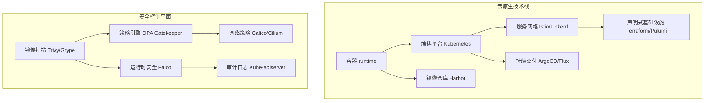
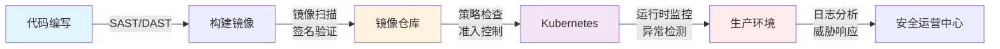

凌晨 2 点，某互联网公司的 Kubernetes 集群遭遇入侵。攻击者通过一个配置错误的 Dashboard 获取了集群管理员权限，进而横向移动到所有 Pod，最终导致核心数据库被拖库。这不是电影情节，而是 2018 年 Tesla 遭受的真实攻击。

云原生架构带来了前所未有的灵活性，但同时也引入了全新的安全挑战。当容器数量从几十个增长到数千个，当微服务之间的调用关系变得错综复杂，当基础设施变得不可变且短暂——传统的安全边界和方法论正在失效。

## 云原生的定义与技术基石

云原生（Cloud Native）不只是一种部署方式，而是一套完整的技术哲学。根据 CNCF 的定义，云原生技术具有以下四个核心特征：

**容器**：将应用程序及其依赖打包为标准化单元，每个容器拥有独立的文件系统、CPU、内存和进程空间。容器的轻量级和快速启动特性，使得动态扩缩容成为可能。

**微服务**：将单体应用拆分为独立部署、独立演进的服务单元。每个微服务拥有独立的生命周期，通过轻量级协议（通常是 HTTP/gRPC）进行通信。

**声明式 API**：用配置文件描述期望的系统状态，由系统自动完成状态调谐（Reconciliation）。Kubernetes 就是声明式 API 的典型实现。

**不可变基础设施**：一旦部署，基础设施不再被修改。任何变更都通过重新部署来实现，确保环境的一致性和可重复性。

## 云原生环境的安全挑战

云原生环境的安全挑战与传统环境有着本质区别。传统安全模型建立在清晰的边界之上——防火墙划分内网与外网，VPN 连接远程办公，IDS/IPS 监控边界流量。但云原生打破了这些边界：

**攻击面的指数级扩张**：一个拥有 100 个微服务的企业，任意两个服务之间都可能是潜在的通信路径。这意味着理论上存在 4950 条可能的攻击路径，远超传统架构的边界数量。

**短暂性与动态性**：容器的生命周期可能只有几分钟，IP 地址是动态分配的。传统基于 IP 的安全策略在这种环境下几乎失效。

**信任边界的变化**：在微服务架构中，服务之间的信任模型从「网络隔离」转变为「身份认证+最小权限」。每一请求都需要验证来源身份。

**供应链风险**：容器镜像可能来自公共仓库，层层依赖构成了复杂的供应链图谱。2021 年的 Log4Shell 漏洞影响了几十万个应用程序，而潜在的漏洞可能隐藏在任何一层依赖中。

## 云原生安全的整体策略

云原生安全需要采用「纵深防御」策略，在应用的每一层都部署相应的安全控制。

**构建时安全（Build）**：确保镜像来源可信，进行漏洞扫描，实施镜像签名，只允许经过验证的镜像部署到生产环境。

**部署时安全（Deploy）**：通过策略引擎（如 OPA Gatekeeper）强制执行安全基线，验证 Pod 安全配置，检查资源限制和网络策略。

**运行时安全（Runtime）**：监控系统行为，检测异常进程和网络活动，及时发现容器逃逸和横向移动。

## DevSecOps 在云原生中的实践

DevSecOps 将安全集成到 DevOps 全流程中，打破开发、安全、运维之间的壁垒。在云原生环境中，DevSecOps 体现在三个层面：

**文化层面**：安全不是安全团队的专属责任，而是每个工程师都需要具备的意识。在设计微服务架构时，开发团队需要考虑身份认证、授权、数据加密等安全需求。

**流程层面**：安全检查自动化，嵌入到 CI/CD 流水线中。代码扫描、镜像扫描、合规检查都应该在流水线中自动执行，发现问题自动阻断。

**技术层面**：采用安全的基础设施和工具链，基础设施即代码（IaC）确保安全配置可追溯、可审计、可重复。

## 容器安全的生命周期

容器安全需要覆盖其完整生命周期：

| 阶段 | 核心活动 | 主要工具 |
| --- | --- | --- |
| 开发 | 安全编码、依赖检查 | SonarQube、Snyk |
| 构建 | 镜像扫描、签名、构建加固 | Trivy、Grype、Cosign |
| 仓库 | 镜像签名验证、访问控制 | Harbor、Notary |
| 部署 | 策略检查、准入控制 | OPA Gatekeeper、Kyverno |
| 运行 | 行为监控、异常检测 | Falco、Sysdig |
| 响应 | 事件调查、影响范围分析 | Elasticsearch、Kibana |

## 云原生安全的成熟度评估

企业云原生安全成熟度通常分为四个等级：

**Level 1 - 基础级**：仅在构建时进行镜像扫描，运行时没有监控，依赖云服务商的基础安全能力。这个阶段的企业往往面临「裸奔」风险，攻击者入侵后几乎没有检测和阻止机制。

**Level 2 - 规范化**：建立了安全基线，通过 PSP/PSS 强制执行容器安全配置，启用审计日志，开始进行 RBAC 权限管理。大多数中型企业处于这个阶段。

**Level 3 - 主动防御**：部署了运行时安全监控（如 Falco），实施网络策略实现微隔离，开始进行定期渗透测试，建立安全事件的响应流程。

**Level 4 - 持续安全**：实现了完整的安全自动化，从代码到运行的每个环节都有安全验证，实现了威胁情报的实时集成，具备快速响应和恢复能力。

:::tip 评估建议
评估自身安全成熟度时，不要只看工具的部署情况，更要关注安全流程是否真正嵌入到业务流中。一个部署了完整工具链但从不处理告警的企业，实际上处于 Level 1。
:::

## CNCF 安全 Landscape

CNCF Landscape 收录了大量云原生安全相关的开源项目和商业产品。这些项目可以按功能分为以下几类：

**云原生安全防护**：包括 Falco（运行时安全）、OPA Gatekeeper（策略引擎）、Kyverno（Kubernetes 原生策略引擎）、Tetragon（基于 eBPF 的安全运行时）等。

**容器安全**：包括 Trivy（镜像扫描）、Grype（漏洞扫描）、Cosign（镜像签名）、Notary（镜像信任）等。

**供应链安全**：包括 Sigstore（签名与透明日志）、SLSA（供应链安全框架）、SBOM 工具链等。

**合规与评估**：包括 kube-bench（CIS 合规检查）、kube-hunter（渗透测试）、Polaris（配置验证）等。

:::info CNCF 项目成熟度
选择安全工具时，建议优先选择已晋升到 CNCF 毕业或孵化状态的项目。成熟的项目拥有更完善的社区支持、更频繁的安全更新和更广泛的实际生产验证。
:::

## 总结与延伸思考

云原生安全不是单一产品或单一技术能够解决的问题，它需要从文化、流程、技术三个维度进行系统性建设。传统的边界安全模型已经不适应云原生架构，「永不信任、始终验证」的零信任理念应该贯穿整个云原生技术栈。

如果企业正处于从传统架构向云原生架构迁移的过程中，建议采用「绞杀者模式」逐步演进，而不是一次性推翻重建。安全控制也应该随架构演进同步落地，避免出现「跑起来再补安全」的局面。

### 思考题

**问题 1**：云原生架构下，为什么传统的防火墙边界防护模式会失效？

参考答案

主要原因有三个：1）容器 IP 是动态分配的，传统防火墙基于 IP 的规则难以维护；2）微服务间通信频繁穿过传统防火墙边界，防火墙成为性能瓶颈；3）服务发现和动态路由使得网络拓扑时刻变化，静态规则无法适应。建议采用 Kubernetes NetworkPolicy 结合服务网格的 mTLS 来实现微隔离。

**问题 2**：DevSecOps 实施过程中，最常见的阻力来自哪个环节？如何克服？

参考答案

最常见的阻力来自开发团队的「安全阻碍交付」感知。当安全检查过于严格或告警缺乏上下文时，开发团队会视安全为障碍而非赋能。克服方法：1）将安全检查自动化嵌入流水线，不影响交付速度；2）安全告警提供明确的修复建议；3）建立安全冠军（Security Champion）机制，在每个开发团队培养安全意识；4）安全团队前移到设计阶段，而非只在交付阶段介入。

