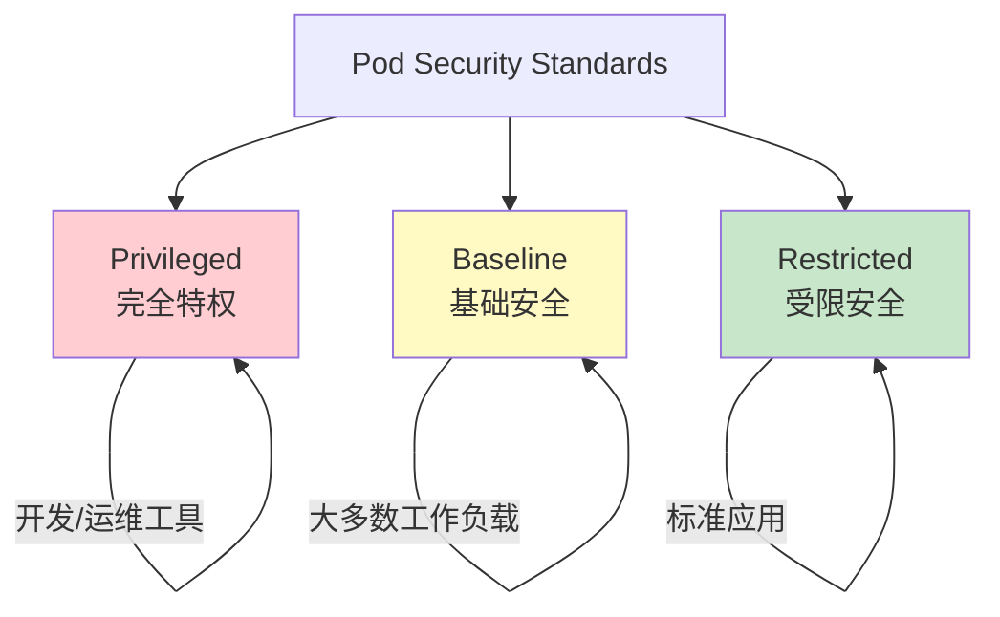

某公司安全团队部署了 Falco 运行时监控，期望检测容器异常行为。几天后，他们发现了一个严重问题：告警显示攻击者正在尝试 `mount` 系统调用——但他们已经在 Pod 配置中禁用了 mount 权限。

**问题在于配置没有生效**。他们配置的是 Pod 级别的 Security Context，但 Kubernetes 没有强制执行这些限制的机制。Security Context 需要 PSP（Pod Security Policy）或 PSS（Pod Security Standards）来强制执行。

## Pod 安全策略的历史

### PSP 的兴衰

Pod Security Policy（PSP）是 Kubernetes 早期提供的 Pod 安全配置强制执行机制。它通过 admission webhook 在 Pod 创建时验证并强制执行安全配置。

```yaml title="PSP 示例"
apiVersion: policy/v1beta1
kind: PodSecurityPolicy
metadata:
  name: restricted
spec:
  privileged: false
  seLinux:
    rule: RunAsAny
  supplementalGroups:
    rule: RunAsAny
  runAsUser:
    rule: RunAsAny
  fsGroup:
    rule: RunAsAny
  volumes:
    - '*'
  allowPrivilegeEscalation: false
```

**PSP 的局限性**：

- RBAC 模型复杂：PSP 本身不是资源对象，需要额外的 RBAC 配置
- 迁移困难：在启用了 PSP 的集群中迁移到无 PSP 环境需要仔细规划
- 维护成本高：PSP 配置与 Pod 规范分离，管理和同步困难

**PSP 被废弃**：由于上述问题，Kubernetes 1.21 将 PSP 标记为废弃，1.25 完全移除。

### PSS 的演进

Pod Security Standards（PSS）是 PSP 废弃后的官方替代方案。PSS 不是 webhook，而是定义了三种安全级别作为安全策略的基准。



## PSS 的三种级别

### Privileged（特权级）

完全特权，不施加任何限制。适用于需要系统级权限的组件，如网络插件、存储插件、监控 agent。

**使用场景**：

- Kubernetes CNI 插件（如 Calico、Weave）
- 存储 provisioner
- 节点级别的监控 agent
- 审计日志收集器

**风险**： Privileged 级别的 Pod 如果被攻破，攻击者可以：

- 挂载宿主文件系统
- 访问宿主网络栈
- 加载内核模块
- 修改系统配置

### Baseline（基线级）

提供合理的最小安全限制，适用于大多数非特权应用。限制最危险的配置，同时保持足够的兼容性。

**Baseline 级别要求**：

| 配置项 | Baseline 要求 |
| --- | --- |
| 特权容器 | 禁止 |
| 共享主机命名空间 | 禁止 |
| 权能提升 | 禁止 |
| root 写入 | 只读文件系统 |
| HostPath 卷 | 仅白名单目录 |
| Seccomp | 需要配置 |
| Capabilities | 禁止 SYS_ADMIN、NET_ADMIN 等 |

### Restricted（受限级）

更严格的限制，适用于需要更高级别安全隔离的应用。

**Restricted 级别额外要求**：

| 配置项 | Restricted 要求 |
| --- | --- |
| Seccomp | `RuntimeDefault` 或 `Localhost` |
| Capabilities | 只能添加 `NET_BIND_SERVICE` |
| 运行用户 | 非 root（UID `<` 10000） |
| 卷类型 | 只允许特定类型 |

## Security Context：Pod 和 Container 级别

Security Context 定义了 Pod 和容器的安全相关配置。有两个级别：

**Pod 级别 Security Context**：应用到 Pod 内的所有容器。

**Container 级别 Security Context**：覆盖容器级别的配置。

### Container 级别 Security Context

```yaml title="Container Security Context"
apiVersion: v1
kind: Pod
metadata:
  name: secure-app
spec:
  containers:
    - name: app
      image: myapp:latest
      securityContext:
        # 容器级别配置
        readOnlyRootFilesystem: true
        runAsNonRoot: true
        runAsUser: 1000
        runAsGroup: 1000
        allowPrivilegeEscalation: false
        privileged: false
        capabilities:
          drop:
            - ALL
          add:
            - NET_BIND_SERVICE
        seccompProfile:
          type: RuntimeDefault
```

### Pod 级别 Security Context

```yaml title="Pod Security Context"
apiVersion: v1
kind: Pod
metadata:
  name: secure-app
spec:
  securityContext:
    # Pod 级别配置
    runAsUser: 1000
    runAsGroup: 1000
    fsGroup: 1000
    supplementalGroups: [1000]
    seLinuxOptions:
      level: "s0:c123,c456"
    sysctls:
      - name: net.ipv4.ping_group_range
        value: "1000 1000"
```

## 关键 Security Context 配置

### 禁用特权模式

```yaml title="禁止特权容器"
securityContext:
  privileged: false
```

特权容器可以访问宿主机的所有设备，是最危险的安全配置之一。生产环境中的容器几乎不需要特权模式。

### 只读根文件系统

```yaml title="只读根文件系统"
securityContext:
  readOnlyRootFilesystem: true
```

如果应用需要写入临时文件，可以挂载 tmpfs：

```yaml title="挂载临时文件系统"
volumeMounts:
  - name: tmp
    mountPath: /tmp
volumes:
  - name: tmp
    emptyDir:
      medium: Memory
```

### 运行非 Root 用户

```yaml title="非 root 运行"
securityContext:
  runAsNonRoot: true
  runAsUser: 1000
  runAsGroup: 1000
```

在 Dockerfile 中也应该确保容器默认使用非 root 用户：

```dockerfile title="Dockerfile 非 root 用户"
FROM alpine:latest

# 创建应用用户
RUN adduser -D -u 1000 appuser

# 切换到非 root 用户
USER appuser

# 复制应用文件
COPY --chown=appuser:appuser app/ /app/

CMD ["./app"]
```

### 删除不必要的 Capabilities

Linux Capabilities 将 root 权限分解为独立单元。默认情况下，Docker 会添加一些 Capabilities。

```yaml title="删除所有 Capabilities"
securityContext:
  capabilities:
    drop:
      - ALL
    add:
      - NET_BIND_SERVICE  # 仅添加必要的
```

**高危 Capabilities 列表**：

| Capability | 风险 | 说明 |
| --- | --- | --- |
| `SYS_ADMIN` | 极高 | 允许大量系统管理操作 |
| `NET_ADMIN` | 高 | 允许网络配置修改 |
| `SYS_MODULE` | 极高 | 允许加载内核模块 |
| `DAC_READ_SEARCH` | 高 | 绕过文件权限检查 |
| `SYS_PTRACE` | 高 | 允许进程追踪 |

### Seccomp 配置文件

Seccomp（Secure Computing Mode）限制进程可以执行的系统调用。

```yaml title="使用 Seccomp RuntimeDefault"
securityContext:
  seccompProfile:
    type: RuntimeDefault
```

`RuntimeDefault` 使用容器运行时的默认 Seccomp 配置，通常会阻止约 44 个危险系统调用。

**自定义 Seccomp 配置**：

```yaml title="自定义 Seccomp 配置"
securityContext:
  seccompProfile:
    type: Localhost
    localhostProfile: profiles/my-custom-seccomp.json
```

### 完整配置示例

```yaml title="生产就绪 Security Context"
apiVersion: v1
kind: Pod
metadata:
  name: production-app
  labels:
    app: myapp
spec:
  securityContext:
    runAsUser: 1000
    runAsGroup: 1000
    fsGroup: 1000
    supplementalGroups: [1000]
  
  containers:
    - name: app
      image: myregistry.com/myapp:v1.0.0
      ports:
        - containerPort: 8080
      
      securityContext:
        readOnlyRootFilesystem: true
        runAsNonRoot: true
        runAsUser: 1000
        allowPrivilegeEscalation: false
        privileged: false
        capabilities:
          drop:
            - ALL
        seccompProfile:
          type: RuntimeDefault
      
      volumeMounts:
        - name: tmp
          mountPath: /tmp
        - name: cache
          mountPath: /var/cache/app
  
  volumes:
    - name: tmp
      emptyDir:
        medium: Memory
    - name: cache
      emptyDir:
        sizeLimit: 100Mi
```

## PSP 到 PSS 的迁移

Kubernetes 1.25 移除了 PSP，需要迁移到 PSS 或其他策略引擎。

### 迁移方案对比

| 方案 | 说明 | 适用场景 |
| --- | --- | --- |
| PSS（内置） | Kubernetes 原生的安全级别定义 | 简单需求 |
| OPA Gatekeeper | 策略即代码，功能强大 | 复杂策略 |
| Kyverno | Kubernetes 原生策略引擎 | 更习惯 K8s API |
| Kubewarden | Rust 编写的轻量策略引擎 | 资源敏感环境 |

### PSS 迁移步骤

**1. 审计当前 PSP 配置**

```bash title="查找当前 PSP 配置"
kubectl get psp -A
kubectl describe psp <psp-name>
```

**2. 确定每个命名空间的目标级别**

```bash title="标记命名空间的安全级别"
kubectl label namespace production \
  pod-security.kubernetes.io/enforce=baseline
kubectl label namespace production \
  pod-security.kubernetes.io/warn=restricted
kubectl label namespace production \
  pod-security.kubernetes.io/audit=restricted
```

**3. 在命名空间级别启用 PSS**

```yaml title="命名空间 PSS 配置"
apiVersion: v1
kind: Namespace
metadata:
  name: production
  labels:
    pod-security.kubernetes.io/enforce: baseline
    pod-security.kubernetes.io/enforce-version: latest
    pod-security.kubernetes.io/warn: restricted
    pod-security.kubernetes.io/warn-version: latest
    pod-security.kubernetes.io/audit: restricted
    pod-security.kubernetes.io/audit-version: latest
```

**4. 验证迁移**

```bash title="检查不符合要求的 Pod"
kubectl get pod -A \
  -o jsonpath='{range .items[*]}{
    "namespace":{.metadata.namespace},
    "pod":{.metadata.name},
    "warnings":{@.status.warning}
  }{"\n"}{end}'
```

### OPA Gatekeeper 迁移

对于需要更复杂策略的场景，迁移到 OPA Gatekeeper：

```yaml title="Gatekeeper PSP 风格约束"
apiVersion: constraints.gatekeeper.sh/v1beta1
kind: K8sPSPPrivilegedContainer
metadata:
  name: no-privileged-container
spec:
  match:
    kinds:
      - apiGroups: [""]
        kinds: ["Pod"]
```

:::tip 迁移建议
迁移前务必进行充分测试。使用 `warn` 和 `audit` 模式先收集警告，确保不会阻断现有工作负载，再逐步切换到 `enforce` 模式。
:::

## 总结与延伸思考

Pod 安全配置是云原生安全的基础。从 PSP 迁移到 PSS/策略引擎是一个需要仔细规划的过程，但也是提升安全状态的机会。

实践中，建议：

**渐进式迁移**：先启用 `warn` 和 `audit` 模式，收集不符合要求的 Pod 列表，然后逐步修复。

**明确命名空间级别**：不同命名空间可能有不同的安全要求（如 production vs development），确保配置与业务需求匹配。

**持续审计**：安全配置需要持续检查和优化，配置漂移是常见问题。

### 思考题

**问题 1**：为什么说 PSP 被废弃不是因为它不起作用，而是因为它难以使用？
<details>
<summary>参考答案</summary>

PSP 的设计理念是正确的，但实现有几个根本问题：1）PSP 配置与 Pod 规范分离，需要两套 YAML 管理；2）RBAC 模型复杂——PSP 本身不是资源对象，需要通过 RBAC 控制谁可以创建 PSP 和谁可以使��� PSP；3）幂等性差——PSP 的验证结果不确定，难以调试；4）迁移成本高——从启用 PSP 的集群迁移出去需要重新设计策略。这些问题导致用户倾向于不使用 PSP 而不是正确使用它。
</details>

**问题 2**：如果应用确实需要特权操作（如使用 FUSE 文件系统），应该如何处理？
<details>
<summary>参考答案</summary>

对于需要特权操作的应用：1）首先评估是否有用户空间替代方案；2）如果必须使用特权，考虑使用特殊工具类容器镜像；3）限制特权 Pod 的部署范围，使用专用节点池（Node Taint/Toleration）；4）使用 Kata Containers 或 gVisor 等沙箱运行时提供更强的隔离；5）无论是否使用特权，都应该使用 NetworkPolicy 限制特权 Pod 的网络访问；6）启用额外的运行时监控（如 Falco）检测特权容器中的异常行为。
</details>
