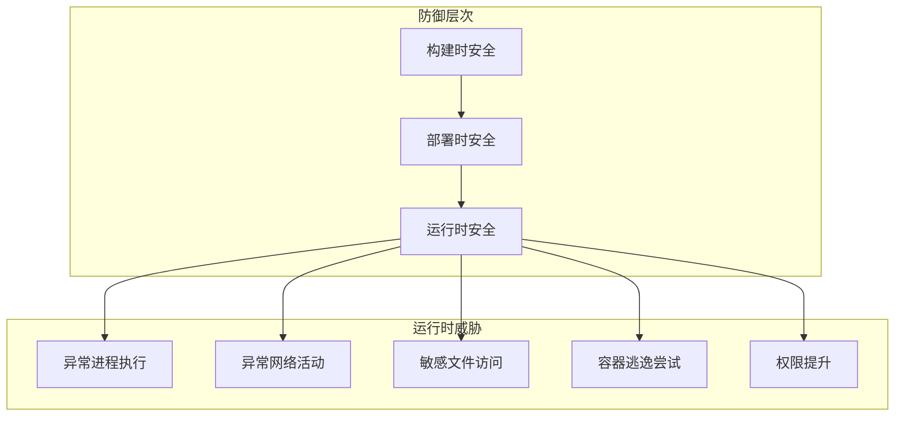
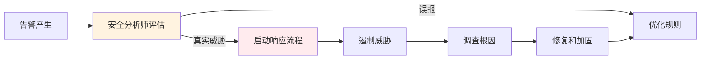

构建时无漏洞、签名验证通过、Pod 安全策略配置正确——一切都看起来很安全。然后攻击者通过被攻破的第三方服务获得了 Kubernetes API 的临时凭证，在容器内执行了反弹 Shell 命令，建立持久化后门，并通过容器逃逸获取宿主机权限。

这个攻击链中，每一个环节的「安全检查」都通过了。但最终结果仍然是失陷。问题出在哪里？

**问题在于静态检查永远无法覆盖动态威胁**。无论构建时多么安全，运行时的行为仍然需要被监控和检测。这就是运行时安全的价值。

## 运行时安全的重要性

运行时安全是云原生安全防护的最后一道防线。即使镜像扫描通过、签名验证通过、准入控制通过，攻击者仍可能在运行时找到机会。

**零日漏洞**：当新漏洞被发现时，扫描器数据库可能还没有更新。运行时监控可以在扫描器更新之前发现异常行为。

**配置漂移**：Kubernetes 配置在运行过程中可能被意外或恶意修改。运行时监控可以检测这些变化。

**内部威胁**：拥有合法访问权限的用户可能做出恶意行为。运行时监控可以检测异常操作。

**供应链攻击**：即使上游供应链被攻破，恶意行为在运行时仍可能被检测到。



## 容器运行时的安全监控

容器运行时（container runtime）是容器生命周期管理的核心组件。Kubernetes 支持多种运行时：containerd、Docker（已废弃）、CRI-O 等。

### 运行时安全的关键监控点

**进程活动**：容器内启动的新进程、特权进程、shell 进程。

**文件系统访问**：敏感文件（`/etc/shadow`、`/etc/passwd`）的读取、可疑文件写入。

**网络活动**：到恶意 IP 的连接、异常的 DNS 查询、内部服务之间的异常通信。

**系统调用**：特权系统调用、capable/syscall 事件。

### Falco 的优势

Falco 是 CNCF 毕业项目，专门用于容器运行时安全监控。它的优势包括：

**基于规则**：使用 YAML 格式定义告警规则，学习成本低。

**低开销**：通过 eBPF 或内核模块捕获事件，开销控制在 5% 以内。

**深度集成**：与 Kubernetes、云原生生态有深度集成。

**活跃社区**：大量预置规则和开箱即用的检测策略。

## Falco 的架构

Falco 的核心架构由两部分组成：事件捕获层和规则引擎层。

### 事件捕获层

Falco 支持两种事件捕获方式：

**eBPF 探针**：通过 eBPF（Extended Berkeley Packet Filter）在内核级别捕获系统调用。eBPF 方式性能更好，安全性更高，是推荐的生产部署方式。

```bash title="使用 eBPF 探针启动 Falco"
falco --cri /run/containerd/containerd.sock \
      -o engine.kind=ebpf \
      -o engine.ebpf.program_name=falco_event_processor
```

**内核模块**：传统方式，通过加载内核模块捕获系统调用。需要编译匹配内核版本的模块，安装过程较复杂。

```bash title="安装内核模块"
# 编译内核模块
falco-driver-loader

# 加载内核模块
modprobe falco
```

### 规则引擎层

捕获的系统调用事件被送往规则引擎，与预定义的告警规则进行匹配。

```yaml title="Falco 规则示例"
- rule: Shell spawned in a container
  desc: A shell was spawned inside a container
  condition: >
    spawned_process and
    container and
    shell_procs
  output: >
    Shell spawned in container
    (user=%user.name container_name=%container.name
    shell=%proc.name parent=%proc.pname)
  priority: WARNING
```

## Falco 规则编写

Falco 规则采用 YAML 格式，包含以下核心字段：

### 规则结构

```yaml title="完整规则结构"
- rule: <rule_name>              # 规则名称，唯一标识
  desc: <description>           # 规则描述，说明检测目的
  condition: <expression>        # 触发条件，使用 Falco 语法
  output: <output_string>        # 告警输出格式
  priority: <priority_level>    # 告警优先级
  exceptions: <exceptions>      # 例外情况
  tags: [tags]                  # 标签，用于分类
```

### 条件表达式语法

Falco 使用字段名称构建条件表达式：

| 字段类型 | 示例字段 | 说明 |
| --- | --- | --- |
| 容器信息 | `container.id`、`container.name` | 容器元数据 |
| 进程信息 | `proc.name`、`proc.pname` | 进程名称和父进程 |
| 文件信息 | `fd.name`、`fd.type` | 文件描述符信息 |
| 系统调用 | `syscall.type` | 系统调用类型 |
| 用户信息 | `user.name`、`user.uid` | 用户信息 |
| 时间信息 | `evt.time` | 事件时间戳 |

### Java 进程监控规则

```yaml title="监控 Java 进程的异常行为"
# 检测可疑的 Java 进程操作
- rule: Suspicious Java Process Activity
  desc: Detect suspicious activity in Java processes
  condition: >
    container and
    proc.name = java and
    (
      # 检测本地端口绑定（可能的反弹 Shell）
      ( outbound and fd.lport > 10000 ) or
      # 检测执行外部命令
      ( proc.name = "bash" and proc.pname = java ) or
      # 检测写入可疑路径
      ( fd.name startswith "/tmp" and open_write )
    )
  output: >
    Suspicious Java activity detected
    (container=%container.name proc=%proc.name
    cmd=%proc.cmdline user=%user.name)
  priority: CRITICAL
  tags: [network, java, runtime]

# 检测 Java 应用的敏感文件访问
- rule: Java Sensitive File Access
  desc: Java process accessing sensitive files
  condition: >
    container and
    proc.name = java and
    fd.name in (
      /etc/shadow,
      /etc/passwd,
      /root/.ssh/,
      /home/*/.ssh/
    )
  output: >
    Java process accessing sensitive file
    (container=%container.name file=%fd.name user=%user.name)
  priority: HIGH
```

## Falco 的告警类型

Falco 提供了丰富的预置规则，覆盖常见的容器安全威胁。

### 异常进程检测

```yaml title="Shell 进程检测"
- rule: Terminal shell in container
  desc: A shell was spawned in a container
  condition: >
    spawned_process and container and
    shell_in_container
  output: >
    Shell spawned in container
    (user=%user.name container=%container.image.repository
    shell=%proc.name parent=%proc.pname)
  priority: WARNING
```

### 异常网络访问检测

```yaml title="出站连接检测"
- rule: Unexpected outbound connection
  desc: Container making unexpected outbound connections
  condition: >
    container and
    outbound and
    not allowed_outbound_connections
  output: >
    Unexpected outbound connection
    (container=%container.name dest=%fd.rip
    dest_port=%fd.rport proto=%fd.etype)
  priority: NOTICE
```

### 敏感文件访问检测

```yaml title="敏感文件写入检测"
- rule: Write below etc
  desc: File descriptor opened for writing below /etc
  condition: >
    open_write and
    container and
    fd.name startswith /etc/
  output: >
    File opened for writing below /etc
    (container=%container.name file=%fd.name user=%user.name)
  priority: WARNING
```

## Falco 的部署模式

### DaemonSet 模式

在生产环境中，推荐使用 DaemonSet 模式部署 Falco，确保每个节点都有一个 Falco 实例。

```yaml title="Falco DaemonSet 部署"
apiVersion: apps/v1
kind: DaemonSet
metadata:
  name: falco
  namespace: falco
spec:
  selector:
    matchLabels:
      app: falco
  template:
    metadata:
      labels:
        app: falco
    spec:
      serviceAccountName: falco
      hostNetwork: true
      containers:
        - name: falco
          image: falcosecurity/falco:latest
          securityContext:
            privileged: true
          env:
            - name: FALCO_BPF_PROBE
              value: ""
            - name: FALCO_EMBEDDED_BPF
              value: "true"
          volumeMounts:
            - name: /var/run/docker.sock
              mountPath: /var/run/docker.sock
            - name: /host/proc
              mountPath: /host/proc
              readOnly: true
            - name: /host/etc
              mountPath: /host/etc
              readOnly: true
          resources:
            requests:
              cpu: 100m
              memory: 128Mi
            limits:
              cpu: 500m
              memory: 512Mi
      volumes:
        - name: /var/run/docker.sock
          hostPath:
            path: /var/run/docker.sock
        - name: /host/proc
          hostPath:
            path: /host/proc
        - name: /host/etc
          hostPath:
            path: /host/etc
```

### Sidecar 模式

Sidecar 模式适用于需要隔离监控的场景，每个受保护的 Pod 旁边运行一个 Falco 实例。

```yaml title="Falco Sidecar 部署"
apiVersion: v1
kind: Pod
metadata:
  name: myapp-with-falco
spec:
  containers:
    - name: myapp
      image: myapp:latest
    - name: falco-sidecar
      image: falcosecurity/falco:latest
      securityContext:
        privileged: true
```

## Falco 与 SIEM 的集成

Falco 产生的告警可以发送到各种 SIEM（安全信息与事件管理）系统进行集中分析。

### Kubernetes 告警集成

```yaml title="Falco 与 Alertmanager 集成"
apiVersion: v1
kind: ConfigMap
metadata:
  name: falco-config
  namespace: falco
data:
  falco.yaml: |
    json_output: true
    json_include_output_property: true
    
  falco_rules.yaml: |
    # 内置规则
    
  falco_rules.local.yaml: |
    # 自定义规则
```

### 告警到 Elasticsearch

```yaml title="Filebeat 收集 Falco 日志"
apiVersion: beat.k8s.elastic.co/v1beta1
kind: Beat
metadata:
  name: falco-beat
  namespace: falco
spec:
  type: filebeat
  version: 8.10.0
  elasticsearchRef:
    clusterID: quickstart
  config:
    filebeat.inputs:
      - type: container
        paths:
          - /var/log/falco*.log
        processors:
          - add_kubernetes_metadata: {}
```

## 其他运行时安全工具

### Sysdig

Sysdig 是另一个功能强大的运行时安全工具，提供比 Falco 更丰富的功能。

| 特性 | Falco | Sysdig |
| --- | --- | --- |
| 核心功能 | 系统调用监控 | 系统调用捕获 + 规则引擎 |
| 架构 | 规则引擎 | Falco + Sysdig Inspect UI |
| 商业版本 | Falco（开源） | Sysdig Secure（商业） |
| 性能开销 | ~5% | ~5-10% |
| 云支持 | Kubernetes | Kubernetes + 云原生 |

### Tetragon

Tetragon 是 Cilium 项目的一部分，使用 eBPF 实现运行时安全监控，与网络层深度集成。

### Capsule8

Capsule8（现 Sophos）提供商业化的容器和 Kubernetes 运行时安全解决方案，强调低误报率和实时检测能力。

## 运行时安全策略的持续改进

运行时安全不是一劳永逸的工作，需要持续优化。

**告警调优**：定期审查告警，移除低价值告警，调整告警阈值。告警疲劳是运行时安全的大敌。

**规则迭代**：根据新发现的攻击模式和业务场景，持续更新检测规则。

**响应流程**：建立明确的安全事件响应流程，确保告警有人处理。



:::tip 告警优化建议
初始阶段可能会产生大量告警。建议采用「先全收集、后精选」策略：前两周只收集不告警，分析数据后建立真正重要的告警规则。
:::

## 总结与延伸思考

运行时安全是云原生安全防护体系的重要组成部分，它弥补了静态检查的不足，能够检测运行时的新威胁和异常行为。

Falco 作为 CNCF 毕业项目，是运行时安全的首选工具。它的规则编写相对简单，生态集成良好，社区活跃。对于有更强需求的企业，可以考虑 Sysdig Secure 等商业方案。

运行时安全的成功关键不在于工具本身，而在于告警的响应机制。再完善的监控，如果告警无人处理，就是无效监控。

### 思考题

**问题 1**：为什么说运行时安全是「最后一道防线」？
<details>
<summary>参考答案</summary>

因为即使前序安全检查（构建时扫描、签名验证、准入控制）都通过，攻击者仍可能在运行时找到机会：1）零日漏洞：构建时未知的漏洞；2）配置漂移：运行中的配置被修改；3）内部威胁：合法用户的恶意行为；4）供应链攻击的延迟效应。运行时安全监控这些阶段的行为异常，提供最后的检测和响应机会。
</details>

**问题 2**：如何设计一个避免告警疲劳的运行时安全策略？
<details>
<summary>参考答案</summary>

告警疲劳会导致安全团队忽视真实告警。设计策略：1）分层告警：将告警分为 CRITICAL/HIGH/NOTICE，只有前两级触发即时响应；2）告警聚合：使用 SOAR 平台聚合相关告警，减少重复告警；3）上下文丰富：每个告警包含足够的上下文信息，帮助分析师快速判断真伪；4）自动响应：对于低风险告警自动执行标准化响应（如隔离 Pod）；5）持续调优：每月审查告警，移除低价值告警，调整阈值。
</details>
